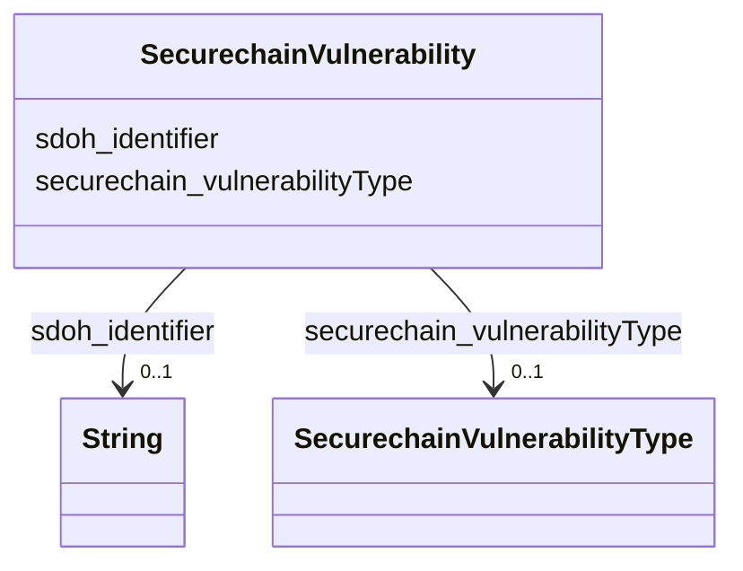

# Class: TODO -- what's a good name for what this class (type) describes? (securechain_Vulnerability)


_TODO -- tell the world what this class (type) describes._


URI: [securechain:Vulnerability](https://w3id.org/secure-chain/Vulnerability)





<!-- no inheritance hierarchy -->


## Slots

| Name | Cardinality and Range | Description | Inheritance |
| ---  | --- | --- | --- |
| [securechain_vulnerabilityType](../slots/securechain_vulnerabilityType.md) | 0..1 <br/> [SecurechainVulnerabilityType](../classes/SecurechainVulnerabilityType.md) | TODO -- tell the world what this slot (predicate) describes | direct |
| [sdoh_identifier](../slots/sdoh_identifier.md) | 0..1 <br/> [xsd:string](http://www.w3.org/2001/XMLSchema#string) | TODO -- tell the world what this slot (predicate) describes | direct |


## Usages

| used by | used in | type | used |
| ---  | --- | --- | --- |
| [SecurechainHardwareVersion](../classes/SecurechainHardwareVersion.md) | [securechain_vulnerableTo](../slots/securechain_vulnerableTo.md) | any_of[range] | [SecurechainVulnerability](../classes/SecurechainVulnerability.md) |
| [SecurechainHardwareVersion](../classes/SecurechainHardwareVersion.md) | [securechain_vulnerableTo](../slots/securechain_vulnerableTo.md) | any_of[range] | [SecurechainVulnerability](../classes/SecurechainVulnerability.md) |
| [SecurechainSoftwareVersion](../classes/SecurechainSoftwareVersion.md) | [securechain_vulnerableTo](../slots/securechain_vulnerableTo.md) | any_of[range] | [SecurechainVulnerability](../classes/SecurechainVulnerability.md) |
| [SecurechainSoftwareVersion](../classes/SecurechainSoftwareVersion.md) | [securechain_vulnerableTo](../slots/securechain_vulnerableTo.md) | any_of[range] | [SecurechainVulnerability](../classes/SecurechainVulnerability.md) |


## Examples

| Value |
| --- |
| securechain:Vulnerability/CVE-2022-1920 |

## TODOs

* TODO -- Todos for this class go here
* or you can delete the todos
* if you think the class is perfect.

## Identifier and Mapping Information


### Schema Source


* from schema: secure-chain-kg/develop


## Mappings

| Mapping Type | Mapped Value |
| ---  | ---  |
| self | securechain:Vulnerability |
| native | secure-chain-kg/develop/:SecurechainVulnerability |


## LinkML Source

<!-- TODO: investigate https://stackoverflow.com/questions/37606292/how-to-create-tabbed-code-blocks-in-mkdocs-or-sphinx -->

### Direct

<details>
```yaml
name: securechain_Vulnerability
description: TODO -- tell the world what this class (type) describes.
title: TODO -- what's a good name for what this class (type) describes?
todos:
- TODO -- Todos for this class go here
- or you can delete the todos
- if you think the class is perfect.
notes:
- There are 259334 instances of this class.
examples:
- value: securechain:Vulnerability/CVE-2022-1920
from_schema: secure-chain-kg/develop
slots:
- securechain_vulnerabilityType
- sdoh_identifier
class_uri: securechain:Vulnerability

```
</details>

### Induced

<details>
```yaml
name: securechain_Vulnerability
description: TODO -- tell the world what this class (type) describes.
title: TODO -- what's a good name for what this class (type) describes?
todos:
- TODO -- Todos for this class go here
- or you can delete the todos
- if you think the class is perfect.
notes:
- There are 259334 instances of this class.
examples:
- value: securechain:Vulnerability/CVE-2022-1920
from_schema: secure-chain-kg/develop
attributes:
  securechain_vulnerabilityType:
    name: securechain_vulnerabilityType
    description: TODO -- tell the world what this slot (predicate) describes.
    todos:
    - TODO -- Todos for this slot go here
    - or you can delete the todos
    - if you think the class is perfect.
    comments:
    - 177404 occurrences with subject type securechain_Vulnerability and object type
      securechain_VulnerabilityType.
    examples:
    - value: securechain:Vulnerability/CVE-2021-40791 securechain:vulnerabilityType
        securechain:VulnerabilityType/CWE-125
    from_schema: secure-chain-kg/develop
    rank: 1000
    slot_uri: securechain:vulnerabilityType
    alias: securechain_vulnerabilityType
    owner: securechain_Vulnerability
    domain_of:
    - securechain_Vulnerability
    range: securechain_VulnerabilityType
  sdoh_identifier:
    name: sdoh_identifier
    description: TODO -- tell the world what this slot (predicate) describes.
    todos:
    - TODO -- Todos for this slot go here
    - or you can delete the todos
    - if you think the class is perfect.
    comments:
    - 259334 occurrences with subject type securechain_Vulnerability and object type
      string.
    - 30434 occurrences with subject type sdoh_Person and object type string.
    - 445 occurrences with subject type securechain_VulnerabilityType and object type
      string.
    - 887 occurrences with subject type sdoh_Organization and object type string.
    - 20 occurrences with subject type sdoh_CreativeWork and object type string.
    examples:
    - value: securechain:Vulnerability/CVE-2023-52458 sdoh:identifier CVE-2023-52458
    - value: schema:Person/Touhou-fan sdoh:identifier Touhou-fan
    - value: securechain:VulnerabilityType/CWE-842 sdoh:identifier CWE-842
    - value: schema:Organization/Basecamp sdoh:identifier Q36908
    - value: securechain:License/bsl-1.0 sdoh:identifier bsl-1.0
    from_schema: secure-chain-kg/develop
    rank: 1000
    slot_uri: sdoh:identifier
    alias: sdoh_identifier
    owner: securechain_Vulnerability
    domain_of:
    - securechain_Vulnerability
    - securechain_VulnerabilityType
    - sdoh_CreativeWork
    - sdoh_Organization
    - sdoh_Person
    range: string
class_uri: securechain:Vulnerability

```
</details>