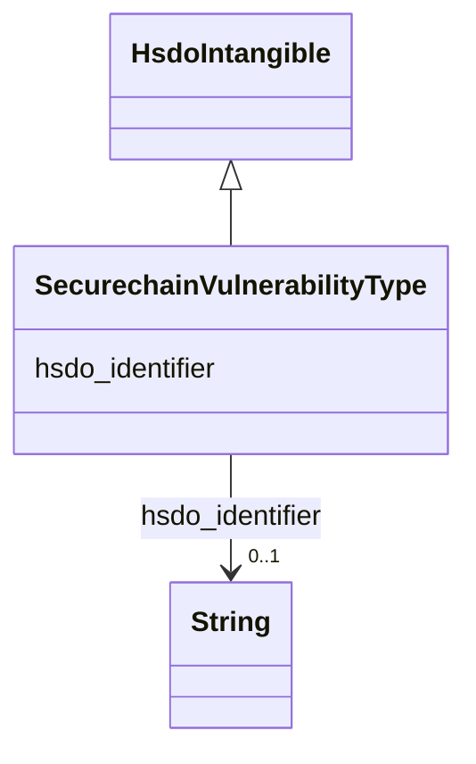

# Class: No class (type) name specified (securechain_VulnerabilityType)


_No class (type) description specified_


This class occurs 445 times.


URI: [securechain:VulnerabilityType](https://w3id.org/secure-chain/VulnerabilityType)





## Inheritance
* [HsdoIntangible](../classes/HsdoIntangible.md)
    * **SecurechainVulnerabilityType**


## Slots

| Name | Cardinality and Range | Description | Inheritance | Occurrences |
| ---  | --- | --- | --- | --- |
| [hsdo_identifier](../slots/hsdo_identifier.md) | 0..1 <br/> [xsd:string](http://www.w3.org/2001/XMLSchema#string) | The identifier property represents any kind of identifier for any kind of [[T... <br/>  | direct | 445 |


## Usages

| used by | used in | type | used |
| ---  | --- | --- | --- |
| [SecurechainVulnerability](../classes/SecurechainVulnerability.md) | [securechain_vulnerabilityType](../slots/securechain_vulnerabilityType.md) | range | [SecurechainVulnerabilityType](../classes/SecurechainVulnerabilityType.md) |


## LinkML Source

<!-- TODO: investigate https://stackoverflow.com/questions/37606292/how-to-create-tabbed-code-blocks-in-mkdocs-or-sphinx -->

### Direct

<details>

```yaml
name: securechain_VulnerabilityType
conforms_to: No schema conformance document specified
annotations:
  count:
    tag: count
    value: 445
description: No class (type) description specified
title: No class (type) name specified
from_schema: secure-chain-kg
rank: 1000
is_a: hsdo_Intangible
slots:
- hsdo_identifier
slot_usage:
  hsdo_identifier:
    name: hsdo_identifier
    annotations:
      string:
        tag: string
        value: 445
class_uri: securechain:VulnerabilityType

```
</details>

### Induced

<details>

```yaml
name: securechain_VulnerabilityType
conforms_to: No schema conformance document specified
annotations:
  count:
    tag: count
    value: 445
description: No class (type) description specified
title: No class (type) name specified
from_schema: secure-chain-kg
rank: 1000
is_a: hsdo_Intangible
slot_usage:
  hsdo_identifier:
    name: hsdo_identifier
    annotations:
      string:
        tag: string
        value: 445
attributes:
  hsdo_identifier:
    name: hsdo_identifier
    annotations:
      string:
        tag: string
        value: 445
    description: 'The identifier property represents any kind of identifier for any
      kind of [[Thing]], such as ISBNs, GTIN codes, UUIDs etc. Schema.org provides
      dedicated properties for representing many of these, either as textual strings
      or as URL (URI) links. See [background notes](/docs/datamodel.html#identifierBg)
      for more details.␊        '
    title: identifier
    examples:
    - object:
        example_object: 0----0
        example_object_type: string
        example_predicate: hsdo:identifier
        example_subject: schema:Person/0----0
        example_subject_type: hsdo_Person
    - object:
        example_object: CVE-1999-0043
        example_object_type: string
        example_predicate: hsdo:identifier
        example_subject: securechain:Vulnerability/CVE-1999-0043
        example_subject_type: securechain_Vulnerability
    - object:
        example_object: CWE-1
        example_object_type: string
        example_predicate: hsdo:identifier
        example_subject: securechain:VulnerabilityType/CWE-1
        example_subject_type: securechain_VulnerabilityType
    - object:
        example_object: Q2150861
        example_object_type: string
        example_predicate: hsdo:identifier
        example_subject: schema:Organization/1Password
        example_subject_type: hsdo_Organization
    - object:
        example_object: 0bsd
        example_object_type: string
        example_predicate: hsdo:identifier
        example_subject: securechain:License/0bsd
        example_subject_type: hsdo_CreativeWork
    from_schema: secure-chain-kg
    rank: 1000
    slot_uri: hsdo:identifier
    alias: hsdo_identifier
    owner: securechain_VulnerabilityType
    domain_of:
    - hsdo_CreativeWork
    - hsdo_Organization
    - hsdo_Person
    - securechain_Vulnerability
    - securechain_VulnerabilityType
    range: string
class_uri: securechain:VulnerabilityType

```
</details>