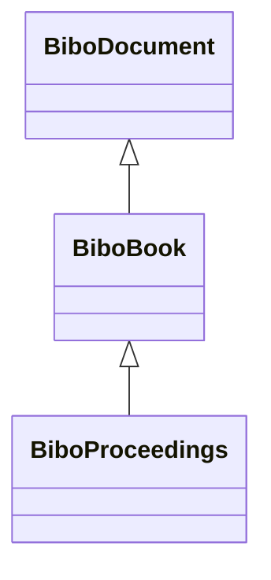

# Class: Book (bibo_Book)


_A written or printed work of fiction or nonfiction, usually on sheets of paper fastened or bound together within covers._


This class occurs 2 times.


URI: [bibo:Book](http://purl.org/ontology/bibo/Book)





## Inheritance
* [BiboDocument](../classes/BiboDocument.md)
    * **BiboBook**
        * [BiboProceedings](../classes/BiboProceedings.md)


## Slots

| Name | Cardinality and Range | Description | Inheritance | Occurrences |
| ---  | --- | --- | --- | --- |


## LinkML Source

<!-- TODO: investigate https://stackoverflow.com/questions/37606292/how-to-create-tabbed-code-blocks-in-mkdocs-or-sphinx -->

### Direct

<details>

```yaml
name: bibo_Book
description: A written or printed work of fiction or nonfiction, usually on sheets
  of paper fastened or bound together within covers.
title: Book
from_schema: okns:bibo
source: http://purl.org/ontology/bibo/
is_a: bibo_Document
class_uri: bibo:Book

```
</details>

### Induced

<details>

```yaml
name: bibo_Book
description: A written or printed work of fiction or nonfiction, usually on sheets
  of paper fastened or bound together within covers.
title: Book
from_schema: okns:bibo
source: http://purl.org/ontology/bibo/
is_a: bibo_Document
class_uri: bibo:Book

```
</details>