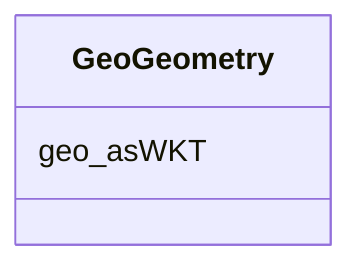

# Class: No class (type) name specified (geo_Geometry)


_No class (type) description specified_


This class occurs 47 times.


URI: [geo:Geometry](http://www.opengis.net/ont/geosparql#Geometry)





<!-- no inheritance hierarchy -->


## Slots

| Name | Cardinality and Range | Description | Inheritance | Occurrences |
| ---  | --- | --- | --- | --- |
| [geo_asWKT](../slots/geo_asWKT.md) | 0..1 <br/> [GeoWktLiteral](../types/GeoWktLiteral.md) | No slot (predicate) description specified <br/>  | direct | 47 |


## Usages

| used by | used in | type | used |
| ---  | --- | --- | --- |
| [SockgSite](../classes/SockgSite.md) | [geo_hasGeometry](../slots/geo_hasGeometry.md) | range | [GeoGeometry](../classes/GeoGeometry.md) |


## LinkML Source

<!-- TODO: investigate https://stackoverflow.com/questions/37606292/how-to-create-tabbed-code-blocks-in-mkdocs-or-sphinx -->

### Direct

<details>

```yaml
name: geo_Geometry
conforms_to: No schema conformance document specified
annotations:
  count:
    tag: count
    value: 47
description: No class (type) description specified
title: No class (type) name specified
from_schema: soc-kg
rank: 1000
slots:
- geo_asWKT
slot_usage:
  geo_asWKT:
    name: geo_asWKT
    annotations:
      geo_wktLiteral:
        tag: geo_wktLiteral
        value: 47
class_uri: geo:Geometry

```
</details>

### Induced

<details>

```yaml
name: geo_Geometry
conforms_to: No schema conformance document specified
annotations:
  count:
    tag: count
    value: 47
description: No class (type) description specified
title: No class (type) name specified
from_schema: soc-kg
rank: 1000
slot_usage:
  geo_asWKT:
    name: geo_asWKT
    annotations:
      geo_wktLiteral:
        tag: geo_wktLiteral
        value: 47
attributes:
  geo_asWKT:
    name: geo_asWKT
    annotations:
      geo_wktLiteral:
        tag: geo_wktLiteral
        value: 47
    description: No slot (predicate) description specified
    examples:
    - object:
        example_object: POLYGON((-95.801811 45.684633, -95.799659 45.684633, -95.799659
          45.687024, -95.801811 45.687024, -95.801811 45.684633))
        example_object_type: geo_wktLiteral
        example_predicate: geo:asWKT
        example_subject: sockg:individuals/geometry_ABP
        example_subject_type: geo_Geometry
    from_schema: soc-kg
    rank: 1000
    slot_uri: geo:asWKT
    alias: geo_asWKT
    owner: geo_Geometry
    domain_of:
    - geo_Geometry
    range: geo_wktLiteral
class_uri: geo:Geometry

```
</details>