# Class: HttpWww.semanticweb.orgTrashOntologies20255Untitled-ontology-278Amendment


This class occurs 47106 times.


URI: [http://www.semanticweb.org/trash/ontologies/2025/5/untitled-ontology-278/Amendment](http://www.semanticweb.org/trash/ontologies/2025/5/untitled-ontology-278/Amendment)

```mermaid
 classDiagram
    class HttpWww.semanticweb.orgTrashOntologies20255Untitled-ontology-278Amendment
    click HttpWww.semanticweb.orgTrashOntologies20255Untitled-ontology-278Amendment href "../HttpWww.semanticweb.orgTrashOntologies20255Untitled-ontology-278Amendment"
      HttpWww.semanticweb.orgTrashOntologies20255Untitled-ontology-278Amendment : http___www.semanticweb.org_trash_ontologies_2025_5_untitled_ontology_278_hasAmendmentType
        
          
    
    
    HttpWww.semanticweb.orgTrashOntologies20255Untitled-ontology-278Amendment --> "0..1" HttpWww.semanticweb.orgTrashOntologies20255Untitled-ontology-278AmendmentType : http___www.semanticweb.org_trash_ontologies_2025_5_untitled_ontology_278_hasAmendmentType
    click HttpWww.semanticweb.orgTrashOntologies20255Untitled-ontology-278AmendmentType href "../HttpWww.semanticweb.orgTrashOntologies20255Untitled-ontology-278AmendmentType"

        
      HttpWww.semanticweb.orgTrashOntologies20255Untitled-ontology-278Amendment : http___www.semanticweb.org_trash_ontologies_2025_5_untitled_ontology_278_hasCrop
        
          
    
    
    HttpWww.semanticweb.orgTrashOntologies20255Untitled-ontology-278Amendment --> "0..1" HttpsLod.nal.usda.govNalt7140 : http___www.semanticweb.org_trash_ontologies_2025_5_untitled_ontology_278_hasCrop
    click HttpsLod.nal.usda.govNalt7140 href "../HttpsLod.nal.usda.govNalt7140"

        
      HttpWww.semanticweb.orgTrashOntologies20255Untitled-ontology-278Amendment : http___www.semanticweb.org_trash_ontologies_2025_5_untitled_ontology_278_hasMeasurement
        
          
    
    
    HttpWww.semanticweb.orgTrashOntologies20255Untitled-ontology-278Amendment --> "0..1" HttpWww.semanticweb.orgTrashOntologies20255Untitled-ontology-278Measurement : http___www.semanticweb.org_trash_ontologies_2025_5_untitled_ontology_278_hasMeasurement
    click HttpWww.semanticweb.orgTrashOntologies20255Untitled-ontology-278Measurement href "../HttpWww.semanticweb.orgTrashOntologies20255Untitled-ontology-278Measurement"

        
      HttpWww.semanticweb.orgTrashOntologies20255Untitled-ontology-278Amendment : http___www.semanticweb.org_trash_ontologies_2025_5_untitled_ontology_278_hasPesticideActiveIngredient
        
          
    
    
    HttpWww.semanticweb.orgTrashOntologies20255Untitled-ontology-278Amendment --> "0..1" HttpWww.semanticweb.orgTrashOntologies20255Untitled-ontology-278ActiveIngredient : http___www.semanticweb.org_trash_ontologies_2025_5_untitled_ontology_278_hasPesticideActiveIngredient
    click HttpWww.semanticweb.orgTrashOntologies20255Untitled-ontology-278ActiveIngredient href "../HttpWww.semanticweb.orgTrashOntologies20255Untitled-ontology-278ActiveIngredient"

        
      HttpWww.semanticweb.orgTrashOntologies20255Untitled-ontology-278Amendment : http___www.semanticweb.org_trash_ontologies_2025_5_untitled_ontology_278_hasPesticideTarget
        
          
    
    
    HttpWww.semanticweb.orgTrashOntologies20255Untitled-ontology-278Amendment --> "0..1" HttpWww.semanticweb.orgTrashOntologies20255Untitled-ontology-278PesticideTarget : http___www.semanticweb.org_trash_ontologies_2025_5_untitled_ontology_278_hasPesticideTarget
    click HttpWww.semanticweb.orgTrashOntologies20255Untitled-ontology-278PesticideTarget href "../HttpWww.semanticweb.orgTrashOntologies20255Untitled-ontology-278PesticideTarget"

        
      HttpWww.semanticweb.orgTrashOntologies20255Untitled-ontology-278Amendment : http___www.semanticweb.org_trash_ontologies_2025_5_untitled_ontology_278_startDate
        
          
    
    
    HttpWww.semanticweb.orgTrashOntologies20255Untitled-ontology-278Amendment --> "0..1" Date : http___www.semanticweb.org_trash_ontologies_2025_5_untitled_ontology_278_startDate
    click Date href "../Date"

        
      HttpWww.semanticweb.orgTrashOntologies20255Untitled-ontology-278Amendment : http___www.semanticweb.org_trash_ontologies_2025_5_untitled_ontology_278_usesIrrigation
        
          
    
    
    HttpWww.semanticweb.orgTrashOntologies20255Untitled-ontology-278Amendment --> "0..1" HttpWww.semanticweb.orgTrashOntologies20255Untitled-ontology-278Irrigation : http___www.semanticweb.org_trash_ontologies_2025_5_untitled_ontology_278_usesIrrigation
    click HttpWww.semanticweb.orgTrashOntologies20255Untitled-ontology-278Irrigation href "../HttpWww.semanticweb.orgTrashOntologies20255Untitled-ontology-278Irrigation"

        
      HttpWww.semanticweb.orgTrashOntologies20255Untitled-ontology-278Amendment : http___www.semanticweb.org_trash_ontologies_2025_5_untitled_ontology_278_withPesticidePlacement
        
          
    
    
    HttpWww.semanticweb.orgTrashOntologies20255Untitled-ontology-278Amendment --> "0..1" HttpWww.semanticweb.orgTrashOntologies20255Untitled-ontology-278PesticidePlacement : http___www.semanticweb.org_trash_ontologies_2025_5_untitled_ontology_278_withPesticidePlacement
    click HttpWww.semanticweb.orgTrashOntologies20255Untitled-ontology-278PesticidePlacement href "../HttpWww.semanticweb.orgTrashOntologies20255Untitled-ontology-278PesticidePlacement"

        
      HttpWww.semanticweb.orgTrashOntologies20255Untitled-ontology-278Amendment : http___www.semanticweb.org_trash_ontologies_2025_5_untitled_ontology_278_withPlacement
        
          
    
    
    HttpWww.semanticweb.orgTrashOntologies20255Untitled-ontology-278Amendment --> "0..1" HttpWww.semanticweb.orgTrashOntologies20255Untitled-ontology-278AmendmentPlacement : http___www.semanticweb.org_trash_ontologies_2025_5_untitled_ontology_278_withPlacement
    click HttpWww.semanticweb.orgTrashOntologies20255Untitled-ontology-278AmendmentPlacement href "../HttpWww.semanticweb.orgTrashOntologies20255Untitled-ontology-278AmendmentPlacement"

        
      
```





<!-- no inheritance hierarchy -->


## Slots

| Name | Cardinality and Range | Description | Inheritance | Occurrences |
| ---  | --- | --- | --- | --- |
| [http___www.semanticweb.org_trash_ontologies_2025_5_untitled_ontology_278_hasPesticideTarget](../slots/http___www.semanticweb.org_trash_ontologies_2025_5_untitled_ontology_278_hasPesticideTarget.md) | 0..1 <br/> [HttpWww.semanticweb.orgTrashOntologies20255Untitled-ontology-278PesticideTarget](../classes/HttpWww.semanticweb.orgTrashOntologies20255Untitled-ontology-278PesticideTarget.md) |  <br/>  | direct | 12841 |
| [http___www.semanticweb.org_trash_ontologies_2025_5_untitled_ontology_278_hasPesticideActiveIngredient](../slots/http___www.semanticweb.org_trash_ontologies_2025_5_untitled_ontology_278_hasPesticideActiveIngredient.md) | 0..1 <br/> [HttpWww.semanticweb.orgTrashOntologies20255Untitled-ontology-278ActiveIngredient](../classes/HttpWww.semanticweb.orgTrashOntologies20255Untitled-ontology-278ActiveIngredient.md) |  <br/>  | direct | 16104 |
| [http___www.semanticweb.org_trash_ontologies_2025_5_untitled_ontology_278_withPesticidePlacement](../slots/http___www.semanticweb.org_trash_ontologies_2025_5_untitled_ontology_278_withPesticidePlacement.md) | 0..1 <br/> [HttpWww.semanticweb.orgTrashOntologies20255Untitled-ontology-278PesticidePlacement](../classes/HttpWww.semanticweb.orgTrashOntologies20255Untitled-ontology-278PesticidePlacement.md) |  <br/>  | direct | 9498 |
| [http___www.semanticweb.org_trash_ontologies_2025_5_untitled_ontology_278_hasAmendmentType](../slots/http___www.semanticweb.org_trash_ontologies_2025_5_untitled_ontology_278_hasAmendmentType.md) | 0..1 <br/> [HttpWww.semanticweb.orgTrashOntologies20255Untitled-ontology-278AmendmentType](../classes/HttpWww.semanticweb.orgTrashOntologies20255Untitled-ontology-278AmendmentType.md) |  <br/>  | direct | 25357 |
| [http___www.semanticweb.org_trash_ontologies_2025_5_untitled_ontology_278_startDate](../slots/http___www.semanticweb.org_trash_ontologies_2025_5_untitled_ontology_278_startDate.md) | 0..1 <br/> [xsd:date](http://www.w3.org/2001/XMLSchema#date) |  <br/>  | direct | 47106 |
| [http___www.semanticweb.org_trash_ontologies_2025_5_untitled_ontology_278_usesIrrigation](../slots/http___www.semanticweb.org_trash_ontologies_2025_5_untitled_ontology_278_usesIrrigation.md) | 0..1 <br/> [HttpWww.semanticweb.orgTrashOntologies20255Untitled-ontology-278Irrigation](../classes/HttpWww.semanticweb.orgTrashOntologies20255Untitled-ontology-278Irrigation.md) |  <br/>  | direct | 6063 |
| [http___www.semanticweb.org_trash_ontologies_2025_5_untitled_ontology_278_hasCrop](../slots/http___www.semanticweb.org_trash_ontologies_2025_5_untitled_ontology_278_hasCrop.md) | 0..1 <br/> [HttpsLod.nal.usda.govNalt7140](../classes/HttpsLod.nal.usda.govNalt7140.md) |  <br/>  | direct | 45261 |
| [http___www.semanticweb.org_trash_ontologies_2025_5_untitled_ontology_278_withPlacement](../slots/http___www.semanticweb.org_trash_ontologies_2025_5_untitled_ontology_278_withPlacement.md) | 0..1 <br/> [HttpWww.semanticweb.orgTrashOntologies20255Untitled-ontology-278AmendmentPlacement](../classes/HttpWww.semanticweb.orgTrashOntologies20255Untitled-ontology-278AmendmentPlacement.md) |  <br/>  | direct | 24794 |
| [http___www.semanticweb.org_trash_ontologies_2025_5_untitled_ontology_278_hasMeasurement](../slots/http___www.semanticweb.org_trash_ontologies_2025_5_untitled_ontology_278_hasMeasurement.md) | 0..1 <br/> [HttpWww.semanticweb.orgTrashOntologies20255Untitled-ontology-278Measurement](../classes/HttpWww.semanticweb.orgTrashOntologies20255Untitled-ontology-278Measurement.md) |  <br/>  | direct | 122893 |


## Usages

| used by | used in | type | used |
| ---  | --- | --- | --- |
| [HttpWww.semanticweb.orgTrashOntologies20255Untitled-ontology-278ExperimentalUnit](../classes/HttpWww.semanticweb.orgTrashOntologies20255Untitled-ontology-278ExperimentalUnit.md) | [http___www.semanticweb.org_trash_ontologies_2025_5_untitled_ontology_278_unitHasAmendment](../slots/http___www.semanticweb.org_trash_ontologies_2025_5_untitled_ontology_278_unitHasAmendment.md) | range | [HttpWww.semanticweb.orgTrashOntologies20255Untitled-ontology-278Amendment](../classes/HttpWww.semanticweb.orgTrashOntologies20255Untitled-ontology-278Amendment.md) |
| [HttpWww.semanticweb.orgTrashOntologies20255Untitled-ontology-278Treatment](../classes/HttpWww.semanticweb.orgTrashOntologies20255Untitled-ontology-278Treatment.md) | [http___www.semanticweb.org_trash_ontologies_2025_5_untitled_ontology_278_treatmentHasAmendment](../slots/http___www.semanticweb.org_trash_ontologies_2025_5_untitled_ontology_278_treatmentHasAmendment.md) | range | [HttpWww.semanticweb.orgTrashOntologies20255Untitled-ontology-278Amendment](../classes/HttpWww.semanticweb.orgTrashOntologies20255Untitled-ontology-278Amendment.md) |


## LinkML Source

<!-- TODO: investigate https://stackoverflow.com/questions/37606292/how-to-create-tabbed-code-blocks-in-mkdocs-or-sphinx -->

### Direct

<details>

```yaml
name: http___www.semanticweb.org_trash_ontologies_2025_5_untitled-ontology-278_Amendment
from_schema: okns:soc-kg
rank: 1000
slots:
- http___www.semanticweb.org_trash_ontologies_2025_5_untitled-ontology-278_hasPesticideTarget
- http___www.semanticweb.org_trash_ontologies_2025_5_untitled-ontology-278_hasPesticideActiveIngredient
- http___www.semanticweb.org_trash_ontologies_2025_5_untitled-ontology-278_withPesticidePlacement
- http___www.semanticweb.org_trash_ontologies_2025_5_untitled-ontology-278_hasAmendmentType
- http___www.semanticweb.org_trash_ontologies_2025_5_untitled-ontology-278_startDate
- http___www.semanticweb.org_trash_ontologies_2025_5_untitled-ontology-278_usesIrrigation
- http___www.semanticweb.org_trash_ontologies_2025_5_untitled-ontology-278_hasCrop
- http___www.semanticweb.org_trash_ontologies_2025_5_untitled-ontology-278_withPlacement
- http___www.semanticweb.org_trash_ontologies_2025_5_untitled-ontology-278_hasMeasurement
class_uri: http://www.semanticweb.org/trash/ontologies/2025/5/untitled-ontology-278/Amendment

```
</details>

### Induced

<details>

```yaml
name: http___www.semanticweb.org_trash_ontologies_2025_5_untitled-ontology-278_Amendment
from_schema: okns:soc-kg
rank: 1000
attributes:
  http___www.semanticweb.org_trash_ontologies_2025_5_untitled-ontology-278_hasPesticideTarget:
    name: http___www.semanticweb.org_trash_ontologies_2025_5_untitled-ontology-278_hasPesticideTarget
    from_schema: okns:soc-kg
    rank: 1000
    slot_uri: http://www.semanticweb.org/trash/ontologies/2025/5/untitled-ontology-278/hasPesticideTarget
    alias: http___www.semanticweb.org_trash_ontologies_2025_5_untitled_ontology_278_hasPesticideTarget
    owner: http___www.semanticweb.org_trash_ontologies_2025_5_untitled-ontology-278_Amendment
    domain_of:
    - http___www.semanticweb.org_trash_ontologies_2025_5_untitled-ontology-278_Amendment
    range: http___www.semanticweb.org_trash_ontologies_2025_5_untitled-ontology-278_PesticideTarget
  http___www.semanticweb.org_trash_ontologies_2025_5_untitled-ontology-278_hasPesticideActiveIngredient:
    name: http___www.semanticweb.org_trash_ontologies_2025_5_untitled-ontology-278_hasPesticideActiveIngredient
    from_schema: okns:soc-kg
    rank: 1000
    slot_uri: http://www.semanticweb.org/trash/ontologies/2025/5/untitled-ontology-278/hasPesticideActiveIngredient
    alias: http___www.semanticweb.org_trash_ontologies_2025_5_untitled_ontology_278_hasPesticideActiveIngredient
    owner: http___www.semanticweb.org_trash_ontologies_2025_5_untitled-ontology-278_Amendment
    domain_of:
    - http___www.semanticweb.org_trash_ontologies_2025_5_untitled-ontology-278_Amendment
    range: http___www.semanticweb.org_trash_ontologies_2025_5_untitled-ontology-278_ActiveIngredient
  http___www.semanticweb.org_trash_ontologies_2025_5_untitled-ontology-278_withPesticidePlacement:
    name: http___www.semanticweb.org_trash_ontologies_2025_5_untitled-ontology-278_withPesticidePlacement
    from_schema: okns:soc-kg
    rank: 1000
    slot_uri: http://www.semanticweb.org/trash/ontologies/2025/5/untitled-ontology-278/withPesticidePlacement
    alias: http___www.semanticweb.org_trash_ontologies_2025_5_untitled_ontology_278_withPesticidePlacement
    owner: http___www.semanticweb.org_trash_ontologies_2025_5_untitled-ontology-278_Amendment
    domain_of:
    - http___www.semanticweb.org_trash_ontologies_2025_5_untitled-ontology-278_Amendment
    range: http___www.semanticweb.org_trash_ontologies_2025_5_untitled-ontology-278_PesticidePlacement
  http___www.semanticweb.org_trash_ontologies_2025_5_untitled-ontology-278_hasAmendmentType:
    name: http___www.semanticweb.org_trash_ontologies_2025_5_untitled-ontology-278_hasAmendmentType
    from_schema: okns:soc-kg
    rank: 1000
    slot_uri: http://www.semanticweb.org/trash/ontologies/2025/5/untitled-ontology-278/hasAmendmentType
    alias: http___www.semanticweb.org_trash_ontologies_2025_5_untitled_ontology_278_hasAmendmentType
    owner: http___www.semanticweb.org_trash_ontologies_2025_5_untitled-ontology-278_Amendment
    domain_of:
    - http___www.semanticweb.org_trash_ontologies_2025_5_untitled-ontology-278_Amendment
    range: http___www.semanticweb.org_trash_ontologies_2025_5_untitled-ontology-278_AmendmentType
  http___www.semanticweb.org_trash_ontologies_2025_5_untitled-ontology-278_startDate:
    name: http___www.semanticweb.org_trash_ontologies_2025_5_untitled-ontology-278_startDate
    from_schema: okns:soc-kg
    rank: 1000
    slot_uri: http://www.semanticweb.org/trash/ontologies/2025/5/untitled-ontology-278/startDate
    alias: http___www.semanticweb.org_trash_ontologies_2025_5_untitled_ontology_278_startDate
    owner: http___www.semanticweb.org_trash_ontologies_2025_5_untitled-ontology-278_Amendment
    domain_of:
    - http___www.semanticweb.org_trash_ontologies_2025_5_untitled-ontology-278_Amendment
    - http___www.semanticweb.org_trash_ontologies_2025_5_untitled-ontology-278_ExperimentalUnit
    - http___www.semanticweb.org_trash_ontologies_2025_5_untitled-ontology-278_GrazingManagement
    - http___www.semanticweb.org_trash_ontologies_2025_5_untitled-ontology-278_Location
    - http___www.semanticweb.org_trash_ontologies_2025_5_untitled-ontology-278_PlantingManagement
    - http___www.semanticweb.org_trash_ontologies_2025_5_untitled-ontology-278_ResidueManagement
    - http___www.semanticweb.org_trash_ontologies_2025_5_untitled-ontology-278_TillageManagement
    - http___www.semanticweb.org_trash_ontologies_2025_5_untitled-ontology-278_Treatment
    range: date
  http___www.semanticweb.org_trash_ontologies_2025_5_untitled-ontology-278_usesIrrigation:
    name: http___www.semanticweb.org_trash_ontologies_2025_5_untitled-ontology-278_usesIrrigation
    from_schema: okns:soc-kg
    rank: 1000
    slot_uri: http://www.semanticweb.org/trash/ontologies/2025/5/untitled-ontology-278/usesIrrigation
    alias: http___www.semanticweb.org_trash_ontologies_2025_5_untitled_ontology_278_usesIrrigation
    owner: http___www.semanticweb.org_trash_ontologies_2025_5_untitled-ontology-278_Amendment
    domain_of:
    - http___www.semanticweb.org_trash_ontologies_2025_5_untitled-ontology-278_Amendment
    range: http___www.semanticweb.org_trash_ontologies_2025_5_untitled-ontology-278_Irrigation
  http___www.semanticweb.org_trash_ontologies_2025_5_untitled-ontology-278_hasCrop:
    name: http___www.semanticweb.org_trash_ontologies_2025_5_untitled-ontology-278_hasCrop
    from_schema: okns:soc-kg
    rank: 1000
    slot_uri: http://www.semanticweb.org/trash/ontologies/2025/5/untitled-ontology-278/hasCrop
    alias: http___www.semanticweb.org_trash_ontologies_2025_5_untitled_ontology_278_hasCrop
    owner: http___www.semanticweb.org_trash_ontologies_2025_5_untitled-ontology-278_Amendment
    domain_of:
    - http___www.semanticweb.org_trash_ontologies_2025_5_untitled-ontology-278_Amendment
    - http___www.semanticweb.org_trash_ontologies_2025_5_untitled-ontology-278_BiomassCarbohydrate
    - http___www.semanticweb.org_trash_ontologies_2025_5_untitled-ontology-278_BiomassEnergy
    - http___www.semanticweb.org_trash_ontologies_2025_5_untitled-ontology-278_BiomassMineral
    - http___www.semanticweb.org_trash_ontologies_2025_5_untitled-ontology-278_GasNutrientLoss
    - http___www.semanticweb.org_trash_ontologies_2025_5_untitled-ontology-278_GrowthStageManagement
    - http___www.semanticweb.org_trash_ontologies_2025_5_untitled-ontology-278_HarvestFraction
    - http___www.semanticweb.org_trash_ontologies_2025_5_untitled-ontology-278_NutrientEfficiency
    - http___www.semanticweb.org_trash_ontologies_2025_5_untitled-ontology-278_PlantingManagement
    - http___www.semanticweb.org_trash_ontologies_2025_5_untitled-ontology-278_ResidueManagement
    - http___www.semanticweb.org_trash_ontologies_2025_5_untitled-ontology-278_ResidueMeasurement
    - http___www.semanticweb.org_trash_ontologies_2025_5_untitled-ontology-278_SoilCover
    - http___www.semanticweb.org_trash_ontologies_2025_5_untitled-ontology-278_TillageManagement
    - http___www.semanticweb.org_trash_ontologies_2025_5_untitled-ontology-278_WaterQualityConcentration
    - http___www.semanticweb.org_trash_ontologies_2025_5_untitled-ontology-278_YieldNutrientUptake
    range: https___lod.nal.usda.gov_nalt_7140
  http___www.semanticweb.org_trash_ontologies_2025_5_untitled-ontology-278_withPlacement:
    name: http___www.semanticweb.org_trash_ontologies_2025_5_untitled-ontology-278_withPlacement
    from_schema: okns:soc-kg
    rank: 1000
    slot_uri: http://www.semanticweb.org/trash/ontologies/2025/5/untitled-ontology-278/withPlacement
    alias: http___www.semanticweb.org_trash_ontologies_2025_5_untitled_ontology_278_withPlacement
    owner: http___www.semanticweb.org_trash_ontologies_2025_5_untitled-ontology-278_Amendment
    domain_of:
    - http___www.semanticweb.org_trash_ontologies_2025_5_untitled-ontology-278_Amendment
    range: http___www.semanticweb.org_trash_ontologies_2025_5_untitled-ontology-278_AmendmentPlacement
  http___www.semanticweb.org_trash_ontologies_2025_5_untitled-ontology-278_hasMeasurement:
    name: http___www.semanticweb.org_trash_ontologies_2025_5_untitled-ontology-278_hasMeasurement
    from_schema: okns:soc-kg
    rank: 1000
    slot_uri: http://www.semanticweb.org/trash/ontologies/2025/5/untitled-ontology-278/hasMeasurement
    alias: http___www.semanticweb.org_trash_ontologies_2025_5_untitled_ontology_278_hasMeasurement
    owner: http___www.semanticweb.org_trash_ontologies_2025_5_untitled-ontology-278_Amendment
    domain_of:
    - http___www.semanticweb.org_trash_ontologies_2025_5_untitled-ontology-278_Amendment
    - http___www.semanticweb.org_trash_ontologies_2025_5_untitled-ontology-278_BiomassCarbohydrate
    - http___www.semanticweb.org_trash_ontologies_2025_5_untitled-ontology-278_BiomassEnergy
    - http___www.semanticweb.org_trash_ontologies_2025_5_untitled-ontology-278_BiomassMineral
    - http___www.semanticweb.org_trash_ontologies_2025_5_untitled-ontology-278_GasNutrientLoss
    - http___www.semanticweb.org_trash_ontologies_2025_5_untitled-ontology-278_GrazingManagement
    - http___www.semanticweb.org_trash_ontologies_2025_5_untitled-ontology-278_GrazingPlants
    - http___www.semanticweb.org_trash_ontologies_2025_5_untitled-ontology-278_HarvestFraction
    - http___www.semanticweb.org_trash_ontologies_2025_5_untitled-ontology-278_NutrientEfficiency
    - http___www.semanticweb.org_trash_ontologies_2025_5_untitled-ontology-278_PlantingManagement
    - http___www.semanticweb.org_trash_ontologies_2025_5_untitled-ontology-278_ResidueManagement
    - http___www.semanticweb.org_trash_ontologies_2025_5_untitled-ontology-278_ResidueMeasurement
    - http___www.semanticweb.org_trash_ontologies_2025_5_untitled-ontology-278_SoilBiologicalSample
    - http___www.semanticweb.org_trash_ontologies_2025_5_untitled-ontology-278_SoilChemicalSample
    - http___www.semanticweb.org_trash_ontologies_2025_5_untitled-ontology-278_SoilPhysicalSample
    - http___www.semanticweb.org_trash_ontologies_2025_5_untitled-ontology-278_TillageManagement
    - http___www.semanticweb.org_trash_ontologies_2025_5_untitled-ontology-278_WaterQualityArea
    - http___www.semanticweb.org_trash_ontologies_2025_5_untitled-ontology-278_WaterQualityConcentration
    - http___www.semanticweb.org_trash_ontologies_2025_5_untitled-ontology-278_WindErosionArea
    - http___www.semanticweb.org_trash_ontologies_2025_5_untitled-ontology-278_YieldNutrientUptake
    range: http___www.semanticweb.org_trash_ontologies_2025_5_untitled-ontology-278_Measurement
class_uri: http://www.semanticweb.org/trash/ontologies/2025/5/untitled-ontology-278/Amendment

```
</details>