# Class: HttpWww.semanticweb.orgTrashOntologies20255Untitled-ontology-278ExperimentalUnit


This class occurs 3863 times.


URI: [http://www.semanticweb.org/trash/ontologies/2025/5/untitled-ontology-278/ExperimentalUnit](http://www.semanticweb.org/trash/ontologies/2025/5/untitled-ontology-278/ExperimentalUnit)

```mermaid
 classDiagram
    class HttpWww.semanticweb.orgTrashOntologies20255Untitled-ontology-278ExperimentalUnit
    click HttpWww.semanticweb.orgTrashOntologies20255Untitled-ontology-278ExperimentalUnit href "../HttpWww.semanticweb.orgTrashOntologies20255Untitled-ontology-278ExperimentalUnit"
      HttpWww.semanticweb.orgTrashOntologies20255Untitled-ontology-278ExperimentalUnit : dct_identifier
        
          
    
    
    HttpWww.semanticweb.orgTrashOntologies20255Untitled-ontology-278ExperimentalUnit --> "0..1" RdfsLiteral : dct_identifier
    click RdfsLiteral href "../RdfsLiteral"

        
      HttpWww.semanticweb.orgTrashOntologies20255Untitled-ontology-278ExperimentalUnit : http___www.semanticweb.org_trash_ontologies_2025_5_untitled_ontology_278_endDate
        
          
    
    
    HttpWww.semanticweb.orgTrashOntologies20255Untitled-ontology-278ExperimentalUnit --> "0..1" Date : http___www.semanticweb.org_trash_ontologies_2025_5_untitled_ontology_278_endDate
    click Date href "../Date"

        
      HttpWww.semanticweb.orgTrashOntologies20255Untitled-ontology-278ExperimentalUnit : http___www.semanticweb.org_trash_ontologies_2025_5_untitled_ontology_278_inferred
        
          
    
    
    HttpWww.semanticweb.orgTrashOntologies20255Untitled-ontology-278ExperimentalUnit --> "0..1" Boolean : http___www.semanticweb.org_trash_ontologies_2025_5_untitled_ontology_278_inferred
    click Boolean href "../Boolean"

        
      HttpWww.semanticweb.orgTrashOntologies20255Untitled-ontology-278ExperimentalUnit : http___www.semanticweb.org_trash_ontologies_2025_5_untitled_ontology_278_startDate
        
          
    
    
    HttpWww.semanticweb.orgTrashOntologies20255Untitled-ontology-278ExperimentalUnit --> "0..1" Date : http___www.semanticweb.org_trash_ontologies_2025_5_untitled_ontology_278_startDate
    click Date href "../Date"

        
      HttpWww.semanticweb.orgTrashOntologies20255Untitled-ontology-278ExperimentalUnit : http___www.semanticweb.org_trash_ontologies_2025_5_untitled_ontology_278_unitHasAmendment
        
          
    
    
    HttpWww.semanticweb.orgTrashOntologies20255Untitled-ontology-278ExperimentalUnit --> "0..1" HttpWww.semanticweb.orgTrashOntologies20255Untitled-ontology-278Amendment : http___www.semanticweb.org_trash_ontologies_2025_5_untitled_ontology_278_unitHasAmendment
    click HttpWww.semanticweb.orgTrashOntologies20255Untitled-ontology-278Amendment href "../HttpWww.semanticweb.orgTrashOntologies20255Untitled-ontology-278Amendment"

        
      HttpWww.semanticweb.orgTrashOntologies20255Untitled-ontology-278ExperimentalUnit : http___www.semanticweb.org_trash_ontologies_2025_5_untitled_ontology_278_unitHasGrazingManagement
        
          
    
    
    HttpWww.semanticweb.orgTrashOntologies20255Untitled-ontology-278ExperimentalUnit --> "0..1" HttpWww.semanticweb.orgTrashOntologies20255Untitled-ontology-278GrazingManagement : http___www.semanticweb.org_trash_ontologies_2025_5_untitled_ontology_278_unitHasGrazingManagement
    click HttpWww.semanticweb.orgTrashOntologies20255Untitled-ontology-278GrazingManagement href "../HttpWww.semanticweb.orgTrashOntologies20255Untitled-ontology-278GrazingManagement"

        
      HttpWww.semanticweb.orgTrashOntologies20255Untitled-ontology-278ExperimentalUnit : http___www.semanticweb.org_trash_ontologies_2025_5_untitled_ontology_278_unitHasGrowthStageManagement
        
          
    
    
    HttpWww.semanticweb.orgTrashOntologies20255Untitled-ontology-278ExperimentalUnit --> "0..1" HttpWww.semanticweb.orgTrashOntologies20255Untitled-ontology-278GrowthStageManagement : http___www.semanticweb.org_trash_ontologies_2025_5_untitled_ontology_278_unitHasGrowthStageManagement
    click HttpWww.semanticweb.orgTrashOntologies20255Untitled-ontology-278GrowthStageManagement href "../HttpWww.semanticweb.orgTrashOntologies20255Untitled-ontology-278GrowthStageManagement"

        
      HttpWww.semanticweb.orgTrashOntologies20255Untitled-ontology-278ExperimentalUnit : http___www.semanticweb.org_trash_ontologies_2025_5_untitled_ontology_278_unitHasPlantingManagement
        
          
    
    
    HttpWww.semanticweb.orgTrashOntologies20255Untitled-ontology-278ExperimentalUnit --> "0..1" HttpWww.semanticweb.orgTrashOntologies20255Untitled-ontology-278PlantingManagement : http___www.semanticweb.org_trash_ontologies_2025_5_untitled_ontology_278_unitHasPlantingManagement
    click HttpWww.semanticweb.orgTrashOntologies20255Untitled-ontology-278PlantingManagement href "../HttpWww.semanticweb.orgTrashOntologies20255Untitled-ontology-278PlantingManagement"

        
      HttpWww.semanticweb.orgTrashOntologies20255Untitled-ontology-278ExperimentalUnit : http___www.semanticweb.org_trash_ontologies_2025_5_untitled_ontology_278_unitHasResidueManagement
        
          
    
    
    HttpWww.semanticweb.orgTrashOntologies20255Untitled-ontology-278ExperimentalUnit --> "0..1" HttpWww.semanticweb.orgTrashOntologies20255Untitled-ontology-278ResidueManagement : http___www.semanticweb.org_trash_ontologies_2025_5_untitled_ontology_278_unitHasResidueManagement
    click HttpWww.semanticweb.orgTrashOntologies20255Untitled-ontology-278ResidueManagement href "../HttpWww.semanticweb.orgTrashOntologies20255Untitled-ontology-278ResidueManagement"

        
      HttpWww.semanticweb.orgTrashOntologies20255Untitled-ontology-278ExperimentalUnit : http___www.semanticweb.org_trash_ontologies_2025_5_untitled_ontology_278_unitHasTillageManagement
        
          
    
    
    HttpWww.semanticweb.orgTrashOntologies20255Untitled-ontology-278ExperimentalUnit --> "0..1" HttpWww.semanticweb.orgTrashOntologies20255Untitled-ontology-278TillageManagement : http___www.semanticweb.org_trash_ontologies_2025_5_untitled_ontology_278_unitHasTillageManagement
    click HttpWww.semanticweb.orgTrashOntologies20255Untitled-ontology-278TillageManagement href "../HttpWww.semanticweb.orgTrashOntologies20255Untitled-ontology-278TillageManagement"

        
      HttpWww.semanticweb.orgTrashOntologies20255Untitled-ontology-278ExperimentalUnit : http___www.semanticweb.org_trash_ontologies_2025_5_untitled_ontology_278_unitUrl
        
          
    
    
    HttpWww.semanticweb.orgTrashOntologies20255Untitled-ontology-278ExperimentalUnit --> "0..1" Uri : http___www.semanticweb.org_trash_ontologies_2025_5_untitled_ontology_278_unitUrl
    click Uri href "../Uri"

        
      HttpWww.semanticweb.orgTrashOntologies20255Untitled-ontology-278ExperimentalUnit : kwgo_sfWithin
        
          
    
    
    HttpWww.semanticweb.orgTrashOntologies20255Untitled-ontology-278ExperimentalUnit --> "0..1" Any : kwgo_sfWithin
    click Any href "../Any"

        
      
```





<!-- no inheritance hierarchy -->


## Slots

| Name | Cardinality and Range | Description | Inheritance | Occurrences |
| ---  | --- | --- | --- | --- |
| [http___www.semanticweb.org_trash_ontologies_2025_5_untitled_ontology_278_unitHasResidueManagement](../slots/http___www.semanticweb.org_trash_ontologies_2025_5_untitled_ontology_278_unitHasResidueManagement.md) | 0..1 <br/> [HttpWww.semanticweb.orgTrashOntologies20255Untitled-ontology-278ResidueManagement](../classes/HttpWww.semanticweb.orgTrashOntologies20255Untitled-ontology-278ResidueManagement.md) |  <br/>  | direct | 3334 |
| [http___www.semanticweb.org_trash_ontologies_2025_5_untitled_ontology_278_unitHasGrowthStageManagement](../slots/http___www.semanticweb.org_trash_ontologies_2025_5_untitled_ontology_278_unitHasGrowthStageManagement.md) | 0..1 <br/> [HttpWww.semanticweb.orgTrashOntologies20255Untitled-ontology-278GrowthStageManagement](../classes/HttpWww.semanticweb.orgTrashOntologies20255Untitled-ontology-278GrowthStageManagement.md) |  <br/>  | direct | 5148 |
| [http___www.semanticweb.org_trash_ontologies_2025_5_untitled_ontology_278_unitHasPlantingManagement](../slots/http___www.semanticweb.org_trash_ontologies_2025_5_untitled_ontology_278_unitHasPlantingManagement.md) | 0..1 <br/> [HttpWww.semanticweb.orgTrashOntologies20255Untitled-ontology-278PlantingManagement](../classes/HttpWww.semanticweb.orgTrashOntologies20255Untitled-ontology-278PlantingManagement.md) |  <br/>  | direct | 23728 |
| [http___www.semanticweb.org_trash_ontologies_2025_5_untitled_ontology_278_unitHasGrazingManagement](../slots/http___www.semanticweb.org_trash_ontologies_2025_5_untitled_ontology_278_unitHasGrazingManagement.md) | 0..1 <br/> [HttpWww.semanticweb.orgTrashOntologies20255Untitled-ontology-278GrazingManagement](../classes/HttpWww.semanticweb.orgTrashOntologies20255Untitled-ontology-278GrazingManagement.md) |  <br/>  | direct | 1951 |
| [http___www.semanticweb.org_trash_ontologies_2025_5_untitled_ontology_278_endDate](../slots/http___www.semanticweb.org_trash_ontologies_2025_5_untitled_ontology_278_endDate.md) | 0..1 <br/> [xsd:date](http://www.w3.org/2001/XMLSchema#date) |  <br/>  | direct | 1965 |
| [http___www.semanticweb.org_trash_ontologies_2025_5_untitled_ontology_278_startDate](../slots/http___www.semanticweb.org_trash_ontologies_2025_5_untitled_ontology_278_startDate.md) | 0..1 <br/> [xsd:date](http://www.w3.org/2001/XMLSchema#date) |  <br/>  | direct | 3362 |
| [http___www.semanticweb.org_trash_ontologies_2025_5_untitled_ontology_278_inferred](../slots/http___www.semanticweb.org_trash_ontologies_2025_5_untitled_ontology_278_inferred.md) | 0..1 <br/> [xsd:boolean](http://www.w3.org/2001/XMLSchema#boolean) |  <br/>  | direct | 3863 |
| [http___www.semanticweb.org_trash_ontologies_2025_5_untitled_ontology_278_unitUrl](../slots/http___www.semanticweb.org_trash_ontologies_2025_5_untitled_ontology_278_unitUrl.md) | 0..1 <br/> [xsd:anyURI](http://www.w3.org/2001/XMLSchema#anyURI) |  <br/>  | direct | 23 |
| [http___www.semanticweb.org_trash_ontologies_2025_5_untitled_ontology_278_unitHasTillageManagement](../slots/http___www.semanticweb.org_trash_ontologies_2025_5_untitled_ontology_278_unitHasTillageManagement.md) | 0..1 <br/> [HttpWww.semanticweb.orgTrashOntologies20255Untitled-ontology-278TillageManagement](../classes/HttpWww.semanticweb.orgTrashOntologies20255Untitled-ontology-278TillageManagement.md) |  <br/>  | direct | 27449 |
| [http___www.semanticweb.org_trash_ontologies_2025_5_untitled_ontology_278_unitHasAmendment](../slots/http___www.semanticweb.org_trash_ontologies_2025_5_untitled_ontology_278_unitHasAmendment.md) | 0..1 <br/> [HttpWww.semanticweb.orgTrashOntologies20255Untitled-ontology-278Amendment](../classes/HttpWww.semanticweb.orgTrashOntologies20255Untitled-ontology-278Amendment.md) |  <br/>  | direct | 47106 |
| [kwgo_sfWithin](../slots/kwgo_sfWithin.md) | 0..1 <br/> [Any](../classes/Any.md) | KWG's spatial within relation <br/>  | direct | 7699 |
| [dct_identifier](../slots/dct_identifier.md) | 0..1 <br/> [RdfsLiteral](../classes/RdfsLiteral.md) | Recommended practice is to identify the resource by means of a string conform... <br/> description: An unambiguous reference to the resource within a given context. | direct | 3863 |


## Usages

| used by | used in | type | used |
| ---  | --- | --- | --- |
| [HttpWww.semanticweb.orgTrashOntologies20255Untitled-ontology-278BiomassCarbohydrate](../classes/HttpWww.semanticweb.orgTrashOntologies20255Untitled-ontology-278BiomassCarbohydrate.md) | [http___www.semanticweb.org_trash_ontologies_2025_5_untitled_ontology_278_fromUnit](../slots/http___www.semanticweb.org_trash_ontologies_2025_5_untitled_ontology_278_fromUnit.md) | any_of[range] | [HttpWww.semanticweb.orgTrashOntologies20255Untitled-ontology-278ExperimentalUnit](../classes/HttpWww.semanticweb.orgTrashOntologies20255Untitled-ontology-278ExperimentalUnit.md) |
| [HttpWww.semanticweb.orgTrashOntologies20255Untitled-ontology-278BiomassEnergy](../classes/HttpWww.semanticweb.orgTrashOntologies20255Untitled-ontology-278BiomassEnergy.md) | [http___www.semanticweb.org_trash_ontologies_2025_5_untitled_ontology_278_fromUnit](../slots/http___www.semanticweb.org_trash_ontologies_2025_5_untitled_ontology_278_fromUnit.md) | any_of[range] | [HttpWww.semanticweb.orgTrashOntologies20255Untitled-ontology-278ExperimentalUnit](../classes/HttpWww.semanticweb.orgTrashOntologies20255Untitled-ontology-278ExperimentalUnit.md) |
| [HttpWww.semanticweb.orgTrashOntologies20255Untitled-ontology-278BiomassMineral](../classes/HttpWww.semanticweb.orgTrashOntologies20255Untitled-ontology-278BiomassMineral.md) | [http___www.semanticweb.org_trash_ontologies_2025_5_untitled_ontology_278_fromUnit](../slots/http___www.semanticweb.org_trash_ontologies_2025_5_untitled_ontology_278_fromUnit.md) | any_of[range] | [HttpWww.semanticweb.orgTrashOntologies20255Untitled-ontology-278ExperimentalUnit](../classes/HttpWww.semanticweb.orgTrashOntologies20255Untitled-ontology-278ExperimentalUnit.md) |
| [HttpWww.semanticweb.orgTrashOntologies20255Untitled-ontology-278GasNutrientLoss](../classes/HttpWww.semanticweb.orgTrashOntologies20255Untitled-ontology-278GasNutrientLoss.md) | [http___www.semanticweb.org_trash_ontologies_2025_5_untitled_ontology_278_fromUnit](../slots/http___www.semanticweb.org_trash_ontologies_2025_5_untitled_ontology_278_fromUnit.md) | any_of[range] | [HttpWww.semanticweb.orgTrashOntologies20255Untitled-ontology-278ExperimentalUnit](../classes/HttpWww.semanticweb.orgTrashOntologies20255Untitled-ontology-278ExperimentalUnit.md) |
| [HttpWww.semanticweb.orgTrashOntologies20255Untitled-ontology-278GrazingPlants](../classes/HttpWww.semanticweb.orgTrashOntologies20255Untitled-ontology-278GrazingPlants.md) | [http___www.semanticweb.org_trash_ontologies_2025_5_untitled_ontology_278_fromUnit](../slots/http___www.semanticweb.org_trash_ontologies_2025_5_untitled_ontology_278_fromUnit.md) | any_of[range] | [HttpWww.semanticweb.orgTrashOntologies20255Untitled-ontology-278ExperimentalUnit](../classes/HttpWww.semanticweb.orgTrashOntologies20255Untitled-ontology-278ExperimentalUnit.md) |
| [HttpWww.semanticweb.orgTrashOntologies20255Untitled-ontology-278HarvestFraction](../classes/HttpWww.semanticweb.orgTrashOntologies20255Untitled-ontology-278HarvestFraction.md) | [http___www.semanticweb.org_trash_ontologies_2025_5_untitled_ontology_278_fromUnit](../slots/http___www.semanticweb.org_trash_ontologies_2025_5_untitled_ontology_278_fromUnit.md) | any_of[range] | [HttpWww.semanticweb.orgTrashOntologies20255Untitled-ontology-278ExperimentalUnit](../classes/HttpWww.semanticweb.orgTrashOntologies20255Untitled-ontology-278ExperimentalUnit.md) |
| [HttpWww.semanticweb.orgTrashOntologies20255Untitled-ontology-278NutrientEfficiency](../classes/HttpWww.semanticweb.orgTrashOntologies20255Untitled-ontology-278NutrientEfficiency.md) | [http___www.semanticweb.org_trash_ontologies_2025_5_untitled_ontology_278_fromUnit](../slots/http___www.semanticweb.org_trash_ontologies_2025_5_untitled_ontology_278_fromUnit.md) | any_of[range] | [HttpWww.semanticweb.orgTrashOntologies20255Untitled-ontology-278ExperimentalUnit](../classes/HttpWww.semanticweb.orgTrashOntologies20255Untitled-ontology-278ExperimentalUnit.md) |
| [HttpWww.semanticweb.orgTrashOntologies20255Untitled-ontology-278ResidueMeasurement](../classes/HttpWww.semanticweb.orgTrashOntologies20255Untitled-ontology-278ResidueMeasurement.md) | [http___www.semanticweb.org_trash_ontologies_2025_5_untitled_ontology_278_fromUnit](../slots/http___www.semanticweb.org_trash_ontologies_2025_5_untitled_ontology_278_fromUnit.md) | any_of[range] | [HttpWww.semanticweb.orgTrashOntologies20255Untitled-ontology-278ExperimentalUnit](../classes/HttpWww.semanticweb.orgTrashOntologies20255Untitled-ontology-278ExperimentalUnit.md) |
| [HttpWww.semanticweb.orgTrashOntologies20255Untitled-ontology-278SoilBiologicalSample](../classes/HttpWww.semanticweb.orgTrashOntologies20255Untitled-ontology-278SoilBiologicalSample.md) | [http___www.semanticweb.org_trash_ontologies_2025_5_untitled_ontology_278_fromUnit](../slots/http___www.semanticweb.org_trash_ontologies_2025_5_untitled_ontology_278_fromUnit.md) | any_of[range] | [HttpWww.semanticweb.orgTrashOntologies20255Untitled-ontology-278ExperimentalUnit](../classes/HttpWww.semanticweb.orgTrashOntologies20255Untitled-ontology-278ExperimentalUnit.md) |
| [HttpWww.semanticweb.orgTrashOntologies20255Untitled-ontology-278SoilChemicalSample](../classes/HttpWww.semanticweb.orgTrashOntologies20255Untitled-ontology-278SoilChemicalSample.md) | [http___www.semanticweb.org_trash_ontologies_2025_5_untitled_ontology_278_fromUnit](../slots/http___www.semanticweb.org_trash_ontologies_2025_5_untitled_ontology_278_fromUnit.md) | any_of[range] | [HttpWww.semanticweb.orgTrashOntologies20255Untitled-ontology-278ExperimentalUnit](../classes/HttpWww.semanticweb.orgTrashOntologies20255Untitled-ontology-278ExperimentalUnit.md) |
| [HttpWww.semanticweb.orgTrashOntologies20255Untitled-ontology-278SoilCover](../classes/HttpWww.semanticweb.orgTrashOntologies20255Untitled-ontology-278SoilCover.md) | [http___www.semanticweb.org_trash_ontologies_2025_5_untitled_ontology_278_fromUnit](../slots/http___www.semanticweb.org_trash_ontologies_2025_5_untitled_ontology_278_fromUnit.md) | any_of[range] | [HttpWww.semanticweb.orgTrashOntologies20255Untitled-ontology-278ExperimentalUnit](../classes/HttpWww.semanticweb.orgTrashOntologies20255Untitled-ontology-278ExperimentalUnit.md) |
| [HttpWww.semanticweb.orgTrashOntologies20255Untitled-ontology-278SoilPhysicalSample](../classes/HttpWww.semanticweb.orgTrashOntologies20255Untitled-ontology-278SoilPhysicalSample.md) | [http___www.semanticweb.org_trash_ontologies_2025_5_untitled_ontology_278_fromUnit](../slots/http___www.semanticweb.org_trash_ontologies_2025_5_untitled_ontology_278_fromUnit.md) | any_of[range] | [HttpWww.semanticweb.orgTrashOntologies20255Untitled-ontology-278ExperimentalUnit](../classes/HttpWww.semanticweb.orgTrashOntologies20255Untitled-ontology-278ExperimentalUnit.md) |
| [HttpWww.semanticweb.orgTrashOntologies20255Untitled-ontology-278WaterQualityArea](../classes/HttpWww.semanticweb.orgTrashOntologies20255Untitled-ontology-278WaterQualityArea.md) | [http___www.semanticweb.org_trash_ontologies_2025_5_untitled_ontology_278_fromUnit](../slots/http___www.semanticweb.org_trash_ontologies_2025_5_untitled_ontology_278_fromUnit.md) | any_of[range] | [HttpWww.semanticweb.orgTrashOntologies20255Untitled-ontology-278ExperimentalUnit](../classes/HttpWww.semanticweb.orgTrashOntologies20255Untitled-ontology-278ExperimentalUnit.md) |
| [HttpWww.semanticweb.orgTrashOntologies20255Untitled-ontology-278WaterQualityConcentration](../classes/HttpWww.semanticweb.orgTrashOntologies20255Untitled-ontology-278WaterQualityConcentration.md) | [http___www.semanticweb.org_trash_ontologies_2025_5_untitled_ontology_278_fromUnit](../slots/http___www.semanticweb.org_trash_ontologies_2025_5_untitled_ontology_278_fromUnit.md) | any_of[range] | [HttpWww.semanticweb.orgTrashOntologies20255Untitled-ontology-278ExperimentalUnit](../classes/HttpWww.semanticweb.orgTrashOntologies20255Untitled-ontology-278ExperimentalUnit.md) |
| [HttpWww.semanticweb.orgTrashOntologies20255Untitled-ontology-278WindErosionArea](../classes/HttpWww.semanticweb.orgTrashOntologies20255Untitled-ontology-278WindErosionArea.md) | [http___www.semanticweb.org_trash_ontologies_2025_5_untitled_ontology_278_fromUnit](../slots/http___www.semanticweb.org_trash_ontologies_2025_5_untitled_ontology_278_fromUnit.md) | any_of[range] | [HttpWww.semanticweb.orgTrashOntologies20255Untitled-ontology-278ExperimentalUnit](../classes/HttpWww.semanticweb.orgTrashOntologies20255Untitled-ontology-278ExperimentalUnit.md) |
| [HttpWww.semanticweb.orgTrashOntologies20255Untitled-ontology-278YieldNutrientUptake](../classes/HttpWww.semanticweb.orgTrashOntologies20255Untitled-ontology-278YieldNutrientUptake.md) | [http___www.semanticweb.org_trash_ontologies_2025_5_untitled_ontology_278_fromUnit](../slots/http___www.semanticweb.org_trash_ontologies_2025_5_untitled_ontology_278_fromUnit.md) | any_of[range] | [HttpWww.semanticweb.orgTrashOntologies20255Untitled-ontology-278ExperimentalUnit](../classes/HttpWww.semanticweb.orgTrashOntologies20255Untitled-ontology-278ExperimentalUnit.md) |


## LinkML Source

<!-- TODO: investigate https://stackoverflow.com/questions/37606292/how-to-create-tabbed-code-blocks-in-mkdocs-or-sphinx -->

### Direct

<details>

```yaml
name: http___www.semanticweb.org_trash_ontologies_2025_5_untitled-ontology-278_ExperimentalUnit
from_schema: okns:soc-kg
rank: 1000
slots:
- http___www.semanticweb.org_trash_ontologies_2025_5_untitled-ontology-278_unitHasResidueManagement
- http___www.semanticweb.org_trash_ontologies_2025_5_untitled-ontology-278_unitHasGrowthStageManagement
- http___www.semanticweb.org_trash_ontologies_2025_5_untitled-ontology-278_unitHasPlantingManagement
- http___www.semanticweb.org_trash_ontologies_2025_5_untitled-ontology-278_unitHasGrazingManagement
- http___www.semanticweb.org_trash_ontologies_2025_5_untitled-ontology-278_endDate
- http___www.semanticweb.org_trash_ontologies_2025_5_untitled-ontology-278_startDate
- http___www.semanticweb.org_trash_ontologies_2025_5_untitled-ontology-278_inferred
- http___www.semanticweb.org_trash_ontologies_2025_5_untitled-ontology-278_unitUrl
- http___www.semanticweb.org_trash_ontologies_2025_5_untitled-ontology-278_unitHasTillageManagement
- http___www.semanticweb.org_trash_ontologies_2025_5_untitled-ontology-278_unitHasAmendment
- kwgo_sfWithin
- dct_identifier
class_uri: http://www.semanticweb.org/trash/ontologies/2025/5/untitled-ontology-278/ExperimentalUnit

```
</details>

### Induced

<details>

```yaml
name: http___www.semanticweb.org_trash_ontologies_2025_5_untitled-ontology-278_ExperimentalUnit
from_schema: okns:soc-kg
rank: 1000
attributes:
  http___www.semanticweb.org_trash_ontologies_2025_5_untitled-ontology-278_unitHasResidueManagement:
    name: http___www.semanticweb.org_trash_ontologies_2025_5_untitled-ontology-278_unitHasResidueManagement
    from_schema: okns:soc-kg
    rank: 1000
    slot_uri: http://www.semanticweb.org/trash/ontologies/2025/5/untitled-ontology-278/unitHasResidueManagement
    alias: http___www.semanticweb.org_trash_ontologies_2025_5_untitled_ontology_278_unitHasResidueManagement
    owner: http___www.semanticweb.org_trash_ontologies_2025_5_untitled-ontology-278_ExperimentalUnit
    domain_of:
    - http___www.semanticweb.org_trash_ontologies_2025_5_untitled-ontology-278_ExperimentalUnit
    range: http___www.semanticweb.org_trash_ontologies_2025_5_untitled-ontology-278_ResidueManagement
  http___www.semanticweb.org_trash_ontologies_2025_5_untitled-ontology-278_unitHasGrowthStageManagement:
    name: http___www.semanticweb.org_trash_ontologies_2025_5_untitled-ontology-278_unitHasGrowthStageManagement
    from_schema: okns:soc-kg
    rank: 1000
    slot_uri: http://www.semanticweb.org/trash/ontologies/2025/5/untitled-ontology-278/unitHasGrowthStageManagement
    alias: http___www.semanticweb.org_trash_ontologies_2025_5_untitled_ontology_278_unitHasGrowthStageManagement
    owner: http___www.semanticweb.org_trash_ontologies_2025_5_untitled-ontology-278_ExperimentalUnit
    domain_of:
    - http___www.semanticweb.org_trash_ontologies_2025_5_untitled-ontology-278_ExperimentalUnit
    range: http___www.semanticweb.org_trash_ontologies_2025_5_untitled-ontology-278_GrowthStageManagement
  http___www.semanticweb.org_trash_ontologies_2025_5_untitled-ontology-278_unitHasPlantingManagement:
    name: http___www.semanticweb.org_trash_ontologies_2025_5_untitled-ontology-278_unitHasPlantingManagement
    from_schema: okns:soc-kg
    rank: 1000
    slot_uri: http://www.semanticweb.org/trash/ontologies/2025/5/untitled-ontology-278/unitHasPlantingManagement
    alias: http___www.semanticweb.org_trash_ontologies_2025_5_untitled_ontology_278_unitHasPlantingManagement
    owner: http___www.semanticweb.org_trash_ontologies_2025_5_untitled-ontology-278_ExperimentalUnit
    domain_of:
    - http___www.semanticweb.org_trash_ontologies_2025_5_untitled-ontology-278_ExperimentalUnit
    range: http___www.semanticweb.org_trash_ontologies_2025_5_untitled-ontology-278_PlantingManagement
  http___www.semanticweb.org_trash_ontologies_2025_5_untitled-ontology-278_unitHasGrazingManagement:
    name: http___www.semanticweb.org_trash_ontologies_2025_5_untitled-ontology-278_unitHasGrazingManagement
    from_schema: okns:soc-kg
    rank: 1000
    slot_uri: http://www.semanticweb.org/trash/ontologies/2025/5/untitled-ontology-278/unitHasGrazingManagement
    alias: http___www.semanticweb.org_trash_ontologies_2025_5_untitled_ontology_278_unitHasGrazingManagement
    owner: http___www.semanticweb.org_trash_ontologies_2025_5_untitled-ontology-278_ExperimentalUnit
    domain_of:
    - http___www.semanticweb.org_trash_ontologies_2025_5_untitled-ontology-278_ExperimentalUnit
    range: http___www.semanticweb.org_trash_ontologies_2025_5_untitled-ontology-278_GrazingManagement
  http___www.semanticweb.org_trash_ontologies_2025_5_untitled-ontology-278_endDate:
    name: http___www.semanticweb.org_trash_ontologies_2025_5_untitled-ontology-278_endDate
    from_schema: okns:soc-kg
    rank: 1000
    slot_uri: http://www.semanticweb.org/trash/ontologies/2025/5/untitled-ontology-278/endDate
    alias: http___www.semanticweb.org_trash_ontologies_2025_5_untitled_ontology_278_endDate
    owner: http___www.semanticweb.org_trash_ontologies_2025_5_untitled-ontology-278_ExperimentalUnit
    domain_of:
    - http___www.semanticweb.org_trash_ontologies_2025_5_untitled-ontology-278_ExperimentalUnit
    - http___www.semanticweb.org_trash_ontologies_2025_5_untitled-ontology-278_GrazingManagement
    - http___www.semanticweb.org_trash_ontologies_2025_5_untitled-ontology-278_Location
    range: date
  http___www.semanticweb.org_trash_ontologies_2025_5_untitled-ontology-278_startDate:
    name: http___www.semanticweb.org_trash_ontologies_2025_5_untitled-ontology-278_startDate
    from_schema: okns:soc-kg
    rank: 1000
    slot_uri: http://www.semanticweb.org/trash/ontologies/2025/5/untitled-ontology-278/startDate
    alias: http___www.semanticweb.org_trash_ontologies_2025_5_untitled_ontology_278_startDate
    owner: http___www.semanticweb.org_trash_ontologies_2025_5_untitled-ontology-278_ExperimentalUnit
    domain_of:
    - http___www.semanticweb.org_trash_ontologies_2025_5_untitled-ontology-278_Amendment
    - http___www.semanticweb.org_trash_ontologies_2025_5_untitled-ontology-278_ExperimentalUnit
    - http___www.semanticweb.org_trash_ontologies_2025_5_untitled-ontology-278_GrazingManagement
    - http___www.semanticweb.org_trash_ontologies_2025_5_untitled-ontology-278_Location
    - http___www.semanticweb.org_trash_ontologies_2025_5_untitled-ontology-278_PlantingManagement
    - http___www.semanticweb.org_trash_ontologies_2025_5_untitled-ontology-278_ResidueManagement
    - http___www.semanticweb.org_trash_ontologies_2025_5_untitled-ontology-278_TillageManagement
    - http___www.semanticweb.org_trash_ontologies_2025_5_untitled-ontology-278_Treatment
    range: date
  http___www.semanticweb.org_trash_ontologies_2025_5_untitled-ontology-278_inferred:
    name: http___www.semanticweb.org_trash_ontologies_2025_5_untitled-ontology-278_inferred
    from_schema: okns:soc-kg
    rank: 1000
    slot_uri: http://www.semanticweb.org/trash/ontologies/2025/5/untitled-ontology-278/inferred
    alias: http___www.semanticweb.org_trash_ontologies_2025_5_untitled_ontology_278_inferred
    owner: http___www.semanticweb.org_trash_ontologies_2025_5_untitled-ontology-278_ExperimentalUnit
    domain_of:
    - http___www.semanticweb.org_trash_ontologies_2025_5_untitled-ontology-278_ExperimentalUnit
    range: boolean
  http___www.semanticweb.org_trash_ontologies_2025_5_untitled-ontology-278_unitUrl:
    name: http___www.semanticweb.org_trash_ontologies_2025_5_untitled-ontology-278_unitUrl
    from_schema: okns:soc-kg
    rank: 1000
    slot_uri: http://www.semanticweb.org/trash/ontologies/2025/5/untitled-ontology-278/unitUrl
    alias: http___www.semanticweb.org_trash_ontologies_2025_5_untitled_ontology_278_unitUrl
    owner: http___www.semanticweb.org_trash_ontologies_2025_5_untitled-ontology-278_ExperimentalUnit
    domain_of:
    - http___www.semanticweb.org_trash_ontologies_2025_5_untitled-ontology-278_ExperimentalUnit
    range: uri
  http___www.semanticweb.org_trash_ontologies_2025_5_untitled-ontology-278_unitHasTillageManagement:
    name: http___www.semanticweb.org_trash_ontologies_2025_5_untitled-ontology-278_unitHasTillageManagement
    from_schema: okns:soc-kg
    rank: 1000
    slot_uri: http://www.semanticweb.org/trash/ontologies/2025/5/untitled-ontology-278/unitHasTillageManagement
    alias: http___www.semanticweb.org_trash_ontologies_2025_5_untitled_ontology_278_unitHasTillageManagement
    owner: http___www.semanticweb.org_trash_ontologies_2025_5_untitled-ontology-278_ExperimentalUnit
    domain_of:
    - http___www.semanticweb.org_trash_ontologies_2025_5_untitled-ontology-278_ExperimentalUnit
    range: http___www.semanticweb.org_trash_ontologies_2025_5_untitled-ontology-278_TillageManagement
  http___www.semanticweb.org_trash_ontologies_2025_5_untitled-ontology-278_unitHasAmendment:
    name: http___www.semanticweb.org_trash_ontologies_2025_5_untitled-ontology-278_unitHasAmendment
    from_schema: okns:soc-kg
    rank: 1000
    slot_uri: http://www.semanticweb.org/trash/ontologies/2025/5/untitled-ontology-278/unitHasAmendment
    alias: http___www.semanticweb.org_trash_ontologies_2025_5_untitled_ontology_278_unitHasAmendment
    owner: http___www.semanticweb.org_trash_ontologies_2025_5_untitled-ontology-278_ExperimentalUnit
    domain_of:
    - http___www.semanticweb.org_trash_ontologies_2025_5_untitled-ontology-278_ExperimentalUnit
    range: http___www.semanticweb.org_trash_ontologies_2025_5_untitled-ontology-278_Amendment
  kwgo_sfWithin:
    name: kwgo_sfWithin
    description: KWG's spatial within relation
    title: within (simple feature)
    notes:
    - No occurrences of this slot in the graph.
    from_schema: okns:kwg
    slot_uri: kwgo:sfWithin
    alias: kwgo_sfWithin
    owner: http___www.semanticweb.org_trash_ontologies_2025_5_untitled-ontology-278_ExperimentalUnit
    domain_of:
    - http___www.semanticweb.org_trash_ontologies_2025_5_untitled-ontology-278_ExperimentalUnit
    - http___www.semanticweb.org_trash_ontologies_2025_5_untitled-ontology-278_Location
    - http___www.semanticweb.org_trash_ontologies_2025_5_untitled-ontology-278_Site
    - kwgo_S2Cell_Level13
    subproperty_of: kwgo_spatialRelation
    range: Any
  dct_identifier:
    name: dct_identifier
    description: Recommended practice is to identify the resource by means of a string
      conforming to an identification system. Examples include International Standard
      Book Number (ISBN), Digital Object Identifier (DOI), and Uniform Resource Name
      (URN).  Persistent identifiers should be provided as HTTP URIs.
    title: Identifier
    notes:
    - No occurrences of this slot in the graph.
    comments:
    - 'description: An unambiguous reference to the resource within a given context.'
    from_schema: okns:dc
    source: http://purl.org/dc/terms/
    slot_uri: dct:identifier
    alias: dct_identifier
    owner: http___www.semanticweb.org_trash_ontologies_2025_5_untitled-ontology-278_ExperimentalUnit
    domain_of:
    - http___www.semanticweb.org_trash_ontologies_2025_5_untitled-ontology-278_ExperimentalUnit
    - http___www.semanticweb.org_trash_ontologies_2025_5_untitled-ontology-278_JournalArticle
    - http___www.semanticweb.org_trash_ontologies_2025_5_untitled-ontology-278_Location
    - http___www.semanticweb.org_trash_ontologies_2025_5_untitled-ontology-278_Site
    - http___www.semanticweb.org_trash_ontologies_2025_5_untitled-ontology-278_Treatment
    subproperty_of: dc_identifier
    range: rdfs_Literal
class_uri: http://www.semanticweb.org/trash/ontologies/2025/5/untitled-ontology-278/ExperimentalUnit

```
</details>