# Class: HttpWww.semanticweb.orgTrashOntologies20255Untitled-ontology-278GrazingManagement


This class occurs 1951 times.


URI: [http://www.semanticweb.org/trash/ontologies/2025/5/untitled-ontology-278/GrazingManagement](http://www.semanticweb.org/trash/ontologies/2025/5/untitled-ontology-278/GrazingManagement)

```mermaid
 classDiagram
    class HttpWww.semanticweb.orgTrashOntologies20255Untitled-ontology-278GrazingManagement
    click HttpWww.semanticweb.orgTrashOntologies20255Untitled-ontology-278GrazingManagement href "../HttpWww.semanticweb.orgTrashOntologies20255Untitled-ontology-278GrazingManagement"
      HttpWww.semanticweb.orgTrashOntologies20255Untitled-ontology-278GrazingManagement : http___www.semanticweb.org_trash_ontologies_2025_5_untitled_ontology_278_endDate
        
          
    
    
    HttpWww.semanticweb.orgTrashOntologies20255Untitled-ontology-278GrazingManagement --> "0..1" Date : http___www.semanticweb.org_trash_ontologies_2025_5_untitled_ontology_278_endDate
    click Date href "../Date"

        
      HttpWww.semanticweb.orgTrashOntologies20255Untitled-ontology-278GrazingManagement : http___www.semanticweb.org_trash_ontologies_2025_5_untitled_ontology_278_hasAnimalClass
        
          
    
    
    HttpWww.semanticweb.orgTrashOntologies20255Untitled-ontology-278GrazingManagement --> "0..1" HttpWww.semanticweb.orgTrashOntologies20255Untitled-ontology-278AnimalClass : http___www.semanticweb.org_trash_ontologies_2025_5_untitled_ontology_278_hasAnimalClass
    click HttpWww.semanticweb.orgTrashOntologies20255Untitled-ontology-278AnimalClass href "../HttpWww.semanticweb.orgTrashOntologies20255Untitled-ontology-278AnimalClass"

        
      HttpWww.semanticweb.orgTrashOntologies20255Untitled-ontology-278GrazingManagement : http___www.semanticweb.org_trash_ontologies_2025_5_untitled_ontology_278_hasAnimalSpecies
        
          
    
    
    HttpWww.semanticweb.orgTrashOntologies20255Untitled-ontology-278GrazingManagement --> "0..1" HttpWww.semanticweb.orgTrashOntologies20255Untitled-ontology-278AnimalSpecies : http___www.semanticweb.org_trash_ontologies_2025_5_untitled_ontology_278_hasAnimalSpecies
    click HttpWww.semanticweb.orgTrashOntologies20255Untitled-ontology-278AnimalSpecies href "../HttpWww.semanticweb.orgTrashOntologies20255Untitled-ontology-278AnimalSpecies"

        
      HttpWww.semanticweb.orgTrashOntologies20255Untitled-ontology-278GrazingManagement : http___www.semanticweb.org_trash_ontologies_2025_5_untitled_ontology_278_hasMeasurement
        
          
    
    
    HttpWww.semanticweb.orgTrashOntologies20255Untitled-ontology-278GrazingManagement --> "0..1" HttpWww.semanticweb.orgTrashOntologies20255Untitled-ontology-278Measurement : http___www.semanticweb.org_trash_ontologies_2025_5_untitled_ontology_278_hasMeasurement
    click HttpWww.semanticweb.orgTrashOntologies20255Untitled-ontology-278Measurement href "../HttpWww.semanticweb.orgTrashOntologies20255Untitled-ontology-278Measurement"

        
      HttpWww.semanticweb.orgTrashOntologies20255Untitled-ontology-278GrazingManagement : http___www.semanticweb.org_trash_ontologies_2025_5_untitled_ontology_278_hasOtherEvents
        
          
    
    
    HttpWww.semanticweb.orgTrashOntologies20255Untitled-ontology-278GrazingManagement --> "0..1" HttpWww.semanticweb.orgTrashOntologies20255Untitled-ontology-278OtherEvents : http___www.semanticweb.org_trash_ontologies_2025_5_untitled_ontology_278_hasOtherEvents
    click HttpWww.semanticweb.orgTrashOntologies20255Untitled-ontology-278OtherEvents href "../HttpWww.semanticweb.orgTrashOntologies20255Untitled-ontology-278OtherEvents"

        
      HttpWww.semanticweb.orgTrashOntologies20255Untitled-ontology-278GrazingManagement : http___www.semanticweb.org_trash_ontologies_2025_5_untitled_ontology_278_startDate
        
          
    
    
    HttpWww.semanticweb.orgTrashOntologies20255Untitled-ontology-278GrazingManagement --> "0..1" Date : http___www.semanticweb.org_trash_ontologies_2025_5_untitled_ontology_278_startDate
    click Date href "../Date"

        
      
```





<!-- no inheritance hierarchy -->


## Slots

| Name | Cardinality and Range | Description | Inheritance | Occurrences |
| ---  | --- | --- | --- | --- |
| [http___www.semanticweb.org_trash_ontologies_2025_5_untitled_ontology_278_hasAnimalSpecies](../slots/http___www.semanticweb.org_trash_ontologies_2025_5_untitled_ontology_278_hasAnimalSpecies.md) | 0..1 <br/> [HttpWww.semanticweb.orgTrashOntologies20255Untitled-ontology-278AnimalSpecies](../classes/HttpWww.semanticweb.orgTrashOntologies20255Untitled-ontology-278AnimalSpecies.md) |  <br/>  | direct | 1951 |
| [http___www.semanticweb.org_trash_ontologies_2025_5_untitled_ontology_278_hasAnimalClass](../slots/http___www.semanticweb.org_trash_ontologies_2025_5_untitled_ontology_278_hasAnimalClass.md) | 0..1 <br/> [HttpWww.semanticweb.orgTrashOntologies20255Untitled-ontology-278AnimalClass](../classes/HttpWww.semanticweb.orgTrashOntologies20255Untitled-ontology-278AnimalClass.md) |  <br/>  | direct | 1833 |
| [http___www.semanticweb.org_trash_ontologies_2025_5_untitled_ontology_278_hasOtherEvents](../slots/http___www.semanticweb.org_trash_ontologies_2025_5_untitled_ontology_278_hasOtherEvents.md) | 0..1 <br/> [HttpWww.semanticweb.orgTrashOntologies20255Untitled-ontology-278OtherEvents](../classes/HttpWww.semanticweb.orgTrashOntologies20255Untitled-ontology-278OtherEvents.md) |  <br/>  | direct | 4 |
| [http___www.semanticweb.org_trash_ontologies_2025_5_untitled_ontology_278_endDate](../slots/http___www.semanticweb.org_trash_ontologies_2025_5_untitled_ontology_278_endDate.md) | 0..1 <br/> [xsd:date](http://www.w3.org/2001/XMLSchema#date) |  <br/>  | direct | 1951 |
| [http___www.semanticweb.org_trash_ontologies_2025_5_untitled_ontology_278_startDate](../slots/http___www.semanticweb.org_trash_ontologies_2025_5_untitled_ontology_278_startDate.md) | 0..1 <br/> [xsd:date](http://www.w3.org/2001/XMLSchema#date) |  <br/>  | direct | 1951 |
| [http___www.semanticweb.org_trash_ontologies_2025_5_untitled_ontology_278_hasMeasurement](../slots/http___www.semanticweb.org_trash_ontologies_2025_5_untitled_ontology_278_hasMeasurement.md) | 0..1 <br/> [HttpWww.semanticweb.orgTrashOntologies20255Untitled-ontology-278Measurement](../classes/HttpWww.semanticweb.orgTrashOntologies20255Untitled-ontology-278Measurement.md) |  <br/>  | direct | 1951 |


## Usages

| used by | used in | type | used |
| ---  | --- | --- | --- |
| [HttpWww.semanticweb.orgTrashOntologies20255Untitled-ontology-278ExperimentalUnit](../classes/HttpWww.semanticweb.orgTrashOntologies20255Untitled-ontology-278ExperimentalUnit.md) | [http___www.semanticweb.org_trash_ontologies_2025_5_untitled_ontology_278_unitHasGrazingManagement](../slots/http___www.semanticweb.org_trash_ontologies_2025_5_untitled_ontology_278_unitHasGrazingManagement.md) | range | [HttpWww.semanticweb.orgTrashOntologies20255Untitled-ontology-278GrazingManagement](../classes/HttpWww.semanticweb.orgTrashOntologies20255Untitled-ontology-278GrazingManagement.md) |
| [HttpWww.semanticweb.orgTrashOntologies20255Untitled-ontology-278Treatment](../classes/HttpWww.semanticweb.orgTrashOntologies20255Untitled-ontology-278Treatment.md) | [http___www.semanticweb.org_trash_ontologies_2025_5_untitled_ontology_278_treatmentHasGrazingManagement](../slots/http___www.semanticweb.org_trash_ontologies_2025_5_untitled_ontology_278_treatmentHasGrazingManagement.md) | range | [HttpWww.semanticweb.orgTrashOntologies20255Untitled-ontology-278GrazingManagement](../classes/HttpWww.semanticweb.orgTrashOntologies20255Untitled-ontology-278GrazingManagement.md) |


## LinkML Source

<!-- TODO: investigate https://stackoverflow.com/questions/37606292/how-to-create-tabbed-code-blocks-in-mkdocs-or-sphinx -->

### Direct

<details>

```yaml
name: http___www.semanticweb.org_trash_ontologies_2025_5_untitled-ontology-278_GrazingManagement
from_schema: okns:soc-kg
rank: 1000
slots:
- http___www.semanticweb.org_trash_ontologies_2025_5_untitled-ontology-278_hasAnimalSpecies
- http___www.semanticweb.org_trash_ontologies_2025_5_untitled-ontology-278_hasAnimalClass
- http___www.semanticweb.org_trash_ontologies_2025_5_untitled-ontology-278_hasOtherEvents
- http___www.semanticweb.org_trash_ontologies_2025_5_untitled-ontology-278_endDate
- http___www.semanticweb.org_trash_ontologies_2025_5_untitled-ontology-278_startDate
- http___www.semanticweb.org_trash_ontologies_2025_5_untitled-ontology-278_hasMeasurement
class_uri: http://www.semanticweb.org/trash/ontologies/2025/5/untitled-ontology-278/GrazingManagement

```
</details>

### Induced

<details>

```yaml
name: http___www.semanticweb.org_trash_ontologies_2025_5_untitled-ontology-278_GrazingManagement
from_schema: okns:soc-kg
rank: 1000
attributes:
  http___www.semanticweb.org_trash_ontologies_2025_5_untitled-ontology-278_hasAnimalSpecies:
    name: http___www.semanticweb.org_trash_ontologies_2025_5_untitled-ontology-278_hasAnimalSpecies
    from_schema: okns:soc-kg
    rank: 1000
    slot_uri: http://www.semanticweb.org/trash/ontologies/2025/5/untitled-ontology-278/hasAnimalSpecies
    alias: http___www.semanticweb.org_trash_ontologies_2025_5_untitled_ontology_278_hasAnimalSpecies
    owner: http___www.semanticweb.org_trash_ontologies_2025_5_untitled-ontology-278_GrazingManagement
    domain_of:
    - http___www.semanticweb.org_trash_ontologies_2025_5_untitled-ontology-278_GrazingManagement
    - http___www.semanticweb.org_trash_ontologies_2025_5_untitled-ontology-278_Treatment
    range: http___www.semanticweb.org_trash_ontologies_2025_5_untitled-ontology-278_AnimalSpecies
  http___www.semanticweb.org_trash_ontologies_2025_5_untitled-ontology-278_hasAnimalClass:
    name: http___www.semanticweb.org_trash_ontologies_2025_5_untitled-ontology-278_hasAnimalClass
    from_schema: okns:soc-kg
    rank: 1000
    slot_uri: http://www.semanticweb.org/trash/ontologies/2025/5/untitled-ontology-278/hasAnimalClass
    alias: http___www.semanticweb.org_trash_ontologies_2025_5_untitled_ontology_278_hasAnimalClass
    owner: http___www.semanticweb.org_trash_ontologies_2025_5_untitled-ontology-278_GrazingManagement
    domain_of:
    - http___www.semanticweb.org_trash_ontologies_2025_5_untitled-ontology-278_GrazingManagement
    range: http___www.semanticweb.org_trash_ontologies_2025_5_untitled-ontology-278_AnimalClass
  http___www.semanticweb.org_trash_ontologies_2025_5_untitled-ontology-278_hasOtherEvents:
    name: http___www.semanticweb.org_trash_ontologies_2025_5_untitled-ontology-278_hasOtherEvents
    from_schema: okns:soc-kg
    rank: 1000
    slot_uri: http://www.semanticweb.org/trash/ontologies/2025/5/untitled-ontology-278/hasOtherEvents
    alias: http___www.semanticweb.org_trash_ontologies_2025_5_untitled_ontology_278_hasOtherEvents
    owner: http___www.semanticweb.org_trash_ontologies_2025_5_untitled-ontology-278_GrazingManagement
    domain_of:
    - http___www.semanticweb.org_trash_ontologies_2025_5_untitled-ontology-278_GrazingManagement
    range: http___www.semanticweb.org_trash_ontologies_2025_5_untitled-ontology-278_OtherEvents
  http___www.semanticweb.org_trash_ontologies_2025_5_untitled-ontology-278_endDate:
    name: http___www.semanticweb.org_trash_ontologies_2025_5_untitled-ontology-278_endDate
    from_schema: okns:soc-kg
    rank: 1000
    slot_uri: http://www.semanticweb.org/trash/ontologies/2025/5/untitled-ontology-278/endDate
    alias: http___www.semanticweb.org_trash_ontologies_2025_5_untitled_ontology_278_endDate
    owner: http___www.semanticweb.org_trash_ontologies_2025_5_untitled-ontology-278_GrazingManagement
    domain_of:
    - http___www.semanticweb.org_trash_ontologies_2025_5_untitled-ontology-278_ExperimentalUnit
    - http___www.semanticweb.org_trash_ontologies_2025_5_untitled-ontology-278_GrazingManagement
    - http___www.semanticweb.org_trash_ontologies_2025_5_untitled-ontology-278_Location
    range: date
  http___www.semanticweb.org_trash_ontologies_2025_5_untitled-ontology-278_startDate:
    name: http___www.semanticweb.org_trash_ontologies_2025_5_untitled-ontology-278_startDate
    from_schema: okns:soc-kg
    rank: 1000
    slot_uri: http://www.semanticweb.org/trash/ontologies/2025/5/untitled-ontology-278/startDate
    alias: http___www.semanticweb.org_trash_ontologies_2025_5_untitled_ontology_278_startDate
    owner: http___www.semanticweb.org_trash_ontologies_2025_5_untitled-ontology-278_GrazingManagement
    domain_of:
    - http___www.semanticweb.org_trash_ontologies_2025_5_untitled-ontology-278_Amendment
    - http___www.semanticweb.org_trash_ontologies_2025_5_untitled-ontology-278_ExperimentalUnit
    - http___www.semanticweb.org_trash_ontologies_2025_5_untitled-ontology-278_GrazingManagement
    - http___www.semanticweb.org_trash_ontologies_2025_5_untitled-ontology-278_Location
    - http___www.semanticweb.org_trash_ontologies_2025_5_untitled-ontology-278_PlantingManagement
    - http___www.semanticweb.org_trash_ontologies_2025_5_untitled-ontology-278_ResidueManagement
    - http___www.semanticweb.org_trash_ontologies_2025_5_untitled-ontology-278_TillageManagement
    - http___www.semanticweb.org_trash_ontologies_2025_5_untitled-ontology-278_Treatment
    range: date
  http___www.semanticweb.org_trash_ontologies_2025_5_untitled-ontology-278_hasMeasurement:
    name: http___www.semanticweb.org_trash_ontologies_2025_5_untitled-ontology-278_hasMeasurement
    from_schema: okns:soc-kg
    rank: 1000
    slot_uri: http://www.semanticweb.org/trash/ontologies/2025/5/untitled-ontology-278/hasMeasurement
    alias: http___www.semanticweb.org_trash_ontologies_2025_5_untitled_ontology_278_hasMeasurement
    owner: http___www.semanticweb.org_trash_ontologies_2025_5_untitled-ontology-278_GrazingManagement
    domain_of:
    - http___www.semanticweb.org_trash_ontologies_2025_5_untitled-ontology-278_Amendment
    - http___www.semanticweb.org_trash_ontologies_2025_5_untitled-ontology-278_BiomassCarbohydrate
    - http___www.semanticweb.org_trash_ontologies_2025_5_untitled-ontology-278_BiomassEnergy
    - http___www.semanticweb.org_trash_ontologies_2025_5_untitled-ontology-278_BiomassMineral
    - http___www.semanticweb.org_trash_ontologies_2025_5_untitled-ontology-278_GasNutrientLoss
    - http___www.semanticweb.org_trash_ontologies_2025_5_untitled-ontology-278_GrazingManagement
    - http___www.semanticweb.org_trash_ontologies_2025_5_untitled-ontology-278_GrazingPlants
    - http___www.semanticweb.org_trash_ontologies_2025_5_untitled-ontology-278_HarvestFraction
    - http___www.semanticweb.org_trash_ontologies_2025_5_untitled-ontology-278_NutrientEfficiency
    - http___www.semanticweb.org_trash_ontologies_2025_5_untitled-ontology-278_PlantingManagement
    - http___www.semanticweb.org_trash_ontologies_2025_5_untitled-ontology-278_ResidueManagement
    - http___www.semanticweb.org_trash_ontologies_2025_5_untitled-ontology-278_ResidueMeasurement
    - http___www.semanticweb.org_trash_ontologies_2025_5_untitled-ontology-278_SoilBiologicalSample
    - http___www.semanticweb.org_trash_ontologies_2025_5_untitled-ontology-278_SoilChemicalSample
    - http___www.semanticweb.org_trash_ontologies_2025_5_untitled-ontology-278_SoilPhysicalSample
    - http___www.semanticweb.org_trash_ontologies_2025_5_untitled-ontology-278_TillageManagement
    - http___www.semanticweb.org_trash_ontologies_2025_5_untitled-ontology-278_WaterQualityArea
    - http___www.semanticweb.org_trash_ontologies_2025_5_untitled-ontology-278_WaterQualityConcentration
    - http___www.semanticweb.org_trash_ontologies_2025_5_untitled-ontology-278_WindErosionArea
    - http___www.semanticweb.org_trash_ontologies_2025_5_untitled-ontology-278_YieldNutrientUptake
    range: http___www.semanticweb.org_trash_ontologies_2025_5_untitled-ontology-278_Measurement
class_uri: http://www.semanticweb.org/trash/ontologies/2025/5/untitled-ontology-278/GrazingManagement

```
</details>