# Class: HttpWww.semanticweb.orgTrashOntologies20255Untitled-ontology-278Location


This class occurs 58 times.


URI: [http://www.semanticweb.org/trash/ontologies/2025/5/untitled-ontology-278/Location](http://www.semanticweb.org/trash/ontologies/2025/5/untitled-ontology-278/Location)

```mermaid
 classDiagram
    class HttpWww.semanticweb.orgTrashOntologies20255Untitled-ontology-278Location
    click HttpWww.semanticweb.orgTrashOntologies20255Untitled-ontology-278Location href "../HttpWww.semanticweb.orgTrashOntologies20255Untitled-ontology-278Location"
      HttpWww.semanticweb.orgTrashOntologies20255Untitled-ontology-278Location : dct_description
        
          
    
    
    HttpWww.semanticweb.orgTrashOntologies20255Untitled-ontology-278Location --> "0..1" String : dct_description
    click String href "../String"

        
      HttpWww.semanticweb.orgTrashOntologies20255Untitled-ontology-278Location : dct_identifier
        
          
    
    
    HttpWww.semanticweb.orgTrashOntologies20255Untitled-ontology-278Location --> "0..1" RdfsLiteral : dct_identifier
    click RdfsLiteral href "../RdfsLiteral"

        
      HttpWww.semanticweb.orgTrashOntologies20255Untitled-ontology-278Location : geo_hasGeometry
        
          
    
    
    HttpWww.semanticweb.orgTrashOntologies20255Untitled-ontology-278Location --> "0..1" GeoGeometry : geo_hasGeometry
    click GeoGeometry href "../GeoGeometry"

        
      HttpWww.semanticweb.orgTrashOntologies20255Untitled-ontology-278Location : http___www.semanticweb.org_trash_ontologies_2025_5_untitled_ontology_278_cites
        
          
    
    
    HttpWww.semanticweb.orgTrashOntologies20255Untitled-ontology-278Location --> "0..1" Any : http___www.semanticweb.org_trash_ontologies_2025_5_untitled_ontology_278_cites
    click Any href "../Any"

        
      HttpWww.semanticweb.orgTrashOntologies20255Untitled-ontology-278Location : http___www.semanticweb.org_trash_ontologies_2025_5_untitled_ontology_278_endDate
        
          
    
    
    HttpWww.semanticweb.orgTrashOntologies20255Untitled-ontology-278Location --> "0..1" Date : http___www.semanticweb.org_trash_ontologies_2025_5_untitled_ontology_278_endDate
    click Date href "../Date"

        
      HttpWww.semanticweb.orgTrashOntologies20255Untitled-ontology-278Location : http___www.semanticweb.org_trash_ontologies_2025_5_untitled_ontology_278_fundedBy
        
          
    
    
    HttpWww.semanticweb.orgTrashOntologies20255Untitled-ontology-278Location --> "0..1" HttpWww.semanticweb.orgTrashOntologies20255Untitled-ontology-278FundingSource : http___www.semanticweb.org_trash_ontologies_2025_5_untitled_ontology_278_fundedBy
    click HttpWww.semanticweb.orgTrashOntologies20255Untitled-ontology-278FundingSource href "../HttpWww.semanticweb.orgTrashOntologies20255Untitled-ontology-278FundingSource"

        
      HttpWww.semanticweb.orgTrashOntologies20255Untitled-ontology-278Location : http___www.semanticweb.org_trash_ontologies_2025_5_untitled_ontology_278_hasTreatment
        
          
    
    
    HttpWww.semanticweb.orgTrashOntologies20255Untitled-ontology-278Location --> "0..1" HttpWww.semanticweb.orgTrashOntologies20255Untitled-ontology-278Treatment : http___www.semanticweb.org_trash_ontologies_2025_5_untitled_ontology_278_hasTreatment
    click HttpWww.semanticweb.orgTrashOntologies20255Untitled-ontology-278Treatment href "../HttpWww.semanticweb.orgTrashOntologies20255Untitled-ontology-278Treatment"

        
      HttpWww.semanticweb.orgTrashOntologies20255Untitled-ontology-278Location : http___www.semanticweb.org_trash_ontologies_2025_5_untitled_ontology_278_startDate
        
          
    
    
    HttpWww.semanticweb.orgTrashOntologies20255Untitled-ontology-278Location --> "0..1" Date : http___www.semanticweb.org_trash_ontologies_2025_5_untitled_ontology_278_startDate
    click Date href "../Date"

        
      HttpWww.semanticweb.orgTrashOntologies20255Untitled-ontology-278Location : kwgo_sfContains
        
          
    
    
    HttpWww.semanticweb.orgTrashOntologies20255Untitled-ontology-278Location --> "0..1" Any : kwgo_sfContains
    click Any href "../Any"

        
      HttpWww.semanticweb.orgTrashOntologies20255Untitled-ontology-278Location : kwgo_sfWithin
        
          
    
    
    HttpWww.semanticweb.orgTrashOntologies20255Untitled-ontology-278Location --> "0..1" Any : kwgo_sfWithin
    click Any href "../Any"

        
      HttpWww.semanticweb.orgTrashOntologies20255Untitled-ontology-278Location : rdfs_label
        
          
    
    
    HttpWww.semanticweb.orgTrashOntologies20255Untitled-ontology-278Location --> "0..1" Any : rdfs_label
    click Any href "../Any"

        
      HttpWww.semanticweb.orgTrashOntologies20255Untitled-ontology-278Location : spatial_connectedTo
        
          
    
    
    HttpWww.semanticweb.orgTrashOntologies20255Untitled-ontology-278Location --> "0..1" Any : spatial_connectedTo
    click Any href "../Any"

        
      
```





<!-- no inheritance hierarchy -->


## Slots

| Name | Cardinality and Range | Description | Inheritance | Occurrences |
| ---  | --- | --- | --- | --- |
| [rdfs_label](../slots/rdfs_label.md) | 0..1 <br/> [RdfsLiteral](../classes/RdfsLiteral.md)&nbsp;or&nbsp;<br />[xsd:string](http://www.w3.org/2001/XMLSchema#string) | A human-readable name for the subject <br/>  | direct | 58 |
| [http___www.semanticweb.org_trash_ontologies_2025_5_untitled_ontology_278_fundedBy](../slots/http___www.semanticweb.org_trash_ontologies_2025_5_untitled_ontology_278_fundedBy.md) | 0..1 <br/> [HttpWww.semanticweb.orgTrashOntologies20255Untitled-ontology-278FundingSource](../classes/HttpWww.semanticweb.orgTrashOntologies20255Untitled-ontology-278FundingSource.md) |  <br/>  | direct | 54 |
| [spatial_connectedTo](../slots/spatial_connectedTo.md) | 0..1 <br/> [HttpWww.semanticweb.orgTrashOntologies20255Untitled-ontology-278Site](../classes/HttpWww.semanticweb.orgTrashOntologies20255Untitled-ontology-278Site.md)&nbsp;or&nbsp;<br />[HttpWww.semanticweb.orgTrashOntologies20255Untitled-ontology-278Location](../classes/HttpWww.semanticweb.orgTrashOntologies20255Untitled-ontology-278Location.md)&nbsp;or&nbsp;<br />[KwgoAdministrativeRegion2](../classes/KwgoAdministrativeRegion2.md)&nbsp;or&nbsp;<br />[KwgoS2CellLevel13](../classes/KwgoS2CellLevel13.md) |  <br/>  | direct | 1102 |
| [http___www.semanticweb.org_trash_ontologies_2025_5_untitled_ontology_278_cites](../slots/http___www.semanticweb.org_trash_ontologies_2025_5_untitled_ontology_278_cites.md) | 0..1 <br/> [HttpWww.semanticweb.orgTrashOntologies20255Untitled-ontology-278BookChapter](../classes/HttpWww.semanticweb.orgTrashOntologies20255Untitled-ontology-278BookChapter.md)&nbsp;or&nbsp;<br />[HttpWww.semanticweb.orgTrashOntologies20255Untitled-ontology-278PopularArticle](../classes/HttpWww.semanticweb.orgTrashOntologies20255Untitled-ontology-278PopularArticle.md)&nbsp;or&nbsp;<br />[HttpWww.semanticweb.orgTrashOntologies20255Untitled-ontology-278Report](../classes/HttpWww.semanticweb.orgTrashOntologies20255Untitled-ontology-278Report.md)&nbsp;or&nbsp;<br />[DctBibliographicResource](../classes/DctBibliographicResource.md)&nbsp;or&nbsp;<br />[HttpWww.semanticweb.orgTrashOntologies20255Untitled-ontology-278Proceedings](../classes/HttpWww.semanticweb.orgTrashOntologies20255Untitled-ontology-278Proceedings.md)&nbsp;or&nbsp;<br />[HttpWww.semanticweb.orgTrashOntologies20255Untitled-ontology-278Abstract](../classes/HttpWww.semanticweb.orgTrashOntologies20255Untitled-ontology-278Abstract.md)&nbsp;or&nbsp;<br />[HttpWww.semanticweb.orgTrashOntologies20255Untitled-ontology-278Thesis](../classes/HttpWww.semanticweb.orgTrashOntologies20255Untitled-ontology-278Thesis.md)&nbsp;or&nbsp;<br />[HttpWww.semanticweb.orgTrashOntologies20255Untitled-ontology-278JournalArticle](../classes/HttpWww.semanticweb.orgTrashOntologies20255Untitled-ontology-278JournalArticle.md) |  <br/>  | direct | 177 |
| [http___www.semanticweb.org_trash_ontologies_2025_5_untitled_ontology_278_hasTreatment](../slots/http___www.semanticweb.org_trash_ontologies_2025_5_untitled_ontology_278_hasTreatment.md) | 0..1 <br/> [HttpWww.semanticweb.orgTrashOntologies20255Untitled-ontology-278Treatment](../classes/HttpWww.semanticweb.orgTrashOntologies20255Untitled-ontology-278Treatment.md) |  <br/>  | direct | 769 |
| [kwgo_sfContains](../slots/kwgo_sfContains.md) | 0..1 <br/> [Any](../classes/Any.md) | KWG's spatial contains relation <br/>  | direct | 3912 |
| [dct_description](../slots/dct_description.md) | 0..1 <br/> [xsd:string](http://www.w3.org/2001/XMLSchema#string) | Description may include but is not limited to: an abstract, a table of conten... <br/> description: An account of the resource. | direct | 116 |
| [http___www.semanticweb.org_trash_ontologies_2025_5_untitled_ontology_278_endDate](../slots/http___www.semanticweb.org_trash_ontologies_2025_5_untitled_ontology_278_endDate.md) | 0..1 <br/> [xsd:date](http://www.w3.org/2001/XMLSchema#date) |  <br/>  | direct | 58 |
| [http___www.semanticweb.org_trash_ontologies_2025_5_untitled_ontology_278_startDate](../slots/http___www.semanticweb.org_trash_ontologies_2025_5_untitled_ontology_278_startDate.md) | 0..1 <br/> [xsd:date](http://www.w3.org/2001/XMLSchema#date) |  <br/>  | direct | 58 |
| [geo_hasGeometry](../slots/geo_hasGeometry.md) | 0..1 <br/> [GeoGeometry](../classes/GeoGeometry.md) | A spatial representation for a given Feature <br/> source: http://www.opengis.net/spec/geosparql/1.1/req/geometry-extension/feature-properties<br/>source: http://www.opengis.net/ont/geosparql#<br/>source: http://www.opengis.net/spec/geosparql/1.0/req/geometry-extension/feature-properties<br/>description: A spatial representation for a given Feature. | direct | 41 |
| [kwgo_sfWithin](../slots/kwgo_sfWithin.md) | 0..1 <br/> [Any](../classes/Any.md) | KWG's spatial within relation <br/>  | direct | 166 |
| [dct_identifier](../slots/dct_identifier.md) | 0..1 <br/> [RdfsLiteral](../classes/RdfsLiteral.md) | Recommended practice is to identify the resource by means of a string conform... <br/> description: An unambiguous reference to the resource within a given context. | direct | 58 |


## Usages

| used by | used in | type | used |
| ---  | --- | --- | --- |
| [HttpWww.semanticweb.orgTrashOntologies20255Untitled-ontology-278Location](../classes/HttpWww.semanticweb.orgTrashOntologies20255Untitled-ontology-278Location.md) | [spatial_connectedTo](../slots/spatial_connectedTo.md) | any_of[range] | [HttpWww.semanticweb.orgTrashOntologies20255Untitled-ontology-278Location](../classes/HttpWww.semanticweb.orgTrashOntologies20255Untitled-ontology-278Location.md) |
| [HttpWww.semanticweb.orgTrashOntologies20255Untitled-ontology-278Site](../classes/HttpWww.semanticweb.orgTrashOntologies20255Untitled-ontology-278Site.md) | [spatial_connectedTo](../slots/spatial_connectedTo.md) | any_of[range] | [HttpWww.semanticweb.orgTrashOntologies20255Untitled-ontology-278Location](../classes/HttpWww.semanticweb.orgTrashOntologies20255Untitled-ontology-278Location.md) |
| [KwgoS2CellLevel13](../classes/KwgoS2CellLevel13.md) | [spatial_connectedTo](../slots/spatial_connectedTo.md) | any_of[range] | [HttpWww.semanticweb.orgTrashOntologies20255Untitled-ontology-278Location](../classes/HttpWww.semanticweb.orgTrashOntologies20255Untitled-ontology-278Location.md) |


## LinkML Source

<!-- TODO: investigate https://stackoverflow.com/questions/37606292/how-to-create-tabbed-code-blocks-in-mkdocs-or-sphinx -->

### Direct

<details>

```yaml
name: http___www.semanticweb.org_trash_ontologies_2025_5_untitled-ontology-278_Location
from_schema: okns:soc-kg
rank: 1000
slots:
- rdfs_label
- http___www.semanticweb.org_trash_ontologies_2025_5_untitled-ontology-278_fundedBy
- spatial_connectedTo
- http___www.semanticweb.org_trash_ontologies_2025_5_untitled-ontology-278_cites
- http___www.semanticweb.org_trash_ontologies_2025_5_untitled-ontology-278_hasTreatment
- kwgo_sfContains
- dct_description
- http___www.semanticweb.org_trash_ontologies_2025_5_untitled-ontology-278_endDate
- http___www.semanticweb.org_trash_ontologies_2025_5_untitled-ontology-278_startDate
- geo_hasGeometry
- kwgo_sfWithin
- dct_identifier
class_uri: http://www.semanticweb.org/trash/ontologies/2025/5/untitled-ontology-278/Location

```
</details>

### Induced

<details>

```yaml
name: http___www.semanticweb.org_trash_ontologies_2025_5_untitled-ontology-278_Location
from_schema: okns:soc-kg
rank: 1000
attributes:
  rdfs_label:
    name: rdfs_label
    description: A human-readable name for the subject.
    title: label
    from_schema: okns:owl-rdf-rdfs
    source: http://www.w3.org/2000/01/rdf-schema#
    domain: rdfs_Resource
    slot_uri: rdfs:label
    alias: rdfs_label
    owner: http___www.semanticweb.org_trash_ontologies_2025_5_untitled-ontology-278_Location
    domain_of:
    - rdf_List
    - rdfs_Datatype
    - dcam_VocabularyEncodingScheme
    - dct_AgentClass
    - time_DayOfWeek
    - time_TemporalUnit
    - bibo_DocumentStatus
    - bibo_ThesisDegree
    - qudt_AspectClass
    - qudt_BinaryPrefix
    - qudt_BitEncodingType
    - qudt_BooleanEncodingType
    - qudt_ByteEncodingType
    - qudt_CardinalityType
    - qudt_CharEncodingType
    - qudt_ContextualUnit
    - qudt_CountingUnit
    - qudt_CurrencyUnit
    - qudt_DateTimeStringEncodingType
    - qudt_DecimalPrefix
    - qudt_DerivedUnit
    - qudt_DimensionlessUnit
    - qudt_EndianType
    - qudt_FloatingPointEncodingType
    - qudt_IntegerEncodingType
    - qudt_LogarithmicUnit
    - qudt_OrderedType
    - qudt_SignednessType
    - qudt_Unit
    - kwgo_AirPollutant
    - kwgo_BlueskyWildfireObservableProperty
    - kwgo_CensusObservableProperty
    - kwgo_ClimateObservableProperty
    - kwgo_CroplandObservableProperty
    - kwgo_DroughtIntensity
    - kwgo_FireCause
    - kwgo_HelipadAvailability
    - kwgo_HospitalStatus
    - kwgo_HospitalType
    - kwgo_ImpactObservableProperty
    - kwgo_LSADArea
    - kwgo_MTBSFireObservableProperty
    - kwgo_MagnitudeObservableProperty
    - kwgo_NIFCFireObservableProperty
    - kwgo_PublicHealthObservableProperty
    - kwgo_RoadType
    - kwgo_SmokePlumeObservableProperty
    - kwgo_SoilMapUnitObservableProperty
    - kwgo_StormTrackObservableProperty
    - kwgo_StormTrackletObservableProperty
    - kwgo_VulnerabilityObservableProperty
    - vaem_GraphMetaData
    - vaem_GraphRole
    - vaem_Party
    - sdos_ActionStatusType
    - sdos_AdultOrientedEnumeration
    - sdos_BoardingPolicyType
    - sdos_BodyMeasurementTypeEnumeration
    - sdos_BookFormatType
    - sdos_Boolean
    - sdos_CarUsageType
    - sdos_CertificationStatusEnumeration
    - sdos_ContactPointOption
    - sdos_DataType
    - sdos_DayOfWeek
    - sdos_DeliveryMethod
    - sdos_DigitalDocumentPermissionType
    - sdos_DigitalPlatformEnumeration
    - sdos_DriveWheelConfigurationValue
    - sdos_DrugCostCategory
    - sdos_DrugPregnancyCategory
    - sdos_DrugPrescriptionStatus
    - sdos_EUEnergyEfficiencyEnumeration
    - sdos_EnergyStarEnergyEfficiencyEnumeration
    - sdos_EventAttendanceModeEnumeration
    - sdos_EventStatusType
    - sdos_FulfillmentTypeEnumeration
    - sdos_GameAvailabilityEnumeration
    - sdos_GamePlayMode
    - sdos_GameServerStatus
    - sdos_GenderType
    - sdos_GovernmentBenefitsType
    - sdos_HealthAspectEnumeration
    - sdos_IPTCDigitalSourceEnumeration
    - sdos_IncentiveQualifiedExpenseType
    - sdos_IncentiveStatus
    - sdos_IncentiveType
    - sdos_InfectiousAgentClass
    - sdos_ItemAvailability
    - sdos_ItemListOrderType
    - sdos_LegalForceStatus
    - sdos_LegalValueLevel
    - sdos_MapCategoryType
    - sdos_MeasurementMethodEnum
    - sdos_MediaManipulationRatingEnumeration
    - sdos_MedicalAudienceType
    - sdos_MedicalDevicePurpose
    - sdos_MedicalEvidenceLevel
    - sdos_MedicalImagingTechnique
    - sdos_MedicalObservationalStudyDesign
    - sdos_MedicalProcedureType
    - sdos_MedicalSpecialty
    - sdos_MedicalStudyStatus
    - sdos_MedicalTrialDesign
    - sdos_MedicineSystem
    - sdos_MerchantReturnEnumeration
    - sdos_MusicAlbumProductionType
    - sdos_MusicAlbumReleaseType
    - sdos_MusicReleaseFormatType
    - sdos_NLNonprofitType
    - sdos_OfferItemCondition
    - sdos_OrderStatus
    - sdos_PaymentMethodType
    - sdos_PaymentStatusType
    - sdos_PhysicalActivityCategory
    - sdos_PhysicalExam
    - sdos_PriceComponentTypeEnumeration
    - sdos_PriceTypeEnumeration
    - sdos_ProductReturnEnumeration
    - sdos_PurchaseType
    - sdos_RefundTypeEnumeration
    - sdos_ReservationStatusType
    - sdos_RestrictedDiet
    - sdos_ReturnFeesEnumeration
    - sdos_ReturnLabelSourceEnumeration
    - sdos_ReturnMethodEnumeration
    - sdos_RsvpResponseType
    - sdos_SizeSystemEnumeration
    - sdos_SteeringPositionValue
    - sdos_TierBenefitEnumeration
    - sdos_UKNonprofitType
    - sdos_USNonprofitType
    - sdos_WearableMeasurementTypeEnumeration
    - sdos_WearableSizeGroupEnumeration
    - sdos_WearableSizeSystemEnumeration
    - rdf_DatatypeProperty
    - vaem_CatalogEntry
    - voag_Attribution
    - voag_AttributionLogo
    - voag_ChangeFrequency
    - voag_ChangeType
    - voag_ConfidentialityLevel
    - voag_CreativeCommonsPermission
    - voag_CreativeCommonsProhibition
    - voag_CreativeCommonsRequirement
    - voag_Governance
    - voag_GovernanceRole
    - voag_Icon
    - voag_IssueStatus
    - voag_LicenseModel
    - voag_Logo
    - voag_Maturity
    - voag_OrganizationLogo
    - voag_Pedigree
    - voag_PriorityValue
    - voag_ProductLogo
    - voag_Provenance
    - voag_PublicationStatus
    - voag_SchemaGraph
    - http___www.semanticweb.org_trash_ontologies_2025_5_untitled-ontology-278_Abstract
    - http___www.semanticweb.org_trash_ontologies_2025_5_untitled-ontology-278_ActiveIngredient
    - http___www.semanticweb.org_trash_ontologies_2025_5_untitled-ontology-278_AmendmentPlacement
    - http___www.semanticweb.org_trash_ontologies_2025_5_untitled-ontology-278_AmendmentType
    - http___www.semanticweb.org_trash_ontologies_2025_5_untitled-ontology-278_AnimalClass
    - http___www.semanticweb.org_trash_ontologies_2025_5_untitled-ontology-278_AnimalSpecies
    - http___www.semanticweb.org_trash_ontologies_2025_5_untitled-ontology-278_BookChapter
    - http___www.semanticweb.org_trash_ontologies_2025_5_untitled-ontology-278_BroadleafOrGrass
    - http___www.semanticweb.org_trash_ontologies_2025_5_untitled-ontology-278_Cultivar
    - http___www.semanticweb.org_trash_ontologies_2025_5_untitled-ontology-278_CuttingHeight
    - http___www.semanticweb.org_trash_ontologies_2025_5_untitled-ontology-278_Equipment
    - http___www.semanticweb.org_trash_ontologies_2025_5_untitled-ontology-278_FundingSource
    - http___www.semanticweb.org_trash_ontologies_2025_5_untitled-ontology-278_GrowthStage
    - http___www.semanticweb.org_trash_ontologies_2025_5_untitled-ontology-278_HarvestedFraction
    - http___www.semanticweb.org_trash_ontologies_2025_5_untitled-ontology-278_Irrigation
    - http___www.semanticweb.org_trash_ontologies_2025_5_untitled-ontology-278_JournalArticle
    - http___www.semanticweb.org_trash_ontologies_2025_5_untitled-ontology-278_Location
    - http___www.semanticweb.org_trash_ontologies_2025_5_untitled-ontology-278_LossesOrDeposition
    - http___www.semanticweb.org_trash_ontologies_2025_5_untitled-ontology-278_OtherEvents
    - http___www.semanticweb.org_trash_ontologies_2025_5_untitled-ontology-278_Parameter
    - http___www.semanticweb.org_trash_ontologies_2025_5_untitled-ontology-278_PesticidePlacement
    - http___www.semanticweb.org_trash_ontologies_2025_5_untitled-ontology-278_PesticideTarget
    - http___www.semanticweb.org_trash_ontologies_2025_5_untitled-ontology-278_PlantFraction
    - http___www.semanticweb.org_trash_ontologies_2025_5_untitled-ontology-278_PlantingMethod
    - http___www.semanticweb.org_trash_ontologies_2025_5_untitled-ontology-278_PopularArticle
    - http___www.semanticweb.org_trash_ontologies_2025_5_untitled-ontology-278_Proceedings
    - http___www.semanticweb.org_trash_ontologies_2025_5_untitled-ontology-278_Report
    - http___www.semanticweb.org_trash_ontologies_2025_5_untitled-ontology-278_SimulationModel
    - http___www.semanticweb.org_trash_ontologies_2025_5_untitled-ontology-278_SpeciesMix
    - http___www.semanticweb.org_trash_ontologies_2025_5_untitled-ontology-278_StartStopInterval
    - http___www.semanticweb.org_trash_ontologies_2025_5_untitled-ontology-278_SurfaceOrLeaching
    - http___www.semanticweb.org_trash_ontologies_2025_5_untitled-ontology-278_Thesis
    - http___www.semanticweb.org_trash_ontologies_2025_5_untitled-ontology-278_TillageEvent
    - http___www.semanticweb.org_trash_ontologies_2025_5_untitled-ontology-278_TillageMethod
    - https___lod.nal.usda.gov_nalt_7140
    range: Any
    any_of:
    - range: rdfs_Literal
    - range: string
  http___www.semanticweb.org_trash_ontologies_2025_5_untitled-ontology-278_fundedBy:
    name: http___www.semanticweb.org_trash_ontologies_2025_5_untitled-ontology-278_fundedBy
    from_schema: okns:soc-kg
    rank: 1000
    slot_uri: http://www.semanticweb.org/trash/ontologies/2025/5/untitled-ontology-278/fundedBy
    alias: http___www.semanticweb.org_trash_ontologies_2025_5_untitled_ontology_278_fundedBy
    owner: http___www.semanticweb.org_trash_ontologies_2025_5_untitled-ontology-278_Location
    domain_of:
    - http___www.semanticweb.org_trash_ontologies_2025_5_untitled-ontology-278_Location
    range: http___www.semanticweb.org_trash_ontologies_2025_5_untitled-ontology-278_FundingSource
  spatial_connectedTo:
    name: spatial_connectedTo
    title: topological connection (spatial contact) (sawgraph)
    from_schema: okns:soc-kg
    rank: 1000
    slot_uri: spatial:connectedTo
    alias: spatial_connectedTo
    owner: http___www.semanticweb.org_trash_ontologies_2025_5_untitled-ontology-278_Location
    domain_of:
    - http___www.semanticweb.org_trash_ontologies_2025_5_untitled-ontology-278_Location
    - http___www.semanticweb.org_trash_ontologies_2025_5_untitled-ontology-278_Site
    - kwgo_S2Cell_Level13
    subproperty_of: spatial_spatiallyRelatedTo
    range: Any
    any_of:
    - range: http___www.semanticweb.org_trash_ontologies_2025_5_untitled-ontology-278_Site
    - range: http___www.semanticweb.org_trash_ontologies_2025_5_untitled-ontology-278_Location
    - range: kwgo_AdministrativeRegion_2
    - range: kwgo_S2Cell_Level13
  http___www.semanticweb.org_trash_ontologies_2025_5_untitled-ontology-278_cites:
    name: http___www.semanticweb.org_trash_ontologies_2025_5_untitled-ontology-278_cites
    from_schema: okns:soc-kg
    rank: 1000
    slot_uri: http://www.semanticweb.org/trash/ontologies/2025/5/untitled-ontology-278/cites
    alias: http___www.semanticweb.org_trash_ontologies_2025_5_untitled_ontology_278_cites
    owner: http___www.semanticweb.org_trash_ontologies_2025_5_untitled-ontology-278_Location
    domain_of:
    - http___www.semanticweb.org_trash_ontologies_2025_5_untitled-ontology-278_Location
    range: Any
    any_of:
    - range: http___www.semanticweb.org_trash_ontologies_2025_5_untitled-ontology-278_BookChapter
    - range: http___www.semanticweb.org_trash_ontologies_2025_5_untitled-ontology-278_PopularArticle
    - range: http___www.semanticweb.org_trash_ontologies_2025_5_untitled-ontology-278_Report
    - range: dct_BibliographicResource
    - range: http___www.semanticweb.org_trash_ontologies_2025_5_untitled-ontology-278_Proceedings
    - range: http___www.semanticweb.org_trash_ontologies_2025_5_untitled-ontology-278_Abstract
    - range: http___www.semanticweb.org_trash_ontologies_2025_5_untitled-ontology-278_Thesis
    - range: http___www.semanticweb.org_trash_ontologies_2025_5_untitled-ontology-278_JournalArticle
  http___www.semanticweb.org_trash_ontologies_2025_5_untitled-ontology-278_hasTreatment:
    name: http___www.semanticweb.org_trash_ontologies_2025_5_untitled-ontology-278_hasTreatment
    from_schema: okns:soc-kg
    rank: 1000
    slot_uri: http://www.semanticweb.org/trash/ontologies/2025/5/untitled-ontology-278/hasTreatment
    alias: http___www.semanticweb.org_trash_ontologies_2025_5_untitled_ontology_278_hasTreatment
    owner: http___www.semanticweb.org_trash_ontologies_2025_5_untitled-ontology-278_Location
    domain_of:
    - http___www.semanticweb.org_trash_ontologies_2025_5_untitled-ontology-278_Location
    range: http___www.semanticweb.org_trash_ontologies_2025_5_untitled-ontology-278_Treatment
  kwgo_sfContains:
    name: kwgo_sfContains
    description: KWG's spatial contains relation
    title: contains (simple feature)
    notes:
    - No occurrences of this slot in the graph.
    from_schema: okns:kwg
    slot_uri: kwgo:sfContains
    alias: kwgo_sfContains
    owner: http___www.semanticweb.org_trash_ontologies_2025_5_untitled-ontology-278_Location
    domain_of:
    - http___www.semanticweb.org_trash_ontologies_2025_5_untitled-ontology-278_Location
    - http___www.semanticweb.org_trash_ontologies_2025_5_untitled-ontology-278_Site
    subproperty_of: kwgo_spatialRelation
    range: Any
  dct_description:
    name: dct_description
    description: 'Description may include but is not limited to: an abstract, a table
      of contents, a graphical representation, or a free-text account of the resource.'
    title: Description
    comments:
    - 'description: An account of the resource.'
    from_schema: okns:dc
    source: http://purl.org/dc/terms/
    slot_uri: dct:description
    alias: dct_description
    owner: http___www.semanticweb.org_trash_ontologies_2025_5_untitled-ontology-278_Location
    domain_of:
    - qudt_BinaryPrefix
    - qudt_CardinalityType
    - qudt_ContextualUnit
    - qudt_CountingUnit
    - qudt_DecimalPrefix
    - qudt_DerivedUnit
    - qudt_DimensionlessUnit
    - qudt_LogarithmicUnit
    - qudt_Unit
    - vaem_GraphRole
    - http___www.semanticweb.org_trash_ontologies_2025_5_untitled-ontology-278_AnimalSpecies
    - http___www.semanticweb.org_trash_ontologies_2025_5_untitled-ontology-278_CoverCrop
    - http___www.semanticweb.org_trash_ontologies_2025_5_untitled-ontology-278_FertilizerAmendment
    - http___www.semanticweb.org_trash_ontologies_2025_5_untitled-ontology-278_GrazingRate
    - http___www.semanticweb.org_trash_ontologies_2025_5_untitled-ontology-278_JournalArticle
    - http___www.semanticweb.org_trash_ontologies_2025_5_untitled-ontology-278_Location
    - http___www.semanticweb.org_trash_ontologies_2025_5_untitled-ontology-278_Proceedings
    - http___www.semanticweb.org_trash_ontologies_2025_5_untitled-ontology-278_Project
    - http___www.semanticweb.org_trash_ontologies_2025_5_untitled-ontology-278_ProjectScenario
    - http___www.semanticweb.org_trash_ontologies_2025_5_untitled-ontology-278_ResidueRemoval
    - http___www.semanticweb.org_trash_ontologies_2025_5_untitled-ontology-278_Rotation
    - http___www.semanticweb.org_trash_ontologies_2025_5_untitled-ontology-278_Thesis
    - http___www.semanticweb.org_trash_ontologies_2025_5_untitled-ontology-278_Tillage
    - http___www.semanticweb.org_trash_ontologies_2025_5_untitled-ontology-278_Timing
    - http___www.semanticweb.org_trash_ontologies_2025_5_untitled-ontology-278_Treatment
    subproperty_of: dc_description
    range: string
  http___www.semanticweb.org_trash_ontologies_2025_5_untitled-ontology-278_endDate:
    name: http___www.semanticweb.org_trash_ontologies_2025_5_untitled-ontology-278_endDate
    from_schema: okns:soc-kg
    rank: 1000
    slot_uri: http://www.semanticweb.org/trash/ontologies/2025/5/untitled-ontology-278/endDate
    alias: http___www.semanticweb.org_trash_ontologies_2025_5_untitled_ontology_278_endDate
    owner: http___www.semanticweb.org_trash_ontologies_2025_5_untitled-ontology-278_Location
    domain_of:
    - http___www.semanticweb.org_trash_ontologies_2025_5_untitled-ontology-278_ExperimentalUnit
    - http___www.semanticweb.org_trash_ontologies_2025_5_untitled-ontology-278_GrazingManagement
    - http___www.semanticweb.org_trash_ontologies_2025_5_untitled-ontology-278_Location
    range: date
  http___www.semanticweb.org_trash_ontologies_2025_5_untitled-ontology-278_startDate:
    name: http___www.semanticweb.org_trash_ontologies_2025_5_untitled-ontology-278_startDate
    from_schema: okns:soc-kg
    rank: 1000
    slot_uri: http://www.semanticweb.org/trash/ontologies/2025/5/untitled-ontology-278/startDate
    alias: http___www.semanticweb.org_trash_ontologies_2025_5_untitled_ontology_278_startDate
    owner: http___www.semanticweb.org_trash_ontologies_2025_5_untitled-ontology-278_Location
    domain_of:
    - http___www.semanticweb.org_trash_ontologies_2025_5_untitled-ontology-278_Amendment
    - http___www.semanticweb.org_trash_ontologies_2025_5_untitled-ontology-278_ExperimentalUnit
    - http___www.semanticweb.org_trash_ontologies_2025_5_untitled-ontology-278_GrazingManagement
    - http___www.semanticweb.org_trash_ontologies_2025_5_untitled-ontology-278_Location
    - http___www.semanticweb.org_trash_ontologies_2025_5_untitled-ontology-278_PlantingManagement
    - http___www.semanticweb.org_trash_ontologies_2025_5_untitled-ontology-278_ResidueManagement
    - http___www.semanticweb.org_trash_ontologies_2025_5_untitled-ontology-278_TillageManagement
    - http___www.semanticweb.org_trash_ontologies_2025_5_untitled-ontology-278_Treatment
    range: date
  geo_hasGeometry:
    name: geo_hasGeometry
    description: A spatial representation for a given Feature.
    title: No slot (predicate) name specified -- this slot is noted as a subproperty
      of another slot in this graph but has not itself been defined.
    notes:
    - No occurrences of this slot in the graph.
    comments:
    - 'source: http://www.opengis.net/spec/geosparql/1.1/req/geometry-extension/feature-properties'
    - 'source: http://www.opengis.net/ont/geosparql#'
    - 'source: http://www.opengis.net/spec/geosparql/1.0/req/geometry-extension/feature-properties'
    - 'description: A spatial representation for a given Feature.'
    from_schema: okns:geo
    source: http://www.opengis.net/ont/geosparql#
    domain: geo_Feature
    slot_uri: geo:hasGeometry
    alias: geo_hasGeometry
    owner: http___www.semanticweb.org_trash_ontologies_2025_5_untitled-ontology-278_Location
    domain_of:
    - http___www.semanticweb.org_trash_ontologies_2025_5_untitled-ontology-278_Location
    range: geo_Geometry
  kwgo_sfWithin:
    name: kwgo_sfWithin
    description: KWG's spatial within relation
    title: within (simple feature)
    notes:
    - No occurrences of this slot in the graph.
    from_schema: okns:kwg
    slot_uri: kwgo:sfWithin
    alias: kwgo_sfWithin
    owner: http___www.semanticweb.org_trash_ontologies_2025_5_untitled-ontology-278_Location
    domain_of:
    - http___www.semanticweb.org_trash_ontologies_2025_5_untitled-ontology-278_ExperimentalUnit
    - http___www.semanticweb.org_trash_ontologies_2025_5_untitled-ontology-278_Location
    - http___www.semanticweb.org_trash_ontologies_2025_5_untitled-ontology-278_Site
    - kwgo_S2Cell_Level13
    subproperty_of: kwgo_spatialRelation
    range: Any
  dct_identifier:
    name: dct_identifier
    description: Recommended practice is to identify the resource by means of a string
      conforming to an identification system. Examples include International Standard
      Book Number (ISBN), Digital Object Identifier (DOI), and Uniform Resource Name
      (URN).  Persistent identifiers should be provided as HTTP URIs.
    title: Identifier
    notes:
    - No occurrences of this slot in the graph.
    comments:
    - 'description: An unambiguous reference to the resource within a given context.'
    from_schema: okns:dc
    source: http://purl.org/dc/terms/
    slot_uri: dct:identifier
    alias: dct_identifier
    owner: http___www.semanticweb.org_trash_ontologies_2025_5_untitled-ontology-278_Location
    domain_of:
    - http___www.semanticweb.org_trash_ontologies_2025_5_untitled-ontology-278_ExperimentalUnit
    - http___www.semanticweb.org_trash_ontologies_2025_5_untitled-ontology-278_JournalArticle
    - http___www.semanticweb.org_trash_ontologies_2025_5_untitled-ontology-278_Location
    - http___www.semanticweb.org_trash_ontologies_2025_5_untitled-ontology-278_Site
    - http___www.semanticweb.org_trash_ontologies_2025_5_untitled-ontology-278_Treatment
    subproperty_of: dc_identifier
    range: rdfs_Literal
class_uri: http://www.semanticweb.org/trash/ontologies/2025/5/untitled-ontology-278/Location

```
</details>