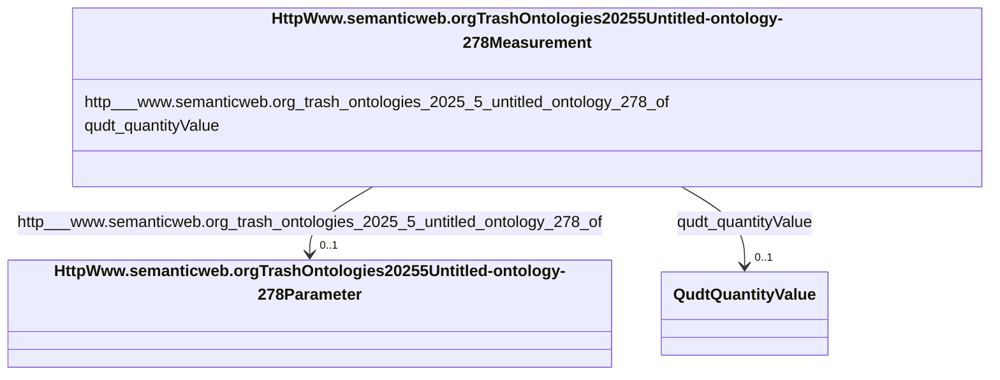

# Class: HttpWww.semanticweb.orgTrashOntologies20255Untitled-ontology-278Measurement


This class occurs 911199 times.


URI: [http://www.semanticweb.org/trash/ontologies/2025/5/untitled-ontology-278/Measurement](http://www.semanticweb.org/trash/ontologies/2025/5/untitled-ontology-278/Measurement)





<!-- no inheritance hierarchy -->


## Slots

| Name | Cardinality and Range | Description | Inheritance | Occurrences |
| ---  | --- | --- | --- | --- |
| [qudt_quantityValue](../slots/qudt_quantityValue.md) | 0..1 <br/> [QudtQuantityValue](../classes/QudtQuantityValue.md) |  <br/>  | direct | 911199 |
| [http___www.semanticweb.org_trash_ontologies_2025_5_untitled_ontology_278_of](../slots/http___www.semanticweb.org_trash_ontologies_2025_5_untitled_ontology_278_of.md) | 0..1 <br/> [HttpWww.semanticweb.orgTrashOntologies20255Untitled-ontology-278Parameter](../classes/HttpWww.semanticweb.orgTrashOntologies20255Untitled-ontology-278Parameter.md) |  <br/>  | direct | 911199 |


## Usages

| used by | used in | type | used |
| ---  | --- | --- | --- |
| [HttpWww.semanticweb.orgTrashOntologies20255Untitled-ontology-278Amendment](../classes/HttpWww.semanticweb.orgTrashOntologies20255Untitled-ontology-278Amendment.md) | [http___www.semanticweb.org_trash_ontologies_2025_5_untitled_ontology_278_hasMeasurement](../slots/http___www.semanticweb.org_trash_ontologies_2025_5_untitled_ontology_278_hasMeasurement.md) | range | [HttpWww.semanticweb.orgTrashOntologies20255Untitled-ontology-278Measurement](../classes/HttpWww.semanticweb.orgTrashOntologies20255Untitled-ontology-278Measurement.md) |
| [HttpWww.semanticweb.orgTrashOntologies20255Untitled-ontology-278BiomassCarbohydrate](../classes/HttpWww.semanticweb.orgTrashOntologies20255Untitled-ontology-278BiomassCarbohydrate.md) | [http___www.semanticweb.org_trash_ontologies_2025_5_untitled_ontology_278_hasMeasurement](../slots/http___www.semanticweb.org_trash_ontologies_2025_5_untitled_ontology_278_hasMeasurement.md) | range | [HttpWww.semanticweb.orgTrashOntologies20255Untitled-ontology-278Measurement](../classes/HttpWww.semanticweb.orgTrashOntologies20255Untitled-ontology-278Measurement.md) |
| [HttpWww.semanticweb.orgTrashOntologies20255Untitled-ontology-278BiomassEnergy](../classes/HttpWww.semanticweb.orgTrashOntologies20255Untitled-ontology-278BiomassEnergy.md) | [http___www.semanticweb.org_trash_ontologies_2025_5_untitled_ontology_278_hasMeasurement](../slots/http___www.semanticweb.org_trash_ontologies_2025_5_untitled_ontology_278_hasMeasurement.md) | range | [HttpWww.semanticweb.orgTrashOntologies20255Untitled-ontology-278Measurement](../classes/HttpWww.semanticweb.orgTrashOntologies20255Untitled-ontology-278Measurement.md) |
| [HttpWww.semanticweb.orgTrashOntologies20255Untitled-ontology-278BiomassMineral](../classes/HttpWww.semanticweb.orgTrashOntologies20255Untitled-ontology-278BiomassMineral.md) | [http___www.semanticweb.org_trash_ontologies_2025_5_untitled_ontology_278_hasMeasurement](../slots/http___www.semanticweb.org_trash_ontologies_2025_5_untitled_ontology_278_hasMeasurement.md) | range | [HttpWww.semanticweb.orgTrashOntologies20255Untitled-ontology-278Measurement](../classes/HttpWww.semanticweb.orgTrashOntologies20255Untitled-ontology-278Measurement.md) |
| [HttpWww.semanticweb.orgTrashOntologies20255Untitled-ontology-278GasNutrientLoss](../classes/HttpWww.semanticweb.orgTrashOntologies20255Untitled-ontology-278GasNutrientLoss.md) | [http___www.semanticweb.org_trash_ontologies_2025_5_untitled_ontology_278_hasMeasurement](../slots/http___www.semanticweb.org_trash_ontologies_2025_5_untitled_ontology_278_hasMeasurement.md) | range | [HttpWww.semanticweb.orgTrashOntologies20255Untitled-ontology-278Measurement](../classes/HttpWww.semanticweb.orgTrashOntologies20255Untitled-ontology-278Measurement.md) |
| [HttpWww.semanticweb.orgTrashOntologies20255Untitled-ontology-278GrazingManagement](../classes/HttpWww.semanticweb.orgTrashOntologies20255Untitled-ontology-278GrazingManagement.md) | [http___www.semanticweb.org_trash_ontologies_2025_5_untitled_ontology_278_hasMeasurement](../slots/http___www.semanticweb.org_trash_ontologies_2025_5_untitled_ontology_278_hasMeasurement.md) | range | [HttpWww.semanticweb.orgTrashOntologies20255Untitled-ontology-278Measurement](../classes/HttpWww.semanticweb.orgTrashOntologies20255Untitled-ontology-278Measurement.md) |
| [HttpWww.semanticweb.orgTrashOntologies20255Untitled-ontology-278GrazingPlants](../classes/HttpWww.semanticweb.orgTrashOntologies20255Untitled-ontology-278GrazingPlants.md) | [http___www.semanticweb.org_trash_ontologies_2025_5_untitled_ontology_278_hasMeasurement](../slots/http___www.semanticweb.org_trash_ontologies_2025_5_untitled_ontology_278_hasMeasurement.md) | range | [HttpWww.semanticweb.orgTrashOntologies20255Untitled-ontology-278Measurement](../classes/HttpWww.semanticweb.orgTrashOntologies20255Untitled-ontology-278Measurement.md) |
| [HttpWww.semanticweb.orgTrashOntologies20255Untitled-ontology-278HarvestFraction](../classes/HttpWww.semanticweb.orgTrashOntologies20255Untitled-ontology-278HarvestFraction.md) | [http___www.semanticweb.org_trash_ontologies_2025_5_untitled_ontology_278_hasMeasurement](../slots/http___www.semanticweb.org_trash_ontologies_2025_5_untitled_ontology_278_hasMeasurement.md) | range | [HttpWww.semanticweb.orgTrashOntologies20255Untitled-ontology-278Measurement](../classes/HttpWww.semanticweb.orgTrashOntologies20255Untitled-ontology-278Measurement.md) |
| [HttpWww.semanticweb.orgTrashOntologies20255Untitled-ontology-278NutrientEfficiency](../classes/HttpWww.semanticweb.orgTrashOntologies20255Untitled-ontology-278NutrientEfficiency.md) | [http___www.semanticweb.org_trash_ontologies_2025_5_untitled_ontology_278_hasMeasurement](../slots/http___www.semanticweb.org_trash_ontologies_2025_5_untitled_ontology_278_hasMeasurement.md) | range | [HttpWww.semanticweb.orgTrashOntologies20255Untitled-ontology-278Measurement](../classes/HttpWww.semanticweb.orgTrashOntologies20255Untitled-ontology-278Measurement.md) |
| [HttpWww.semanticweb.orgTrashOntologies20255Untitled-ontology-278PlantingManagement](../classes/HttpWww.semanticweb.orgTrashOntologies20255Untitled-ontology-278PlantingManagement.md) | [http___www.semanticweb.org_trash_ontologies_2025_5_untitled_ontology_278_hasMeasurement](../slots/http___www.semanticweb.org_trash_ontologies_2025_5_untitled_ontology_278_hasMeasurement.md) | range | [HttpWww.semanticweb.orgTrashOntologies20255Untitled-ontology-278Measurement](../classes/HttpWww.semanticweb.orgTrashOntologies20255Untitled-ontology-278Measurement.md) |
| [HttpWww.semanticweb.orgTrashOntologies20255Untitled-ontology-278ResidueManagement](../classes/HttpWww.semanticweb.orgTrashOntologies20255Untitled-ontology-278ResidueManagement.md) | [http___www.semanticweb.org_trash_ontologies_2025_5_untitled_ontology_278_hasMeasurement](../slots/http___www.semanticweb.org_trash_ontologies_2025_5_untitled_ontology_278_hasMeasurement.md) | range | [HttpWww.semanticweb.orgTrashOntologies20255Untitled-ontology-278Measurement](../classes/HttpWww.semanticweb.orgTrashOntologies20255Untitled-ontology-278Measurement.md) |
| [HttpWww.semanticweb.orgTrashOntologies20255Untitled-ontology-278ResidueMeasurement](../classes/HttpWww.semanticweb.orgTrashOntologies20255Untitled-ontology-278ResidueMeasurement.md) | [http___www.semanticweb.org_trash_ontologies_2025_5_untitled_ontology_278_hasMeasurement](../slots/http___www.semanticweb.org_trash_ontologies_2025_5_untitled_ontology_278_hasMeasurement.md) | range | [HttpWww.semanticweb.orgTrashOntologies20255Untitled-ontology-278Measurement](../classes/HttpWww.semanticweb.orgTrashOntologies20255Untitled-ontology-278Measurement.md) |
| [HttpWww.semanticweb.orgTrashOntologies20255Untitled-ontology-278SoilBiologicalSample](../classes/HttpWww.semanticweb.orgTrashOntologies20255Untitled-ontology-278SoilBiologicalSample.md) | [http___www.semanticweb.org_trash_ontologies_2025_5_untitled_ontology_278_hasMeasurement](../slots/http___www.semanticweb.org_trash_ontologies_2025_5_untitled_ontology_278_hasMeasurement.md) | range | [HttpWww.semanticweb.orgTrashOntologies20255Untitled-ontology-278Measurement](../classes/HttpWww.semanticweb.orgTrashOntologies20255Untitled-ontology-278Measurement.md) |
| [HttpWww.semanticweb.orgTrashOntologies20255Untitled-ontology-278SoilChemicalSample](../classes/HttpWww.semanticweb.orgTrashOntologies20255Untitled-ontology-278SoilChemicalSample.md) | [http___www.semanticweb.org_trash_ontologies_2025_5_untitled_ontology_278_hasMeasurement](../slots/http___www.semanticweb.org_trash_ontologies_2025_5_untitled_ontology_278_hasMeasurement.md) | range | [HttpWww.semanticweb.orgTrashOntologies20255Untitled-ontology-278Measurement](../classes/HttpWww.semanticweb.orgTrashOntologies20255Untitled-ontology-278Measurement.md) |
| [HttpWww.semanticweb.orgTrashOntologies20255Untitled-ontology-278SoilPhysicalSample](../classes/HttpWww.semanticweb.orgTrashOntologies20255Untitled-ontology-278SoilPhysicalSample.md) | [http___www.semanticweb.org_trash_ontologies_2025_5_untitled_ontology_278_hasMeasurement](../slots/http___www.semanticweb.org_trash_ontologies_2025_5_untitled_ontology_278_hasMeasurement.md) | range | [HttpWww.semanticweb.orgTrashOntologies20255Untitled-ontology-278Measurement](../classes/HttpWww.semanticweb.orgTrashOntologies20255Untitled-ontology-278Measurement.md) |
| [HttpWww.semanticweb.orgTrashOntologies20255Untitled-ontology-278TillageManagement](../classes/HttpWww.semanticweb.orgTrashOntologies20255Untitled-ontology-278TillageManagement.md) | [http___www.semanticweb.org_trash_ontologies_2025_5_untitled_ontology_278_hasMeasurement](../slots/http___www.semanticweb.org_trash_ontologies_2025_5_untitled_ontology_278_hasMeasurement.md) | range | [HttpWww.semanticweb.orgTrashOntologies20255Untitled-ontology-278Measurement](../classes/HttpWww.semanticweb.orgTrashOntologies20255Untitled-ontology-278Measurement.md) |
| [HttpWww.semanticweb.orgTrashOntologies20255Untitled-ontology-278WaterQualityArea](../classes/HttpWww.semanticweb.orgTrashOntologies20255Untitled-ontology-278WaterQualityArea.md) | [http___www.semanticweb.org_trash_ontologies_2025_5_untitled_ontology_278_hasMeasurement](../slots/http___www.semanticweb.org_trash_ontologies_2025_5_untitled_ontology_278_hasMeasurement.md) | range | [HttpWww.semanticweb.orgTrashOntologies20255Untitled-ontology-278Measurement](../classes/HttpWww.semanticweb.orgTrashOntologies20255Untitled-ontology-278Measurement.md) |
| [HttpWww.semanticweb.orgTrashOntologies20255Untitled-ontology-278WaterQualityConcentration](../classes/HttpWww.semanticweb.orgTrashOntologies20255Untitled-ontology-278WaterQualityConcentration.md) | [http___www.semanticweb.org_trash_ontologies_2025_5_untitled_ontology_278_hasMeasurement](../slots/http___www.semanticweb.org_trash_ontologies_2025_5_untitled_ontology_278_hasMeasurement.md) | range | [HttpWww.semanticweb.orgTrashOntologies20255Untitled-ontology-278Measurement](../classes/HttpWww.semanticweb.orgTrashOntologies20255Untitled-ontology-278Measurement.md) |
| [HttpWww.semanticweb.orgTrashOntologies20255Untitled-ontology-278WindErosionArea](../classes/HttpWww.semanticweb.orgTrashOntologies20255Untitled-ontology-278WindErosionArea.md) | [http___www.semanticweb.org_trash_ontologies_2025_5_untitled_ontology_278_hasMeasurement](../slots/http___www.semanticweb.org_trash_ontologies_2025_5_untitled_ontology_278_hasMeasurement.md) | range | [HttpWww.semanticweb.orgTrashOntologies20255Untitled-ontology-278Measurement](../classes/HttpWww.semanticweb.orgTrashOntologies20255Untitled-ontology-278Measurement.md) |
| [HttpWww.semanticweb.orgTrashOntologies20255Untitled-ontology-278YieldNutrientUptake](../classes/HttpWww.semanticweb.orgTrashOntologies20255Untitled-ontology-278YieldNutrientUptake.md) | [http___www.semanticweb.org_trash_ontologies_2025_5_untitled_ontology_278_hasMeasurement](../slots/http___www.semanticweb.org_trash_ontologies_2025_5_untitled_ontology_278_hasMeasurement.md) | range | [HttpWww.semanticweb.orgTrashOntologies20255Untitled-ontology-278Measurement](../classes/HttpWww.semanticweb.orgTrashOntologies20255Untitled-ontology-278Measurement.md) |


## LinkML Source

<!-- TODO: investigate https://stackoverflow.com/questions/37606292/how-to-create-tabbed-code-blocks-in-mkdocs-or-sphinx -->

### Direct

<details>

```yaml
name: http___www.semanticweb.org_trash_ontologies_2025_5_untitled-ontology-278_Measurement
from_schema: okns:soc-kg
rank: 1000
slots:
- qudt_quantityValue
- http___www.semanticweb.org_trash_ontologies_2025_5_untitled-ontology-278_of
class_uri: http://www.semanticweb.org/trash/ontologies/2025/5/untitled-ontology-278/Measurement

```
</details>

### Induced

<details>

```yaml
name: http___www.semanticweb.org_trash_ontologies_2025_5_untitled-ontology-278_Measurement
from_schema: okns:soc-kg
rank: 1000
attributes:
  qudt_quantityValue:
    name: qudt_quantityValue
    title: quantity value
    notes:
    - No occurrences of this slot in the graph.
    from_schema: okns:qudt
    source: http://qudt.org/schema/qudt
    slot_uri: qudt:quantityValue
    alias: qudt_quantityValue
    owner: http___www.semanticweb.org_trash_ontologies_2025_5_untitled-ontology-278_Measurement
    domain_of:
    - http___www.semanticweb.org_trash_ontologies_2025_5_untitled-ontology-278_Measurement
    range: qudt_QuantityValue
  http___www.semanticweb.org_trash_ontologies_2025_5_untitled-ontology-278_of:
    name: http___www.semanticweb.org_trash_ontologies_2025_5_untitled-ontology-278_of
    from_schema: okns:soc-kg
    rank: 1000
    slot_uri: http://www.semanticweb.org/trash/ontologies/2025/5/untitled-ontology-278/of
    alias: http___www.semanticweb.org_trash_ontologies_2025_5_untitled_ontology_278_of
    owner: http___www.semanticweb.org_trash_ontologies_2025_5_untitled-ontology-278_Measurement
    domain_of:
    - http___www.semanticweb.org_trash_ontologies_2025_5_untitled-ontology-278_Measurement
    range: http___www.semanticweb.org_trash_ontologies_2025_5_untitled-ontology-278_Parameter
class_uri: http://www.semanticweb.org/trash/ontologies/2025/5/untitled-ontology-278/Measurement

```
</details>