# Class: HttpWww.semanticweb.orgTrashOntologies20255Untitled-ontology-278PlantingManagement


This class occurs 23728 times.


URI: [http://www.semanticweb.org/trash/ontologies/2025/5/untitled-ontology-278/PlantingManagement](http://www.semanticweb.org/trash/ontologies/2025/5/untitled-ontology-278/PlantingManagement)

```mermaid
 classDiagram
    class HttpWww.semanticweb.orgTrashOntologies20255Untitled-ontology-278PlantingManagement
    click HttpWww.semanticweb.orgTrashOntologies20255Untitled-ontology-278PlantingManagement href "../HttpWww.semanticweb.orgTrashOntologies20255Untitled-ontology-278PlantingManagement"
      HttpWww.semanticweb.orgTrashOntologies20255Untitled-ontology-278PlantingManagement : http___www.semanticweb.org_trash_ontologies_2025_5_untitled_ontology_278_hasCrop
        
          
    
    
    HttpWww.semanticweb.orgTrashOntologies20255Untitled-ontology-278PlantingManagement --> "0..1" HttpsLod.nal.usda.govNalt7140 : http___www.semanticweb.org_trash_ontologies_2025_5_untitled_ontology_278_hasCrop
    click HttpsLod.nal.usda.govNalt7140 href "../HttpsLod.nal.usda.govNalt7140"

        
      HttpWww.semanticweb.orgTrashOntologies20255Untitled-ontology-278PlantingManagement : http___www.semanticweb.org_trash_ontologies_2025_5_untitled_ontology_278_hasCultivar
        
          
    
    
    HttpWww.semanticweb.orgTrashOntologies20255Untitled-ontology-278PlantingManagement --> "0..1" HttpWww.semanticweb.orgTrashOntologies20255Untitled-ontology-278Cultivar : http___www.semanticweb.org_trash_ontologies_2025_5_untitled_ontology_278_hasCultivar
    click HttpWww.semanticweb.orgTrashOntologies20255Untitled-ontology-278Cultivar href "../HttpWww.semanticweb.orgTrashOntologies20255Untitled-ontology-278Cultivar"

        
      HttpWww.semanticweb.orgTrashOntologies20255Untitled-ontology-278PlantingManagement : http___www.semanticweb.org_trash_ontologies_2025_5_untitled_ontology_278_hasMeasurement
        
          
    
    
    HttpWww.semanticweb.orgTrashOntologies20255Untitled-ontology-278PlantingManagement --> "0..1" HttpWww.semanticweb.orgTrashOntologies20255Untitled-ontology-278Measurement : http___www.semanticweb.org_trash_ontologies_2025_5_untitled_ontology_278_hasMeasurement
    click HttpWww.semanticweb.orgTrashOntologies20255Untitled-ontology-278Measurement href "../HttpWww.semanticweb.orgTrashOntologies20255Untitled-ontology-278Measurement"

        
      HttpWww.semanticweb.orgTrashOntologies20255Untitled-ontology-278PlantingManagement : http___www.semanticweb.org_trash_ontologies_2025_5_untitled_ontology_278_startDate
        
          
    
    
    HttpWww.semanticweb.orgTrashOntologies20255Untitled-ontology-278PlantingManagement --> "0..1" Date : http___www.semanticweb.org_trash_ontologies_2025_5_untitled_ontology_278_startDate
    click Date href "../Date"

        
      HttpWww.semanticweb.orgTrashOntologies20255Untitled-ontology-278PlantingManagement : http___www.semanticweb.org_trash_ontologies_2025_5_untitled_ontology_278_usesPlantingMethod
        
          
    
    
    HttpWww.semanticweb.orgTrashOntologies20255Untitled-ontology-278PlantingManagement --> "0..1" HttpWww.semanticweb.orgTrashOntologies20255Untitled-ontology-278PlantingMethod : http___www.semanticweb.org_trash_ontologies_2025_5_untitled_ontology_278_usesPlantingMethod
    click HttpWww.semanticweb.orgTrashOntologies20255Untitled-ontology-278PlantingMethod href "../HttpWww.semanticweb.orgTrashOntologies20255Untitled-ontology-278PlantingMethod"

        
      
```





<!-- no inheritance hierarchy -->


## Slots

| Name | Cardinality and Range | Description | Inheritance | Occurrences |
| ---  | --- | --- | --- | --- |
| [http___www.semanticweb.org_trash_ontologies_2025_5_untitled_ontology_278_hasCultivar](../slots/http___www.semanticweb.org_trash_ontologies_2025_5_untitled_ontology_278_hasCultivar.md) | 0..1 <br/> [HttpWww.semanticweb.orgTrashOntologies20255Untitled-ontology-278Cultivar](../classes/HttpWww.semanticweb.orgTrashOntologies20255Untitled-ontology-278Cultivar.md) |  <br/>  | direct | 20926 |
| [http___www.semanticweb.org_trash_ontologies_2025_5_untitled_ontology_278_startDate](../slots/http___www.semanticweb.org_trash_ontologies_2025_5_untitled_ontology_278_startDate.md) | 0..1 <br/> [xsd:date](http://www.w3.org/2001/XMLSchema#date) |  <br/>  | direct | 23728 |
| [http___www.semanticweb.org_trash_ontologies_2025_5_untitled_ontology_278_hasCrop](../slots/http___www.semanticweb.org_trash_ontologies_2025_5_untitled_ontology_278_hasCrop.md) | 0..1 <br/> [HttpsLod.nal.usda.govNalt7140](../classes/HttpsLod.nal.usda.govNalt7140.md) |  <br/>  | direct | 23728 |
| [http___www.semanticweb.org_trash_ontologies_2025_5_untitled_ontology_278_usesPlantingMethod](../slots/http___www.semanticweb.org_trash_ontologies_2025_5_untitled_ontology_278_usesPlantingMethod.md) | 0..1 <br/> [HttpWww.semanticweb.orgTrashOntologies20255Untitled-ontology-278PlantingMethod](../classes/HttpWww.semanticweb.orgTrashOntologies20255Untitled-ontology-278PlantingMethod.md) |  <br/>  | direct | 22592 |
| [http___www.semanticweb.org_trash_ontologies_2025_5_untitled_ontology_278_hasMeasurement](../slots/http___www.semanticweb.org_trash_ontologies_2025_5_untitled_ontology_278_hasMeasurement.md) | 0..1 <br/> [HttpWww.semanticweb.orgTrashOntologies20255Untitled-ontology-278Measurement](../classes/HttpWww.semanticweb.orgTrashOntologies20255Untitled-ontology-278Measurement.md) |  <br/>  | direct | 84758 |


## Usages

| used by | used in | type | used |
| ---  | --- | --- | --- |
| [HttpWww.semanticweb.orgTrashOntologies20255Untitled-ontology-278ExperimentalUnit](../classes/HttpWww.semanticweb.orgTrashOntologies20255Untitled-ontology-278ExperimentalUnit.md) | [http___www.semanticweb.org_trash_ontologies_2025_5_untitled_ontology_278_unitHasPlantingManagement](../slots/http___www.semanticweb.org_trash_ontologies_2025_5_untitled_ontology_278_unitHasPlantingManagement.md) | range | [HttpWww.semanticweb.orgTrashOntologies20255Untitled-ontology-278PlantingManagement](../classes/HttpWww.semanticweb.orgTrashOntologies20255Untitled-ontology-278PlantingManagement.md) |
| [HttpWww.semanticweb.orgTrashOntologies20255Untitled-ontology-278Treatment](../classes/HttpWww.semanticweb.orgTrashOntologies20255Untitled-ontology-278Treatment.md) | [http___www.semanticweb.org_trash_ontologies_2025_5_untitled_ontology_278_treatmentHasPlantingManagement](../slots/http___www.semanticweb.org_trash_ontologies_2025_5_untitled_ontology_278_treatmentHasPlantingManagement.md) | range | [HttpWww.semanticweb.orgTrashOntologies20255Untitled-ontology-278PlantingManagement](../classes/HttpWww.semanticweb.orgTrashOntologies20255Untitled-ontology-278PlantingManagement.md) |


## LinkML Source

<!-- TODO: investigate https://stackoverflow.com/questions/37606292/how-to-create-tabbed-code-blocks-in-mkdocs-or-sphinx -->

### Direct

<details>

```yaml
name: http___www.semanticweb.org_trash_ontologies_2025_5_untitled-ontology-278_PlantingManagement
from_schema: okns:soc-kg
rank: 1000
slots:
- http___www.semanticweb.org_trash_ontologies_2025_5_untitled-ontology-278_hasCultivar
- http___www.semanticweb.org_trash_ontologies_2025_5_untitled-ontology-278_startDate
- http___www.semanticweb.org_trash_ontologies_2025_5_untitled-ontology-278_hasCrop
- http___www.semanticweb.org_trash_ontologies_2025_5_untitled-ontology-278_usesPlantingMethod
- http___www.semanticweb.org_trash_ontologies_2025_5_untitled-ontology-278_hasMeasurement
class_uri: http://www.semanticweb.org/trash/ontologies/2025/5/untitled-ontology-278/PlantingManagement

```
</details>

### Induced

<details>

```yaml
name: http___www.semanticweb.org_trash_ontologies_2025_5_untitled-ontology-278_PlantingManagement
from_schema: okns:soc-kg
rank: 1000
attributes:
  http___www.semanticweb.org_trash_ontologies_2025_5_untitled-ontology-278_hasCultivar:
    name: http___www.semanticweb.org_trash_ontologies_2025_5_untitled-ontology-278_hasCultivar
    from_schema: okns:soc-kg
    rank: 1000
    slot_uri: http://www.semanticweb.org/trash/ontologies/2025/5/untitled-ontology-278/hasCultivar
    alias: http___www.semanticweb.org_trash_ontologies_2025_5_untitled_ontology_278_hasCultivar
    owner: http___www.semanticweb.org_trash_ontologies_2025_5_untitled-ontology-278_PlantingManagement
    domain_of:
    - http___www.semanticweb.org_trash_ontologies_2025_5_untitled-ontology-278_PlantingManagement
    range: http___www.semanticweb.org_trash_ontologies_2025_5_untitled-ontology-278_Cultivar
  http___www.semanticweb.org_trash_ontologies_2025_5_untitled-ontology-278_startDate:
    name: http___www.semanticweb.org_trash_ontologies_2025_5_untitled-ontology-278_startDate
    from_schema: okns:soc-kg
    rank: 1000
    slot_uri: http://www.semanticweb.org/trash/ontologies/2025/5/untitled-ontology-278/startDate
    alias: http___www.semanticweb.org_trash_ontologies_2025_5_untitled_ontology_278_startDate
    owner: http___www.semanticweb.org_trash_ontologies_2025_5_untitled-ontology-278_PlantingManagement
    domain_of:
    - http___www.semanticweb.org_trash_ontologies_2025_5_untitled-ontology-278_Amendment
    - http___www.semanticweb.org_trash_ontologies_2025_5_untitled-ontology-278_ExperimentalUnit
    - http___www.semanticweb.org_trash_ontologies_2025_5_untitled-ontology-278_GrazingManagement
    - http___www.semanticweb.org_trash_ontologies_2025_5_untitled-ontology-278_Location
    - http___www.semanticweb.org_trash_ontologies_2025_5_untitled-ontology-278_PlantingManagement
    - http___www.semanticweb.org_trash_ontologies_2025_5_untitled-ontology-278_ResidueManagement
    - http___www.semanticweb.org_trash_ontologies_2025_5_untitled-ontology-278_TillageManagement
    - http___www.semanticweb.org_trash_ontologies_2025_5_untitled-ontology-278_Treatment
    range: date
  http___www.semanticweb.org_trash_ontologies_2025_5_untitled-ontology-278_hasCrop:
    name: http___www.semanticweb.org_trash_ontologies_2025_5_untitled-ontology-278_hasCrop
    from_schema: okns:soc-kg
    rank: 1000
    slot_uri: http://www.semanticweb.org/trash/ontologies/2025/5/untitled-ontology-278/hasCrop
    alias: http___www.semanticweb.org_trash_ontologies_2025_5_untitled_ontology_278_hasCrop
    owner: http___www.semanticweb.org_trash_ontologies_2025_5_untitled-ontology-278_PlantingManagement
    domain_of:
    - http___www.semanticweb.org_trash_ontologies_2025_5_untitled-ontology-278_Amendment
    - http___www.semanticweb.org_trash_ontologies_2025_5_untitled-ontology-278_BiomassCarbohydrate
    - http___www.semanticweb.org_trash_ontologies_2025_5_untitled-ontology-278_BiomassEnergy
    - http___www.semanticweb.org_trash_ontologies_2025_5_untitled-ontology-278_BiomassMineral
    - http___www.semanticweb.org_trash_ontologies_2025_5_untitled-ontology-278_GasNutrientLoss
    - http___www.semanticweb.org_trash_ontologies_2025_5_untitled-ontology-278_GrowthStageManagement
    - http___www.semanticweb.org_trash_ontologies_2025_5_untitled-ontology-278_HarvestFraction
    - http___www.semanticweb.org_trash_ontologies_2025_5_untitled-ontology-278_NutrientEfficiency
    - http___www.semanticweb.org_trash_ontologies_2025_5_untitled-ontology-278_PlantingManagement
    - http___www.semanticweb.org_trash_ontologies_2025_5_untitled-ontology-278_ResidueManagement
    - http___www.semanticweb.org_trash_ontologies_2025_5_untitled-ontology-278_ResidueMeasurement
    - http___www.semanticweb.org_trash_ontologies_2025_5_untitled-ontology-278_SoilCover
    - http___www.semanticweb.org_trash_ontologies_2025_5_untitled-ontology-278_TillageManagement
    - http___www.semanticweb.org_trash_ontologies_2025_5_untitled-ontology-278_WaterQualityConcentration
    - http___www.semanticweb.org_trash_ontologies_2025_5_untitled-ontology-278_YieldNutrientUptake
    range: https___lod.nal.usda.gov_nalt_7140
  http___www.semanticweb.org_trash_ontologies_2025_5_untitled-ontology-278_usesPlantingMethod:
    name: http___www.semanticweb.org_trash_ontologies_2025_5_untitled-ontology-278_usesPlantingMethod
    from_schema: okns:soc-kg
    rank: 1000
    slot_uri: http://www.semanticweb.org/trash/ontologies/2025/5/untitled-ontology-278/usesPlantingMethod
    alias: http___www.semanticweb.org_trash_ontologies_2025_5_untitled_ontology_278_usesPlantingMethod
    owner: http___www.semanticweb.org_trash_ontologies_2025_5_untitled-ontology-278_PlantingManagement
    domain_of:
    - http___www.semanticweb.org_trash_ontologies_2025_5_untitled-ontology-278_PlantingManagement
    range: http___www.semanticweb.org_trash_ontologies_2025_5_untitled-ontology-278_PlantingMethod
  http___www.semanticweb.org_trash_ontologies_2025_5_untitled-ontology-278_hasMeasurement:
    name: http___www.semanticweb.org_trash_ontologies_2025_5_untitled-ontology-278_hasMeasurement
    from_schema: okns:soc-kg
    rank: 1000
    slot_uri: http://www.semanticweb.org/trash/ontologies/2025/5/untitled-ontology-278/hasMeasurement
    alias: http___www.semanticweb.org_trash_ontologies_2025_5_untitled_ontology_278_hasMeasurement
    owner: http___www.semanticweb.org_trash_ontologies_2025_5_untitled-ontology-278_PlantingManagement
    domain_of:
    - http___www.semanticweb.org_trash_ontologies_2025_5_untitled-ontology-278_Amendment
    - http___www.semanticweb.org_trash_ontologies_2025_5_untitled-ontology-278_BiomassCarbohydrate
    - http___www.semanticweb.org_trash_ontologies_2025_5_untitled-ontology-278_BiomassEnergy
    - http___www.semanticweb.org_trash_ontologies_2025_5_untitled-ontology-278_BiomassMineral
    - http___www.semanticweb.org_trash_ontologies_2025_5_untitled-ontology-278_GasNutrientLoss
    - http___www.semanticweb.org_trash_ontologies_2025_5_untitled-ontology-278_GrazingManagement
    - http___www.semanticweb.org_trash_ontologies_2025_5_untitled-ontology-278_GrazingPlants
    - http___www.semanticweb.org_trash_ontologies_2025_5_untitled-ontology-278_HarvestFraction
    - http___www.semanticweb.org_trash_ontologies_2025_5_untitled-ontology-278_NutrientEfficiency
    - http___www.semanticweb.org_trash_ontologies_2025_5_untitled-ontology-278_PlantingManagement
    - http___www.semanticweb.org_trash_ontologies_2025_5_untitled-ontology-278_ResidueManagement
    - http___www.semanticweb.org_trash_ontologies_2025_5_untitled-ontology-278_ResidueMeasurement
    - http___www.semanticweb.org_trash_ontologies_2025_5_untitled-ontology-278_SoilBiologicalSample
    - http___www.semanticweb.org_trash_ontologies_2025_5_untitled-ontology-278_SoilChemicalSample
    - http___www.semanticweb.org_trash_ontologies_2025_5_untitled-ontology-278_SoilPhysicalSample
    - http___www.semanticweb.org_trash_ontologies_2025_5_untitled-ontology-278_TillageManagement
    - http___www.semanticweb.org_trash_ontologies_2025_5_untitled-ontology-278_WaterQualityArea
    - http___www.semanticweb.org_trash_ontologies_2025_5_untitled-ontology-278_WaterQualityConcentration
    - http___www.semanticweb.org_trash_ontologies_2025_5_untitled-ontology-278_WindErosionArea
    - http___www.semanticweb.org_trash_ontologies_2025_5_untitled-ontology-278_YieldNutrientUptake
    range: http___www.semanticweb.org_trash_ontologies_2025_5_untitled-ontology-278_Measurement
class_uri: http://www.semanticweb.org/trash/ontologies/2025/5/untitled-ontology-278/PlantingManagement

```
</details>