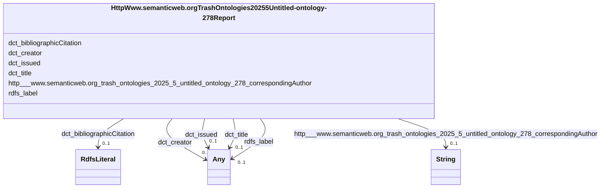

# Class: HttpWww.semanticweb.orgTrashOntologies20255Untitled-ontology-278Report


This class occurs 1 times.


URI: [http://www.semanticweb.org/trash/ontologies/2025/5/untitled-ontology-278/Report](http://www.semanticweb.org/trash/ontologies/2025/5/untitled-ontology-278/Report)





<!-- no inheritance hierarchy -->


## Slots

| Name | Cardinality and Range | Description | Inheritance | Occurrences |
| ---  | --- | --- | --- | --- |
| [dct_bibliographicCitation](../slots/dct_bibliographicCitation.md) | 0..1 <br/> [RdfsLiteral](../classes/RdfsLiteral.md) | Recommended practice is to include sufficient bibliographic detail to identif... <br/> description: A bibliographic reference for the resource. | direct | 1 |
| [http___www.semanticweb.org_trash_ontologies_2025_5_untitled_ontology_278_correspondingAuthor](../slots/http___www.semanticweb.org_trash_ontologies_2025_5_untitled_ontology_278_correspondingAuthor.md) | 0..1 <br/> [xsd:string](http://www.w3.org/2001/XMLSchema#string) |  <br/>  | direct | 1 |
| [dct_creator](../slots/dct_creator.md) | 0..1 <br/> [Any](../classes/Any.md) | Recommended practice is to identify the creator with a URI <br/> description: An entity responsible for making the resource. | direct | 1 |
| [rdfs_label](../slots/rdfs_label.md) | 0..1 <br/> [RdfsLiteral](../classes/RdfsLiteral.md)&nbsp;or&nbsp;<br />[xsd:string](http://www.w3.org/2001/XMLSchema#string) | A human-readable name for the subject <br/>  | direct | 1 |
| [dct_issued](../slots/dct_issued.md) | 0..1 <br/> [xsd:date](http://www.w3.org/2001/XMLSchema#date)&nbsp;or&nbsp;<br />[RdfsLiteral](../classes/RdfsLiteral.md) | Recommended practice is to describe the date, date/time, or period of time as... <br/> description: Date of formal issuance of the resource. | direct | 1 |
| [dct_title](../slots/dct_title.md) | 0..1 <br/> [xsd:string](http://www.w3.org/2001/XMLSchema#string)&nbsp;or&nbsp;<br />[RdfsLiteral](../classes/RdfsLiteral.md) | A name given to the resource <br/>  | direct | 1 |


## Usages

| used by | used in | type | used |
| ---  | --- | --- | --- |
| [HttpWww.semanticweb.orgTrashOntologies20255Untitled-ontology-278Location](../classes/HttpWww.semanticweb.orgTrashOntologies20255Untitled-ontology-278Location.md) | [http___www.semanticweb.org_trash_ontologies_2025_5_untitled_ontology_278_cites](../slots/http___www.semanticweb.org_trash_ontologies_2025_5_untitled_ontology_278_cites.md) | any_of[range] | [HttpWww.semanticweb.orgTrashOntologies20255Untitled-ontology-278Report](../classes/HttpWww.semanticweb.orgTrashOntologies20255Untitled-ontology-278Report.md) |


## LinkML Source

<!-- TODO: investigate https://stackoverflow.com/questions/37606292/how-to-create-tabbed-code-blocks-in-mkdocs-or-sphinx -->

### Direct

<details>

```yaml
name: http___www.semanticweb.org_trash_ontologies_2025_5_untitled-ontology-278_Report
from_schema: okns:soc-kg
rank: 1000
slots:
- dct_bibliographicCitation
- http___www.semanticweb.org_trash_ontologies_2025_5_untitled-ontology-278_correspondingAuthor
- dct_creator
- rdfs_label
- dct_issued
- dct_title
class_uri: http://www.semanticweb.org/trash/ontologies/2025/5/untitled-ontology-278/Report

```
</details>

### Induced

<details>

```yaml
name: http___www.semanticweb.org_trash_ontologies_2025_5_untitled-ontology-278_Report
from_schema: okns:soc-kg
rank: 1000
attributes:
  dct_bibliographicCitation:
    name: dct_bibliographicCitation
    description: Recommended practice is to include sufficient bibliographic detail
      to identify the resource as unambiguously as possible.
    title: Bibliographic Citation
    notes:
    - No occurrences of this slot in the graph.
    comments:
    - 'description: A bibliographic reference for the resource.'
    from_schema: okns:dc
    source: http://purl.org/dc/terms/
    slot_uri: dct:bibliographicCitation
    alias: dct_bibliographicCitation
    owner: http___www.semanticweb.org_trash_ontologies_2025_5_untitled-ontology-278_Report
    domain_of:
    - http___www.semanticweb.org_trash_ontologies_2025_5_untitled-ontology-278_Abstract
    - http___www.semanticweb.org_trash_ontologies_2025_5_untitled-ontology-278_BookChapter
    - http___www.semanticweb.org_trash_ontologies_2025_5_untitled-ontology-278_JournalArticle
    - http___www.semanticweb.org_trash_ontologies_2025_5_untitled-ontology-278_PopularArticle
    - http___www.semanticweb.org_trash_ontologies_2025_5_untitled-ontology-278_Proceedings
    - http___www.semanticweb.org_trash_ontologies_2025_5_untitled-ontology-278_Report
    - http___www.semanticweb.org_trash_ontologies_2025_5_untitled-ontology-278_Thesis
    subproperty_of: dct_identifier
    range: rdfs_Literal
  http___www.semanticweb.org_trash_ontologies_2025_5_untitled-ontology-278_correspondingAuthor:
    name: http___www.semanticweb.org_trash_ontologies_2025_5_untitled-ontology-278_correspondingAuthor
    from_schema: okns:soc-kg
    rank: 1000
    slot_uri: http://www.semanticweb.org/trash/ontologies/2025/5/untitled-ontology-278/correspondingAuthor
    alias: http___www.semanticweb.org_trash_ontologies_2025_5_untitled_ontology_278_correspondingAuthor
    owner: http___www.semanticweb.org_trash_ontologies_2025_5_untitled-ontology-278_Report
    domain_of:
    - http___www.semanticweb.org_trash_ontologies_2025_5_untitled-ontology-278_Abstract
    - http___www.semanticweb.org_trash_ontologies_2025_5_untitled-ontology-278_BookChapter
    - http___www.semanticweb.org_trash_ontologies_2025_5_untitled-ontology-278_JournalArticle
    - http___www.semanticweb.org_trash_ontologies_2025_5_untitled-ontology-278_PopularArticle
    - http___www.semanticweb.org_trash_ontologies_2025_5_untitled-ontology-278_Proceedings
    - http___www.semanticweb.org_trash_ontologies_2025_5_untitled-ontology-278_Report
    - http___www.semanticweb.org_trash_ontologies_2025_5_untitled-ontology-278_Thesis
    range: string
  dct_creator:
    name: dct_creator
    description: Recommended practice is to identify the creator with a URI.  If this
      is not possible or feasible, a literal value that identifies the creator may
      be provided.
    title: Creator
    notes:
    - No occurrences of this slot in the graph.
    comments:
    - 'description: An entity responsible for making the resource.'
    from_schema: okns:dc
    source: http://purl.org/dc/terms/
    exact_mappings:
    - http://xmlns.com/foaf/0.1/maker
    slot_uri: dct:creator
    alias: dct_creator
    owner: http___www.semanticweb.org_trash_ontologies_2025_5_untitled-ontology-278_Report
    domain_of:
    - http___www.semanticweb.org_trash_ontologies_2025_5_untitled-ontology-278_Abstract
    - http___www.semanticweb.org_trash_ontologies_2025_5_untitled-ontology-278_BookChapter
    - http___www.semanticweb.org_trash_ontologies_2025_5_untitled-ontology-278_JournalArticle
    - http___www.semanticweb.org_trash_ontologies_2025_5_untitled-ontology-278_PopularArticle
    - http___www.semanticweb.org_trash_ontologies_2025_5_untitled-ontology-278_Proceedings
    - http___www.semanticweb.org_trash_ontologies_2025_5_untitled-ontology-278_Report
    - http___www.semanticweb.org_trash_ontologies_2025_5_untitled-ontology-278_Thesis
    subproperty_of: dct_contributor
    range: Any
  rdfs_label:
    name: rdfs_label
    description: A human-readable name for the subject.
    title: label
    from_schema: okns:owl-rdf-rdfs
    source: http://www.w3.org/2000/01/rdf-schema#
    domain: rdfs_Resource
    slot_uri: rdfs:label
    alias: rdfs_label
    owner: http___www.semanticweb.org_trash_ontologies_2025_5_untitled-ontology-278_Report
    domain_of:
    - rdf_List
    - rdfs_Datatype
    - dcam_VocabularyEncodingScheme
    - dct_AgentClass
    - time_DayOfWeek
    - time_TemporalUnit
    - bibo_DocumentStatus
    - bibo_ThesisDegree
    - qudt_AspectClass
    - qudt_BinaryPrefix
    - qudt_BitEncodingType
    - qudt_BooleanEncodingType
    - qudt_ByteEncodingType
    - qudt_CardinalityType
    - qudt_CharEncodingType
    - qudt_ContextualUnit
    - qudt_CountingUnit
    - qudt_CurrencyUnit
    - qudt_DateTimeStringEncodingType
    - qudt_DecimalPrefix
    - qudt_DerivedUnit
    - qudt_DimensionlessUnit
    - qudt_EndianType
    - qudt_FloatingPointEncodingType
    - qudt_IntegerEncodingType
    - qudt_LogarithmicUnit
    - qudt_OrderedType
    - qudt_SignednessType
    - qudt_Unit
    - kwgo_AirPollutant
    - kwgo_BlueskyWildfireObservableProperty
    - kwgo_CensusObservableProperty
    - kwgo_ClimateObservableProperty
    - kwgo_CroplandObservableProperty
    - kwgo_DroughtIntensity
    - kwgo_FireCause
    - kwgo_HelipadAvailability
    - kwgo_HospitalStatus
    - kwgo_HospitalType
    - kwgo_ImpactObservableProperty
    - kwgo_LSADArea
    - kwgo_MTBSFireObservableProperty
    - kwgo_MagnitudeObservableProperty
    - kwgo_NIFCFireObservableProperty
    - kwgo_PublicHealthObservableProperty
    - kwgo_RoadType
    - kwgo_SmokePlumeObservableProperty
    - kwgo_SoilMapUnitObservableProperty
    - kwgo_StormTrackObservableProperty
    - kwgo_StormTrackletObservableProperty
    - kwgo_VulnerabilityObservableProperty
    - vaem_GraphMetaData
    - vaem_GraphRole
    - vaem_Party
    - sdos_ActionStatusType
    - sdos_AdultOrientedEnumeration
    - sdos_BoardingPolicyType
    - sdos_BodyMeasurementTypeEnumeration
    - sdos_BookFormatType
    - sdos_Boolean
    - sdos_CarUsageType
    - sdos_CertificationStatusEnumeration
    - sdos_ContactPointOption
    - sdos_DataType
    - sdos_DayOfWeek
    - sdos_DeliveryMethod
    - sdos_DigitalDocumentPermissionType
    - sdos_DigitalPlatformEnumeration
    - sdos_DriveWheelConfigurationValue
    - sdos_DrugCostCategory
    - sdos_DrugPregnancyCategory
    - sdos_DrugPrescriptionStatus
    - sdos_EUEnergyEfficiencyEnumeration
    - sdos_EnergyStarEnergyEfficiencyEnumeration
    - sdos_EventAttendanceModeEnumeration
    - sdos_EventStatusType
    - sdos_FulfillmentTypeEnumeration
    - sdos_GameAvailabilityEnumeration
    - sdos_GamePlayMode
    - sdos_GameServerStatus
    - sdos_GenderType
    - sdos_GovernmentBenefitsType
    - sdos_HealthAspectEnumeration
    - sdos_IPTCDigitalSourceEnumeration
    - sdos_IncentiveQualifiedExpenseType
    - sdos_IncentiveStatus
    - sdos_IncentiveType
    - sdos_InfectiousAgentClass
    - sdos_ItemAvailability
    - sdos_ItemListOrderType
    - sdos_LegalForceStatus
    - sdos_LegalValueLevel
    - sdos_MapCategoryType
    - sdos_MeasurementMethodEnum
    - sdos_MediaManipulationRatingEnumeration
    - sdos_MedicalAudienceType
    - sdos_MedicalDevicePurpose
    - sdos_MedicalEvidenceLevel
    - sdos_MedicalImagingTechnique
    - sdos_MedicalObservationalStudyDesign
    - sdos_MedicalProcedureType
    - sdos_MedicalSpecialty
    - sdos_MedicalStudyStatus
    - sdos_MedicalTrialDesign
    - sdos_MedicineSystem
    - sdos_MerchantReturnEnumeration
    - sdos_MusicAlbumProductionType
    - sdos_MusicAlbumReleaseType
    - sdos_MusicReleaseFormatType
    - sdos_NLNonprofitType
    - sdos_OfferItemCondition
    - sdos_OrderStatus
    - sdos_PaymentMethodType
    - sdos_PaymentStatusType
    - sdos_PhysicalActivityCategory
    - sdos_PhysicalExam
    - sdos_PriceComponentTypeEnumeration
    - sdos_PriceTypeEnumeration
    - sdos_ProductReturnEnumeration
    - sdos_PurchaseType
    - sdos_RefundTypeEnumeration
    - sdos_ReservationStatusType
    - sdos_RestrictedDiet
    - sdos_ReturnFeesEnumeration
    - sdos_ReturnLabelSourceEnumeration
    - sdos_ReturnMethodEnumeration
    - sdos_RsvpResponseType
    - sdos_SizeSystemEnumeration
    - sdos_SteeringPositionValue
    - sdos_TierBenefitEnumeration
    - sdos_UKNonprofitType
    - sdos_USNonprofitType
    - sdos_WearableMeasurementTypeEnumeration
    - sdos_WearableSizeGroupEnumeration
    - sdos_WearableSizeSystemEnumeration
    - rdf_DatatypeProperty
    - vaem_CatalogEntry
    - voag_Attribution
    - voag_AttributionLogo
    - voag_ChangeFrequency
    - voag_ChangeType
    - voag_ConfidentialityLevel
    - voag_CreativeCommonsPermission
    - voag_CreativeCommonsProhibition
    - voag_CreativeCommonsRequirement
    - voag_Governance
    - voag_GovernanceRole
    - voag_Icon
    - voag_IssueStatus
    - voag_LicenseModel
    - voag_Logo
    - voag_Maturity
    - voag_OrganizationLogo
    - voag_Pedigree
    - voag_PriorityValue
    - voag_ProductLogo
    - voag_Provenance
    - voag_PublicationStatus
    - voag_SchemaGraph
    - http___www.semanticweb.org_trash_ontologies_2025_5_untitled-ontology-278_Abstract
    - http___www.semanticweb.org_trash_ontologies_2025_5_untitled-ontology-278_ActiveIngredient
    - http___www.semanticweb.org_trash_ontologies_2025_5_untitled-ontology-278_AmendmentPlacement
    - http___www.semanticweb.org_trash_ontologies_2025_5_untitled-ontology-278_AmendmentType
    - http___www.semanticweb.org_trash_ontologies_2025_5_untitled-ontology-278_AnimalClass
    - http___www.semanticweb.org_trash_ontologies_2025_5_untitled-ontology-278_AnimalSpecies
    - http___www.semanticweb.org_trash_ontologies_2025_5_untitled-ontology-278_BookChapter
    - http___www.semanticweb.org_trash_ontologies_2025_5_untitled-ontology-278_BroadleafOrGrass
    - http___www.semanticweb.org_trash_ontologies_2025_5_untitled-ontology-278_Cultivar
    - http___www.semanticweb.org_trash_ontologies_2025_5_untitled-ontology-278_CuttingHeight
    - http___www.semanticweb.org_trash_ontologies_2025_5_untitled-ontology-278_Equipment
    - http___www.semanticweb.org_trash_ontologies_2025_5_untitled-ontology-278_FundingSource
    - http___www.semanticweb.org_trash_ontologies_2025_5_untitled-ontology-278_GrowthStage
    - http___www.semanticweb.org_trash_ontologies_2025_5_untitled-ontology-278_HarvestedFraction
    - http___www.semanticweb.org_trash_ontologies_2025_5_untitled-ontology-278_Irrigation
    - http___www.semanticweb.org_trash_ontologies_2025_5_untitled-ontology-278_JournalArticle
    - http___www.semanticweb.org_trash_ontologies_2025_5_untitled-ontology-278_Location
    - http___www.semanticweb.org_trash_ontologies_2025_5_untitled-ontology-278_LossesOrDeposition
    - http___www.semanticweb.org_trash_ontologies_2025_5_untitled-ontology-278_OtherEvents
    - http___www.semanticweb.org_trash_ontologies_2025_5_untitled-ontology-278_Parameter
    - http___www.semanticweb.org_trash_ontologies_2025_5_untitled-ontology-278_PesticidePlacement
    - http___www.semanticweb.org_trash_ontologies_2025_5_untitled-ontology-278_PesticideTarget
    - http___www.semanticweb.org_trash_ontologies_2025_5_untitled-ontology-278_PlantFraction
    - http___www.semanticweb.org_trash_ontologies_2025_5_untitled-ontology-278_PlantingMethod
    - http___www.semanticweb.org_trash_ontologies_2025_5_untitled-ontology-278_PopularArticle
    - http___www.semanticweb.org_trash_ontologies_2025_5_untitled-ontology-278_Proceedings
    - http___www.semanticweb.org_trash_ontologies_2025_5_untitled-ontology-278_Report
    - http___www.semanticweb.org_trash_ontologies_2025_5_untitled-ontology-278_SimulationModel
    - http___www.semanticweb.org_trash_ontologies_2025_5_untitled-ontology-278_SpeciesMix
    - http___www.semanticweb.org_trash_ontologies_2025_5_untitled-ontology-278_StartStopInterval
    - http___www.semanticweb.org_trash_ontologies_2025_5_untitled-ontology-278_SurfaceOrLeaching
    - http___www.semanticweb.org_trash_ontologies_2025_5_untitled-ontology-278_Thesis
    - http___www.semanticweb.org_trash_ontologies_2025_5_untitled-ontology-278_TillageEvent
    - http___www.semanticweb.org_trash_ontologies_2025_5_untitled-ontology-278_TillageMethod
    - https___lod.nal.usda.gov_nalt_7140
    range: Any
    any_of:
    - range: rdfs_Literal
    - range: string
  dct_issued:
    name: dct_issued
    description: Recommended practice is to describe the date, date/time, or period
      of time as recommended for the property Date, of which this is a subproperty.
    title: Date Issued
    comments:
    - 'description: Date of formal issuance of the resource.'
    from_schema: okns:dc
    source: http://purl.org/dc/terms/
    slot_uri: dct:issued
    alias: dct_issued
    owner: http___www.semanticweb.org_trash_ontologies_2025_5_untitled-ontology-278_Report
    domain_of:
    - dcam_VocabularyEncodingScheme
    - dct_AgentClass
    - http___www.semanticweb.org_trash_ontologies_2025_5_untitled-ontology-278_Abstract
    - http___www.semanticweb.org_trash_ontologies_2025_5_untitled-ontology-278_BookChapter
    - http___www.semanticweb.org_trash_ontologies_2025_5_untitled-ontology-278_JournalArticle
    - http___www.semanticweb.org_trash_ontologies_2025_5_untitled-ontology-278_PopularArticle
    - http___www.semanticweb.org_trash_ontologies_2025_5_untitled-ontology-278_Proceedings
    - http___www.semanticweb.org_trash_ontologies_2025_5_untitled-ontology-278_Report
    - http___www.semanticweb.org_trash_ontologies_2025_5_untitled-ontology-278_Thesis
    subproperty_of: dct_date
    range: Any
    any_of:
    - range: date
    - range: rdfs_Literal
  dct_title:
    name: dct_title
    description: A name given to the resource.
    title: Title
    from_schema: okns:dc
    source: http://purl.org/dc/terms/
    slot_uri: dct:title
    alias: dct_title
    owner: http___www.semanticweb.org_trash_ontologies_2025_5_untitled-ontology-278_Report
    domain_of:
    - vaem_GraphMetaData
    - http___www.semanticweb.org_trash_ontologies_2025_5_untitled-ontology-278_Abstract
    - http___www.semanticweb.org_trash_ontologies_2025_5_untitled-ontology-278_BookChapter
    - http___www.semanticweb.org_trash_ontologies_2025_5_untitled-ontology-278_JournalArticle
    - http___www.semanticweb.org_trash_ontologies_2025_5_untitled-ontology-278_PopularArticle
    - http___www.semanticweb.org_trash_ontologies_2025_5_untitled-ontology-278_Proceedings
    - http___www.semanticweb.org_trash_ontologies_2025_5_untitled-ontology-278_Report
    - http___www.semanticweb.org_trash_ontologies_2025_5_untitled-ontology-278_Thesis
    subproperty_of: dc_title
    range: Any
    any_of:
    - range: string
    - range: rdfs_Literal
class_uri: http://www.semanticweb.org/trash/ontologies/2025/5/untitled-ontology-278/Report

```
</details>