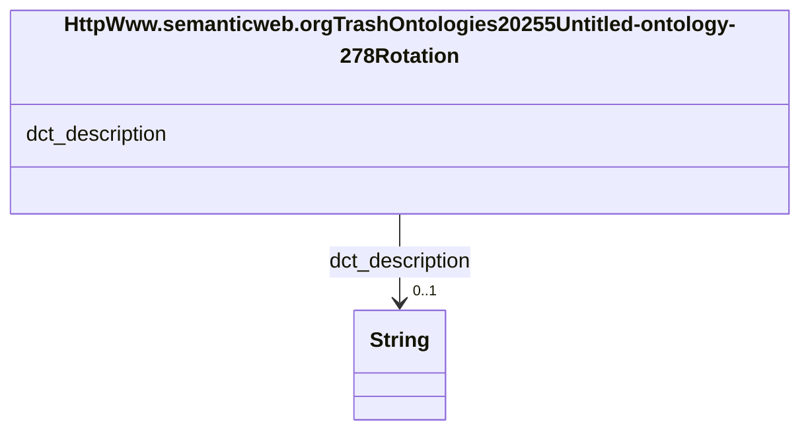

# Class: HttpWww.semanticweb.orgTrashOntologies20255Untitled-ontology-278Rotation


This class occurs 66 times.


URI: [http://www.semanticweb.org/trash/ontologies/2025/5/untitled-ontology-278/Rotation](http://www.semanticweb.org/trash/ontologies/2025/5/untitled-ontology-278/Rotation)





<!-- no inheritance hierarchy -->


## Slots

| Name | Cardinality and Range | Description | Inheritance | Occurrences |
| ---  | --- | --- | --- | --- |
| [dct_description](../slots/dct_description.md) | 0..1 <br/> [xsd:string](http://www.w3.org/2001/XMLSchema#string) | Description may include but is not limited to: an abstract, a table of conten... <br/> description: An account of the resource. | direct | 66 |


## Usages

| used by | used in | type | used |
| ---  | --- | --- | --- |
| [HttpWww.semanticweb.orgTrashOntologies20255Untitled-ontology-278Treatment](../classes/HttpWww.semanticweb.orgTrashOntologies20255Untitled-ontology-278Treatment.md) | [http___www.semanticweb.org_trash_ontologies_2025_5_untitled_ontology_278_hasRotation](../slots/http___www.semanticweb.org_trash_ontologies_2025_5_untitled_ontology_278_hasRotation.md) | range | [HttpWww.semanticweb.orgTrashOntologies20255Untitled-ontology-278Rotation](../classes/HttpWww.semanticweb.orgTrashOntologies20255Untitled-ontology-278Rotation.md) |


## LinkML Source

<!-- TODO: investigate https://stackoverflow.com/questions/37606292/how-to-create-tabbed-code-blocks-in-mkdocs-or-sphinx -->

### Direct

<details>

```yaml
name: http___www.semanticweb.org_trash_ontologies_2025_5_untitled-ontology-278_Rotation
from_schema: okns:soc-kg
rank: 1000
slots:
- dct_description
class_uri: http://www.semanticweb.org/trash/ontologies/2025/5/untitled-ontology-278/Rotation

```
</details>

### Induced

<details>

```yaml
name: http___www.semanticweb.org_trash_ontologies_2025_5_untitled-ontology-278_Rotation
from_schema: okns:soc-kg
rank: 1000
attributes:
  dct_description:
    name: dct_description
    description: 'Description may include but is not limited to: an abstract, a table
      of contents, a graphical representation, or a free-text account of the resource.'
    title: Description
    comments:
    - 'description: An account of the resource.'
    from_schema: okns:dc
    source: http://purl.org/dc/terms/
    slot_uri: dct:description
    alias: dct_description
    owner: http___www.semanticweb.org_trash_ontologies_2025_5_untitled-ontology-278_Rotation
    domain_of:
    - qudt_BinaryPrefix
    - qudt_CardinalityType
    - qudt_ContextualUnit
    - qudt_CountingUnit
    - qudt_DecimalPrefix
    - qudt_DerivedUnit
    - qudt_DimensionlessUnit
    - qudt_LogarithmicUnit
    - qudt_Unit
    - vaem_GraphRole
    - http___www.semanticweb.org_trash_ontologies_2025_5_untitled-ontology-278_AnimalSpecies
    - http___www.semanticweb.org_trash_ontologies_2025_5_untitled-ontology-278_CoverCrop
    - http___www.semanticweb.org_trash_ontologies_2025_5_untitled-ontology-278_FertilizerAmendment
    - http___www.semanticweb.org_trash_ontologies_2025_5_untitled-ontology-278_GrazingRate
    - http___www.semanticweb.org_trash_ontologies_2025_5_untitled-ontology-278_JournalArticle
    - http___www.semanticweb.org_trash_ontologies_2025_5_untitled-ontology-278_Location
    - http___www.semanticweb.org_trash_ontologies_2025_5_untitled-ontology-278_Proceedings
    - http___www.semanticweb.org_trash_ontologies_2025_5_untitled-ontology-278_Project
    - http___www.semanticweb.org_trash_ontologies_2025_5_untitled-ontology-278_ProjectScenario
    - http___www.semanticweb.org_trash_ontologies_2025_5_untitled-ontology-278_ResidueRemoval
    - http___www.semanticweb.org_trash_ontologies_2025_5_untitled-ontology-278_Rotation
    - http___www.semanticweb.org_trash_ontologies_2025_5_untitled-ontology-278_Thesis
    - http___www.semanticweb.org_trash_ontologies_2025_5_untitled-ontology-278_Tillage
    - http___www.semanticweb.org_trash_ontologies_2025_5_untitled-ontology-278_Timing
    - http___www.semanticweb.org_trash_ontologies_2025_5_untitled-ontology-278_Treatment
    subproperty_of: dc_description
    range: string
class_uri: http://www.semanticweb.org/trash/ontologies/2025/5/untitled-ontology-278/Rotation

```
</details>