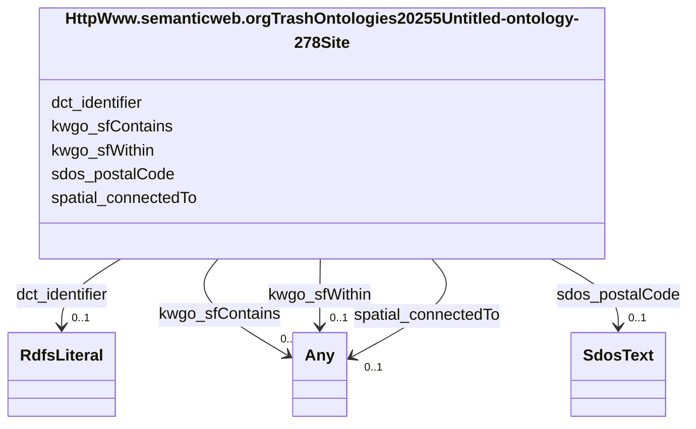

# Class: HttpWww.semanticweb.orgTrashOntologies20255Untitled-ontology-278Site


This class occurs 60 times.


URI: [http://www.semanticweb.org/trash/ontologies/2025/5/untitled-ontology-278/Site](http://www.semanticweb.org/trash/ontologies/2025/5/untitled-ontology-278/Site)





<!-- no inheritance hierarchy -->


## Slots

| Name | Cardinality and Range | Description | Inheritance | Occurrences |
| ---  | --- | --- | --- | --- |
| [sdos_postalCode](../slots/sdos_postalCode.md) | 0..1 <br/> [SdosText](../classes/SdosText.md) | The postal code <br/>  | direct | 59 |
| [spatial_connectedTo](../slots/spatial_connectedTo.md) | 0..1 <br/> [HttpWww.semanticweb.orgTrashOntologies20255Untitled-ontology-278Site](../classes/HttpWww.semanticweb.orgTrashOntologies20255Untitled-ontology-278Site.md)&nbsp;or&nbsp;<br />[HttpWww.semanticweb.orgTrashOntologies20255Untitled-ontology-278Location](../classes/HttpWww.semanticweb.orgTrashOntologies20255Untitled-ontology-278Location.md)&nbsp;or&nbsp;<br />[KwgoAdministrativeRegion2](../classes/KwgoAdministrativeRegion2.md)&nbsp;or&nbsp;<br />[KwgoS2CellLevel13](../classes/KwgoS2CellLevel13.md) |  <br/>  | direct | 134 |
| [kwgo_sfContains](../slots/kwgo_sfContains.md) | 0..1 <br/> [Any](../classes/Any.md) | KWG's spatial contains relation <br/>  | direct | 3808 |
| [kwgo_sfWithin](../slots/kwgo_sfWithin.md) | 0..1 <br/> [Any](../classes/Any.md) | KWG's spatial within relation <br/>  | direct | 227 |
| [dct_identifier](../slots/dct_identifier.md) | 0..1 <br/> [RdfsLiteral](../classes/RdfsLiteral.md) | Recommended practice is to identify the resource by means of a string conform... <br/> description: An unambiguous reference to the resource within a given context. | direct | 60 |


## Usages

| used by | used in | type | used |
| ---  | --- | --- | --- |
| [HttpWww.semanticweb.orgTrashOntologies20255Untitled-ontology-278Location](../classes/HttpWww.semanticweb.orgTrashOntologies20255Untitled-ontology-278Location.md) | [spatial_connectedTo](../slots/spatial_connectedTo.md) | any_of[range] | [HttpWww.semanticweb.orgTrashOntologies20255Untitled-ontology-278Site](../classes/HttpWww.semanticweb.orgTrashOntologies20255Untitled-ontology-278Site.md) |
| [HttpWww.semanticweb.orgTrashOntologies20255Untitled-ontology-278Site](../classes/HttpWww.semanticweb.orgTrashOntologies20255Untitled-ontology-278Site.md) | [spatial_connectedTo](../slots/spatial_connectedTo.md) | any_of[range] | [HttpWww.semanticweb.orgTrashOntologies20255Untitled-ontology-278Site](../classes/HttpWww.semanticweb.orgTrashOntologies20255Untitled-ontology-278Site.md) |
| [KwgoS2CellLevel13](../classes/KwgoS2CellLevel13.md) | [spatial_connectedTo](../slots/spatial_connectedTo.md) | any_of[range] | [HttpWww.semanticweb.orgTrashOntologies20255Untitled-ontology-278Site](../classes/HttpWww.semanticweb.orgTrashOntologies20255Untitled-ontology-278Site.md) |


## LinkML Source

<!-- TODO: investigate https://stackoverflow.com/questions/37606292/how-to-create-tabbed-code-blocks-in-mkdocs-or-sphinx -->

### Direct

<details>

```yaml
name: http___www.semanticweb.org_trash_ontologies_2025_5_untitled-ontology-278_Site
from_schema: okns:soc-kg
rank: 1000
slots:
- sdos_postalCode
- spatial_connectedTo
- kwgo_sfContains
- kwgo_sfWithin
- dct_identifier
class_uri: http://www.semanticweb.org/trash/ontologies/2025/5/untitled-ontology-278/Site

```
</details>

### Induced

<details>

```yaml
name: http___www.semanticweb.org_trash_ontologies_2025_5_untitled-ontology-278_Site
from_schema: okns:soc-kg
rank: 1000
attributes:
  sdos_postalCode:
    name: sdos_postalCode
    description: The postal code. For example, 94043.
    title: postalCode
    notes:
    - No occurrences of this slot in the graph.
    from_schema: okns:sdo
    source: https://github.com/schemaorg/schemaorg/issues/2506
    slot_uri: sdos:postalCode
    alias: sdos_postalCode
    owner: http___www.semanticweb.org_trash_ontologies_2025_5_untitled-ontology-278_Site
    domain_of:
    - http___www.semanticweb.org_trash_ontologies_2025_5_untitled-ontology-278_Site
    union_of:
    - sdos_PostalAddress
    - sdos_DefinedRegion
    - sdos_GeoShape
    - sdos_GeoCoordinates
    range: sdos_Text
  spatial_connectedTo:
    name: spatial_connectedTo
    title: topological connection (spatial contact) (sawgraph)
    from_schema: okns:soc-kg
    rank: 1000
    slot_uri: spatial:connectedTo
    alias: spatial_connectedTo
    owner: http___www.semanticweb.org_trash_ontologies_2025_5_untitled-ontology-278_Site
    domain_of:
    - http___www.semanticweb.org_trash_ontologies_2025_5_untitled-ontology-278_Location
    - http___www.semanticweb.org_trash_ontologies_2025_5_untitled-ontology-278_Site
    - kwgo_S2Cell_Level13
    subproperty_of: spatial_spatiallyRelatedTo
    range: Any
    any_of:
    - range: http___www.semanticweb.org_trash_ontologies_2025_5_untitled-ontology-278_Site
    - range: http___www.semanticweb.org_trash_ontologies_2025_5_untitled-ontology-278_Location
    - range: kwgo_AdministrativeRegion_2
    - range: kwgo_S2Cell_Level13
  kwgo_sfContains:
    name: kwgo_sfContains
    description: KWG's spatial contains relation
    title: contains (simple feature)
    notes:
    - No occurrences of this slot in the graph.
    from_schema: okns:kwg
    slot_uri: kwgo:sfContains
    alias: kwgo_sfContains
    owner: http___www.semanticweb.org_trash_ontologies_2025_5_untitled-ontology-278_Site
    domain_of:
    - http___www.semanticweb.org_trash_ontologies_2025_5_untitled-ontology-278_Location
    - http___www.semanticweb.org_trash_ontologies_2025_5_untitled-ontology-278_Site
    subproperty_of: kwgo_spatialRelation
    range: Any
  kwgo_sfWithin:
    name: kwgo_sfWithin
    description: KWG's spatial within relation
    title: within (simple feature)
    notes:
    - No occurrences of this slot in the graph.
    from_schema: okns:kwg
    slot_uri: kwgo:sfWithin
    alias: kwgo_sfWithin
    owner: http___www.semanticweb.org_trash_ontologies_2025_5_untitled-ontology-278_Site
    domain_of:
    - http___www.semanticweb.org_trash_ontologies_2025_5_untitled-ontology-278_ExperimentalUnit
    - http___www.semanticweb.org_trash_ontologies_2025_5_untitled-ontology-278_Location
    - http___www.semanticweb.org_trash_ontologies_2025_5_untitled-ontology-278_Site
    - kwgo_S2Cell_Level13
    subproperty_of: kwgo_spatialRelation
    range: Any
  dct_identifier:
    name: dct_identifier
    description: Recommended practice is to identify the resource by means of a string
      conforming to an identification system. Examples include International Standard
      Book Number (ISBN), Digital Object Identifier (DOI), and Uniform Resource Name
      (URN).  Persistent identifiers should be provided as HTTP URIs.
    title: Identifier
    notes:
    - No occurrences of this slot in the graph.
    comments:
    - 'description: An unambiguous reference to the resource within a given context.'
    from_schema: okns:dc
    source: http://purl.org/dc/terms/
    slot_uri: dct:identifier
    alias: dct_identifier
    owner: http___www.semanticweb.org_trash_ontologies_2025_5_untitled-ontology-278_Site
    domain_of:
    - http___www.semanticweb.org_trash_ontologies_2025_5_untitled-ontology-278_ExperimentalUnit
    - http___www.semanticweb.org_trash_ontologies_2025_5_untitled-ontology-278_JournalArticle
    - http___www.semanticweb.org_trash_ontologies_2025_5_untitled-ontology-278_Location
    - http___www.semanticweb.org_trash_ontologies_2025_5_untitled-ontology-278_Site
    - http___www.semanticweb.org_trash_ontologies_2025_5_untitled-ontology-278_Treatment
    subproperty_of: dc_identifier
    range: rdfs_Literal
class_uri: http://www.semanticweb.org/trash/ontologies/2025/5/untitled-ontology-278/Site

```
</details>