# Class: HttpWww.semanticweb.orgTrashOntologies20255Untitled-ontology-278SoilBiologicalSample


This class occurs 18273 times.


URI: [http://www.semanticweb.org/trash/ontologies/2025/5/untitled-ontology-278/SoilBiologicalSample](http://www.semanticweb.org/trash/ontologies/2025/5/untitled-ontology-278/SoilBiologicalSample)

```mermaid
 classDiagram
    class HttpWww.semanticweb.orgTrashOntologies20255Untitled-ontology-278SoilBiologicalSample
    click HttpWww.semanticweb.orgTrashOntologies20255Untitled-ontology-278SoilBiologicalSample href "../HttpWww.semanticweb.orgTrashOntologies20255Untitled-ontology-278SoilBiologicalSample"
      HttpWww.semanticweb.orgTrashOntologies20255Untitled-ontology-278SoilBiologicalSample : dct_date
        
          
    
    
    HttpWww.semanticweb.orgTrashOntologies20255Untitled-ontology-278SoilBiologicalSample --> "0..1" RdfsLiteral : dct_date
    click RdfsLiteral href "../RdfsLiteral"

        
      HttpWww.semanticweb.orgTrashOntologies20255Untitled-ontology-278SoilBiologicalSample : http___www.semanticweb.org_trash_ontologies_2025_5_untitled_ontology_278_fromUnit
        
          
    
    
    HttpWww.semanticweb.orgTrashOntologies20255Untitled-ontology-278SoilBiologicalSample --> "0..1" Any : http___www.semanticweb.org_trash_ontologies_2025_5_untitled_ontology_278_fromUnit
    click Any href "../Any"

        
      HttpWww.semanticweb.orgTrashOntologies20255Untitled-ontology-278SoilBiologicalSample : http___www.semanticweb.org_trash_ontologies_2025_5_untitled_ontology_278_hasMeasurement
        
          
    
    
    HttpWww.semanticweb.orgTrashOntologies20255Untitled-ontology-278SoilBiologicalSample --> "0..1" HttpWww.semanticweb.orgTrashOntologies20255Untitled-ontology-278Measurement : http___www.semanticweb.org_trash_ontologies_2025_5_untitled_ontology_278_hasMeasurement
    click HttpWww.semanticweb.orgTrashOntologies20255Untitled-ontology-278Measurement href "../HttpWww.semanticweb.orgTrashOntologies20255Untitled-ontology-278Measurement"

        
      HttpWww.semanticweb.orgTrashOntologies20255Untitled-ontology-278SoilBiologicalSample : http___www.semanticweb.org_trash_ontologies_2025_5_untitled_ontology_278_lowerDepth
        
          
    
    
    HttpWww.semanticweb.orgTrashOntologies20255Untitled-ontology-278SoilBiologicalSample --> "0..1" QudtQuantityValue : http___www.semanticweb.org_trash_ontologies_2025_5_untitled_ontology_278_lowerDepth
    click QudtQuantityValue href "../QudtQuantityValue"

        
      HttpWww.semanticweb.orgTrashOntologies20255Untitled-ontology-278SoilBiologicalSample : http___www.semanticweb.org_trash_ontologies_2025_5_untitled_ontology_278_upperDepth
        
          
    
    
    HttpWww.semanticweb.orgTrashOntologies20255Untitled-ontology-278SoilBiologicalSample --> "0..1" QudtQuantityValue : http___www.semanticweb.org_trash_ontologies_2025_5_untitled_ontology_278_upperDepth
    click QudtQuantityValue href "../QudtQuantityValue"

        
      HttpWww.semanticweb.orgTrashOntologies20255Untitled-ontology-278SoilBiologicalSample : http___www.semanticweb.org_trash_ontologies_2025_5_untitled_ontology_278_usesTreatment
        
          
    
    
    HttpWww.semanticweb.orgTrashOntologies20255Untitled-ontology-278SoilBiologicalSample --> "0..1" Any : http___www.semanticweb.org_trash_ontologies_2025_5_untitled_ontology_278_usesTreatment
    click Any href "../Any"

        
      
```





<!-- no inheritance hierarchy -->


## Slots

| Name | Cardinality and Range | Description | Inheritance | Occurrences |
| ---  | --- | --- | --- | --- |
| [http___www.semanticweb.org_trash_ontologies_2025_5_untitled_ontology_278_fromUnit](../slots/http___www.semanticweb.org_trash_ontologies_2025_5_untitled_ontology_278_fromUnit.md) | 0..1 <br/> [xsd:anyURI](http://www.w3.org/2001/XMLSchema#anyURI)&nbsp;or&nbsp;<br />[HttpWww.semanticweb.orgTrashOntologies20255Untitled-ontology-278ExperimentalUnit](../classes/HttpWww.semanticweb.orgTrashOntologies20255Untitled-ontology-278ExperimentalUnit.md) |  <br/>  | direct | 18273 |
| [http___www.semanticweb.org_trash_ontologies_2025_5_untitled_ontology_278_usesTreatment](../slots/http___www.semanticweb.org_trash_ontologies_2025_5_untitled_ontology_278_usesTreatment.md) | 0..1 <br/> [xsd:anyURI](http://www.w3.org/2001/XMLSchema#anyURI)&nbsp;or&nbsp;<br />[HttpWww.semanticweb.orgTrashOntologies20255Untitled-ontology-278Treatment](../classes/HttpWww.semanticweb.orgTrashOntologies20255Untitled-ontology-278Treatment.md) |  <br/>  | direct | 18273 |
| [dct_date](../slots/dct_date.md) | 0..1 <br/> [RdfsLiteral](../classes/RdfsLiteral.md) | Date may be used to express temporal information at any level of granularity <br/> description: A point or period of time associated with an event in the lifecycle of the resource. | direct | 18273 |
| [http___www.semanticweb.org_trash_ontologies_2025_5_untitled_ontology_278_hasMeasurement](../slots/http___www.semanticweb.org_trash_ontologies_2025_5_untitled_ontology_278_hasMeasurement.md) | 0..1 <br/> [HttpWww.semanticweb.orgTrashOntologies20255Untitled-ontology-278Measurement](../classes/HttpWww.semanticweb.orgTrashOntologies20255Untitled-ontology-278Measurement.md) |  <br/>  | direct | 41656 |
| [http___www.semanticweb.org_trash_ontologies_2025_5_untitled_ontology_278_lowerDepth](../slots/http___www.semanticweb.org_trash_ontologies_2025_5_untitled_ontology_278_lowerDepth.md) | 0..1 <br/> [QudtQuantityValue](../classes/QudtQuantityValue.md) |  <br/>  | direct | 18273 |
| [http___www.semanticweb.org_trash_ontologies_2025_5_untitled_ontology_278_upperDepth](../slots/http___www.semanticweb.org_trash_ontologies_2025_5_untitled_ontology_278_upperDepth.md) | 0..1 <br/> [QudtQuantityValue](../classes/QudtQuantityValue.md) |  <br/>  | direct | 18273 |


## LinkML Source

<!-- TODO: investigate https://stackoverflow.com/questions/37606292/how-to-create-tabbed-code-blocks-in-mkdocs-or-sphinx -->

### Direct

<details>

```yaml
name: http___www.semanticweb.org_trash_ontologies_2025_5_untitled-ontology-278_SoilBiologicalSample
from_schema: okns:soc-kg
rank: 1000
slots:
- http___www.semanticweb.org_trash_ontologies_2025_5_untitled-ontology-278_fromUnit
- http___www.semanticweb.org_trash_ontologies_2025_5_untitled-ontology-278_usesTreatment
- dct_date
- http___www.semanticweb.org_trash_ontologies_2025_5_untitled-ontology-278_hasMeasurement
- http___www.semanticweb.org_trash_ontologies_2025_5_untitled-ontology-278_lowerDepth
- http___www.semanticweb.org_trash_ontologies_2025_5_untitled-ontology-278_upperDepth
class_uri: http://www.semanticweb.org/trash/ontologies/2025/5/untitled-ontology-278/SoilBiologicalSample

```
</details>

### Induced

<details>

```yaml
name: http___www.semanticweb.org_trash_ontologies_2025_5_untitled-ontology-278_SoilBiologicalSample
from_schema: okns:soc-kg
rank: 1000
attributes:
  http___www.semanticweb.org_trash_ontologies_2025_5_untitled-ontology-278_fromUnit:
    name: http___www.semanticweb.org_trash_ontologies_2025_5_untitled-ontology-278_fromUnit
    from_schema: okns:soc-kg
    rank: 1000
    slot_uri: http://www.semanticweb.org/trash/ontologies/2025/5/untitled-ontology-278/fromUnit
    alias: http___www.semanticweb.org_trash_ontologies_2025_5_untitled_ontology_278_fromUnit
    owner: http___www.semanticweb.org_trash_ontologies_2025_5_untitled-ontology-278_SoilBiologicalSample
    domain_of:
    - http___www.semanticweb.org_trash_ontologies_2025_5_untitled-ontology-278_BiomassCarbohydrate
    - http___www.semanticweb.org_trash_ontologies_2025_5_untitled-ontology-278_BiomassEnergy
    - http___www.semanticweb.org_trash_ontologies_2025_5_untitled-ontology-278_BiomassMineral
    - http___www.semanticweb.org_trash_ontologies_2025_5_untitled-ontology-278_GasNutrientLoss
    - http___www.semanticweb.org_trash_ontologies_2025_5_untitled-ontology-278_GrazingPlants
    - http___www.semanticweb.org_trash_ontologies_2025_5_untitled-ontology-278_HarvestFraction
    - http___www.semanticweb.org_trash_ontologies_2025_5_untitled-ontology-278_NutrientEfficiency
    - http___www.semanticweb.org_trash_ontologies_2025_5_untitled-ontology-278_ResidueMeasurement
    - http___www.semanticweb.org_trash_ontologies_2025_5_untitled-ontology-278_SoilBiologicalSample
    - http___www.semanticweb.org_trash_ontologies_2025_5_untitled-ontology-278_SoilChemicalSample
    - http___www.semanticweb.org_trash_ontologies_2025_5_untitled-ontology-278_SoilCover
    - http___www.semanticweb.org_trash_ontologies_2025_5_untitled-ontology-278_SoilPhysicalSample
    - http___www.semanticweb.org_trash_ontologies_2025_5_untitled-ontology-278_WaterQualityArea
    - http___www.semanticweb.org_trash_ontologies_2025_5_untitled-ontology-278_WaterQualityConcentration
    - http___www.semanticweb.org_trash_ontologies_2025_5_untitled-ontology-278_WindErosionArea
    - http___www.semanticweb.org_trash_ontologies_2025_5_untitled-ontology-278_YieldNutrientUptake
    range: Any
    any_of:
    - range: uri
    - range: http___www.semanticweb.org_trash_ontologies_2025_5_untitled-ontology-278_ExperimentalUnit
  http___www.semanticweb.org_trash_ontologies_2025_5_untitled-ontology-278_usesTreatment:
    name: http___www.semanticweb.org_trash_ontologies_2025_5_untitled-ontology-278_usesTreatment
    from_schema: okns:soc-kg
    rank: 1000
    slot_uri: http://www.semanticweb.org/trash/ontologies/2025/5/untitled-ontology-278/usesTreatment
    alias: http___www.semanticweb.org_trash_ontologies_2025_5_untitled_ontology_278_usesTreatment
    owner: http___www.semanticweb.org_trash_ontologies_2025_5_untitled-ontology-278_SoilBiologicalSample
    domain_of:
    - http___www.semanticweb.org_trash_ontologies_2025_5_untitled-ontology-278_BiomassCarbohydrate
    - http___www.semanticweb.org_trash_ontologies_2025_5_untitled-ontology-278_BiomassEnergy
    - http___www.semanticweb.org_trash_ontologies_2025_5_untitled-ontology-278_BiomassMineral
    - http___www.semanticweb.org_trash_ontologies_2025_5_untitled-ontology-278_GasNutrientLoss
    - http___www.semanticweb.org_trash_ontologies_2025_5_untitled-ontology-278_GrazingPlants
    - http___www.semanticweb.org_trash_ontologies_2025_5_untitled-ontology-278_HarvestFraction
    - http___www.semanticweb.org_trash_ontologies_2025_5_untitled-ontology-278_NutrientEfficiency
    - http___www.semanticweb.org_trash_ontologies_2025_5_untitled-ontology-278_ResidueMeasurement
    - http___www.semanticweb.org_trash_ontologies_2025_5_untitled-ontology-278_SoilBiologicalSample
    - http___www.semanticweb.org_trash_ontologies_2025_5_untitled-ontology-278_SoilChemicalSample
    - http___www.semanticweb.org_trash_ontologies_2025_5_untitled-ontology-278_SoilCover
    - http___www.semanticweb.org_trash_ontologies_2025_5_untitled-ontology-278_SoilPhysicalSample
    - http___www.semanticweb.org_trash_ontologies_2025_5_untitled-ontology-278_WaterQualityArea
    - http___www.semanticweb.org_trash_ontologies_2025_5_untitled-ontology-278_WaterQualityConcentration
    - http___www.semanticweb.org_trash_ontologies_2025_5_untitled-ontology-278_WindErosionArea
    - http___www.semanticweb.org_trash_ontologies_2025_5_untitled-ontology-278_YieldNutrientUptake
    range: Any
    any_of:
    - range: uri
    - range: http___www.semanticweb.org_trash_ontologies_2025_5_untitled-ontology-278_Treatment
  dct_date:
    name: dct_date
    description: Date may be used to express temporal information at any level of
      granularity.  Recommended practice is to express the date, date/time, or period
      of time according to ISO 8601-1 [[ISO 8601-1](https://www.iso.org/iso-8601-date-and-time-format.html)]
      or a published profile of the ISO standard, such as the W3C Note on Date and
      Time Formats [[W3CDTF](https://www.w3.org/TR/NOTE-datetime)] or the Extended
      Date/Time Format Specification [[EDTF](http://www.loc.gov/standards/datetime/)].  If
      the full date is unknown, month and year (YYYY-MM) or just year (YYYY) may be
      used. Date ranges may be specified using ISO 8601 period of time specification
      in which start and end dates are separated by a '/' (slash) character.  Either
      the start or end date may be missing.
    title: Date
    notes:
    - No occurrences of this slot in the graph.
    comments:
    - 'description: A point or period of time associated with an event in the lifecycle
      of the resource.'
    from_schema: okns:dc
    source: http://purl.org/dc/terms/
    slot_uri: dct:date
    alias: dct_date
    owner: http___www.semanticweb.org_trash_ontologies_2025_5_untitled-ontology-278_SoilBiologicalSample
    domain_of:
    - http___www.semanticweb.org_trash_ontologies_2025_5_untitled-ontology-278_BiomassCarbohydrate
    - http___www.semanticweb.org_trash_ontologies_2025_5_untitled-ontology-278_BiomassEnergy
    - http___www.semanticweb.org_trash_ontologies_2025_5_untitled-ontology-278_BiomassMineral
    - http___www.semanticweb.org_trash_ontologies_2025_5_untitled-ontology-278_GasNutrientLoss
    - http___www.semanticweb.org_trash_ontologies_2025_5_untitled-ontology-278_GrazingPlants
    - http___www.semanticweb.org_trash_ontologies_2025_5_untitled-ontology-278_GrowthStageManagement
    - http___www.semanticweb.org_trash_ontologies_2025_5_untitled-ontology-278_HarvestFraction
    - http___www.semanticweb.org_trash_ontologies_2025_5_untitled-ontology-278_NutrientEfficiency
    - http___www.semanticweb.org_trash_ontologies_2025_5_untitled-ontology-278_ResidueMeasurement
    - http___www.semanticweb.org_trash_ontologies_2025_5_untitled-ontology-278_SoilBiologicalSample
    - http___www.semanticweb.org_trash_ontologies_2025_5_untitled-ontology-278_SoilChemicalSample
    - http___www.semanticweb.org_trash_ontologies_2025_5_untitled-ontology-278_SoilCover
    - http___www.semanticweb.org_trash_ontologies_2025_5_untitled-ontology-278_SoilPhysicalSample
    - http___www.semanticweb.org_trash_ontologies_2025_5_untitled-ontology-278_WaterQualityArea
    - http___www.semanticweb.org_trash_ontologies_2025_5_untitled-ontology-278_WaterQualityConcentration
    - http___www.semanticweb.org_trash_ontologies_2025_5_untitled-ontology-278_WindErosionArea
    - http___www.semanticweb.org_trash_ontologies_2025_5_untitled-ontology-278_YieldNutrientUptake
    subproperty_of: dc_date
    range: rdfs_Literal
  http___www.semanticweb.org_trash_ontologies_2025_5_untitled-ontology-278_hasMeasurement:
    name: http___www.semanticweb.org_trash_ontologies_2025_5_untitled-ontology-278_hasMeasurement
    from_schema: okns:soc-kg
    rank: 1000
    slot_uri: http://www.semanticweb.org/trash/ontologies/2025/5/untitled-ontology-278/hasMeasurement
    alias: http___www.semanticweb.org_trash_ontologies_2025_5_untitled_ontology_278_hasMeasurement
    owner: http___www.semanticweb.org_trash_ontologies_2025_5_untitled-ontology-278_SoilBiologicalSample
    domain_of:
    - http___www.semanticweb.org_trash_ontologies_2025_5_untitled-ontology-278_Amendment
    - http___www.semanticweb.org_trash_ontologies_2025_5_untitled-ontology-278_BiomassCarbohydrate
    - http___www.semanticweb.org_trash_ontologies_2025_5_untitled-ontology-278_BiomassEnergy
    - http___www.semanticweb.org_trash_ontologies_2025_5_untitled-ontology-278_BiomassMineral
    - http___www.semanticweb.org_trash_ontologies_2025_5_untitled-ontology-278_GasNutrientLoss
    - http___www.semanticweb.org_trash_ontologies_2025_5_untitled-ontology-278_GrazingManagement
    - http___www.semanticweb.org_trash_ontologies_2025_5_untitled-ontology-278_GrazingPlants
    - http___www.semanticweb.org_trash_ontologies_2025_5_untitled-ontology-278_HarvestFraction
    - http___www.semanticweb.org_trash_ontologies_2025_5_untitled-ontology-278_NutrientEfficiency
    - http___www.semanticweb.org_trash_ontologies_2025_5_untitled-ontology-278_PlantingManagement
    - http___www.semanticweb.org_trash_ontologies_2025_5_untitled-ontology-278_ResidueManagement
    - http___www.semanticweb.org_trash_ontologies_2025_5_untitled-ontology-278_ResidueMeasurement
    - http___www.semanticweb.org_trash_ontologies_2025_5_untitled-ontology-278_SoilBiologicalSample
    - http___www.semanticweb.org_trash_ontologies_2025_5_untitled-ontology-278_SoilChemicalSample
    - http___www.semanticweb.org_trash_ontologies_2025_5_untitled-ontology-278_SoilPhysicalSample
    - http___www.semanticweb.org_trash_ontologies_2025_5_untitled-ontology-278_TillageManagement
    - http___www.semanticweb.org_trash_ontologies_2025_5_untitled-ontology-278_WaterQualityArea
    - http___www.semanticweb.org_trash_ontologies_2025_5_untitled-ontology-278_WaterQualityConcentration
    - http___www.semanticweb.org_trash_ontologies_2025_5_untitled-ontology-278_WindErosionArea
    - http___www.semanticweb.org_trash_ontologies_2025_5_untitled-ontology-278_YieldNutrientUptake
    range: http___www.semanticweb.org_trash_ontologies_2025_5_untitled-ontology-278_Measurement
  http___www.semanticweb.org_trash_ontologies_2025_5_untitled-ontology-278_lowerDepth:
    name: http___www.semanticweb.org_trash_ontologies_2025_5_untitled-ontology-278_lowerDepth
    from_schema: okns:soc-kg
    rank: 1000
    slot_uri: http://www.semanticweb.org/trash/ontologies/2025/5/untitled-ontology-278/lowerDepth
    alias: http___www.semanticweb.org_trash_ontologies_2025_5_untitled_ontology_278_lowerDepth
    owner: http___www.semanticweb.org_trash_ontologies_2025_5_untitled-ontology-278_SoilBiologicalSample
    domain_of:
    - http___www.semanticweb.org_trash_ontologies_2025_5_untitled-ontology-278_SoilBiologicalSample
    - http___www.semanticweb.org_trash_ontologies_2025_5_untitled-ontology-278_SoilChemicalSample
    - http___www.semanticweb.org_trash_ontologies_2025_5_untitled-ontology-278_SoilPhysicalSample
    range: qudt_QuantityValue
  http___www.semanticweb.org_trash_ontologies_2025_5_untitled-ontology-278_upperDepth:
    name: http___www.semanticweb.org_trash_ontologies_2025_5_untitled-ontology-278_upperDepth
    from_schema: okns:soc-kg
    rank: 1000
    slot_uri: http://www.semanticweb.org/trash/ontologies/2025/5/untitled-ontology-278/upperDepth
    alias: http___www.semanticweb.org_trash_ontologies_2025_5_untitled_ontology_278_upperDepth
    owner: http___www.semanticweb.org_trash_ontologies_2025_5_untitled-ontology-278_SoilBiologicalSample
    domain_of:
    - http___www.semanticweb.org_trash_ontologies_2025_5_untitled-ontology-278_SoilBiologicalSample
    - http___www.semanticweb.org_trash_ontologies_2025_5_untitled-ontology-278_SoilChemicalSample
    - http___www.semanticweb.org_trash_ontologies_2025_5_untitled-ontology-278_SoilPhysicalSample
    range: qudt_QuantityValue
class_uri: http://www.semanticweb.org/trash/ontologies/2025/5/untitled-ontology-278/SoilBiologicalSample

```
</details>