# Class: HttpWww.semanticweb.orgTrashOntologies20255Untitled-ontology-278Treatment


This class occurs 769 times.


URI: [http://www.semanticweb.org/trash/ontologies/2025/5/untitled-ontology-278/Treatment](http://www.semanticweb.org/trash/ontologies/2025/5/untitled-ontology-278/Treatment)

```mermaid
 classDiagram
    class HttpWww.semanticweb.orgTrashOntologies20255Untitled-ontology-278Treatment
    click HttpWww.semanticweb.orgTrashOntologies20255Untitled-ontology-278Treatment href "../HttpWww.semanticweb.orgTrashOntologies20255Untitled-ontology-278Treatment"
      HttpWww.semanticweb.orgTrashOntologies20255Untitled-ontology-278Treatment : dct_description
        
          
    
    
    HttpWww.semanticweb.orgTrashOntologies20255Untitled-ontology-278Treatment --> "0..1" String : dct_description
    click String href "../String"

        
      HttpWww.semanticweb.orgTrashOntologies20255Untitled-ontology-278Treatment : dct_identifier
        
          
    
    
    HttpWww.semanticweb.orgTrashOntologies20255Untitled-ontology-278Treatment --> "0..1" RdfsLiteral : dct_identifier
    click RdfsLiteral href "../RdfsLiteral"

        
      HttpWww.semanticweb.orgTrashOntologies20255Untitled-ontology-278Treatment : http___www.semanticweb.org_trash_ontologies_2025_5_untitled_ontology_278_fromProject
        
          
    
    
    HttpWww.semanticweb.orgTrashOntologies20255Untitled-ontology-278Treatment --> "0..1" HttpWww.semanticweb.orgTrashOntologies20255Untitled-ontology-278Project : http___www.semanticweb.org_trash_ontologies_2025_5_untitled_ontology_278_fromProject
    click HttpWww.semanticweb.orgTrashOntologies20255Untitled-ontology-278Project href "../HttpWww.semanticweb.orgTrashOntologies20255Untitled-ontology-278Project"

        
      HttpWww.semanticweb.orgTrashOntologies20255Untitled-ontology-278Treatment : http___www.semanticweb.org_trash_ontologies_2025_5_untitled_ontology_278_hasAnimalSpecies
        
          
    
    
    HttpWww.semanticweb.orgTrashOntologies20255Untitled-ontology-278Treatment --> "0..1" HttpWww.semanticweb.orgTrashOntologies20255Untitled-ontology-278AnimalSpecies : http___www.semanticweb.org_trash_ontologies_2025_5_untitled_ontology_278_hasAnimalSpecies
    click HttpWww.semanticweb.orgTrashOntologies20255Untitled-ontology-278AnimalSpecies href "../HttpWww.semanticweb.orgTrashOntologies20255Untitled-ontology-278AnimalSpecies"

        
      HttpWww.semanticweb.orgTrashOntologies20255Untitled-ontology-278Treatment : http___www.semanticweb.org_trash_ontologies_2025_5_untitled_ontology_278_hasGrazingRate
        
          
    
    
    HttpWww.semanticweb.orgTrashOntologies20255Untitled-ontology-278Treatment --> "0..1" HttpWww.semanticweb.orgTrashOntologies20255Untitled-ontology-278GrazingRate : http___www.semanticweb.org_trash_ontologies_2025_5_untitled_ontology_278_hasGrazingRate
    click HttpWww.semanticweb.orgTrashOntologies20255Untitled-ontology-278GrazingRate href "../HttpWww.semanticweb.orgTrashOntologies20255Untitled-ontology-278GrazingRate"

        
      HttpWww.semanticweb.orgTrashOntologies20255Untitled-ontology-278Treatment : http___www.semanticweb.org_trash_ontologies_2025_5_untitled_ontology_278_hasProjectScenario
        
          
    
    
    HttpWww.semanticweb.orgTrashOntologies20255Untitled-ontology-278Treatment --> "0..1" HttpWww.semanticweb.orgTrashOntologies20255Untitled-ontology-278ProjectScenario : http___www.semanticweb.org_trash_ontologies_2025_5_untitled_ontology_278_hasProjectScenario
    click HttpWww.semanticweb.orgTrashOntologies20255Untitled-ontology-278ProjectScenario href "../HttpWww.semanticweb.orgTrashOntologies20255Untitled-ontology-278ProjectScenario"

        
      HttpWww.semanticweb.orgTrashOntologies20255Untitled-ontology-278Treatment : http___www.semanticweb.org_trash_ontologies_2025_5_untitled_ontology_278_hasRotation
        
          
    
    
    HttpWww.semanticweb.orgTrashOntologies20255Untitled-ontology-278Treatment --> "0..1" HttpWww.semanticweb.orgTrashOntologies20255Untitled-ontology-278Rotation : http___www.semanticweb.org_trash_ontologies_2025_5_untitled_ontology_278_hasRotation
    click HttpWww.semanticweb.orgTrashOntologies20255Untitled-ontology-278Rotation href "../HttpWww.semanticweb.orgTrashOntologies20255Untitled-ontology-278Rotation"

        
      HttpWww.semanticweb.orgTrashOntologies20255Untitled-ontology-278Treatment : http___www.semanticweb.org_trash_ontologies_2025_5_untitled_ontology_278_hasTillage
        
          
    
    
    HttpWww.semanticweb.orgTrashOntologies20255Untitled-ontology-278Treatment --> "0..1" HttpWww.semanticweb.orgTrashOntologies20255Untitled-ontology-278Tillage : http___www.semanticweb.org_trash_ontologies_2025_5_untitled_ontology_278_hasTillage
    click HttpWww.semanticweb.orgTrashOntologies20255Untitled-ontology-278Tillage href "../HttpWww.semanticweb.orgTrashOntologies20255Untitled-ontology-278Tillage"

        
      HttpWww.semanticweb.orgTrashOntologies20255Untitled-ontology-278Treatment : http___www.semanticweb.org_trash_ontologies_2025_5_untitled_ontology_278_irrigation
        
          
    
    
    HttpWww.semanticweb.orgTrashOntologies20255Untitled-ontology-278Treatment --> "0..1" Boolean : http___www.semanticweb.org_trash_ontologies_2025_5_untitled_ontology_278_irrigation
    click Boolean href "../Boolean"

        
      HttpWww.semanticweb.orgTrashOntologies20255Untitled-ontology-278Treatment : http___www.semanticweb.org_trash_ontologies_2025_5_untitled_ontology_278_organicManagement
        
          
    
    
    HttpWww.semanticweb.orgTrashOntologies20255Untitled-ontology-278Treatment --> "0..1" Boolean : http___www.semanticweb.org_trash_ontologies_2025_5_untitled_ontology_278_organicManagement
    click Boolean href "../Boolean"

        
      HttpWww.semanticweb.orgTrashOntologies20255Untitled-ontology-278Treatment : http___www.semanticweb.org_trash_ontologies_2025_5_untitled_ontology_278_startDate
        
          
    
    
    HttpWww.semanticweb.orgTrashOntologies20255Untitled-ontology-278Treatment --> "0..1" Date : http___www.semanticweb.org_trash_ontologies_2025_5_untitled_ontology_278_startDate
    click Date href "../Date"

        
      HttpWww.semanticweb.orgTrashOntologies20255Untitled-ontology-278Treatment : http___www.semanticweb.org_trash_ontologies_2025_5_untitled_ontology_278_tileDrainage
        
          
    
    
    HttpWww.semanticweb.orgTrashOntologies20255Untitled-ontology-278Treatment --> "0..1" Boolean : http___www.semanticweb.org_trash_ontologies_2025_5_untitled_ontology_278_tileDrainage
    click Boolean href "../Boolean"

        
      HttpWww.semanticweb.orgTrashOntologies20255Untitled-ontology-278Treatment : http___www.semanticweb.org_trash_ontologies_2025_5_untitled_ontology_278_treatmentHasAmendment
        
          
    
    
    HttpWww.semanticweb.orgTrashOntologies20255Untitled-ontology-278Treatment --> "0..1" HttpWww.semanticweb.orgTrashOntologies20255Untitled-ontology-278Amendment : http___www.semanticweb.org_trash_ontologies_2025_5_untitled_ontology_278_treatmentHasAmendment
    click HttpWww.semanticweb.orgTrashOntologies20255Untitled-ontology-278Amendment href "../HttpWww.semanticweb.orgTrashOntologies20255Untitled-ontology-278Amendment"

        
      HttpWww.semanticweb.orgTrashOntologies20255Untitled-ontology-278Treatment : http___www.semanticweb.org_trash_ontologies_2025_5_untitled_ontology_278_treatmentHasGrazingManagement
        
          
    
    
    HttpWww.semanticweb.orgTrashOntologies20255Untitled-ontology-278Treatment --> "0..1" HttpWww.semanticweb.orgTrashOntologies20255Untitled-ontology-278GrazingManagement : http___www.semanticweb.org_trash_ontologies_2025_5_untitled_ontology_278_treatmentHasGrazingManagement
    click HttpWww.semanticweb.orgTrashOntologies20255Untitled-ontology-278GrazingManagement href "../HttpWww.semanticweb.orgTrashOntologies20255Untitled-ontology-278GrazingManagement"

        
      HttpWww.semanticweb.orgTrashOntologies20255Untitled-ontology-278Treatment : http___www.semanticweb.org_trash_ontologies_2025_5_untitled_ontology_278_treatmentHasGrowthStageManagement
        
          
    
    
    HttpWww.semanticweb.orgTrashOntologies20255Untitled-ontology-278Treatment --> "0..1" HttpWww.semanticweb.orgTrashOntologies20255Untitled-ontology-278GrowthStageManagement : http___www.semanticweb.org_trash_ontologies_2025_5_untitled_ontology_278_treatmentHasGrowthStageManagement
    click HttpWww.semanticweb.orgTrashOntologies20255Untitled-ontology-278GrowthStageManagement href "../HttpWww.semanticweb.orgTrashOntologies20255Untitled-ontology-278GrowthStageManagement"

        
      HttpWww.semanticweb.orgTrashOntologies20255Untitled-ontology-278Treatment : http___www.semanticweb.org_trash_ontologies_2025_5_untitled_ontology_278_treatmentHasPlantingManagement
        
          
    
    
    HttpWww.semanticweb.orgTrashOntologies20255Untitled-ontology-278Treatment --> "0..1" HttpWww.semanticweb.orgTrashOntologies20255Untitled-ontology-278PlantingManagement : http___www.semanticweb.org_trash_ontologies_2025_5_untitled_ontology_278_treatmentHasPlantingManagement
    click HttpWww.semanticweb.orgTrashOntologies20255Untitled-ontology-278PlantingManagement href "../HttpWww.semanticweb.orgTrashOntologies20255Untitled-ontology-278PlantingManagement"

        
      HttpWww.semanticweb.orgTrashOntologies20255Untitled-ontology-278Treatment : http___www.semanticweb.org_trash_ontologies_2025_5_untitled_ontology_278_treatmentHasResidueManagement
        
          
    
    
    HttpWww.semanticweb.orgTrashOntologies20255Untitled-ontology-278Treatment --> "0..1" HttpWww.semanticweb.orgTrashOntologies20255Untitled-ontology-278ResidueManagement : http___www.semanticweb.org_trash_ontologies_2025_5_untitled_ontology_278_treatmentHasResidueManagement
    click HttpWww.semanticweb.orgTrashOntologies20255Untitled-ontology-278ResidueManagement href "../HttpWww.semanticweb.orgTrashOntologies20255Untitled-ontology-278ResidueManagement"

        
      HttpWww.semanticweb.orgTrashOntologies20255Untitled-ontology-278Treatment : http___www.semanticweb.org_trash_ontologies_2025_5_untitled_ontology_278_treatmentHasTillageManagement
        
          
    
    
    HttpWww.semanticweb.orgTrashOntologies20255Untitled-ontology-278Treatment --> "0..1" HttpWww.semanticweb.orgTrashOntologies20255Untitled-ontology-278TillageManagement : http___www.semanticweb.org_trash_ontologies_2025_5_untitled_ontology_278_treatmentHasTillageManagement
    click HttpWww.semanticweb.orgTrashOntologies20255Untitled-ontology-278TillageManagement href "../HttpWww.semanticweb.orgTrashOntologies20255Untitled-ontology-278TillageManagement"

        
      HttpWww.semanticweb.orgTrashOntologies20255Untitled-ontology-278Treatment : http___www.semanticweb.org_trash_ontologies_2025_5_untitled_ontology_278_usesCoverCrop
        
          
    
    
    HttpWww.semanticweb.orgTrashOntologies20255Untitled-ontology-278Treatment --> "0..1" HttpWww.semanticweb.orgTrashOntologies20255Untitled-ontology-278CoverCrop : http___www.semanticweb.org_trash_ontologies_2025_5_untitled_ontology_278_usesCoverCrop
    click HttpWww.semanticweb.orgTrashOntologies20255Untitled-ontology-278CoverCrop href "../HttpWww.semanticweb.orgTrashOntologies20255Untitled-ontology-278CoverCrop"

        
      HttpWww.semanticweb.orgTrashOntologies20255Untitled-ontology-278Treatment : http___www.semanticweb.org_trash_ontologies_2025_5_untitled_ontology_278_usesFertilizerAmendment
        
          
    
    
    HttpWww.semanticweb.orgTrashOntologies20255Untitled-ontology-278Treatment --> "0..1" HttpWww.semanticweb.orgTrashOntologies20255Untitled-ontology-278FertilizerAmendment : http___www.semanticweb.org_trash_ontologies_2025_5_untitled_ontology_278_usesFertilizerAmendment
    click HttpWww.semanticweb.orgTrashOntologies20255Untitled-ontology-278FertilizerAmendment href "../HttpWww.semanticweb.orgTrashOntologies20255Untitled-ontology-278FertilizerAmendment"

        
      HttpWww.semanticweb.orgTrashOntologies20255Untitled-ontology-278Treatment : http___www.semanticweb.org_trash_ontologies_2025_5_untitled_ontology_278_usesResidueRemoval
        
          
    
    
    HttpWww.semanticweb.orgTrashOntologies20255Untitled-ontology-278Treatment --> "0..1" HttpWww.semanticweb.orgTrashOntologies20255Untitled-ontology-278ResidueRemoval : http___www.semanticweb.org_trash_ontologies_2025_5_untitled_ontology_278_usesResidueRemoval
    click HttpWww.semanticweb.orgTrashOntologies20255Untitled-ontology-278ResidueRemoval href "../HttpWww.semanticweb.orgTrashOntologies20255Untitled-ontology-278ResidueRemoval"

        
      
```





<!-- no inheritance hierarchy -->


## Slots

| Name | Cardinality and Range | Description | Inheritance | Occurrences |
| ---  | --- | --- | --- | --- |
| [http___www.semanticweb.org_trash_ontologies_2025_5_untitled_ontology_278_treatmentHasGrowthStageManagement](../slots/http___www.semanticweb.org_trash_ontologies_2025_5_untitled_ontology_278_treatmentHasGrowthStageManagement.md) | 0..1 <br/> [HttpWww.semanticweb.orgTrashOntologies20255Untitled-ontology-278GrowthStageManagement](../classes/HttpWww.semanticweb.orgTrashOntologies20255Untitled-ontology-278GrowthStageManagement.md) |  <br/>  | direct | 5148 |
| [http___www.semanticweb.org_trash_ontologies_2025_5_untitled_ontology_278_treatmentHasAmendment](../slots/http___www.semanticweb.org_trash_ontologies_2025_5_untitled_ontology_278_treatmentHasAmendment.md) | 0..1 <br/> [HttpWww.semanticweb.orgTrashOntologies20255Untitled-ontology-278Amendment](../classes/HttpWww.semanticweb.orgTrashOntologies20255Untitled-ontology-278Amendment.md) |  <br/>  | direct | 47106 |
| [dct_description](../slots/dct_description.md) | 0..1 <br/> [xsd:string](http://www.w3.org/2001/XMLSchema#string) | Description may include but is not limited to: an abstract, a table of conten... <br/> description: An account of the resource. | direct | 774 |
| [http___www.semanticweb.org_trash_ontologies_2025_5_untitled_ontology_278_organicManagement](../slots/http___www.semanticweb.org_trash_ontologies_2025_5_untitled_ontology_278_organicManagement.md) | 0..1 <br/> [xsd:boolean](http://www.w3.org/2001/XMLSchema#boolean) |  <br/>  | direct | 769 |
| [http___www.semanticweb.org_trash_ontologies_2025_5_untitled_ontology_278_treatmentHasPlantingManagement](../slots/http___www.semanticweb.org_trash_ontologies_2025_5_untitled_ontology_278_treatmentHasPlantingManagement.md) | 0..1 <br/> [HttpWww.semanticweb.orgTrashOntologies20255Untitled-ontology-278PlantingManagement](../classes/HttpWww.semanticweb.orgTrashOntologies20255Untitled-ontology-278PlantingManagement.md) |  <br/>  | direct | 23616 |
| [http___www.semanticweb.org_trash_ontologies_2025_5_untitled_ontology_278_hasProjectScenario](../slots/http___www.semanticweb.org_trash_ontologies_2025_5_untitled_ontology_278_hasProjectScenario.md) | 0..1 <br/> [HttpWww.semanticweb.orgTrashOntologies20255Untitled-ontology-278ProjectScenario](../classes/HttpWww.semanticweb.orgTrashOntologies20255Untitled-ontology-278ProjectScenario.md) |  <br/>  | direct | 826 |
| [http___www.semanticweb.org_trash_ontologies_2025_5_untitled_ontology_278_hasAnimalSpecies](../slots/http___www.semanticweb.org_trash_ontologies_2025_5_untitled_ontology_278_hasAnimalSpecies.md) | 0..1 <br/> [HttpWww.semanticweb.orgTrashOntologies20255Untitled-ontology-278AnimalSpecies](../classes/HttpWww.semanticweb.orgTrashOntologies20255Untitled-ontology-278AnimalSpecies.md) |  <br/>  | direct | 3 |
| [http___www.semanticweb.org_trash_ontologies_2025_5_untitled_ontology_278_treatmentHasGrazingManagement](../slots/http___www.semanticweb.org_trash_ontologies_2025_5_untitled_ontology_278_treatmentHasGrazingManagement.md) | 0..1 <br/> [HttpWww.semanticweb.orgTrashOntologies20255Untitled-ontology-278GrazingManagement](../classes/HttpWww.semanticweb.orgTrashOntologies20255Untitled-ontology-278GrazingManagement.md) |  <br/>  | direct | 1945 |
| [http___www.semanticweb.org_trash_ontologies_2025_5_untitled_ontology_278_treatmentHasResidueManagement](../slots/http___www.semanticweb.org_trash_ontologies_2025_5_untitled_ontology_278_treatmentHasResidueManagement.md) | 0..1 <br/> [HttpWww.semanticweb.orgTrashOntologies20255Untitled-ontology-278ResidueManagement](../classes/HttpWww.semanticweb.orgTrashOntologies20255Untitled-ontology-278ResidueManagement.md) |  <br/>  | direct | 3334 |
| [http___www.semanticweb.org_trash_ontologies_2025_5_untitled_ontology_278_usesResidueRemoval](../slots/http___www.semanticweb.org_trash_ontologies_2025_5_untitled_ontology_278_usesResidueRemoval.md) | 0..1 <br/> [HttpWww.semanticweb.orgTrashOntologies20255Untitled-ontology-278ResidueRemoval](../classes/HttpWww.semanticweb.orgTrashOntologies20255Untitled-ontology-278ResidueRemoval.md) |  <br/>  | direct | 769 |
| [http___www.semanticweb.org_trash_ontologies_2025_5_untitled_ontology_278_hasRotation](../slots/http___www.semanticweb.org_trash_ontologies_2025_5_untitled_ontology_278_hasRotation.md) | 0..1 <br/> [HttpWww.semanticweb.orgTrashOntologies20255Untitled-ontology-278Rotation](../classes/HttpWww.semanticweb.orgTrashOntologies20255Untitled-ontology-278Rotation.md) |  <br/>  | direct | 761 |
| [http___www.semanticweb.org_trash_ontologies_2025_5_untitled_ontology_278_usesFertilizerAmendment](../slots/http___www.semanticweb.org_trash_ontologies_2025_5_untitled_ontology_278_usesFertilizerAmendment.md) | 0..1 <br/> [HttpWww.semanticweb.orgTrashOntologies20255Untitled-ontology-278FertilizerAmendment](../classes/HttpWww.semanticweb.orgTrashOntologies20255Untitled-ontology-278FertilizerAmendment.md) |  <br/>  | direct | 653 |
| [http___www.semanticweb.org_trash_ontologies_2025_5_untitled_ontology_278_tileDrainage](../slots/http___www.semanticweb.org_trash_ontologies_2025_5_untitled_ontology_278_tileDrainage.md) | 0..1 <br/> [xsd:boolean](http://www.w3.org/2001/XMLSchema#boolean) |  <br/>  | direct | 438 |
| [http___www.semanticweb.org_trash_ontologies_2025_5_untitled_ontology_278_fromProject](../slots/http___www.semanticweb.org_trash_ontologies_2025_5_untitled_ontology_278_fromProject.md) | 0..1 <br/> [HttpWww.semanticweb.orgTrashOntologies20255Untitled-ontology-278Project](../classes/HttpWww.semanticweb.orgTrashOntologies20255Untitled-ontology-278Project.md) |  <br/>  | direct | 935 |
| [http___www.semanticweb.org_trash_ontologies_2025_5_untitled_ontology_278_hasGrazingRate](../slots/http___www.semanticweb.org_trash_ontologies_2025_5_untitled_ontology_278_hasGrazingRate.md) | 0..1 <br/> [HttpWww.semanticweb.orgTrashOntologies20255Untitled-ontology-278GrazingRate](../classes/HttpWww.semanticweb.orgTrashOntologies20255Untitled-ontology-278GrazingRate.md) |  <br/>  | direct | 20 |
| [dct_identifier](../slots/dct_identifier.md) | 0..1 <br/> [RdfsLiteral](../classes/RdfsLiteral.md) | Recommended practice is to identify the resource by means of a string conform... <br/> description: An unambiguous reference to the resource within a given context. | direct | 769 |
| [http___www.semanticweb.org_trash_ontologies_2025_5_untitled_ontology_278_usesCoverCrop](../slots/http___www.semanticweb.org_trash_ontologies_2025_5_untitled_ontology_278_usesCoverCrop.md) | 0..1 <br/> [HttpWww.semanticweb.orgTrashOntologies20255Untitled-ontology-278CoverCrop](../classes/HttpWww.semanticweb.orgTrashOntologies20255Untitled-ontology-278CoverCrop.md) |  <br/>  | direct | 194 |
| [http___www.semanticweb.org_trash_ontologies_2025_5_untitled_ontology_278_hasTillage](../slots/http___www.semanticweb.org_trash_ontologies_2025_5_untitled_ontology_278_hasTillage.md) | 0..1 <br/> [HttpWww.semanticweb.orgTrashOntologies20255Untitled-ontology-278Tillage](../classes/HttpWww.semanticweb.orgTrashOntologies20255Untitled-ontology-278Tillage.md) |  <br/>  | direct | 711 |
| [http___www.semanticweb.org_trash_ontologies_2025_5_untitled_ontology_278_irrigation](../slots/http___www.semanticweb.org_trash_ontologies_2025_5_untitled_ontology_278_irrigation.md) | 0..1 <br/> [xsd:boolean](http://www.w3.org/2001/XMLSchema#boolean) |  <br/>  | direct | 774 |
| [http___www.semanticweb.org_trash_ontologies_2025_5_untitled_ontology_278_startDate](../slots/http___www.semanticweb.org_trash_ontologies_2025_5_untitled_ontology_278_startDate.md) | 0..1 <br/> [xsd:date](http://www.w3.org/2001/XMLSchema#date) |  <br/>  | direct | 769 |
| [http___www.semanticweb.org_trash_ontologies_2025_5_untitled_ontology_278_treatmentHasTillageManagement](../slots/http___www.semanticweb.org_trash_ontologies_2025_5_untitled_ontology_278_treatmentHasTillageManagement.md) | 0..1 <br/> [HttpWww.semanticweb.orgTrashOntologies20255Untitled-ontology-278TillageManagement](../classes/HttpWww.semanticweb.orgTrashOntologies20255Untitled-ontology-278TillageManagement.md) |  <br/>  | direct | 27450 |


## Usages

| used by | used in | type | used |
| ---  | --- | --- | --- |
| [HttpWww.semanticweb.orgTrashOntologies20255Untitled-ontology-278BiomassCarbohydrate](../classes/HttpWww.semanticweb.orgTrashOntologies20255Untitled-ontology-278BiomassCarbohydrate.md) | [http___www.semanticweb.org_trash_ontologies_2025_5_untitled_ontology_278_usesTreatment](../slots/http___www.semanticweb.org_trash_ontologies_2025_5_untitled_ontology_278_usesTreatment.md) | any_of[range] | [HttpWww.semanticweb.orgTrashOntologies20255Untitled-ontology-278Treatment](../classes/HttpWww.semanticweb.orgTrashOntologies20255Untitled-ontology-278Treatment.md) |
| [HttpWww.semanticweb.orgTrashOntologies20255Untitled-ontology-278BiomassEnergy](../classes/HttpWww.semanticweb.orgTrashOntologies20255Untitled-ontology-278BiomassEnergy.md) | [http___www.semanticweb.org_trash_ontologies_2025_5_untitled_ontology_278_usesTreatment](../slots/http___www.semanticweb.org_trash_ontologies_2025_5_untitled_ontology_278_usesTreatment.md) | any_of[range] | [HttpWww.semanticweb.orgTrashOntologies20255Untitled-ontology-278Treatment](../classes/HttpWww.semanticweb.orgTrashOntologies20255Untitled-ontology-278Treatment.md) |
| [HttpWww.semanticweb.orgTrashOntologies20255Untitled-ontology-278BiomassMineral](../classes/HttpWww.semanticweb.orgTrashOntologies20255Untitled-ontology-278BiomassMineral.md) | [http___www.semanticweb.org_trash_ontologies_2025_5_untitled_ontology_278_usesTreatment](../slots/http___www.semanticweb.org_trash_ontologies_2025_5_untitled_ontology_278_usesTreatment.md) | any_of[range] | [HttpWww.semanticweb.orgTrashOntologies20255Untitled-ontology-278Treatment](../classes/HttpWww.semanticweb.orgTrashOntologies20255Untitled-ontology-278Treatment.md) |
| [HttpWww.semanticweb.orgTrashOntologies20255Untitled-ontology-278GasNutrientLoss](../classes/HttpWww.semanticweb.orgTrashOntologies20255Untitled-ontology-278GasNutrientLoss.md) | [http___www.semanticweb.org_trash_ontologies_2025_5_untitled_ontology_278_usesTreatment](../slots/http___www.semanticweb.org_trash_ontologies_2025_5_untitled_ontology_278_usesTreatment.md) | any_of[range] | [HttpWww.semanticweb.orgTrashOntologies20255Untitled-ontology-278Treatment](../classes/HttpWww.semanticweb.orgTrashOntologies20255Untitled-ontology-278Treatment.md) |
| [HttpWww.semanticweb.orgTrashOntologies20255Untitled-ontology-278GrazingPlants](../classes/HttpWww.semanticweb.orgTrashOntologies20255Untitled-ontology-278GrazingPlants.md) | [http___www.semanticweb.org_trash_ontologies_2025_5_untitled_ontology_278_usesTreatment](../slots/http___www.semanticweb.org_trash_ontologies_2025_5_untitled_ontology_278_usesTreatment.md) | any_of[range] | [HttpWww.semanticweb.orgTrashOntologies20255Untitled-ontology-278Treatment](../classes/HttpWww.semanticweb.orgTrashOntologies20255Untitled-ontology-278Treatment.md) |
| [HttpWww.semanticweb.orgTrashOntologies20255Untitled-ontology-278HarvestFraction](../classes/HttpWww.semanticweb.orgTrashOntologies20255Untitled-ontology-278HarvestFraction.md) | [http___www.semanticweb.org_trash_ontologies_2025_5_untitled_ontology_278_usesTreatment](../slots/http___www.semanticweb.org_trash_ontologies_2025_5_untitled_ontology_278_usesTreatment.md) | any_of[range] | [HttpWww.semanticweb.orgTrashOntologies20255Untitled-ontology-278Treatment](../classes/HttpWww.semanticweb.orgTrashOntologies20255Untitled-ontology-278Treatment.md) |
| [HttpWww.semanticweb.orgTrashOntologies20255Untitled-ontology-278Location](../classes/HttpWww.semanticweb.orgTrashOntologies20255Untitled-ontology-278Location.md) | [http___www.semanticweb.org_trash_ontologies_2025_5_untitled_ontology_278_hasTreatment](../slots/http___www.semanticweb.org_trash_ontologies_2025_5_untitled_ontology_278_hasTreatment.md) | range | [HttpWww.semanticweb.orgTrashOntologies20255Untitled-ontology-278Treatment](../classes/HttpWww.semanticweb.orgTrashOntologies20255Untitled-ontology-278Treatment.md) |
| [HttpWww.semanticweb.orgTrashOntologies20255Untitled-ontology-278NutrientEfficiency](../classes/HttpWww.semanticweb.orgTrashOntologies20255Untitled-ontology-278NutrientEfficiency.md) | [http___www.semanticweb.org_trash_ontologies_2025_5_untitled_ontology_278_usesTreatment](../slots/http___www.semanticweb.org_trash_ontologies_2025_5_untitled_ontology_278_usesTreatment.md) | any_of[range] | [HttpWww.semanticweb.orgTrashOntologies20255Untitled-ontology-278Treatment](../classes/HttpWww.semanticweb.orgTrashOntologies20255Untitled-ontology-278Treatment.md) |
| [HttpWww.semanticweb.orgTrashOntologies20255Untitled-ontology-278ResidueMeasurement](../classes/HttpWww.semanticweb.orgTrashOntologies20255Untitled-ontology-278ResidueMeasurement.md) | [http___www.semanticweb.org_trash_ontologies_2025_5_untitled_ontology_278_usesTreatment](../slots/http___www.semanticweb.org_trash_ontologies_2025_5_untitled_ontology_278_usesTreatment.md) | any_of[range] | [HttpWww.semanticweb.orgTrashOntologies20255Untitled-ontology-278Treatment](../classes/HttpWww.semanticweb.orgTrashOntologies20255Untitled-ontology-278Treatment.md) |
| [HttpWww.semanticweb.orgTrashOntologies20255Untitled-ontology-278SoilBiologicalSample](../classes/HttpWww.semanticweb.orgTrashOntologies20255Untitled-ontology-278SoilBiologicalSample.md) | [http___www.semanticweb.org_trash_ontologies_2025_5_untitled_ontology_278_usesTreatment](../slots/http___www.semanticweb.org_trash_ontologies_2025_5_untitled_ontology_278_usesTreatment.md) | any_of[range] | [HttpWww.semanticweb.orgTrashOntologies20255Untitled-ontology-278Treatment](../classes/HttpWww.semanticweb.orgTrashOntologies20255Untitled-ontology-278Treatment.md) |
| [HttpWww.semanticweb.orgTrashOntologies20255Untitled-ontology-278SoilChemicalSample](../classes/HttpWww.semanticweb.orgTrashOntologies20255Untitled-ontology-278SoilChemicalSample.md) | [http___www.semanticweb.org_trash_ontologies_2025_5_untitled_ontology_278_usesTreatment](../slots/http___www.semanticweb.org_trash_ontologies_2025_5_untitled_ontology_278_usesTreatment.md) | any_of[range] | [HttpWww.semanticweb.orgTrashOntologies20255Untitled-ontology-278Treatment](../classes/HttpWww.semanticweb.orgTrashOntologies20255Untitled-ontology-278Treatment.md) |
| [HttpWww.semanticweb.orgTrashOntologies20255Untitled-ontology-278SoilCover](../classes/HttpWww.semanticweb.orgTrashOntologies20255Untitled-ontology-278SoilCover.md) | [http___www.semanticweb.org_trash_ontologies_2025_5_untitled_ontology_278_usesTreatment](../slots/http___www.semanticweb.org_trash_ontologies_2025_5_untitled_ontology_278_usesTreatment.md) | any_of[range] | [HttpWww.semanticweb.orgTrashOntologies20255Untitled-ontology-278Treatment](../classes/HttpWww.semanticweb.orgTrashOntologies20255Untitled-ontology-278Treatment.md) |
| [HttpWww.semanticweb.orgTrashOntologies20255Untitled-ontology-278SoilPhysicalSample](../classes/HttpWww.semanticweb.orgTrashOntologies20255Untitled-ontology-278SoilPhysicalSample.md) | [http___www.semanticweb.org_trash_ontologies_2025_5_untitled_ontology_278_usesTreatment](../slots/http___www.semanticweb.org_trash_ontologies_2025_5_untitled_ontology_278_usesTreatment.md) | any_of[range] | [HttpWww.semanticweb.orgTrashOntologies20255Untitled-ontology-278Treatment](../classes/HttpWww.semanticweb.orgTrashOntologies20255Untitled-ontology-278Treatment.md) |
| [HttpWww.semanticweb.orgTrashOntologies20255Untitled-ontology-278WaterQualityArea](../classes/HttpWww.semanticweb.orgTrashOntologies20255Untitled-ontology-278WaterQualityArea.md) | [http___www.semanticweb.org_trash_ontologies_2025_5_untitled_ontology_278_usesTreatment](../slots/http___www.semanticweb.org_trash_ontologies_2025_5_untitled_ontology_278_usesTreatment.md) | any_of[range] | [HttpWww.semanticweb.orgTrashOntologies20255Untitled-ontology-278Treatment](../classes/HttpWww.semanticweb.orgTrashOntologies20255Untitled-ontology-278Treatment.md) |
| [HttpWww.semanticweb.orgTrashOntologies20255Untitled-ontology-278WaterQualityConcentration](../classes/HttpWww.semanticweb.orgTrashOntologies20255Untitled-ontology-278WaterQualityConcentration.md) | [http___www.semanticweb.org_trash_ontologies_2025_5_untitled_ontology_278_usesTreatment](../slots/http___www.semanticweb.org_trash_ontologies_2025_5_untitled_ontology_278_usesTreatment.md) | any_of[range] | [HttpWww.semanticweb.orgTrashOntologies20255Untitled-ontology-278Treatment](../classes/HttpWww.semanticweb.orgTrashOntologies20255Untitled-ontology-278Treatment.md) |
| [HttpWww.semanticweb.orgTrashOntologies20255Untitled-ontology-278WindErosionArea](../classes/HttpWww.semanticweb.orgTrashOntologies20255Untitled-ontology-278WindErosionArea.md) | [http___www.semanticweb.org_trash_ontologies_2025_5_untitled_ontology_278_usesTreatment](../slots/http___www.semanticweb.org_trash_ontologies_2025_5_untitled_ontology_278_usesTreatment.md) | any_of[range] | [HttpWww.semanticweb.orgTrashOntologies20255Untitled-ontology-278Treatment](../classes/HttpWww.semanticweb.orgTrashOntologies20255Untitled-ontology-278Treatment.md) |
| [HttpWww.semanticweb.orgTrashOntologies20255Untitled-ontology-278YieldNutrientUptake](../classes/HttpWww.semanticweb.orgTrashOntologies20255Untitled-ontology-278YieldNutrientUptake.md) | [http___www.semanticweb.org_trash_ontologies_2025_5_untitled_ontology_278_usesTreatment](../slots/http___www.semanticweb.org_trash_ontologies_2025_5_untitled_ontology_278_usesTreatment.md) | any_of[range] | [HttpWww.semanticweb.orgTrashOntologies20255Untitled-ontology-278Treatment](../classes/HttpWww.semanticweb.orgTrashOntologies20255Untitled-ontology-278Treatment.md) |


## LinkML Source

<!-- TODO: investigate https://stackoverflow.com/questions/37606292/how-to-create-tabbed-code-blocks-in-mkdocs-or-sphinx -->

### Direct

<details>

```yaml
name: http___www.semanticweb.org_trash_ontologies_2025_5_untitled-ontology-278_Treatment
from_schema: okns:soc-kg
rank: 1000
slots:
- http___www.semanticweb.org_trash_ontologies_2025_5_untitled-ontology-278_treatmentHasGrowthStageManagement
- http___www.semanticweb.org_trash_ontologies_2025_5_untitled-ontology-278_treatmentHasAmendment
- dct_description
- http___www.semanticweb.org_trash_ontologies_2025_5_untitled-ontology-278_organicManagement
- http___www.semanticweb.org_trash_ontologies_2025_5_untitled-ontology-278_treatmentHasPlantingManagement
- http___www.semanticweb.org_trash_ontologies_2025_5_untitled-ontology-278_hasProjectScenario
- http___www.semanticweb.org_trash_ontologies_2025_5_untitled-ontology-278_hasAnimalSpecies
- http___www.semanticweb.org_trash_ontologies_2025_5_untitled-ontology-278_treatmentHasGrazingManagement
- http___www.semanticweb.org_trash_ontologies_2025_5_untitled-ontology-278_treatmentHasResidueManagement
- http___www.semanticweb.org_trash_ontologies_2025_5_untitled-ontology-278_usesResidueRemoval
- http___www.semanticweb.org_trash_ontologies_2025_5_untitled-ontology-278_hasRotation
- http___www.semanticweb.org_trash_ontologies_2025_5_untitled-ontology-278_usesFertilizerAmendment
- http___www.semanticweb.org_trash_ontologies_2025_5_untitled-ontology-278_tileDrainage
- http___www.semanticweb.org_trash_ontologies_2025_5_untitled-ontology-278_fromProject
- http___www.semanticweb.org_trash_ontologies_2025_5_untitled-ontology-278_hasGrazingRate
- dct_identifier
- http___www.semanticweb.org_trash_ontologies_2025_5_untitled-ontology-278_usesCoverCrop
- http___www.semanticweb.org_trash_ontologies_2025_5_untitled-ontology-278_hasTillage
- http___www.semanticweb.org_trash_ontologies_2025_5_untitled-ontology-278_irrigation
- http___www.semanticweb.org_trash_ontologies_2025_5_untitled-ontology-278_startDate
- http___www.semanticweb.org_trash_ontologies_2025_5_untitled-ontology-278_treatmentHasTillageManagement
class_uri: http://www.semanticweb.org/trash/ontologies/2025/5/untitled-ontology-278/Treatment

```
</details>

### Induced

<details>

```yaml
name: http___www.semanticweb.org_trash_ontologies_2025_5_untitled-ontology-278_Treatment
from_schema: okns:soc-kg
rank: 1000
attributes:
  http___www.semanticweb.org_trash_ontologies_2025_5_untitled-ontology-278_treatmentHasGrowthStageManagement:
    name: http___www.semanticweb.org_trash_ontologies_2025_5_untitled-ontology-278_treatmentHasGrowthStageManagement
    from_schema: okns:soc-kg
    rank: 1000
    slot_uri: http://www.semanticweb.org/trash/ontologies/2025/5/untitled-ontology-278/treatmentHasGrowthStageManagement
    alias: http___www.semanticweb.org_trash_ontologies_2025_5_untitled_ontology_278_treatmentHasGrowthStageManagement
    owner: http___www.semanticweb.org_trash_ontologies_2025_5_untitled-ontology-278_Treatment
    domain_of:
    - http___www.semanticweb.org_trash_ontologies_2025_5_untitled-ontology-278_Treatment
    range: http___www.semanticweb.org_trash_ontologies_2025_5_untitled-ontology-278_GrowthStageManagement
  http___www.semanticweb.org_trash_ontologies_2025_5_untitled-ontology-278_treatmentHasAmendment:
    name: http___www.semanticweb.org_trash_ontologies_2025_5_untitled-ontology-278_treatmentHasAmendment
    from_schema: okns:soc-kg
    rank: 1000
    slot_uri: http://www.semanticweb.org/trash/ontologies/2025/5/untitled-ontology-278/treatmentHasAmendment
    alias: http___www.semanticweb.org_trash_ontologies_2025_5_untitled_ontology_278_treatmentHasAmendment
    owner: http___www.semanticweb.org_trash_ontologies_2025_5_untitled-ontology-278_Treatment
    domain_of:
    - http___www.semanticweb.org_trash_ontologies_2025_5_untitled-ontology-278_Treatment
    range: http___www.semanticweb.org_trash_ontologies_2025_5_untitled-ontology-278_Amendment
  dct_description:
    name: dct_description
    description: 'Description may include but is not limited to: an abstract, a table
      of contents, a graphical representation, or a free-text account of the resource.'
    title: Description
    comments:
    - 'description: An account of the resource.'
    from_schema: okns:dc
    source: http://purl.org/dc/terms/
    slot_uri: dct:description
    alias: dct_description
    owner: http___www.semanticweb.org_trash_ontologies_2025_5_untitled-ontology-278_Treatment
    domain_of:
    - qudt_BinaryPrefix
    - qudt_CardinalityType
    - qudt_ContextualUnit
    - qudt_CountingUnit
    - qudt_DecimalPrefix
    - qudt_DerivedUnit
    - qudt_DimensionlessUnit
    - qudt_LogarithmicUnit
    - qudt_Unit
    - vaem_GraphRole
    - http___www.semanticweb.org_trash_ontologies_2025_5_untitled-ontology-278_AnimalSpecies
    - http___www.semanticweb.org_trash_ontologies_2025_5_untitled-ontology-278_CoverCrop
    - http___www.semanticweb.org_trash_ontologies_2025_5_untitled-ontology-278_FertilizerAmendment
    - http___www.semanticweb.org_trash_ontologies_2025_5_untitled-ontology-278_GrazingRate
    - http___www.semanticweb.org_trash_ontologies_2025_5_untitled-ontology-278_JournalArticle
    - http___www.semanticweb.org_trash_ontologies_2025_5_untitled-ontology-278_Location
    - http___www.semanticweb.org_trash_ontologies_2025_5_untitled-ontology-278_Proceedings
    - http___www.semanticweb.org_trash_ontologies_2025_5_untitled-ontology-278_Project
    - http___www.semanticweb.org_trash_ontologies_2025_5_untitled-ontology-278_ProjectScenario
    - http___www.semanticweb.org_trash_ontologies_2025_5_untitled-ontology-278_ResidueRemoval
    - http___www.semanticweb.org_trash_ontologies_2025_5_untitled-ontology-278_Rotation
    - http___www.semanticweb.org_trash_ontologies_2025_5_untitled-ontology-278_Thesis
    - http___www.semanticweb.org_trash_ontologies_2025_5_untitled-ontology-278_Tillage
    - http___www.semanticweb.org_trash_ontologies_2025_5_untitled-ontology-278_Timing
    - http___www.semanticweb.org_trash_ontologies_2025_5_untitled-ontology-278_Treatment
    subproperty_of: dc_description
    range: string
  http___www.semanticweb.org_trash_ontologies_2025_5_untitled-ontology-278_organicManagement:
    name: http___www.semanticweb.org_trash_ontologies_2025_5_untitled-ontology-278_organicManagement
    from_schema: okns:soc-kg
    rank: 1000
    slot_uri: http://www.semanticweb.org/trash/ontologies/2025/5/untitled-ontology-278/organicManagement
    alias: http___www.semanticweb.org_trash_ontologies_2025_5_untitled_ontology_278_organicManagement
    owner: http___www.semanticweb.org_trash_ontologies_2025_5_untitled-ontology-278_Treatment
    domain_of:
    - http___www.semanticweb.org_trash_ontologies_2025_5_untitled-ontology-278_Treatment
    range: boolean
  http___www.semanticweb.org_trash_ontologies_2025_5_untitled-ontology-278_treatmentHasPlantingManagement:
    name: http___www.semanticweb.org_trash_ontologies_2025_5_untitled-ontology-278_treatmentHasPlantingManagement
    from_schema: okns:soc-kg
    rank: 1000
    slot_uri: http://www.semanticweb.org/trash/ontologies/2025/5/untitled-ontology-278/treatmentHasPlantingManagement
    alias: http___www.semanticweb.org_trash_ontologies_2025_5_untitled_ontology_278_treatmentHasPlantingManagement
    owner: http___www.semanticweb.org_trash_ontologies_2025_5_untitled-ontology-278_Treatment
    domain_of:
    - http___www.semanticweb.org_trash_ontologies_2025_5_untitled-ontology-278_Treatment
    range: http___www.semanticweb.org_trash_ontologies_2025_5_untitled-ontology-278_PlantingManagement
  http___www.semanticweb.org_trash_ontologies_2025_5_untitled-ontology-278_hasProjectScenario:
    name: http___www.semanticweb.org_trash_ontologies_2025_5_untitled-ontology-278_hasProjectScenario
    from_schema: okns:soc-kg
    rank: 1000
    slot_uri: http://www.semanticweb.org/trash/ontologies/2025/5/untitled-ontology-278/hasProjectScenario
    alias: http___www.semanticweb.org_trash_ontologies_2025_5_untitled_ontology_278_hasProjectScenario
    owner: http___www.semanticweb.org_trash_ontologies_2025_5_untitled-ontology-278_Treatment
    domain_of:
    - http___www.semanticweb.org_trash_ontologies_2025_5_untitled-ontology-278_Treatment
    range: http___www.semanticweb.org_trash_ontologies_2025_5_untitled-ontology-278_ProjectScenario
  http___www.semanticweb.org_trash_ontologies_2025_5_untitled-ontology-278_hasAnimalSpecies:
    name: http___www.semanticweb.org_trash_ontologies_2025_5_untitled-ontology-278_hasAnimalSpecies
    from_schema: okns:soc-kg
    rank: 1000
    slot_uri: http://www.semanticweb.org/trash/ontologies/2025/5/untitled-ontology-278/hasAnimalSpecies
    alias: http___www.semanticweb.org_trash_ontologies_2025_5_untitled_ontology_278_hasAnimalSpecies
    owner: http___www.semanticweb.org_trash_ontologies_2025_5_untitled-ontology-278_Treatment
    domain_of:
    - http___www.semanticweb.org_trash_ontologies_2025_5_untitled-ontology-278_GrazingManagement
    - http___www.semanticweb.org_trash_ontologies_2025_5_untitled-ontology-278_Treatment
    range: http___www.semanticweb.org_trash_ontologies_2025_5_untitled-ontology-278_AnimalSpecies
  http___www.semanticweb.org_trash_ontologies_2025_5_untitled-ontology-278_treatmentHasGrazingManagement:
    name: http___www.semanticweb.org_trash_ontologies_2025_5_untitled-ontology-278_treatmentHasGrazingManagement
    from_schema: okns:soc-kg
    rank: 1000
    slot_uri: http://www.semanticweb.org/trash/ontologies/2025/5/untitled-ontology-278/treatmentHasGrazingManagement
    alias: http___www.semanticweb.org_trash_ontologies_2025_5_untitled_ontology_278_treatmentHasGrazingManagement
    owner: http___www.semanticweb.org_trash_ontologies_2025_5_untitled-ontology-278_Treatment
    domain_of:
    - http___www.semanticweb.org_trash_ontologies_2025_5_untitled-ontology-278_Treatment
    range: http___www.semanticweb.org_trash_ontologies_2025_5_untitled-ontology-278_GrazingManagement
  http___www.semanticweb.org_trash_ontologies_2025_5_untitled-ontology-278_treatmentHasResidueManagement:
    name: http___www.semanticweb.org_trash_ontologies_2025_5_untitled-ontology-278_treatmentHasResidueManagement
    from_schema: okns:soc-kg
    rank: 1000
    slot_uri: http://www.semanticweb.org/trash/ontologies/2025/5/untitled-ontology-278/treatmentHasResidueManagement
    alias: http___www.semanticweb.org_trash_ontologies_2025_5_untitled_ontology_278_treatmentHasResidueManagement
    owner: http___www.semanticweb.org_trash_ontologies_2025_5_untitled-ontology-278_Treatment
    domain_of:
    - http___www.semanticweb.org_trash_ontologies_2025_5_untitled-ontology-278_Treatment
    range: http___www.semanticweb.org_trash_ontologies_2025_5_untitled-ontology-278_ResidueManagement
  http___www.semanticweb.org_trash_ontologies_2025_5_untitled-ontology-278_usesResidueRemoval:
    name: http___www.semanticweb.org_trash_ontologies_2025_5_untitled-ontology-278_usesResidueRemoval
    from_schema: okns:soc-kg
    rank: 1000
    slot_uri: http://www.semanticweb.org/trash/ontologies/2025/5/untitled-ontology-278/usesResidueRemoval
    alias: http___www.semanticweb.org_trash_ontologies_2025_5_untitled_ontology_278_usesResidueRemoval
    owner: http___www.semanticweb.org_trash_ontologies_2025_5_untitled-ontology-278_Treatment
    domain_of:
    - http___www.semanticweb.org_trash_ontologies_2025_5_untitled-ontology-278_Treatment
    range: http___www.semanticweb.org_trash_ontologies_2025_5_untitled-ontology-278_ResidueRemoval
  http___www.semanticweb.org_trash_ontologies_2025_5_untitled-ontology-278_hasRotation:
    name: http___www.semanticweb.org_trash_ontologies_2025_5_untitled-ontology-278_hasRotation
    from_schema: okns:soc-kg
    rank: 1000
    slot_uri: http://www.semanticweb.org/trash/ontologies/2025/5/untitled-ontology-278/hasRotation
    alias: http___www.semanticweb.org_trash_ontologies_2025_5_untitled_ontology_278_hasRotation
    owner: http___www.semanticweb.org_trash_ontologies_2025_5_untitled-ontology-278_Treatment
    domain_of:
    - http___www.semanticweb.org_trash_ontologies_2025_5_untitled-ontology-278_Treatment
    range: http___www.semanticweb.org_trash_ontologies_2025_5_untitled-ontology-278_Rotation
  http___www.semanticweb.org_trash_ontologies_2025_5_untitled-ontology-278_usesFertilizerAmendment:
    name: http___www.semanticweb.org_trash_ontologies_2025_5_untitled-ontology-278_usesFertilizerAmendment
    from_schema: okns:soc-kg
    rank: 1000
    slot_uri: http://www.semanticweb.org/trash/ontologies/2025/5/untitled-ontology-278/usesFertilizerAmendment
    alias: http___www.semanticweb.org_trash_ontologies_2025_5_untitled_ontology_278_usesFertilizerAmendment
    owner: http___www.semanticweb.org_trash_ontologies_2025_5_untitled-ontology-278_Treatment
    domain_of:
    - http___www.semanticweb.org_trash_ontologies_2025_5_untitled-ontology-278_Treatment
    range: http___www.semanticweb.org_trash_ontologies_2025_5_untitled-ontology-278_FertilizerAmendment
  http___www.semanticweb.org_trash_ontologies_2025_5_untitled-ontology-278_tileDrainage:
    name: http___www.semanticweb.org_trash_ontologies_2025_5_untitled-ontology-278_tileDrainage
    from_schema: okns:soc-kg
    rank: 1000
    slot_uri: http://www.semanticweb.org/trash/ontologies/2025/5/untitled-ontology-278/tileDrainage
    alias: http___www.semanticweb.org_trash_ontologies_2025_5_untitled_ontology_278_tileDrainage
    owner: http___www.semanticweb.org_trash_ontologies_2025_5_untitled-ontology-278_Treatment
    domain_of:
    - http___www.semanticweb.org_trash_ontologies_2025_5_untitled-ontology-278_Treatment
    range: boolean
  http___www.semanticweb.org_trash_ontologies_2025_5_untitled-ontology-278_fromProject:
    name: http___www.semanticweb.org_trash_ontologies_2025_5_untitled-ontology-278_fromProject
    from_schema: okns:soc-kg
    rank: 1000
    slot_uri: http://www.semanticweb.org/trash/ontologies/2025/5/untitled-ontology-278/fromProject
    alias: http___www.semanticweb.org_trash_ontologies_2025_5_untitled_ontology_278_fromProject
    owner: http___www.semanticweb.org_trash_ontologies_2025_5_untitled-ontology-278_Treatment
    domain_of:
    - http___www.semanticweb.org_trash_ontologies_2025_5_untitled-ontology-278_Treatment
    range: http___www.semanticweb.org_trash_ontologies_2025_5_untitled-ontology-278_Project
  http___www.semanticweb.org_trash_ontologies_2025_5_untitled-ontology-278_hasGrazingRate:
    name: http___www.semanticweb.org_trash_ontologies_2025_5_untitled-ontology-278_hasGrazingRate
    from_schema: okns:soc-kg
    rank: 1000
    slot_uri: http://www.semanticweb.org/trash/ontologies/2025/5/untitled-ontology-278/hasGrazingRate
    alias: http___www.semanticweb.org_trash_ontologies_2025_5_untitled_ontology_278_hasGrazingRate
    owner: http___www.semanticweb.org_trash_ontologies_2025_5_untitled-ontology-278_Treatment
    domain_of:
    - http___www.semanticweb.org_trash_ontologies_2025_5_untitled-ontology-278_Treatment
    range: http___www.semanticweb.org_trash_ontologies_2025_5_untitled-ontology-278_GrazingRate
  dct_identifier:
    name: dct_identifier
    description: Recommended practice is to identify the resource by means of a string
      conforming to an identification system. Examples include International Standard
      Book Number (ISBN), Digital Object Identifier (DOI), and Uniform Resource Name
      (URN).  Persistent identifiers should be provided as HTTP URIs.
    title: Identifier
    notes:
    - No occurrences of this slot in the graph.
    comments:
    - 'description: An unambiguous reference to the resource within a given context.'
    from_schema: okns:dc
    source: http://purl.org/dc/terms/
    slot_uri: dct:identifier
    alias: dct_identifier
    owner: http___www.semanticweb.org_trash_ontologies_2025_5_untitled-ontology-278_Treatment
    domain_of:
    - http___www.semanticweb.org_trash_ontologies_2025_5_untitled-ontology-278_ExperimentalUnit
    - http___www.semanticweb.org_trash_ontologies_2025_5_untitled-ontology-278_JournalArticle
    - http___www.semanticweb.org_trash_ontologies_2025_5_untitled-ontology-278_Location
    - http___www.semanticweb.org_trash_ontologies_2025_5_untitled-ontology-278_Site
    - http___www.semanticweb.org_trash_ontologies_2025_5_untitled-ontology-278_Treatment
    subproperty_of: dc_identifier
    range: rdfs_Literal
  http___www.semanticweb.org_trash_ontologies_2025_5_untitled-ontology-278_usesCoverCrop:
    name: http___www.semanticweb.org_trash_ontologies_2025_5_untitled-ontology-278_usesCoverCrop
    from_schema: okns:soc-kg
    rank: 1000
    slot_uri: http://www.semanticweb.org/trash/ontologies/2025/5/untitled-ontology-278/usesCoverCrop
    alias: http___www.semanticweb.org_trash_ontologies_2025_5_untitled_ontology_278_usesCoverCrop
    owner: http___www.semanticweb.org_trash_ontologies_2025_5_untitled-ontology-278_Treatment
    domain_of:
    - http___www.semanticweb.org_trash_ontologies_2025_5_untitled-ontology-278_Treatment
    range: http___www.semanticweb.org_trash_ontologies_2025_5_untitled-ontology-278_CoverCrop
  http___www.semanticweb.org_trash_ontologies_2025_5_untitled-ontology-278_hasTillage:
    name: http___www.semanticweb.org_trash_ontologies_2025_5_untitled-ontology-278_hasTillage
    from_schema: okns:soc-kg
    rank: 1000
    slot_uri: http://www.semanticweb.org/trash/ontologies/2025/5/untitled-ontology-278/hasTillage
    alias: http___www.semanticweb.org_trash_ontologies_2025_5_untitled_ontology_278_hasTillage
    owner: http___www.semanticweb.org_trash_ontologies_2025_5_untitled-ontology-278_Treatment
    domain_of:
    - http___www.semanticweb.org_trash_ontologies_2025_5_untitled-ontology-278_Treatment
    range: http___www.semanticweb.org_trash_ontologies_2025_5_untitled-ontology-278_Tillage
  http___www.semanticweb.org_trash_ontologies_2025_5_untitled-ontology-278_irrigation:
    name: http___www.semanticweb.org_trash_ontologies_2025_5_untitled-ontology-278_irrigation
    from_schema: okns:soc-kg
    rank: 1000
    slot_uri: http://www.semanticweb.org/trash/ontologies/2025/5/untitled-ontology-278/irrigation
    alias: http___www.semanticweb.org_trash_ontologies_2025_5_untitled_ontology_278_irrigation
    owner: http___www.semanticweb.org_trash_ontologies_2025_5_untitled-ontology-278_Treatment
    domain_of:
    - http___www.semanticweb.org_trash_ontologies_2025_5_untitled-ontology-278_Treatment
    range: boolean
  http___www.semanticweb.org_trash_ontologies_2025_5_untitled-ontology-278_startDate:
    name: http___www.semanticweb.org_trash_ontologies_2025_5_untitled-ontology-278_startDate
    from_schema: okns:soc-kg
    rank: 1000
    slot_uri: http://www.semanticweb.org/trash/ontologies/2025/5/untitled-ontology-278/startDate
    alias: http___www.semanticweb.org_trash_ontologies_2025_5_untitled_ontology_278_startDate
    owner: http___www.semanticweb.org_trash_ontologies_2025_5_untitled-ontology-278_Treatment
    domain_of:
    - http___www.semanticweb.org_trash_ontologies_2025_5_untitled-ontology-278_Amendment
    - http___www.semanticweb.org_trash_ontologies_2025_5_untitled-ontology-278_ExperimentalUnit
    - http___www.semanticweb.org_trash_ontologies_2025_5_untitled-ontology-278_GrazingManagement
    - http___www.semanticweb.org_trash_ontologies_2025_5_untitled-ontology-278_Location
    - http___www.semanticweb.org_trash_ontologies_2025_5_untitled-ontology-278_PlantingManagement
    - http___www.semanticweb.org_trash_ontologies_2025_5_untitled-ontology-278_ResidueManagement
    - http___www.semanticweb.org_trash_ontologies_2025_5_untitled-ontology-278_TillageManagement
    - http___www.semanticweb.org_trash_ontologies_2025_5_untitled-ontology-278_Treatment
    range: date
  http___www.semanticweb.org_trash_ontologies_2025_5_untitled-ontology-278_treatmentHasTillageManagement:
    name: http___www.semanticweb.org_trash_ontologies_2025_5_untitled-ontology-278_treatmentHasTillageManagement
    from_schema: okns:soc-kg
    rank: 1000
    slot_uri: http://www.semanticweb.org/trash/ontologies/2025/5/untitled-ontology-278/treatmentHasTillageManagement
    alias: http___www.semanticweb.org_trash_ontologies_2025_5_untitled_ontology_278_treatmentHasTillageManagement
    owner: http___www.semanticweb.org_trash_ontologies_2025_5_untitled-ontology-278_Treatment
    domain_of:
    - http___www.semanticweb.org_trash_ontologies_2025_5_untitled-ontology-278_Treatment
    range: http___www.semanticweb.org_trash_ontologies_2025_5_untitled-ontology-278_TillageManagement
class_uri: http://www.semanticweb.org/trash/ontologies/2025/5/untitled-ontology-278/Treatment

```
</details>