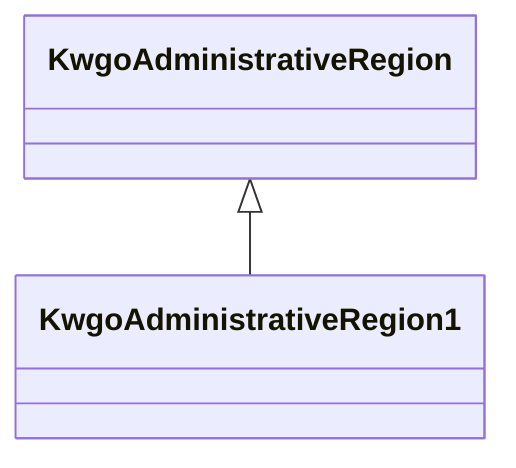

# Class: Administrative Region Level 1 (kwgo_AdministrativeRegion_1)


_Administrative Region Level 1 - national level_


This class occurs 36 times.


URI: [kwgo:AdministrativeRegion_1](http://stko-kwg.geog.ucsb.edu/lod/ontology/AdministrativeRegion_1)





## Inheritance
* [GeoSpatialObject](../classes/GeoSpatialObject.md)
    * [GeoFeature](../classes/GeoFeature.md)
        * [KwgoAdministrativeRegion](../classes/KwgoAdministrativeRegion.md)
            * **KwgoAdministrativeRegion1**


## Slots

| Name | Cardinality and Range | Description | Inheritance | Occurrences |
| ---  | --- | --- | --- | --- |


## Comments

* description: Source - Global Administrative area database (GADM) (https://gadm.org/data.html)


## LinkML Source

<!-- TODO: investigate https://stackoverflow.com/questions/37606292/how-to-create-tabbed-code-blocks-in-mkdocs-or-sphinx -->

### Direct

<details>

```yaml
name: kwgo_AdministrativeRegion_1
description: Administrative Region Level 1 - national level
title: Administrative Region Level 1
comments:
- 'description: Source - Global Administrative area database (GADM) (https://gadm.org/data.html)'
from_schema: okns:kwg
is_a: kwgo_AdministrativeRegion
class_uri: kwgo:AdministrativeRegion_1

```
</details>

### Induced

<details>

```yaml
name: kwgo_AdministrativeRegion_1
description: Administrative Region Level 1 - national level
title: Administrative Region Level 1
comments:
- 'description: Source - Global Administrative area database (GADM) (https://gadm.org/data.html)'
from_schema: okns:kwg
is_a: kwgo_AdministrativeRegion
class_uri: kwgo:AdministrativeRegion_1

```
</details>