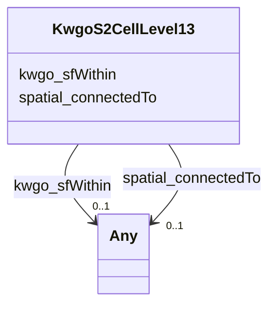

# Class: KwgoS2CellLevel13


This class occurs 1069 times.


URI: [kwgo:S2Cell_Level13](http://stko-kwg.geog.ucsb.edu/lod/ontology/S2Cell_Level13)





<!-- no inheritance hierarchy -->


## Slots

| Name | Cardinality and Range | Description | Inheritance | Occurrences |
| ---  | --- | --- | --- | --- |
| [spatial_connectedTo](../slots/spatial_connectedTo.md) | 0..1 <br/> [KwgoAdministrativeRegion2](../classes/KwgoAdministrativeRegion2.md)&nbsp;or&nbsp;<br />[HttpsIdir.uta.eduSockg-ontology#Site](../classes/HttpsIdir.uta.eduSockg-ontology#Site.md)&nbsp;or&nbsp;<br />[KwgoS2CellLevel13](../classes/KwgoS2CellLevel13.md)&nbsp;or&nbsp;<br />[HttpsIdir.uta.eduSockg-ontology#Location](../classes/HttpsIdir.uta.eduSockg-ontology#Location.md) |  <br/>  | direct | 1086 |
| [kwgo_sfWithin](../slots/kwgo_sfWithin.md) | 0..1 <br/> [Any](../classes/Any.md) | KWG's spatial within relation <br/>  | direct | 1069 |


## Usages

| used by | used in | type | used |
| ---  | --- | --- | --- |
| [HttpsIdir.uta.eduSockg-ontology#Location](../classes/HttpsIdir.uta.eduSockg-ontology#Location.md) | [spatial_connectedTo](../slots/spatial_connectedTo.md) | any_of[range] | [KwgoS2CellLevel13](../classes/KwgoS2CellLevel13.md) |
| [HttpsIdir.uta.eduSockg-ontology#Site](../classes/HttpsIdir.uta.eduSockg-ontology#Site.md) | [spatial_connectedTo](../slots/spatial_connectedTo.md) | any_of[range] | [KwgoS2CellLevel13](../classes/KwgoS2CellLevel13.md) |
| [KwgoS2CellLevel13](../classes/KwgoS2CellLevel13.md) | [spatial_connectedTo](../slots/spatial_connectedTo.md) | any_of[range] | [KwgoS2CellLevel13](../classes/KwgoS2CellLevel13.md) |


## LinkML Source

<!-- TODO: investigate https://stackoverflow.com/questions/37606292/how-to-create-tabbed-code-blocks-in-mkdocs-or-sphinx -->

### Direct

<details>

```yaml
name: kwgo_S2Cell_Level13
from_schema: okns:soc-kg
rank: 1000
slots:
- spatial_connectedTo
- kwgo_sfWithin
class_uri: kwgo:S2Cell_Level13

```
</details>

### Induced

<details>

```yaml
name: kwgo_S2Cell_Level13
from_schema: okns:soc-kg
rank: 1000
attributes:
  spatial_connectedTo:
    name: spatial_connectedTo
    title: topological connection (spatial contact) (sawgraph)
    from_schema: okns:soc-kg
    rank: 1000
    slot_uri: spatial:connectedTo
    alias: spatial_connectedTo
    owner: kwgo_S2Cell_Level13
    domain_of:
    - https___idir.uta.edu_sockg-ontology#Location
    - https___idir.uta.edu_sockg-ontology#Site
    - kwgo_S2Cell_Level13
    subproperty_of: spatial_spatiallyRelatedTo
    range: Any
    any_of:
    - range: kwgo_AdministrativeRegion_2
    - range: https___idir.uta.edu_sockg-ontology#Site
    - range: kwgo_S2Cell_Level13
    - range: https___idir.uta.edu_sockg-ontology#Location
  kwgo_sfWithin:
    name: kwgo_sfWithin
    description: KWG's spatial within relation
    title: within (simple feature)
    notes:
    - No occurrences of this slot in the graph.
    from_schema: okns:kwg
    slot_uri: kwgo:sfWithin
    alias: kwgo_sfWithin
    owner: kwgo_S2Cell_Level13
    domain_of:
    - https___idir.uta.edu_sockg-ontology#ExperimentalUnit
    - https___idir.uta.edu_sockg-ontology#Location
    - https___idir.uta.edu_sockg-ontology#Site
    - kwgo_S2Cell_Level13
    subproperty_of: kwgo_spatialRelation
    range: Any
class_uri: kwgo:S2Cell_Level13

```
</details>