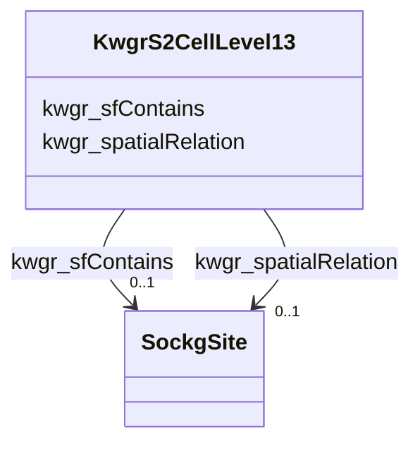

# Class: No class (type) name specified (kwgr_S2Cell_Level13)


_No class (type) description specified_


This class occurs 2404 times.


URI: [kwgr:S2Cell_Level13](http://stko-kwg.geog.ucsb.edu/lod/resource/S2Cell_Level13)





<!-- no inheritance hierarchy -->


## Slots

| Name | Cardinality and Range | Description | Inheritance | Occurrences |
| ---  | --- | --- | --- | --- |
| [kwgr_sfContains](../slots/kwgr_sfContains.md) | 0..1 <br/> [SockgSite](../classes/SockgSite.md) | No slot (predicate) description specified <br/>  | direct | 4351 |
| [kwgr_spatialRelation](../slots/kwgr_spatialRelation.md) | 0..1 <br/> [SockgSite](../classes/SockgSite.md) | No slot (predicate) description specified <br/>  | direct | 4351 |


## Usages

| used by | used in | type | used |
| ---  | --- | --- | --- |
| [SockgSite](../classes/SockgSite.md) | [kwgr_sfWithin](../slots/kwgr_sfWithin.md) | range | [KwgrS2CellLevel13](../classes/KwgrS2CellLevel13.md) |


## LinkML Source

<!-- TODO: investigate https://stackoverflow.com/questions/37606292/how-to-create-tabbed-code-blocks-in-mkdocs-or-sphinx -->

### Direct

<details>

```yaml
name: kwgr_S2Cell_Level13
conforms_to: No schema conformance document specified
annotations:
  count:
    tag: count
    value: 2404
description: No class (type) description specified
title: No class (type) name specified
from_schema: soc-kg
rank: 1000
slots:
- kwgr_sfContains
- kwgr_spatialRelation
slot_usage:
  kwgr_sfContains:
    name: kwgr_sfContains
    annotations:
      sockg_Site:
        tag: sockg_Site
        value: 4351
  kwgr_spatialRelation:
    name: kwgr_spatialRelation
    annotations:
      sockg_Site:
        tag: sockg_Site
        value: 4351
class_uri: kwgr:S2Cell_Level13

```
</details>

### Induced

<details>

```yaml
name: kwgr_S2Cell_Level13
conforms_to: No schema conformance document specified
annotations:
  count:
    tag: count
    value: 2404
description: No class (type) description specified
title: No class (type) name specified
from_schema: soc-kg
rank: 1000
slot_usage:
  kwgr_sfContains:
    name: kwgr_sfContains
    annotations:
      sockg_Site:
        tag: sockg_Site
        value: 4351
  kwgr_spatialRelation:
    name: kwgr_spatialRelation
    annotations:
      sockg_Site:
        tag: sockg_Site
        value: 4351
attributes:
  kwgr_sfContains:
    name: kwgr_sfContains
    annotations:
      sockg_Site:
        tag: sockg_Site
        value: 4351
    description: No slot (predicate) description specified
    examples:
    - object:
        example_object: sockg:individuals/231070
        example_object_type: sockg_Site
        example_predicate: kwgr:sfContains
        example_subject: kwgr:s2.level13.5965660182020096000
        example_subject_type: kwgr_S2Cell_Level13
    from_schema: soc-kg
    rank: 1000
    slot_uri: kwgr:sfContains
    alias: kwgr_sfContains
    owner: kwgr_S2Cell_Level13
    domain_of:
    - kwgr_S2Cell_Level13
    range: sockg_Site
  kwgr_spatialRelation:
    name: kwgr_spatialRelation
    annotations:
      sockg_Site:
        tag: sockg_Site
        value: 4351
    description: No slot (predicate) description specified
    examples:
    - object:
        example_object: sockg:individuals/231070
        example_object_type: sockg_Site
        example_predicate: kwgr:spatialRelation
        example_subject: kwgr:s2.level13.5965660182020096000
        example_subject_type: kwgr_S2Cell_Level13
    from_schema: soc-kg
    rank: 1000
    slot_uri: kwgr:spatialRelation
    alias: kwgr_spatialRelation
    owner: kwgr_S2Cell_Level13
    domain_of:
    - kwgr_S2Cell_Level13
    range: sockg_Site
class_uri: kwgr:S2Cell_Level13

```
</details>