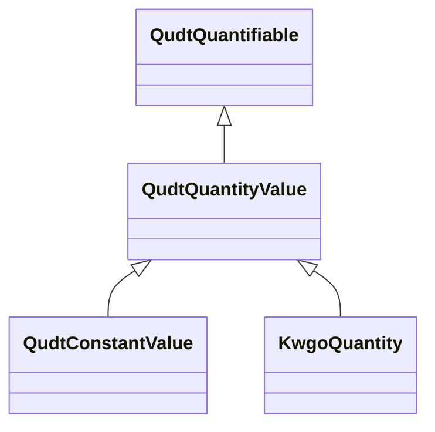

# Class: Quantity value (qudt_QuantityValue)


_A <i>Quantity Value</i> expresses the magnitude and kind of a quantity and is given by the product of a numerical value <code>n</code> and a unit of measure <code>U</code>. The number multiplying the unit is referred to as the numerical value of the quantity expressed in that unit. Refer to <a href="http://physics.nist.gov/Pubs/SP811/sec07.html">NIST SP 811 section 7</a> for more on quantity values._


This class occurs 3381570 times.


URI: [qudt:QuantityValue](http://qudt.org/schema/qudt/QuantityValue)





## Inheritance
* [QudtAspect](../classes/QudtAspect.md)
    * [QudtQuantifiable](../classes/QudtQuantifiable.md)
        * **QudtQuantityValue**
            * [QudtConstantValue](../classes/QudtConstantValue.md)
            * [KwgoQuantity](../classes/KwgoQuantity.md)


## Slots

| Name | Cardinality and Range | Description | Inheritance | Occurrences |
| ---  | --- | --- | --- | --- |


## Usages

| used by | used in | type | used |
| ---  | --- | --- | --- |
| [HttpsIdir.uta.eduSockg-ontology#Measurement](../classes/HttpsIdir.uta.eduSockg-ontology#Measurement.md) | [qudt_quantityValue](../slots/qudt_quantityValue.md) | range | [QudtQuantityValue](../classes/QudtQuantityValue.md) |
| [HttpsIdir.uta.eduSockg-ontology#SoilBiologicalSample](../classes/HttpsIdir.uta.eduSockg-ontology#SoilBiologicalSample.md) | [https___idir.uta.edu_sockg_ontology#upperDepth](../slots/https___idir.uta.edu_sockg_ontology#upperDepth.md) | range | [QudtQuantityValue](../classes/QudtQuantityValue.md) |
| [HttpsIdir.uta.eduSockg-ontology#SoilBiologicalSample](../classes/HttpsIdir.uta.eduSockg-ontology#SoilBiologicalSample.md) | [https___idir.uta.edu_sockg_ontology#lowerDepth](../slots/https___idir.uta.edu_sockg_ontology#lowerDepth.md) | range | [QudtQuantityValue](../classes/QudtQuantityValue.md) |
| [HttpsIdir.uta.eduSockg-ontology#SoilChemicalSample](../classes/HttpsIdir.uta.eduSockg-ontology#SoilChemicalSample.md) | [https___idir.uta.edu_sockg_ontology#upperDepth](../slots/https___idir.uta.edu_sockg_ontology#upperDepth.md) | range | [QudtQuantityValue](../classes/QudtQuantityValue.md) |
| [HttpsIdir.uta.eduSockg-ontology#SoilChemicalSample](../classes/HttpsIdir.uta.eduSockg-ontology#SoilChemicalSample.md) | [https___idir.uta.edu_sockg_ontology#lowerDepth](../slots/https___idir.uta.edu_sockg_ontology#lowerDepth.md) | range | [QudtQuantityValue](../classes/QudtQuantityValue.md) |
| [HttpsIdir.uta.eduSockg-ontology#SoilPhysicalSample](../classes/HttpsIdir.uta.eduSockg-ontology#SoilPhysicalSample.md) | [https___idir.uta.edu_sockg_ontology#upperDepth](../slots/https___idir.uta.edu_sockg_ontology#upperDepth.md) | range | [QudtQuantityValue](../classes/QudtQuantityValue.md) |
| [HttpsIdir.uta.eduSockg-ontology#SoilPhysicalSample](../classes/HttpsIdir.uta.eduSockg-ontology#SoilPhysicalSample.md) | [https___idir.uta.edu_sockg_ontology#lowerDepth](../slots/https___idir.uta.edu_sockg_ontology#lowerDepth.md) | range | [QudtQuantityValue](../classes/QudtQuantityValue.md) |


## LinkML Source

<!-- TODO: investigate https://stackoverflow.com/questions/37606292/how-to-create-tabbed-code-blocks-in-mkdocs-or-sphinx -->

### Direct

<details>

```yaml
name: qudt_QuantityValue
description: A <i>Quantity Value</i> expresses the magnitude and kind of a quantity
  and is given by the product of a numerical value <code>n</code> and a unit of measure
  <code>U</code>. The number multiplying the unit is referred to as the numerical
  value of the quantity expressed in that unit. Refer to <a href="http://physics.nist.gov/Pubs/SP811/sec07.html">NIST
  SP 811 section 7</a> for more on quantity values.
title: Quantity value
from_schema: okns:qudt
source: http://qudt.org/schema/qudt
is_a: qudt_Quantifiable
class_uri: qudt:QuantityValue

```
</details>

### Induced

<details>

```yaml
name: qudt_QuantityValue
description: A <i>Quantity Value</i> expresses the magnitude and kind of a quantity
  and is given by the product of a numerical value <code>n</code> and a unit of measure
  <code>U</code>. The number multiplying the unit is referred to as the numerical
  value of the quantity expressed in that unit. Refer to <a href="http://physics.nist.gov/Pubs/SP811/sec07.html">NIST
  SP 811 section 7</a> for more on quantity values.
title: Quantity value
from_schema: okns:qudt
source: http://qudt.org/schema/qudt
is_a: qudt_Quantifiable
class_uri: qudt:QuantityValue

```
</details>