# Class: Unit (qudt_Unit)


_A unit of measure, or unit, is a particular quantity value that has been chosen as a scale for measuring other quantities the same kind (more generally of equivalent dimension). ␊  For example, the meter is a quantity of length that has been rigorously defined and standardized by the BIPM (International Board of Weights and Measures). ␊  Any measurement of the length can be expressed as a number multiplied by the unit meter. ␊  More formally, the value of a physical quantity Q with respect to a unit (U) is expressed as the scalar multiple of a real number (n) and U, as  $Q = nU$._


This class occurs 41 times.


URI: [qudt:Unit](http://qudt.org/schema/qudt/Unit)

```mermaid
 classDiagram
    class QudtUnit
    click QudtUnit href "../QudtUnit"
      QudtVerifiable <|-- QudtUnit
        click QudtVerifiable href "../QudtVerifiable"
      

      QudtUnit <|-- QudtContextualUnit
        click QudtContextualUnit href "../QudtContextualUnit"
      QudtUnit <|-- QudtDerivedUnit
        click QudtDerivedUnit href "../QudtDerivedUnit"
      QudtUnit <|-- QudtDimensionlessUnit
        click QudtDimensionlessUnit href "../QudtDimensionlessUnit"
      
      
      QudtUnit : dct_description
        
          
    
    
    QudtUnit --> "0..1" String : dct_description
    click String href "../String"

        
      QudtUnit : dct_isReplacedBy
        
          
    
    
    QudtUnit --> "0..1" Any : dct_isReplacedBy
    click Any href "../Any"

        
      QudtUnit : dct_source
        
          
    
    
    QudtUnit --> "0..1" Any : dct_source
    click Any href "../Any"

        
      QudtUnit : prov_wasDerivedFrom
        
          
    
    
    QudtUnit --> "0..1" ProvEntity : prov_wasDerivedFrom
    click ProvEntity href "../ProvEntity"

        
      QudtUnit : qudt_altSymbol
        
          
    
    
    QudtUnit --> "0..1" String : qudt_altSymbol
    click String href "../String"

        
      QudtUnit : qudt_applicableSystem
        
          
    
    
    QudtUnit --> "0..1" Uri : qudt_applicableSystem
    click Uri href "../Uri"

        
      QudtUnit : qudt_conversionMultiplier
        
          
    
    
    QudtUnit --> "0..1" Decimal : qudt_conversionMultiplier
    click Decimal href "../Decimal"

        
      QudtUnit : qudt_conversionMultiplierSN
        
          
    
    
    QudtUnit --> "0..1" Any : qudt_conversionMultiplierSN
    click Any href "../Any"

        
      QudtUnit : qudt_conversionOffset
        
          
    
    
    QudtUnit --> "0..1" Decimal : qudt_conversionOffset
    click Decimal href "../Decimal"

        
      QudtUnit : qudt_conversionOffsetSN
        
          
    
    
    QudtUnit --> "0..1" Double : qudt_conversionOffsetSN
    click Double href "../Double"

        
      QudtUnit : qudt_dbpediaMatch
        
          
    
    
    QudtUnit --> "0..1" Uri : qudt_dbpediaMatch
    click Uri href "../Uri"

        
      QudtUnit : qudt_definedUnitOfSystem
        
          
    
    
    QudtUnit --> "0..1" Uri : qudt_definedUnitOfSystem
    click Uri href "../Uri"

        
      QudtUnit : qudt_deprecated
        
          
    
    
    QudtUnit --> "0..1" Boolean : qudt_deprecated
    click Boolean href "../Boolean"

        
      QudtUnit : qudt_derivedCoherentUnitOfSystem
        
          
    
    
    QudtUnit --> "0..1" Uri : qudt_derivedCoherentUnitOfSystem
    click Uri href "../Uri"

        
      QudtUnit : qudt_derivedUnitOfSystem
        
          
    
    
    QudtUnit --> "0..1" Uri : qudt_derivedUnitOfSystem
    click Uri href "../Uri"

        
      QudtUnit : qudt_exactMatch
        
          
    
    
    QudtUnit --> "0..1" Any : qudt_exactMatch
    click Any href "../Any"

        
      QudtUnit : qudt_expression
        
          
    
    
    QudtUnit --> "0..1" Any : qudt_expression
    click Any href "../Any"

        
      QudtUnit : qudt_factorUnitScalar
        
          
    
    
    QudtUnit --> "0..1" Decimal : qudt_factorUnitScalar
    click Decimal href "../Decimal"

        
      QudtUnit : qudt_hasDimensionVector
        
          
    
    
    QudtUnit --> "0..1" Any : qudt_hasDimensionVector
    click Any href "../Any"

        
      QudtUnit : qudt_hasQuantityKind
        
          
    
    
    QudtUnit --> "0..1" Any : qudt_hasQuantityKind
    click Any href "../Any"

        
      QudtUnit : qudt_iec61360Code
        
          
    
    
    QudtUnit --> "0..1" String : qudt_iec61360Code
    click String href "../String"

        
      QudtUnit : qudt_informativeReference
        
          
    
    
    QudtUnit --> "0..1" Uri : qudt_informativeReference
    click Uri href "../Uri"

        
      QudtUnit : qudt_isoNormativeReference
        
          
    
    
    QudtUnit --> "0..1" Uri : qudt_isoNormativeReference
    click Uri href "../Uri"

        
      QudtUnit : qudt_latexDefinition
        
          
    
    
    QudtUnit --> "0..1" QudtLatexString : qudt_latexDefinition
    click QudtLatexString href "../QudtLatexString"

        
      QudtUnit : qudt_latexSymbol
        
          
    
    
    QudtUnit --> "0..1" QudtLatexString : qudt_latexSymbol
    click QudtLatexString href "../QudtLatexString"

        
      QudtUnit : qudt_omUnit
        
          
    
    
    QudtUnit --> "0..1" Uri : qudt_omUnit
    click Uri href "../Uri"

        
      QudtUnit : qudt_plainTextDescription
        
          
    
    
    QudtUnit --> "0..1" String : qudt_plainTextDescription
    click String href "../String"

        
      QudtUnit : qudt_prefix
        
          
    
    
    QudtUnit --> "0..1" Any : qudt_prefix
    click Any href "../Any"

        
      QudtUnit : qudt_qkdvDenominator
        
          
    
    
    QudtUnit --> "0..1" Any : qudt_qkdvDenominator
    click Any href "../Any"

        
      QudtUnit : qudt_qkdvNumerator
        
          
    
    
    QudtUnit --> "0..1" Any : qudt_qkdvNumerator
    click Any href "../Any"

        
      QudtUnit : qudt_scalingOf
        
          
    
    
    QudtUnit --> "0..1" Any : qudt_scalingOf
    click Any href "../Any"

        
      QudtUnit : qudt_siExactMatch
        
          
    
    
    QudtUnit --> "0..1" Uri : qudt_siExactMatch
    click Uri href "../Uri"

        
      QudtUnit : qudt_siUnitsExpression
        
          
    
    
    QudtUnit --> "0..1" String : qudt_siUnitsExpression
    click String href "../String"

        
      QudtUnit : qudt_symbol
        
          
    
    
    QudtUnit --> "0..1" String : qudt_symbol
    click String href "../String"

        
      QudtUnit : qudt_ucumCode
        
          
    
    
    QudtUnit --> "0..1" Any : qudt_ucumCode
    click Any href "../Any"

        
      QudtUnit : qudt_udunitsCode
        
          
    
    
    QudtUnit --> "0..1" String : qudt_udunitsCode
    click String href "../String"

        
      QudtUnit : qudt_uneceCommonCode
        
          
    
    
    QudtUnit --> "0..1" String : qudt_uneceCommonCode
    click String href "../String"

        
      QudtUnit : rdfs_comment
        
          
    
    
    QudtUnit --> "0..1" Any : rdfs_comment
    click Any href "../Any"

        
      QudtUnit : rdfs_isDefinedBy
        
          
    
    
    QudtUnit --> "0..1" Any : rdfs_isDefinedBy
    click Any href "../Any"

        
      QudtUnit : rdfs_label
        
          
    
    
    QudtUnit --> "0..1" Any : rdfs_label
    click Any href "../Any"

        
      QudtUnit : rdfs_seeAlso
        
          
    
    
    QudtUnit --> "0..1" Any : rdfs_seeAlso
    click Any href "../Any"

        
      QudtUnit : skos_altLabel
        
          
    
    
    QudtUnit --> "0..1" Any : skos_altLabel
    click Any href "../Any"

        
      QudtUnit : vaem_todo
        
          
    
    
    QudtUnit --> "0..1" String : vaem_todo
    click String href "../String"

        
      
```





## Inheritance
* [QudtVerifiable](../classes/QudtVerifiable.md)
    * **QudtUnit**
        * [QudtContextualUnit](../classes/QudtContextualUnit.md)
        * [QudtDerivedUnit](../classes/QudtDerivedUnit.md)
        * [QudtDimensionlessUnit](../classes/QudtDimensionlessUnit.md)


## Slots

| Name | Cardinality and Range | Description | Inheritance | Occurrences |
| ---  | --- | --- | --- | --- |
| [qudt_omUnit](../slots/qudt_omUnit.md) | 0..1 <br/> [xsd:anyURI](http://www.w3.org/2001/XMLSchema#anyURI) |  <br/>  | direct |  |
| [rdfs_seeAlso](../slots/rdfs_seeAlso.md) | 0..1 <br/> [RdfsResource](../classes/RdfsResource.md)&nbsp;or&nbsp;<br />[xsd:anyURI](http://www.w3.org/2001/XMLSchema#anyURI) | Further information about the subject resource <br/>  | direct |  |
| [qudt_isoNormativeReference](../slots/qudt_isoNormativeReference.md) | 0..1 <br/> [xsd:anyURI](http://www.w3.org/2001/XMLSchema#anyURI) | Provides a way to reference the ISO unit definition <br/>  | direct |  |
| [qudt_scalingOf](../slots/qudt_scalingOf.md) | 0..1 <br/> [QudtDerivedUnit](../classes/QudtDerivedUnit.md)&nbsp;or&nbsp;<br />[QudtUnit](../classes/QudtUnit.md)&nbsp;or&nbsp;<br />[QudtCountingUnit](../classes/QudtCountingUnit.md)&nbsp;or&nbsp;<br />[QudtCurrencyUnit](../classes/QudtCurrencyUnit.md) | This property relates a unit that is scaled to the base unit that its qudt:co... <br/> description: This property relates a unit to another unit it is scaled from | direct |  |
| [vaem_todo](../slots/vaem_todo.md) | 0..1 <br/> [xsd:string](http://www.w3.org/2001/XMLSchema#string) | As it name implies, a way to attach an annotation about a "todo" task <br/> source: http://www.linkedmodel.org/2.0/schema/vaem | direct |  |
| [qudt_dbpediaMatch](../slots/qudt_dbpediaMatch.md) | 0..1 <br/> [xsd:anyURI](http://www.w3.org/2001/XMLSchema#anyURI) |  <br/>  | direct |  |
| [qudt_prefix](../slots/qudt_prefix.md) | 0..1 <br/> [QudtBinaryPrefix](../classes/QudtBinaryPrefix.md)&nbsp;or&nbsp;<br />[QudtPrefix](../classes/QudtPrefix.md)&nbsp;or&nbsp;<br />[QudtDecimalPrefix](../classes/QudtDecimalPrefix.md) | Associates a unit with the appropriate prefix, if any <br/>  | direct |  |
| [qudt_latexDefinition](../slots/qudt_latexDefinition.md) | 0..1 <br/> [QudtLatexString](../types/QudtLatexString.md) |  <br/>  | direct |  |
| [qudt_siExactMatch](../slots/qudt_siExactMatch.md) | 0..1 <br/> [xsd:anyURI](http://www.w3.org/2001/XMLSchema#anyURI) |  <br/>  | direct |  |
| [qudt_expression](../slots/qudt_expression.md) | 0..1 <br/> [QudtLatexString](../types/QudtLatexString.md)&nbsp;or&nbsp;<br />[xsd:string](http://www.w3.org/2001/XMLSchema#string) | An 'expression' is a finite combination of symbols that are well-formed accor... <br/>  | direct |  |
| [skos_altLabel](../slots/skos_altLabel.md) | 0..1 <br/> [Any](../classes/Any.md) | An alternative lexical label for a resource <br/> description: skos:prefLabel, skos:altLabel and skos:hiddenLabel are pairwise disjoint properties.<br/>description: The range of skos:altLabel is the class of RDF plain literals. | direct |  |
| [qudt_hasQuantityKind](../slots/qudt_hasQuantityKind.md) | 0..1 <br/> [xsd:anyURI](http://www.w3.org/2001/XMLSchema#anyURI)&nbsp;or&nbsp;<br />[QudtQuantityKind](../classes/QudtQuantityKind.md) |  <br/>  | direct |  |
| [qudt_iec61360Code](../slots/qudt_iec61360Code.md) | 0..1 <br/> [xsd:string](http://www.w3.org/2001/XMLSchema#string) |  <br/>  | direct |  |
| [qudt_plainTextDescription](../slots/qudt_plainTextDescription.md) | 0..1 <br/> [xsd:string](http://www.w3.org/2001/XMLSchema#string) | A plain text description is used to provide a description with only simple AS... <br/>  | direct |  |
| [qudt_conversionOffsetSN](../slots/qudt_conversionOffsetSN.md) | 0..1 <br/> [xsd:double](http://www.w3.org/2001/XMLSchema#double) |  <br/>  | direct |  |
| [rdfs_isDefinedBy](../slots/rdfs_isDefinedBy.md) | 0..1 <br/> [OwlOntology](../classes/OwlOntology.md)&nbsp;or&nbsp;<br />[RdfsResource](../classes/RdfsResource.md) | The definition of the subject resource <br/>  | direct |  |
| [qudt_udunitsCode](../slots/qudt_udunitsCode.md) | 0..1 <br/> [xsd:string](http://www.w3.org/2001/XMLSchema#string) | The UDUNITS package supports units of physical quantities <br/>  | direct |  |
| [rdfs_comment](../slots/rdfs_comment.md) | 0..1 <br/> [RdfsLiteral](../classes/RdfsLiteral.md)&nbsp;or&nbsp;<br />[xsd:string](http://www.w3.org/2001/XMLSchema#string) | A description of the subject resource <br/>  | direct |  |
| [qudt_applicableSystem](../slots/qudt_applicableSystem.md) | 0..1 <br/> [xsd:anyURI](http://www.w3.org/2001/XMLSchema#anyURI) | This property relates a unit of measure with a unit system that may or may no... <br/>  | direct |  |
| [qudt_ucumCode](../slots/qudt_ucumCode.md) | 0..1 <br/> [QudtUCUMcs](../types/QudtUCUMcs.md)&nbsp;or&nbsp;<br />[xsd:string](http://www.w3.org/2001/XMLSchema#string) | <p><em>ucumCode</em> associates a QUDT unit with its UCUM code (case-sensitiv... <br/>  | direct |  |
| [qudt_conversionMultiplier](../slots/qudt_conversionMultiplier.md) | 0..1 <br/> [xsd:decimal](http://www.w3.org/2001/XMLSchema#decimal) |  <br/>  | direct |  |
| [qudt_derivedUnitOfSystem](../slots/qudt_derivedUnitOfSystem.md) | 0..1 <br/> [xsd:anyURI](http://www.w3.org/2001/XMLSchema#anyURI) | This property relates a unit of measure to the system of units in which it is... <br/>  | direct |  |
| [qudt_qkdvNumerator](../slots/qudt_qkdvNumerator.md) | 0..1 <br/> [xsd:anyURI](http://www.w3.org/2001/XMLSchema#anyURI)&nbsp;or&nbsp;<br />[QudtQuantityKindDimensionVector](../classes/QudtQuantityKindDimensionVector.md) |  <br/>  | direct |  |
| [qudt_siUnitsExpression](../slots/qudt_siUnitsExpression.md) | 0..1 <br/> [xsd:string](http://www.w3.org/2001/XMLSchema#string) |  <br/>  | direct |  |
| [qudt_definedUnitOfSystem](../slots/qudt_definedUnitOfSystem.md) | 0..1 <br/> [xsd:anyURI](http://www.w3.org/2001/XMLSchema#anyURI) | This property relates a unit of measure with the unit system that defines the... <br/>  | direct |  |
| [dct_source](../slots/dct_source.md) | 0..1 <br/> [Any](../classes/Any.md) | This property is intended to be used with non-literal values <br/> description: A related resource from which the described resource is derived. | direct |  |
| [qudt_factorUnitScalar](../slots/qudt_factorUnitScalar.md) | 0..1 <br/> [xsd:decimal](http://www.w3.org/2001/XMLSchema#decimal) | For a derived unit that is not exactly the product of its factor units, this ... <br/>  | direct |  |
| [qudt_informativeReference](../slots/qudt_informativeReference.md) | 0..1 <br/> [xsd:anyURI](http://www.w3.org/2001/XMLSchema#anyURI) | Provides a way to reference a source that provided useful but non-normative i... <br/>  | direct |  |
| [qudt_uneceCommonCode](../slots/qudt_uneceCommonCode.md) | 0..1 <br/> [xsd:string](http://www.w3.org/2001/XMLSchema#string) | The UN/CEFACT Recommendation 20 provides three character alphabetic and alpha... <br/>  | direct |  |
| [rdfs_label](../slots/rdfs_label.md) | 0..1 <br/> [RdfsLiteral](../classes/RdfsLiteral.md)&nbsp;or&nbsp;<br />[xsd:string](http://www.w3.org/2001/XMLSchema#string) | A human-readable name for the subject <br/>  | direct |  |
| [qudt_exactMatch](../slots/qudt_exactMatch.md) | 0..1 <br/> [QudtDecimalPrefix](../classes/QudtDecimalPrefix.md)&nbsp;or&nbsp;<br />[QudtUnit](../classes/QudtUnit.md)&nbsp;or&nbsp;<br />[QudtContextualUnit](../classes/QudtContextualUnit.md)&nbsp;or&nbsp;<br />[QudtDerivedUnit](../classes/QudtDerivedUnit.md)&nbsp;or&nbsp;<br />[QudtCountingUnit](../classes/QudtCountingUnit.md) |  <br/>  | direct |  |
| [qudt_hasDimensionVector](../slots/qudt_hasDimensionVector.md) | 0..1 <br/> [xsd:anyURI](http://www.w3.org/2001/XMLSchema#anyURI)&nbsp;or&nbsp;<br />[QudtQuantityKindDimensionVector](../classes/QudtQuantityKindDimensionVector.md) |  <br/>  | direct |  |
| [qudt_conversionMultiplierSN](../slots/qudt_conversionMultiplierSN.md) | 0..1 <br/> [xsd:decimal](http://www.w3.org/2001/XMLSchema#decimal)&nbsp;or&nbsp;<br />[xsd:double](http://www.w3.org/2001/XMLSchema#double) |  <br/>  | direct |  |
| [qudt_derivedCoherentUnitOfSystem](../slots/qudt_derivedCoherentUnitOfSystem.md) | 0..1 <br/> [xsd:anyURI](http://www.w3.org/2001/XMLSchema#anyURI) | This property relates a unit of measure to the unit system in which the unit ... <br/>  | direct |  |
| [qudt_conversionOffset](../slots/qudt_conversionOffset.md) | 0..1 <br/> [xsd:decimal](http://www.w3.org/2001/XMLSchema#decimal) |  <br/>  | direct |  |
| [qudt_qkdvDenominator](../slots/qudt_qkdvDenominator.md) | 0..1 <br/> [xsd:anyURI](http://www.w3.org/2001/XMLSchema#anyURI)&nbsp;or&nbsp;<br />[QudtQuantityKindDimensionVector](../classes/QudtQuantityKindDimensionVector.md) |  <br/>  | direct |  |
| [dct_description](../slots/dct_description.md) | 0..1 <br/> [xsd:string](http://www.w3.org/2001/XMLSchema#string) | Description may include but is not limited to: an abstract, a table of conten... <br/> description: An account of the resource. | direct |  |
| [prov_wasDerivedFrom](../slots/prov_wasDerivedFrom.md) | 0..1 <br/> [ProvEntity](../classes/ProvEntity.md) | The more specific subproperties of prov:wasDerivedFrom (i <br/> description: A derivation is a transformation of an entity into another, an update of an entity resulting in a new one, or the construction of a new entity based on a pre-existing entity. | direct |  |
| [qudt_symbol](../slots/qudt_symbol.md) | 0..1 <br/> [xsd:string](http://www.w3.org/2001/XMLSchema#string) | The symbol is a glyph that is used to represent some concept, typically a uni... <br/>  | direct |  |
| [qudt_latexSymbol](../slots/qudt_latexSymbol.md) | 0..1 <br/> [QudtLatexString](../types/QudtLatexString.md) | The symbol is a glyph that is used to represent some concept, typically a uni... <br/>  | direct |  |
| [qudt_altSymbol](../slots/qudt_altSymbol.md) | 0..1 <br/> [xsd:string](http://www.w3.org/2001/XMLSchema#string) | An alternative symbol <br/>  | direct |  |
| [qudt_deprecated](../slots/qudt_deprecated.md) | 0..1 <br/> [xsd:boolean](http://www.w3.org/2001/XMLSchema#boolean) |  <br/>  | direct |  |
| [dct_isReplacedBy](../slots/dct_isReplacedBy.md) | 0..1 <br/> [Any](../classes/Any.md) | This property is intended to be used with non-literal values <br/> description: A related resource that supplants, displaces, or supersedes the described resource. | direct |  |


## Usages

| used by | used in | type | used |
| ---  | --- | --- | --- |
| [QudtAngleUnit](../classes/QudtAngleUnit.md) | [qudt_omUnit](../slots/qudt_omUnit.md) | domain | [QudtUnit](../classes/QudtUnit.md) |
| [QudtAngleUnit](../classes/QudtAngleUnit.md) | [qudt_scalingOf](../slots/qudt_scalingOf.md) | any_of[range] | [QudtUnit](../classes/QudtUnit.md) |
| [QudtAngleUnit](../classes/QudtAngleUnit.md) | [qudt_exactMatch](../slots/qudt_exactMatch.md) | any_of[range] | [QudtUnit](../classes/QudtUnit.md) |
| [QudtContextualUnit](../classes/QudtContextualUnit.md) | [qudt_scalingOf](../slots/qudt_scalingOf.md) | any_of[range] | [QudtUnit](../classes/QudtUnit.md) |
| [QudtContextualUnit](../classes/QudtContextualUnit.md) | [qudt_exactMatch](../slots/qudt_exactMatch.md) | any_of[range] | [QudtUnit](../classes/QudtUnit.md) |
| [QudtContextualUnit](../classes/QudtContextualUnit.md) | [qudt_omUnit](../slots/qudt_omUnit.md) | domain | [QudtUnit](../classes/QudtUnit.md) |
| [QudtCountingUnit](../classes/QudtCountingUnit.md) | [qudt_omUnit](../slots/qudt_omUnit.md) | domain | [QudtUnit](../classes/QudtUnit.md) |
| [QudtCountingUnit](../classes/QudtCountingUnit.md) | [qudt_scalingOf](../slots/qudt_scalingOf.md) | any_of[range] | [QudtUnit](../classes/QudtUnit.md) |
| [QudtCountingUnit](../classes/QudtCountingUnit.md) | [qudt_exactMatch](../slots/qudt_exactMatch.md) | any_of[range] | [QudtUnit](../classes/QudtUnit.md) |
| [QudtCurrencyUnit](../classes/QudtCurrencyUnit.md) | [qudt_omUnit](../slots/qudt_omUnit.md) | domain | [QudtUnit](../classes/QudtUnit.md) |
| [QudtCurrencyUnit](../classes/QudtCurrencyUnit.md) | [qudt_scalingOf](../slots/qudt_scalingOf.md) | any_of[range] | [QudtUnit](../classes/QudtUnit.md) |
| [QudtCurrencyUnit](../classes/QudtCurrencyUnit.md) | [qudt_exactMatch](../slots/qudt_exactMatch.md) | any_of[range] | [QudtUnit](../classes/QudtUnit.md) |
| [QudtDecimalPrefix](../classes/QudtDecimalPrefix.md) | [qudt_exactMatch](../slots/qudt_exactMatch.md) | any_of[range] | [QudtUnit](../classes/QudtUnit.md) |
| [QudtDerivedUnit](../classes/QudtDerivedUnit.md) | [qudt_omUnit](../slots/qudt_omUnit.md) | domain | [QudtUnit](../classes/QudtUnit.md) |
| [QudtDerivedUnit](../classes/QudtDerivedUnit.md) | [qudt_scalingOf](../slots/qudt_scalingOf.md) | any_of[range] | [QudtUnit](../classes/QudtUnit.md) |
| [QudtDerivedUnit](../classes/QudtDerivedUnit.md) | [qudt_exactMatch](../slots/qudt_exactMatch.md) | any_of[range] | [QudtUnit](../classes/QudtUnit.md) |
| [QudtDimensionlessUnit](../classes/QudtDimensionlessUnit.md) | [qudt_omUnit](../slots/qudt_omUnit.md) | domain | [QudtUnit](../classes/QudtUnit.md) |
| [QudtDimensionlessUnit](../classes/QudtDimensionlessUnit.md) | [qudt_scalingOf](../slots/qudt_scalingOf.md) | any_of[range] | [QudtUnit](../classes/QudtUnit.md) |
| [QudtDimensionlessUnit](../classes/QudtDimensionlessUnit.md) | [qudt_exactMatch](../slots/qudt_exactMatch.md) | any_of[range] | [QudtUnit](../classes/QudtUnit.md) |
| [QudtLogarithmicUnit](../classes/QudtLogarithmicUnit.md) | [qudt_omUnit](../slots/qudt_omUnit.md) | domain | [QudtUnit](../classes/QudtUnit.md) |
| [QudtLogarithmicUnit](../classes/QudtLogarithmicUnit.md) | [qudt_scalingOf](../slots/qudt_scalingOf.md) | any_of[range] | [QudtUnit](../classes/QudtUnit.md) |
| [QudtLogarithmicUnit](../classes/QudtLogarithmicUnit.md) | [qudt_exactMatch](../slots/qudt_exactMatch.md) | any_of[range] | [QudtUnit](../classes/QudtUnit.md) |
| [QudtPlaneAngleUnit](../classes/QudtPlaneAngleUnit.md) | [qudt_omUnit](../slots/qudt_omUnit.md) | domain | [QudtUnit](../classes/QudtUnit.md) |
| [QudtPlaneAngleUnit](../classes/QudtPlaneAngleUnit.md) | [qudt_scalingOf](../slots/qudt_scalingOf.md) | any_of[range] | [QudtUnit](../classes/QudtUnit.md) |
| [QudtPlaneAngleUnit](../classes/QudtPlaneAngleUnit.md) | [qudt_exactMatch](../slots/qudt_exactMatch.md) | any_of[range] | [QudtUnit](../classes/QudtUnit.md) |
| [QudtSolidAngleUnit](../classes/QudtSolidAngleUnit.md) | [qudt_omUnit](../slots/qudt_omUnit.md) | domain | [QudtUnit](../classes/QudtUnit.md) |
| [QudtSolidAngleUnit](../classes/QudtSolidAngleUnit.md) | [qudt_scalingOf](../slots/qudt_scalingOf.md) | any_of[range] | [QudtUnit](../classes/QudtUnit.md) |
| [QudtSolidAngleUnit](../classes/QudtSolidAngleUnit.md) | [qudt_exactMatch](../slots/qudt_exactMatch.md) | any_of[range] | [QudtUnit](../classes/QudtUnit.md) |
| [QudtUnit](../classes/QudtUnit.md) | [qudt_omUnit](../slots/qudt_omUnit.md) | domain | [QudtUnit](../classes/QudtUnit.md) |
| [QudtUnit](../classes/QudtUnit.md) | [qudt_scalingOf](../slots/qudt_scalingOf.md) | any_of[range] | [QudtUnit](../classes/QudtUnit.md) |
| [QudtUnit](../classes/QudtUnit.md) | [qudt_exactMatch](../slots/qudt_exactMatch.md) | any_of[range] | [QudtUnit](../classes/QudtUnit.md) |


## LinkML Source

<!-- TODO: investigate https://stackoverflow.com/questions/37606292/how-to-create-tabbed-code-blocks-in-mkdocs-or-sphinx -->

### Direct

<details>

```yaml
name: qudt_Unit
description: A unit of measure, or unit, is a particular quantity value that has been
  chosen as a scale for measuring other quantities the same kind (more generally of
  equivalent dimension). ␊  For example, the meter is a quantity of length that has
  been rigorously defined and standardized by the BIPM (International Board of Weights
  and Measures). ␊  Any measurement of the length can be expressed as a number multiplied
  by the unit meter. ␊  More formally, the value of a physical quantity Q with respect
  to a unit (U) is expressed as the scalar multiple of a real number (n) and U, as  $Q
  = nU$.
title: Unit
from_schema: okns:qudt
source: http://qudt.org/schema/qudt
is_a: qudt_Verifiable
slots:
- qudt_omUnit
- rdfs_seeAlso
- qudt_isoNormativeReference
- qudt_scalingOf
- vaem_todo
- qudt_dbpediaMatch
- qudt_prefix
- qudt_latexDefinition
- qudt_siExactMatch
- qudt_expression
- skos_altLabel
- qudt_hasQuantityKind
- qudt_iec61360Code
- qudt_plainTextDescription
- qudt_conversionOffsetSN
- rdfs_isDefinedBy
- qudt_udunitsCode
- rdfs_comment
- qudt_applicableSystem
- qudt_ucumCode
- qudt_conversionMultiplier
- qudt_derivedUnitOfSystem
- qudt_qkdvNumerator
- qudt_siUnitsExpression
- qudt_definedUnitOfSystem
- dct_source
- qudt_factorUnitScalar
- qudt_informativeReference
- qudt_uneceCommonCode
- rdfs_label
- qudt_exactMatch
- qudt_hasDimensionVector
- qudt_conversionMultiplierSN
- qudt_derivedCoherentUnitOfSystem
- qudt_conversionOffset
- qudt_qkdvDenominator
- dct_description
- prov_wasDerivedFrom
- qudt_symbol
- qudt_latexSymbol
- qudt_altSymbol
- qudt_deprecated
- dct_isReplacedBy
class_uri: qudt:Unit

```
</details>

### Induced

<details>

```yaml
name: qudt_Unit
description: A unit of measure, or unit, is a particular quantity value that has been
  chosen as a scale for measuring other quantities the same kind (more generally of
  equivalent dimension). ␊  For example, the meter is a quantity of length that has
  been rigorously defined and standardized by the BIPM (International Board of Weights
  and Measures). ␊  Any measurement of the length can be expressed as a number multiplied
  by the unit meter. ␊  More formally, the value of a physical quantity Q with respect
  to a unit (U) is expressed as the scalar multiple of a real number (n) and U, as  $Q
  = nU$.
title: Unit
from_schema: okns:qudt
source: http://qudt.org/schema/qudt
is_a: qudt_Verifiable
attributes:
  qudt_omUnit:
    name: qudt_omUnit
    title: om unit
    from_schema: okns:qudt
    source: http://qudt.org/schema/qudt
    domain: qudt_Unit
    slot_uri: qudt:omUnit
    alias: qudt_omUnit
    owner: qudt_Unit
    domain_of:
    - qudt_CountingUnit
    - qudt_CurrencyUnit
    - qudt_DerivedUnit
    - qudt_Unit
    range: uri
  rdfs_seeAlso:
    name: rdfs_seeAlso
    description: Further information about the subject resource.
    title: seeAlso
    from_schema: okns:owl-rdf-rdfs
    source: http://www.w3.org/2000/01/rdf-schema#
    domain: rdfs_Resource
    slot_uri: rdfs:seeAlso
    alias: rdfs_seeAlso
    owner: qudt_Unit
    domain_of:
    - dcam_VocabularyEncodingScheme
    - rdfs_Datatype
    - qudt_DerivedUnit
    - qudt_Unit
    range: Any
    any_of:
    - range: rdfs_Resource
    - range: uri
  qudt_isoNormativeReference:
    name: qudt_isoNormativeReference
    description: Provides a way to reference the ISO unit definition.
    title: normative reference (ISO)
    from_schema: okns:qudt
    source: http://qudt.org/schema/qudt
    slot_uri: qudt:isoNormativeReference
    alias: qudt_isoNormativeReference
    owner: qudt_Unit
    domain_of:
    - qudt_DerivedUnit
    - qudt_Unit
    subproperty_of: qudt_normativeReference
    range: uri
  qudt_scalingOf:
    name: qudt_scalingOf
    description: This property relates a unit that is scaled to the base unit that
      its qudt:conversionMultiplier converts it to
    title: scalingOf
    comments:
    - 'description: This property relates a unit to another unit it is scaled from'
    from_schema: okns:qudt
    source: http://qudt.org/schema/qudt
    slot_uri: qudt:scalingOf
    alias: qudt_scalingOf
    owner: qudt_Unit
    domain_of:
    - qudt_ContextualUnit
    - qudt_CountingUnit
    - qudt_CurrencyUnit
    - qudt_DerivedUnit
    - qudt_Unit
    range: Any
    any_of:
    - range: qudt_DerivedUnit
    - range: qudt_Unit
    - range: qudt_CountingUnit
    - range: qudt_CurrencyUnit
  vaem_todo:
    name: vaem_todo
    description: As it name implies, a way to attach an annotation about a "todo"
      task
    title: todo
    notes:
    - No occurrences of this slot in the graph.
    comments:
    - 'source: http://www.linkedmodel.org/2.0/schema/vaem'
    from_schema: okns:vaem
    source: http://www.linkedmodel.org/schema/vaem
    slot_uri: vaem:todo
    alias: vaem_todo
    owner: qudt_Unit
    domain_of:
    - qudt_Unit
    range: string
  qudt_dbpediaMatch:
    name: qudt_dbpediaMatch
    title: dbpedia match
    from_schema: okns:qudt
    source: http://qudt.org/schema/qudt
    slot_uri: qudt:dbpediaMatch
    alias: qudt_dbpediaMatch
    owner: qudt_Unit
    domain_of:
    - qudt_ContextualUnit
    - qudt_CountingUnit
    - qudt_CurrencyUnit
    - qudt_DecimalPrefix
    - qudt_DerivedUnit
    - qudt_DimensionlessUnit
    - qudt_LogarithmicUnit
    - qudt_Unit
    range: uri
  qudt_prefix:
    name: qudt_prefix
    description: Associates a unit with the appropriate prefix, if any.
    title: prefix
    from_schema: okns:qudt
    source: http://qudt.org/schema/qudt
    slot_uri: qudt:prefix
    alias: qudt_prefix
    owner: qudt_Unit
    domain_of:
    - qudt_CountingUnit
    - qudt_CurrencyUnit
    - qudt_DerivedUnit
    - qudt_Unit
    range: Any
    any_of:
    - range: qudt_BinaryPrefix
    - range: qudt_Prefix
    - range: qudt_DecimalPrefix
  qudt_latexDefinition:
    name: qudt_latexDefinition
    title: latex definition
    from_schema: okns:qudt
    source: http://qudt.org/schema/qudt
    slot_uri: qudt:latexDefinition
    alias: qudt_latexDefinition
    owner: qudt_Unit
    domain_of:
    - qudt_DerivedUnit
    - qudt_Unit
    range: qudt_LatexString
  qudt_siExactMatch:
    name: qudt_siExactMatch
    title: Individual from SI Reference Point
    from_schema: okns:qudt
    source: http://qudt.org/schema/qudt
    slot_uri: qudt:siExactMatch
    alias: qudt_siExactMatch
    owner: qudt_Unit
    domain_of:
    - qudt_DecimalPrefix
    - qudt_DerivedUnit
    - qudt_LogarithmicUnit
    - qudt_Unit
    range: uri
  qudt_expression:
    name: qudt_expression
    description: An 'expression' is a finite combination of symbols that are well-formed
      according to rules that apply to units of measure, quantity kinds and their
      dimensions.
    title: expression
    from_schema: okns:qudt
    source: http://qudt.org/schema/qudt
    slot_uri: qudt:expression
    alias: qudt_expression
    owner: qudt_Unit
    domain_of:
    - qudt_ContextualUnit
    - qudt_CurrencyUnit
    - qudt_DerivedUnit
    - qudt_Unit
    range: Any
    any_of:
    - range: qudt_LatexString
    - range: string
  skos_altLabel:
    name: skos_altLabel
    description: An alternative lexical label for a resource.
    title: alternative label
    notes:
    - No occurrences of this slot in the graph.
    comments:
    - 'description: skos:prefLabel, skos:altLabel and skos:hiddenLabel are pairwise
      disjoint properties.'
    - 'description: The range of skos:altLabel is the class of RDF plain literals.'
    from_schema: okns:skos
    source: http://www.w3.org/2004/02/skos/core
    slot_uri: skos:altLabel
    alias: skos_altLabel
    owner: qudt_Unit
    domain_of:
    - qudt_CountingUnit
    - qudt_DerivedUnit
    - qudt_Unit
    subproperty_of: rdfs_label
    range: Any
  qudt_hasQuantityKind:
    name: qudt_hasQuantityKind
    title: has quantity kind
    from_schema: okns:qudt
    source: http://qudt.org/schema/qudt
    slot_uri: qudt:hasQuantityKind
    alias: qudt_hasQuantityKind
    owner: qudt_Unit
    domain_of:
    - qudt_ContextualUnit
    - qudt_CountingUnit
    - qudt_CurrencyUnit
    - qudt_DerivedUnit
    - qudt_DimensionlessUnit
    - qudt_LogarithmicUnit
    - qudt_Unit
    range: Any
    any_of:
    - range: uri
    - range: qudt_QuantityKind
  qudt_iec61360Code:
    name: qudt_iec61360Code
    title: iec-61360 code
    from_schema: okns:qudt
    source: http://qudt.org/schema/qudt
    slot_uri: qudt:iec61360Code
    alias: qudt_iec61360Code
    owner: qudt_Unit
    domain_of:
    - qudt_ContextualUnit
    - qudt_CountingUnit
    - qudt_DerivedUnit
    - qudt_DimensionlessUnit
    - qudt_LogarithmicUnit
    - qudt_Unit
    range: string
  qudt_plainTextDescription:
    name: qudt_plainTextDescription
    description: A plain text description is used to provide a description with only
      simple ASCII characters for cases where LaTeX , HTML or other markup would not
      be appropriate.
    title: description (plain text)
    from_schema: okns:qudt
    source: http://qudt.org/schema/qudt
    slot_uri: qudt:plainTextDescription
    alias: qudt_plainTextDescription
    owner: qudt_Unit
    domain_of:
    - qudt_ContextualUnit
    - qudt_CountingUnit
    - qudt_DerivedUnit
    - qudt_OrderedType
    - qudt_Unit
    range: string
  qudt_conversionOffsetSN:
    name: qudt_conversionOffsetSN
    title: conversion offset scientific
    from_schema: okns:qudt
    source: http://qudt.org/schema/qudt
    slot_uri: qudt:conversionOffsetSN
    alias: qudt_conversionOffsetSN
    owner: qudt_Unit
    domain_of:
    - qudt_CountingUnit
    - qudt_DerivedUnit
    - qudt_Unit
    range: double
  rdfs_isDefinedBy:
    name: rdfs_isDefinedBy
    description: The definition of the subject resource.
    title: isDefinedBy
    from_schema: okns:owl-rdf-rdfs
    source: http://www.w3.org/2000/01/rdf-schema#
    domain: rdfs_Resource
    slot_uri: rdfs:isDefinedBy
    alias: rdfs_isDefinedBy
    owner: qudt_Unit
    domain_of:
    - dcam_VocabularyEncodingScheme
    - dct_AgentClass
    - rdf_List
    - rdfs_Datatype
    - qudt_AspectClass
    - qudt_BinaryPrefix
    - qudt_BitEncodingType
    - qudt_BooleanEncodingType
    - qudt_ByteEncodingType
    - qudt_CardinalityType
    - qudt_CharEncodingType
    - qudt_ContextualUnit
    - qudt_CountingUnit
    - qudt_CurrencyUnit
    - qudt_DateTimeStringEncodingType
    - qudt_DecimalPrefix
    - qudt_DerivedUnit
    - qudt_DimensionlessUnit
    - qudt_EndianType
    - qudt_FloatingPointEncodingType
    - qudt_IntegerEncodingType
    - qudt_LogarithmicUnit
    - qudt_OrderedType
    - qudt_SignednessType
    - qudt_Unit
    - kwgo_CensusObservableProperty
    - vaem_GraphMetaData
    - vaem_GraphRole
    - vaem_Party
    - vaem_CatalogEntry
    - voag_Attribution
    - voag_AttributionLogo
    - voag_ChangeFrequency
    - voag_ChangeType
    - voag_ConfidentialityLevel
    - voag_CreativeCommonsPermission
    - voag_CreativeCommonsProhibition
    - voag_CreativeCommonsRequirement
    - voag_Governance
    - voag_GovernanceRole
    - voag_Icon
    - voag_IssueStatus
    - voag_LicenseModel
    - voag_Logo
    - voag_Maturity
    - voag_OrganizationLogo
    - voag_Pedigree
    - voag_PriorityValue
    - voag_ProductLogo
    - voag_Provenance
    - voag_PublicationStatus
    - voag_SchemaGraph
    subproperty_of: rdfs_seeAlso
    range: Any
    any_of:
    - range: owl_Ontology
    - range: rdfs_Resource
  qudt_udunitsCode:
    name: qudt_udunitsCode
    description: The UDUNITS package supports units of physical quantities. Its C
      library provides for arithmetic manipulation of units and for conversion of
      numeric values between compatible units. The package contains an extensive unit
      database, which is in XML format and user-extendable. The package also contains
      a command-line utility for investigating units and converting values.
    title: udunits code
    from_schema: okns:qudt
    source: http://qudt.org/schema/qudt
    slot_uri: qudt:udunitsCode
    alias: qudt_udunitsCode
    owner: qudt_Unit
    domain_of:
    - qudt_ContextualUnit
    - qudt_DerivedUnit
    - qudt_DimensionlessUnit
    - qudt_Unit
    range: string
  rdfs_comment:
    name: rdfs_comment
    description: A description of the subject resource.
    title: comment
    from_schema: okns:owl-rdf-rdfs
    source: http://www.w3.org/2000/01/rdf-schema#
    domain: rdfs_Resource
    slot_uri: rdfs:comment
    alias: rdfs_comment
    owner: qudt_Unit
    domain_of:
    - dcam_VocabularyEncodingScheme
    - dct_AgentClass
    - rdf_List
    - rdfs_Datatype
    - qudt_AspectClass
    - qudt_DerivedUnit
    - qudt_Unit
    - sdos_ActionStatusType
    - sdos_AdultOrientedEnumeration
    - sdos_BoardingPolicyType
    - sdos_BodyMeasurementTypeEnumeration
    - sdos_BookFormatType
    - sdos_Boolean
    - sdos_CarUsageType
    - sdos_CertificationStatusEnumeration
    - sdos_ContactPointOption
    - sdos_DataType
    - sdos_DayOfWeek
    - sdos_DeliveryMethod
    - sdos_DigitalDocumentPermissionType
    - sdos_DigitalPlatformEnumeration
    - sdos_DriveWheelConfigurationValue
    - sdos_DrugCostCategory
    - sdos_DrugPregnancyCategory
    - sdos_DrugPrescriptionStatus
    - sdos_EUEnergyEfficiencyEnumeration
    - sdos_EnergyStarEnergyEfficiencyEnumeration
    - sdos_EventAttendanceModeEnumeration
    - sdos_EventStatusType
    - sdos_FulfillmentTypeEnumeration
    - sdos_GameAvailabilityEnumeration
    - sdos_GamePlayMode
    - sdos_GameServerStatus
    - sdos_GenderType
    - sdos_GovernmentBenefitsType
    - sdos_HealthAspectEnumeration
    - sdos_IPTCDigitalSourceEnumeration
    - sdos_IncentiveQualifiedExpenseType
    - sdos_IncentiveStatus
    - sdos_IncentiveType
    - sdos_InfectiousAgentClass
    - sdos_ItemAvailability
    - sdos_ItemListOrderType
    - sdos_LegalForceStatus
    - sdos_LegalValueLevel
    - sdos_MapCategoryType
    - sdos_MeasurementMethodEnum
    - sdos_MediaManipulationRatingEnumeration
    - sdos_MedicalAudienceType
    - sdos_MedicalDevicePurpose
    - sdos_MedicalEvidenceLevel
    - sdos_MedicalImagingTechnique
    - sdos_MedicalObservationalStudyDesign
    - sdos_MedicalProcedureType
    - sdos_MedicalSpecialty
    - sdos_MedicalStudyStatus
    - sdos_MedicalTrialDesign
    - sdos_MedicineSystem
    - sdos_MerchantReturnEnumeration
    - sdos_MusicAlbumProductionType
    - sdos_MusicAlbumReleaseType
    - sdos_MusicReleaseFormatType
    - sdos_NLNonprofitType
    - sdos_OfferItemCondition
    - sdos_OrderStatus
    - sdos_PaymentMethodType
    - sdos_PaymentStatusType
    - sdos_PhysicalActivityCategory
    - sdos_PhysicalExam
    - sdos_PriceComponentTypeEnumeration
    - sdos_PriceTypeEnumeration
    - sdos_ProductReturnEnumeration
    - sdos_PurchaseType
    - sdos_RefundTypeEnumeration
    - sdos_ReservationStatusType
    - sdos_RestrictedDiet
    - sdos_ReturnFeesEnumeration
    - sdos_ReturnLabelSourceEnumeration
    - sdos_ReturnMethodEnumeration
    - sdos_RsvpResponseType
    - sdos_SizeSystemEnumeration
    - sdos_SteeringPositionValue
    - sdos_TierBenefitEnumeration
    - sdos_UKNonprofitType
    - sdos_USNonprofitType
    - sdos_WearableMeasurementTypeEnumeration
    - sdos_WearableSizeGroupEnumeration
    - sdos_WearableSizeSystemEnumeration
    - kwgo_CensusObservableProperty
    - kwgo_LSADArea
    - kwgo_MTBSFireObservableProperty
    - kwgo_SoilMapUnitObservableProperty
    - bibo_DocumentStatus
    - bibo_ThesisDegree
    - rdf_DatatypeProperty
    range: Any
    any_of:
    - range: rdfs_Literal
    - range: string
  qudt_applicableSystem:
    name: qudt_applicableSystem
    description: This property relates a unit of measure with a unit system that may
      or may not define the unit, but within which the unit is compatible.
    title: applicable system
    from_schema: okns:qudt
    source: http://qudt.org/schema/qudt
    slot_uri: qudt:applicableSystem
    alias: qudt_applicableSystem
    owner: qudt_Unit
    domain_of:
    - qudt_ContextualUnit
    - qudt_CountingUnit
    - qudt_DerivedUnit
    - qudt_DimensionlessUnit
    - qudt_LogarithmicUnit
    - qudt_Unit
    range: uri
  qudt_ucumCode:
    name: qudt_ucumCode
    description: <p><em>ucumCode</em> associates a QUDT unit with its UCUM code (case-sensitive).
      </p><p>In SHACL the values are derived from specific ucum properties using 'sh:values'.</p>
    title: ucum code
    from_schema: okns:qudt
    source: http://qudt.org/schema/qudt
    see_also:
    - https://ucum.org/ucum.html
    slot_uri: qudt:ucumCode
    alias: qudt_ucumCode
    owner: qudt_Unit
    domain_of:
    - qudt_BinaryPrefix
    - qudt_ContextualUnit
    - qudt_CountingUnit
    - qudt_CurrencyUnit
    - qudt_DecimalPrefix
    - qudt_DerivedUnit
    - qudt_LogarithmicUnit
    - qudt_Unit
    subproperty_of: skos_notation
    range: Any
    any_of:
    - range: qudt_UCUMcs
    - range: string
  qudt_conversionMultiplier:
    name: qudt_conversionMultiplier
    title: conversion multiplier
    from_schema: okns:qudt
    source: http://qudt.org/schema/qudt
    slot_uri: qudt:conversionMultiplier
    alias: qudt_conversionMultiplier
    owner: qudt_Unit
    domain_of:
    - qudt_ContextualUnit
    - qudt_CountingUnit
    - qudt_CurrencyUnit
    - qudt_DerivedUnit
    - qudt_DimensionlessUnit
    - qudt_LogarithmicUnit
    - qudt_Unit
    range: decimal
  qudt_derivedUnitOfSystem:
    name: qudt_derivedUnitOfSystem
    description: This property relates a unit of measure to the system of units in
      which it is defined as a derived unit. That is, the derived unit is defined
      as a product of the base units for the system raised to some rational power.
    title: is derived unit of system
    from_schema: okns:qudt
    source: http://qudt.org/schema/qudt
    slot_uri: qudt:derivedUnitOfSystem
    alias: qudt_derivedUnitOfSystem
    owner: qudt_Unit
    domain_of:
    - qudt_DerivedUnit
    - qudt_Unit
    subproperty_of: qudt_isUnitOfSystem
    inverse: qudt_hasDerivedUnit
    range: uri
  qudt_qkdvNumerator:
    name: qudt_qkdvNumerator
    title: numerator dimension vector
    from_schema: okns:qudt
    source: http://qudt.org/schema/qudt
    slot_uri: qudt:qkdvNumerator
    alias: qudt_qkdvNumerator
    owner: qudt_Unit
    domain_of:
    - qudt_DerivedUnit
    - qudt_Unit
    range: Any
    any_of:
    - range: uri
    - range: qudt_QuantityKindDimensionVector
  qudt_siUnitsExpression:
    name: qudt_siUnitsExpression
    title: si units expression
    from_schema: okns:qudt
    source: http://qudt.org/schema/qudt
    slot_uri: qudt:siUnitsExpression
    alias: qudt_siUnitsExpression
    owner: qudt_Unit
    domain_of:
    - qudt_DerivedUnit
    - qudt_Unit
    range: string
  qudt_definedUnitOfSystem:
    name: qudt_definedUnitOfSystem
    description: This property relates a unit of measure with the unit system that
      defines the unit.
    title: defined unit of system
    from_schema: okns:qudt
    source: http://qudt.org/schema/qudt
    slot_uri: qudt:definedUnitOfSystem
    alias: qudt_definedUnitOfSystem
    owner: qudt_Unit
    domain_of:
    - qudt_DerivedUnit
    - qudt_Unit
    subproperty_of: qudt_isUnitOfSystem
    inverse: qudt_hasDefinedUnit
    range: uri
  dct_source:
    name: dct_source
    description: This property is intended to be used with non-literal values. The
      described resource may be derived from the related resource in whole or in part.
      Best practice is to identify the related resource by means of a URI or a string
      conforming to a formal identification system.
    title: Source
    notes:
    - No occurrences of this slot in the graph.
    comments:
    - 'description: A related resource from which the described resource is derived.'
    from_schema: okns:dc
    source: http://purl.org/dc/terms/
    slot_uri: dct:source
    alias: dct_source
    owner: qudt_Unit
    domain_of:
    - qudt_Unit
    subproperty_of: dct_relation
    range: Any
  qudt_factorUnitScalar:
    name: qudt_factorUnitScalar
    description: For a derived unit that is not exactly the product of its factor
      units, this property defines the scalar with which that product has to be multiplied
      with.
    title: factorUnitScalar
    from_schema: okns:qudt
    source: http://qudt.org/schema/qudt
    slot_uri: qudt:factorUnitScalar
    alias: qudt_factorUnitScalar
    owner: qudt_Unit
    domain_of:
    - qudt_CountingUnit
    - qudt_DerivedUnit
    - qudt_Unit
    range: decimal
  qudt_informativeReference:
    name: qudt_informativeReference
    description: Provides a way to reference a source that provided useful but non-normative
      information.
    title: informative reference
    from_schema: okns:qudt
    source: http://qudt.org/schema/qudt
    slot_uri: qudt:informativeReference
    alias: qudt_informativeReference
    owner: qudt_Unit
    domain_of:
    - qudt_CardinalityType
    - qudt_ContextualUnit
    - qudt_CountingUnit
    - qudt_CurrencyUnit
    - qudt_DecimalPrefix
    - qudt_DerivedUnit
    - qudt_DimensionlessUnit
    - qudt_LogarithmicUnit
    - qudt_Unit
    range: uri
  qudt_uneceCommonCode:
    name: qudt_uneceCommonCode
    description: The UN/CEFACT Recommendation 20 provides three character alphabetic
      and alphanumeric codes for representing units of measurement for length, area,
      volume/capacity, mass (weight), time, and other quantities used in international
      trade. The codes are intended for use in manual and/or automated systems for
      the exchange of information between participants in international trade.
    title: unece common code
    from_schema: okns:qudt
    source: http://qudt.org/schema/qudt
    slot_uri: qudt:uneceCommonCode
    alias: qudt_uneceCommonCode
    owner: qudt_Unit
    domain_of:
    - qudt_ContextualUnit
    - qudt_CountingUnit
    - qudt_DerivedUnit
    - qudt_DimensionlessUnit
    - qudt_LogarithmicUnit
    - qudt_Unit
    range: string
  rdfs_label:
    name: rdfs_label
    description: A human-readable name for the subject.
    title: label
    from_schema: okns:owl-rdf-rdfs
    source: http://www.w3.org/2000/01/rdf-schema#
    domain: rdfs_Resource
    slot_uri: rdfs:label
    alias: rdfs_label
    owner: qudt_Unit
    domain_of:
    - dcam_VocabularyEncodingScheme
    - dct_AgentClass
    - rdf_List
    - rdfs_Datatype
    - qudt_AspectClass
    - qudt_BinaryPrefix
    - qudt_BitEncodingType
    - qudt_BooleanEncodingType
    - qudt_ByteEncodingType
    - qudt_CardinalityType
    - qudt_CharEncodingType
    - qudt_ContextualUnit
    - qudt_CountingUnit
    - qudt_CurrencyUnit
    - qudt_DateTimeStringEncodingType
    - qudt_DecimalPrefix
    - qudt_DerivedUnit
    - qudt_DimensionlessUnit
    - qudt_EndianType
    - qudt_FloatingPointEncodingType
    - qudt_IntegerEncodingType
    - qudt_LogarithmicUnit
    - qudt_OrderedType
    - qudt_SignednessType
    - qudt_Unit
    - sdos_ActionStatusType
    - sdos_AdultOrientedEnumeration
    - sdos_BoardingPolicyType
    - sdos_BodyMeasurementTypeEnumeration
    - sdos_BookFormatType
    - sdos_Boolean
    - sdos_CarUsageType
    - sdos_CertificationStatusEnumeration
    - sdos_ContactPointOption
    - sdos_DataType
    - sdos_DayOfWeek
    - sdos_DeliveryMethod
    - sdos_DigitalDocumentPermissionType
    - sdos_DigitalPlatformEnumeration
    - sdos_DriveWheelConfigurationValue
    - sdos_DrugCostCategory
    - sdos_DrugPregnancyCategory
    - sdos_DrugPrescriptionStatus
    - sdos_EUEnergyEfficiencyEnumeration
    - sdos_EnergyStarEnergyEfficiencyEnumeration
    - sdos_EventAttendanceModeEnumeration
    - sdos_EventStatusType
    - sdos_FulfillmentTypeEnumeration
    - sdos_GameAvailabilityEnumeration
    - sdos_GamePlayMode
    - sdos_GameServerStatus
    - sdos_GenderType
    - sdos_GovernmentBenefitsType
    - sdos_HealthAspectEnumeration
    - sdos_IPTCDigitalSourceEnumeration
    - sdos_IncentiveQualifiedExpenseType
    - sdos_IncentiveStatus
    - sdos_IncentiveType
    - sdos_InfectiousAgentClass
    - sdos_ItemAvailability
    - sdos_ItemListOrderType
    - sdos_LegalForceStatus
    - sdos_LegalValueLevel
    - sdos_MapCategoryType
    - sdos_MeasurementMethodEnum
    - sdos_MediaManipulationRatingEnumeration
    - sdos_MedicalAudienceType
    - sdos_MedicalDevicePurpose
    - sdos_MedicalEvidenceLevel
    - sdos_MedicalImagingTechnique
    - sdos_MedicalObservationalStudyDesign
    - sdos_MedicalProcedureType
    - sdos_MedicalSpecialty
    - sdos_MedicalStudyStatus
    - sdos_MedicalTrialDesign
    - sdos_MedicineSystem
    - sdos_MerchantReturnEnumeration
    - sdos_MusicAlbumProductionType
    - sdos_MusicAlbumReleaseType
    - sdos_MusicReleaseFormatType
    - sdos_NLNonprofitType
    - sdos_OfferItemCondition
    - sdos_OrderStatus
    - sdos_PaymentMethodType
    - sdos_PaymentStatusType
    - sdos_PhysicalActivityCategory
    - sdos_PhysicalExam
    - sdos_PriceComponentTypeEnumeration
    - sdos_PriceTypeEnumeration
    - sdos_ProductReturnEnumeration
    - sdos_PurchaseType
    - sdos_RefundTypeEnumeration
    - sdos_ReservationStatusType
    - sdos_RestrictedDiet
    - sdos_ReturnFeesEnumeration
    - sdos_ReturnLabelSourceEnumeration
    - sdos_ReturnMethodEnumeration
    - sdos_RsvpResponseType
    - sdos_SizeSystemEnumeration
    - sdos_SteeringPositionValue
    - sdos_TierBenefitEnumeration
    - sdos_UKNonprofitType
    - sdos_USNonprofitType
    - sdos_WearableMeasurementTypeEnumeration
    - sdos_WearableSizeGroupEnumeration
    - sdos_WearableSizeSystemEnumeration
    - kwgo_AirPollutant
    - kwgo_BlueskyWildfireObservableProperty
    - kwgo_CensusObservableProperty
    - kwgo_ClimateObservableProperty
    - kwgo_CroplandObservableProperty
    - kwgo_DroughtIntensity
    - kwgo_FireCause
    - kwgo_HelipadAvailability
    - kwgo_HospitalStatus
    - kwgo_HospitalType
    - kwgo_ImpactObservableProperty
    - kwgo_LSADArea
    - kwgo_MTBSFireObservableProperty
    - kwgo_MagnitudeObservableProperty
    - kwgo_NIFCFireObservableProperty
    - kwgo_PublicHealthObservableProperty
    - kwgo_RoadType
    - kwgo_SmokePlumeObservableProperty
    - kwgo_SoilMapUnitObservableProperty
    - kwgo_StormTrackObservableProperty
    - kwgo_StormTrackletObservableProperty
    - kwgo_VulnerabilityObservableProperty
    - time_DayOfWeek
    - time_TemporalUnit
    - bibo_DocumentStatus
    - bibo_ThesisDegree
    - vaem_GraphMetaData
    - vaem_GraphRole
    - vaem_Party
    - rdf_DatatypeProperty
    - vaem_CatalogEntry
    - voag_Attribution
    - voag_AttributionLogo
    - voag_ChangeFrequency
    - voag_ChangeType
    - voag_ConfidentialityLevel
    - voag_CreativeCommonsPermission
    - voag_CreativeCommonsProhibition
    - voag_CreativeCommonsRequirement
    - voag_Governance
    - voag_GovernanceRole
    - voag_Icon
    - voag_IssueStatus
    - voag_LicenseModel
    - voag_Logo
    - voag_Maturity
    - voag_OrganizationLogo
    - voag_Pedigree
    - voag_PriorityValue
    - voag_ProductLogo
    - voag_Provenance
    - voag_PublicationStatus
    - voag_SchemaGraph
    - https___idir.uta.edu_sockg-ontology#Abstract
    - https___idir.uta.edu_sockg-ontology#ActiveIngredient
    - https___idir.uta.edu_sockg-ontology#AmendmentPlacement
    - https___idir.uta.edu_sockg-ontology#AmendmentType
    - https___idir.uta.edu_sockg-ontology#AnimalClass
    - https___idir.uta.edu_sockg-ontology#AnimalSpecies
    - https___idir.uta.edu_sockg-ontology#BookChapter
    - https___idir.uta.edu_sockg-ontology#BroadleafOrGrass
    - https___idir.uta.edu_sockg-ontology#ChamberPlacement
    - https___idir.uta.edu_sockg-ontology#Cultivar
    - https___idir.uta.edu_sockg-ontology#CuttingHeight
    - https___idir.uta.edu_sockg-ontology#Equipment
    - https___idir.uta.edu_sockg-ontology#FundingSource
    - https___idir.uta.edu_sockg-ontology#GrowthStage
    - https___idir.uta.edu_sockg-ontology#HarvestedFraction
    - https___idir.uta.edu_sockg-ontology#Irrigation
    - https___idir.uta.edu_sockg-ontology#JournalArticle
    - https___idir.uta.edu_sockg-ontology#Location
    - https___idir.uta.edu_sockg-ontology#LossesOrDeposition
    - https___idir.uta.edu_sockg-ontology#OtherEvents
    - https___idir.uta.edu_sockg-ontology#Parameter
    - https___idir.uta.edu_sockg-ontology#PesticidePlacement
    - https___idir.uta.edu_sockg-ontology#PesticideTarget
    - https___idir.uta.edu_sockg-ontology#PlantFraction
    - https___idir.uta.edu_sockg-ontology#PlantingMethod
    - https___idir.uta.edu_sockg-ontology#PopularArticle
    - https___idir.uta.edu_sockg-ontology#Proceedings
    - https___idir.uta.edu_sockg-ontology#Report
    - https___idir.uta.edu_sockg-ontology#SimulationModel
    - https___idir.uta.edu_sockg-ontology#SpeciesMix
    - https___idir.uta.edu_sockg-ontology#StartStopInterval
    - https___idir.uta.edu_sockg-ontology#SurfaceOrLeaching
    - https___idir.uta.edu_sockg-ontology#Thesis
    - https___idir.uta.edu_sockg-ontology#TillageEvent
    - https___idir.uta.edu_sockg-ontology#TillageMethod
    - https___lod.nal.usda.gov_nalt_7140
    range: Any
    any_of:
    - range: rdfs_Literal
    - range: string
  qudt_exactMatch:
    name: qudt_exactMatch
    title: exact match
    from_schema: okns:qudt
    source: http://qudt.org/schema/qudt
    slot_uri: qudt:exactMatch
    alias: qudt_exactMatch
    owner: qudt_Unit
    domain_of:
    - qudt_ContextualUnit
    - qudt_CountingUnit
    - qudt_DecimalPrefix
    - qudt_DerivedUnit
    - qudt_Unit
    range: Any
    any_of:
    - range: qudt_DecimalPrefix
    - range: qudt_Unit
    - range: qudt_ContextualUnit
    - range: qudt_DerivedUnit
    - range: qudt_CountingUnit
  qudt_hasDimensionVector:
    name: qudt_hasDimensionVector
    title: has dimension vector
    from_schema: okns:qudt
    source: http://qudt.org/schema/qudt
    slot_uri: qudt:hasDimensionVector
    alias: qudt_hasDimensionVector
    owner: qudt_Unit
    domain_of:
    - qudt_ContextualUnit
    - qudt_CountingUnit
    - qudt_CurrencyUnit
    - qudt_DerivedUnit
    - qudt_DimensionlessUnit
    - qudt_LogarithmicUnit
    - qudt_Unit
    range: Any
    any_of:
    - range: uri
    - range: qudt_QuantityKindDimensionVector
  qudt_conversionMultiplierSN:
    name: qudt_conversionMultiplierSN
    title: conversion multiplier scientific
    from_schema: okns:qudt
    source: http://qudt.org/schema/qudt
    slot_uri: qudt:conversionMultiplierSN
    alias: qudt_conversionMultiplierSN
    owner: qudt_Unit
    domain_of:
    - qudt_ContextualUnit
    - qudt_CountingUnit
    - qudt_CurrencyUnit
    - qudt_DerivedUnit
    - qudt_DimensionlessUnit
    - qudt_LogarithmicUnit
    - qudt_Unit
    range: Any
    any_of:
    - range: decimal
    - range: double
  qudt_derivedCoherentUnitOfSystem:
    name: qudt_derivedCoherentUnitOfSystem
    description: This property relates a unit of measure to the unit system in which
      the unit is derived from the system's base units with a proportionality constant
      of one.
    title: is coherent derived unit of system
    from_schema: okns:qudt
    source: http://qudt.org/schema/qudt
    slot_uri: qudt:derivedCoherentUnitOfSystem
    alias: qudt_derivedCoherentUnitOfSystem
    owner: qudt_Unit
    domain_of:
    - qudt_DerivedUnit
    - qudt_Unit
    subproperty_of: qudt_derivedUnitOfSystem
    inverse: qudt_hasDerivedCoherentUnit
    range: uri
  qudt_conversionOffset:
    name: qudt_conversionOffset
    title: conversion offset
    from_schema: okns:qudt
    source: http://qudt.org/schema/qudt
    slot_uri: qudt:conversionOffset
    alias: qudt_conversionOffset
    owner: qudt_Unit
    domain_of:
    - qudt_CountingUnit
    - qudt_DerivedUnit
    - qudt_Unit
    range: decimal
  qudt_qkdvDenominator:
    name: qudt_qkdvDenominator
    title: denominator dimension vector
    from_schema: okns:qudt
    source: http://qudt.org/schema/qudt
    slot_uri: qudt:qkdvDenominator
    alias: qudt_qkdvDenominator
    owner: qudt_Unit
    domain_of:
    - qudt_DerivedUnit
    - qudt_Unit
    range: Any
    any_of:
    - range: uri
    - range: qudt_QuantityKindDimensionVector
  dct_description:
    name: dct_description
    description: 'Description may include but is not limited to: an abstract, a table
      of contents, a graphical representation, or a free-text account of the resource.'
    title: Description
    comments:
    - 'description: An account of the resource.'
    from_schema: okns:dc
    source: http://purl.org/dc/terms/
    slot_uri: dct:description
    alias: dct_description
    owner: qudt_Unit
    domain_of:
    - qudt_BinaryPrefix
    - qudt_CardinalityType
    - qudt_ContextualUnit
    - qudt_CountingUnit
    - qudt_DecimalPrefix
    - qudt_DerivedUnit
    - qudt_DimensionlessUnit
    - qudt_LogarithmicUnit
    - qudt_Unit
    - vaem_GraphRole
    - https___idir.uta.edu_sockg-ontology#AnimalSpecies
    - https___idir.uta.edu_sockg-ontology#CoverCrop
    - https___idir.uta.edu_sockg-ontology#FertilizerAmendment
    - https___idir.uta.edu_sockg-ontology#GrazingRate
    - https___idir.uta.edu_sockg-ontology#JournalArticle
    - https___idir.uta.edu_sockg-ontology#Location
    - https___idir.uta.edu_sockg-ontology#Proceedings
    - https___idir.uta.edu_sockg-ontology#Project
    - https___idir.uta.edu_sockg-ontology#ProjectScenario
    - https___idir.uta.edu_sockg-ontology#ResidueRemoval
    - https___idir.uta.edu_sockg-ontology#Rotation
    - https___idir.uta.edu_sockg-ontology#Thesis
    - https___idir.uta.edu_sockg-ontology#Tillage
    - https___idir.uta.edu_sockg-ontology#Timing
    - https___idir.uta.edu_sockg-ontology#Treatment
    subproperty_of: dc_description
    range: string
  prov_wasDerivedFrom:
    name: prov_wasDerivedFrom
    description: The more specific subproperties of prov:wasDerivedFrom (i.e., prov:wasQuotedFrom,
      prov:wasRevisionOf, prov:hadPrimarySource) should be used when applicable.
    title: wasDerivedFrom
    notes:
    - No occurrences of this slot in the graph.
    comments:
    - 'description: A derivation is a transformation of an entity into another, an
      update of an entity resulting in a new one, or the construction of a new entity
      based on a pre-existing entity.'
    from_schema: okns:prov
    source: http://www.w3.org/ns/prov-o#
    domain: prov_Entity
    slot_uri: prov:wasDerivedFrom
    alias: prov_wasDerivedFrom
    owner: qudt_Unit
    domain_of:
    - qudt_DerivedUnit
    - qudt_Unit
    subproperty_of: prov_wasInfluencedBy
    range: prov_Entity
  qudt_symbol:
    name: qudt_symbol
    description: The symbol is a glyph that is used to represent some concept, typically
      a unit or a quantity, in a compact form. ␊  For example, the symbol for an Ohm
      is $ohm$. ␊  This contrasts with 'unit:abbreviation', which gives a short alphanumeric
      abbreviation for the unit, 'ohm' for Ohm.
    title: symbol
    from_schema: okns:qudt
    source: http://qudt.org/schema/qudt
    slot_uri: qudt:symbol
    alias: qudt_symbol
    owner: qudt_Unit
    domain_of:
    - qudt_BinaryPrefix
    - qudt_ContextualUnit
    - qudt_CountingUnit
    - qudt_CurrencyUnit
    - qudt_DecimalPrefix
    - qudt_DerivedUnit
    - qudt_DimensionlessUnit
    - qudt_LogarithmicUnit
    - qudt_Unit
    subproperty_of: dtype_literal
    range: string
  qudt_latexSymbol:
    name: qudt_latexSymbol
    description: The symbol is a glyph that is used to represent some concept, typically
      a unit or a quantity, in a compact form. ␊  For example, the symbol for an Ohm
      is $ohm$. ␊  This contrasts with 'unit:abbreviation', which gives a short alphanumeric
      abbreviation for the unit, 'ohm' for Ohm.
    title: latex symbol
    from_schema: okns:qudt
    source: http://qudt.org/schema/qudt
    slot_uri: qudt:latexSymbol
    alias: qudt_latexSymbol
    owner: qudt_Unit
    domain_of:
    - qudt_DerivedUnit
    - qudt_Unit
    range: qudt_LatexString
  qudt_altSymbol:
    name: qudt_altSymbol
    description: An alternative symbol
    title: alt symbol
    from_schema: okns:qudt
    source: http://qudt.org/schema/qudt
    slot_uri: qudt:altSymbol
    alias: qudt_altSymbol
    owner: qudt_Unit
    domain_of:
    - qudt_ContextualUnit
    - qudt_CurrencyUnit
    - qudt_DerivedUnit
    - qudt_Unit
    subproperty_of: dtype_literal
    range: string
  qudt_deprecated:
    name: qudt_deprecated
    title: deprecated
    from_schema: okns:qudt
    source: http://qudt.org/schema/qudt
    slot_uri: qudt:deprecated
    alias: qudt_deprecated
    owner: qudt_Unit
    domain_of:
    - qudt_ContextualUnit
    - qudt_DerivedUnit
    - qudt_Unit
    range: boolean
  dct_isReplacedBy:
    name: dct_isReplacedBy
    description: This property is intended to be used with non-literal values. This
      property is an inverse property of Replaces.
    title: Is Replaced By
    notes:
    - No occurrences of this slot in the graph.
    comments:
    - 'description: A related resource that supplants, displaces, or supersedes the
      described resource.'
    from_schema: okns:dc
    source: http://purl.org/dc/terms/
    slot_uri: dct:isReplacedBy
    alias: dct_isReplacedBy
    owner: qudt_Unit
    domain_of:
    - qudt_ContextualUnit
    - qudt_DerivedUnit
    - qudt_Unit
    subproperty_of: dct_relation
    range: Any
class_uri: qudt:Unit

```
</details>