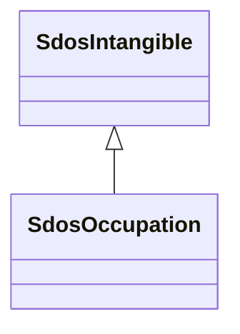

# Class: Occupation (sdos_Occupation)


_A profession, may involve prolonged training and/or a formal qualification._


This class occurs 18 times.


URI: [sdos:Occupation](https://schema.org/Occupation)





## Inheritance
* [SdosThing](../classes/SdosThing.md)
    * [SdosIntangible](../classes/SdosIntangible.md)
        * **SdosOccupation**


## Slots

| Name | Cardinality and Range | Description | Inheritance | Occurrences |
| ---  | --- | --- | --- | --- |


## LinkML Source

<!-- TODO: investigate https://stackoverflow.com/questions/37606292/how-to-create-tabbed-code-blocks-in-mkdocs-or-sphinx -->

### Direct

<details>

```yaml
name: sdos_Occupation
description: A profession, may involve prolonged training and/or a formal qualification.
title: Occupation
from_schema: okns:sdo
source: https://github.com/schemaorg/schemaorg/issues/1698
is_a: sdos_Intangible
class_uri: sdos:Occupation

```
</details>

### Induced

<details>

```yaml
name: sdos_Occupation
description: A profession, may involve prolonged training and/or a formal qualification.
title: Occupation
from_schema: okns:sdo
source: https://github.com/schemaorg/schemaorg/issues/1698
is_a: sdos_Intangible
class_uri: sdos:Occupation

```
</details>