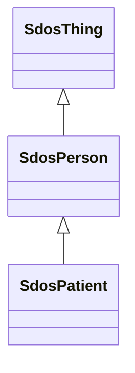

# Class: Person (sdos_Person)


_A person (alive, dead, undead, or fictional)._


This class occurs 158 times.


URI: [sdos:Person](https://schema.org/Person)





## Inheritance
* [SdosThing](../classes/SdosThing.md)
    * **SdosPerson**
        * [SdosPatient](../classes/SdosPatient.md)


## Slots

| Name | Cardinality and Range | Description | Inheritance | Occurrences |
| ---  | --- | --- | --- | --- |


## Usages

| used by | used in | type | used |
| ---  | --- | --- | --- |
| [SdosCarUsageType](../classes/SdosCarUsageType.md) | [sdos_contributor](../slots/sdos_contributor.md) | any_of[range] | [SdosPerson](../classes/SdosPerson.md) |
| [SdosDayOfWeek](../classes/SdosDayOfWeek.md) | [sdos_contributor](../slots/sdos_contributor.md) | any_of[range] | [SdosPerson](../classes/SdosPerson.md) |
| [SdosDeliveryMethod](../classes/SdosDeliveryMethod.md) | [sdos_contributor](../slots/sdos_contributor.md) | any_of[range] | [SdosPerson](../classes/SdosPerson.md) |
| [SdosDriveWheelConfigurationValue](../classes/SdosDriveWheelConfigurationValue.md) | [sdos_contributor](../slots/sdos_contributor.md) | any_of[range] | [SdosPerson](../classes/SdosPerson.md) |
| [SdosLegalForceStatus](../classes/SdosLegalForceStatus.md) | [sdos_contributor](../slots/sdos_contributor.md) | any_of[range] | [SdosPerson](../classes/SdosPerson.md) |
| [SdosLegalValueLevel](../classes/SdosLegalValueLevel.md) | [sdos_contributor](../slots/sdos_contributor.md) | any_of[range] | [SdosPerson](../classes/SdosPerson.md) |
| [SdosMusicAlbumProductionType](../classes/SdosMusicAlbumProductionType.md) | [sdos_contributor](../slots/sdos_contributor.md) | any_of[range] | [SdosPerson](../classes/SdosPerson.md) |
| [SdosMusicAlbumReleaseType](../classes/SdosMusicAlbumReleaseType.md) | [sdos_contributor](../slots/sdos_contributor.md) | any_of[range] | [SdosPerson](../classes/SdosPerson.md) |
| [SdosMusicReleaseFormatType](../classes/SdosMusicReleaseFormatType.md) | [sdos_contributor](../slots/sdos_contributor.md) | any_of[range] | [SdosPerson](../classes/SdosPerson.md) |
| [SdosSteeringPositionValue](../classes/SdosSteeringPositionValue.md) | [sdos_contributor](../slots/sdos_contributor.md) | any_of[range] | [SdosPerson](../classes/SdosPerson.md) |


## LinkML Source

<!-- TODO: investigate https://stackoverflow.com/questions/37606292/how-to-create-tabbed-code-blocks-in-mkdocs-or-sphinx -->

### Direct

<details>

```yaml
name: sdos_Person
description: A person (alive, dead, undead, or fictional).
title: Person
from_schema: okns:sdo
contributors:
- https://schema.org/docs/collab/rNews
is_a: sdos_Thing
class_uri: sdos:Person

```
</details>

### Induced

<details>

```yaml
name: sdos_Person
description: A person (alive, dead, undead, or fictional).
title: Person
from_schema: okns:sdo
contributors:
- https://schema.org/docs/collab/rNews
is_a: sdos_Thing
class_uri: sdos:Person

```
</details>