# Class: TODO -- what's a good name for what this class (type) describes? (sockg_Amendment)


_No type description provided_


URI: [sockg:Amendment](http://www.semanticweb.org/sockg/ontologies/2024/0/soil-carbon-ontology/Amendment)

```mermaid
 classDiagram
    class SockgAmendment
    click SockgAmendment href "../SockgAmendment"
      SockgAmendment : sockg_amendmentPlacement
        
          
    
    
    SockgAmendment --> "0..1" Any : sockg_amendmentPlacement
    click Any href "../Any"

        
      SockgAmendment : sockg_endDate
        
          
    
    
    SockgAmendment --> "0..1" Any : sockg_endDate
    click Any href "../Any"

        
      SockgAmendment : sockg_hasPesticide
        
          
    
    
    SockgAmendment --> "0..1" SockgPesticide : sockg_hasPesticide
    click SockgPesticide href "../SockgPesticide"

        
      SockgAmendment : sockg_irrigationAmount_cm
        
          
    
    
    SockgAmendment --> "0..1" Double : sockg_irrigationAmount_cm
    click Double href "../Double"

        
      SockgAmendment : sockg_irrigationNitrogen_mg_per_L
        
          
    
    
    SockgAmendment --> "0..1" Double : sockg_irrigationNitrogen_mg_per_L
    click Double href "../Double"

        
      SockgAmendment : sockg_irrigationType
        
          
    
    
    SockgAmendment --> "0..1" Any : sockg_irrigationType
    click Any href "../Any"

        
      SockgAmendment : sockg_mgtAmendments_UID
        
          
    
    
    SockgAmendment --> "0..1" String : sockg_mgtAmendments_UID
    click String href "../String"

        
      SockgAmendment : sockg_startDate
        
          
    
    
    SockgAmendment --> "0..1" Any : sockg_startDate
    click Any href "../Any"

        
      SockgAmendment : sockg_totalAmendmentAmount_kg_per_ha
        
          
    
    
    SockgAmendment --> "0..1" Double : sockg_totalAmendmentAmount_kg_per_ha
    click Double href "../Double"

        
      SockgAmendment : sockg_totalNitrogenAmount_kgN_per_ha
        
          
    
    
    SockgAmendment --> "0..1" Double : sockg_totalNitrogenAmount_kgN_per_ha
    click Double href "../Double"

        
      SockgAmendment : sockg_totalPhosphorusAmount_kgP_per_ha
        
          
    
    
    SockgAmendment --> "0..1" Double : sockg_totalPhosphorusAmount_kgP_per_ha
    click Double href "../Double"

        
      SockgAmendment : sockg_totalPotassiumAmount_kgK_per_ha
        
          
    
    
    SockgAmendment --> "0..1" Double : sockg_totalPotassiumAmount_kgK_per_ha
    click Double href "../Double"

        
      SockgAmendment : sockg_treatmentId
        
          
    
    
    SockgAmendment --> "0..1" String : sockg_treatmentId
    click String href "../String"

        
      SockgAmendment : sockg_type
        
          
    
    
    SockgAmendment --> "0..1" Any : sockg_type
    click Any href "../Any"

        
      
```





<!-- no inheritance hierarchy -->


## Slots

| Name | Cardinality and Range | Description | Inheritance |
| ---  | --- | --- | --- |
| [sockg_hasPesticide](../slots/sockg_hasPesticide.md) | 0..1 <br/> [SockgPesticide](../classes/SockgPesticide.md) | No slot description provided | direct |
| [sockg_irrigationType](../slots/sockg_irrigationType.md) | 0..1 <br/> [xsd:double](http://www.w3.org/2001/XMLSchema#double)&nbsp;or&nbsp;<br />[xsd:string](http://www.w3.org/2001/XMLSchema#string) | No slot description provided | direct |
| [sockg_amendmentPlacement](../slots/sockg_amendmentPlacement.md) | 0..1 <br/> [xsd:string](http://www.w3.org/2001/XMLSchema#string)&nbsp;or&nbsp;<br />[xsd:double](http://www.w3.org/2001/XMLSchema#double) | No slot description provided | direct |
| [sockg_mgtAmendments_UID](../slots/sockg_mgtAmendments_UID.md) | 0..1 <br/> [xsd:string](http://www.w3.org/2001/XMLSchema#string) | No slot description provided | direct |
| [sockg_totalAmendmentAmount_kg_per_ha](../slots/sockg_totalAmendmentAmount_kg_per_ha.md) | 0..1 <br/> [xsd:double](http://www.w3.org/2001/XMLSchema#double) | No slot description provided | direct |
| [sockg_startDate](../slots/sockg_startDate.md) | 0..1 <br/> [xsd:string](http://www.w3.org/2001/XMLSchema#string)&nbsp;or&nbsp;<br />[xsd:double](http://www.w3.org/2001/XMLSchema#double) | No slot description provided | direct |
| [sockg_irrigationAmount_cm](../slots/sockg_irrigationAmount_cm.md) | 0..1 <br/> [xsd:double](http://www.w3.org/2001/XMLSchema#double) | No slot description provided | direct |
| [sockg_totalNitrogenAmount_kgN_per_ha](../slots/sockg_totalNitrogenAmount_kgN_per_ha.md) | 0..1 <br/> [xsd:double](http://www.w3.org/2001/XMLSchema#double) | No slot description provided | direct |
| [sockg_irrigationNitrogen_mg_per_L](../slots/sockg_irrigationNitrogen_mg_per_L.md) | 0..1 <br/> [xsd:double](http://www.w3.org/2001/XMLSchema#double) | No slot description provided | direct |
| [sockg_type](../slots/sockg_type.md) | 0..1 <br/> [xsd:string](http://www.w3.org/2001/XMLSchema#string)&nbsp;or&nbsp;<br />[xsd:double](http://www.w3.org/2001/XMLSchema#double) | No slot description provided | direct |
| [sockg_treatmentId](../slots/sockg_treatmentId.md) | 0..1 <br/> [xsd:string](http://www.w3.org/2001/XMLSchema#string) | No slot description provided | direct |
| [sockg_totalPotassiumAmount_kgK_per_ha](../slots/sockg_totalPotassiumAmount_kgK_per_ha.md) | 0..1 <br/> [xsd:double](http://www.w3.org/2001/XMLSchema#double) | No slot description provided | direct |
| [sockg_endDate](../slots/sockg_endDate.md) | 0..1 <br/> [xsd:double](http://www.w3.org/2001/XMLSchema#double)&nbsp;or&nbsp;<br />[xsd:string](http://www.w3.org/2001/XMLSchema#string) | No slot description provided | direct |
| [sockg_totalPhosphorusAmount_kgP_per_ha](../slots/sockg_totalPhosphorusAmount_kgP_per_ha.md) | 0..1 <br/> [xsd:double](http://www.w3.org/2001/XMLSchema#double) | No slot description provided | direct |


## Usages

| used by | used in | type | used |
| ---  | --- | --- | --- |
| [SockgExperimentalUnit](../classes/SockgExperimentalUnit.md) | [sockg_hasAmendment](../slots/sockg_hasAmendment.md) | range | [SockgAmendment](../classes/SockgAmendment.md) |


## Examples

| Value |
| --- |
| neo4j://graph.individuals#27559 |

## TODOs

* TODO -- Todos for this class go here
* or you can delete the todos
* if you think the class is perfect.

## Identifier and Mapping Information


### Schema Source


* from schema: soc-kg/main


## Mappings

| Mapping Type | Mapped Value |
| ---  | ---  |
| self | sockg:Amendment |
| native | soc-kg/main/:SockgAmendment |


## LinkML Source

<!-- TODO: investigate https://stackoverflow.com/questions/37606292/how-to-create-tabbed-code-blocks-in-mkdocs-or-sphinx -->

### Direct

<details>
```yaml
name: sockg_Amendment
description: No type description provided
title: TODO -- what's a good name for what this class (type) describes?
todos:
- TODO -- Todos for this class go here
- or you can delete the todos
- if you think the class is perfect.
notes:
- There are 37796 instances of this class.
examples:
- value: neo4j://graph.individuals#27559
from_schema: soc-kg/main
rank: 1000
slots:
- sockg_hasPesticide
- sockg_irrigationType
- sockg_amendmentPlacement
- sockg_mgtAmendments_UID
- sockg_totalAmendmentAmount_kg_per_ha
- sockg_startDate
- sockg_irrigationAmount_cm
- sockg_totalNitrogenAmount_kgN_per_ha
- sockg_irrigationNitrogen_mg_per_L
- sockg_type
- sockg_treatmentId
- sockg_totalPotassiumAmount_kgK_per_ha
- sockg_endDate
- sockg_totalPhosphorusAmount_kgP_per_ha
class_uri: sockg:Amendment

```
</details>

### Induced

<details>
```yaml
name: sockg_Amendment
description: No type description provided
title: TODO -- what's a good name for what this class (type) describes?
todos:
- TODO -- Todos for this class go here
- or you can delete the todos
- if you think the class is perfect.
notes:
- There are 37796 instances of this class.
examples:
- value: neo4j://graph.individuals#27559
from_schema: soc-kg/main
rank: 1000
attributes:
  sockg_hasPesticide:
    name: sockg_hasPesticide
    description: No slot description provided
    todos:
    - TODO -- Todos for this slot go here
    - or you can delete the todos
    - if you think the class is perfect.
    comments:
    - 42545 occurrences with subject type sockg:Amendment and object type sockg:Pesticide.
    examples:
    - value: neo4j://graph.individuals#6566 sockg:hasPesticide neo4j://graph.individuals#203394
    from_schema: soc-kg/main
    rank: 1000
    slot_uri: sockg:hasPesticide
    alias: sockg_hasPesticide
    owner: sockg_Amendment
    domain_of:
    - sockg_Amendment
    range: sockg_Pesticide
  sockg_irrigationType:
    name: sockg_irrigationType
    description: No slot description provided
    todos:
    - TODO -- Todos for this slot go here
    - or you can delete the todos
    - if you think the class is perfect.
    comments:
    - 33571 occurrences with subject type sockg:Amendment and object type xsd:double.
    - 4225 occurrences with subject type sockg:Amendment and object type string.
    examples:
    - value: neo4j://graph.individuals#16031 sockg:irrigationType nan
    - value: neo4j://graph.individuals#19703 sockg:irrigationType Linear Move Sprinkler
    from_schema: soc-kg/main
    rank: 1000
    slot_uri: sockg:irrigationType
    alias: sockg_irrigationType
    owner: sockg_Amendment
    domain_of:
    - sockg_Amendment
    range: Any
    any_of:
    - range: double
    - range: string
  sockg_amendmentPlacement:
    name: sockg_amendmentPlacement
    description: No slot description provided
    todos:
    - TODO -- Todos for this slot go here
    - or you can delete the todos
    - if you think the class is perfect.
    comments:
    - 22264 occurrences with subject type sockg:Amendment and object type string.
    - 15532 occurrences with subject type sockg:Amendment and object type xsd:double.
    examples:
    - value: neo4j://graph.individuals#13919 sockg:amendmentPlacement Broadcast Surface
    - value: neo4j://graph.individuals#23486 sockg:amendmentPlacement nan
    from_schema: soc-kg/main
    rank: 1000
    slot_uri: sockg:amendmentPlacement
    alias: sockg_amendmentPlacement
    owner: sockg_Amendment
    domain_of:
    - sockg_Amendment
    range: Any
    any_of:
    - range: string
    - range: double
  sockg_mgtAmendments_UID:
    name: sockg_mgtAmendments_UID
    description: No slot description provided
    todos:
    - TODO -- Todos for this slot go here
    - or you can delete the todos
    - if you think the class is perfect.
    comments:
    - 37796 occurrences with subject type sockg:Amendment and object type string.
    examples:
    - value: neo4j://graph.individuals#11252 sockg:mgtAmendments_UID AgCros_NEMLTCRS_214M_2015-05-13_Avena_sativa_Oats_80_Melilotus_officinalis_and_20_Trifolium_pratense_Clover_
    from_schema: soc-kg/main
    rank: 1000
    slot_uri: sockg:mgtAmendments_UID
    alias: sockg_mgtAmendments_UID
    owner: sockg_Amendment
    domain_of:
    - sockg_Amendment
    range: string
  sockg_totalAmendmentAmount_kg_per_ha:
    name: sockg_totalAmendmentAmount_kg_per_ha
    description: No slot description provided
    todos:
    - TODO -- Todos for this slot go here
    - or you can delete the todos
    - if you think the class is perfect.
    comments:
    - 37796 occurrences with subject type sockg:Amendment and object type xsd:double.
    examples:
    - value: neo4j://graph.individuals#25053 sockg:totalAmendmentAmount_kg_per_ha
        78.4
    from_schema: soc-kg/main
    rank: 1000
    slot_uri: sockg:totalAmendmentAmount_kg_per_ha
    alias: sockg_totalAmendmentAmount_kg_per_ha
    owner: sockg_Amendment
    domain_of:
    - sockg_Amendment
    range: double
  sockg_startDate:
    name: sockg_startDate
    description: No slot description provided
    todos:
    - TODO -- Todos for this slot go here
    - or you can delete the todos
    - if you think the class is perfect.
    comments:
    - 37796 occurrences with subject type sockg:Amendment and object type string.
    - 3178 occurrences with subject type sockg:ExperimentalUnit and object type string.
    - 1951 occurrences with subject type sockg:GrazingManagementEvent and object type
      string.
    - 631 occurrences with subject type sockg:ExperimentalUnit and object type xsd:double.
    - 55 occurrences with subject type sockg:Experiment and object type string.
    examples:
    - value: neo4j://graph.individuals#6073 sockg:startDate 2010-04-23
    - value: neo4j://graph.individuals#52263 sockg:startDate 2004-04-01
    - value: neo4j://graph.individuals#172393 sockg:startDate 1996-08-15
    - value: neo4j://graph.individuals#54995 sockg:startDate nan
    - value: neo4j://graph.individuals#51687 sockg:startDate 2009-01-01
    from_schema: soc-kg/main
    rank: 1000
    slot_uri: sockg:startDate
    alias: sockg_startDate
    owner: sockg_Amendment
    domain_of:
    - sockg_Amendment
    - sockg_Experiment
    - sockg_ExperimentalUnit
    - sockg_GrazingManagementEvent
    range: Any
    any_of:
    - range: string
    - range: double
  sockg_irrigationAmount_cm:
    name: sockg_irrigationAmount_cm
    description: No slot description provided
    todos:
    - TODO -- Todos for this slot go here
    - or you can delete the todos
    - if you think the class is perfect.
    comments:
    - 37796 occurrences with subject type sockg:Amendment and object type xsd:double.
    examples:
    - value: neo4j://graph.individuals#393 sockg:irrigationAmount_cm nan
    from_schema: soc-kg/main
    rank: 1000
    slot_uri: sockg:irrigationAmount_cm
    alias: sockg_irrigationAmount_cm
    owner: sockg_Amendment
    domain_of:
    - sockg_Amendment
    range: double
  sockg_totalNitrogenAmount_kgN_per_ha:
    name: sockg_totalNitrogenAmount_kgN_per_ha
    description: No slot description provided
    todos:
    - TODO -- Todos for this slot go here
    - or you can delete the todos
    - if you think the class is perfect.
    comments:
    - 37796 occurrences with subject type sockg:Amendment and object type xsd:double.
    examples:
    - value: neo4j://graph.individuals#1491 sockg:totalNitrogenAmount_kgN_per_ha 89.998
    from_schema: soc-kg/main
    rank: 1000
    slot_uri: sockg:totalNitrogenAmount_kgN_per_ha
    alias: sockg_totalNitrogenAmount_kgN_per_ha
    owner: sockg_Amendment
    domain_of:
    - sockg_Amendment
    range: double
  sockg_irrigationNitrogen_mg_per_L:
    name: sockg_irrigationNitrogen_mg_per_L
    description: No slot description provided
    todos:
    - TODO -- Todos for this slot go here
    - or you can delete the todos
    - if you think the class is perfect.
    comments:
    - 37796 occurrences with subject type sockg:Amendment and object type xsd:double.
    examples:
    - value: neo4j://graph.individuals#33235 sockg:irrigationNitrogen_mg_per_L nan
    from_schema: soc-kg/main
    rank: 1000
    slot_uri: sockg:irrigationNitrogen_mg_per_L
    alias: sockg_irrigationNitrogen_mg_per_L
    owner: sockg_Amendment
    domain_of:
    - sockg_Amendment
    range: double
  sockg_type:
    name: sockg_type
    description: No slot description provided
    todos:
    - TODO -- Todos for this slot go here
    - or you can delete the todos
    - if you think the class is perfect.
    comments:
    - 22884 occurrences with subject type sockg:Amendment and object type string.
    - 14912 occurrences with subject type sockg:Amendment and object type xsd:double.
    examples:
    - value: neo4j://graph.individuals#22483 sockg:type Ammonium Sulfate
    - value: neo4j://graph.individuals#18536 sockg:type nan
    from_schema: soc-kg/main
    rank: 1000
    slot_uri: sockg:type
    alias: sockg_type
    owner: sockg_Amendment
    domain_of:
    - sockg_Amendment
    range: Any
    any_of:
    - range: string
    - range: double
  sockg_treatmentId:
    name: sockg_treatmentId
    description: No slot description provided
    todos:
    - TODO -- Todos for this slot go here
    - or you can delete the todos
    - if you think the class is perfect.
    comments:
    - 6723 occurrences with subject type sockg:BioMassMineral and object type string.
    - 107354 occurrences with subject type sockg:GasSample and object type string.
    - 53833 occurrences with subject type sockg:SoilChemicalSample and object type
      string.
    - 37796 occurrences with subject type sockg:Amendment and object type string.
    - 9470 occurrences with subject type sockg:HarvestFraction and object type string.
    - 28082 occurrences with subject type sockg:SoilPhysicalSample and object type
      string.
    - 18222 occurrences with subject type sockg:SoilBiologicalSample and object type
      string.
    - 4896 occurrences with subject type sockg:CropGrowthStage and object type string.
    - 6995 occurrences with subject type sockg:Grazing and object type string.
    - 1951 occurrences with subject type sockg:GrazingManagementEvent and object type
      string.
    - 799 occurrences with subject type sockg:BioMassEnergy and object type string.
    - 18356 occurrences with subject type sockg:Harvest and object type string.
    - 1479 occurrences with subject type sockg:WaterQualityConc and object type string.
    - 3308 occurrences with subject type sockg:ResidueManagementEvent and object type
      string.
    - 1367 occurrences with subject type sockg:BioMassCarbohydrate and object type
      string.
    - 667 occurrences with subject type sockg:WaterQualityArea and object type string.
    - 2791 occurrences with subject type sockg:NutrientEfficiency and object type
      string.
    - 429 occurrences with subject type sockg:YieldNutrientUptake and object type
      string.
    - 748 occurrences with subject type sockg:GasNutrientLoss and object type string.
    - 769 occurrences with subject type sockg:Treatment and object type string.
    - 15 occurrences with subject type sockg:WindErosionArea and object type string.
    examples:
    - value: neo4j://graph.individuals#43961 sockg:treatmentId PAUP_8
    - value: neo4j://graph.individuals#147269 sockg:treatmentId KYBGGHG_1
    - value: neo4j://graph.individuals#296284 sockg:treatmentId PAUP_15
    - value: neo4j://graph.individuals#13960 sockg:treatmentId NEMLTCRS_ROT62
    - value: neo4j://graph.individuals#200120 sockg:treatmentId ECUAlumbreP2_MtNocrhZf
    - value: neo4j://graph.individuals#311219 sockg:treatmentId GAJPCSR1_F3H1
    - value: neo4j://graph.individuals#248000 sockg:treatmentId MNMOBRR_N005C
    - value: neo4j://graph.individuals#47857 sockg:treatmentId INWLTPAC_NP
    - value: neo4j://graph.individuals#170669 sockg:treatmentId NDMAGWP_HG
    - value: neo4j://graph.individuals#171511 sockg:treatmentId GAJPCSR2_F5H2
    - value: neo4j://graph.individuals#39242 sockg:treatmentId SCFLSGI_50R
    - value: neo4j://graph.individuals#181825 sockg:treatmentId PAHAW_RCG1
    - value: neo4j://graph.individuals#361841 sockg:treatmentId WIPDBARN_SAND
    - value: neo4j://graph.individuals#227864 sockg:treatmentId PAHAW_ROT8
    - value: neo4j://graph.individuals#38229 sockg:treatmentId MNSPReap_ST000
    - value: neo4j://graph.individuals#360342 sockg:treatmentId WIPDBARN_SAND
    - value: neo4j://graph.individuals#203268 sockg:treatmentId COFOARD4_DM
    - value: neo4j://graph.individuals#509719 sockg:treatmentId MNSP4R_U-S100
    - value: neo4j://graph.individuals#56012 sockg:treatmentId WIPDBARN_SOIL
    - value: neo4j://graph.individuals#359420 sockg:treatmentId MNMOBRR_N010S
    - value: neo4j://graph.individuals#509310 sockg:treatmentId TXBSWEWC_ERODE
    from_schema: soc-kg/main
    rank: 1000
    slot_uri: sockg:treatmentId
    alias: sockg_treatmentId
    owner: sockg_Amendment
    domain_of:
    - sockg_Amendment
    - sockg_BioMassCarbohydrate
    - sockg_BioMassEnergy
    - sockg_BioMassMineral
    - sockg_CropGrowthStage
    - sockg_GasNutrientLoss
    - sockg_GasSample
    - sockg_Grazing
    - sockg_GrazingManagementEvent
    - sockg_Harvest
    - sockg_HarvestFraction
    - sockg_NutrientEfficiency
    - sockg_ResidueManagementEvent
    - sockg_SoilBiologicalSample
    - sockg_SoilChemicalSample
    - sockg_SoilPhysicalSample
    - sockg_Treatment
    - sockg_WaterQualityArea
    - sockg_WaterQualityConc
    - sockg_WindErosionArea
    - sockg_YieldNutrientUptake
    range: string
  sockg_totalPotassiumAmount_kgK_per_ha:
    name: sockg_totalPotassiumAmount_kgK_per_ha
    description: No slot description provided
    todos:
    - TODO -- Todos for this slot go here
    - or you can delete the todos
    - if you think the class is perfect.
    comments:
    - 37796 occurrences with subject type sockg:Amendment and object type xsd:double.
    examples:
    - value: neo4j://graph.individuals#3835 sockg:totalPotassiumAmount_kgK_per_ha
        nan
    from_schema: soc-kg/main
    rank: 1000
    slot_uri: sockg:totalPotassiumAmount_kgK_per_ha
    alias: sockg_totalPotassiumAmount_kgK_per_ha
    owner: sockg_Amendment
    domain_of:
    - sockg_Amendment
    range: double
  sockg_endDate:
    name: sockg_endDate
    description: No slot description provided
    todos:
    - TODO -- Todos for this slot go here
    - or you can delete the todos
    - if you think the class is perfect.
    comments:
    - 37796 occurrences with subject type sockg:Amendment and object type xsd:double.
    - 2026 occurrences with subject type sockg:ExperimentalUnit and object type xsd:double.
    - 1783 occurrences with subject type sockg:ExperimentalUnit and object type string.
    - 1951 occurrences with subject type sockg:GrazingManagementEvent and object type
      string.
    - 55 occurrences with subject type sockg:Experiment and object type string.
    examples:
    - value: neo4j://graph.individuals#11898 sockg:endDate nan
    - value: neo4j://graph.individuals#52943 sockg:endDate nan
    - value: neo4j://graph.individuals#52582 sockg:endDate 2009-11-11
    - value: neo4j://graph.individuals#172114 sockg:endDate 2005-08-08
    - value: neo4j://graph.individuals#51722 sockg:endDate 2011-05-18
    from_schema: soc-kg/main
    rank: 1000
    slot_uri: sockg:endDate
    alias: sockg_endDate
    owner: sockg_Amendment
    domain_of:
    - sockg_Amendment
    - sockg_Experiment
    - sockg_ExperimentalUnit
    - sockg_GrazingManagementEvent
    range: Any
    any_of:
    - range: double
    - range: string
  sockg_totalPhosphorusAmount_kgP_per_ha:
    name: sockg_totalPhosphorusAmount_kgP_per_ha
    description: No slot description provided
    todos:
    - TODO -- Todos for this slot go here
    - or you can delete the todos
    - if you think the class is perfect.
    comments:
    - 37796 occurrences with subject type sockg:Amendment and object type xsd:double.
    examples:
    - value: neo4j://graph.individuals#13560 sockg:totalPhosphorusAmount_kgP_per_ha
        nan
    from_schema: soc-kg/main
    rank: 1000
    slot_uri: sockg:totalPhosphorusAmount_kgP_per_ha
    alias: sockg_totalPhosphorusAmount_kgP_per_ha
    owner: sockg_Amendment
    domain_of:
    - sockg_Amendment
    range: double
class_uri: sockg:Amendment

```
</details>