# Class: No class (entity type) name specified (sockg_Amendment)


_An Amendment represents a specific alteration or addition made to agricultural practices aimed at improving soil health and crop yields. It encompasses various treatments involving nutrient management, irrigation strategies, and application timing, contributing to optimized agricultural productivity._


This class occurs 37796 times.


URI: [sockg:Amendment](https://idir.uta.edu/sockg-ontology/docs/Amendment)

```mermaid
 classDiagram
    class SockgAmendment
    click SockgAmendment href "../SockgAmendment"
      SockgAmendment : rdfs_seeAlso
        
          
    
    
    SockgAmendment --> "0..1" Uri : rdfs_seeAlso
    click Uri href "../Uri"

        
      SockgAmendment : sockg_amendmentDepth_cm
        
          
    
    
    SockgAmendment --> "0..1" Double : sockg_amendmentDepth_cm
    click Double href "../Double"

        
      SockgAmendment : sockg_amendmentPlacement
        
          
    
    
    SockgAmendment --> "0..1" String : sockg_amendmentPlacement
    click String href "../String"

        
      SockgAmendment : sockg_crop
        
          
    
    
    SockgAmendment --> "0..1" String : sockg_crop
    click String href "../String"

        
      SockgAmendment : sockg_hasPesticide
        
          
    
    
    SockgAmendment --> "0..1" SockgPesticide : sockg_hasPesticide
    click SockgPesticide href "../SockgPesticide"

        
      SockgAmendment : sockg_irrigationAmount_cm
        
          
    
    
    SockgAmendment --> "0..1" Any : sockg_irrigationAmount_cm
    click Any href "../Any"

        
      SockgAmendment : sockg_irrigationNitrogen_mg_per_L
        
          
    
    
    SockgAmendment --> "0..1" Any : sockg_irrigationNitrogen_mg_per_L
    click Any href "../Any"

        
      SockgAmendment : sockg_irrigationType
        
          
    
    
    SockgAmendment --> "0..1" Any : sockg_irrigationType
    click Any href "../Any"

        
      SockgAmendment : sockg_mgtAmendments_UID
        
          
    
    
    SockgAmendment --> "0..1" String : sockg_mgtAmendments_UID
    click String href "../String"

        
      SockgAmendment : sockg_startDate
        
          
    
    
    SockgAmendment --> "0..1" Any : sockg_startDate
    click Any href "../Any"

        
      SockgAmendment : sockg_totalAmendmentAmount_kg_per_ha
        
          
    
    
    SockgAmendment --> "0..1" Any : sockg_totalAmendmentAmount_kg_per_ha
    click Any href "../Any"

        
      SockgAmendment : sockg_totalNitrogenAmount_kgN_per_ha
        
          
    
    
    SockgAmendment --> "0..1" Any : sockg_totalNitrogenAmount_kgN_per_ha
    click Any href "../Any"

        
      SockgAmendment : sockg_totalPhosphorusAmount_kgP_per_ha
        
          
    
    
    SockgAmendment --> "0..1" Any : sockg_totalPhosphorusAmount_kgP_per_ha
    click Any href "../Any"

        
      SockgAmendment : sockg_totalPotassiumAmount_kgK_per_ha
        
          
    
    
    SockgAmendment --> "0..1" Any : sockg_totalPotassiumAmount_kgK_per_ha
    click Any href "../Any"

        
      SockgAmendment : sockg_treatmentId
        
          
    
    
    SockgAmendment --> "0..1" Any : sockg_treatmentId
    click Any href "../Any"

        
      SockgAmendment : sockg_type
        
          
    
    
    SockgAmendment --> "0..1" String : sockg_type
    click String href "../String"

        
      
```





<!-- no inheritance hierarchy -->


## Slots

| Name | Cardinality and Range | Description | Inheritance | Occurrences |
| ---  | --- | --- | --- | --- |
| [rdfs_seeAlso](../slots/rdfs_seeAlso.md) | 0..1 <br/> [xsd:anyURI](http://www.w3.org/2001/XMLSchema#anyURI) | No slot (predicate) description specified <br/>  | direct | 37796 |
| [sockg_irrigationAmount_cm](../slots/sockg_irrigationAmount_cm.md) | 0..1 <br/> [xsd:double](http://www.w3.org/2001/XMLSchema#double)&nbsp;or&nbsp;<br />[xsd:float](http://www.w3.org/2001/XMLSchema#float) | No slot (predicate) description specified <br/>  | direct | 4382 |
| [sockg_irrigationType](../slots/sockg_irrigationType.md) | 0..1 <br/> [xsd:string](http://www.w3.org/2001/XMLSchema#string)&nbsp;or&nbsp;<br />[xsd:float](http://www.w3.org/2001/XMLSchema#float) | No slot (predicate) description specified <br/>  | direct | 4220 |
| [sockg_irrigationNitrogen_mg_per_L](../slots/sockg_irrigationNitrogen_mg_per_L.md) | 0..1 <br/> [xsd:double](http://www.w3.org/2001/XMLSchema#double)&nbsp;or&nbsp;<br />[xsd:float](http://www.w3.org/2001/XMLSchema#float) | No slot (predicate) description specified <br/>  | direct | 160 |
| [sockg_crop](../slots/sockg_crop.md) | 0..1 <br/> [xsd:string](http://www.w3.org/2001/XMLSchema#string) | No slot (predicate) description specified <br/>  | direct | 35951 |
| [sockg_type](../slots/sockg_type.md) | 0..1 <br/> [xsd:string](http://www.w3.org/2001/XMLSchema#string) | No slot (predicate) description specified <br/>  | direct | 23230 |
| [sockg_mgtAmendments_UID](../slots/sockg_mgtAmendments_UID.md) | 0..1 <br/> [xsd:string](http://www.w3.org/2001/XMLSchema#string) | No slot (predicate) description specified <br/>  | direct | 37796 |
| [sockg_amendmentPlacement](../slots/sockg_amendmentPlacement.md) | 0..1 <br/> [xsd:string](http://www.w3.org/2001/XMLSchema#string) | No slot (predicate) description specified <br/>  | direct | 22624 |
| [sockg_totalAmendmentAmount_kg_per_ha](../slots/sockg_totalAmendmentAmount_kg_per_ha.md) | 0..1 <br/> [xsd:double](http://www.w3.org/2001/XMLSchema#double)&nbsp;or&nbsp;<br />[xsd:float](http://www.w3.org/2001/XMLSchema#float) | No slot (predicate) description specified <br/>  | direct | 17555 |
| [sockg_treatmentId](../slots/sockg_treatmentId.md) | 0..1 <br/> [xsd:date](http://www.w3.org/2001/XMLSchema#date)&nbsp;or&nbsp;<br />[xsd:string](http://www.w3.org/2001/XMLSchema#string)&nbsp;or&nbsp;<br />[xsd:float](http://www.w3.org/2001/XMLSchema#float) | No slot (predicate) description specified <br/>  | direct | 37796 |
| [sockg_totalPhosphorusAmount_kgP_per_ha](../slots/sockg_totalPhosphorusAmount_kgP_per_ha.md) | 0..1 <br/> [xsd:double](http://www.w3.org/2001/XMLSchema#double)&nbsp;or&nbsp;<br />[xsd:float](http://www.w3.org/2001/XMLSchema#float) | No slot (predicate) description specified <br/>  | direct | 8440 |
| [sockg_hasPesticide](../slots/sockg_hasPesticide.md) | 0..1 <br/> [SockgPesticide](../classes/SockgPesticide.md) | No slot (predicate) description specified <br/>  | direct | 42545 |
| [sockg_totalPotassiumAmount_kgK_per_ha](../slots/sockg_totalPotassiumAmount_kgK_per_ha.md) | 0..1 <br/> [xsd:double](http://www.w3.org/2001/XMLSchema#double)&nbsp;or&nbsp;<br />[xsd:float](http://www.w3.org/2001/XMLSchema#float) | No slot (predicate) description specified <br/>  | direct | 6151 |
| [sockg_totalNitrogenAmount_kgN_per_ha](../slots/sockg_totalNitrogenAmount_kgN_per_ha.md) | 0..1 <br/> [xsd:double](http://www.w3.org/2001/XMLSchema#double)&nbsp;or&nbsp;<br />[xsd:float](http://www.w3.org/2001/XMLSchema#float) | No slot (predicate) description specified <br/>  | direct | 21967 |
| [sockg_amendmentDepth_cm](../slots/sockg_amendmentDepth_cm.md) | 0..1 <br/> [xsd:double](http://www.w3.org/2001/XMLSchema#double) | No slot (predicate) description specified <br/>  | direct | 11887 |
| [sockg_startDate](../slots/sockg_startDate.md) | 0..1 <br/> [xsd:date](http://www.w3.org/2001/XMLSchema#date)&nbsp;or&nbsp;<br />[xsd:string](http://www.w3.org/2001/XMLSchema#string) | No slot (predicate) description specified <br/>  | direct | 37796 |


## Usages

| used by | used in | type | used |
| ---  | --- | --- | --- |
| [SockgAmendment](../classes/SockgAmendment.md) | [sockg_irrigationAmount_cm](../slots/sockg_irrigationAmount_cm.md) | domain | [SockgAmendment](../classes/SockgAmendment.md) |
| [SockgAmendment](../classes/SockgAmendment.md) | [sockg_irrigationType](../slots/sockg_irrigationType.md) | domain | [SockgAmendment](../classes/SockgAmendment.md) |
| [SockgAmendment](../classes/SockgAmendment.md) | [sockg_irrigationNitrogen_mg_per_L](../slots/sockg_irrigationNitrogen_mg_per_L.md) | domain | [SockgAmendment](../classes/SockgAmendment.md) |
| [SockgAmendment](../classes/SockgAmendment.md) | [sockg_mgtAmendments_UID](../slots/sockg_mgtAmendments_UID.md) | domain | [SockgAmendment](../classes/SockgAmendment.md) |
| [SockgAmendment](../classes/SockgAmendment.md) | [sockg_amendmentPlacement](../slots/sockg_amendmentPlacement.md) | domain | [SockgAmendment](../classes/SockgAmendment.md) |
| [SockgAmendment](../classes/SockgAmendment.md) | [sockg_totalAmendmentAmount_kg_per_ha](../slots/sockg_totalAmendmentAmount_kg_per_ha.md) | domain | [SockgAmendment](../classes/SockgAmendment.md) |
| [SockgAmendment](../classes/SockgAmendment.md) | [sockg_totalPhosphorusAmount_kgP_per_ha](../slots/sockg_totalPhosphorusAmount_kgP_per_ha.md) | domain | [SockgAmendment](../classes/SockgAmendment.md) |
| [SockgAmendment](../classes/SockgAmendment.md) | [sockg_hasPesticide](../slots/sockg_hasPesticide.md) | domain | [SockgAmendment](../classes/SockgAmendment.md) |
| [SockgAmendment](../classes/SockgAmendment.md) | [sockg_totalPotassiumAmount_kgK_per_ha](../slots/sockg_totalPotassiumAmount_kgK_per_ha.md) | domain | [SockgAmendment](../classes/SockgAmendment.md) |
| [SockgAmendment](../classes/SockgAmendment.md) | [sockg_totalNitrogenAmount_kgN_per_ha](../slots/sockg_totalNitrogenAmount_kgN_per_ha.md) | domain | [SockgAmendment](../classes/SockgAmendment.md) |
| [SockgExperimentalUnit](../classes/SockgExperimentalUnit.md) | [sockg_hasAmendment](../slots/sockg_hasAmendment.md) | range | [SockgAmendment](../classes/SockgAmendment.md) |


## See Also

* [https://lod.nal.usda.gov/nalt/63193](https://lod.nal.usda.gov/nalt/63193)


## LinkML Source

<!-- TODO: investigate https://stackoverflow.com/questions/37606292/how-to-create-tabbed-code-blocks-in-mkdocs-or-sphinx -->

### Direct

<details>

```yaml
name: sockg_Amendment
conforms_to: No schema conformance document specified
annotations:
  count:
    tag: count
    value: 37796
description: An Amendment represents a specific alteration or addition made to agricultural
  practices aimed at improving soil health and crop yields. It encompasses various
  treatments involving nutrient management, irrigation strategies, and application
  timing, contributing to optimized agricultural productivity.
title: No class (entity type) name specified
from_schema: soc-kg
see_also:
- https://lod.nal.usda.gov/nalt/63193
rank: 1000
slots:
- rdfs_seeAlso
- sockg_irrigationAmount_cm
- sockg_irrigationType
- sockg_irrigationNitrogen_mg_per_L
- sockg_crop
- sockg_type
- sockg_mgtAmendments_UID
- sockg_amendmentPlacement
- sockg_totalAmendmentAmount_kg_per_ha
- sockg_treatmentId
- sockg_totalPhosphorusAmount_kgP_per_ha
- sockg_hasPesticide
- sockg_totalPotassiumAmount_kgK_per_ha
- sockg_totalNitrogenAmount_kgN_per_ha
- sockg_amendmentDepth_cm
- sockg_startDate
slot_usage:
  rdfs_seeAlso:
    name: rdfs_seeAlso
    annotations:
      uri:
        tag: uri
        value: 37796
  sockg_amendmentDepth_cm:
    name: sockg_amendmentDepth_cm
    annotations:
      double:
        tag: double
        value: 11887
  sockg_amendmentPlacement:
    name: sockg_amendmentPlacement
    annotations:
      string:
        tag: string
        value: 22624
  sockg_crop:
    name: sockg_crop
    annotations:
      string:
        tag: string
        value: 35951
  sockg_hasPesticide:
    name: sockg_hasPesticide
    annotations:
      sockg_Pesticide:
        tag: sockg_Pesticide
        value: 42545
  sockg_irrigationAmount_cm:
    name: sockg_irrigationAmount_cm
    annotations:
      double:
        tag: double
        value: 4382
  sockg_irrigationNitrogen_mg_per_L:
    name: sockg_irrigationNitrogen_mg_per_L
    annotations:
      double:
        tag: double
        value: 160
  sockg_irrigationType:
    name: sockg_irrigationType
    annotations:
      string:
        tag: string
        value: 4220
  sockg_mgtAmendments_UID:
    name: sockg_mgtAmendments_UID
    annotations:
      string:
        tag: string
        value: 37796
  sockg_startDate:
    name: sockg_startDate
    annotations:
      string:
        tag: string
        value: 37796
  sockg_totalAmendmentAmount_kg_per_ha:
    name: sockg_totalAmendmentAmount_kg_per_ha
    annotations:
      double:
        tag: double
        value: 17555
  sockg_totalNitrogenAmount_kgN_per_ha:
    name: sockg_totalNitrogenAmount_kgN_per_ha
    annotations:
      double:
        tag: double
        value: 21967
  sockg_totalPhosphorusAmount_kgP_per_ha:
    name: sockg_totalPhosphorusAmount_kgP_per_ha
    annotations:
      double:
        tag: double
        value: 8440
  sockg_totalPotassiumAmount_kgK_per_ha:
    name: sockg_totalPotassiumAmount_kgK_per_ha
    annotations:
      double:
        tag: double
        value: 6151
  sockg_treatmentId:
    name: sockg_treatmentId
    annotations:
      string:
        tag: string
        value: 37796
  sockg_type:
    name: sockg_type
    annotations:
      string:
        tag: string
        value: 23230
class_uri: sockg:Amendment

```
</details>

### Induced

<details>

```yaml
name: sockg_Amendment
conforms_to: No schema conformance document specified
annotations:
  count:
    tag: count
    value: 37796
description: An Amendment represents a specific alteration or addition made to agricultural
  practices aimed at improving soil health and crop yields. It encompasses various
  treatments involving nutrient management, irrigation strategies, and application
  timing, contributing to optimized agricultural productivity.
title: No class (entity type) name specified
from_schema: soc-kg
see_also:
- https://lod.nal.usda.gov/nalt/63193
rank: 1000
slot_usage:
  rdfs_seeAlso:
    name: rdfs_seeAlso
    annotations:
      uri:
        tag: uri
        value: 37796
  sockg_amendmentDepth_cm:
    name: sockg_amendmentDepth_cm
    annotations:
      double:
        tag: double
        value: 11887
  sockg_amendmentPlacement:
    name: sockg_amendmentPlacement
    annotations:
      string:
        tag: string
        value: 22624
  sockg_crop:
    name: sockg_crop
    annotations:
      string:
        tag: string
        value: 35951
  sockg_hasPesticide:
    name: sockg_hasPesticide
    annotations:
      sockg_Pesticide:
        tag: sockg_Pesticide
        value: 42545
  sockg_irrigationAmount_cm:
    name: sockg_irrigationAmount_cm
    annotations:
      double:
        tag: double
        value: 4382
  sockg_irrigationNitrogen_mg_per_L:
    name: sockg_irrigationNitrogen_mg_per_L
    annotations:
      double:
        tag: double
        value: 160
  sockg_irrigationType:
    name: sockg_irrigationType
    annotations:
      string:
        tag: string
        value: 4220
  sockg_mgtAmendments_UID:
    name: sockg_mgtAmendments_UID
    annotations:
      string:
        tag: string
        value: 37796
  sockg_startDate:
    name: sockg_startDate
    annotations:
      string:
        tag: string
        value: 37796
  sockg_totalAmendmentAmount_kg_per_ha:
    name: sockg_totalAmendmentAmount_kg_per_ha
    annotations:
      double:
        tag: double
        value: 17555
  sockg_totalNitrogenAmount_kgN_per_ha:
    name: sockg_totalNitrogenAmount_kgN_per_ha
    annotations:
      double:
        tag: double
        value: 21967
  sockg_totalPhosphorusAmount_kgP_per_ha:
    name: sockg_totalPhosphorusAmount_kgP_per_ha
    annotations:
      double:
        tag: double
        value: 8440
  sockg_totalPotassiumAmount_kgK_per_ha:
    name: sockg_totalPotassiumAmount_kgK_per_ha
    annotations:
      double:
        tag: double
        value: 6151
  sockg_treatmentId:
    name: sockg_treatmentId
    annotations:
      string:
        tag: string
        value: 37796
  sockg_type:
    name: sockg_type
    annotations:
      string:
        tag: string
        value: 23230
attributes:
  rdfs_seeAlso:
    name: rdfs_seeAlso
    annotations:
      uri:
        tag: uri
        value: 37796
    description: No slot (predicate) description specified
    examples:
    - object:
        example_object: https://lod.nal.usda.gov/nalt/4605
        example_object_type: uri
        example_predicate: rdfs:seeAlso
        example_subject: sockg:individuals/0
        example_subject_type: sockg_Amendment
    - object:
        example_object: https://lod.nal.usda.gov/nalt/5859
        example_object_type: uri
        example_predicate: rdfs:seeAlso
        example_subject: sockg:individuals/100000
        example_subject_type: sockg_GasSample
    - object:
        example_object: https://lod.nal.usda.gov/nalt/281219
        example_object_type: uri
        example_predicate: rdfs:seeAlso
        example_subject: sockg:individuals/163960
        example_subject_type: sockg_Grazing
    - object:
        example_object: https://lod.nal.usda.gov/nalt/4377260
        example_object_type: uri
        example_predicate: rdfs:seeAlso
        example_subject: sockg:individuals/170955
        example_subject_type: sockg_GrazingManagementEvent
    - object:
        example_object: https://lod.nal.usda.gov/nalt/131626
        example_object_type: uri
        example_predicate: rdfs:seeAlso
        example_subject: sockg:individuals/172906
        example_subject_type: sockg_Harvest
    - object:
        example_object: https://lod.nal.usda.gov/nalt/281219
        example_object_type: uri
        example_predicate: rdfs:seeAlso
        example_subject: sockg:individuals/191262
        example_subject_type: sockg_HarvestFraction
    - object:
        example_object: https://lod.nal.usda.gov/nalt/13189
        example_object_type: uri
        example_predicate: rdfs:seeAlso
        example_subject: sockg:individuals/203523
        example_subject_type: sockg_Organization
    - object:
        example_object: https://lod.nal.usda.gov/nalt/3927
        example_object_type: uri
        example_predicate: rdfs:seeAlso
        example_subject: sockg:individuals/203632
        example_subject_type: sockg_Pesticide
    - object:
        example_object: https://lod.nal.usda.gov/nalt/849
        example_object_type: uri
        example_predicate: rdfs:seeAlso
        example_subject: sockg:individuals/227674
        example_subject_type: sockg_ResidueManagementEvent
    - object:
        example_object: https://lod.nal.usda.gov/nalt/30158
        example_object_type: uri
        example_predicate: rdfs:seeAlso
        example_subject: sockg:individuals/230982
        example_subject_type: sockg_Rotation
    - object:
        example_object: https://lod.nal.usda.gov/nalt/302328
        example_object_type: uri
        example_predicate: rdfs:seeAlso
        example_subject: sockg:individuals/231056
        example_subject_type: sockg_Site
    - object:
        example_object: https://lod.nal.usda.gov/nalt/2726
        example_object_type: uri
        example_predicate: rdfs:seeAlso
        example_subject: sockg:individuals/235229
        example_subject_type: sockg_SoilBiologicalSample
    - object:
        example_object: https://lod.nal.usda.gov/nalt/7974
        example_object_type: uri
        example_predicate: rdfs:seeAlso
        example_subject: sockg:individuals/253451
        example_subject_type: sockg_SoilChemicalSample
    - object:
        example_object: https://lod.nal.usda.gov/nalt/302328
        example_object_type: uri
        example_predicate: rdfs:seeAlso
        example_subject: sockg:individuals/307284
        example_subject_type: sockg_SoilCover
    - object:
        example_object: https://lod.nal.usda.gov/nalt/5143
        example_object_type: uri
        example_predicate: rdfs:seeAlso
        example_subject: sockg:individuals/308318
        example_subject_type: sockg_SoilPhysicalSample
    - object:
        example_object: https://lod.nal.usda.gov/nalt/5430914
        example_object_type: uri
        example_predicate: rdfs:seeAlso
        example_subject: sockg:individuals/336400
        example_subject_type: sockg_State
    - object:
        example_object: https://lod.nal.usda.gov/nalt/7140
        example_object_type: uri
        example_predicate: rdfs:seeAlso
        example_subject: sockg:individuals/336419
        example_subject_type: sockg_Tillage
    - object:
        example_object: https://lod.nal.usda.gov/nalt/28616
        example_object_type: uri
        example_predicate: rdfs:seeAlso
        example_subject: sockg:individuals/363556
        example_subject_type: sockg_Treatment
    - object:
        example_object: https://lod.nal.usda.gov/nalt/2717
        example_object_type: uri
        example_predicate: rdfs:seeAlso
        example_subject: sockg:individuals/37796
        example_subject_type: sockg_BioMassCarbohydrate
    - object:
        example_object: https://lod.nal.usda.gov/nalt/7140
        example_object_type: uri
        example_predicate: rdfs:seeAlso
        example_subject: sockg:individuals/39163
        example_subject_type: sockg_BioMassEnergy
    - object:
        example_object: https://lod.nal.usda.gov/nalt/281219
        example_object_type: uri
        example_predicate: rdfs:seeAlso
        example_subject: sockg:individuals/39962
        example_subject_type: sockg_BioMassMineral
    - object:
        example_object: https://lod.nal.usda.gov/nalt/2714
        example_object_type: uri
        example_predicate: rdfs:seeAlso
        example_subject: sockg:individuals/439235
        example_subject_type: sockg_WeatherObservation
    - object:
        example_object: https://lod.nal.usda.gov/nalt/7485997
        example_object_type: uri
        example_predicate: rdfs:seeAlso
        example_subject: sockg:individuals/46864
        example_subject_type: sockg_City
    - object:
        example_object: https://lod.nal.usda.gov/nalt/2217129
        example_object_type: uri
        example_predicate: rdfs:seeAlso
        example_subject: sockg:individuals/46904
        example_subject_type: sockg_County
    - object:
        example_object: https://lod.nal.usda.gov/nalt/302328
        example_object_type: uri
        example_predicate: rdfs:seeAlso
        example_subject: sockg:individuals/46937
        example_subject_type: sockg_CropGrowthStage
    - object:
        example_object: https://lod.nal.usda.gov/nalt/976
        example_object_type: uri
        example_predicate: rdfs:seeAlso
        example_subject: sockg:individuals/51906
        example_subject_type: sockg_Experiment
    - object:
        example_object: https://lod.nal.usda.gov/nalt/9183
        example_object_type: uri
        example_predicate: rdfs:seeAlso
        example_subject: sockg:individuals/51937
        example_subject_type: sockg_ExperimentalUnit
    - object:
        example_object: https://lod.nal.usda.gov/nalt/7259
        example_object_type: uri
        example_predicate: rdfs:seeAlso
        example_subject: sockg:individuals/55800
        example_subject_type: sockg_Field
    - object:
        example_object: https://lod.nal.usda.gov/nalt/7140
        example_object_type: uri
        example_predicate: rdfs:seeAlso
        example_subject: sockg:individuals/200732
        example_subject_type: sockg_NutrientEfficiency
    - object:
        example_object: https://lod.nal.usda.gov/nalt/35067
        example_object_type: uri
        example_predicate: rdfs:seeAlso
        example_subject: sockg:individuals/203534
        example_subject_type: sockg_Person
    - object:
        example_object: https://lod.nal.usda.gov/nalt/5630
        example_object_type: uri
        example_predicate: rdfs:seeAlso
        example_subject: sockg:individuals/203988
        example_subject_type: sockg_PlantingEvent
    - object:
        example_object: https://lod.nal.usda.gov/nalt/61097
        example_object_type: uri
        example_predicate: rdfs:seeAlso
        example_subject: sockg:individuals/227438
        example_subject_type: sockg_Project
    - object:
        example_object: https://lod.nal.usda.gov/nalt/305490
        example_object_type: uri
        example_predicate: rdfs:seeAlso
        example_subject: sockg:individuals/227447
        example_subject_type: sockg_Publication
    - object:
        example_object: https://lod.nal.usda.gov/nalt/48678
        example_object_type: uri
        example_predicate: rdfs:seeAlso
        example_subject: sockg:individuals/227609
        example_subject_type: sockg_ResearchUnit
    - object:
        example_object: https://lod.nal.usda.gov/nalt/33020
        example_object_type: uri
        example_predicate: rdfs:seeAlso
        example_subject: sockg:individuals/231116
        example_subject_type: sockg_Soil
    - object:
        example_object: https://lod.nal.usda.gov/nalt/7140
        example_object_type: uri
        example_predicate: rdfs:seeAlso
        example_subject: sockg:individuals/364326
        example_subject_type: sockg_WaterQualityArea
    - object:
        example_object: https://lod.nal.usda.gov/nalt/281219
        example_object_type: uri
        example_predicate: rdfs:seeAlso
        example_subject: sockg:individuals/364993
        example_subject_type: sockg_WaterQualityConc
    - object:
        example_object: https://lod.nal.usda.gov/nalt/7259
        example_object_type: uri
        example_predicate: rdfs:seeAlso
        example_subject: sockg:individuals/513777
        example_subject_type: sockg_WeatherStation
    - object:
        example_object: https://lod.nal.usda.gov/nalt/281219
        example_object_type: uri
        example_predicate: rdfs:seeAlso
        example_subject: sockg:individuals/55858
        example_subject_type: sockg_GasNutrientLoss
    - object:
        example_object: https://lod.nal.usda.gov/nalt/281219
        example_object_type: uri
        example_predicate: rdfs:seeAlso
        example_subject: sockg:individuals/624572
        example_subject_type: sockg_WindErosionArea
    - object:
        example_object: https://lod.nal.usda.gov/nalt/7140
        example_object_type: uri
        example_predicate: rdfs:seeAlso
        example_subject: sockg:individuals/624587
        example_subject_type: sockg_YieldNutrientUptake
    from_schema: soc-kg
    rank: 1000
    slot_uri: rdfs:seeAlso
    alias: rdfs_seeAlso
    owner: sockg_Amendment
    domain_of:
    - sockg_Amendment
    - sockg_BioMassCarbohydrate
    - sockg_BioMassEnergy
    - sockg_BioMassMineral
    - sockg_City
    - sockg_County
    - sockg_CropGrowthStage
    - sockg_Experiment
    - sockg_ExperimentalUnit
    - sockg_Field
    - sockg_GasNutrientLoss
    - sockg_GasSample
    - sockg_Grazing
    - sockg_GrazingManagementEvent
    - sockg_Harvest
    - sockg_HarvestFraction
    - sockg_NutrientEfficiency
    - sockg_Organization
    - sockg_Person
    - sockg_Pesticide
    - sockg_PlantingEvent
    - sockg_Project
    - sockg_Publication
    - sockg_ResearchUnit
    - sockg_ResidueManagementEvent
    - sockg_Rotation
    - sockg_Site
    - sockg_Soil
    - sockg_SoilBiologicalSample
    - sockg_SoilChemicalSample
    - sockg_SoilCover
    - sockg_SoilPhysicalSample
    - sockg_State
    - sockg_Tillage
    - sockg_Treatment
    - sockg_WaterQualityArea
    - sockg_WaterQualityConc
    - sockg_WeatherObservation
    - sockg_WeatherStation
    - sockg_WindErosionArea
    - sockg_YieldNutrientUptake
    range: uri
  sockg_irrigationAmount_cm:
    name: sockg_irrigationAmount_cm
    annotations:
      double:
        tag: double
        value: 4382
    description: No slot (predicate) description specified
    title: No slot (predicate) name specified
    examples:
    - object:
        example_object: '3.65'
        example_object_type: double
        example_predicate: sockg:irrigationAmount_cm
        example_subject: sockg:individuals/1000
        example_subject_type: sockg_Amendment
    from_schema: soc-kg
    see_also:
    - https://lod.nal.usda.gov/nalt/47771
    rank: 1000
    domain: sockg_Amendment
    slot_uri: sockg:irrigationAmount_cm
    alias: sockg_irrigationAmount_cm
    owner: sockg_Amendment
    domain_of:
    - sockg_Amendment
    range: Any
    any_of:
    - range: double
    - range: float
  sockg_irrigationType:
    name: sockg_irrigationType
    annotations:
      string:
        tag: string
        value: 4220
    description: No slot (predicate) description specified
    title: No slot (predicate) name specified
    examples:
    - object:
        example_object: Linear Move Sprinkler
        example_object_type: string
        example_predicate: sockg:irrigationType
        example_subject: sockg:individuals/10095
        example_subject_type: sockg_Amendment
    from_schema: soc-kg
    see_also:
    - https://lod.nal.usda.gov/nalt/16017
    rank: 1000
    domain: sockg_Amendment
    slot_uri: sockg:irrigationType
    alias: sockg_irrigationType
    owner: sockg_Amendment
    domain_of:
    - sockg_Amendment
    range: Any
    any_of:
    - range: string
    - range: float
  sockg_irrigationNitrogen_mg_per_L:
    name: sockg_irrigationNitrogen_mg_per_L
    annotations:
      double:
        tag: double
        value: 160
    description: No slot (predicate) description specified
    title: No slot (predicate) name specified
    examples:
    - object:
        example_object: '0.0'
        example_object_type: double
        example_predicate: sockg:irrigationNitrogen_mg_per_L
        example_subject: sockg:individuals/22222
        example_subject_type: sockg_Amendment
    from_schema: soc-kg
    see_also:
    - https://lod.nal.usda.gov/nalt/7829
    rank: 1000
    domain: sockg_Amendment
    slot_uri: sockg:irrigationNitrogen_mg_per_L
    alias: sockg_irrigationNitrogen_mg_per_L
    owner: sockg_Amendment
    domain_of:
    - sockg_Amendment
    range: Any
    any_of:
    - range: double
    - range: float
  sockg_crop:
    name: sockg_crop
    annotations:
      string:
        tag: string
        value: 35951
    description: No slot (predicate) description specified
    title: No slot (predicate) name specified
    examples:
    - object:
        example_object: Glycine max (Soybean)
        example_object_type: string
        example_predicate: sockg:crop
        example_subject: sockg:individuals/0
        example_subject_type: sockg_Amendment
    - object:
        example_object: Rangeland
        example_object_type: string
        example_predicate: sockg:crop
        example_subject: sockg:individuals/100000
        example_subject_type: sockg_GasSample
    - object:
        example_object: Glycine max (Soybean)
        example_object_type: string
        example_predicate: sockg:crop
        example_subject: sockg:individuals/172906
        example_subject_type: sockg_Harvest
    - object:
        example_object: Zea mays (Corn)
        example_object_type: string
        example_predicate: sockg:crop
        example_subject: sockg:individuals/191262
        example_subject_type: sockg_HarvestFraction
    - object:
        example_object: Zea mays (Corn)
        example_object_type: string
        example_predicate: sockg:crop
        example_subject: sockg:individuals/227674
        example_subject_type: sockg_ResidueManagementEvent
    - object:
        example_object: Zea mays (Corn)
        example_object_type: string
        example_predicate: sockg:crop
        example_subject: sockg:individuals/37796
        example_subject_type: sockg_BioMassCarbohydrate
    - object:
        example_object: Zea mays (Corn)
        example_object_type: string
        example_predicate: sockg:crop
        example_subject: sockg:individuals/39163
        example_subject_type: sockg_BioMassEnergy
    - object:
        example_object: Zea mays (Corn)
        example_object_type: string
        example_predicate: sockg:crop
        example_subject: sockg:individuals/39962
        example_subject_type: sockg_BioMassMineral
    - object:
        example_object: Zea mays (Corn)
        example_object_type: string
        example_predicate: sockg:crop
        example_subject: sockg:individuals/46937
        example_subject_type: sockg_CropGrowthStage
    - object:
        example_object: Calendula officinalis L. (Calendula)
        example_object_type: string
        example_predicate: sockg:crop
        example_subject: sockg:individuals/200732
        example_subject_type: sockg_NutrientEfficiency
    - object:
        example_object: Secale cereale (Rye)
        example_object_type: string
        example_predicate: sockg:crop
        example_subject: sockg:individuals/203988
        example_subject_type: sockg_PlantingEvent
    - object:
        example_object: Glycine max (Soybean)
        example_object_type: string
        example_predicate: sockg:crop
        example_subject: sockg:individuals/364993
        example_subject_type: sockg_WaterQualityConc
    - object:
        example_object: Zea mays (Corn)
        example_object_type: string
        example_predicate: sockg:crop
        example_subject: sockg:individuals/55859
        example_subject_type: sockg_GasNutrientLoss
    - object:
        example_object: Zea mays (Corn)
        example_object_type: string
        example_predicate: sockg:crop
        example_subject: sockg:individuals/624587
        example_subject_type: sockg_YieldNutrientUptake
    from_schema: soc-kg
    see_also:
    - https://lod.nal.usda.gov/nalt/7140
    rank: 1000
    slot_uri: sockg:crop
    alias: sockg_crop
    owner: sockg_Amendment
    domain_of:
    - sockg_Amendment
    - sockg_BioMassCarbohydrate
    - sockg_BioMassEnergy
    - sockg_BioMassMineral
    - sockg_CropGrowthStage
    - sockg_GasNutrientLoss
    - sockg_GasSample
    - sockg_Harvest
    - sockg_HarvestFraction
    - sockg_NutrientEfficiency
    - sockg_PlantingEvent
    - sockg_ResidueManagementEvent
    - sockg_WaterQualityConc
    - sockg_YieldNutrientUptake
    union_of:
    - '{''domain'': ''sockg_WaterQualityArea''}'
    - '{''domain'': ''sockg_NutrientEfficiency''}'
    - '{''domain'': ''sockg_BioMassEnergy''}'
    - '{''domain'': ''sockg_WaterQualityConc''}'
    - '{''domain'': ''sockg_WindErosionArea''}'
    - '{''domain'': ''sockg_BioMassMineral''}'
    - '{''domain'': ''sockg_GasNutrientLoss''}'
    - '{''domain'': ''sockg_Tillage''}'
    - '{''domain'': ''sockg_YieldNutrientUptake''}'
    - '{''domain'': ''sockg_BioMassCarbohydrate''}'
    range: string
  sockg_type:
    name: sockg_type
    annotations:
      string:
        tag: string
        value: 23230
    description: No slot (predicate) description specified
    title: No slot (predicate) name specified
    examples:
    - object:
        example_object: Lime
        example_object_type: string
        example_predicate: sockg:type
        example_subject: sockg:individuals/1
        example_subject_type: sockg_Amendment
    from_schema: soc-kg
    see_also:
    - https://lod.nal.usda.gov/nalt/63193
    rank: 1000
    slot_uri: sockg:type
    alias: sockg_type
    owner: sockg_Amendment
    domain_of:
    - sockg_Amendment
    union_of:
    - '{''domain'': ''sockg_Amendment''}'
    - '{''domain'': ''sockg_Publication''}'
    range: string
  sockg_mgtAmendments_UID:
    name: sockg_mgtAmendments_UID
    annotations:
      string:
        tag: string
        value: 37796
    description: No slot (predicate) description specified
    title: No slot (predicate) name specified
    examples:
    - object:
        example_object: AgCros_PAHAW_212_2012-06-05_Glycine_max_Soybean_
        example_object_type: string
        example_predicate: sockg:mgtAmendments_UID
        example_subject: sockg:individuals/0
        example_subject_type: sockg_Amendment
    from_schema: soc-kg
    rank: 1000
    domain: sockg_Amendment
    slot_uri: sockg:mgtAmendments_UID
    alias: sockg_mgtAmendments_UID
    owner: sockg_Amendment
    domain_of:
    - sockg_Amendment
    range: string
  sockg_amendmentPlacement:
    name: sockg_amendmentPlacement
    annotations:
      string:
        tag: string
        value: 22624
    description: No slot (predicate) description specified
    title: No slot (predicate) name specified
    examples:
    - object:
        example_object: Broadcast Surface
        example_object_type: string
        example_predicate: sockg:amendmentPlacement
        example_subject: sockg:individuals/1
        example_subject_type: sockg_Amendment
    from_schema: soc-kg
    see_also:
    - https://lod.nal.usda.gov/nalt/4605
    rank: 1000
    domain: sockg_Amendment
    slot_uri: sockg:amendmentPlacement
    alias: sockg_amendmentPlacement
    owner: sockg_Amendment
    domain_of:
    - sockg_Amendment
    range: string
  sockg_totalAmendmentAmount_kg_per_ha:
    name: sockg_totalAmendmentAmount_kg_per_ha
    annotations:
      double:
        tag: double
        value: 17555
    description: No slot (predicate) description specified
    title: No slot (predicate) name specified
    examples:
    - object:
        example_object: '3363.0'
        example_object_type: double
        example_predicate: sockg:totalAmendmentAmount_kg_per_ha
        example_subject: sockg:individuals/1
        example_subject_type: sockg_Amendment
    from_schema: soc-kg
    see_also:
    - https://lod.nal.usda.gov/nalt/1555434
    rank: 1000
    domain: sockg_Amendment
    slot_uri: sockg:totalAmendmentAmount_kg_per_ha
    alias: sockg_totalAmendmentAmount_kg_per_ha
    owner: sockg_Amendment
    domain_of:
    - sockg_Amendment
    range: Any
    any_of:
    - range: double
    - range: float
  sockg_treatmentId:
    name: sockg_treatmentId
    annotations:
      string:
        tag: string
        value: 37796
    description: No slot (predicate) description specified
    title: No slot (predicate) name specified
    examples:
    - object:
        example_object: PAHAW_ROT4
        example_object_type: string
        example_predicate: sockg:treatmentId
        example_subject: sockg:individuals/0
        example_subject_type: sockg_Amendment
    - object:
        example_object: NDMAHGPE_TANUR
        example_object_type: string
        example_predicate: sockg:treatmentId
        example_subject: sockg:individuals/100000
        example_subject_type: sockg_GasSample
    - object:
        example_object: GAJPCSR1_F1H1
        example_object_type: string
        example_predicate: sockg:treatmentId
        example_subject: sockg:individuals/163960
        example_subject_type: sockg_Grazing
    - object:
        example_object: PAHAW_PAST2
        example_object_type: string
        example_predicate: sockg:treatmentId
        example_subject: sockg:individuals/170955
        example_subject_type: sockg_GrazingManagementEvent
    - object:
        example_object: PAHAW_ROT1
        example_object_type: string
        example_predicate: sockg:treatmentId
        example_subject: sockg:individuals/172906
        example_subject_type: sockg_Harvest
    - object:
        example_object: MNMOFS_13
        example_object_type: string
        example_predicate: sockg:treatmentId
        example_subject: sockg:individuals/191262
        example_subject_type: sockg_HarvestFraction
    - object:
        example_object: PAHAW_ROT4
        example_object_type: string
        example_predicate: sockg:treatmentId
        example_subject: sockg:individuals/227674
        example_subject_type: sockg_ResidueManagementEvent
    - object:
        example_object: GAJPCSR1_F3H1
        example_object_type: string
        example_predicate: sockg:treatmentId
        example_subject: sockg:individuals/235229
        example_subject_type: sockg_SoilBiologicalSample
    - object:
        example_object: MNMOFS_44
        example_object_type: string
        example_predicate: sockg:treatmentId
        example_subject: sockg:individuals/253451
        example_subject_type: sockg_SoilChemicalSample
    - object:
        example_object: FullX200A
        example_object_type: string
        example_predicate: sockg:treatmentId
        example_subject: sockg:individuals/308318
        example_subject_type: sockg_SoilPhysicalSample
    - object:
        example_object: NDMAH3_C
        example_object_type: string
        example_predicate: sockg:treatmentId
        example_subject: sockg:individuals/363556
        example_subject_type: sockg_Treatment
    - object:
        example_object: MNSPReap_ST100
        example_object_type: string
        example_predicate: sockg:treatmentId
        example_subject: sockg:individuals/37796
        example_subject_type: sockg_BioMassCarbohydrate
    - object:
        example_object: SCFLSGI_100R
        example_object_type: string
        example_predicate: sockg:treatmentId
        example_subject: sockg:individuals/39163
        example_subject_type: sockg_BioMassEnergy
    - object:
        example_object: FullM125N
        example_object_type: string
        example_predicate: sockg:treatmentId
        example_subject: sockg:individuals/39962
        example_subject_type: sockg_BioMassMineral
    - object:
        example_object: INWLREAP_R50
        example_object_type: string
        example_predicate: sockg:treatmentId
        example_subject: sockg:individuals/46937
        example_subject_type: sockg_CropGrowthStage
    - object:
        example_object: MNMOCAL_N67
        example_object_type: string
        example_predicate: sockg:treatmentId
        example_subject: sockg:individuals/200732
        example_subject_type: sockg_NutrientEfficiency
    - object:
        example_object: MNMOFS_38
        example_object_type: string
        example_predicate: sockg:treatmentId
        example_subject: sockg:individuals/203988
        example_subject_type: sockg_PlantingEvent
    - object:
        example_object: WIPDBARN_SOIL
        example_object_type: string
        example_predicate: sockg:treatmentId
        example_subject: sockg:individuals/364326
        example_subject_type: sockg_WaterQualityArea
    - object:
        example_object: IAAMKELL_CC
        example_object_type: string
        example_predicate: sockg:treatmentId
        example_subject: sockg:individuals/364993
        example_subject_type: sockg_WaterQualityConc
    - object:
        example_object: IAAMKELL_NCC
        example_object_type: string
        example_predicate: sockg:treatmentId
        example_subject: sockg:individuals/55858
        example_subject_type: sockg_GasNutrientLoss
    - object:
        example_object: TXBSWEWC_N1985
        example_object_type: string
        example_predicate: sockg:treatmentId
        example_subject: sockg:individuals/624572
        example_subject_type: sockg_WindErosionArea
    - object:
        example_object: MNSP4R_U-S100
        example_object_type: string
        example_predicate: sockg:treatmentId
        example_subject: sockg:individuals/624587
        example_subject_type: sockg_YieldNutrientUptake
    from_schema: soc-kg
    rank: 1000
    slot_uri: sockg:treatmentId
    alias: sockg_treatmentId
    owner: sockg_Amendment
    domain_of:
    - sockg_Amendment
    - sockg_BioMassCarbohydrate
    - sockg_BioMassEnergy
    - sockg_BioMassMineral
    - sockg_CropGrowthStage
    - sockg_GasNutrientLoss
    - sockg_GasSample
    - sockg_Grazing
    - sockg_GrazingManagementEvent
    - sockg_Harvest
    - sockg_HarvestFraction
    - sockg_NutrientEfficiency
    - sockg_PlantingEvent
    - sockg_ResidueManagementEvent
    - sockg_SoilBiologicalSample
    - sockg_SoilChemicalSample
    - sockg_SoilPhysicalSample
    - sockg_Treatment
    - sockg_WaterQualityArea
    - sockg_WaterQualityConc
    - sockg_WindErosionArea
    - sockg_YieldNutrientUptake
    union_of:
    - '{''domain'': ''sockg_WaterQualityArea''}'
    - '{''domain'': ''sockg_GrazingManagementEvent''}'
    - '{''domain'': ''sockg_NutrientEfficiency''}'
    - '{''domain'': ''sockg_SoilBiologicalSample''}'
    - '{''domain'': ''sockg_SoilChemicalSample''}'
    - '{''domain'': ''sockg_SoilPhysicalSample''}'
    - '{''domain'': ''sockg_HarvestFraction''}'
    - '{''domain'': ''sockg_WaterQualityConc''}'
    - '{''domain'': ''sockg_ResidueManagementEvent''}'
    - '{''domain'': ''sockg_WindErosionArea''}'
    - '{''domain'': ''sockg_GasNutrientLoss''}'
    - '{''domain'': ''sockg_Amendment''}'
    - '{''domain'': ''sockg_YieldNutrientUptake''}'
    - '{''domain'': ''sockg_BioMassCarbohydrate''}'
    - '{''domain'': ''sockg_Treatment''}'
    range: Any
    any_of:
    - range: date
    - range: string
    - range: float
  sockg_totalPhosphorusAmount_kgP_per_ha:
    name: sockg_totalPhosphorusAmount_kgP_per_ha
    annotations:
      double:
        tag: double
        value: 8440
    description: No slot (predicate) description specified
    title: No slot (predicate) name specified
    examples:
    - object:
        example_object: '19.6'
        example_object_type: double
        example_predicate: sockg:totalPhosphorusAmount_kgP_per_ha
        example_subject: sockg:individuals/10
        example_subject_type: sockg_Amendment
    from_schema: soc-kg
    see_also:
    - https://lod.nal.usda.gov/nalt/325170
    rank: 1000
    domain: sockg_Amendment
    slot_uri: sockg:totalPhosphorusAmount_kgP_per_ha
    alias: sockg_totalPhosphorusAmount_kgP_per_ha
    owner: sockg_Amendment
    domain_of:
    - sockg_Amendment
    range: Any
    any_of:
    - range: double
    - range: float
  sockg_hasPesticide:
    name: sockg_hasPesticide
    annotations:
      sockg_Pesticide:
        tag: sockg_Pesticide
        value: 42545
    description: No slot (predicate) description specified
    title: No slot (predicate) name specified
    examples:
    - object:
        example_object: sockg:individuals/203632
        example_object_type: sockg_Pesticide
        example_predicate: sockg:hasPesticide
        example_subject: sockg:individuals/0
        example_subject_type: sockg_Amendment
    from_schema: soc-kg
    rank: 1000
    domain: sockg_Amendment
    slot_uri: sockg:hasPesticide
    alias: sockg_hasPesticide
    owner: sockg_Amendment
    domain_of:
    - sockg_Amendment
    range: sockg_Pesticide
  sockg_totalPotassiumAmount_kgK_per_ha:
    name: sockg_totalPotassiumAmount_kgK_per_ha
    annotations:
      double:
        tag: double
        value: 6151
    description: No slot (predicate) description specified
    title: No slot (predicate) name specified
    examples:
    - object:
        example_object: '37.2'
        example_object_type: double
        example_predicate: sockg:totalPotassiumAmount_kgK_per_ha
        example_subject: sockg:individuals/10
        example_subject_type: sockg_Amendment
    from_schema: soc-kg
    rank: 1000
    domain: sockg_Amendment
    slot_uri: sockg:totalPotassiumAmount_kgK_per_ha
    alias: sockg_totalPotassiumAmount_kgK_per_ha
    owner: sockg_Amendment
    domain_of:
    - sockg_Amendment
    range: Any
    any_of:
    - range: double
    - range: float
  sockg_totalNitrogenAmount_kgN_per_ha:
    name: sockg_totalNitrogenAmount_kgN_per_ha
    annotations:
      double:
        tag: double
        value: 21967
    description: No slot (predicate) description specified
    title: No slot (predicate) name specified
    examples:
    - object:
        example_object: '9.0'
        example_object_type: double
        example_predicate: sockg:totalNitrogenAmount_kgN_per_ha
        example_subject: sockg:individuals/10
        example_subject_type: sockg_Amendment
    from_schema: soc-kg
    see_also:
    - https://lod.nal.usda.gov/nalt/186582
    rank: 1000
    domain: sockg_Amendment
    slot_uri: sockg:totalNitrogenAmount_kgN_per_ha
    alias: sockg_totalNitrogenAmount_kgN_per_ha
    owner: sockg_Amendment
    domain_of:
    - sockg_Amendment
    range: Any
    any_of:
    - range: double
    - range: float
  sockg_amendmentDepth_cm:
    name: sockg_amendmentDepth_cm
    annotations:
      double:
        tag: double
        value: 11887
    description: No slot (predicate) description specified
    examples:
    - object:
        example_object: '0.0'
        example_object_type: double
        example_predicate: sockg:amendmentDepth_cm
        example_subject: sockg:individuals/100
        example_subject_type: sockg_Amendment
    from_schema: soc-kg
    rank: 1000
    slot_uri: sockg:amendmentDepth_cm
    alias: sockg_amendmentDepth_cm
    owner: sockg_Amendment
    domain_of:
    - sockg_Amendment
    range: double
  sockg_startDate:
    name: sockg_startDate
    annotations:
      string:
        tag: string
        value: 37796
    description: No slot (predicate) description specified
    title: No slot (predicate) name specified
    examples:
    - object:
        example_object: '2012-06-05'
        example_object_type: string
        example_predicate: sockg:startDate
        example_subject: sockg:individuals/0
        example_subject_type: sockg_Amendment
    - object:
        example_object: '2006-05-08'
        example_object_type: string
        example_predicate: sockg:startDate
        example_subject: sockg:individuals/170955
        example_subject_type: sockg_GrazingManagementEvent
    - object:
        example_object: '1987-04-30'
        example_object_type: string
        example_predicate: sockg:startDate
        example_subject: sockg:individuals/336419
        example_subject_type: sockg_Tillage
    - object:
        example_object: '2007-04-01'
        example_object_type: string
        example_predicate: sockg:startDate
        example_subject: sockg:individuals/51906
        example_subject_type: sockg_Experiment
    - object:
        example_object: '2009-01-01'
        example_object_type: string
        example_predicate: sockg:startDate
        example_subject: sockg:individuals/51937
        example_subject_type: sockg_ExperimentalUnit
    - object:
        example_object: '2004-11-04'
        example_object_type: string
        example_predicate: sockg:startDate
        example_subject: sockg:individuals/203988
        example_subject_type: sockg_PlantingEvent
    from_schema: soc-kg
    see_also:
    - https://lod.nal.usda.gov/nalt/9183
    rank: 1000
    slot_uri: sockg:startDate
    alias: sockg_startDate
    owner: sockg_Amendment
    domain_of:
    - sockg_Amendment
    - sockg_Experiment
    - sockg_ExperimentalUnit
    - sockg_GrazingManagementEvent
    - sockg_PlantingEvent
    - sockg_Tillage
    union_of:
    - '{''domain'': ''sockg_ExperimentalUnit''}'
    - '{''domain'': ''sockg_GrazingManagementEvent''}'
    - '{''domain'': ''sockg_WeatherStation''}'
    - '{''domain'': ''sockg_Experiment''}'
    - '{''domain'': ''sockg_Amendment''}'
    range: Any
    any_of:
    - range: date
    - range: string
class_uri: sockg:Amendment

```
</details>