# Class: TODO -- what's a good name for what this class (type) describes? (sockg_BioMassCarbohydrate)


_TODO -- tell the world what this class (type) describes._


URI: [sockg:BioMassCarbohydrate](http://www.semanticweb.org/sockg/ontologies/2024/0/soil-carbon-ontology/BioMassCarbohydrate)

```mermaid
 classDiagram
    class SockgBioMassCarbohydrate
    click SockgBioMassCarbohydrate href "../SockgBioMassCarbohydrate"
      SockgBioMassCarbohydrate : sockg_acidDetFiber_g_per_kg
        
          
    
    
    SockgBioMassCarbohydrate --> "0..1" Double : sockg_acidDetFiber_g_per_kg
    click Double href "../Double"

        
      SockgBioMassCarbohydrate : sockg_acidDetFiberStd_g_per_kg
        
          
    
    
    SockgBioMassCarbohydrate --> "0..1" Double : sockg_acidDetFiberStd_g_per_kg
    click Double href "../Double"

        
      SockgBioMassCarbohydrate : sockg_acidInsolubleLignin_g_per_kg
        
          
    
    
    SockgBioMassCarbohydrate --> "0..1" Double : sockg_acidInsolubleLignin_g_per_kg
    click Double href "../Double"

        
      SockgBioMassCarbohydrate : sockg_acidInsolubleLigninStd_g_per_kg
        
          
    
    
    SockgBioMassCarbohydrate --> "0..1" Double : sockg_acidInsolubleLigninStd_g_per_kg
    click Double href "../Double"

        
      SockgBioMassCarbohydrate : sockg_acidSolubleLignin_g_per_kg
        
          
    
    
    SockgBioMassCarbohydrate --> "0..1" Double : sockg_acidSolubleLignin_g_per_kg
    click Double href "../Double"

        
      SockgBioMassCarbohydrate : sockg_acidSolubleLigninStd_g_per_kg
        
          
    
    
    SockgBioMassCarbohydrate --> "0..1" Double : sockg_acidSolubleLigninStd_g_per_kg
    click Double href "../Double"

        
      SockgBioMassCarbohydrate : sockg_arabinan_g_per_kg
        
          
    
    
    SockgBioMassCarbohydrate --> "0..1" Double : sockg_arabinan_g_per_kg
    click Double href "../Double"

        
      SockgBioMassCarbohydrate : sockg_arabinanStd_g_per_kg
        
          
    
    
    SockgBioMassCarbohydrate --> "0..1" Double : sockg_arabinanStd_g_per_kg
    click Double href "../Double"

        
      SockgBioMassCarbohydrate : sockg_ash_g_per_kg
        
          
    
    
    SockgBioMassCarbohydrate --> "0..1" Double : sockg_ash_g_per_kg
    click Double href "../Double"

        
      SockgBioMassCarbohydrate : sockg_ashStd_g_per_kg
        
          
    
    
    SockgBioMassCarbohydrate --> "0..1" Double : sockg_ashStd_g_per_kg
    click Double href "../Double"

        
      SockgBioMassCarbohydrate : sockg_crop
        
          
    
    
    SockgBioMassCarbohydrate --> "0..1" Any : sockg_crop
    click Any href "../Any"

        
      SockgBioMassCarbohydrate : sockg_crudeProtein_g_per_kg
        
          
    
    
    SockgBioMassCarbohydrate --> "0..1" Double : sockg_crudeProtein_g_per_kg
    click Double href "../Double"

        
      SockgBioMassCarbohydrate : sockg_crudeProteinStd_g_per_kg
        
          
    
    
    SockgBioMassCarbohydrate --> "0..1" Double : sockg_crudeProteinStd_g_per_kg
    click Double href "../Double"

        
      SockgBioMassCarbohydrate : sockg_date
        
          
    
    
    SockgBioMassCarbohydrate --> "0..1" Any : sockg_date
    click Any href "../Any"

        
      SockgBioMassCarbohydrate : sockg_galactan_g_per_kg
        
          
    
    
    SockgBioMassCarbohydrate --> "0..1" Double : sockg_galactan_g_per_kg
    click Double href "../Double"

        
      SockgBioMassCarbohydrate : sockg_galactanStd_g_per_kg
        
          
    
    
    SockgBioMassCarbohydrate --> "0..1" Double : sockg_galactanStd_g_per_kg
    click Double href "../Double"

        
      SockgBioMassCarbohydrate : sockg_glucan_g_per_kg
        
          
    
    
    SockgBioMassCarbohydrate --> "0..1" Double : sockg_glucan_g_per_kg
    click Double href "../Double"

        
      SockgBioMassCarbohydrate : sockg_glucanStd_g_per_kg
        
          
    
    
    SockgBioMassCarbohydrate --> "0..1" Double : sockg_glucanStd_g_per_kg
    click Double href "../Double"

        
      SockgBioMassCarbohydrate : sockg_growthStage
        
          
    
    
    SockgBioMassCarbohydrate --> "0..1" Any : sockg_growthStage
    click Any href "../Any"

        
      SockgBioMassCarbohydrate : sockg_lignin_g_per_kg
        
          
    
    
    SockgBioMassCarbohydrate --> "0..1" Double : sockg_lignin_g_per_kg
    click Double href "../Double"

        
      SockgBioMassCarbohydrate : sockg_ligninStd_g_per_kg
        
          
    
    
    SockgBioMassCarbohydrate --> "0..1" Double : sockg_ligninStd_g_per_kg
    click Double href "../Double"

        
      SockgBioMassCarbohydrate : sockg_mannan_g_per_kg
        
          
    
    
    SockgBioMassCarbohydrate --> "0..1" Double : sockg_mannan_g_per_kg
    click Double href "../Double"

        
      SockgBioMassCarbohydrate : sockg_mannanStd_g_per_kg
        
          
    
    
    SockgBioMassCarbohydrate --> "0..1" Double : sockg_mannanStd_g_per_kg
    click Double href "../Double"

        
      SockgBioMassCarbohydrate : sockg_measBiomassCHO_UID
        
          
    
    
    SockgBioMassCarbohydrate --> "0..1" String : sockg_measBiomassCHO_UID
    click String href "../String"

        
      SockgBioMassCarbohydrate : sockg_neutralDetFiber_g_per_kg
        
          
    
    
    SockgBioMassCarbohydrate --> "0..1" Double : sockg_neutralDetFiber_g_per_kg
    click Double href "../Double"

        
      SockgBioMassCarbohydrate : sockg_neutralDetFiberStd_g_per_kg
        
          
    
    
    SockgBioMassCarbohydrate --> "0..1" Double : sockg_neutralDetFiberStd_g_per_kg
    click Double href "../Double"

        
      SockgBioMassCarbohydrate : sockg_nonFiberCarbs_g_per_kg
        
          
    
    
    SockgBioMassCarbohydrate --> "0..1" Double : sockg_nonFiberCarbs_g_per_kg
    click Double href "../Double"

        
      SockgBioMassCarbohydrate : sockg_nonFiberCarbsStd_g_per_kg
        
          
    
    
    SockgBioMassCarbohydrate --> "0..1" Double : sockg_nonFiberCarbsStd_g_per_kg
    click Double href "../Double"

        
      SockgBioMassCarbohydrate : sockg_plantFraction
        
          
    
    
    SockgBioMassCarbohydrate --> "0..1" Any : sockg_plantFraction
    click Any href "../Any"

        
      SockgBioMassCarbohydrate : sockg_treatmentId
        
          
    
    
    SockgBioMassCarbohydrate --> "0..1" String : sockg_treatmentId
    click String href "../String"

        
      SockgBioMassCarbohydrate : sockg_xylan_g_per_kg
        
          
    
    
    SockgBioMassCarbohydrate --> "0..1" Double : sockg_xylan_g_per_kg
    click Double href "../Double"

        
      SockgBioMassCarbohydrate : sockg_xylanStd_g_per_kg
        
          
    
    
    SockgBioMassCarbohydrate --> "0..1" Double : sockg_xylanStd_g_per_kg
    click Double href "../Double"

        
      
```





<!-- no inheritance hierarchy -->


## Slots

| Name | Cardinality and Range | Description | Inheritance |
| ---  | --- | --- | --- |
| [sockg_acidInsolubleLigninStd_g_per_kg](../slots/sockg_acidInsolubleLigninStd_g_per_kg.md) | 0..1 <br/> [xsd:double](http://www.w3.org/2001/XMLSchema#double) | TODO -- tell the world what this slot (predicate) describes | direct |
| [sockg_ash_g_per_kg](../slots/sockg_ash_g_per_kg.md) | 0..1 <br/> [xsd:double](http://www.w3.org/2001/XMLSchema#double) | TODO -- tell the world what this slot (predicate) describes | direct |
| [sockg_acidInsolubleLignin_g_per_kg](../slots/sockg_acidInsolubleLignin_g_per_kg.md) | 0..1 <br/> [xsd:double](http://www.w3.org/2001/XMLSchema#double) | TODO -- tell the world what this slot (predicate) describes | direct |
| [sockg_glucan_g_per_kg](../slots/sockg_glucan_g_per_kg.md) | 0..1 <br/> [xsd:double](http://www.w3.org/2001/XMLSchema#double) | TODO -- tell the world what this slot (predicate) describes | direct |
| [sockg_ligninStd_g_per_kg](../slots/sockg_ligninStd_g_per_kg.md) | 0..1 <br/> [xsd:double](http://www.w3.org/2001/XMLSchema#double) | TODO -- tell the world what this slot (predicate) describes | direct |
| [sockg_xylanStd_g_per_kg](../slots/sockg_xylanStd_g_per_kg.md) | 0..1 <br/> [xsd:double](http://www.w3.org/2001/XMLSchema#double) | TODO -- tell the world what this slot (predicate) describes | direct |
| [sockg_mannanStd_g_per_kg](../slots/sockg_mannanStd_g_per_kg.md) | 0..1 <br/> [xsd:double](http://www.w3.org/2001/XMLSchema#double) | TODO -- tell the world what this slot (predicate) describes | direct |
| [sockg_acidDetFiber_g_per_kg](../slots/sockg_acidDetFiber_g_per_kg.md) | 0..1 <br/> [xsd:double](http://www.w3.org/2001/XMLSchema#double) | TODO -- tell the world what this slot (predicate) describes | direct |
| [sockg_treatmentId](../slots/sockg_treatmentId.md) | 0..1 <br/> [xsd:string](http://www.w3.org/2001/XMLSchema#string) | TODO -- tell the world what this slot (predicate) describes | direct |
| [sockg_acidDetFiberStd_g_per_kg](../slots/sockg_acidDetFiberStd_g_per_kg.md) | 0..1 <br/> [xsd:double](http://www.w3.org/2001/XMLSchema#double) | TODO -- tell the world what this slot (predicate) describes | direct |
| [sockg_acidSolubleLignin_g_per_kg](../slots/sockg_acidSolubleLignin_g_per_kg.md) | 0..1 <br/> [xsd:double](http://www.w3.org/2001/XMLSchema#double) | TODO -- tell the world what this slot (predicate) describes | direct |
| [sockg_lignin_g_per_kg](../slots/sockg_lignin_g_per_kg.md) | 0..1 <br/> [xsd:double](http://www.w3.org/2001/XMLSchema#double) | TODO -- tell the world what this slot (predicate) describes | direct |
| [sockg_mannan_g_per_kg](../slots/sockg_mannan_g_per_kg.md) | 0..1 <br/> [xsd:double](http://www.w3.org/2001/XMLSchema#double) | TODO -- tell the world what this slot (predicate) describes | direct |
| [sockg_date](../slots/sockg_date.md) | 0..1 <br/> [Any](../classes/Any.md)&nbsp;or&nbsp;<br />[xsd:string](http://www.w3.org/2001/XMLSchema#string)&nbsp;or&nbsp;<br />[xsd:double](http://www.w3.org/2001/XMLSchema#double) | TODO -- tell the world what this slot (predicate) describes | direct |
| [sockg_growthStage](../slots/sockg_growthStage.md) | 0..1 <br/> [Any](../classes/Any.md)&nbsp;or&nbsp;<br />[xsd:string](http://www.w3.org/2001/XMLSchema#string)&nbsp;or&nbsp;<br />[xsd:double](http://www.w3.org/2001/XMLSchema#double) | TODO -- tell the world what this slot (predicate) describes | direct |
| [sockg_crudeProteinStd_g_per_kg](../slots/sockg_crudeProteinStd_g_per_kg.md) | 0..1 <br/> [xsd:double](http://www.w3.org/2001/XMLSchema#double) | TODO -- tell the world what this slot (predicate) describes | direct |
| [sockg_nonFiberCarbs_g_per_kg](../slots/sockg_nonFiberCarbs_g_per_kg.md) | 0..1 <br/> [xsd:double](http://www.w3.org/2001/XMLSchema#double) | TODO -- tell the world what this slot (predicate) describes | direct |
| [sockg_neutralDetFiber_g_per_kg](../slots/sockg_neutralDetFiber_g_per_kg.md) | 0..1 <br/> [xsd:double](http://www.w3.org/2001/XMLSchema#double) | TODO -- tell the world what this slot (predicate) describes | direct |
| [sockg_arabinan_g_per_kg](../slots/sockg_arabinan_g_per_kg.md) | 0..1 <br/> [xsd:double](http://www.w3.org/2001/XMLSchema#double) | TODO -- tell the world what this slot (predicate) describes | direct |
| [sockg_neutralDetFiberStd_g_per_kg](../slots/sockg_neutralDetFiberStd_g_per_kg.md) | 0..1 <br/> [xsd:double](http://www.w3.org/2001/XMLSchema#double) | TODO -- tell the world what this slot (predicate) describes | direct |
| [sockg_glucanStd_g_per_kg](../slots/sockg_glucanStd_g_per_kg.md) | 0..1 <br/> [xsd:double](http://www.w3.org/2001/XMLSchema#double) | TODO -- tell the world what this slot (predicate) describes | direct |
| [sockg_crudeProtein_g_per_kg](../slots/sockg_crudeProtein_g_per_kg.md) | 0..1 <br/> [xsd:double](http://www.w3.org/2001/XMLSchema#double) | TODO -- tell the world what this slot (predicate) describes | direct |
| [sockg_ashStd_g_per_kg](../slots/sockg_ashStd_g_per_kg.md) | 0..1 <br/> [xsd:double](http://www.w3.org/2001/XMLSchema#double) | TODO -- tell the world what this slot (predicate) describes | direct |
| [sockg_galactan_g_per_kg](../slots/sockg_galactan_g_per_kg.md) | 0..1 <br/> [xsd:double](http://www.w3.org/2001/XMLSchema#double) | TODO -- tell the world what this slot (predicate) describes | direct |
| [sockg_nonFiberCarbsStd_g_per_kg](../slots/sockg_nonFiberCarbsStd_g_per_kg.md) | 0..1 <br/> [xsd:double](http://www.w3.org/2001/XMLSchema#double) | TODO -- tell the world what this slot (predicate) describes | direct |
| [sockg_measBiomassCHO_UID](../slots/sockg_measBiomassCHO_UID.md) | 0..1 <br/> [xsd:string](http://www.w3.org/2001/XMLSchema#string) | TODO -- tell the world what this slot (predicate) describes | direct |
| [sockg_galactanStd_g_per_kg](../slots/sockg_galactanStd_g_per_kg.md) | 0..1 <br/> [xsd:double](http://www.w3.org/2001/XMLSchema#double) | TODO -- tell the world what this slot (predicate) describes | direct |
| [sockg_crop](../slots/sockg_crop.md) | 0..1 <br/> [Any](../classes/Any.md)&nbsp;or&nbsp;<br />[xsd:string](http://www.w3.org/2001/XMLSchema#string)&nbsp;or&nbsp;<br />[xsd:double](http://www.w3.org/2001/XMLSchema#double) | TODO -- tell the world what this slot (predicate) describes | direct |
| [sockg_acidSolubleLigninStd_g_per_kg](../slots/sockg_acidSolubleLigninStd_g_per_kg.md) | 0..1 <br/> [xsd:double](http://www.w3.org/2001/XMLSchema#double) | TODO -- tell the world what this slot (predicate) describes | direct |
| [sockg_plantFraction](../slots/sockg_plantFraction.md) | 0..1 <br/> [Any](../classes/Any.md)&nbsp;or&nbsp;<br />[xsd:string](http://www.w3.org/2001/XMLSchema#string)&nbsp;or&nbsp;<br />[xsd:double](http://www.w3.org/2001/XMLSchema#double) | TODO -- tell the world what this slot (predicate) describes | direct |
| [sockg_xylan_g_per_kg](../slots/sockg_xylan_g_per_kg.md) | 0..1 <br/> [xsd:double](http://www.w3.org/2001/XMLSchema#double) | TODO -- tell the world what this slot (predicate) describes | direct |
| [sockg_arabinanStd_g_per_kg](../slots/sockg_arabinanStd_g_per_kg.md) | 0..1 <br/> [xsd:double](http://www.w3.org/2001/XMLSchema#double) | TODO -- tell the world what this slot (predicate) describes | direct |


## Usages

| used by | used in | type | used |
| ---  | --- | --- | --- |
| [SockgExperimentalUnit](../classes/SockgExperimentalUnit.md) | [sockg_hasBioMassCarbohydrateData](../slots/sockg_hasBioMassCarbohydrateData.md) | range | [SockgBioMassCarbohydrate](../classes/SockgBioMassCarbohydrate.md) |


## Examples

| Value |
| --- |
| neo4j://graph.individuals#38640 |

## TODOs

* TODO -- Todos for this class go here
* or you can delete the todos
* if you think the class is perfect.

## Identifier and Mapping Information


### Schema Source


* from schema: soc-kg/main


## Mappings

| Mapping Type | Mapped Value |
| ---  | ---  |
| self | sockg:BioMassCarbohydrate |
| native | soc-kg/main/:SockgBioMassCarbohydrate |


## LinkML Source

<!-- TODO: investigate https://stackoverflow.com/questions/37606292/how-to-create-tabbed-code-blocks-in-mkdocs-or-sphinx -->

### Direct

<details>
```yaml
name: sockg_BioMassCarbohydrate
description: TODO -- tell the world what this class (type) describes.
title: TODO -- what's a good name for what this class (type) describes?
todos:
- TODO -- Todos for this class go here
- or you can delete the todos
- if you think the class is perfect.
notes:
- There are 1367 instances of this class.
examples:
- value: neo4j://graph.individuals#38640
from_schema: soc-kg/main
slots:
- sockg_acidInsolubleLigninStd_g_per_kg
- sockg_ash_g_per_kg
- sockg_acidInsolubleLignin_g_per_kg
- sockg_glucan_g_per_kg
- sockg_ligninStd_g_per_kg
- sockg_xylanStd_g_per_kg
- sockg_mannanStd_g_per_kg
- sockg_acidDetFiber_g_per_kg
- sockg_treatmentId
- sockg_acidDetFiberStd_g_per_kg
- sockg_acidSolubleLignin_g_per_kg
- sockg_lignin_g_per_kg
- sockg_mannan_g_per_kg
- sockg_date
- sockg_growthStage
- sockg_crudeProteinStd_g_per_kg
- sockg_nonFiberCarbs_g_per_kg
- sockg_neutralDetFiber_g_per_kg
- sockg_arabinan_g_per_kg
- sockg_neutralDetFiberStd_g_per_kg
- sockg_glucanStd_g_per_kg
- sockg_crudeProtein_g_per_kg
- sockg_ashStd_g_per_kg
- sockg_galactan_g_per_kg
- sockg_nonFiberCarbsStd_g_per_kg
- sockg_measBiomassCHO_UID
- sockg_galactanStd_g_per_kg
- sockg_crop
- sockg_acidSolubleLigninStd_g_per_kg
- sockg_plantFraction
- sockg_xylan_g_per_kg
- sockg_arabinanStd_g_per_kg
class_uri: sockg:BioMassCarbohydrate

```
</details>

### Induced

<details>
```yaml
name: sockg_BioMassCarbohydrate
description: TODO -- tell the world what this class (type) describes.
title: TODO -- what's a good name for what this class (type) describes?
todos:
- TODO -- Todos for this class go here
- or you can delete the todos
- if you think the class is perfect.
notes:
- There are 1367 instances of this class.
examples:
- value: neo4j://graph.individuals#38640
from_schema: soc-kg/main
attributes:
  sockg_acidInsolubleLigninStd_g_per_kg:
    name: sockg_acidInsolubleLigninStd_g_per_kg
    description: TODO -- tell the world what this slot (predicate) describes.
    todos:
    - TODO -- Todos for this slot go here
    - or you can delete the todos
    - if you think the class is perfect.
    comments:
    - 1367 occurrences with subject type sockg:BioMassCarbohydrate and object type
      xsd:double.
    examples:
    - value: neo4j://graph.individuals#38231 sockg:acidInsolubleLigninStd_g_per_kg
        nan
    from_schema: soc-kg/main
    rank: 1000
    slot_uri: sockg:acidInsolubleLigninStd_g_per_kg
    alias: sockg_acidInsolubleLigninStd_g_per_kg
    owner: sockg_BioMassCarbohydrate
    domain_of:
    - sockg_BioMassCarbohydrate
    range: double
  sockg_ash_g_per_kg:
    name: sockg_ash_g_per_kg
    description: TODO -- tell the world what this slot (predicate) describes.
    todos:
    - TODO -- Todos for this slot go here
    - or you can delete the todos
    - if you think the class is perfect.
    comments:
    - 1367 occurrences with subject type sockg:BioMassCarbohydrate and object type
      xsd:double.
    examples:
    - value: neo4j://graph.individuals#38392 sockg:ash_g_per_kg 20.9
    from_schema: soc-kg/main
    rank: 1000
    slot_uri: sockg:ash_g_per_kg
    alias: sockg_ash_g_per_kg
    owner: sockg_BioMassCarbohydrate
    domain_of:
    - sockg_BioMassCarbohydrate
    range: double
  sockg_acidInsolubleLignin_g_per_kg:
    name: sockg_acidInsolubleLignin_g_per_kg
    description: TODO -- tell the world what this slot (predicate) describes.
    todos:
    - TODO -- Todos for this slot go here
    - or you can delete the todos
    - if you think the class is perfect.
    comments:
    - 1367 occurrences with subject type sockg:BioMassCarbohydrate and object type
      xsd:double.
    examples:
    - value: neo4j://graph.individuals#37965 sockg:acidInsolubleLignin_g_per_kg nan
    from_schema: soc-kg/main
    rank: 1000
    slot_uri: sockg:acidInsolubleLignin_g_per_kg
    alias: sockg_acidInsolubleLignin_g_per_kg
    owner: sockg_BioMassCarbohydrate
    domain_of:
    - sockg_BioMassCarbohydrate
    range: double
  sockg_glucan_g_per_kg:
    name: sockg_glucan_g_per_kg
    description: TODO -- tell the world what this slot (predicate) describes.
    todos:
    - TODO -- Todos for this slot go here
    - or you can delete the todos
    - if you think the class is perfect.
    comments:
    - 1367 occurrences with subject type sockg:BioMassCarbohydrate and object type
      xsd:double.
    examples:
    - value: neo4j://graph.individuals#37987 sockg:glucan_g_per_kg 456.3205
    from_schema: soc-kg/main
    rank: 1000
    slot_uri: sockg:glucan_g_per_kg
    alias: sockg_glucan_g_per_kg
    owner: sockg_BioMassCarbohydrate
    domain_of:
    - sockg_BioMassCarbohydrate
    range: double
  sockg_ligninStd_g_per_kg:
    name: sockg_ligninStd_g_per_kg
    description: TODO -- tell the world what this slot (predicate) describes.
    todos:
    - TODO -- Todos for this slot go here
    - or you can delete the todos
    - if you think the class is perfect.
    comments:
    - 1367 occurrences with subject type sockg:BioMassCarbohydrate and object type
      xsd:double.
    examples:
    - value: neo4j://graph.individuals#38842 sockg:ligninStd_g_per_kg nan
    from_schema: soc-kg/main
    rank: 1000
    slot_uri: sockg:ligninStd_g_per_kg
    alias: sockg_ligninStd_g_per_kg
    owner: sockg_BioMassCarbohydrate
    domain_of:
    - sockg_BioMassCarbohydrate
    range: double
  sockg_xylanStd_g_per_kg:
    name: sockg_xylanStd_g_per_kg
    description: TODO -- tell the world what this slot (predicate) describes.
    todos:
    - TODO -- Todos for this slot go here
    - or you can delete the todos
    - if you think the class is perfect.
    comments:
    - 1367 occurrences with subject type sockg:BioMassCarbohydrate and object type
      xsd:double.
    examples:
    - value: neo4j://graph.individuals#38743 sockg:xylanStd_g_per_kg nan
    from_schema: soc-kg/main
    rank: 1000
    slot_uri: sockg:xylanStd_g_per_kg
    alias: sockg_xylanStd_g_per_kg
    owner: sockg_BioMassCarbohydrate
    domain_of:
    - sockg_BioMassCarbohydrate
    range: double
  sockg_mannanStd_g_per_kg:
    name: sockg_mannanStd_g_per_kg
    description: TODO -- tell the world what this slot (predicate) describes.
    todos:
    - TODO -- Todos for this slot go here
    - or you can delete the todos
    - if you think the class is perfect.
    comments:
    - 1367 occurrences with subject type sockg:BioMassCarbohydrate and object type
      xsd:double.
    examples:
    - value: neo4j://graph.individuals#38578 sockg:mannanStd_g_per_kg nan
    from_schema: soc-kg/main
    rank: 1000
    slot_uri: sockg:mannanStd_g_per_kg
    alias: sockg_mannanStd_g_per_kg
    owner: sockg_BioMassCarbohydrate
    domain_of:
    - sockg_BioMassCarbohydrate
    range: double
  sockg_acidDetFiber_g_per_kg:
    name: sockg_acidDetFiber_g_per_kg
    description: TODO -- tell the world what this slot (predicate) describes.
    todos:
    - TODO -- Todos for this slot go here
    - or you can delete the todos
    - if you think the class is perfect.
    comments:
    - 1367 occurrences with subject type sockg:BioMassCarbohydrate and object type
      xsd:double.
    examples:
    - value: neo4j://graph.individuals#38437 sockg:acidDetFiber_g_per_kg nan
    from_schema: soc-kg/main
    rank: 1000
    slot_uri: sockg:acidDetFiber_g_per_kg
    alias: sockg_acidDetFiber_g_per_kg
    owner: sockg_BioMassCarbohydrate
    domain_of:
    - sockg_BioMassCarbohydrate
    range: double
  sockg_treatmentId:
    name: sockg_treatmentId
    description: TODO -- tell the world what this slot (predicate) describes.
    todos:
    - TODO -- Todos for this slot go here
    - or you can delete the todos
    - if you think the class is perfect.
    comments:
    - 6723 occurrences with subject type sockg:BioMassMineral and object type string.
    - 107354 occurrences with subject type sockg:GasSample and object type string.
    - 53833 occurrences with subject type sockg:SoilChemicalSample and object type
      string.
    - 37796 occurrences with subject type sockg:Amendment and object type string.
    - 9470 occurrences with subject type sockg:HarvestFraction and object type string.
    - 28082 occurrences with subject type sockg:SoilPhysicalSample and object type
      string.
    - 18222 occurrences with subject type sockg:SoilBiologicalSample and object type
      string.
    - 4896 occurrences with subject type sockg:CropGrowthStage and object type string.
    - 6995 occurrences with subject type sockg:Grazing and object type string.
    - 1951 occurrences with subject type sockg:GrazingManagementEvent and object type
      string.
    - 799 occurrences with subject type sockg:BioMassEnergy and object type string.
    - 18356 occurrences with subject type sockg:Harvest and object type string.
    - 1479 occurrences with subject type sockg:WaterQualityConc and object type string.
    - 3308 occurrences with subject type sockg:ResidueManagementEvent and object type
      string.
    - 1367 occurrences with subject type sockg:BioMassCarbohydrate and object type
      string.
    - 667 occurrences with subject type sockg:WaterQualityArea and object type string.
    - 2791 occurrences with subject type sockg:NutrientEfficiency and object type
      string.
    - 429 occurrences with subject type sockg:YieldNutrientUptake and object type
      string.
    - 748 occurrences with subject type sockg:GasNutrientLoss and object type string.
    - 769 occurrences with subject type sockg:Treatment and object type string.
    - 15 occurrences with subject type sockg:WindErosionArea and object type string.
    examples:
    - value: neo4j://graph.individuals#43961 sockg:treatmentId PAUP_8
    - value: neo4j://graph.individuals#147269 sockg:treatmentId KYBGGHG_1
    - value: neo4j://graph.individuals#296284 sockg:treatmentId PAUP_15
    - value: neo4j://graph.individuals#13960 sockg:treatmentId NEMLTCRS_ROT62
    - value: neo4j://graph.individuals#200120 sockg:treatmentId ECUAlumbreP2_MtNocrhZf
    - value: neo4j://graph.individuals#311219 sockg:treatmentId GAJPCSR1_F3H1
    - value: neo4j://graph.individuals#248000 sockg:treatmentId MNMOBRR_N005C
    - value: neo4j://graph.individuals#47857 sockg:treatmentId INWLTPAC_NP
    - value: neo4j://graph.individuals#170669 sockg:treatmentId NDMAGWP_HG
    - value: neo4j://graph.individuals#171511 sockg:treatmentId GAJPCSR2_F5H2
    - value: neo4j://graph.individuals#39242 sockg:treatmentId SCFLSGI_50R
    - value: neo4j://graph.individuals#181825 sockg:treatmentId PAHAW_RCG1
    - value: neo4j://graph.individuals#361841 sockg:treatmentId WIPDBARN_SAND
    - value: neo4j://graph.individuals#227864 sockg:treatmentId PAHAW_ROT8
    - value: neo4j://graph.individuals#38229 sockg:treatmentId MNSPReap_ST000
    - value: neo4j://graph.individuals#360342 sockg:treatmentId WIPDBARN_SAND
    - value: neo4j://graph.individuals#203268 sockg:treatmentId COFOARD4_DM
    - value: neo4j://graph.individuals#509719 sockg:treatmentId MNSP4R_U-S100
    - value: neo4j://graph.individuals#56012 sockg:treatmentId WIPDBARN_SOIL
    - value: neo4j://graph.individuals#359420 sockg:treatmentId MNMOBRR_N010S
    - value: neo4j://graph.individuals#509310 sockg:treatmentId TXBSWEWC_ERODE
    from_schema: soc-kg/main
    rank: 1000
    slot_uri: sockg:treatmentId
    alias: sockg_treatmentId
    owner: sockg_BioMassCarbohydrate
    domain_of:
    - sockg_Amendment
    - sockg_BioMassCarbohydrate
    - sockg_BioMassEnergy
    - sockg_BioMassMineral
    - sockg_CropGrowthStage
    - sockg_GasNutrientLoss
    - sockg_GasSample
    - sockg_Grazing
    - sockg_GrazingManagementEvent
    - sockg_Harvest
    - sockg_HarvestFraction
    - sockg_NutrientEfficiency
    - sockg_ResidueManagementEvent
    - sockg_SoilBiologicalSample
    - sockg_SoilChemicalSample
    - sockg_SoilPhysicalSample
    - sockg_Treatment
    - sockg_WaterQualityArea
    - sockg_WaterQualityConc
    - sockg_WindErosionArea
    - sockg_YieldNutrientUptake
    range: string
  sockg_acidDetFiberStd_g_per_kg:
    name: sockg_acidDetFiberStd_g_per_kg
    description: TODO -- tell the world what this slot (predicate) describes.
    todos:
    - TODO -- Todos for this slot go here
    - or you can delete the todos
    - if you think the class is perfect.
    comments:
    - 1367 occurrences with subject type sockg:BioMassCarbohydrate and object type
      xsd:double.
    examples:
    - value: neo4j://graph.individuals#38257 sockg:acidDetFiberStd_g_per_kg nan
    from_schema: soc-kg/main
    rank: 1000
    slot_uri: sockg:acidDetFiberStd_g_per_kg
    alias: sockg_acidDetFiberStd_g_per_kg
    owner: sockg_BioMassCarbohydrate
    domain_of:
    - sockg_BioMassCarbohydrate
    range: double
  sockg_acidSolubleLignin_g_per_kg:
    name: sockg_acidSolubleLignin_g_per_kg
    description: TODO -- tell the world what this slot (predicate) describes.
    todos:
    - TODO -- Todos for this slot go here
    - or you can delete the todos
    - if you think the class is perfect.
    comments:
    - 1367 occurrences with subject type sockg:BioMassCarbohydrate and object type
      xsd:double.
    examples:
    - value: neo4j://graph.individuals#38082 sockg:acidSolubleLignin_g_per_kg nan
    from_schema: soc-kg/main
    rank: 1000
    slot_uri: sockg:acidSolubleLignin_g_per_kg
    alias: sockg_acidSolubleLignin_g_per_kg
    owner: sockg_BioMassCarbohydrate
    domain_of:
    - sockg_BioMassCarbohydrate
    range: double
  sockg_lignin_g_per_kg:
    name: sockg_lignin_g_per_kg
    description: TODO -- tell the world what this slot (predicate) describes.
    todos:
    - TODO -- Todos for this slot go here
    - or you can delete the todos
    - if you think the class is perfect.
    comments:
    - 1367 occurrences with subject type sockg:BioMassCarbohydrate and object type
      xsd:double.
    examples:
    - value: neo4j://graph.individuals#38729 sockg:lignin_g_per_kg 62.0
    from_schema: soc-kg/main
    rank: 1000
    slot_uri: sockg:lignin_g_per_kg
    alias: sockg_lignin_g_per_kg
    owner: sockg_BioMassCarbohydrate
    domain_of:
    - sockg_BioMassCarbohydrate
    range: double
  sockg_mannan_g_per_kg:
    name: sockg_mannan_g_per_kg
    description: TODO -- tell the world what this slot (predicate) describes.
    todos:
    - TODO -- Todos for this slot go here
    - or you can delete the todos
    - if you think the class is perfect.
    comments:
    - 1367 occurrences with subject type sockg:BioMassCarbohydrate and object type
      xsd:double.
    examples:
    - value: neo4j://graph.individuals#38797 sockg:mannan_g_per_kg nan
    from_schema: soc-kg/main
    rank: 1000
    slot_uri: sockg:mannan_g_per_kg
    alias: sockg_mannan_g_per_kg
    owner: sockg_BioMassCarbohydrate
    domain_of:
    - sockg_BioMassCarbohydrate
    range: double
  sockg_date:
    name: sockg_date
    description: TODO -- tell the world what this slot (predicate) describes.
    todos:
    - TODO -- Todos for this slot go here
    - or you can delete the todos
    - if you think the class is perfect.
    comments:
    - 53833 occurrences with subject type sockg:SoilChemicalSample and object type
      string.
    - 147304 occurrences with subject type sockg:WeatherObservation and object type
      string.
    - 107354 occurrences with subject type sockg:GasSample and object type string.
    - 28082 occurrences with subject type sockg:SoilPhysicalSample and object type
      string.
    - 6995 occurrences with subject type sockg:Grazing and object type string.
    - 4896 occurrences with subject type sockg:CropGrowthStage and object type string.
    - 18222 occurrences with subject type sockg:SoilBiologicalSample and object type
      string.
    - 18304 occurrences with subject type sockg:Harvest and object type string.
    - 6723 occurrences with subject type sockg:BioMassMineral and object type string.
    - 3308 occurrences with subject type sockg:ResidueManagementEvent and object type
      string.
    - 2791 occurrences with subject type sockg:NutrientEfficiency and object type
      string.
    - 1367 occurrences with subject type sockg:BioMassCarbohydrate and object type
      string.
    - 1479 occurrences with subject type sockg:WaterQualityConc and object type string.
    - 748 occurrences with subject type sockg:GasNutrientLoss and object type string.
    - 1034 occurrences with subject type sockg:SoilCover and object type string.
    - 429 occurrences with subject type sockg:YieldNutrientUptake and object type
      string.
    - 52 occurrences with subject type sockg:Harvest and object type xsd:double.
    - 799 occurrences with subject type sockg:BioMassEnergy and object type string.
    - 667 occurrences with subject type sockg:WaterQualityArea and object type string.
    - 15 occurrences with subject type sockg:WindErosionArea and object type string.
    - 1 occurrences with subject type sockg:WeatherObservation and object type xsd:double.
    examples:
    - value: neo4j://graph.individuals#294621 sockg:date 2008-11-19
    - value: neo4j://graph.individuals#488503 sockg:date 2009-05-27
    - value: neo4j://graph.individuals#85292 sockg:date 2011-07-01
    - value: neo4j://graph.individuals#309598 sockg:date 1996-04-17
    - value: neo4j://graph.individuals#165161 sockg:date 1994-07-12
    - value: neo4j://graph.individuals#48449 sockg:date 2008-08-08
    - value: neo4j://graph.individuals#243645 sockg:date 2001-01-24
    - value: neo4j://graph.individuals#175155 sockg:date 1987-09-24
    - value: neo4j://graph.individuals#41902 sockg:date 2008-10-16
    - value: neo4j://graph.individuals#228638 sockg:date 2009-11-11
    - value: neo4j://graph.individuals#203067 sockg:date 2004-09-17
    - value: neo4j://graph.individuals#38588 sockg:date 2011-08-31
    - value: neo4j://graph.individuals#361436 sockg:date 2012-04-23
    - value: neo4j://graph.individuals#56011 sockg:date 2014-08-29
    - value: neo4j://graph.individuals#303276 sockg:date 2013-04-02
    - value: neo4j://graph.individuals#509459 sockg:date 2008-04-21
    - value: neo4j://graph.individuals#178323 sockg:date nan
    - value: neo4j://graph.individuals#39935 sockg:date 2008-09-04
    - value: neo4j://graph.individuals#359964 sockg:date 2010-11-02
    - value: neo4j://graph.individuals#509303 sockg:date 1993-03-15
    - value: neo4j://graph.individuals#377442 sockg:date nan
    from_schema: soc-kg/main
    rank: 1000
    slot_uri: sockg:date
    alias: sockg_date
    owner: sockg_BioMassCarbohydrate
    domain_of:
    - sockg_BioMassCarbohydrate
    - sockg_BioMassEnergy
    - sockg_BioMassMineral
    - sockg_CropGrowthStage
    - sockg_GasNutrientLoss
    - sockg_GasSample
    - sockg_Grazing
    - sockg_Harvest
    - sockg_NutrientEfficiency
    - sockg_ResidueManagementEvent
    - sockg_SoilBiologicalSample
    - sockg_SoilChemicalSample
    - sockg_SoilCover
    - sockg_SoilPhysicalSample
    - sockg_WaterQualityArea
    - sockg_WaterQualityConc
    - sockg_WeatherObservation
    - sockg_WindErosionArea
    - sockg_YieldNutrientUptake
    range: Any
    any_of:
    - range: string
    - range: double
  sockg_growthStage:
    name: sockg_growthStage
    description: TODO -- tell the world what this slot (predicate) describes.
    todos:
    - TODO -- Todos for this slot go here
    - or you can delete the todos
    - if you think the class is perfect.
    comments:
    - 17240 occurrences with subject type sockg:Harvest and object type string.
    - 6683 occurrences with subject type sockg:Grazing and object type string.
    - 6723 occurrences with subject type sockg:BioMassMineral and object type string.
    - 2791 occurrences with subject type sockg:NutrientEfficiency and object type
      string.
    - 9407 occurrences with subject type sockg:HarvestFraction and object type string.
    - 4896 occurrences with subject type sockg:CropGrowthStage and object type string.
    - 1367 occurrences with subject type sockg:BioMassCarbohydrate and object type
      string.
    - 799 occurrences with subject type sockg:BioMassEnergy and object type string.
    - 1116 occurrences with subject type sockg:Harvest and object type xsd:double.
    - 667 occurrences with subject type sockg:WaterQualityConc and object type xsd:double.
    - 812 occurrences with subject type sockg:WaterQualityConc and object type string.
    - 684 occurrences with subject type sockg:GasNutrientLoss and object type xsd:double.
    - 667 occurrences with subject type sockg:WaterQualityArea and object type xsd:double.
    - 312 occurrences with subject type sockg:Grazing and object type xsd:double.
    - 429 occurrences with subject type sockg:YieldNutrientUptake and object type
      string.
    - 64 occurrences with subject type sockg:GasNutrientLoss and object type string.
    - 15 occurrences with subject type sockg:WindErosionArea and object type string.
    - 63 occurrences with subject type sockg:HarvestFraction and object type xsd:double.
    examples:
    - value: neo4j://graph.individuals#179594 sockg:growthStage Maturity
    - value: neo4j://graph.individuals#169328 sockg:growthStage Maturity
    - value: neo4j://graph.individuals#42420 sockg:growthStage Maturity
    - value: neo4j://graph.individuals#201140 sockg:growthStage Maturity
    - value: neo4j://graph.individuals#192092 sockg:growthStage Maturity
    - value: neo4j://graph.individuals#48294 sockg:growthStage V8
    - value: neo4j://graph.individuals#38319 sockg:growthStage Harvest
    - value: neo4j://graph.individuals#39266 sockg:growthStage Harvest
    - value: neo4j://graph.individuals#181402 sockg:growthStage nan
    - value: neo4j://graph.individuals#361570 sockg:growthStage nan
    - value: neo4j://graph.individuals#360617 sockg:growthStage Pre-graze
    - value: neo4j://graph.individuals#55868 sockg:growthStage nan
    - value: neo4j://graph.individuals#360003 sockg:growthStage nan
    - value: neo4j://graph.individuals#170558 sockg:growthStage nan
    - value: neo4j://graph.individuals#509424 sockg:growthStage Harvest
    - value: neo4j://graph.individuals#56329 sockg:growthStage Pre-graze
    - value: neo4j://graph.individuals#509305 sockg:growthStage Pre-graze
    - value: neo4j://graph.individuals#194095 sockg:growthStage nan
    from_schema: soc-kg/main
    rank: 1000
    slot_uri: sockg:growthStage
    alias: sockg_growthStage
    owner: sockg_BioMassCarbohydrate
    domain_of:
    - sockg_BioMassCarbohydrate
    - sockg_BioMassEnergy
    - sockg_BioMassMineral
    - sockg_CropGrowthStage
    - sockg_GasNutrientLoss
    - sockg_Grazing
    - sockg_Harvest
    - sockg_HarvestFraction
    - sockg_NutrientEfficiency
    - sockg_WaterQualityArea
    - sockg_WaterQualityConc
    - sockg_WindErosionArea
    - sockg_YieldNutrientUptake
    range: Any
    any_of:
    - range: string
    - range: double
  sockg_crudeProteinStd_g_per_kg:
    name: sockg_crudeProteinStd_g_per_kg
    description: TODO -- tell the world what this slot (predicate) describes.
    todos:
    - TODO -- Todos for this slot go here
    - or you can delete the todos
    - if you think the class is perfect.
    comments:
    - 1367 occurrences with subject type sockg:BioMassCarbohydrate and object type
      xsd:double.
    examples:
    - value: neo4j://graph.individuals#38230 sockg:crudeProteinStd_g_per_kg nan
    from_schema: soc-kg/main
    rank: 1000
    slot_uri: sockg:crudeProteinStd_g_per_kg
    alias: sockg_crudeProteinStd_g_per_kg
    owner: sockg_BioMassCarbohydrate
    domain_of:
    - sockg_BioMassCarbohydrate
    range: double
  sockg_nonFiberCarbs_g_per_kg:
    name: sockg_nonFiberCarbs_g_per_kg
    description: TODO -- tell the world what this slot (predicate) describes.
    todos:
    - TODO -- Todos for this slot go here
    - or you can delete the todos
    - if you think the class is perfect.
    comments:
    - 1367 occurrences with subject type sockg:BioMassCarbohydrate and object type
      xsd:double.
    examples:
    - value: neo4j://graph.individuals#37841 sockg:nonFiberCarbs_g_per_kg nan
    from_schema: soc-kg/main
    rank: 1000
    slot_uri: sockg:nonFiberCarbs_g_per_kg
    alias: sockg_nonFiberCarbs_g_per_kg
    owner: sockg_BioMassCarbohydrate
    domain_of:
    - sockg_BioMassCarbohydrate
    range: double
  sockg_neutralDetFiber_g_per_kg:
    name: sockg_neutralDetFiber_g_per_kg
    description: TODO -- tell the world what this slot (predicate) describes.
    todos:
    - TODO -- Todos for this slot go here
    - or you can delete the todos
    - if you think the class is perfect.
    comments:
    - 1367 occurrences with subject type sockg:BioMassCarbohydrate and object type
      xsd:double.
    examples:
    - value: neo4j://graph.individuals#38880 sockg:neutralDetFiber_g_per_kg 751.0
    from_schema: soc-kg/main
    rank: 1000
    slot_uri: sockg:neutralDetFiber_g_per_kg
    alias: sockg_neutralDetFiber_g_per_kg
    owner: sockg_BioMassCarbohydrate
    domain_of:
    - sockg_BioMassCarbohydrate
    range: double
  sockg_arabinan_g_per_kg:
    name: sockg_arabinan_g_per_kg
    description: TODO -- tell the world what this slot (predicate) describes.
    todos:
    - TODO -- Todos for this slot go here
    - or you can delete the todos
    - if you think the class is perfect.
    comments:
    - 1367 occurrences with subject type sockg:BioMassCarbohydrate and object type
      xsd:double.
    examples:
    - value: neo4j://graph.individuals#38466 sockg:arabinan_g_per_kg 0.0
    from_schema: soc-kg/main
    rank: 1000
    slot_uri: sockg:arabinan_g_per_kg
    alias: sockg_arabinan_g_per_kg
    owner: sockg_BioMassCarbohydrate
    domain_of:
    - sockg_BioMassCarbohydrate
    range: double
  sockg_neutralDetFiberStd_g_per_kg:
    name: sockg_neutralDetFiberStd_g_per_kg
    description: TODO -- tell the world what this slot (predicate) describes.
    todos:
    - TODO -- Todos for this slot go here
    - or you can delete the todos
    - if you think the class is perfect.
    comments:
    - 1367 occurrences with subject type sockg:BioMassCarbohydrate and object type
      xsd:double.
    examples:
    - value: neo4j://graph.individuals#37867 sockg:neutralDetFiberStd_g_per_kg nan
    from_schema: soc-kg/main
    rank: 1000
    slot_uri: sockg:neutralDetFiberStd_g_per_kg
    alias: sockg_neutralDetFiberStd_g_per_kg
    owner: sockg_BioMassCarbohydrate
    domain_of:
    - sockg_BioMassCarbohydrate
    range: double
  sockg_glucanStd_g_per_kg:
    name: sockg_glucanStd_g_per_kg
    description: TODO -- tell the world what this slot (predicate) describes.
    todos:
    - TODO -- Todos for this slot go here
    - or you can delete the todos
    - if you think the class is perfect.
    comments:
    - 1367 occurrences with subject type sockg:BioMassCarbohydrate and object type
      xsd:double.
    examples:
    - value: neo4j://graph.individuals#37963 sockg:glucanStd_g_per_kg nan
    from_schema: soc-kg/main
    rank: 1000
    slot_uri: sockg:glucanStd_g_per_kg
    alias: sockg_glucanStd_g_per_kg
    owner: sockg_BioMassCarbohydrate
    domain_of:
    - sockg_BioMassCarbohydrate
    range: double
  sockg_crudeProtein_g_per_kg:
    name: sockg_crudeProtein_g_per_kg
    description: TODO -- tell the world what this slot (predicate) describes.
    todos:
    - TODO -- Todos for this slot go here
    - or you can delete the todos
    - if you think the class is perfect.
    comments:
    - 1367 occurrences with subject type sockg:BioMassCarbohydrate and object type
      xsd:double.
    examples:
    - value: neo4j://graph.individuals#37817 sockg:crudeProtein_g_per_kg nan
    from_schema: soc-kg/main
    rank: 1000
    slot_uri: sockg:crudeProtein_g_per_kg
    alias: sockg_crudeProtein_g_per_kg
    owner: sockg_BioMassCarbohydrate
    domain_of:
    - sockg_BioMassCarbohydrate
    range: double
  sockg_ashStd_g_per_kg:
    name: sockg_ashStd_g_per_kg
    description: TODO -- tell the world what this slot (predicate) describes.
    todos:
    - TODO -- Todos for this slot go here
    - or you can delete the todos
    - if you think the class is perfect.
    comments:
    - 1367 occurrences with subject type sockg:BioMassCarbohydrate and object type
      xsd:double.
    examples:
    - value: neo4j://graph.individuals#39065 sockg:ashStd_g_per_kg nan
    from_schema: soc-kg/main
    rank: 1000
    slot_uri: sockg:ashStd_g_per_kg
    alias: sockg_ashStd_g_per_kg
    owner: sockg_BioMassCarbohydrate
    domain_of:
    - sockg_BioMassCarbohydrate
    range: double
  sockg_galactan_g_per_kg:
    name: sockg_galactan_g_per_kg
    description: TODO -- tell the world what this slot (predicate) describes.
    todos:
    - TODO -- Todos for this slot go here
    - or you can delete the todos
    - if you think the class is perfect.
    comments:
    - 1367 occurrences with subject type sockg:BioMassCarbohydrate and object type
      xsd:double.
    examples:
    - value: neo4j://graph.individuals#38734 sockg:galactan_g_per_kg 0.0
    from_schema: soc-kg/main
    rank: 1000
    slot_uri: sockg:galactan_g_per_kg
    alias: sockg_galactan_g_per_kg
    owner: sockg_BioMassCarbohydrate
    domain_of:
    - sockg_BioMassCarbohydrate
    range: double
  sockg_nonFiberCarbsStd_g_per_kg:
    name: sockg_nonFiberCarbsStd_g_per_kg
    description: TODO -- tell the world what this slot (predicate) describes.
    todos:
    - TODO -- Todos for this slot go here
    - or you can delete the todos
    - if you think the class is perfect.
    comments:
    - 1367 occurrences with subject type sockg:BioMassCarbohydrate and object type
      xsd:double.
    examples:
    - value: neo4j://graph.individuals#38449 sockg:nonFiberCarbsStd_g_per_kg nan
    from_schema: soc-kg/main
    rank: 1000
    slot_uri: sockg:nonFiberCarbsStd_g_per_kg
    alias: sockg_nonFiberCarbsStd_g_per_kg
    owner: sockg_BioMassCarbohydrate
    domain_of:
    - sockg_BioMassCarbohydrate
    range: double
  sockg_measBiomassCHO_UID:
    name: sockg_measBiomassCHO_UID
    description: TODO -- tell the world what this slot (predicate) describes.
    todos:
    - TODO -- Todos for this slot go here
    - or you can delete the todos
    - if you think the class is perfect.
    comments:
    - 1367 occurrences with subject type sockg:BioMassCarbohydrate and object type
      string.
    examples:
    - value: neo4j://graph.individuals#38683 sockg:measBiomassCHO_UID AgCros_SCFLSGI_113_2012-09-11_Zea_mays_Corn_Below_earshank_leaves
    from_schema: soc-kg/main
    rank: 1000
    slot_uri: sockg:measBiomassCHO_UID
    alias: sockg_measBiomassCHO_UID
    owner: sockg_BioMassCarbohydrate
    domain_of:
    - sockg_BioMassCarbohydrate
    range: string
  sockg_galactanStd_g_per_kg:
    name: sockg_galactanStd_g_per_kg
    description: TODO -- tell the world what this slot (predicate) describes.
    todos:
    - TODO -- Todos for this slot go here
    - or you can delete the todos
    - if you think the class is perfect.
    comments:
    - 1367 occurrences with subject type sockg:BioMassCarbohydrate and object type
      xsd:double.
    examples:
    - value: neo4j://graph.individuals#39025 sockg:galactanStd_g_per_kg nan
    from_schema: soc-kg/main
    rank: 1000
    slot_uri: sockg:galactanStd_g_per_kg
    alias: sockg_galactanStd_g_per_kg
    owner: sockg_BioMassCarbohydrate
    domain_of:
    - sockg_BioMassCarbohydrate
    range: double
  sockg_crop:
    name: sockg_crop
    description: TODO -- tell the world what this slot (predicate) describes.
    todos:
    - TODO -- Todos for this slot go here
    - or you can delete the todos
    - if you think the class is perfect.
    comments:
    - 2791 occurrences with subject type sockg:NutrientEfficiency and object type
      string.
    - 105046 occurrences with subject type sockg:GasSample and object type string.
    - 6723 occurrences with subject type sockg:BioMassMineral and object type string.
    - 429 occurrences with subject type sockg:YieldNutrientUptake and object type
      string.
    - 667 occurrences with subject type sockg:WaterQualityArea and object type xsd:double.
    - 1367 occurrences with subject type sockg:BioMassCarbohydrate and object type
      string.
    - 799 occurrences with subject type sockg:BioMassEnergy and object type string.
    - 2308 occurrences with subject type sockg:GasSample and object type xsd:double.
    - 553 occurrences with subject type sockg:WaterQualityConc and object type string.
    - 698 occurrences with subject type sockg:GasNutrientLoss and object type xsd:double.
    - 926 occurrences with subject type sockg:WaterQualityConc and object type xsd:double.
    - 50 occurrences with subject type sockg:GasNutrientLoss and object type string.
    - 15 occurrences with subject type sockg:WindErosionArea and object type xsd:double.
    examples:
    - value: neo4j://graph.individuals#201065 sockg:crop Zea mays (Corn)
    - value: neo4j://graph.individuals#156219 sockg:crop Zea mays (Corn)
    - value: neo4j://graph.individuals#45025 sockg:crop Zea mays (Corn)
    - value: neo4j://graph.individuals#509340 sockg:crop Secale cereale (Rye)
    - value: neo4j://graph.individuals#360357 sockg:crop nan
    - value: neo4j://graph.individuals#37850 sockg:crop Zea mays (Corn)
    - value: neo4j://graph.individuals#39943 sockg:crop Zea mays (Corn)
    - value: neo4j://graph.individuals#112348 sockg:crop nan
    - value: neo4j://graph.individuals#360717 sockg:crop Glycine max (Soybean)
    - value: neo4j://graph.individuals#56206 sockg:crop nan
    - value: neo4j://graph.individuals#361559 sockg:crop nan
    - value: neo4j://graph.individuals#56324 sockg:crop Secale cereale (Rye)
    - value: neo4j://graph.individuals#509306 sockg:crop nan
    from_schema: soc-kg/main
    rank: 1000
    slot_uri: sockg:crop
    alias: sockg_crop
    owner: sockg_BioMassCarbohydrate
    domain_of:
    - sockg_BioMassCarbohydrate
    - sockg_BioMassEnergy
    - sockg_BioMassMineral
    - sockg_GasNutrientLoss
    - sockg_GasSample
    - sockg_NutrientEfficiency
    - sockg_WaterQualityArea
    - sockg_WaterQualityConc
    - sockg_WindErosionArea
    - sockg_YieldNutrientUptake
    range: Any
    any_of:
    - range: string
    - range: double
  sockg_acidSolubleLigninStd_g_per_kg:
    name: sockg_acidSolubleLigninStd_g_per_kg
    description: TODO -- tell the world what this slot (predicate) describes.
    todos:
    - TODO -- Todos for this slot go here
    - or you can delete the todos
    - if you think the class is perfect.
    comments:
    - 1367 occurrences with subject type sockg:BioMassCarbohydrate and object type
      xsd:double.
    examples:
    - value: neo4j://graph.individuals#37935 sockg:acidSolubleLigninStd_g_per_kg nan
    from_schema: soc-kg/main
    rank: 1000
    slot_uri: sockg:acidSolubleLigninStd_g_per_kg
    alias: sockg_acidSolubleLigninStd_g_per_kg
    owner: sockg_BioMassCarbohydrate
    domain_of:
    - sockg_BioMassCarbohydrate
    range: double
  sockg_plantFraction:
    name: sockg_plantFraction
    description: TODO -- tell the world what this slot (predicate) describes.
    todos:
    - TODO -- Todos for this slot go here
    - or you can delete the todos
    - if you think the class is perfect.
    comments:
    - 9470 occurrences with subject type sockg:HarvestFraction and object type string.
    - 6723 occurrences with subject type sockg:BioMassMineral and object type string.
    - 2683 occurrences with subject type sockg:NutrientEfficiency and object type
      string.
    - 429 occurrences with subject type sockg:YieldNutrientUptake and object type
      string.
    - 1367 occurrences with subject type sockg:BioMassCarbohydrate and object type
      string.
    - 799 occurrences with subject type sockg:BioMassEnergy and object type string.
    - 108 occurrences with subject type sockg:NutrientEfficiency and object type xsd:double.
    examples:
    - value: neo4j://graph.individuals#192293 sockg:plantFraction Grain
    - value: neo4j://graph.individuals#44722 sockg:plantFraction Grain
    - value: neo4j://graph.individuals#201773 sockg:plantFraction Grain
    - value: neo4j://graph.individuals#509641 sockg:plantFraction Roots
    - value: neo4j://graph.individuals#37806 sockg:plantFraction Above earshank
    - value: neo4j://graph.individuals#39360 sockg:plantFraction Cobs
    - value: neo4j://graph.individuals#200713 sockg:plantFraction nan
    from_schema: soc-kg/main
    rank: 1000
    slot_uri: sockg:plantFraction
    alias: sockg_plantFraction
    owner: sockg_BioMassCarbohydrate
    domain_of:
    - sockg_BioMassCarbohydrate
    - sockg_BioMassEnergy
    - sockg_BioMassMineral
    - sockg_HarvestFraction
    - sockg_NutrientEfficiency
    - sockg_YieldNutrientUptake
    range: Any
    any_of:
    - range: string
    - range: double
  sockg_xylan_g_per_kg:
    name: sockg_xylan_g_per_kg
    description: TODO -- tell the world what this slot (predicate) describes.
    todos:
    - TODO -- Todos for this slot go here
    - or you can delete the todos
    - if you think the class is perfect.
    comments:
    - 1367 occurrences with subject type sockg:BioMassCarbohydrate and object type
      xsd:double.
    examples:
    - value: neo4j://graph.individuals#38825 sockg:xylan_g_per_kg 0.0
    from_schema: soc-kg/main
    rank: 1000
    slot_uri: sockg:xylan_g_per_kg
    alias: sockg_xylan_g_per_kg
    owner: sockg_BioMassCarbohydrate
    domain_of:
    - sockg_BioMassCarbohydrate
    range: double
  sockg_arabinanStd_g_per_kg:
    name: sockg_arabinanStd_g_per_kg
    description: TODO -- tell the world what this slot (predicate) describes.
    todos:
    - TODO -- Todos for this slot go here
    - or you can delete the todos
    - if you think the class is perfect.
    comments:
    - 1367 occurrences with subject type sockg:BioMassCarbohydrate and object type
      xsd:double.
    examples:
    - value: neo4j://graph.individuals#38932 sockg:arabinanStd_g_per_kg nan
    from_schema: soc-kg/main
    rank: 1000
    slot_uri: sockg:arabinanStd_g_per_kg
    alias: sockg_arabinanStd_g_per_kg
    owner: sockg_BioMassCarbohydrate
    domain_of:
    - sockg_BioMassCarbohydrate
    range: double
class_uri: sockg:BioMassCarbohydrate

```
</details>