# Class: No class (entity type) name specified (sockg_BioMassCarbohydrate)


_BioMassCarbohydrate represents the carbohydrate content in biomass derived from various crops at different growth stages, providing essential information for evaluating feedstock quality and nutritional value. This class includes detailed measurements related to the composition of carbohydrates and fibers, critical for optimizing agricultural production and processing strategies._


This class occurs 1367 times.


URI: [sockg:BioMassCarbohydrate](https://idir.uta.edu/sockg-ontology/docs/BioMassCarbohydrate)

```mermaid
 classDiagram
    class SockgBioMassCarbohydrate
    click SockgBioMassCarbohydrate href "../SockgBioMassCarbohydrate"
      SockgBioMassCarbohydrate : rdfs_seeAlso
        
          
    
    
    SockgBioMassCarbohydrate --> "0..1" Uri : rdfs_seeAlso
    click Uri href "../Uri"

        
      SockgBioMassCarbohydrate : sockg_acidDetFiber_g_per_kg
        
          
    
    
    SockgBioMassCarbohydrate --> "0..1" Any : sockg_acidDetFiber_g_per_kg
    click Any href "../Any"

        
      SockgBioMassCarbohydrate : sockg_arabinan_g_per_kg
        
          
    
    
    SockgBioMassCarbohydrate --> "0..1" Double : sockg_arabinan_g_per_kg
    click Double href "../Double"

        
      SockgBioMassCarbohydrate : sockg_ash_g_per_kg
        
          
    
    
    SockgBioMassCarbohydrate --> "0..1" Any : sockg_ash_g_per_kg
    click Any href "../Any"

        
      SockgBioMassCarbohydrate : sockg_crop
        
          
    
    
    SockgBioMassCarbohydrate --> "0..1" String : sockg_crop
    click String href "../String"

        
      SockgBioMassCarbohydrate : sockg_crudeProtein_g_per_kg
        
          
    
    
    SockgBioMassCarbohydrate --> "0..1" Any : sockg_crudeProtein_g_per_kg
    click Any href "../Any"

        
      SockgBioMassCarbohydrate : sockg_date
        
          
    
    
    SockgBioMassCarbohydrate --> "0..1" Any : sockg_date
    click Any href "../Any"

        
      SockgBioMassCarbohydrate : sockg_galactan_g_per_kg
        
          
    
    
    SockgBioMassCarbohydrate --> "0..1" Any : sockg_galactan_g_per_kg
    click Any href "../Any"

        
      SockgBioMassCarbohydrate : sockg_glucan_g_per_kg
        
          
    
    
    SockgBioMassCarbohydrate --> "0..1" Any : sockg_glucan_g_per_kg
    click Any href "../Any"

        
      SockgBioMassCarbohydrate : sockg_growthStage
        
          
    
    
    SockgBioMassCarbohydrate --> "0..1" String : sockg_growthStage
    click String href "../String"

        
      SockgBioMassCarbohydrate : sockg_lignin_g_per_kg
        
          
    
    
    SockgBioMassCarbohydrate --> "0..1" Any : sockg_lignin_g_per_kg
    click Any href "../Any"

        
      SockgBioMassCarbohydrate : sockg_measBiomassCHO_UID
        
          
    
    
    SockgBioMassCarbohydrate --> "0..1" String : sockg_measBiomassCHO_UID
    click String href "../String"

        
      SockgBioMassCarbohydrate : sockg_neutralDetFiber_g_per_kg
        
          
    
    
    SockgBioMassCarbohydrate --> "0..1" Any : sockg_neutralDetFiber_g_per_kg
    click Any href "../Any"

        
      SockgBioMassCarbohydrate : sockg_nonFiberCarbs_g_per_kg
        
          
    
    
    SockgBioMassCarbohydrate --> "0..1" Any : sockg_nonFiberCarbs_g_per_kg
    click Any href "../Any"

        
      SockgBioMassCarbohydrate : sockg_plantFraction
        
          
    
    
    SockgBioMassCarbohydrate --> "0..1" String : sockg_plantFraction
    click String href "../String"

        
      SockgBioMassCarbohydrate : sockg_treatmentId
        
          
    
    
    SockgBioMassCarbohydrate --> "0..1" Any : sockg_treatmentId
    click Any href "../Any"

        
      SockgBioMassCarbohydrate : sockg_xylan_g_per_kg
        
          
    
    
    SockgBioMassCarbohydrate --> "0..1" Any : sockg_xylan_g_per_kg
    click Any href "../Any"

        
      
```





<!-- no inheritance hierarchy -->


## Slots

| Name | Cardinality and Range | Description | Inheritance | Occurrences |
| ---  | --- | --- | --- | --- |
| [sockg_crudeProtein_g_per_kg](../slots/sockg_crudeProtein_g_per_kg.md) | 0..1 <br/> [xsd:float](http://www.w3.org/2001/XMLSchema#float)&nbsp;or&nbsp;<br />[xsd:double](http://www.w3.org/2001/XMLSchema#double) | No slot (predicate) description specified <br/>  | direct | 799 |
| [sockg_date](../slots/sockg_date.md) | 0..1 <br/> [xsd:string](http://www.w3.org/2001/XMLSchema#string)&nbsp;or&nbsp;<br />[xsd:date](http://www.w3.org/2001/XMLSchema#date) | No slot (predicate) description specified <br/>  | direct | 1367 |
| [sockg_nonFiberCarbs_g_per_kg](../slots/sockg_nonFiberCarbs_g_per_kg.md) | 0..1 <br/> [xsd:float](http://www.w3.org/2001/XMLSchema#float)&nbsp;or&nbsp;<br />[xsd:double](http://www.w3.org/2001/XMLSchema#double) | No slot (predicate) description specified <br/>  | direct | 751 |
| [sockg_glucan_g_per_kg](../slots/sockg_glucan_g_per_kg.md) | 0..1 <br/> [xsd:float](http://www.w3.org/2001/XMLSchema#float)&nbsp;or&nbsp;<br />[xsd:double](http://www.w3.org/2001/XMLSchema#double) | No slot (predicate) description specified <br/>  | direct | 1367 |
| [sockg_crop](../slots/sockg_crop.md) | 0..1 <br/> [xsd:string](http://www.w3.org/2001/XMLSchema#string) | No slot (predicate) description specified <br/>  | direct | 1367 |
| [sockg_growthStage](../slots/sockg_growthStage.md) | 0..1 <br/> [xsd:string](http://www.w3.org/2001/XMLSchema#string) | No slot (predicate) description specified <br/>  | direct | 1367 |
| [sockg_plantFraction](../slots/sockg_plantFraction.md) | 0..1 <br/> [xsd:string](http://www.w3.org/2001/XMLSchema#string) | No slot (predicate) description specified <br/>  | direct | 1367 |
| [sockg_xylan_g_per_kg](../slots/sockg_xylan_g_per_kg.md) | 0..1 <br/> [xsd:float](http://www.w3.org/2001/XMLSchema#float)&nbsp;or&nbsp;<br />[xsd:double](http://www.w3.org/2001/XMLSchema#double) | No slot (predicate) description specified <br/>  | direct | 1367 |
| [sockg_treatmentId](../slots/sockg_treatmentId.md) | 0..1 <br/> [xsd:float](http://www.w3.org/2001/XMLSchema#float)&nbsp;or&nbsp;<br />[xsd:string](http://www.w3.org/2001/XMLSchema#string)&nbsp;or&nbsp;<br />[xsd:date](http://www.w3.org/2001/XMLSchema#date) | No slot (predicate) description specified <br/>  | direct | 1367 |
| [sockg_ash_g_per_kg](../slots/sockg_ash_g_per_kg.md) | 0..1 <br/> [xsd:float](http://www.w3.org/2001/XMLSchema#float)&nbsp;or&nbsp;<br />[xsd:double](http://www.w3.org/2001/XMLSchema#double) | No slot (predicate) description specified <br/>  | direct | 799 |
| [sockg_galactan_g_per_kg](../slots/sockg_galactan_g_per_kg.md) | 0..1 <br/> [xsd:float](http://www.w3.org/2001/XMLSchema#float)&nbsp;or&nbsp;<br />[xsd:double](http://www.w3.org/2001/XMLSchema#double) | No slot (predicate) description specified <br/>  | direct | 1367 |
| [sockg_measBiomassCHO_UID](../slots/sockg_measBiomassCHO_UID.md) | 0..1 <br/> [xsd:string](http://www.w3.org/2001/XMLSchema#string) | No slot (predicate) description specified <br/>  | direct | 1367 |
| [sockg_neutralDetFiber_g_per_kg](../slots/sockg_neutralDetFiber_g_per_kg.md) | 0..1 <br/> [xsd:float](http://www.w3.org/2001/XMLSchema#float)&nbsp;or&nbsp;<br />[xsd:double](http://www.w3.org/2001/XMLSchema#double) | No slot (predicate) description specified <br/>  | direct | 799 |
| [sockg_lignin_g_per_kg](../slots/sockg_lignin_g_per_kg.md) | 0..1 <br/> [xsd:float](http://www.w3.org/2001/XMLSchema#float)&nbsp;or&nbsp;<br />[xsd:double](http://www.w3.org/2001/XMLSchema#double) | No slot (predicate) description specified <br/>  | direct | 799 |
| [rdfs_seeAlso](../slots/rdfs_seeAlso.md) | 0..1 <br/> [xsd:anyURI](http://www.w3.org/2001/XMLSchema#anyURI) | No slot (predicate) description specified <br/>  | direct | 1367 |
| [sockg_arabinan_g_per_kg](../slots/sockg_arabinan_g_per_kg.md) | 0..1 <br/> [xsd:double](http://www.w3.org/2001/XMLSchema#double) | No slot (predicate) description specified <br/>  | direct | 1367 |
| [sockg_acidDetFiber_g_per_kg](../slots/sockg_acidDetFiber_g_per_kg.md) | 0..1 <br/> [xsd:float](http://www.w3.org/2001/XMLSchema#float)&nbsp;or&nbsp;<br />[xsd:double](http://www.w3.org/2001/XMLSchema#double) | No slot (predicate) description specified <br/>  | direct | 799 |


## Usages

| used by | used in | type | used |
| ---  | --- | --- | --- |
| [SockgBioMassCarbohydrate](../classes/SockgBioMassCarbohydrate.md) | [sockg_crudeProtein_g_per_kg](../slots/sockg_crudeProtein_g_per_kg.md) | domain | [SockgBioMassCarbohydrate](../classes/SockgBioMassCarbohydrate.md) |
| [SockgBioMassCarbohydrate](../classes/SockgBioMassCarbohydrate.md) | [sockg_nonFiberCarbs_g_per_kg](../slots/sockg_nonFiberCarbs_g_per_kg.md) | domain | [SockgBioMassCarbohydrate](../classes/SockgBioMassCarbohydrate.md) |
| [SockgBioMassCarbohydrate](../classes/SockgBioMassCarbohydrate.md) | [sockg_glucan_g_per_kg](../slots/sockg_glucan_g_per_kg.md) | domain | [SockgBioMassCarbohydrate](../classes/SockgBioMassCarbohydrate.md) |
| [SockgBioMassCarbohydrate](../classes/SockgBioMassCarbohydrate.md) | [sockg_xylan_g_per_kg](../slots/sockg_xylan_g_per_kg.md) | domain | [SockgBioMassCarbohydrate](../classes/SockgBioMassCarbohydrate.md) |
| [SockgBioMassCarbohydrate](../classes/SockgBioMassCarbohydrate.md) | [sockg_ash_g_per_kg](../slots/sockg_ash_g_per_kg.md) | domain | [SockgBioMassCarbohydrate](../classes/SockgBioMassCarbohydrate.md) |
| [SockgBioMassCarbohydrate](../classes/SockgBioMassCarbohydrate.md) | [sockg_galactan_g_per_kg](../slots/sockg_galactan_g_per_kg.md) | domain | [SockgBioMassCarbohydrate](../classes/SockgBioMassCarbohydrate.md) |
| [SockgBioMassCarbohydrate](../classes/SockgBioMassCarbohydrate.md) | [sockg_measBiomassCHO_UID](../slots/sockg_measBiomassCHO_UID.md) | domain | [SockgBioMassCarbohydrate](../classes/SockgBioMassCarbohydrate.md) |
| [SockgBioMassCarbohydrate](../classes/SockgBioMassCarbohydrate.md) | [sockg_neutralDetFiber_g_per_kg](../slots/sockg_neutralDetFiber_g_per_kg.md) | domain | [SockgBioMassCarbohydrate](../classes/SockgBioMassCarbohydrate.md) |
| [SockgBioMassCarbohydrate](../classes/SockgBioMassCarbohydrate.md) | [sockg_lignin_g_per_kg](../slots/sockg_lignin_g_per_kg.md) | domain | [SockgBioMassCarbohydrate](../classes/SockgBioMassCarbohydrate.md) |
| [SockgBioMassCarbohydrate](../classes/SockgBioMassCarbohydrate.md) | [sockg_acidDetFiber_g_per_kg](../slots/sockg_acidDetFiber_g_per_kg.md) | domain | [SockgBioMassCarbohydrate](../classes/SockgBioMassCarbohydrate.md) |
| [SockgExperimentalUnit](../classes/SockgExperimentalUnit.md) | [sockg_hasBioMassCarbohydrateData](../slots/sockg_hasBioMassCarbohydrateData.md) | range | [SockgBioMassCarbohydrate](../classes/SockgBioMassCarbohydrate.md) |


## See Also

* [https://lod.nal.usda.gov/nalt/2718](https://lod.nal.usda.gov/nalt/2718)


## LinkML Source

<!-- TODO: investigate https://stackoverflow.com/questions/37606292/how-to-create-tabbed-code-blocks-in-mkdocs-or-sphinx -->

### Direct

<details>

```yaml
name: sockg_BioMassCarbohydrate
conforms_to: No schema conformance document specified
annotations:
  count:
    tag: count
    value: 1367
description: BioMassCarbohydrate represents the carbohydrate content in biomass derived
  from various crops at different growth stages, providing essential information for
  evaluating feedstock quality and nutritional value. This class includes detailed
  measurements related to the composition of carbohydrates and fibers, critical for
  optimizing agricultural production and processing strategies.
title: No class (entity type) name specified
from_schema: soc-kg
see_also:
- https://lod.nal.usda.gov/nalt/2718
rank: 1000
slots:
- sockg_crudeProtein_g_per_kg
- sockg_date
- sockg_nonFiberCarbs_g_per_kg
- sockg_glucan_g_per_kg
- sockg_crop
- sockg_growthStage
- sockg_plantFraction
- sockg_xylan_g_per_kg
- sockg_treatmentId
- sockg_ash_g_per_kg
- sockg_galactan_g_per_kg
- sockg_measBiomassCHO_UID
- sockg_neutralDetFiber_g_per_kg
- sockg_lignin_g_per_kg
- rdfs_seeAlso
- sockg_arabinan_g_per_kg
- sockg_acidDetFiber_g_per_kg
slot_usage:
  rdfs_seeAlso:
    name: rdfs_seeAlso
    annotations:
      uri:
        tag: uri
        value: 1367
  sockg_acidDetFiber_g_per_kg:
    name: sockg_acidDetFiber_g_per_kg
    annotations:
      double:
        tag: double
        value: 799
  sockg_arabinan_g_per_kg:
    name: sockg_arabinan_g_per_kg
    annotations:
      double:
        tag: double
        value: 1367
  sockg_ash_g_per_kg:
    name: sockg_ash_g_per_kg
    annotations:
      double:
        tag: double
        value: 799
  sockg_crop:
    name: sockg_crop
    annotations:
      string:
        tag: string
        value: 1367
  sockg_crudeProtein_g_per_kg:
    name: sockg_crudeProtein_g_per_kg
    annotations:
      double:
        tag: double
        value: 799
  sockg_date:
    name: sockg_date
    annotations:
      string:
        tag: string
        value: 1367
  sockg_galactan_g_per_kg:
    name: sockg_galactan_g_per_kg
    annotations:
      double:
        tag: double
        value: 1367
  sockg_glucan_g_per_kg:
    name: sockg_glucan_g_per_kg
    annotations:
      double:
        tag: double
        value: 1367
  sockg_growthStage:
    name: sockg_growthStage
    annotations:
      string:
        tag: string
        value: 1367
  sockg_lignin_g_per_kg:
    name: sockg_lignin_g_per_kg
    annotations:
      double:
        tag: double
        value: 799
  sockg_measBiomassCHO_UID:
    name: sockg_measBiomassCHO_UID
    annotations:
      string:
        tag: string
        value: 1367
  sockg_neutralDetFiber_g_per_kg:
    name: sockg_neutralDetFiber_g_per_kg
    annotations:
      double:
        tag: double
        value: 799
  sockg_nonFiberCarbs_g_per_kg:
    name: sockg_nonFiberCarbs_g_per_kg
    annotations:
      double:
        tag: double
        value: 751
  sockg_plantFraction:
    name: sockg_plantFraction
    annotations:
      string:
        tag: string
        value: 1367
  sockg_treatmentId:
    name: sockg_treatmentId
    annotations:
      string:
        tag: string
        value: 1367
  sockg_xylan_g_per_kg:
    name: sockg_xylan_g_per_kg
    annotations:
      double:
        tag: double
        value: 1367
class_uri: sockg:BioMassCarbohydrate

```
</details>

### Induced

<details>

```yaml
name: sockg_BioMassCarbohydrate
conforms_to: No schema conformance document specified
annotations:
  count:
    tag: count
    value: 1367
description: BioMassCarbohydrate represents the carbohydrate content in biomass derived
  from various crops at different growth stages, providing essential information for
  evaluating feedstock quality and nutritional value. This class includes detailed
  measurements related to the composition of carbohydrates and fibers, critical for
  optimizing agricultural production and processing strategies.
title: No class (entity type) name specified
from_schema: soc-kg
see_also:
- https://lod.nal.usda.gov/nalt/2718
rank: 1000
slot_usage:
  rdfs_seeAlso:
    name: rdfs_seeAlso
    annotations:
      uri:
        tag: uri
        value: 1367
  sockg_acidDetFiber_g_per_kg:
    name: sockg_acidDetFiber_g_per_kg
    annotations:
      double:
        tag: double
        value: 799
  sockg_arabinan_g_per_kg:
    name: sockg_arabinan_g_per_kg
    annotations:
      double:
        tag: double
        value: 1367
  sockg_ash_g_per_kg:
    name: sockg_ash_g_per_kg
    annotations:
      double:
        tag: double
        value: 799
  sockg_crop:
    name: sockg_crop
    annotations:
      string:
        tag: string
        value: 1367
  sockg_crudeProtein_g_per_kg:
    name: sockg_crudeProtein_g_per_kg
    annotations:
      double:
        tag: double
        value: 799
  sockg_date:
    name: sockg_date
    annotations:
      string:
        tag: string
        value: 1367
  sockg_galactan_g_per_kg:
    name: sockg_galactan_g_per_kg
    annotations:
      double:
        tag: double
        value: 1367
  sockg_glucan_g_per_kg:
    name: sockg_glucan_g_per_kg
    annotations:
      double:
        tag: double
        value: 1367
  sockg_growthStage:
    name: sockg_growthStage
    annotations:
      string:
        tag: string
        value: 1367
  sockg_lignin_g_per_kg:
    name: sockg_lignin_g_per_kg
    annotations:
      double:
        tag: double
        value: 799
  sockg_measBiomassCHO_UID:
    name: sockg_measBiomassCHO_UID
    annotations:
      string:
        tag: string
        value: 1367
  sockg_neutralDetFiber_g_per_kg:
    name: sockg_neutralDetFiber_g_per_kg
    annotations:
      double:
        tag: double
        value: 799
  sockg_nonFiberCarbs_g_per_kg:
    name: sockg_nonFiberCarbs_g_per_kg
    annotations:
      double:
        tag: double
        value: 751
  sockg_plantFraction:
    name: sockg_plantFraction
    annotations:
      string:
        tag: string
        value: 1367
  sockg_treatmentId:
    name: sockg_treatmentId
    annotations:
      string:
        tag: string
        value: 1367
  sockg_xylan_g_per_kg:
    name: sockg_xylan_g_per_kg
    annotations:
      double:
        tag: double
        value: 1367
attributes:
  sockg_crudeProtein_g_per_kg:
    name: sockg_crudeProtein_g_per_kg
    annotations:
      double:
        tag: double
        value: 799
    description: No slot (predicate) description specified
    title: No slot (predicate) name specified
    examples:
    - object:
        example_object: '58.0'
        example_object_type: double
        example_predicate: sockg:crudeProtein_g_per_kg
        example_subject: sockg:individuals/37991
        example_subject_type: sockg_BioMassCarbohydrate
    from_schema: soc-kg
    see_also:
    - https://lod.nal.usda.gov/nalt/30272
    rank: 1000
    domain: sockg_BioMassCarbohydrate
    slot_uri: sockg:crudeProtein_g_per_kg
    alias: sockg_crudeProtein_g_per_kg
    owner: sockg_BioMassCarbohydrate
    domain_of:
    - sockg_BioMassCarbohydrate
    range: Any
    any_of:
    - range: float
    - range: double
  sockg_date:
    name: sockg_date
    annotations:
      string:
        tag: string
        value: 1367
    description: No slot (predicate) description specified
    title: No slot (predicate) name specified
    examples:
    - object:
        example_object: '2005-06-28'
        example_object_type: string
        example_predicate: sockg:date
        example_subject: sockg:individuals/100000
        example_subject_type: sockg_GasSample
    - object:
        example_object: '1997-07-10'
        example_object_type: string
        example_predicate: sockg:date
        example_subject: sockg:individuals/163960
        example_subject_type: sockg_Grazing
    - object:
        example_object: '2007-11-14'
        example_object_type: string
        example_predicate: sockg:date
        example_subject: sockg:individuals/172906
        example_subject_type: sockg_Harvest
    - object:
        example_object: '2006-06-19'
        example_object_type: string
        example_predicate: sockg:date
        example_subject: sockg:individuals/191262
        example_subject_type: sockg_HarvestFraction
    - object:
        example_object: '2011-10-05'
        example_object_type: string
        example_predicate: sockg:date
        example_subject: sockg:individuals/227674
        example_subject_type: sockg_ResidueManagementEvent
    - object:
        example_object: '1994-04-11'
        example_object_type: string
        example_predicate: sockg:date
        example_subject: sockg:individuals/235229
        example_subject_type: sockg_SoilBiologicalSample
    - object:
        example_object: '2007-10-29'
        example_object_type: string
        example_predicate: sockg:date
        example_subject: sockg:individuals/253451
        example_subject_type: sockg_SoilChemicalSample
    - object:
        example_object: '2011-11-07'
        example_object_type: string
        example_predicate: sockg:date
        example_subject: sockg:individuals/307284
        example_subject_type: sockg_SoilCover
    - object:
        example_object: '2010-10-27'
        example_object_type: string
        example_predicate: sockg:date
        example_subject: sockg:individuals/308318
        example_subject_type: sockg_SoilPhysicalSample
    - object:
        example_object: '2009-10-01'
        example_object_type: string
        example_predicate: sockg:date
        example_subject: sockg:individuals/37796
        example_subject_type: sockg_BioMassCarbohydrate
    - object:
        example_object: '2008-09-04'
        example_object_type: string
        example_predicate: sockg:date
        example_subject: sockg:individuals/39163
        example_subject_type: sockg_BioMassEnergy
    - object:
        example_object: '2018-10-04'
        example_object_type: string
        example_predicate: sockg:date
        example_subject: sockg:individuals/39962
        example_subject_type: sockg_BioMassMineral
    - object:
        example_object: '2015-10-25'
        example_object_type: string
        example_predicate: sockg:date
        example_subject: sockg:individuals/439235
        example_subject_type: sockg_WeatherObservation
    - object:
        example_object: '2011-08-31'
        example_object_type: string
        example_predicate: sockg:date
        example_subject: sockg:individuals/46937
        example_subject_type: sockg_CropGrowthStage
    - object:
        example_object: '2014-09-15'
        example_object_type: string
        example_predicate: sockg:date
        example_subject: sockg:individuals/200732
        example_subject_type: sockg_NutrientEfficiency
    - object:
        example_object: '2011-04-12'
        example_object_type: string
        example_predicate: sockg:date
        example_subject: sockg:individuals/364326
        example_subject_type: sockg_WaterQualityArea
    - object:
        example_object: '2003-05-13'
        example_object_type: string
        example_predicate: sockg:date
        example_subject: sockg:individuals/364993
        example_subject_type: sockg_WaterQualityConc
    - object:
        example_object: '2003-11-22'
        example_object_type: string
        example_predicate: sockg:date
        example_subject: sockg:individuals/513777
        example_subject_type: sockg_WeatherStation
    - object:
        example_object: '2008-05-01'
        example_object_type: string
        example_predicate: sockg:date
        example_subject: sockg:individuals/55858
        example_subject_type: sockg_GasNutrientLoss
    - object:
        example_object: '2001-03-15'
        example_object_type: string
        example_predicate: sockg:date
        example_subject: sockg:individuals/624572
        example_subject_type: sockg_WindErosionArea
    - object:
        example_object: '2014-11-01'
        example_object_type: string
        example_predicate: sockg:date
        example_subject: sockg:individuals/624587
        example_subject_type: sockg_YieldNutrientUptake
    from_schema: soc-kg
    see_also:
    - https://lod.nal.usda.gov/nalt/302328
    rank: 1000
    slot_uri: sockg:date
    alias: sockg_date
    owner: sockg_BioMassCarbohydrate
    domain_of:
    - sockg_BioMassCarbohydrate
    - sockg_BioMassEnergy
    - sockg_BioMassMineral
    - sockg_CropGrowthStage
    - sockg_GasNutrientLoss
    - sockg_GasSample
    - sockg_Grazing
    - sockg_Harvest
    - sockg_HarvestFraction
    - sockg_NutrientEfficiency
    - sockg_ResidueManagementEvent
    - sockg_SoilBiologicalSample
    - sockg_SoilChemicalSample
    - sockg_SoilCover
    - sockg_SoilPhysicalSample
    - sockg_WaterQualityArea
    - sockg_WaterQualityConc
    - sockg_WeatherObservation
    - sockg_WeatherStation
    - sockg_WindErosionArea
    - sockg_YieldNutrientUptake
    union_of:
    - '{''domain'': ''sockg_NutrientEfficiency''}'
    - '{''domain'': ''sockg_CropGrowthStage''}'
    - '{''domain'': ''sockg_BioMassCarbohydrate''}'
    - '{''domain'': ''sockg_Site''}'
    - '{''domain'': ''sockg_ResidueManagementEvent''}'
    - '{''domain'': ''sockg_GasSample''}'
    - '{''domain'': ''sockg_PlantingEvent''}'
    - '{''domain'': ''sockg_SoilCover''}'
    - '{''domain'': ''sockg_WaterQualityConc''}'
    - '{''domain'': ''sockg_WeatherObservation''}'
    - '{''domain'': ''sockg_SoilChemicalSample''}'
    - '{''domain'': ''sockg_WaterQualityArea''}'
    - '{''domain'': ''sockg_WindErosionArea''}'
    - '{''domain'': ''sockg_Publication''}'
    - '{''domain'': ''sockg_GasNutrientLoss''}'
    - '{''domain'': ''sockg_BioMassEnergy''}'
    - '{''domain'': ''sockg_MiscellaneousMeasurement''}'
    - '{''domain'': ''sockg_SoilPhysicalSample''}'
    - '{''domain'': ''sockg_Grazing''}'
    - '{''domain'': ''sockg_Harvest''}'
    - '{''domain'': ''sockg_SoilBiologicalSample''}'
    - '{''domain'': ''sockg_BioMassMineral''}'
    - '{''domain'': ''sockg_YieldNutrientUptake''}'
    - '{''domain'': ''sockg_Tillage''}'
    range: Any
    any_of:
    - range: string
    - range: date
  sockg_nonFiberCarbs_g_per_kg:
    name: sockg_nonFiberCarbs_g_per_kg
    annotations:
      double:
        tag: double
        value: 751
    description: No slot (predicate) description specified
    title: No slot (predicate) name specified
    examples:
    - object:
        example_object: '119.0'
        example_object_type: double
        example_predicate: sockg:nonFiberCarbs_g_per_kg
        example_subject: sockg:individuals/37991
        example_subject_type: sockg_BioMassCarbohydrate
    from_schema: soc-kg
    rank: 1000
    domain: sockg_BioMassCarbohydrate
    slot_uri: sockg:nonFiberCarbs_g_per_kg
    alias: sockg_nonFiberCarbs_g_per_kg
    owner: sockg_BioMassCarbohydrate
    domain_of:
    - sockg_BioMassCarbohydrate
    range: Any
    any_of:
    - range: float
    - range: double
  sockg_glucan_g_per_kg:
    name: sockg_glucan_g_per_kg
    annotations:
      double:
        tag: double
        value: 1367
    description: No slot (predicate) description specified
    title: No slot (predicate) name specified
    examples:
    - object:
        example_object: '441.3036'
        example_object_type: double
        example_predicate: sockg:glucan_g_per_kg
        example_subject: sockg:individuals/37796
        example_subject_type: sockg_BioMassCarbohydrate
    from_schema: soc-kg
    see_also:
    - https://lod.nal.usda.gov/nalt/16831
    rank: 1000
    domain: sockg_BioMassCarbohydrate
    slot_uri: sockg:glucan_g_per_kg
    alias: sockg_glucan_g_per_kg
    owner: sockg_BioMassCarbohydrate
    domain_of:
    - sockg_BioMassCarbohydrate
    range: Any
    any_of:
    - range: float
    - range: double
  sockg_crop:
    name: sockg_crop
    annotations:
      string:
        tag: string
        value: 1367
    description: No slot (predicate) description specified
    title: No slot (predicate) name specified
    examples:
    - object:
        example_object: Glycine max (Soybean)
        example_object_type: string
        example_predicate: sockg:crop
        example_subject: sockg:individuals/0
        example_subject_type: sockg_Amendment
    - object:
        example_object: Rangeland
        example_object_type: string
        example_predicate: sockg:crop
        example_subject: sockg:individuals/100000
        example_subject_type: sockg_GasSample
    - object:
        example_object: Glycine max (Soybean)
        example_object_type: string
        example_predicate: sockg:crop
        example_subject: sockg:individuals/172906
        example_subject_type: sockg_Harvest
    - object:
        example_object: Zea mays (Corn)
        example_object_type: string
        example_predicate: sockg:crop
        example_subject: sockg:individuals/191262
        example_subject_type: sockg_HarvestFraction
    - object:
        example_object: Zea mays (Corn)
        example_object_type: string
        example_predicate: sockg:crop
        example_subject: sockg:individuals/227674
        example_subject_type: sockg_ResidueManagementEvent
    - object:
        example_object: Zea mays (Corn)
        example_object_type: string
        example_predicate: sockg:crop
        example_subject: sockg:individuals/37796
        example_subject_type: sockg_BioMassCarbohydrate
    - object:
        example_object: Zea mays (Corn)
        example_object_type: string
        example_predicate: sockg:crop
        example_subject: sockg:individuals/39163
        example_subject_type: sockg_BioMassEnergy
    - object:
        example_object: Zea mays (Corn)
        example_object_type: string
        example_predicate: sockg:crop
        example_subject: sockg:individuals/39962
        example_subject_type: sockg_BioMassMineral
    - object:
        example_object: Zea mays (Corn)
        example_object_type: string
        example_predicate: sockg:crop
        example_subject: sockg:individuals/46937
        example_subject_type: sockg_CropGrowthStage
    - object:
        example_object: Calendula officinalis L. (Calendula)
        example_object_type: string
        example_predicate: sockg:crop
        example_subject: sockg:individuals/200732
        example_subject_type: sockg_NutrientEfficiency
    - object:
        example_object: Secale cereale (Rye)
        example_object_type: string
        example_predicate: sockg:crop
        example_subject: sockg:individuals/203988
        example_subject_type: sockg_PlantingEvent
    - object:
        example_object: Glycine max (Soybean)
        example_object_type: string
        example_predicate: sockg:crop
        example_subject: sockg:individuals/364993
        example_subject_type: sockg_WaterQualityConc
    - object:
        example_object: Zea mays (Corn)
        example_object_type: string
        example_predicate: sockg:crop
        example_subject: sockg:individuals/55859
        example_subject_type: sockg_GasNutrientLoss
    - object:
        example_object: Zea mays (Corn)
        example_object_type: string
        example_predicate: sockg:crop
        example_subject: sockg:individuals/624587
        example_subject_type: sockg_YieldNutrientUptake
    from_schema: soc-kg
    see_also:
    - https://lod.nal.usda.gov/nalt/7140
    rank: 1000
    slot_uri: sockg:crop
    alias: sockg_crop
    owner: sockg_BioMassCarbohydrate
    domain_of:
    - sockg_Amendment
    - sockg_BioMassCarbohydrate
    - sockg_BioMassEnergy
    - sockg_BioMassMineral
    - sockg_CropGrowthStage
    - sockg_GasNutrientLoss
    - sockg_GasSample
    - sockg_Harvest
    - sockg_HarvestFraction
    - sockg_NutrientEfficiency
    - sockg_PlantingEvent
    - sockg_ResidueManagementEvent
    - sockg_WaterQualityConc
    - sockg_YieldNutrientUptake
    union_of:
    - '{''domain'': ''sockg_WaterQualityArea''}'
    - '{''domain'': ''sockg_WindErosionArea''}'
    - '{''domain'': ''sockg_NutrientEfficiency''}'
    - '{''domain'': ''sockg_WaterQualityConc''}'
    - '{''domain'': ''sockg_GasNutrientLoss''}'
    - '{''domain'': ''sockg_YieldNutrientUptake''}'
    - '{''domain'': ''sockg_BioMassMineral''}'
    - '{''domain'': ''sockg_BioMassCarbohydrate''}'
    - '{''domain'': ''sockg_BioMassEnergy''}'
    - '{''domain'': ''sockg_Tillage''}'
    range: string
  sockg_growthStage:
    name: sockg_growthStage
    annotations:
      string:
        tag: string
        value: 1367
    description: No slot (predicate) description specified
    title: No slot (predicate) name specified
    examples:
    - object:
        example_object: Maturity
        example_object_type: string
        example_predicate: sockg:growthStage
        example_subject: sockg:individuals/163960
        example_subject_type: sockg_Grazing
    - object:
        example_object: Harvest
        example_object_type: string
        example_predicate: sockg:growthStage
        example_subject: sockg:individuals/172911
        example_subject_type: sockg_Harvest
    - object:
        example_object: V7
        example_object_type: string
        example_predicate: sockg:growthStage
        example_subject: sockg:individuals/191262
        example_subject_type: sockg_HarvestFraction
    - object:
        example_object: Maturity
        example_object_type: string
        example_predicate: sockg:growthStage
        example_subject: sockg:individuals/37796
        example_subject_type: sockg_BioMassCarbohydrate
    - object:
        example_object: Harvest
        example_object_type: string
        example_predicate: sockg:growthStage
        example_subject: sockg:individuals/39163
        example_subject_type: sockg_BioMassEnergy
    - object:
        example_object: Maturity
        example_object_type: string
        example_predicate: sockg:growthStage
        example_subject: sockg:individuals/39962
        example_subject_type: sockg_BioMassMineral
    - object:
        example_object: R6
        example_object_type: string
        example_predicate: sockg:growthStage
        example_subject: sockg:individuals/46937
        example_subject_type: sockg_CropGrowthStage
    - object:
        example_object: Maturity
        example_object_type: string
        example_predicate: sockg:growthStage
        example_subject: sockg:individuals/200732
        example_subject_type: sockg_NutrientEfficiency
    - object:
        example_object: Pre-graze
        example_object_type: string
        example_predicate: sockg:growthStage
        example_subject: sockg:individuals/364993
        example_subject_type: sockg_WaterQualityConc
    - object:
        example_object: Pre-graze
        example_object_type: string
        example_predicate: sockg:growthStage
        example_subject: sockg:individuals/55858
        example_subject_type: sockg_GasNutrientLoss
    - object:
        example_object: Pre-graze
        example_object_type: string
        example_predicate: sockg:growthStage
        example_subject: sockg:individuals/624572
        example_subject_type: sockg_WindErosionArea
    - object:
        example_object: Harvest
        example_object_type: string
        example_predicate: sockg:growthStage
        example_subject: sockg:individuals/624587
        example_subject_type: sockg_YieldNutrientUptake
    from_schema: soc-kg
    see_also:
    - https://lod.nal.usda.gov/nalt/7140
    rank: 1000
    slot_uri: sockg:growthStage
    alias: sockg_growthStage
    owner: sockg_BioMassCarbohydrate
    domain_of:
    - sockg_BioMassCarbohydrate
    - sockg_BioMassEnergy
    - sockg_BioMassMineral
    - sockg_CropGrowthStage
    - sockg_GasNutrientLoss
    - sockg_Grazing
    - sockg_Harvest
    - sockg_HarvestFraction
    - sockg_NutrientEfficiency
    - sockg_WaterQualityConc
    - sockg_WindErosionArea
    - sockg_YieldNutrientUptake
    union_of:
    - '{''domain'': ''sockg_WaterQualityArea''}'
    - '{''domain'': ''sockg_WindErosionArea''}'
    - '{''domain'': ''sockg_NutrientEfficiency''}'
    - '{''domain'': ''sockg_WaterQualityConc''}'
    - '{''domain'': ''sockg_CropGrowthStage''}'
    - '{''domain'': ''sockg_Grazing''}'
    - '{''domain'': ''sockg_GasNutrientLoss''}'
    - '{''domain'': ''sockg_Harvest''}'
    - '{''domain'': ''sockg_BioMassMineral''}'
    - '{''domain'': ''sockg_YieldNutrientUptake''}'
    - '{''domain'': ''sockg_BioMassCarbohydrate''}'
    - '{''domain'': ''sockg_BioMassEnergy''}'
    - '{''domain'': ''sockg_HarvestFraction''}'
    range: string
  sockg_plantFraction:
    name: sockg_plantFraction
    annotations:
      string:
        tag: string
        value: 1367
    description: No slot (predicate) description specified
    title: No slot (predicate) name specified
    examples:
    - object:
        example_object: Roots
        example_object_type: string
        example_predicate: sockg:plantFraction
        example_subject: sockg:individuals/191262
        example_subject_type: sockg_HarvestFraction
    - object:
        example_object: Above earshank
        example_object_type: string
        example_predicate: sockg:plantFraction
        example_subject: sockg:individuals/37796
        example_subject_type: sockg_BioMassCarbohydrate
    - object:
        example_object: Below earshank leaves
        example_object_type: string
        example_predicate: sockg:plantFraction
        example_subject: sockg:individuals/39163
        example_subject_type: sockg_BioMassEnergy
    - object:
        example_object: Stover (all non-grain biomass)
        example_object_type: string
        example_predicate: sockg:plantFraction
        example_subject: sockg:individuals/39962
        example_subject_type: sockg_BioMassMineral
    - object:
        example_object: Seed Oil
        example_object_type: string
        example_predicate: sockg:plantFraction
        example_subject: sockg:individuals/200732
        example_subject_type: sockg_NutrientEfficiency
    - object:
        example_object: Grain
        example_object_type: string
        example_predicate: sockg:plantFraction
        example_subject: sockg:individuals/624587
        example_subject_type: sockg_YieldNutrientUptake
    from_schema: soc-kg
    see_also:
    - https://lod.nal.usda.gov/nalt/849
    rank: 1000
    slot_uri: sockg:plantFraction
    alias: sockg_plantFraction
    owner: sockg_BioMassCarbohydrate
    domain_of:
    - sockg_BioMassCarbohydrate
    - sockg_BioMassEnergy
    - sockg_BioMassMineral
    - sockg_HarvestFraction
    - sockg_NutrientEfficiency
    - sockg_YieldNutrientUptake
    union_of:
    - '{''domain'': ''sockg_NutrientEfficiency''}'
    - '{''domain'': ''sockg_YieldNutrientUptake''}'
    - '{''domain'': ''sockg_BioMassMineral''}'
    - '{''domain'': ''sockg_BioMassCarbohydrate''}'
    - '{''domain'': ''sockg_BioMassEnergy''}'
    - '{''domain'': ''sockg_HarvestFraction''}'
    range: string
  sockg_xylan_g_per_kg:
    name: sockg_xylan_g_per_kg
    annotations:
      double:
        tag: double
        value: 1367
    description: No slot (predicate) description specified
    title: No slot (predicate) name specified
    examples:
    - object:
        example_object: '6.274172'
        example_object_type: double
        example_predicate: sockg:xylan_g_per_kg
        example_subject: sockg:individuals/37796
        example_subject_type: sockg_BioMassCarbohydrate
    from_schema: soc-kg
    see_also:
    - https://lod.nal.usda.gov/nalt/36997
    rank: 1000
    domain: sockg_BioMassCarbohydrate
    slot_uri: sockg:xylan_g_per_kg
    alias: sockg_xylan_g_per_kg
    owner: sockg_BioMassCarbohydrate
    domain_of:
    - sockg_BioMassCarbohydrate
    range: Any
    any_of:
    - range: float
    - range: double
  sockg_treatmentId:
    name: sockg_treatmentId
    annotations:
      string:
        tag: string
        value: 1367
    description: No slot (predicate) description specified
    title: No slot (predicate) name specified
    examples:
    - object:
        example_object: PAHAW_ROT4
        example_object_type: string
        example_predicate: sockg:treatmentId
        example_subject: sockg:individuals/0
        example_subject_type: sockg_Amendment
    - object:
        example_object: NDMAHGPE_TANUR
        example_object_type: string
        example_predicate: sockg:treatmentId
        example_subject: sockg:individuals/100000
        example_subject_type: sockg_GasSample
    - object:
        example_object: GAJPCSR1_F1H1
        example_object_type: string
        example_predicate: sockg:treatmentId
        example_subject: sockg:individuals/163960
        example_subject_type: sockg_Grazing
    - object:
        example_object: PAHAW_PAST2
        example_object_type: string
        example_predicate: sockg:treatmentId
        example_subject: sockg:individuals/170955
        example_subject_type: sockg_GrazingManagementEvent
    - object:
        example_object: PAHAW_ROT1
        example_object_type: string
        example_predicate: sockg:treatmentId
        example_subject: sockg:individuals/172906
        example_subject_type: sockg_Harvest
    - object:
        example_object: MNMOFS_13
        example_object_type: string
        example_predicate: sockg:treatmentId
        example_subject: sockg:individuals/191262
        example_subject_type: sockg_HarvestFraction
    - object:
        example_object: PAHAW_ROT4
        example_object_type: string
        example_predicate: sockg:treatmentId
        example_subject: sockg:individuals/227674
        example_subject_type: sockg_ResidueManagementEvent
    - object:
        example_object: GAJPCSR1_F3H1
        example_object_type: string
        example_predicate: sockg:treatmentId
        example_subject: sockg:individuals/235229
        example_subject_type: sockg_SoilBiologicalSample
    - object:
        example_object: MNMOFS_44
        example_object_type: string
        example_predicate: sockg:treatmentId
        example_subject: sockg:individuals/253451
        example_subject_type: sockg_SoilChemicalSample
    - object:
        example_object: FullX200A
        example_object_type: string
        example_predicate: sockg:treatmentId
        example_subject: sockg:individuals/308318
        example_subject_type: sockg_SoilPhysicalSample
    - object:
        example_object: NDMAH3_C
        example_object_type: string
        example_predicate: sockg:treatmentId
        example_subject: sockg:individuals/363556
        example_subject_type: sockg_Treatment
    - object:
        example_object: MNSPReap_ST100
        example_object_type: string
        example_predicate: sockg:treatmentId
        example_subject: sockg:individuals/37796
        example_subject_type: sockg_BioMassCarbohydrate
    - object:
        example_object: SCFLSGI_100R
        example_object_type: string
        example_predicate: sockg:treatmentId
        example_subject: sockg:individuals/39163
        example_subject_type: sockg_BioMassEnergy
    - object:
        example_object: FullM125N
        example_object_type: string
        example_predicate: sockg:treatmentId
        example_subject: sockg:individuals/39962
        example_subject_type: sockg_BioMassMineral
    - object:
        example_object: INWLREAP_R50
        example_object_type: string
        example_predicate: sockg:treatmentId
        example_subject: sockg:individuals/46937
        example_subject_type: sockg_CropGrowthStage
    - object:
        example_object: MNMOCAL_N67
        example_object_type: string
        example_predicate: sockg:treatmentId
        example_subject: sockg:individuals/200732
        example_subject_type: sockg_NutrientEfficiency
    - object:
        example_object: MNMOFS_38
        example_object_type: string
        example_predicate: sockg:treatmentId
        example_subject: sockg:individuals/203988
        example_subject_type: sockg_PlantingEvent
    - object:
        example_object: WIPDBARN_SOIL
        example_object_type: string
        example_predicate: sockg:treatmentId
        example_subject: sockg:individuals/364326
        example_subject_type: sockg_WaterQualityArea
    - object:
        example_object: IAAMKELL_CC
        example_object_type: string
        example_predicate: sockg:treatmentId
        example_subject: sockg:individuals/364993
        example_subject_type: sockg_WaterQualityConc
    - object:
        example_object: IAAMKELL_NCC
        example_object_type: string
        example_predicate: sockg:treatmentId
        example_subject: sockg:individuals/55858
        example_subject_type: sockg_GasNutrientLoss
    - object:
        example_object: TXBSWEWC_N1985
        example_object_type: string
        example_predicate: sockg:treatmentId
        example_subject: sockg:individuals/624572
        example_subject_type: sockg_WindErosionArea
    - object:
        example_object: MNSP4R_U-S100
        example_object_type: string
        example_predicate: sockg:treatmentId
        example_subject: sockg:individuals/624587
        example_subject_type: sockg_YieldNutrientUptake
    from_schema: soc-kg
    rank: 1000
    slot_uri: sockg:treatmentId
    alias: sockg_treatmentId
    owner: sockg_BioMassCarbohydrate
    domain_of:
    - sockg_Amendment
    - sockg_BioMassCarbohydrate
    - sockg_BioMassEnergy
    - sockg_BioMassMineral
    - sockg_CropGrowthStage
    - sockg_GasNutrientLoss
    - sockg_GasSample
    - sockg_Grazing
    - sockg_GrazingManagementEvent
    - sockg_Harvest
    - sockg_HarvestFraction
    - sockg_NutrientEfficiency
    - sockg_PlantingEvent
    - sockg_ResidueManagementEvent
    - sockg_SoilBiologicalSample
    - sockg_SoilChemicalSample
    - sockg_SoilPhysicalSample
    - sockg_Treatment
    - sockg_WaterQualityArea
    - sockg_WaterQualityConc
    - sockg_WindErosionArea
    - sockg_YieldNutrientUptake
    union_of:
    - '{''domain'': ''sockg_SoilPhysicalSample''}'
    - '{''domain'': ''sockg_WaterQualityArea''}'
    - '{''domain'': ''sockg_WindErosionArea''}'
    - '{''domain'': ''sockg_NutrientEfficiency''}'
    - '{''domain'': ''sockg_Treatment''}'
    - '{''domain'': ''sockg_WaterQualityConc''}'
    - '{''domain'': ''sockg_GrazingManagementEvent''}'
    - '{''domain'': ''sockg_SoilChemicalSample''}'
    - '{''domain'': ''sockg_GasNutrientLoss''}'
    - '{''domain'': ''sockg_Amendment''}'
    - '{''domain'': ''sockg_SoilBiologicalSample''}'
    - '{''domain'': ''sockg_YieldNutrientUptake''}'
    - '{''domain'': ''sockg_BioMassCarbohydrate''}'
    - '{''domain'': ''sockg_HarvestFraction''}'
    - '{''domain'': ''sockg_ResidueManagementEvent''}'
    range: Any
    any_of:
    - range: float
    - range: string
    - range: date
  sockg_ash_g_per_kg:
    name: sockg_ash_g_per_kg
    annotations:
      double:
        tag: double
        value: 799
    description: No slot (predicate) description specified
    title: No slot (predicate) name specified
    examples:
    - object:
        example_object: '44.3'
        example_object_type: double
        example_predicate: sockg:ash_g_per_kg
        example_subject: sockg:individuals/37991
        example_subject_type: sockg_BioMassCarbohydrate
    from_schema: soc-kg
    see_also:
    - https://lod.nal.usda.gov/nalt/12902
    rank: 1000
    domain: sockg_BioMassCarbohydrate
    slot_uri: sockg:ash_g_per_kg
    alias: sockg_ash_g_per_kg
    owner: sockg_BioMassCarbohydrate
    domain_of:
    - sockg_BioMassCarbohydrate
    range: Any
    any_of:
    - range: float
    - range: double
  sockg_galactan_g_per_kg:
    name: sockg_galactan_g_per_kg
    annotations:
      double:
        tag: double
        value: 1367
    description: No slot (predicate) description specified
    title: No slot (predicate) name specified
    examples:
    - object:
        example_object: '0.32'
        example_object_type: double
        example_predicate: sockg:galactan_g_per_kg
        example_subject: sockg:individuals/37796
        example_subject_type: sockg_BioMassCarbohydrate
    from_schema: soc-kg
    see_also:
    - https://lod.nal.usda.gov/nalt/4973
    rank: 1000
    domain: sockg_BioMassCarbohydrate
    slot_uri: sockg:galactan_g_per_kg
    alias: sockg_galactan_g_per_kg
    owner: sockg_BioMassCarbohydrate
    domain_of:
    - sockg_BioMassCarbohydrate
    range: Any
    any_of:
    - range: float
    - range: double
  sockg_measBiomassCHO_UID:
    name: sockg_measBiomassCHO_UID
    annotations:
      string:
        tag: string
        value: 1367
    description: No slot (predicate) description specified
    title: No slot (predicate) name specified
    examples:
    - object:
        example_object: AgCros_MNSPReap_101LA_2009-10-01_Zea_mays_Corn_Above_earshank
        example_object_type: string
        example_predicate: sockg:measBiomassCHO_UID
        example_subject: sockg:individuals/37796
        example_subject_type: sockg_BioMassCarbohydrate
    from_schema: soc-kg
    rank: 1000
    domain: sockg_BioMassCarbohydrate
    slot_uri: sockg:measBiomassCHO_UID
    alias: sockg_measBiomassCHO_UID
    owner: sockg_BioMassCarbohydrate
    domain_of:
    - sockg_BioMassCarbohydrate
    range: string
  sockg_neutralDetFiber_g_per_kg:
    name: sockg_neutralDetFiber_g_per_kg
    annotations:
      double:
        tag: double
        value: 799
    description: No slot (predicate) description specified
    title: No slot (predicate) name specified
    examples:
    - object:
        example_object: '800.0'
        example_object_type: double
        example_predicate: sockg:neutralDetFiber_g_per_kg
        example_subject: sockg:individuals/37991
        example_subject_type: sockg_BioMassCarbohydrate
    from_schema: soc-kg
    see_also:
    - https://lod.nal.usda.gov/nalt/40032
    rank: 1000
    domain: sockg_BioMassCarbohydrate
    slot_uri: sockg:neutralDetFiber_g_per_kg
    alias: sockg_neutralDetFiber_g_per_kg
    owner: sockg_BioMassCarbohydrate
    domain_of:
    - sockg_BioMassCarbohydrate
    range: Any
    any_of:
    - range: float
    - range: double
  sockg_lignin_g_per_kg:
    name: sockg_lignin_g_per_kg
    annotations:
      double:
        tag: double
        value: 799
    description: No slot (predicate) description specified
    title: No slot (predicate) name specified
    examples:
    - object:
        example_object: '42.0'
        example_object_type: double
        example_predicate: sockg:lignin_g_per_kg
        example_subject: sockg:individuals/37991
        example_subject_type: sockg_BioMassCarbohydrate
    from_schema: soc-kg
    see_also:
    - https://lod.nal.usda.gov/nalt/50048
    rank: 1000
    domain: sockg_BioMassCarbohydrate
    slot_uri: sockg:lignin_g_per_kg
    alias: sockg_lignin_g_per_kg
    owner: sockg_BioMassCarbohydrate
    domain_of:
    - sockg_BioMassCarbohydrate
    range: Any
    any_of:
    - range: float
    - range: double
  rdfs_seeAlso:
    name: rdfs_seeAlso
    annotations:
      uri:
        tag: uri
        value: 1367
    description: No slot (predicate) description specified
    examples:
    - object:
        example_object: https://lod.nal.usda.gov/nalt/4605
        example_object_type: uri
        example_predicate: rdfs:seeAlso
        example_subject: sockg:individuals/0
        example_subject_type: sockg_Amendment
    - object:
        example_object: https://lod.nal.usda.gov/nalt/5859
        example_object_type: uri
        example_predicate: rdfs:seeAlso
        example_subject: sockg:individuals/100000
        example_subject_type: sockg_GasSample
    - object:
        example_object: https://lod.nal.usda.gov/nalt/281219
        example_object_type: uri
        example_predicate: rdfs:seeAlso
        example_subject: sockg:individuals/163960
        example_subject_type: sockg_Grazing
    - object:
        example_object: https://lod.nal.usda.gov/nalt/4377260
        example_object_type: uri
        example_predicate: rdfs:seeAlso
        example_subject: sockg:individuals/170955
        example_subject_type: sockg_GrazingManagementEvent
    - object:
        example_object: https://lod.nal.usda.gov/nalt/131626
        example_object_type: uri
        example_predicate: rdfs:seeAlso
        example_subject: sockg:individuals/172906
        example_subject_type: sockg_Harvest
    - object:
        example_object: https://lod.nal.usda.gov/nalt/281219
        example_object_type: uri
        example_predicate: rdfs:seeAlso
        example_subject: sockg:individuals/191262
        example_subject_type: sockg_HarvestFraction
    - object:
        example_object: https://lod.nal.usda.gov/nalt/13189
        example_object_type: uri
        example_predicate: rdfs:seeAlso
        example_subject: sockg:individuals/203523
        example_subject_type: sockg_Organization
    - object:
        example_object: https://lod.nal.usda.gov/nalt/3927
        example_object_type: uri
        example_predicate: rdfs:seeAlso
        example_subject: sockg:individuals/203632
        example_subject_type: sockg_Pesticide
    - object:
        example_object: https://lod.nal.usda.gov/nalt/849
        example_object_type: uri
        example_predicate: rdfs:seeAlso
        example_subject: sockg:individuals/227674
        example_subject_type: sockg_ResidueManagementEvent
    - object:
        example_object: https://lod.nal.usda.gov/nalt/30158
        example_object_type: uri
        example_predicate: rdfs:seeAlso
        example_subject: sockg:individuals/230982
        example_subject_type: sockg_Rotation
    - object:
        example_object: https://lod.nal.usda.gov/nalt/302328
        example_object_type: uri
        example_predicate: rdfs:seeAlso
        example_subject: sockg:individuals/231056
        example_subject_type: sockg_Site
    - object:
        example_object: https://lod.nal.usda.gov/nalt/2726
        example_object_type: uri
        example_predicate: rdfs:seeAlso
        example_subject: sockg:individuals/235229
        example_subject_type: sockg_SoilBiologicalSample
    - object:
        example_object: https://lod.nal.usda.gov/nalt/7974
        example_object_type: uri
        example_predicate: rdfs:seeAlso
        example_subject: sockg:individuals/253451
        example_subject_type: sockg_SoilChemicalSample
    - object:
        example_object: https://lod.nal.usda.gov/nalt/302328
        example_object_type: uri
        example_predicate: rdfs:seeAlso
        example_subject: sockg:individuals/307284
        example_subject_type: sockg_SoilCover
    - object:
        example_object: https://lod.nal.usda.gov/nalt/5143
        example_object_type: uri
        example_predicate: rdfs:seeAlso
        example_subject: sockg:individuals/308318
        example_subject_type: sockg_SoilPhysicalSample
    - object:
        example_object: https://lod.nal.usda.gov/nalt/5430914
        example_object_type: uri
        example_predicate: rdfs:seeAlso
        example_subject: sockg:individuals/336400
        example_subject_type: sockg_State
    - object:
        example_object: https://lod.nal.usda.gov/nalt/7140
        example_object_type: uri
        example_predicate: rdfs:seeAlso
        example_subject: sockg:individuals/336419
        example_subject_type: sockg_Tillage
    - object:
        example_object: https://lod.nal.usda.gov/nalt/28616
        example_object_type: uri
        example_predicate: rdfs:seeAlso
        example_subject: sockg:individuals/363556
        example_subject_type: sockg_Treatment
    - object:
        example_object: https://lod.nal.usda.gov/nalt/2717
        example_object_type: uri
        example_predicate: rdfs:seeAlso
        example_subject: sockg:individuals/37796
        example_subject_type: sockg_BioMassCarbohydrate
    - object:
        example_object: https://lod.nal.usda.gov/nalt/7140
        example_object_type: uri
        example_predicate: rdfs:seeAlso
        example_subject: sockg:individuals/39163
        example_subject_type: sockg_BioMassEnergy
    - object:
        example_object: https://lod.nal.usda.gov/nalt/281219
        example_object_type: uri
        example_predicate: rdfs:seeAlso
        example_subject: sockg:individuals/39962
        example_subject_type: sockg_BioMassMineral
    - object:
        example_object: https://lod.nal.usda.gov/nalt/2714
        example_object_type: uri
        example_predicate: rdfs:seeAlso
        example_subject: sockg:individuals/439235
        example_subject_type: sockg_WeatherObservation
    - object:
        example_object: https://lod.nal.usda.gov/nalt/7485997
        example_object_type: uri
        example_predicate: rdfs:seeAlso
        example_subject: sockg:individuals/46864
        example_subject_type: sockg_City
    - object:
        example_object: https://lod.nal.usda.gov/nalt/2217129
        example_object_type: uri
        example_predicate: rdfs:seeAlso
        example_subject: sockg:individuals/46904
        example_subject_type: sockg_County
    - object:
        example_object: https://lod.nal.usda.gov/nalt/302328
        example_object_type: uri
        example_predicate: rdfs:seeAlso
        example_subject: sockg:individuals/46937
        example_subject_type: sockg_CropGrowthStage
    - object:
        example_object: https://lod.nal.usda.gov/nalt/976
        example_object_type: uri
        example_predicate: rdfs:seeAlso
        example_subject: sockg:individuals/51906
        example_subject_type: sockg_Experiment
    - object:
        example_object: https://lod.nal.usda.gov/nalt/9183
        example_object_type: uri
        example_predicate: rdfs:seeAlso
        example_subject: sockg:individuals/51937
        example_subject_type: sockg_ExperimentalUnit
    - object:
        example_object: https://lod.nal.usda.gov/nalt/7259
        example_object_type: uri
        example_predicate: rdfs:seeAlso
        example_subject: sockg:individuals/55800
        example_subject_type: sockg_Field
    - object:
        example_object: https://lod.nal.usda.gov/nalt/7140
        example_object_type: uri
        example_predicate: rdfs:seeAlso
        example_subject: sockg:individuals/200732
        example_subject_type: sockg_NutrientEfficiency
    - object:
        example_object: https://lod.nal.usda.gov/nalt/35067
        example_object_type: uri
        example_predicate: rdfs:seeAlso
        example_subject: sockg:individuals/203534
        example_subject_type: sockg_Person
    - object:
        example_object: https://lod.nal.usda.gov/nalt/5630
        example_object_type: uri
        example_predicate: rdfs:seeAlso
        example_subject: sockg:individuals/203988
        example_subject_type: sockg_PlantingEvent
    - object:
        example_object: https://lod.nal.usda.gov/nalt/61097
        example_object_type: uri
        example_predicate: rdfs:seeAlso
        example_subject: sockg:individuals/227438
        example_subject_type: sockg_Project
    - object:
        example_object: https://lod.nal.usda.gov/nalt/305490
        example_object_type: uri
        example_predicate: rdfs:seeAlso
        example_subject: sockg:individuals/227447
        example_subject_type: sockg_Publication
    - object:
        example_object: https://lod.nal.usda.gov/nalt/48678
        example_object_type: uri
        example_predicate: rdfs:seeAlso
        example_subject: sockg:individuals/227609
        example_subject_type: sockg_ResearchUnit
    - object:
        example_object: https://lod.nal.usda.gov/nalt/33020
        example_object_type: uri
        example_predicate: rdfs:seeAlso
        example_subject: sockg:individuals/231116
        example_subject_type: sockg_Soil
    - object:
        example_object: https://lod.nal.usda.gov/nalt/7140
        example_object_type: uri
        example_predicate: rdfs:seeAlso
        example_subject: sockg:individuals/364326
        example_subject_type: sockg_WaterQualityArea
    - object:
        example_object: https://lod.nal.usda.gov/nalt/281219
        example_object_type: uri
        example_predicate: rdfs:seeAlso
        example_subject: sockg:individuals/364993
        example_subject_type: sockg_WaterQualityConc
    - object:
        example_object: https://lod.nal.usda.gov/nalt/7259
        example_object_type: uri
        example_predicate: rdfs:seeAlso
        example_subject: sockg:individuals/513777
        example_subject_type: sockg_WeatherStation
    - object:
        example_object: https://lod.nal.usda.gov/nalt/281219
        example_object_type: uri
        example_predicate: rdfs:seeAlso
        example_subject: sockg:individuals/55858
        example_subject_type: sockg_GasNutrientLoss
    - object:
        example_object: https://lod.nal.usda.gov/nalt/281219
        example_object_type: uri
        example_predicate: rdfs:seeAlso
        example_subject: sockg:individuals/624572
        example_subject_type: sockg_WindErosionArea
    - object:
        example_object: https://lod.nal.usda.gov/nalt/7140
        example_object_type: uri
        example_predicate: rdfs:seeAlso
        example_subject: sockg:individuals/624587
        example_subject_type: sockg_YieldNutrientUptake
    from_schema: soc-kg
    rank: 1000
    slot_uri: rdfs:seeAlso
    alias: rdfs_seeAlso
    owner: sockg_BioMassCarbohydrate
    domain_of:
    - sockg_Amendment
    - sockg_BioMassCarbohydrate
    - sockg_BioMassEnergy
    - sockg_BioMassMineral
    - sockg_City
    - sockg_County
    - sockg_CropGrowthStage
    - sockg_Experiment
    - sockg_ExperimentalUnit
    - sockg_Field
    - sockg_GasNutrientLoss
    - sockg_GasSample
    - sockg_Grazing
    - sockg_GrazingManagementEvent
    - sockg_Harvest
    - sockg_HarvestFraction
    - sockg_NutrientEfficiency
    - sockg_Organization
    - sockg_Person
    - sockg_Pesticide
    - sockg_PlantingEvent
    - sockg_Project
    - sockg_Publication
    - sockg_ResearchUnit
    - sockg_ResidueManagementEvent
    - sockg_Rotation
    - sockg_Site
    - sockg_Soil
    - sockg_SoilBiologicalSample
    - sockg_SoilChemicalSample
    - sockg_SoilCover
    - sockg_SoilPhysicalSample
    - sockg_State
    - sockg_Tillage
    - sockg_Treatment
    - sockg_WaterQualityArea
    - sockg_WaterQualityConc
    - sockg_WeatherObservation
    - sockg_WeatherStation
    - sockg_WindErosionArea
    - sockg_YieldNutrientUptake
    range: uri
  sockg_arabinan_g_per_kg:
    name: sockg_arabinan_g_per_kg
    annotations:
      double:
        tag: double
        value: 1367
    description: No slot (predicate) description specified
    examples:
    - object:
        example_object: '5.9'
        example_object_type: double
        example_predicate: sockg:arabinan_g_per_kg
        example_subject: sockg:individuals/37796
        example_subject_type: sockg_BioMassCarbohydrate
    from_schema: soc-kg
    rank: 1000
    slot_uri: sockg:arabinan_g_per_kg
    alias: sockg_arabinan_g_per_kg
    owner: sockg_BioMassCarbohydrate
    domain_of:
    - sockg_BioMassCarbohydrate
    range: double
  sockg_acidDetFiber_g_per_kg:
    name: sockg_acidDetFiber_g_per_kg
    annotations:
      double:
        tag: double
        value: 799
    description: No slot (predicate) description specified
    title: No slot (predicate) name specified
    examples:
    - object:
        example_object: '378.0'
        example_object_type: double
        example_predicate: sockg:acidDetFiber_g_per_kg
        example_subject: sockg:individuals/37991
        example_subject_type: sockg_BioMassCarbohydrate
    from_schema: soc-kg
    see_also:
    - https://lod.nal.usda.gov/nalt/2717
    rank: 1000
    domain: sockg_BioMassCarbohydrate
    slot_uri: sockg:acidDetFiber_g_per_kg
    alias: sockg_acidDetFiber_g_per_kg
    owner: sockg_BioMassCarbohydrate
    domain_of:
    - sockg_BioMassCarbohydrate
    range: Any
    any_of:
    - range: float
    - range: double
class_uri: sockg:BioMassCarbohydrate

```
</details>