# Class: No class (entity type) name specified (sockg_BioMassMineral)


_BioMassMiner is a class that represents the analysis of biomass in terms of its mineral nutrient concentrations and their relevance to crop growth stages. This information is essential for understanding the nutritional requirements of plants and optimizing agricultural practices for enhanced yield._


This class occurs 6723 times.


URI: [sockg:BioMassMineral](https://idir.uta.edu/sockg-ontology/docs/BioMassMineral)

```mermaid
 classDiagram
    class SockgBioMassMineral
    click SockgBioMassMineral href "../SockgBioMassMineral"
      SockgBioMassMineral : rdfs_seeAlso
        
          
    
    
    SockgBioMassMineral --> "0..1" Uri : rdfs_seeAlso
    click Uri href "../Uri"

        
      SockgBioMassMineral : sockg_aluminumConcentration_mg_per_kg
        
          
    
    
    SockgBioMassMineral --> "0..1" Any : sockg_aluminumConcentration_mg_per_kg
    click Any href "../Any"

        
      SockgBioMassMineral : sockg_boronConcentration_mg_per_kg
        
          
    
    
    SockgBioMassMineral --> "0..1" Any : sockg_boronConcentration_mg_per_kg
    click Any href "../Any"

        
      SockgBioMassMineral : sockg_calciumConcentration_g_per_kg
        
          
    
    
    SockgBioMassMineral --> "0..1" Any : sockg_calciumConcentration_g_per_kg
    click Any href "../Any"

        
      SockgBioMassMineral : sockg_carbonConcentration_g_per_kg
        
          
    
    
    SockgBioMassMineral --> "0..1" Any : sockg_carbonConcentration_g_per_kg
    click Any href "../Any"

        
      SockgBioMassMineral : sockg_copperConcentration_mg_per_kg
        
          
    
    
    SockgBioMassMineral --> "0..1" Any : sockg_copperConcentration_mg_per_kg
    click Any href "../Any"

        
      SockgBioMassMineral : sockg_crop
        
          
    
    
    SockgBioMassMineral --> "0..1" String : sockg_crop
    click String href "../String"

        
      SockgBioMassMineral : sockg_date
        
          
    
    
    SockgBioMassMineral --> "0..1" Any : sockg_date
    click Any href "../Any"

        
      SockgBioMassMineral : sockg_growthStage
        
          
    
    
    SockgBioMassMineral --> "0..1" String : sockg_growthStage
    click String href "../String"

        
      SockgBioMassMineral : sockg_ironConcentration_mg_per_kg
        
          
    
    
    SockgBioMassMineral --> "0..1" Any : sockg_ironConcentration_mg_per_kg
    click Any href "../Any"

        
      SockgBioMassMineral : sockg_magnesiumConcentration_g_per_kg
        
          
    
    
    SockgBioMassMineral --> "0..1" Any : sockg_magnesiumConcentration_g_per_kg
    click Any href "../Any"

        
      SockgBioMassMineral : sockg_manganeseConcentration_mg_per_kg
        
          
    
    
    SockgBioMassMineral --> "0..1" Any : sockg_manganeseConcentration_mg_per_kg
    click Any href "../Any"

        
      SockgBioMassMineral : sockg_measBiomassMinAn_UID
        
          
    
    
    SockgBioMassMineral --> "0..1" String : sockg_measBiomassMinAn_UID
    click String href "../String"

        
      SockgBioMassMineral : sockg_nitrogenConcentration_g_per_kg
        
          
    
    
    SockgBioMassMineral --> "0..1" Any : sockg_nitrogenConcentration_g_per_kg
    click Any href "../Any"

        
      SockgBioMassMineral : sockg_phosphorusConcentration_g_per_kg
        
          
    
    
    SockgBioMassMineral --> "0..1" Any : sockg_phosphorusConcentration_g_per_kg
    click Any href "../Any"

        
      SockgBioMassMineral : sockg_plantFraction
        
          
    
    
    SockgBioMassMineral --> "0..1" String : sockg_plantFraction
    click String href "../String"

        
      SockgBioMassMineral : sockg_potassiumConcentration_g_per_kg
        
          
    
    
    SockgBioMassMineral --> "0..1" Any : sockg_potassiumConcentration_g_per_kg
    click Any href "../Any"

        
      SockgBioMassMineral : sockg_sodiumConcentration_g_per_kg
        
          
    
    
    SockgBioMassMineral --> "0..1" Any : sockg_sodiumConcentration_g_per_kg
    click Any href "../Any"

        
      SockgBioMassMineral : sockg_sulfurConcentration_g_per_kg
        
          
    
    
    SockgBioMassMineral --> "0..1" Any : sockg_sulfurConcentration_g_per_kg
    click Any href "../Any"

        
      SockgBioMassMineral : sockg_treatmentId
        
          
    
    
    SockgBioMassMineral --> "0..1" Any : sockg_treatmentId
    click Any href "../Any"

        
      SockgBioMassMineral : sockg_zincConcentration_mg_per_kg
        
          
    
    
    SockgBioMassMineral --> "0..1" Any : sockg_zincConcentration_mg_per_kg
    click Any href "../Any"

        
      
```





<!-- no inheritance hierarchy -->


## Slots

| Name | Cardinality and Range | Description | Inheritance | Occurrences |
| ---  | --- | --- | --- | --- |
| [sockg_copperConcentration_mg_per_kg](../slots/sockg_copperConcentration_mg_per_kg.md) | 0..1 <br/> [xsd:float](http://www.w3.org/2001/XMLSchema#float)&nbsp;or&nbsp;<br />[xsd:double](http://www.w3.org/2001/XMLSchema#double) | No slot (predicate) description specified <br/>  | direct | 6723 |
| [sockg_sodiumConcentration_g_per_kg](../slots/sockg_sodiumConcentration_g_per_kg.md) | 0..1 <br/> [xsd:float](http://www.w3.org/2001/XMLSchema#float)&nbsp;or&nbsp;<br />[xsd:double](http://www.w3.org/2001/XMLSchema#double) | No slot (predicate) description specified <br/>  | direct | 6415 |
| [sockg_crop](../slots/sockg_crop.md) | 0..1 <br/> [xsd:string](http://www.w3.org/2001/XMLSchema#string) | No slot (predicate) description specified <br/>  | direct | 6723 |
| [sockg_measBiomassMinAn_UID](../slots/sockg_measBiomassMinAn_UID.md) | 0..1 <br/> [xsd:string](http://www.w3.org/2001/XMLSchema#string) | No slot (predicate) description specified <br/>  | direct | 6723 |
| [sockg_carbonConcentration_g_per_kg](../slots/sockg_carbonConcentration_g_per_kg.md) | 0..1 <br/> [xsd:float](http://www.w3.org/2001/XMLSchema#float)&nbsp;or&nbsp;<br />[xsd:double](http://www.w3.org/2001/XMLSchema#double) | No slot (predicate) description specified <br/>  | direct | 6723 |
| [sockg_sulfurConcentration_g_per_kg](../slots/sockg_sulfurConcentration_g_per_kg.md) | 0..1 <br/> [xsd:float](http://www.w3.org/2001/XMLSchema#float)&nbsp;or&nbsp;<br />[xsd:double](http://www.w3.org/2001/XMLSchema#double) | No slot (predicate) description specified <br/>  | direct | 5074 |
| [sockg_plantFraction](../slots/sockg_plantFraction.md) | 0..1 <br/> [xsd:string](http://www.w3.org/2001/XMLSchema#string) | No slot (predicate) description specified <br/>  | direct | 6723 |
| [sockg_magnesiumConcentration_g_per_kg](../slots/sockg_magnesiumConcentration_g_per_kg.md) | 0..1 <br/> [xsd:float](http://www.w3.org/2001/XMLSchema#float)&nbsp;or&nbsp;<br />[xsd:double](http://www.w3.org/2001/XMLSchema#double) | No slot (predicate) description specified <br/>  | direct | 6723 |
| [sockg_boronConcentration_mg_per_kg](../slots/sockg_boronConcentration_mg_per_kg.md) | 0..1 <br/> [xsd:float](http://www.w3.org/2001/XMLSchema#float)&nbsp;or&nbsp;<br />[xsd:double](http://www.w3.org/2001/XMLSchema#double) | No slot (predicate) description specified <br/>  | direct | 3967 |
| [sockg_aluminumConcentration_mg_per_kg](../slots/sockg_aluminumConcentration_mg_per_kg.md) | 0..1 <br/> [xsd:float](http://www.w3.org/2001/XMLSchema#float)&nbsp;or&nbsp;<br />[xsd:double](http://www.w3.org/2001/XMLSchema#double) | No slot (predicate) description specified <br/>  | direct | 6253 |
| [sockg_manganeseConcentration_mg_per_kg](../slots/sockg_manganeseConcentration_mg_per_kg.md) | 0..1 <br/> [xsd:float](http://www.w3.org/2001/XMLSchema#float)&nbsp;or&nbsp;<br />[xsd:double](http://www.w3.org/2001/XMLSchema#double) | No slot (predicate) description specified <br/>  | direct | 6723 |
| [sockg_growthStage](../slots/sockg_growthStage.md) | 0..1 <br/> [xsd:string](http://www.w3.org/2001/XMLSchema#string) | No slot (predicate) description specified <br/>  | direct | 6723 |
| [sockg_phosphorusConcentration_g_per_kg](../slots/sockg_phosphorusConcentration_g_per_kg.md) | 0..1 <br/> [xsd:float](http://www.w3.org/2001/XMLSchema#float)&nbsp;or&nbsp;<br />[xsd:double](http://www.w3.org/2001/XMLSchema#double) | No slot (predicate) description specified <br/>  | direct | 6723 |
| [sockg_nitrogenConcentration_g_per_kg](../slots/sockg_nitrogenConcentration_g_per_kg.md) | 0..1 <br/> [xsd:float](http://www.w3.org/2001/XMLSchema#float)&nbsp;or&nbsp;<br />[xsd:double](http://www.w3.org/2001/XMLSchema#double) | No slot (predicate) description specified <br/>  | direct | 6723 |
| [sockg_potassiumConcentration_g_per_kg](../slots/sockg_potassiumConcentration_g_per_kg.md) | 0..1 <br/> [xsd:float](http://www.w3.org/2001/XMLSchema#float)&nbsp;or&nbsp;<br />[xsd:double](http://www.w3.org/2001/XMLSchema#double) | No slot (predicate) description specified <br/>  | direct | 6723 |
| [sockg_ironConcentration_mg_per_kg](../slots/sockg_ironConcentration_mg_per_kg.md) | 0..1 <br/> [xsd:float](http://www.w3.org/2001/XMLSchema#float)&nbsp;or&nbsp;<br />[xsd:double](http://www.w3.org/2001/XMLSchema#double) | No slot (predicate) description specified <br/>  | direct | 6723 |
| [sockg_date](../slots/sockg_date.md) | 0..1 <br/> [xsd:string](http://www.w3.org/2001/XMLSchema#string)&nbsp;or&nbsp;<br />[xsd:date](http://www.w3.org/2001/XMLSchema#date) | No slot (predicate) description specified <br/>  | direct | 6723 |
| [sockg_zincConcentration_mg_per_kg](../slots/sockg_zincConcentration_mg_per_kg.md) | 0..1 <br/> [xsd:float](http://www.w3.org/2001/XMLSchema#float)&nbsp;or&nbsp;<br />[xsd:double](http://www.w3.org/2001/XMLSchema#double) | No slot (predicate) description specified <br/>  | direct | 6723 |
| [sockg_treatmentId](../slots/sockg_treatmentId.md) | 0..1 <br/> [xsd:float](http://www.w3.org/2001/XMLSchema#float)&nbsp;or&nbsp;<br />[xsd:string](http://www.w3.org/2001/XMLSchema#string)&nbsp;or&nbsp;<br />[xsd:date](http://www.w3.org/2001/XMLSchema#date) | No slot (predicate) description specified <br/>  | direct | 6723 |
| [sockg_calciumConcentration_g_per_kg](../slots/sockg_calciumConcentration_g_per_kg.md) | 0..1 <br/> [xsd:float](http://www.w3.org/2001/XMLSchema#float)&nbsp;or&nbsp;<br />[xsd:double](http://www.w3.org/2001/XMLSchema#double) | No slot (predicate) description specified <br/>  | direct | 6723 |
| [rdfs_seeAlso](../slots/rdfs_seeAlso.md) | 0..1 <br/> [xsd:anyURI](http://www.w3.org/2001/XMLSchema#anyURI) | No slot (predicate) description specified <br/>  | direct | 6723 |


## Usages

| used by | used in | type | used |
| ---  | --- | --- | --- |
| [SockgBioMassMineral](../classes/SockgBioMassMineral.md) | [sockg_copperConcentration_mg_per_kg](../slots/sockg_copperConcentration_mg_per_kg.md) | domain | [SockgBioMassMineral](../classes/SockgBioMassMineral.md) |
| [SockgBioMassMineral](../classes/SockgBioMassMineral.md) | [sockg_sodiumConcentration_g_per_kg](../slots/sockg_sodiumConcentration_g_per_kg.md) | domain | [SockgBioMassMineral](../classes/SockgBioMassMineral.md) |
| [SockgBioMassMineral](../classes/SockgBioMassMineral.md) | [sockg_measBiomassMinAn_UID](../slots/sockg_measBiomassMinAn_UID.md) | domain | [SockgBioMassMineral](../classes/SockgBioMassMineral.md) |
| [SockgBioMassMineral](../classes/SockgBioMassMineral.md) | [sockg_carbonConcentration_g_per_kg](../slots/sockg_carbonConcentration_g_per_kg.md) | domain | [SockgBioMassMineral](../classes/SockgBioMassMineral.md) |
| [SockgBioMassMineral](../classes/SockgBioMassMineral.md) | [sockg_sulfurConcentration_g_per_kg](../slots/sockg_sulfurConcentration_g_per_kg.md) | domain | [SockgBioMassMineral](../classes/SockgBioMassMineral.md) |
| [SockgBioMassMineral](../classes/SockgBioMassMineral.md) | [sockg_magnesiumConcentration_g_per_kg](../slots/sockg_magnesiumConcentration_g_per_kg.md) | domain | [SockgBioMassMineral](../classes/SockgBioMassMineral.md) |
| [SockgBioMassMineral](../classes/SockgBioMassMineral.md) | [sockg_boronConcentration_mg_per_kg](../slots/sockg_boronConcentration_mg_per_kg.md) | domain | [SockgBioMassMineral](../classes/SockgBioMassMineral.md) |
| [SockgBioMassMineral](../classes/SockgBioMassMineral.md) | [sockg_aluminumConcentration_mg_per_kg](../slots/sockg_aluminumConcentration_mg_per_kg.md) | domain | [SockgBioMassMineral](../classes/SockgBioMassMineral.md) |
| [SockgBioMassMineral](../classes/SockgBioMassMineral.md) | [sockg_manganeseConcentration_mg_per_kg](../slots/sockg_manganeseConcentration_mg_per_kg.md) | domain | [SockgBioMassMineral](../classes/SockgBioMassMineral.md) |
| [SockgBioMassMineral](../classes/SockgBioMassMineral.md) | [sockg_phosphorusConcentration_g_per_kg](../slots/sockg_phosphorusConcentration_g_per_kg.md) | domain | [SockgBioMassMineral](../classes/SockgBioMassMineral.md) |
| [SockgBioMassMineral](../classes/SockgBioMassMineral.md) | [sockg_nitrogenConcentration_g_per_kg](../slots/sockg_nitrogenConcentration_g_per_kg.md) | domain | [SockgBioMassMineral](../classes/SockgBioMassMineral.md) |
| [SockgBioMassMineral](../classes/SockgBioMassMineral.md) | [sockg_potassiumConcentration_g_per_kg](../slots/sockg_potassiumConcentration_g_per_kg.md) | domain | [SockgBioMassMineral](../classes/SockgBioMassMineral.md) |
| [SockgBioMassMineral](../classes/SockgBioMassMineral.md) | [sockg_ironConcentration_mg_per_kg](../slots/sockg_ironConcentration_mg_per_kg.md) | domain | [SockgBioMassMineral](../classes/SockgBioMassMineral.md) |
| [SockgBioMassMineral](../classes/SockgBioMassMineral.md) | [sockg_zincConcentration_mg_per_kg](../slots/sockg_zincConcentration_mg_per_kg.md) | domain | [SockgBioMassMineral](../classes/SockgBioMassMineral.md) |
| [SockgBioMassMineral](../classes/SockgBioMassMineral.md) | [sockg_calciumConcentration_g_per_kg](../slots/sockg_calciumConcentration_g_per_kg.md) | domain | [SockgBioMassMineral](../classes/SockgBioMassMineral.md) |
| [SockgExperimentalUnit](../classes/SockgExperimentalUnit.md) | [sockg_hasBioMassMineralData](../slots/sockg_hasBioMassMineralData.md) | range | [SockgBioMassMineral](../classes/SockgBioMassMineral.md) |


## See Also

* [https://lod.nal.usda.gov/nalt/24610](https://lod.nal.usda.gov/nalt/24610)


## LinkML Source

<!-- TODO: investigate https://stackoverflow.com/questions/37606292/how-to-create-tabbed-code-blocks-in-mkdocs-or-sphinx -->

### Direct

<details>

```yaml
name: sockg_BioMassMineral
conforms_to: No schema conformance document specified
annotations:
  count:
    tag: count
    value: 6723
description: BioMassMiner is a class that represents the analysis of biomass in terms
  of its mineral nutrient concentrations and their relevance to crop growth stages.
  This information is essential for understanding the nutritional requirements of
  plants and optimizing agricultural practices for enhanced yield.
title: No class (entity type) name specified
from_schema: soc-kg
see_also:
- https://lod.nal.usda.gov/nalt/24610
rank: 1000
slots:
- sockg_copperConcentration_mg_per_kg
- sockg_sodiumConcentration_g_per_kg
- sockg_crop
- sockg_measBiomassMinAn_UID
- sockg_carbonConcentration_g_per_kg
- sockg_sulfurConcentration_g_per_kg
- sockg_plantFraction
- sockg_magnesiumConcentration_g_per_kg
- sockg_boronConcentration_mg_per_kg
- sockg_aluminumConcentration_mg_per_kg
- sockg_manganeseConcentration_mg_per_kg
- sockg_growthStage
- sockg_phosphorusConcentration_g_per_kg
- sockg_nitrogenConcentration_g_per_kg
- sockg_potassiumConcentration_g_per_kg
- sockg_ironConcentration_mg_per_kg
- sockg_date
- sockg_zincConcentration_mg_per_kg
- sockg_treatmentId
- sockg_calciumConcentration_g_per_kg
- rdfs_seeAlso
slot_usage:
  rdfs_seeAlso:
    name: rdfs_seeAlso
    annotations:
      uri:
        tag: uri
        value: 6723
  sockg_aluminumConcentration_mg_per_kg:
    name: sockg_aluminumConcentration_mg_per_kg
    annotations:
      double:
        tag: double
        value: 6253
  sockg_boronConcentration_mg_per_kg:
    name: sockg_boronConcentration_mg_per_kg
    annotations:
      double:
        tag: double
        value: 3967
  sockg_calciumConcentration_g_per_kg:
    name: sockg_calciumConcentration_g_per_kg
    annotations:
      double:
        tag: double
        value: 6723
  sockg_carbonConcentration_g_per_kg:
    name: sockg_carbonConcentration_g_per_kg
    annotations:
      double:
        tag: double
        value: 6723
  sockg_copperConcentration_mg_per_kg:
    name: sockg_copperConcentration_mg_per_kg
    annotations:
      double:
        tag: double
        value: 6723
  sockg_crop:
    name: sockg_crop
    annotations:
      string:
        tag: string
        value: 6723
  sockg_date:
    name: sockg_date
    annotations:
      string:
        tag: string
        value: 6723
  sockg_growthStage:
    name: sockg_growthStage
    annotations:
      string:
        tag: string
        value: 6723
  sockg_ironConcentration_mg_per_kg:
    name: sockg_ironConcentration_mg_per_kg
    annotations:
      double:
        tag: double
        value: 6723
  sockg_magnesiumConcentration_g_per_kg:
    name: sockg_magnesiumConcentration_g_per_kg
    annotations:
      double:
        tag: double
        value: 6723
  sockg_manganeseConcentration_mg_per_kg:
    name: sockg_manganeseConcentration_mg_per_kg
    annotations:
      double:
        tag: double
        value: 6723
  sockg_measBiomassMinAn_UID:
    name: sockg_measBiomassMinAn_UID
    annotations:
      string:
        tag: string
        value: 6723
  sockg_nitrogenConcentration_g_per_kg:
    name: sockg_nitrogenConcentration_g_per_kg
    annotations:
      double:
        tag: double
        value: 6723
  sockg_phosphorusConcentration_g_per_kg:
    name: sockg_phosphorusConcentration_g_per_kg
    annotations:
      double:
        tag: double
        value: 6723
  sockg_plantFraction:
    name: sockg_plantFraction
    annotations:
      string:
        tag: string
        value: 6723
  sockg_potassiumConcentration_g_per_kg:
    name: sockg_potassiumConcentration_g_per_kg
    annotations:
      double:
        tag: double
        value: 6723
  sockg_sodiumConcentration_g_per_kg:
    name: sockg_sodiumConcentration_g_per_kg
    annotations:
      double:
        tag: double
        value: 6415
  sockg_sulfurConcentration_g_per_kg:
    name: sockg_sulfurConcentration_g_per_kg
    annotations:
      double:
        tag: double
        value: 5074
  sockg_treatmentId:
    name: sockg_treatmentId
    annotations:
      string:
        tag: string
        value: 6723
  sockg_zincConcentration_mg_per_kg:
    name: sockg_zincConcentration_mg_per_kg
    annotations:
      double:
        tag: double
        value: 6723
class_uri: sockg:BioMassMineral

```
</details>

### Induced

<details>

```yaml
name: sockg_BioMassMineral
conforms_to: No schema conformance document specified
annotations:
  count:
    tag: count
    value: 6723
description: BioMassMiner is a class that represents the analysis of biomass in terms
  of its mineral nutrient concentrations and their relevance to crop growth stages.
  This information is essential for understanding the nutritional requirements of
  plants and optimizing agricultural practices for enhanced yield.
title: No class (entity type) name specified
from_schema: soc-kg
see_also:
- https://lod.nal.usda.gov/nalt/24610
rank: 1000
slot_usage:
  rdfs_seeAlso:
    name: rdfs_seeAlso
    annotations:
      uri:
        tag: uri
        value: 6723
  sockg_aluminumConcentration_mg_per_kg:
    name: sockg_aluminumConcentration_mg_per_kg
    annotations:
      double:
        tag: double
        value: 6253
  sockg_boronConcentration_mg_per_kg:
    name: sockg_boronConcentration_mg_per_kg
    annotations:
      double:
        tag: double
        value: 3967
  sockg_calciumConcentration_g_per_kg:
    name: sockg_calciumConcentration_g_per_kg
    annotations:
      double:
        tag: double
        value: 6723
  sockg_carbonConcentration_g_per_kg:
    name: sockg_carbonConcentration_g_per_kg
    annotations:
      double:
        tag: double
        value: 6723
  sockg_copperConcentration_mg_per_kg:
    name: sockg_copperConcentration_mg_per_kg
    annotations:
      double:
        tag: double
        value: 6723
  sockg_crop:
    name: sockg_crop
    annotations:
      string:
        tag: string
        value: 6723
  sockg_date:
    name: sockg_date
    annotations:
      string:
        tag: string
        value: 6723
  sockg_growthStage:
    name: sockg_growthStage
    annotations:
      string:
        tag: string
        value: 6723
  sockg_ironConcentration_mg_per_kg:
    name: sockg_ironConcentration_mg_per_kg
    annotations:
      double:
        tag: double
        value: 6723
  sockg_magnesiumConcentration_g_per_kg:
    name: sockg_magnesiumConcentration_g_per_kg
    annotations:
      double:
        tag: double
        value: 6723
  sockg_manganeseConcentration_mg_per_kg:
    name: sockg_manganeseConcentration_mg_per_kg
    annotations:
      double:
        tag: double
        value: 6723
  sockg_measBiomassMinAn_UID:
    name: sockg_measBiomassMinAn_UID
    annotations:
      string:
        tag: string
        value: 6723
  sockg_nitrogenConcentration_g_per_kg:
    name: sockg_nitrogenConcentration_g_per_kg
    annotations:
      double:
        tag: double
        value: 6723
  sockg_phosphorusConcentration_g_per_kg:
    name: sockg_phosphorusConcentration_g_per_kg
    annotations:
      double:
        tag: double
        value: 6723
  sockg_plantFraction:
    name: sockg_plantFraction
    annotations:
      string:
        tag: string
        value: 6723
  sockg_potassiumConcentration_g_per_kg:
    name: sockg_potassiumConcentration_g_per_kg
    annotations:
      double:
        tag: double
        value: 6723
  sockg_sodiumConcentration_g_per_kg:
    name: sockg_sodiumConcentration_g_per_kg
    annotations:
      double:
        tag: double
        value: 6415
  sockg_sulfurConcentration_g_per_kg:
    name: sockg_sulfurConcentration_g_per_kg
    annotations:
      double:
        tag: double
        value: 5074
  sockg_treatmentId:
    name: sockg_treatmentId
    annotations:
      string:
        tag: string
        value: 6723
  sockg_zincConcentration_mg_per_kg:
    name: sockg_zincConcentration_mg_per_kg
    annotations:
      double:
        tag: double
        value: 6723
attributes:
  sockg_copperConcentration_mg_per_kg:
    name: sockg_copperConcentration_mg_per_kg
    annotations:
      double:
        tag: double
        value: 6723
    description: No slot (predicate) description specified
    title: No slot (predicate) name specified
    examples:
    - object:
        example_object: '3.2'
        example_object_type: double
        example_predicate: sockg:copperConcentration_mg_per_kg
        example_subject: sockg:individuals/39962
        example_subject_type: sockg_BioMassMineral
    from_schema: soc-kg
    rank: 1000
    domain: sockg_BioMassMineral
    slot_uri: sockg:copperConcentration_mg_per_kg
    alias: sockg_copperConcentration_mg_per_kg
    owner: sockg_BioMassMineral
    domain_of:
    - sockg_BioMassMineral
    range: Any
    any_of:
    - range: float
    - range: double
  sockg_sodiumConcentration_g_per_kg:
    name: sockg_sodiumConcentration_g_per_kg
    annotations:
      double:
        tag: double
        value: 6415
    description: No slot (predicate) description specified
    title: No slot (predicate) name specified
    examples:
    - object:
        example_object: '0.0'
        example_object_type: double
        example_predicate: sockg:sodiumConcentration_g_per_kg
        example_subject: sockg:individuals/39964
        example_subject_type: sockg_BioMassMineral
    from_schema: soc-kg
    rank: 1000
    domain: sockg_BioMassMineral
    slot_uri: sockg:sodiumConcentration_g_per_kg
    alias: sockg_sodiumConcentration_g_per_kg
    owner: sockg_BioMassMineral
    domain_of:
    - sockg_BioMassMineral
    range: Any
    any_of:
    - range: float
    - range: double
  sockg_crop:
    name: sockg_crop
    annotations:
      string:
        tag: string
        value: 6723
    description: No slot (predicate) description specified
    title: No slot (predicate) name specified
    examples:
    - object:
        example_object: Glycine max (Soybean)
        example_object_type: string
        example_predicate: sockg:crop
        example_subject: sockg:individuals/0
        example_subject_type: sockg_Amendment
    - object:
        example_object: Rangeland
        example_object_type: string
        example_predicate: sockg:crop
        example_subject: sockg:individuals/100000
        example_subject_type: sockg_GasSample
    - object:
        example_object: Glycine max (Soybean)
        example_object_type: string
        example_predicate: sockg:crop
        example_subject: sockg:individuals/172906
        example_subject_type: sockg_Harvest
    - object:
        example_object: Zea mays (Corn)
        example_object_type: string
        example_predicate: sockg:crop
        example_subject: sockg:individuals/191262
        example_subject_type: sockg_HarvestFraction
    - object:
        example_object: Zea mays (Corn)
        example_object_type: string
        example_predicate: sockg:crop
        example_subject: sockg:individuals/227674
        example_subject_type: sockg_ResidueManagementEvent
    - object:
        example_object: Zea mays (Corn)
        example_object_type: string
        example_predicate: sockg:crop
        example_subject: sockg:individuals/37796
        example_subject_type: sockg_BioMassCarbohydrate
    - object:
        example_object: Zea mays (Corn)
        example_object_type: string
        example_predicate: sockg:crop
        example_subject: sockg:individuals/39163
        example_subject_type: sockg_BioMassEnergy
    - object:
        example_object: Zea mays (Corn)
        example_object_type: string
        example_predicate: sockg:crop
        example_subject: sockg:individuals/39962
        example_subject_type: sockg_BioMassMineral
    - object:
        example_object: Zea mays (Corn)
        example_object_type: string
        example_predicate: sockg:crop
        example_subject: sockg:individuals/46937
        example_subject_type: sockg_CropGrowthStage
    - object:
        example_object: Calendula officinalis L. (Calendula)
        example_object_type: string
        example_predicate: sockg:crop
        example_subject: sockg:individuals/200732
        example_subject_type: sockg_NutrientEfficiency
    - object:
        example_object: Secale cereale (Rye)
        example_object_type: string
        example_predicate: sockg:crop
        example_subject: sockg:individuals/203988
        example_subject_type: sockg_PlantingEvent
    - object:
        example_object: Glycine max (Soybean)
        example_object_type: string
        example_predicate: sockg:crop
        example_subject: sockg:individuals/364993
        example_subject_type: sockg_WaterQualityConc
    - object:
        example_object: Zea mays (Corn)
        example_object_type: string
        example_predicate: sockg:crop
        example_subject: sockg:individuals/55859
        example_subject_type: sockg_GasNutrientLoss
    - object:
        example_object: Zea mays (Corn)
        example_object_type: string
        example_predicate: sockg:crop
        example_subject: sockg:individuals/624587
        example_subject_type: sockg_YieldNutrientUptake
    from_schema: soc-kg
    see_also:
    - https://lod.nal.usda.gov/nalt/7140
    rank: 1000
    slot_uri: sockg:crop
    alias: sockg_crop
    owner: sockg_BioMassMineral
    domain_of:
    - sockg_Amendment
    - sockg_BioMassCarbohydrate
    - sockg_BioMassEnergy
    - sockg_BioMassMineral
    - sockg_CropGrowthStage
    - sockg_GasNutrientLoss
    - sockg_GasSample
    - sockg_Harvest
    - sockg_HarvestFraction
    - sockg_NutrientEfficiency
    - sockg_PlantingEvent
    - sockg_ResidueManagementEvent
    - sockg_WaterQualityConc
    - sockg_YieldNutrientUptake
    union_of:
    - '{''domain'': ''sockg_WaterQualityArea''}'
    - '{''domain'': ''sockg_WindErosionArea''}'
    - '{''domain'': ''sockg_NutrientEfficiency''}'
    - '{''domain'': ''sockg_WaterQualityConc''}'
    - '{''domain'': ''sockg_GasNutrientLoss''}'
    - '{''domain'': ''sockg_YieldNutrientUptake''}'
    - '{''domain'': ''sockg_BioMassMineral''}'
    - '{''domain'': ''sockg_BioMassCarbohydrate''}'
    - '{''domain'': ''sockg_BioMassEnergy''}'
    - '{''domain'': ''sockg_Tillage''}'
    range: string
  sockg_measBiomassMinAn_UID:
    name: sockg_measBiomassMinAn_UID
    annotations:
      string:
        tag: string
        value: 6723
    description: No slot (predicate) description specified
    title: No slot (predicate) name specified
    examples:
    - object:
        example_object: AgCros_NECCIRR_423_2018-10-04_Zea_mays_Corn_Stover_all_non-grain_biomass_
        example_object_type: string
        example_predicate: sockg:measBiomassMinAn_UID
        example_subject: sockg:individuals/39962
        example_subject_type: sockg_BioMassMineral
    from_schema: soc-kg
    rank: 1000
    domain: sockg_BioMassMineral
    slot_uri: sockg:measBiomassMinAn_UID
    alias: sockg_measBiomassMinAn_UID
    owner: sockg_BioMassMineral
    domain_of:
    - sockg_BioMassMineral
    range: string
  sockg_carbonConcentration_g_per_kg:
    name: sockg_carbonConcentration_g_per_kg
    annotations:
      double:
        tag: double
        value: 6723
    description: No slot (predicate) description specified
    title: No slot (predicate) name specified
    examples:
    - object:
        example_object: '444.4782'
        example_object_type: double
        example_predicate: sockg:carbonConcentration_g_per_kg
        example_subject: sockg:individuals/39962
        example_subject_type: sockg_BioMassMineral
    from_schema: soc-kg
    rank: 1000
    domain: sockg_BioMassMineral
    slot_uri: sockg:carbonConcentration_g_per_kg
    alias: sockg_carbonConcentration_g_per_kg
    owner: sockg_BioMassMineral
    domain_of:
    - sockg_BioMassMineral
    range: Any
    any_of:
    - range: float
    - range: double
  sockg_sulfurConcentration_g_per_kg:
    name: sockg_sulfurConcentration_g_per_kg
    annotations:
      double:
        tag: double
        value: 5074
    description: No slot (predicate) description specified
    title: No slot (predicate) name specified
    examples:
    - object:
        example_object: '0.63'
        example_object_type: double
        example_predicate: sockg:sulfurConcentration_g_per_kg
        example_subject: sockg:individuals/39962
        example_subject_type: sockg_BioMassMineral
    from_schema: soc-kg
    rank: 1000
    domain: sockg_BioMassMineral
    slot_uri: sockg:sulfurConcentration_g_per_kg
    alias: sockg_sulfurConcentration_g_per_kg
    owner: sockg_BioMassMineral
    domain_of:
    - sockg_BioMassMineral
    range: Any
    any_of:
    - range: float
    - range: double
  sockg_plantFraction:
    name: sockg_plantFraction
    annotations:
      string:
        tag: string
        value: 6723
    description: No slot (predicate) description specified
    title: No slot (predicate) name specified
    examples:
    - object:
        example_object: Roots
        example_object_type: string
        example_predicate: sockg:plantFraction
        example_subject: sockg:individuals/191262
        example_subject_type: sockg_HarvestFraction
    - object:
        example_object: Above earshank
        example_object_type: string
        example_predicate: sockg:plantFraction
        example_subject: sockg:individuals/37796
        example_subject_type: sockg_BioMassCarbohydrate
    - object:
        example_object: Below earshank leaves
        example_object_type: string
        example_predicate: sockg:plantFraction
        example_subject: sockg:individuals/39163
        example_subject_type: sockg_BioMassEnergy
    - object:
        example_object: Stover (all non-grain biomass)
        example_object_type: string
        example_predicate: sockg:plantFraction
        example_subject: sockg:individuals/39962
        example_subject_type: sockg_BioMassMineral
    - object:
        example_object: Seed Oil
        example_object_type: string
        example_predicate: sockg:plantFraction
        example_subject: sockg:individuals/200732
        example_subject_type: sockg_NutrientEfficiency
    - object:
        example_object: Grain
        example_object_type: string
        example_predicate: sockg:plantFraction
        example_subject: sockg:individuals/624587
        example_subject_type: sockg_YieldNutrientUptake
    from_schema: soc-kg
    see_also:
    - https://lod.nal.usda.gov/nalt/849
    rank: 1000
    slot_uri: sockg:plantFraction
    alias: sockg_plantFraction
    owner: sockg_BioMassMineral
    domain_of:
    - sockg_BioMassCarbohydrate
    - sockg_BioMassEnergy
    - sockg_BioMassMineral
    - sockg_HarvestFraction
    - sockg_NutrientEfficiency
    - sockg_YieldNutrientUptake
    union_of:
    - '{''domain'': ''sockg_NutrientEfficiency''}'
    - '{''domain'': ''sockg_YieldNutrientUptake''}'
    - '{''domain'': ''sockg_BioMassMineral''}'
    - '{''domain'': ''sockg_BioMassCarbohydrate''}'
    - '{''domain'': ''sockg_BioMassEnergy''}'
    - '{''domain'': ''sockg_HarvestFraction''}'
    range: string
  sockg_magnesiumConcentration_g_per_kg:
    name: sockg_magnesiumConcentration_g_per_kg
    annotations:
      double:
        tag: double
        value: 6723
    description: No slot (predicate) description specified
    title: No slot (predicate) name specified
    examples:
    - object:
        example_object: '1.26'
        example_object_type: double
        example_predicate: sockg:magnesiumConcentration_g_per_kg
        example_subject: sockg:individuals/39962
        example_subject_type: sockg_BioMassMineral
    from_schema: soc-kg
    rank: 1000
    domain: sockg_BioMassMineral
    slot_uri: sockg:magnesiumConcentration_g_per_kg
    alias: sockg_magnesiumConcentration_g_per_kg
    owner: sockg_BioMassMineral
    domain_of:
    - sockg_BioMassMineral
    range: Any
    any_of:
    - range: float
    - range: double
  sockg_boronConcentration_mg_per_kg:
    name: sockg_boronConcentration_mg_per_kg
    annotations:
      double:
        tag: double
        value: 3967
    description: No slot (predicate) description specified
    title: No slot (predicate) name specified
    examples:
    - object:
        example_object: '0.0'
        example_object_type: double
        example_predicate: sockg:boronConcentration_mg_per_kg
        example_subject: sockg:individuals/40469
        example_subject_type: sockg_BioMassMineral
    from_schema: soc-kg
    rank: 1000
    domain: sockg_BioMassMineral
    slot_uri: sockg:boronConcentration_mg_per_kg
    alias: sockg_boronConcentration_mg_per_kg
    owner: sockg_BioMassMineral
    domain_of:
    - sockg_BioMassMineral
    range: Any
    any_of:
    - range: float
    - range: double
  sockg_aluminumConcentration_mg_per_kg:
    name: sockg_aluminumConcentration_mg_per_kg
    annotations:
      double:
        tag: double
        value: 6253
    description: No slot (predicate) description specified
    title: No slot (predicate) name specified
    examples:
    - object:
        example_object: '0.0'
        example_object_type: double
        example_predicate: sockg:aluminumConcentration_mg_per_kg
        example_subject: sockg:individuals/39964
        example_subject_type: sockg_BioMassMineral
    from_schema: soc-kg
    rank: 1000
    domain: sockg_BioMassMineral
    slot_uri: sockg:aluminumConcentration_mg_per_kg
    alias: sockg_aluminumConcentration_mg_per_kg
    owner: sockg_BioMassMineral
    domain_of:
    - sockg_BioMassMineral
    range: Any
    any_of:
    - range: float
    - range: double
  sockg_manganeseConcentration_mg_per_kg:
    name: sockg_manganeseConcentration_mg_per_kg
    annotations:
      double:
        tag: double
        value: 6723
    description: No slot (predicate) description specified
    title: No slot (predicate) name specified
    examples:
    - object:
        example_object: '18.0'
        example_object_type: double
        example_predicate: sockg:manganeseConcentration_mg_per_kg
        example_subject: sockg:individuals/39962
        example_subject_type: sockg_BioMassMineral
    from_schema: soc-kg
    rank: 1000
    domain: sockg_BioMassMineral
    slot_uri: sockg:manganeseConcentration_mg_per_kg
    alias: sockg_manganeseConcentration_mg_per_kg
    owner: sockg_BioMassMineral
    domain_of:
    - sockg_BioMassMineral
    range: Any
    any_of:
    - range: float
    - range: double
  sockg_growthStage:
    name: sockg_growthStage
    annotations:
      string:
        tag: string
        value: 6723
    description: No slot (predicate) description specified
    title: No slot (predicate) name specified
    examples:
    - object:
        example_object: Maturity
        example_object_type: string
        example_predicate: sockg:growthStage
        example_subject: sockg:individuals/163960
        example_subject_type: sockg_Grazing
    - object:
        example_object: Harvest
        example_object_type: string
        example_predicate: sockg:growthStage
        example_subject: sockg:individuals/172911
        example_subject_type: sockg_Harvest
    - object:
        example_object: V7
        example_object_type: string
        example_predicate: sockg:growthStage
        example_subject: sockg:individuals/191262
        example_subject_type: sockg_HarvestFraction
    - object:
        example_object: Maturity
        example_object_type: string
        example_predicate: sockg:growthStage
        example_subject: sockg:individuals/37796
        example_subject_type: sockg_BioMassCarbohydrate
    - object:
        example_object: Harvest
        example_object_type: string
        example_predicate: sockg:growthStage
        example_subject: sockg:individuals/39163
        example_subject_type: sockg_BioMassEnergy
    - object:
        example_object: Maturity
        example_object_type: string
        example_predicate: sockg:growthStage
        example_subject: sockg:individuals/39962
        example_subject_type: sockg_BioMassMineral
    - object:
        example_object: R6
        example_object_type: string
        example_predicate: sockg:growthStage
        example_subject: sockg:individuals/46937
        example_subject_type: sockg_CropGrowthStage
    - object:
        example_object: Maturity
        example_object_type: string
        example_predicate: sockg:growthStage
        example_subject: sockg:individuals/200732
        example_subject_type: sockg_NutrientEfficiency
    - object:
        example_object: Pre-graze
        example_object_type: string
        example_predicate: sockg:growthStage
        example_subject: sockg:individuals/364993
        example_subject_type: sockg_WaterQualityConc
    - object:
        example_object: Pre-graze
        example_object_type: string
        example_predicate: sockg:growthStage
        example_subject: sockg:individuals/55858
        example_subject_type: sockg_GasNutrientLoss
    - object:
        example_object: Pre-graze
        example_object_type: string
        example_predicate: sockg:growthStage
        example_subject: sockg:individuals/624572
        example_subject_type: sockg_WindErosionArea
    - object:
        example_object: Harvest
        example_object_type: string
        example_predicate: sockg:growthStage
        example_subject: sockg:individuals/624587
        example_subject_type: sockg_YieldNutrientUptake
    from_schema: soc-kg
    see_also:
    - https://lod.nal.usda.gov/nalt/7140
    rank: 1000
    slot_uri: sockg:growthStage
    alias: sockg_growthStage
    owner: sockg_BioMassMineral
    domain_of:
    - sockg_BioMassCarbohydrate
    - sockg_BioMassEnergy
    - sockg_BioMassMineral
    - sockg_CropGrowthStage
    - sockg_GasNutrientLoss
    - sockg_Grazing
    - sockg_Harvest
    - sockg_HarvestFraction
    - sockg_NutrientEfficiency
    - sockg_WaterQualityConc
    - sockg_WindErosionArea
    - sockg_YieldNutrientUptake
    union_of:
    - '{''domain'': ''sockg_WaterQualityArea''}'
    - '{''domain'': ''sockg_WindErosionArea''}'
    - '{''domain'': ''sockg_NutrientEfficiency''}'
    - '{''domain'': ''sockg_WaterQualityConc''}'
    - '{''domain'': ''sockg_CropGrowthStage''}'
    - '{''domain'': ''sockg_Grazing''}'
    - '{''domain'': ''sockg_GasNutrientLoss''}'
    - '{''domain'': ''sockg_Harvest''}'
    - '{''domain'': ''sockg_BioMassMineral''}'
    - '{''domain'': ''sockg_YieldNutrientUptake''}'
    - '{''domain'': ''sockg_BioMassCarbohydrate''}'
    - '{''domain'': ''sockg_BioMassEnergy''}'
    - '{''domain'': ''sockg_HarvestFraction''}'
    range: string
  sockg_phosphorusConcentration_g_per_kg:
    name: sockg_phosphorusConcentration_g_per_kg
    annotations:
      double:
        tag: double
        value: 6723
    description: No slot (predicate) description specified
    title: No slot (predicate) name specified
    examples:
    - object:
        example_object: '2.31'
        example_object_type: double
        example_predicate: sockg:phosphorusConcentration_g_per_kg
        example_subject: sockg:individuals/39962
        example_subject_type: sockg_BioMassMineral
    from_schema: soc-kg
    see_also:
    - https://lod.nal.usda.gov/nalt/325127
    rank: 1000
    domain: sockg_BioMassMineral
    slot_uri: sockg:phosphorusConcentration_g_per_kg
    alias: sockg_phosphorusConcentration_g_per_kg
    owner: sockg_BioMassMineral
    domain_of:
    - sockg_BioMassMineral
    range: Any
    any_of:
    - range: float
    - range: double
  sockg_nitrogenConcentration_g_per_kg:
    name: sockg_nitrogenConcentration_g_per_kg
    annotations:
      double:
        tag: double
        value: 6723
    description: No slot (predicate) description specified
    title: No slot (predicate) name specified
    examples:
    - object:
        example_object: '5.063977'
        example_object_type: double
        example_predicate: sockg:nitrogenConcentration_g_per_kg
        example_subject: sockg:individuals/39962
        example_subject_type: sockg_BioMassMineral
    from_schema: soc-kg
    see_also:
    - https://lod.nal.usda.gov/nalt/7829
    rank: 1000
    domain: sockg_BioMassMineral
    slot_uri: sockg:nitrogenConcentration_g_per_kg
    alias: sockg_nitrogenConcentration_g_per_kg
    owner: sockg_BioMassMineral
    domain_of:
    - sockg_BioMassMineral
    range: Any
    any_of:
    - range: float
    - range: double
  sockg_potassiumConcentration_g_per_kg:
    name: sockg_potassiumConcentration_g_per_kg
    annotations:
      double:
        tag: double
        value: 6723
    description: No slot (predicate) description specified
    title: No slot (predicate) name specified
    examples:
    - object:
        example_object: '19.2'
        example_object_type: double
        example_predicate: sockg:potassiumConcentration_g_per_kg
        example_subject: sockg:individuals/39962
        example_subject_type: sockg_BioMassMineral
    from_schema: soc-kg
    rank: 1000
    domain: sockg_BioMassMineral
    slot_uri: sockg:potassiumConcentration_g_per_kg
    alias: sockg_potassiumConcentration_g_per_kg
    owner: sockg_BioMassMineral
    domain_of:
    - sockg_BioMassMineral
    range: Any
    any_of:
    - range: float
    - range: double
  sockg_ironConcentration_mg_per_kg:
    name: sockg_ironConcentration_mg_per_kg
    annotations:
      double:
        tag: double
        value: 6723
    description: No slot (predicate) description specified
    title: No slot (predicate) name specified
    examples:
    - object:
        example_object: '56.0'
        example_object_type: double
        example_predicate: sockg:ironConcentration_mg_per_kg
        example_subject: sockg:individuals/39962
        example_subject_type: sockg_BioMassMineral
    from_schema: soc-kg
    rank: 1000
    domain: sockg_BioMassMineral
    slot_uri: sockg:ironConcentration_mg_per_kg
    alias: sockg_ironConcentration_mg_per_kg
    owner: sockg_BioMassMineral
    domain_of:
    - sockg_BioMassMineral
    range: Any
    any_of:
    - range: float
    - range: double
  sockg_date:
    name: sockg_date
    annotations:
      string:
        tag: string
        value: 6723
    description: No slot (predicate) description specified
    title: No slot (predicate) name specified
    examples:
    - object:
        example_object: '2005-06-28'
        example_object_type: string
        example_predicate: sockg:date
        example_subject: sockg:individuals/100000
        example_subject_type: sockg_GasSample
    - object:
        example_object: '1997-07-10'
        example_object_type: string
        example_predicate: sockg:date
        example_subject: sockg:individuals/163960
        example_subject_type: sockg_Grazing
    - object:
        example_object: '2007-11-14'
        example_object_type: string
        example_predicate: sockg:date
        example_subject: sockg:individuals/172906
        example_subject_type: sockg_Harvest
    - object:
        example_object: '2006-06-19'
        example_object_type: string
        example_predicate: sockg:date
        example_subject: sockg:individuals/191262
        example_subject_type: sockg_HarvestFraction
    - object:
        example_object: '2011-10-05'
        example_object_type: string
        example_predicate: sockg:date
        example_subject: sockg:individuals/227674
        example_subject_type: sockg_ResidueManagementEvent
    - object:
        example_object: '1994-04-11'
        example_object_type: string
        example_predicate: sockg:date
        example_subject: sockg:individuals/235229
        example_subject_type: sockg_SoilBiologicalSample
    - object:
        example_object: '2007-10-29'
        example_object_type: string
        example_predicate: sockg:date
        example_subject: sockg:individuals/253451
        example_subject_type: sockg_SoilChemicalSample
    - object:
        example_object: '2011-11-07'
        example_object_type: string
        example_predicate: sockg:date
        example_subject: sockg:individuals/307284
        example_subject_type: sockg_SoilCover
    - object:
        example_object: '2010-10-27'
        example_object_type: string
        example_predicate: sockg:date
        example_subject: sockg:individuals/308318
        example_subject_type: sockg_SoilPhysicalSample
    - object:
        example_object: '2009-10-01'
        example_object_type: string
        example_predicate: sockg:date
        example_subject: sockg:individuals/37796
        example_subject_type: sockg_BioMassCarbohydrate
    - object:
        example_object: '2008-09-04'
        example_object_type: string
        example_predicate: sockg:date
        example_subject: sockg:individuals/39163
        example_subject_type: sockg_BioMassEnergy
    - object:
        example_object: '2018-10-04'
        example_object_type: string
        example_predicate: sockg:date
        example_subject: sockg:individuals/39962
        example_subject_type: sockg_BioMassMineral
    - object:
        example_object: '2015-10-25'
        example_object_type: string
        example_predicate: sockg:date
        example_subject: sockg:individuals/439235
        example_subject_type: sockg_WeatherObservation
    - object:
        example_object: '2011-08-31'
        example_object_type: string
        example_predicate: sockg:date
        example_subject: sockg:individuals/46937
        example_subject_type: sockg_CropGrowthStage
    - object:
        example_object: '2014-09-15'
        example_object_type: string
        example_predicate: sockg:date
        example_subject: sockg:individuals/200732
        example_subject_type: sockg_NutrientEfficiency
    - object:
        example_object: '2011-04-12'
        example_object_type: string
        example_predicate: sockg:date
        example_subject: sockg:individuals/364326
        example_subject_type: sockg_WaterQualityArea
    - object:
        example_object: '2003-05-13'
        example_object_type: string
        example_predicate: sockg:date
        example_subject: sockg:individuals/364993
        example_subject_type: sockg_WaterQualityConc
    - object:
        example_object: '2003-11-22'
        example_object_type: string
        example_predicate: sockg:date
        example_subject: sockg:individuals/513777
        example_subject_type: sockg_WeatherStation
    - object:
        example_object: '2008-05-01'
        example_object_type: string
        example_predicate: sockg:date
        example_subject: sockg:individuals/55858
        example_subject_type: sockg_GasNutrientLoss
    - object:
        example_object: '2001-03-15'
        example_object_type: string
        example_predicate: sockg:date
        example_subject: sockg:individuals/624572
        example_subject_type: sockg_WindErosionArea
    - object:
        example_object: '2014-11-01'
        example_object_type: string
        example_predicate: sockg:date
        example_subject: sockg:individuals/624587
        example_subject_type: sockg_YieldNutrientUptake
    from_schema: soc-kg
    see_also:
    - https://lod.nal.usda.gov/nalt/302328
    rank: 1000
    slot_uri: sockg:date
    alias: sockg_date
    owner: sockg_BioMassMineral
    domain_of:
    - sockg_BioMassCarbohydrate
    - sockg_BioMassEnergy
    - sockg_BioMassMineral
    - sockg_CropGrowthStage
    - sockg_GasNutrientLoss
    - sockg_GasSample
    - sockg_Grazing
    - sockg_Harvest
    - sockg_HarvestFraction
    - sockg_NutrientEfficiency
    - sockg_ResidueManagementEvent
    - sockg_SoilBiologicalSample
    - sockg_SoilChemicalSample
    - sockg_SoilCover
    - sockg_SoilPhysicalSample
    - sockg_WaterQualityArea
    - sockg_WaterQualityConc
    - sockg_WeatherObservation
    - sockg_WeatherStation
    - sockg_WindErosionArea
    - sockg_YieldNutrientUptake
    union_of:
    - '{''domain'': ''sockg_NutrientEfficiency''}'
    - '{''domain'': ''sockg_CropGrowthStage''}'
    - '{''domain'': ''sockg_BioMassCarbohydrate''}'
    - '{''domain'': ''sockg_Site''}'
    - '{''domain'': ''sockg_ResidueManagementEvent''}'
    - '{''domain'': ''sockg_GasSample''}'
    - '{''domain'': ''sockg_PlantingEvent''}'
    - '{''domain'': ''sockg_SoilCover''}'
    - '{''domain'': ''sockg_WaterQualityConc''}'
    - '{''domain'': ''sockg_WeatherObservation''}'
    - '{''domain'': ''sockg_SoilChemicalSample''}'
    - '{''domain'': ''sockg_WaterQualityArea''}'
    - '{''domain'': ''sockg_WindErosionArea''}'
    - '{''domain'': ''sockg_Publication''}'
    - '{''domain'': ''sockg_GasNutrientLoss''}'
    - '{''domain'': ''sockg_BioMassEnergy''}'
    - '{''domain'': ''sockg_MiscellaneousMeasurement''}'
    - '{''domain'': ''sockg_SoilPhysicalSample''}'
    - '{''domain'': ''sockg_Grazing''}'
    - '{''domain'': ''sockg_Harvest''}'
    - '{''domain'': ''sockg_SoilBiologicalSample''}'
    - '{''domain'': ''sockg_BioMassMineral''}'
    - '{''domain'': ''sockg_YieldNutrientUptake''}'
    - '{''domain'': ''sockg_Tillage''}'
    range: Any
    any_of:
    - range: string
    - range: date
  sockg_zincConcentration_mg_per_kg:
    name: sockg_zincConcentration_mg_per_kg
    annotations:
      double:
        tag: double
        value: 6723
    description: No slot (predicate) description specified
    title: No slot (predicate) name specified
    examples:
    - object:
        example_object: '20.0'
        example_object_type: double
        example_predicate: sockg:zincConcentration_mg_per_kg
        example_subject: sockg:individuals/39962
        example_subject_type: sockg_BioMassMineral
    from_schema: soc-kg
    rank: 1000
    domain: sockg_BioMassMineral
    slot_uri: sockg:zincConcentration_mg_per_kg
    alias: sockg_zincConcentration_mg_per_kg
    owner: sockg_BioMassMineral
    domain_of:
    - sockg_BioMassMineral
    range: Any
    any_of:
    - range: float
    - range: double
  sockg_treatmentId:
    name: sockg_treatmentId
    annotations:
      string:
        tag: string
        value: 6723
    description: No slot (predicate) description specified
    title: No slot (predicate) name specified
    examples:
    - object:
        example_object: PAHAW_ROT4
        example_object_type: string
        example_predicate: sockg:treatmentId
        example_subject: sockg:individuals/0
        example_subject_type: sockg_Amendment
    - object:
        example_object: NDMAHGPE_TANUR
        example_object_type: string
        example_predicate: sockg:treatmentId
        example_subject: sockg:individuals/100000
        example_subject_type: sockg_GasSample
    - object:
        example_object: GAJPCSR1_F1H1
        example_object_type: string
        example_predicate: sockg:treatmentId
        example_subject: sockg:individuals/163960
        example_subject_type: sockg_Grazing
    - object:
        example_object: PAHAW_PAST2
        example_object_type: string
        example_predicate: sockg:treatmentId
        example_subject: sockg:individuals/170955
        example_subject_type: sockg_GrazingManagementEvent
    - object:
        example_object: PAHAW_ROT1
        example_object_type: string
        example_predicate: sockg:treatmentId
        example_subject: sockg:individuals/172906
        example_subject_type: sockg_Harvest
    - object:
        example_object: MNMOFS_13
        example_object_type: string
        example_predicate: sockg:treatmentId
        example_subject: sockg:individuals/191262
        example_subject_type: sockg_HarvestFraction
    - object:
        example_object: PAHAW_ROT4
        example_object_type: string
        example_predicate: sockg:treatmentId
        example_subject: sockg:individuals/227674
        example_subject_type: sockg_ResidueManagementEvent
    - object:
        example_object: GAJPCSR1_F3H1
        example_object_type: string
        example_predicate: sockg:treatmentId
        example_subject: sockg:individuals/235229
        example_subject_type: sockg_SoilBiologicalSample
    - object:
        example_object: MNMOFS_44
        example_object_type: string
        example_predicate: sockg:treatmentId
        example_subject: sockg:individuals/253451
        example_subject_type: sockg_SoilChemicalSample
    - object:
        example_object: FullX200A
        example_object_type: string
        example_predicate: sockg:treatmentId
        example_subject: sockg:individuals/308318
        example_subject_type: sockg_SoilPhysicalSample
    - object:
        example_object: NDMAH3_C
        example_object_type: string
        example_predicate: sockg:treatmentId
        example_subject: sockg:individuals/363556
        example_subject_type: sockg_Treatment
    - object:
        example_object: MNSPReap_ST100
        example_object_type: string
        example_predicate: sockg:treatmentId
        example_subject: sockg:individuals/37796
        example_subject_type: sockg_BioMassCarbohydrate
    - object:
        example_object: SCFLSGI_100R
        example_object_type: string
        example_predicate: sockg:treatmentId
        example_subject: sockg:individuals/39163
        example_subject_type: sockg_BioMassEnergy
    - object:
        example_object: FullM125N
        example_object_type: string
        example_predicate: sockg:treatmentId
        example_subject: sockg:individuals/39962
        example_subject_type: sockg_BioMassMineral
    - object:
        example_object: INWLREAP_R50
        example_object_type: string
        example_predicate: sockg:treatmentId
        example_subject: sockg:individuals/46937
        example_subject_type: sockg_CropGrowthStage
    - object:
        example_object: MNMOCAL_N67
        example_object_type: string
        example_predicate: sockg:treatmentId
        example_subject: sockg:individuals/200732
        example_subject_type: sockg_NutrientEfficiency
    - object:
        example_object: MNMOFS_38
        example_object_type: string
        example_predicate: sockg:treatmentId
        example_subject: sockg:individuals/203988
        example_subject_type: sockg_PlantingEvent
    - object:
        example_object: WIPDBARN_SOIL
        example_object_type: string
        example_predicate: sockg:treatmentId
        example_subject: sockg:individuals/364326
        example_subject_type: sockg_WaterQualityArea
    - object:
        example_object: IAAMKELL_CC
        example_object_type: string
        example_predicate: sockg:treatmentId
        example_subject: sockg:individuals/364993
        example_subject_type: sockg_WaterQualityConc
    - object:
        example_object: IAAMKELL_NCC
        example_object_type: string
        example_predicate: sockg:treatmentId
        example_subject: sockg:individuals/55858
        example_subject_type: sockg_GasNutrientLoss
    - object:
        example_object: TXBSWEWC_N1985
        example_object_type: string
        example_predicate: sockg:treatmentId
        example_subject: sockg:individuals/624572
        example_subject_type: sockg_WindErosionArea
    - object:
        example_object: MNSP4R_U-S100
        example_object_type: string
        example_predicate: sockg:treatmentId
        example_subject: sockg:individuals/624587
        example_subject_type: sockg_YieldNutrientUptake
    from_schema: soc-kg
    rank: 1000
    slot_uri: sockg:treatmentId
    alias: sockg_treatmentId
    owner: sockg_BioMassMineral
    domain_of:
    - sockg_Amendment
    - sockg_BioMassCarbohydrate
    - sockg_BioMassEnergy
    - sockg_BioMassMineral
    - sockg_CropGrowthStage
    - sockg_GasNutrientLoss
    - sockg_GasSample
    - sockg_Grazing
    - sockg_GrazingManagementEvent
    - sockg_Harvest
    - sockg_HarvestFraction
    - sockg_NutrientEfficiency
    - sockg_PlantingEvent
    - sockg_ResidueManagementEvent
    - sockg_SoilBiologicalSample
    - sockg_SoilChemicalSample
    - sockg_SoilPhysicalSample
    - sockg_Treatment
    - sockg_WaterQualityArea
    - sockg_WaterQualityConc
    - sockg_WindErosionArea
    - sockg_YieldNutrientUptake
    union_of:
    - '{''domain'': ''sockg_SoilPhysicalSample''}'
    - '{''domain'': ''sockg_WaterQualityArea''}'
    - '{''domain'': ''sockg_WindErosionArea''}'
    - '{''domain'': ''sockg_NutrientEfficiency''}'
    - '{''domain'': ''sockg_Treatment''}'
    - '{''domain'': ''sockg_WaterQualityConc''}'
    - '{''domain'': ''sockg_GrazingManagementEvent''}'
    - '{''domain'': ''sockg_SoilChemicalSample''}'
    - '{''domain'': ''sockg_GasNutrientLoss''}'
    - '{''domain'': ''sockg_Amendment''}'
    - '{''domain'': ''sockg_SoilBiologicalSample''}'
    - '{''domain'': ''sockg_YieldNutrientUptake''}'
    - '{''domain'': ''sockg_BioMassCarbohydrate''}'
    - '{''domain'': ''sockg_HarvestFraction''}'
    - '{''domain'': ''sockg_ResidueManagementEvent''}'
    range: Any
    any_of:
    - range: float
    - range: string
    - range: date
  sockg_calciumConcentration_g_per_kg:
    name: sockg_calciumConcentration_g_per_kg
    annotations:
      double:
        tag: double
        value: 6723
    description: No slot (predicate) description specified
    title: No slot (predicate) name specified
    examples:
    - object:
        example_object: '2.94'
        example_object_type: double
        example_predicate: sockg:calciumConcentration_g_per_kg
        example_subject: sockg:individuals/39962
        example_subject_type: sockg_BioMassMineral
    from_schema: soc-kg
    rank: 1000
    domain: sockg_BioMassMineral
    slot_uri: sockg:calciumConcentration_g_per_kg
    alias: sockg_calciumConcentration_g_per_kg
    owner: sockg_BioMassMineral
    domain_of:
    - sockg_BioMassMineral
    range: Any
    any_of:
    - range: float
    - range: double
  rdfs_seeAlso:
    name: rdfs_seeAlso
    annotations:
      uri:
        tag: uri
        value: 6723
    description: No slot (predicate) description specified
    examples:
    - object:
        example_object: https://lod.nal.usda.gov/nalt/4605
        example_object_type: uri
        example_predicate: rdfs:seeAlso
        example_subject: sockg:individuals/0
        example_subject_type: sockg_Amendment
    - object:
        example_object: https://lod.nal.usda.gov/nalt/5859
        example_object_type: uri
        example_predicate: rdfs:seeAlso
        example_subject: sockg:individuals/100000
        example_subject_type: sockg_GasSample
    - object:
        example_object: https://lod.nal.usda.gov/nalt/281219
        example_object_type: uri
        example_predicate: rdfs:seeAlso
        example_subject: sockg:individuals/163960
        example_subject_type: sockg_Grazing
    - object:
        example_object: https://lod.nal.usda.gov/nalt/4377260
        example_object_type: uri
        example_predicate: rdfs:seeAlso
        example_subject: sockg:individuals/170955
        example_subject_type: sockg_GrazingManagementEvent
    - object:
        example_object: https://lod.nal.usda.gov/nalt/131626
        example_object_type: uri
        example_predicate: rdfs:seeAlso
        example_subject: sockg:individuals/172906
        example_subject_type: sockg_Harvest
    - object:
        example_object: https://lod.nal.usda.gov/nalt/281219
        example_object_type: uri
        example_predicate: rdfs:seeAlso
        example_subject: sockg:individuals/191262
        example_subject_type: sockg_HarvestFraction
    - object:
        example_object: https://lod.nal.usda.gov/nalt/13189
        example_object_type: uri
        example_predicate: rdfs:seeAlso
        example_subject: sockg:individuals/203523
        example_subject_type: sockg_Organization
    - object:
        example_object: https://lod.nal.usda.gov/nalt/3927
        example_object_type: uri
        example_predicate: rdfs:seeAlso
        example_subject: sockg:individuals/203632
        example_subject_type: sockg_Pesticide
    - object:
        example_object: https://lod.nal.usda.gov/nalt/849
        example_object_type: uri
        example_predicate: rdfs:seeAlso
        example_subject: sockg:individuals/227674
        example_subject_type: sockg_ResidueManagementEvent
    - object:
        example_object: https://lod.nal.usda.gov/nalt/30158
        example_object_type: uri
        example_predicate: rdfs:seeAlso
        example_subject: sockg:individuals/230982
        example_subject_type: sockg_Rotation
    - object:
        example_object: https://lod.nal.usda.gov/nalt/302328
        example_object_type: uri
        example_predicate: rdfs:seeAlso
        example_subject: sockg:individuals/231056
        example_subject_type: sockg_Site
    - object:
        example_object: https://lod.nal.usda.gov/nalt/2726
        example_object_type: uri
        example_predicate: rdfs:seeAlso
        example_subject: sockg:individuals/235229
        example_subject_type: sockg_SoilBiologicalSample
    - object:
        example_object: https://lod.nal.usda.gov/nalt/7974
        example_object_type: uri
        example_predicate: rdfs:seeAlso
        example_subject: sockg:individuals/253451
        example_subject_type: sockg_SoilChemicalSample
    - object:
        example_object: https://lod.nal.usda.gov/nalt/302328
        example_object_type: uri
        example_predicate: rdfs:seeAlso
        example_subject: sockg:individuals/307284
        example_subject_type: sockg_SoilCover
    - object:
        example_object: https://lod.nal.usda.gov/nalt/5143
        example_object_type: uri
        example_predicate: rdfs:seeAlso
        example_subject: sockg:individuals/308318
        example_subject_type: sockg_SoilPhysicalSample
    - object:
        example_object: https://lod.nal.usda.gov/nalt/5430914
        example_object_type: uri
        example_predicate: rdfs:seeAlso
        example_subject: sockg:individuals/336400
        example_subject_type: sockg_State
    - object:
        example_object: https://lod.nal.usda.gov/nalt/7140
        example_object_type: uri
        example_predicate: rdfs:seeAlso
        example_subject: sockg:individuals/336419
        example_subject_type: sockg_Tillage
    - object:
        example_object: https://lod.nal.usda.gov/nalt/28616
        example_object_type: uri
        example_predicate: rdfs:seeAlso
        example_subject: sockg:individuals/363556
        example_subject_type: sockg_Treatment
    - object:
        example_object: https://lod.nal.usda.gov/nalt/2717
        example_object_type: uri
        example_predicate: rdfs:seeAlso
        example_subject: sockg:individuals/37796
        example_subject_type: sockg_BioMassCarbohydrate
    - object:
        example_object: https://lod.nal.usda.gov/nalt/7140
        example_object_type: uri
        example_predicate: rdfs:seeAlso
        example_subject: sockg:individuals/39163
        example_subject_type: sockg_BioMassEnergy
    - object:
        example_object: https://lod.nal.usda.gov/nalt/281219
        example_object_type: uri
        example_predicate: rdfs:seeAlso
        example_subject: sockg:individuals/39962
        example_subject_type: sockg_BioMassMineral
    - object:
        example_object: https://lod.nal.usda.gov/nalt/2714
        example_object_type: uri
        example_predicate: rdfs:seeAlso
        example_subject: sockg:individuals/439235
        example_subject_type: sockg_WeatherObservation
    - object:
        example_object: https://lod.nal.usda.gov/nalt/7485997
        example_object_type: uri
        example_predicate: rdfs:seeAlso
        example_subject: sockg:individuals/46864
        example_subject_type: sockg_City
    - object:
        example_object: https://lod.nal.usda.gov/nalt/2217129
        example_object_type: uri
        example_predicate: rdfs:seeAlso
        example_subject: sockg:individuals/46904
        example_subject_type: sockg_County
    - object:
        example_object: https://lod.nal.usda.gov/nalt/302328
        example_object_type: uri
        example_predicate: rdfs:seeAlso
        example_subject: sockg:individuals/46937
        example_subject_type: sockg_CropGrowthStage
    - object:
        example_object: https://lod.nal.usda.gov/nalt/976
        example_object_type: uri
        example_predicate: rdfs:seeAlso
        example_subject: sockg:individuals/51906
        example_subject_type: sockg_Experiment
    - object:
        example_object: https://lod.nal.usda.gov/nalt/9183
        example_object_type: uri
        example_predicate: rdfs:seeAlso
        example_subject: sockg:individuals/51937
        example_subject_type: sockg_ExperimentalUnit
    - object:
        example_object: https://lod.nal.usda.gov/nalt/7259
        example_object_type: uri
        example_predicate: rdfs:seeAlso
        example_subject: sockg:individuals/55800
        example_subject_type: sockg_Field
    - object:
        example_object: https://lod.nal.usda.gov/nalt/7140
        example_object_type: uri
        example_predicate: rdfs:seeAlso
        example_subject: sockg:individuals/200732
        example_subject_type: sockg_NutrientEfficiency
    - object:
        example_object: https://lod.nal.usda.gov/nalt/35067
        example_object_type: uri
        example_predicate: rdfs:seeAlso
        example_subject: sockg:individuals/203534
        example_subject_type: sockg_Person
    - object:
        example_object: https://lod.nal.usda.gov/nalt/5630
        example_object_type: uri
        example_predicate: rdfs:seeAlso
        example_subject: sockg:individuals/203988
        example_subject_type: sockg_PlantingEvent
    - object:
        example_object: https://lod.nal.usda.gov/nalt/61097
        example_object_type: uri
        example_predicate: rdfs:seeAlso
        example_subject: sockg:individuals/227438
        example_subject_type: sockg_Project
    - object:
        example_object: https://lod.nal.usda.gov/nalt/305490
        example_object_type: uri
        example_predicate: rdfs:seeAlso
        example_subject: sockg:individuals/227447
        example_subject_type: sockg_Publication
    - object:
        example_object: https://lod.nal.usda.gov/nalt/48678
        example_object_type: uri
        example_predicate: rdfs:seeAlso
        example_subject: sockg:individuals/227609
        example_subject_type: sockg_ResearchUnit
    - object:
        example_object: https://lod.nal.usda.gov/nalt/33020
        example_object_type: uri
        example_predicate: rdfs:seeAlso
        example_subject: sockg:individuals/231116
        example_subject_type: sockg_Soil
    - object:
        example_object: https://lod.nal.usda.gov/nalt/7140
        example_object_type: uri
        example_predicate: rdfs:seeAlso
        example_subject: sockg:individuals/364326
        example_subject_type: sockg_WaterQualityArea
    - object:
        example_object: https://lod.nal.usda.gov/nalt/281219
        example_object_type: uri
        example_predicate: rdfs:seeAlso
        example_subject: sockg:individuals/364993
        example_subject_type: sockg_WaterQualityConc
    - object:
        example_object: https://lod.nal.usda.gov/nalt/7259
        example_object_type: uri
        example_predicate: rdfs:seeAlso
        example_subject: sockg:individuals/513777
        example_subject_type: sockg_WeatherStation
    - object:
        example_object: https://lod.nal.usda.gov/nalt/281219
        example_object_type: uri
        example_predicate: rdfs:seeAlso
        example_subject: sockg:individuals/55858
        example_subject_type: sockg_GasNutrientLoss
    - object:
        example_object: https://lod.nal.usda.gov/nalt/281219
        example_object_type: uri
        example_predicate: rdfs:seeAlso
        example_subject: sockg:individuals/624572
        example_subject_type: sockg_WindErosionArea
    - object:
        example_object: https://lod.nal.usda.gov/nalt/7140
        example_object_type: uri
        example_predicate: rdfs:seeAlso
        example_subject: sockg:individuals/624587
        example_subject_type: sockg_YieldNutrientUptake
    from_schema: soc-kg
    rank: 1000
    slot_uri: rdfs:seeAlso
    alias: rdfs_seeAlso
    owner: sockg_BioMassMineral
    domain_of:
    - sockg_Amendment
    - sockg_BioMassCarbohydrate
    - sockg_BioMassEnergy
    - sockg_BioMassMineral
    - sockg_City
    - sockg_County
    - sockg_CropGrowthStage
    - sockg_Experiment
    - sockg_ExperimentalUnit
    - sockg_Field
    - sockg_GasNutrientLoss
    - sockg_GasSample
    - sockg_Grazing
    - sockg_GrazingManagementEvent
    - sockg_Harvest
    - sockg_HarvestFraction
    - sockg_NutrientEfficiency
    - sockg_Organization
    - sockg_Person
    - sockg_Pesticide
    - sockg_PlantingEvent
    - sockg_Project
    - sockg_Publication
    - sockg_ResearchUnit
    - sockg_ResidueManagementEvent
    - sockg_Rotation
    - sockg_Site
    - sockg_Soil
    - sockg_SoilBiologicalSample
    - sockg_SoilChemicalSample
    - sockg_SoilCover
    - sockg_SoilPhysicalSample
    - sockg_State
    - sockg_Tillage
    - sockg_Treatment
    - sockg_WaterQualityArea
    - sockg_WaterQualityConc
    - sockg_WeatherObservation
    - sockg_WeatherStation
    - sockg_WindErosionArea
    - sockg_YieldNutrientUptake
    range: uri
class_uri: sockg:BioMassMineral

```
</details>