# Class: TODO -- what's a good name for what this class (type) describes? (sockg_BioMassMineral)


_TODO -- tell the world what this class (type) describes._


URI: [sockg:BioMassMineral](http://www.semanticweb.org/sockg/ontologies/2024/0/soil-carbon-ontology/BioMassMineral)

```mermaid
 classDiagram
    class SockgBioMassMineral
    click SockgBioMassMineral href "../SockgBioMassMineral"
      SockgBioMassMineral : sockg_aluminumConcentration_mg_per_kg
        
          
    
    
    SockgBioMassMineral --> "0..1" Double : sockg_aluminumConcentration_mg_per_kg
    click Double href "../Double"

        
      SockgBioMassMineral : sockg_aluminumConcentrationStd_mg_per_kg
        
          
    
    
    SockgBioMassMineral --> "0..1" Double : sockg_aluminumConcentrationStd_mg_per_kg
    click Double href "../Double"

        
      SockgBioMassMineral : sockg_boronConcentration_mg_per_kg
        
          
    
    
    SockgBioMassMineral --> "0..1" Double : sockg_boronConcentration_mg_per_kg
    click Double href "../Double"

        
      SockgBioMassMineral : sockg_boronConcentrationStd_mg_per_kg
        
          
    
    
    SockgBioMassMineral --> "0..1" Double : sockg_boronConcentrationStd_mg_per_kg
    click Double href "../Double"

        
      SockgBioMassMineral : sockg_calciumConcentration_g_per_kg
        
          
    
    
    SockgBioMassMineral --> "0..1" Double : sockg_calciumConcentration_g_per_kg
    click Double href "../Double"

        
      SockgBioMassMineral : sockg_calciumConcentrationStd_g_per_kg
        
          
    
    
    SockgBioMassMineral --> "0..1" Double : sockg_calciumConcentrationStd_g_per_kg
    click Double href "../Double"

        
      SockgBioMassMineral : sockg_carbonConcentration_g_per_kg
        
          
    
    
    SockgBioMassMineral --> "0..1" Double : sockg_carbonConcentration_g_per_kg
    click Double href "../Double"

        
      SockgBioMassMineral : sockg_carbonConcentrationStd_g_per_kg
        
          
    
    
    SockgBioMassMineral --> "0..1" Double : sockg_carbonConcentrationStd_g_per_kg
    click Double href "../Double"

        
      SockgBioMassMineral : sockg_chlorineConcentration_g_per_kg
        
          
    
    
    SockgBioMassMineral --> "0..1" Double : sockg_chlorineConcentration_g_per_kg
    click Double href "../Double"

        
      SockgBioMassMineral : sockg_chlorineConcentrationStd_g_per_kg
        
          
    
    
    SockgBioMassMineral --> "0..1" Double : sockg_chlorineConcentrationStd_g_per_kg
    click Double href "../Double"

        
      SockgBioMassMineral : sockg_copperConcentration_mg_per_kg
        
          
    
    
    SockgBioMassMineral --> "0..1" Double : sockg_copperConcentration_mg_per_kg
    click Double href "../Double"

        
      SockgBioMassMineral : sockg_copperConcentrationStd_mg_per_kg
        
          
    
    
    SockgBioMassMineral --> "0..1" Double : sockg_copperConcentrationStd_mg_per_kg
    click Double href "../Double"

        
      SockgBioMassMineral : sockg_crop
        
          
    
    
    SockgBioMassMineral --> "0..1" Any : sockg_crop
    click Any href "../Any"

        
      SockgBioMassMineral : sockg_date
        
          
    
    
    SockgBioMassMineral --> "0..1" Any : sockg_date
    click Any href "../Any"

        
      SockgBioMassMineral : sockg_growthStage
        
          
    
    
    SockgBioMassMineral --> "0..1" Any : sockg_growthStage
    click Any href "../Any"

        
      SockgBioMassMineral : sockg_ironConcentration_mg_per_kg
        
          
    
    
    SockgBioMassMineral --> "0..1" Double : sockg_ironConcentration_mg_per_kg
    click Double href "../Double"

        
      SockgBioMassMineral : sockg_ironConcentrationStd_mg_per_kg
        
          
    
    
    SockgBioMassMineral --> "0..1" Double : sockg_ironConcentrationStd_mg_per_kg
    click Double href "../Double"

        
      SockgBioMassMineral : sockg_magnesiumConcentration_g_per_kg
        
          
    
    
    SockgBioMassMineral --> "0..1" Double : sockg_magnesiumConcentration_g_per_kg
    click Double href "../Double"

        
      SockgBioMassMineral : sockg_magnesiumConcentrationStd_g_per_kg
        
          
    
    
    SockgBioMassMineral --> "0..1" Double : sockg_magnesiumConcentrationStd_g_per_kg
    click Double href "../Double"

        
      SockgBioMassMineral : sockg_manganeseConcentration_mg_per_kg
        
          
    
    
    SockgBioMassMineral --> "0..1" Double : sockg_manganeseConcentration_mg_per_kg
    click Double href "../Double"

        
      SockgBioMassMineral : sockg_manganeseConcentrationStd_mg_per_kg
        
          
    
    
    SockgBioMassMineral --> "0..1" Double : sockg_manganeseConcentrationStd_mg_per_kg
    click Double href "../Double"

        
      SockgBioMassMineral : sockg_measBiomassMinAn_UID
        
          
    
    
    SockgBioMassMineral --> "0..1" String : sockg_measBiomassMinAn_UID
    click String href "../String"

        
      SockgBioMassMineral : sockg_nitrogenConcentration_g_per_kg
        
          
    
    
    SockgBioMassMineral --> "0..1" Double : sockg_nitrogenConcentration_g_per_kg
    click Double href "../Double"

        
      SockgBioMassMineral : sockg_nitrogenConcentrationStd_g_per_kg
        
          
    
    
    SockgBioMassMineral --> "0..1" Double : sockg_nitrogenConcentrationStd_g_per_kg
    click Double href "../Double"

        
      SockgBioMassMineral : sockg_phosphorusConcentration_g_per_kg
        
          
    
    
    SockgBioMassMineral --> "0..1" Double : sockg_phosphorusConcentration_g_per_kg
    click Double href "../Double"

        
      SockgBioMassMineral : sockg_phosphorusConcentrationStd_g_per_kg
        
          
    
    
    SockgBioMassMineral --> "0..1" Double : sockg_phosphorusConcentrationStd_g_per_kg
    click Double href "../Double"

        
      SockgBioMassMineral : sockg_plantFraction
        
          
    
    
    SockgBioMassMineral --> "0..1" Any : sockg_plantFraction
    click Any href "../Any"

        
      SockgBioMassMineral : sockg_potassiumConcentration_g_per_kg
        
          
    
    
    SockgBioMassMineral --> "0..1" Double : sockg_potassiumConcentration_g_per_kg
    click Double href "../Double"

        
      SockgBioMassMineral : sockg_potassiumConcentrationStd_g_per_kg
        
          
    
    
    SockgBioMassMineral --> "0..1" Double : sockg_potassiumConcentrationStd_g_per_kg
    click Double href "../Double"

        
      SockgBioMassMineral : sockg_sodiumConcentration_g_per_kg
        
          
    
    
    SockgBioMassMineral --> "0..1" Double : sockg_sodiumConcentration_g_per_kg
    click Double href "../Double"

        
      SockgBioMassMineral : sockg_sodiumConcentrationStd_g_per_kg
        
          
    
    
    SockgBioMassMineral --> "0..1" Double : sockg_sodiumConcentrationStd_g_per_kg
    click Double href "../Double"

        
      SockgBioMassMineral : sockg_sulfurConcentration_g_per_kg
        
          
    
    
    SockgBioMassMineral --> "0..1" Double : sockg_sulfurConcentration_g_per_kg
    click Double href "../Double"

        
      SockgBioMassMineral : sockg_sulfurConcentrationStd_g_per_kg
        
          
    
    
    SockgBioMassMineral --> "0..1" Double : sockg_sulfurConcentrationStd_g_per_kg
    click Double href "../Double"

        
      SockgBioMassMineral : sockg_treatmentId
        
          
    
    
    SockgBioMassMineral --> "0..1" String : sockg_treatmentId
    click String href "../String"

        
      SockgBioMassMineral : sockg_zincConcentration_mg_per_kg
        
          
    
    
    SockgBioMassMineral --> "0..1" Double : sockg_zincConcentration_mg_per_kg
    click Double href "../Double"

        
      SockgBioMassMineral : sockg_zincConcentrationStd_mg_per_kg
        
          
    
    
    SockgBioMassMineral --> "0..1" Double : sockg_zincConcentrationStd_mg_per_kg
    click Double href "../Double"

        
      
```





<!-- no inheritance hierarchy -->


## Slots

| Name | Cardinality and Range | Description | Inheritance |
| ---  | --- | --- | --- |
| [sockg_magnesiumConcentration_g_per_kg](../slots/sockg_magnesiumConcentration_g_per_kg.md) | 0..1 <br/> [xsd:double](http://www.w3.org/2001/XMLSchema#double) | TODO -- tell the world what this slot (predicate) describes | direct |
| [sockg_treatmentId](../slots/sockg_treatmentId.md) | 0..1 <br/> [xsd:string](http://www.w3.org/2001/XMLSchema#string) | TODO -- tell the world what this slot (predicate) describes | direct |
| [sockg_chlorineConcentration_g_per_kg](../slots/sockg_chlorineConcentration_g_per_kg.md) | 0..1 <br/> [xsd:double](http://www.w3.org/2001/XMLSchema#double) | TODO -- tell the world what this slot (predicate) describes | direct |
| [sockg_sulfurConcentration_g_per_kg](../slots/sockg_sulfurConcentration_g_per_kg.md) | 0..1 <br/> [xsd:double](http://www.w3.org/2001/XMLSchema#double) | TODO -- tell the world what this slot (predicate) describes | direct |
| [sockg_magnesiumConcentrationStd_g_per_kg](../slots/sockg_magnesiumConcentrationStd_g_per_kg.md) | 0..1 <br/> [xsd:double](http://www.w3.org/2001/XMLSchema#double) | TODO -- tell the world what this slot (predicate) describes | direct |
| [sockg_measBiomassMinAn_UID](../slots/sockg_measBiomassMinAn_UID.md) | 0..1 <br/> [xsd:string](http://www.w3.org/2001/XMLSchema#string) | TODO -- tell the world what this slot (predicate) describes | direct |
| [sockg_ironConcentrationStd_mg_per_kg](../slots/sockg_ironConcentrationStd_mg_per_kg.md) | 0..1 <br/> [xsd:double](http://www.w3.org/2001/XMLSchema#double) | TODO -- tell the world what this slot (predicate) describes | direct |
| [sockg_crop](../slots/sockg_crop.md) | 0..1 <br/> [Any](../classes/Any.md)&nbsp;or&nbsp;<br />[xsd:string](http://www.w3.org/2001/XMLSchema#string)&nbsp;or&nbsp;<br />[xsd:double](http://www.w3.org/2001/XMLSchema#double) | TODO -- tell the world what this slot (predicate) describes | direct |
| [sockg_nitrogenConcentration_g_per_kg](../slots/sockg_nitrogenConcentration_g_per_kg.md) | 0..1 <br/> [xsd:double](http://www.w3.org/2001/XMLSchema#double) | TODO -- tell the world what this slot (predicate) describes | direct |
| [sockg_chlorineConcentrationStd_g_per_kg](../slots/sockg_chlorineConcentrationStd_g_per_kg.md) | 0..1 <br/> [xsd:double](http://www.w3.org/2001/XMLSchema#double) | TODO -- tell the world what this slot (predicate) describes | direct |
| [sockg_manganeseConcentration_mg_per_kg](../slots/sockg_manganeseConcentration_mg_per_kg.md) | 0..1 <br/> [xsd:double](http://www.w3.org/2001/XMLSchema#double) | TODO -- tell the world what this slot (predicate) describes | direct |
| [sockg_copperConcentrationStd_mg_per_kg](../slots/sockg_copperConcentrationStd_mg_per_kg.md) | 0..1 <br/> [xsd:double](http://www.w3.org/2001/XMLSchema#double) | TODO -- tell the world what this slot (predicate) describes | direct |
| [sockg_sodiumConcentration_g_per_kg](../slots/sockg_sodiumConcentration_g_per_kg.md) | 0..1 <br/> [xsd:double](http://www.w3.org/2001/XMLSchema#double) | TODO -- tell the world what this slot (predicate) describes | direct |
| [sockg_boronConcentrationStd_mg_per_kg](../slots/sockg_boronConcentrationStd_mg_per_kg.md) | 0..1 <br/> [xsd:double](http://www.w3.org/2001/XMLSchema#double) | TODO -- tell the world what this slot (predicate) describes | direct |
| [sockg_carbonConcentration_g_per_kg](../slots/sockg_carbonConcentration_g_per_kg.md) | 0..1 <br/> [xsd:double](http://www.w3.org/2001/XMLSchema#double) | TODO -- tell the world what this slot (predicate) describes | direct |
| [sockg_plantFraction](../slots/sockg_plantFraction.md) | 0..1 <br/> [Any](../classes/Any.md)&nbsp;or&nbsp;<br />[xsd:string](http://www.w3.org/2001/XMLSchema#string)&nbsp;or&nbsp;<br />[xsd:double](http://www.w3.org/2001/XMLSchema#double) | TODO -- tell the world what this slot (predicate) describes | direct |
| [sockg_growthStage](../slots/sockg_growthStage.md) | 0..1 <br/> [Any](../classes/Any.md)&nbsp;or&nbsp;<br />[xsd:string](http://www.w3.org/2001/XMLSchema#string)&nbsp;or&nbsp;<br />[xsd:double](http://www.w3.org/2001/XMLSchema#double) | TODO -- tell the world what this slot (predicate) describes | direct |
| [sockg_aluminumConcentrationStd_mg_per_kg](../slots/sockg_aluminumConcentrationStd_mg_per_kg.md) | 0..1 <br/> [xsd:double](http://www.w3.org/2001/XMLSchema#double) | TODO -- tell the world what this slot (predicate) describes | direct |
| [sockg_potassiumConcentrationStd_g_per_kg](../slots/sockg_potassiumConcentrationStd_g_per_kg.md) | 0..1 <br/> [xsd:double](http://www.w3.org/2001/XMLSchema#double) | TODO -- tell the world what this slot (predicate) describes | direct |
| [sockg_phosphorusConcentrationStd_g_per_kg](../slots/sockg_phosphorusConcentrationStd_g_per_kg.md) | 0..1 <br/> [xsd:double](http://www.w3.org/2001/XMLSchema#double) | TODO -- tell the world what this slot (predicate) describes | direct |
| [sockg_aluminumConcentration_mg_per_kg](../slots/sockg_aluminumConcentration_mg_per_kg.md) | 0..1 <br/> [xsd:double](http://www.w3.org/2001/XMLSchema#double) | TODO -- tell the world what this slot (predicate) describes | direct |
| [sockg_nitrogenConcentrationStd_g_per_kg](../slots/sockg_nitrogenConcentrationStd_g_per_kg.md) | 0..1 <br/> [xsd:double](http://www.w3.org/2001/XMLSchema#double) | TODO -- tell the world what this slot (predicate) describes | direct |
| [sockg_calciumConcentrationStd_g_per_kg](../slots/sockg_calciumConcentrationStd_g_per_kg.md) | 0..1 <br/> [xsd:double](http://www.w3.org/2001/XMLSchema#double) | TODO -- tell the world what this slot (predicate) describes | direct |
| [sockg_zincConcentrationStd_mg_per_kg](../slots/sockg_zincConcentrationStd_mg_per_kg.md) | 0..1 <br/> [xsd:double](http://www.w3.org/2001/XMLSchema#double) | TODO -- tell the world what this slot (predicate) describes | direct |
| [sockg_sodiumConcentrationStd_g_per_kg](../slots/sockg_sodiumConcentrationStd_g_per_kg.md) | 0..1 <br/> [xsd:double](http://www.w3.org/2001/XMLSchema#double) | TODO -- tell the world what this slot (predicate) describes | direct |
| [sockg_carbonConcentrationStd_g_per_kg](../slots/sockg_carbonConcentrationStd_g_per_kg.md) | 0..1 <br/> [xsd:double](http://www.w3.org/2001/XMLSchema#double) | TODO -- tell the world what this slot (predicate) describes | direct |
| [sockg_date](../slots/sockg_date.md) | 0..1 <br/> [Any](../classes/Any.md)&nbsp;or&nbsp;<br />[xsd:string](http://www.w3.org/2001/XMLSchema#string)&nbsp;or&nbsp;<br />[xsd:double](http://www.w3.org/2001/XMLSchema#double) | TODO -- tell the world what this slot (predicate) describes | direct |
| [sockg_manganeseConcentrationStd_mg_per_kg](../slots/sockg_manganeseConcentrationStd_mg_per_kg.md) | 0..1 <br/> [xsd:double](http://www.w3.org/2001/XMLSchema#double) | TODO -- tell the world what this slot (predicate) describes | direct |
| [sockg_potassiumConcentration_g_per_kg](../slots/sockg_potassiumConcentration_g_per_kg.md) | 0..1 <br/> [xsd:double](http://www.w3.org/2001/XMLSchema#double) | TODO -- tell the world what this slot (predicate) describes | direct |
| [sockg_sulfurConcentrationStd_g_per_kg](../slots/sockg_sulfurConcentrationStd_g_per_kg.md) | 0..1 <br/> [xsd:double](http://www.w3.org/2001/XMLSchema#double) | TODO -- tell the world what this slot (predicate) describes | direct |
| [sockg_phosphorusConcentration_g_per_kg](../slots/sockg_phosphorusConcentration_g_per_kg.md) | 0..1 <br/> [xsd:double](http://www.w3.org/2001/XMLSchema#double) | TODO -- tell the world what this slot (predicate) describes | direct |
| [sockg_zincConcentration_mg_per_kg](../slots/sockg_zincConcentration_mg_per_kg.md) | 0..1 <br/> [xsd:double](http://www.w3.org/2001/XMLSchema#double) | TODO -- tell the world what this slot (predicate) describes | direct |
| [sockg_calciumConcentration_g_per_kg](../slots/sockg_calciumConcentration_g_per_kg.md) | 0..1 <br/> [xsd:double](http://www.w3.org/2001/XMLSchema#double) | TODO -- tell the world what this slot (predicate) describes | direct |
| [sockg_ironConcentration_mg_per_kg](../slots/sockg_ironConcentration_mg_per_kg.md) | 0..1 <br/> [xsd:double](http://www.w3.org/2001/XMLSchema#double) | TODO -- tell the world what this slot (predicate) describes | direct |
| [sockg_boronConcentration_mg_per_kg](../slots/sockg_boronConcentration_mg_per_kg.md) | 0..1 <br/> [xsd:double](http://www.w3.org/2001/XMLSchema#double) | TODO -- tell the world what this slot (predicate) describes | direct |
| [sockg_copperConcentration_mg_per_kg](../slots/sockg_copperConcentration_mg_per_kg.md) | 0..1 <br/> [xsd:double](http://www.w3.org/2001/XMLSchema#double) | TODO -- tell the world what this slot (predicate) describes | direct |


## Usages

| used by | used in | type | used |
| ---  | --- | --- | --- |
| [SockgExperimentalUnit](../classes/SockgExperimentalUnit.md) | [sockg_hasBioMassMineralData](../slots/sockg_hasBioMassMineralData.md) | range | [SockgBioMassMineral](../classes/SockgBioMassMineral.md) |


## Examples

| Value |
| --- |
| neo4j://graph.individuals#42180 |

## TODOs

* TODO -- Todos for this class go here
* or you can delete the todos
* if you think the class is perfect.

## Identifier and Mapping Information


### Schema Source


* from schema: soc-kg/main


## Mappings

| Mapping Type | Mapped Value |
| ---  | ---  |
| self | sockg:BioMassMineral |
| native | soc-kg/main/:SockgBioMassMineral |


## LinkML Source

<!-- TODO: investigate https://stackoverflow.com/questions/37606292/how-to-create-tabbed-code-blocks-in-mkdocs-or-sphinx -->

### Direct

<details>
```yaml
name: sockg_BioMassMineral
description: TODO -- tell the world what this class (type) describes.
title: TODO -- what's a good name for what this class (type) describes?
todos:
- TODO -- Todos for this class go here
- or you can delete the todos
- if you think the class is perfect.
notes:
- There are 6723 instances of this class.
examples:
- value: neo4j://graph.individuals#42180
from_schema: soc-kg/main
slots:
- sockg_magnesiumConcentration_g_per_kg
- sockg_treatmentId
- sockg_chlorineConcentration_g_per_kg
- sockg_sulfurConcentration_g_per_kg
- sockg_magnesiumConcentrationStd_g_per_kg
- sockg_measBiomassMinAn_UID
- sockg_ironConcentrationStd_mg_per_kg
- sockg_crop
- sockg_nitrogenConcentration_g_per_kg
- sockg_chlorineConcentrationStd_g_per_kg
- sockg_manganeseConcentration_mg_per_kg
- sockg_copperConcentrationStd_mg_per_kg
- sockg_sodiumConcentration_g_per_kg
- sockg_boronConcentrationStd_mg_per_kg
- sockg_carbonConcentration_g_per_kg
- sockg_plantFraction
- sockg_growthStage
- sockg_aluminumConcentrationStd_mg_per_kg
- sockg_potassiumConcentrationStd_g_per_kg
- sockg_phosphorusConcentrationStd_g_per_kg
- sockg_aluminumConcentration_mg_per_kg
- sockg_nitrogenConcentrationStd_g_per_kg
- sockg_calciumConcentrationStd_g_per_kg
- sockg_zincConcentrationStd_mg_per_kg
- sockg_sodiumConcentrationStd_g_per_kg
- sockg_carbonConcentrationStd_g_per_kg
- sockg_date
- sockg_manganeseConcentrationStd_mg_per_kg
- sockg_potassiumConcentration_g_per_kg
- sockg_sulfurConcentrationStd_g_per_kg
- sockg_phosphorusConcentration_g_per_kg
- sockg_zincConcentration_mg_per_kg
- sockg_calciumConcentration_g_per_kg
- sockg_ironConcentration_mg_per_kg
- sockg_boronConcentration_mg_per_kg
- sockg_copperConcentration_mg_per_kg
class_uri: sockg:BioMassMineral

```
</details>

### Induced

<details>
```yaml
name: sockg_BioMassMineral
description: TODO -- tell the world what this class (type) describes.
title: TODO -- what's a good name for what this class (type) describes?
todos:
- TODO -- Todos for this class go here
- or you can delete the todos
- if you think the class is perfect.
notes:
- There are 6723 instances of this class.
examples:
- value: neo4j://graph.individuals#42180
from_schema: soc-kg/main
attributes:
  sockg_magnesiumConcentration_g_per_kg:
    name: sockg_magnesiumConcentration_g_per_kg
    description: TODO -- tell the world what this slot (predicate) describes.
    todos:
    - TODO -- Todos for this slot go here
    - or you can delete the todos
    - if you think the class is perfect.
    comments:
    - 6723 occurrences with subject type sockg:BioMassMineral and object type xsd:double.
    examples:
    - value: neo4j://graph.individuals#41038 sockg:magnesiumConcentration_g_per_kg
        0.22111794
    from_schema: soc-kg/main
    rank: 1000
    slot_uri: sockg:magnesiumConcentration_g_per_kg
    alias: sockg_magnesiumConcentration_g_per_kg
    owner: sockg_BioMassMineral
    domain_of:
    - sockg_BioMassMineral
    range: double
  sockg_treatmentId:
    name: sockg_treatmentId
    description: TODO -- tell the world what this slot (predicate) describes.
    todos:
    - TODO -- Todos for this slot go here
    - or you can delete the todos
    - if you think the class is perfect.
    comments:
    - 6723 occurrences with subject type sockg:BioMassMineral and object type string.
    - 107354 occurrences with subject type sockg:GasSample and object type string.
    - 53833 occurrences with subject type sockg:SoilChemicalSample and object type
      string.
    - 37796 occurrences with subject type sockg:Amendment and object type string.
    - 9470 occurrences with subject type sockg:HarvestFraction and object type string.
    - 28082 occurrences with subject type sockg:SoilPhysicalSample and object type
      string.
    - 18222 occurrences with subject type sockg:SoilBiologicalSample and object type
      string.
    - 4896 occurrences with subject type sockg:CropGrowthStage and object type string.
    - 6995 occurrences with subject type sockg:Grazing and object type string.
    - 1951 occurrences with subject type sockg:GrazingManagementEvent and object type
      string.
    - 799 occurrences with subject type sockg:BioMassEnergy and object type string.
    - 18356 occurrences with subject type sockg:Harvest and object type string.
    - 1479 occurrences with subject type sockg:WaterQualityConc and object type string.
    - 3308 occurrences with subject type sockg:ResidueManagementEvent and object type
      string.
    - 1367 occurrences with subject type sockg:BioMassCarbohydrate and object type
      string.
    - 667 occurrences with subject type sockg:WaterQualityArea and object type string.
    - 2791 occurrences with subject type sockg:NutrientEfficiency and object type
      string.
    - 429 occurrences with subject type sockg:YieldNutrientUptake and object type
      string.
    - 748 occurrences with subject type sockg:GasNutrientLoss and object type string.
    - 769 occurrences with subject type sockg:Treatment and object type string.
    - 15 occurrences with subject type sockg:WindErosionArea and object type string.
    examples:
    - value: neo4j://graph.individuals#43961 sockg:treatmentId PAUP_8
    - value: neo4j://graph.individuals#147269 sockg:treatmentId KYBGGHG_1
    - value: neo4j://graph.individuals#296284 sockg:treatmentId PAUP_15
    - value: neo4j://graph.individuals#13960 sockg:treatmentId NEMLTCRS_ROT62
    - value: neo4j://graph.individuals#200120 sockg:treatmentId ECUAlumbreP2_MtNocrhZf
    - value: neo4j://graph.individuals#311219 sockg:treatmentId GAJPCSR1_F3H1
    - value: neo4j://graph.individuals#248000 sockg:treatmentId MNMOBRR_N005C
    - value: neo4j://graph.individuals#47857 sockg:treatmentId INWLTPAC_NP
    - value: neo4j://graph.individuals#170669 sockg:treatmentId NDMAGWP_HG
    - value: neo4j://graph.individuals#171511 sockg:treatmentId GAJPCSR2_F5H2
    - value: neo4j://graph.individuals#39242 sockg:treatmentId SCFLSGI_50R
    - value: neo4j://graph.individuals#181825 sockg:treatmentId PAHAW_RCG1
    - value: neo4j://graph.individuals#361841 sockg:treatmentId WIPDBARN_SAND
    - value: neo4j://graph.individuals#227864 sockg:treatmentId PAHAW_ROT8
    - value: neo4j://graph.individuals#38229 sockg:treatmentId MNSPReap_ST000
    - value: neo4j://graph.individuals#360342 sockg:treatmentId WIPDBARN_SAND
    - value: neo4j://graph.individuals#203268 sockg:treatmentId COFOARD4_DM
    - value: neo4j://graph.individuals#509719 sockg:treatmentId MNSP4R_U-S100
    - value: neo4j://graph.individuals#56012 sockg:treatmentId WIPDBARN_SOIL
    - value: neo4j://graph.individuals#359420 sockg:treatmentId MNMOBRR_N010S
    - value: neo4j://graph.individuals#509310 sockg:treatmentId TXBSWEWC_ERODE
    from_schema: soc-kg/main
    rank: 1000
    slot_uri: sockg:treatmentId
    alias: sockg_treatmentId
    owner: sockg_BioMassMineral
    domain_of:
    - sockg_Amendment
    - sockg_BioMassCarbohydrate
    - sockg_BioMassEnergy
    - sockg_BioMassMineral
    - sockg_CropGrowthStage
    - sockg_GasNutrientLoss
    - sockg_GasSample
    - sockg_Grazing
    - sockg_GrazingManagementEvent
    - sockg_Harvest
    - sockg_HarvestFraction
    - sockg_NutrientEfficiency
    - sockg_ResidueManagementEvent
    - sockg_SoilBiologicalSample
    - sockg_SoilChemicalSample
    - sockg_SoilPhysicalSample
    - sockg_Treatment
    - sockg_WaterQualityArea
    - sockg_WaterQualityConc
    - sockg_WindErosionArea
    - sockg_YieldNutrientUptake
    range: string
  sockg_chlorineConcentration_g_per_kg:
    name: sockg_chlorineConcentration_g_per_kg
    description: TODO -- tell the world what this slot (predicate) describes.
    todos:
    - TODO -- Todos for this slot go here
    - or you can delete the todos
    - if you think the class is perfect.
    comments:
    - 6723 occurrences with subject type sockg:BioMassMineral and object type xsd:double.
    examples:
    - value: neo4j://graph.individuals#41025 sockg:chlorineConcentration_g_per_kg
        nan
    from_schema: soc-kg/main
    rank: 1000
    slot_uri: sockg:chlorineConcentration_g_per_kg
    alias: sockg_chlorineConcentration_g_per_kg
    owner: sockg_BioMassMineral
    domain_of:
    - sockg_BioMassMineral
    range: double
  sockg_sulfurConcentration_g_per_kg:
    name: sockg_sulfurConcentration_g_per_kg
    description: TODO -- tell the world what this slot (predicate) describes.
    todos:
    - TODO -- Todos for this slot go here
    - or you can delete the todos
    - if you think the class is perfect.
    comments:
    - 6723 occurrences with subject type sockg:BioMassMineral and object type xsd:double.
    examples:
    - value: neo4j://graph.individuals#42715 sockg:sulfurConcentration_g_per_kg 0.8
    from_schema: soc-kg/main
    rank: 1000
    slot_uri: sockg:sulfurConcentration_g_per_kg
    alias: sockg_sulfurConcentration_g_per_kg
    owner: sockg_BioMassMineral
    domain_of:
    - sockg_BioMassMineral
    range: double
  sockg_magnesiumConcentrationStd_g_per_kg:
    name: sockg_magnesiumConcentrationStd_g_per_kg
    description: TODO -- tell the world what this slot (predicate) describes.
    todos:
    - TODO -- Todos for this slot go here
    - or you can delete the todos
    - if you think the class is perfect.
    comments:
    - 6723 occurrences with subject type sockg:BioMassMineral and object type xsd:double.
    examples:
    - value: neo4j://graph.individuals#42662 sockg:magnesiumConcentrationStd_g_per_kg
        nan
    from_schema: soc-kg/main
    rank: 1000
    slot_uri: sockg:magnesiumConcentrationStd_g_per_kg
    alias: sockg_magnesiumConcentrationStd_g_per_kg
    owner: sockg_BioMassMineral
    domain_of:
    - sockg_BioMassMineral
    range: double
  sockg_measBiomassMinAn_UID:
    name: sockg_measBiomassMinAn_UID
    description: TODO -- tell the world what this slot (predicate) describes.
    todos:
    - TODO -- Todos for this slot go here
    - or you can delete the todos
    - if you think the class is perfect.
    comments:
    - 6723 occurrences with subject type sockg:BioMassMineral and object type string.
    examples:
    - value: neo4j://graph.individuals#41237 sockg:measBiomassMinAn_UID AgCros_SCFLSGI_421_2010-08-18_Zea_mays_Corn_Below_earshank_leaves
    from_schema: soc-kg/main
    rank: 1000
    slot_uri: sockg:measBiomassMinAn_UID
    alias: sockg_measBiomassMinAn_UID
    owner: sockg_BioMassMineral
    domain_of:
    - sockg_BioMassMineral
    range: string
  sockg_ironConcentrationStd_mg_per_kg:
    name: sockg_ironConcentrationStd_mg_per_kg
    description: TODO -- tell the world what this slot (predicate) describes.
    todos:
    - TODO -- Todos for this slot go here
    - or you can delete the todos
    - if you think the class is perfect.
    comments:
    - 6723 occurrences with subject type sockg:BioMassMineral and object type xsd:double.
    examples:
    - value: neo4j://graph.individuals#43401 sockg:ironConcentrationStd_mg_per_kg
        nan
    from_schema: soc-kg/main
    rank: 1000
    slot_uri: sockg:ironConcentrationStd_mg_per_kg
    alias: sockg_ironConcentrationStd_mg_per_kg
    owner: sockg_BioMassMineral
    domain_of:
    - sockg_BioMassMineral
    range: double
  sockg_crop:
    name: sockg_crop
    description: TODO -- tell the world what this slot (predicate) describes.
    todos:
    - TODO -- Todos for this slot go here
    - or you can delete the todos
    - if you think the class is perfect.
    comments:
    - 2791 occurrences with subject type sockg:NutrientEfficiency and object type
      string.
    - 105046 occurrences with subject type sockg:GasSample and object type string.
    - 6723 occurrences with subject type sockg:BioMassMineral and object type string.
    - 429 occurrences with subject type sockg:YieldNutrientUptake and object type
      string.
    - 667 occurrences with subject type sockg:WaterQualityArea and object type xsd:double.
    - 1367 occurrences with subject type sockg:BioMassCarbohydrate and object type
      string.
    - 799 occurrences with subject type sockg:BioMassEnergy and object type string.
    - 2308 occurrences with subject type sockg:GasSample and object type xsd:double.
    - 553 occurrences with subject type sockg:WaterQualityConc and object type string.
    - 698 occurrences with subject type sockg:GasNutrientLoss and object type xsd:double.
    - 926 occurrences with subject type sockg:WaterQualityConc and object type xsd:double.
    - 50 occurrences with subject type sockg:GasNutrientLoss and object type string.
    - 15 occurrences with subject type sockg:WindErosionArea and object type xsd:double.
    examples:
    - value: neo4j://graph.individuals#201065 sockg:crop Zea mays (Corn)
    - value: neo4j://graph.individuals#156219 sockg:crop Zea mays (Corn)
    - value: neo4j://graph.individuals#45025 sockg:crop Zea mays (Corn)
    - value: neo4j://graph.individuals#509340 sockg:crop Secale cereale (Rye)
    - value: neo4j://graph.individuals#360357 sockg:crop nan
    - value: neo4j://graph.individuals#37850 sockg:crop Zea mays (Corn)
    - value: neo4j://graph.individuals#39943 sockg:crop Zea mays (Corn)
    - value: neo4j://graph.individuals#112348 sockg:crop nan
    - value: neo4j://graph.individuals#360717 sockg:crop Glycine max (Soybean)
    - value: neo4j://graph.individuals#56206 sockg:crop nan
    - value: neo4j://graph.individuals#361559 sockg:crop nan
    - value: neo4j://graph.individuals#56324 sockg:crop Secale cereale (Rye)
    - value: neo4j://graph.individuals#509306 sockg:crop nan
    from_schema: soc-kg/main
    rank: 1000
    slot_uri: sockg:crop
    alias: sockg_crop
    owner: sockg_BioMassMineral
    domain_of:
    - sockg_BioMassCarbohydrate
    - sockg_BioMassEnergy
    - sockg_BioMassMineral
    - sockg_GasNutrientLoss
    - sockg_GasSample
    - sockg_NutrientEfficiency
    - sockg_WaterQualityArea
    - sockg_WaterQualityConc
    - sockg_WindErosionArea
    - sockg_YieldNutrientUptake
    range: Any
    any_of:
    - range: string
    - range: double
  sockg_nitrogenConcentration_g_per_kg:
    name: sockg_nitrogenConcentration_g_per_kg
    description: TODO -- tell the world what this slot (predicate) describes.
    todos:
    - TODO -- Todos for this slot go here
    - or you can delete the todos
    - if you think the class is perfect.
    comments:
    - 6723 occurrences with subject type sockg:BioMassMineral and object type xsd:double.
    examples:
    - value: neo4j://graph.individuals#45999 sockg:nitrogenConcentration_g_per_kg
        12.32
    from_schema: soc-kg/main
    rank: 1000
    slot_uri: sockg:nitrogenConcentration_g_per_kg
    alias: sockg_nitrogenConcentration_g_per_kg
    owner: sockg_BioMassMineral
    domain_of:
    - sockg_BioMassMineral
    range: double
  sockg_chlorineConcentrationStd_g_per_kg:
    name: sockg_chlorineConcentrationStd_g_per_kg
    description: TODO -- tell the world what this slot (predicate) describes.
    todos:
    - TODO -- Todos for this slot go here
    - or you can delete the todos
    - if you think the class is perfect.
    comments:
    - 6723 occurrences with subject type sockg:BioMassMineral and object type xsd:double.
    examples:
    - value: neo4j://graph.individuals#43551 sockg:chlorineConcentrationStd_g_per_kg
        nan
    from_schema: soc-kg/main
    rank: 1000
    slot_uri: sockg:chlorineConcentrationStd_g_per_kg
    alias: sockg_chlorineConcentrationStd_g_per_kg
    owner: sockg_BioMassMineral
    domain_of:
    - sockg_BioMassMineral
    range: double
  sockg_manganeseConcentration_mg_per_kg:
    name: sockg_manganeseConcentration_mg_per_kg
    description: TODO -- tell the world what this slot (predicate) describes.
    todos:
    - TODO -- Todos for this slot go here
    - or you can delete the todos
    - if you think the class is perfect.
    comments:
    - 6723 occurrences with subject type sockg:BioMassMineral and object type xsd:double.
    examples:
    - value: neo4j://graph.individuals#41917 sockg:manganeseConcentration_mg_per_kg
        37.26
    from_schema: soc-kg/main
    rank: 1000
    slot_uri: sockg:manganeseConcentration_mg_per_kg
    alias: sockg_manganeseConcentration_mg_per_kg
    owner: sockg_BioMassMineral
    domain_of:
    - sockg_BioMassMineral
    range: double
  sockg_copperConcentrationStd_mg_per_kg:
    name: sockg_copperConcentrationStd_mg_per_kg
    description: TODO -- tell the world what this slot (predicate) describes.
    todos:
    - TODO -- Todos for this slot go here
    - or you can delete the todos
    - if you think the class is perfect.
    comments:
    - 6723 occurrences with subject type sockg:BioMassMineral and object type xsd:double.
    examples:
    - value: neo4j://graph.individuals#43705 sockg:copperConcentrationStd_mg_per_kg
        nan
    from_schema: soc-kg/main
    rank: 1000
    slot_uri: sockg:copperConcentrationStd_mg_per_kg
    alias: sockg_copperConcentrationStd_mg_per_kg
    owner: sockg_BioMassMineral
    domain_of:
    - sockg_BioMassMineral
    range: double
  sockg_sodiumConcentration_g_per_kg:
    name: sockg_sodiumConcentration_g_per_kg
    description: TODO -- tell the world what this slot (predicate) describes.
    todos:
    - TODO -- Todos for this slot go here
    - or you can delete the todos
    - if you think the class is perfect.
    comments:
    - 6723 occurrences with subject type sockg:BioMassMineral and object type xsd:double.
    examples:
    - value: neo4j://graph.individuals#46320 sockg:sodiumConcentration_g_per_kg 0.00732688
    from_schema: soc-kg/main
    rank: 1000
    slot_uri: sockg:sodiumConcentration_g_per_kg
    alias: sockg_sodiumConcentration_g_per_kg
    owner: sockg_BioMassMineral
    domain_of:
    - sockg_BioMassMineral
    range: double
  sockg_boronConcentrationStd_mg_per_kg:
    name: sockg_boronConcentrationStd_mg_per_kg
    description: TODO -- tell the world what this slot (predicate) describes.
    todos:
    - TODO -- Todos for this slot go here
    - or you can delete the todos
    - if you think the class is perfect.
    comments:
    - 6723 occurrences with subject type sockg:BioMassMineral and object type xsd:double.
    examples:
    - value: neo4j://graph.individuals#46059 sockg:boronConcentrationStd_mg_per_kg
        nan
    from_schema: soc-kg/main
    rank: 1000
    slot_uri: sockg:boronConcentrationStd_mg_per_kg
    alias: sockg_boronConcentrationStd_mg_per_kg
    owner: sockg_BioMassMineral
    domain_of:
    - sockg_BioMassMineral
    range: double
  sockg_carbonConcentration_g_per_kg:
    name: sockg_carbonConcentration_g_per_kg
    description: TODO -- tell the world what this slot (predicate) describes.
    todos:
    - TODO -- Todos for this slot go here
    - or you can delete the todos
    - if you think the class is perfect.
    comments:
    - 6723 occurrences with subject type sockg:BioMassMineral and object type xsd:double.
    examples:
    - value: neo4j://graph.individuals#46174 sockg:carbonConcentration_g_per_kg 470.27988
    from_schema: soc-kg/main
    rank: 1000
    slot_uri: sockg:carbonConcentration_g_per_kg
    alias: sockg_carbonConcentration_g_per_kg
    owner: sockg_BioMassMineral
    domain_of:
    - sockg_BioMassMineral
    range: double
  sockg_plantFraction:
    name: sockg_plantFraction
    description: TODO -- tell the world what this slot (predicate) describes.
    todos:
    - TODO -- Todos for this slot go here
    - or you can delete the todos
    - if you think the class is perfect.
    comments:
    - 9470 occurrences with subject type sockg:HarvestFraction and object type string.
    - 6723 occurrences with subject type sockg:BioMassMineral and object type string.
    - 2683 occurrences with subject type sockg:NutrientEfficiency and object type
      string.
    - 429 occurrences with subject type sockg:YieldNutrientUptake and object type
      string.
    - 1367 occurrences with subject type sockg:BioMassCarbohydrate and object type
      string.
    - 799 occurrences with subject type sockg:BioMassEnergy and object type string.
    - 108 occurrences with subject type sockg:NutrientEfficiency and object type xsd:double.
    examples:
    - value: neo4j://graph.individuals#192293 sockg:plantFraction Grain
    - value: neo4j://graph.individuals#44722 sockg:plantFraction Grain
    - value: neo4j://graph.individuals#201773 sockg:plantFraction Grain
    - value: neo4j://graph.individuals#509641 sockg:plantFraction Roots
    - value: neo4j://graph.individuals#37806 sockg:plantFraction Above earshank
    - value: neo4j://graph.individuals#39360 sockg:plantFraction Cobs
    - value: neo4j://graph.individuals#200713 sockg:plantFraction nan
    from_schema: soc-kg/main
    rank: 1000
    slot_uri: sockg:plantFraction
    alias: sockg_plantFraction
    owner: sockg_BioMassMineral
    domain_of:
    - sockg_BioMassCarbohydrate
    - sockg_BioMassEnergy
    - sockg_BioMassMineral
    - sockg_HarvestFraction
    - sockg_NutrientEfficiency
    - sockg_YieldNutrientUptake
    range: Any
    any_of:
    - range: string
    - range: double
  sockg_growthStage:
    name: sockg_growthStage
    description: TODO -- tell the world what this slot (predicate) describes.
    todos:
    - TODO -- Todos for this slot go here
    - or you can delete the todos
    - if you think the class is perfect.
    comments:
    - 17240 occurrences with subject type sockg:Harvest and object type string.
    - 6683 occurrences with subject type sockg:Grazing and object type string.
    - 6723 occurrences with subject type sockg:BioMassMineral and object type string.
    - 2791 occurrences with subject type sockg:NutrientEfficiency and object type
      string.
    - 9407 occurrences with subject type sockg:HarvestFraction and object type string.
    - 4896 occurrences with subject type sockg:CropGrowthStage and object type string.
    - 1367 occurrences with subject type sockg:BioMassCarbohydrate and object type
      string.
    - 799 occurrences with subject type sockg:BioMassEnergy and object type string.
    - 1116 occurrences with subject type sockg:Harvest and object type xsd:double.
    - 667 occurrences with subject type sockg:WaterQualityConc and object type xsd:double.
    - 812 occurrences with subject type sockg:WaterQualityConc and object type string.
    - 684 occurrences with subject type sockg:GasNutrientLoss and object type xsd:double.
    - 667 occurrences with subject type sockg:WaterQualityArea and object type xsd:double.
    - 312 occurrences with subject type sockg:Grazing and object type xsd:double.
    - 429 occurrences with subject type sockg:YieldNutrientUptake and object type
      string.
    - 64 occurrences with subject type sockg:GasNutrientLoss and object type string.
    - 15 occurrences with subject type sockg:WindErosionArea and object type string.
    - 63 occurrences with subject type sockg:HarvestFraction and object type xsd:double.
    examples:
    - value: neo4j://graph.individuals#179594 sockg:growthStage Maturity
    - value: neo4j://graph.individuals#169328 sockg:growthStage Maturity
    - value: neo4j://graph.individuals#42420 sockg:growthStage Maturity
    - value: neo4j://graph.individuals#201140 sockg:growthStage Maturity
    - value: neo4j://graph.individuals#192092 sockg:growthStage Maturity
    - value: neo4j://graph.individuals#48294 sockg:growthStage V8
    - value: neo4j://graph.individuals#38319 sockg:growthStage Harvest
    - value: neo4j://graph.individuals#39266 sockg:growthStage Harvest
    - value: neo4j://graph.individuals#181402 sockg:growthStage nan
    - value: neo4j://graph.individuals#361570 sockg:growthStage nan
    - value: neo4j://graph.individuals#360617 sockg:growthStage Pre-graze
    - value: neo4j://graph.individuals#55868 sockg:growthStage nan
    - value: neo4j://graph.individuals#360003 sockg:growthStage nan
    - value: neo4j://graph.individuals#170558 sockg:growthStage nan
    - value: neo4j://graph.individuals#509424 sockg:growthStage Harvest
    - value: neo4j://graph.individuals#56329 sockg:growthStage Pre-graze
    - value: neo4j://graph.individuals#509305 sockg:growthStage Pre-graze
    - value: neo4j://graph.individuals#194095 sockg:growthStage nan
    from_schema: soc-kg/main
    rank: 1000
    slot_uri: sockg:growthStage
    alias: sockg_growthStage
    owner: sockg_BioMassMineral
    domain_of:
    - sockg_BioMassCarbohydrate
    - sockg_BioMassEnergy
    - sockg_BioMassMineral
    - sockg_CropGrowthStage
    - sockg_GasNutrientLoss
    - sockg_Grazing
    - sockg_Harvest
    - sockg_HarvestFraction
    - sockg_NutrientEfficiency
    - sockg_WaterQualityArea
    - sockg_WaterQualityConc
    - sockg_WindErosionArea
    - sockg_YieldNutrientUptake
    range: Any
    any_of:
    - range: string
    - range: double
  sockg_aluminumConcentrationStd_mg_per_kg:
    name: sockg_aluminumConcentrationStd_mg_per_kg
    description: TODO -- tell the world what this slot (predicate) describes.
    todos:
    - TODO -- Todos for this slot go here
    - or you can delete the todos
    - if you think the class is perfect.
    comments:
    - 6723 occurrences with subject type sockg:BioMassMineral and object type xsd:double.
    examples:
    - value: neo4j://graph.individuals#45742 sockg:aluminumConcentrationStd_mg_per_kg
        nan
    from_schema: soc-kg/main
    rank: 1000
    slot_uri: sockg:aluminumConcentrationStd_mg_per_kg
    alias: sockg_aluminumConcentrationStd_mg_per_kg
    owner: sockg_BioMassMineral
    domain_of:
    - sockg_BioMassMineral
    range: double
  sockg_potassiumConcentrationStd_g_per_kg:
    name: sockg_potassiumConcentrationStd_g_per_kg
    description: TODO -- tell the world what this slot (predicate) describes.
    todos:
    - TODO -- Todos for this slot go here
    - or you can delete the todos
    - if you think the class is perfect.
    comments:
    - 6723 occurrences with subject type sockg:BioMassMineral and object type xsd:double.
    examples:
    - value: neo4j://graph.individuals#45534 sockg:potassiumConcentrationStd_g_per_kg
        nan
    from_schema: soc-kg/main
    rank: 1000
    slot_uri: sockg:potassiumConcentrationStd_g_per_kg
    alias: sockg_potassiumConcentrationStd_g_per_kg
    owner: sockg_BioMassMineral
    domain_of:
    - sockg_BioMassMineral
    range: double
  sockg_phosphorusConcentrationStd_g_per_kg:
    name: sockg_phosphorusConcentrationStd_g_per_kg
    description: TODO -- tell the world what this slot (predicate) describes.
    todos:
    - TODO -- Todos for this slot go here
    - or you can delete the todos
    - if you think the class is perfect.
    comments:
    - 6723 occurrences with subject type sockg:BioMassMineral and object type xsd:double.
    examples:
    - value: neo4j://graph.individuals#41671 sockg:phosphorusConcentrationStd_g_per_kg
        nan
    from_schema: soc-kg/main
    rank: 1000
    slot_uri: sockg:phosphorusConcentrationStd_g_per_kg
    alias: sockg_phosphorusConcentrationStd_g_per_kg
    owner: sockg_BioMassMineral
    domain_of:
    - sockg_BioMassMineral
    range: double
  sockg_aluminumConcentration_mg_per_kg:
    name: sockg_aluminumConcentration_mg_per_kg
    description: TODO -- tell the world what this slot (predicate) describes.
    todos:
    - TODO -- Todos for this slot go here
    - or you can delete the todos
    - if you think the class is perfect.
    comments:
    - 6723 occurrences with subject type sockg:BioMassMineral and object type xsd:double.
    examples:
    - value: neo4j://graph.individuals#41128 sockg:aluminumConcentration_mg_per_kg
        0.0
    from_schema: soc-kg/main
    rank: 1000
    slot_uri: sockg:aluminumConcentration_mg_per_kg
    alias: sockg_aluminumConcentration_mg_per_kg
    owner: sockg_BioMassMineral
    domain_of:
    - sockg_BioMassMineral
    range: double
  sockg_nitrogenConcentrationStd_g_per_kg:
    name: sockg_nitrogenConcentrationStd_g_per_kg
    description: TODO -- tell the world what this slot (predicate) describes.
    todos:
    - TODO -- Todos for this slot go here
    - or you can delete the todos
    - if you think the class is perfect.
    comments:
    - 6723 occurrences with subject type sockg:BioMassMineral and object type xsd:double.
    examples:
    - value: neo4j://graph.individuals#40884 sockg:nitrogenConcentrationStd_g_per_kg
        nan
    from_schema: soc-kg/main
    rank: 1000
    slot_uri: sockg:nitrogenConcentrationStd_g_per_kg
    alias: sockg_nitrogenConcentrationStd_g_per_kg
    owner: sockg_BioMassMineral
    domain_of:
    - sockg_BioMassMineral
    range: double
  sockg_calciumConcentrationStd_g_per_kg:
    name: sockg_calciumConcentrationStd_g_per_kg
    description: TODO -- tell the world what this slot (predicate) describes.
    todos:
    - TODO -- Todos for this slot go here
    - or you can delete the todos
    - if you think the class is perfect.
    comments:
    - 6723 occurrences with subject type sockg:BioMassMineral and object type xsd:double.
    examples:
    - value: neo4j://graph.individuals#43577 sockg:calciumConcentrationStd_g_per_kg
        nan
    from_schema: soc-kg/main
    rank: 1000
    slot_uri: sockg:calciumConcentrationStd_g_per_kg
    alias: sockg_calciumConcentrationStd_g_per_kg
    owner: sockg_BioMassMineral
    domain_of:
    - sockg_BioMassMineral
    range: double
  sockg_zincConcentrationStd_mg_per_kg:
    name: sockg_zincConcentrationStd_mg_per_kg
    description: TODO -- tell the world what this slot (predicate) describes.
    todos:
    - TODO -- Todos for this slot go here
    - or you can delete the todos
    - if you think the class is perfect.
    comments:
    - 6723 occurrences with subject type sockg:BioMassMineral and object type xsd:double.
    examples:
    - value: neo4j://graph.individuals#40449 sockg:zincConcentrationStd_mg_per_kg
        nan
    from_schema: soc-kg/main
    rank: 1000
    slot_uri: sockg:zincConcentrationStd_mg_per_kg
    alias: sockg_zincConcentrationStd_mg_per_kg
    owner: sockg_BioMassMineral
    domain_of:
    - sockg_BioMassMineral
    range: double
  sockg_sodiumConcentrationStd_g_per_kg:
    name: sockg_sodiumConcentrationStd_g_per_kg
    description: TODO -- tell the world what this slot (predicate) describes.
    todos:
    - TODO -- Todos for this slot go here
    - or you can delete the todos
    - if you think the class is perfect.
    comments:
    - 6723 occurrences with subject type sockg:BioMassMineral and object type xsd:double.
    examples:
    - value: neo4j://graph.individuals#40673 sockg:sodiumConcentrationStd_g_per_kg
        nan
    from_schema: soc-kg/main
    rank: 1000
    slot_uri: sockg:sodiumConcentrationStd_g_per_kg
    alias: sockg_sodiumConcentrationStd_g_per_kg
    owner: sockg_BioMassMineral
    domain_of:
    - sockg_BioMassMineral
    range: double
  sockg_carbonConcentrationStd_g_per_kg:
    name: sockg_carbonConcentrationStd_g_per_kg
    description: TODO -- tell the world what this slot (predicate) describes.
    todos:
    - TODO -- Todos for this slot go here
    - or you can delete the todos
    - if you think the class is perfect.
    comments:
    - 6723 occurrences with subject type sockg:BioMassMineral and object type xsd:double.
    examples:
    - value: neo4j://graph.individuals#40144 sockg:carbonConcentrationStd_g_per_kg
        nan
    from_schema: soc-kg/main
    rank: 1000
    slot_uri: sockg:carbonConcentrationStd_g_per_kg
    alias: sockg_carbonConcentrationStd_g_per_kg
    owner: sockg_BioMassMineral
    domain_of:
    - sockg_BioMassMineral
    range: double
  sockg_date:
    name: sockg_date
    description: TODO -- tell the world what this slot (predicate) describes.
    todos:
    - TODO -- Todos for this slot go here
    - or you can delete the todos
    - if you think the class is perfect.
    comments:
    - 53833 occurrences with subject type sockg:SoilChemicalSample and object type
      string.
    - 147304 occurrences with subject type sockg:WeatherObservation and object type
      string.
    - 107354 occurrences with subject type sockg:GasSample and object type string.
    - 28082 occurrences with subject type sockg:SoilPhysicalSample and object type
      string.
    - 6995 occurrences with subject type sockg:Grazing and object type string.
    - 4896 occurrences with subject type sockg:CropGrowthStage and object type string.
    - 18222 occurrences with subject type sockg:SoilBiologicalSample and object type
      string.
    - 18304 occurrences with subject type sockg:Harvest and object type string.
    - 6723 occurrences with subject type sockg:BioMassMineral and object type string.
    - 3308 occurrences with subject type sockg:ResidueManagementEvent and object type
      string.
    - 2791 occurrences with subject type sockg:NutrientEfficiency and object type
      string.
    - 1367 occurrences with subject type sockg:BioMassCarbohydrate and object type
      string.
    - 1479 occurrences with subject type sockg:WaterQualityConc and object type string.
    - 748 occurrences with subject type sockg:GasNutrientLoss and object type string.
    - 1034 occurrences with subject type sockg:SoilCover and object type string.
    - 429 occurrences with subject type sockg:YieldNutrientUptake and object type
      string.
    - 52 occurrences with subject type sockg:Harvest and object type xsd:double.
    - 799 occurrences with subject type sockg:BioMassEnergy and object type string.
    - 667 occurrences with subject type sockg:WaterQualityArea and object type string.
    - 15 occurrences with subject type sockg:WindErosionArea and object type string.
    - 1 occurrences with subject type sockg:WeatherObservation and object type xsd:double.
    examples:
    - value: neo4j://graph.individuals#294621 sockg:date 2008-11-19
    - value: neo4j://graph.individuals#488503 sockg:date 2009-05-27
    - value: neo4j://graph.individuals#85292 sockg:date 2011-07-01
    - value: neo4j://graph.individuals#309598 sockg:date 1996-04-17
    - value: neo4j://graph.individuals#165161 sockg:date 1994-07-12
    - value: neo4j://graph.individuals#48449 sockg:date 2008-08-08
    - value: neo4j://graph.individuals#243645 sockg:date 2001-01-24
    - value: neo4j://graph.individuals#175155 sockg:date 1987-09-24
    - value: neo4j://graph.individuals#41902 sockg:date 2008-10-16
    - value: neo4j://graph.individuals#228638 sockg:date 2009-11-11
    - value: neo4j://graph.individuals#203067 sockg:date 2004-09-17
    - value: neo4j://graph.individuals#38588 sockg:date 2011-08-31
    - value: neo4j://graph.individuals#361436 sockg:date 2012-04-23
    - value: neo4j://graph.individuals#56011 sockg:date 2014-08-29
    - value: neo4j://graph.individuals#303276 sockg:date 2013-04-02
    - value: neo4j://graph.individuals#509459 sockg:date 2008-04-21
    - value: neo4j://graph.individuals#178323 sockg:date nan
    - value: neo4j://graph.individuals#39935 sockg:date 2008-09-04
    - value: neo4j://graph.individuals#359964 sockg:date 2010-11-02
    - value: neo4j://graph.individuals#509303 sockg:date 1993-03-15
    - value: neo4j://graph.individuals#377442 sockg:date nan
    from_schema: soc-kg/main
    rank: 1000
    slot_uri: sockg:date
    alias: sockg_date
    owner: sockg_BioMassMineral
    domain_of:
    - sockg_BioMassCarbohydrate
    - sockg_BioMassEnergy
    - sockg_BioMassMineral
    - sockg_CropGrowthStage
    - sockg_GasNutrientLoss
    - sockg_GasSample
    - sockg_Grazing
    - sockg_Harvest
    - sockg_NutrientEfficiency
    - sockg_ResidueManagementEvent
    - sockg_SoilBiologicalSample
    - sockg_SoilChemicalSample
    - sockg_SoilCover
    - sockg_SoilPhysicalSample
    - sockg_WaterQualityArea
    - sockg_WaterQualityConc
    - sockg_WeatherObservation
    - sockg_WindErosionArea
    - sockg_YieldNutrientUptake
    range: Any
    any_of:
    - range: string
    - range: double
  sockg_manganeseConcentrationStd_mg_per_kg:
    name: sockg_manganeseConcentrationStd_mg_per_kg
    description: TODO -- tell the world what this slot (predicate) describes.
    todos:
    - TODO -- Todos for this slot go here
    - or you can delete the todos
    - if you think the class is perfect.
    comments:
    - 6723 occurrences with subject type sockg:BioMassMineral and object type xsd:double.
    examples:
    - value: neo4j://graph.individuals#40996 sockg:manganeseConcentrationStd_mg_per_kg
        nan
    from_schema: soc-kg/main
    rank: 1000
    slot_uri: sockg:manganeseConcentrationStd_mg_per_kg
    alias: sockg_manganeseConcentrationStd_mg_per_kg
    owner: sockg_BioMassMineral
    domain_of:
    - sockg_BioMassMineral
    range: double
  sockg_potassiumConcentration_g_per_kg:
    name: sockg_potassiumConcentration_g_per_kg
    description: TODO -- tell the world what this slot (predicate) describes.
    todos:
    - TODO -- Todos for this slot go here
    - or you can delete the todos
    - if you think the class is perfect.
    comments:
    - 6723 occurrences with subject type sockg:BioMassMineral and object type xsd:double.
    examples:
    - value: neo4j://graph.individuals#41628 sockg:potassiumConcentration_g_per_kg
        0.0
    from_schema: soc-kg/main
    rank: 1000
    slot_uri: sockg:potassiumConcentration_g_per_kg
    alias: sockg_potassiumConcentration_g_per_kg
    owner: sockg_BioMassMineral
    domain_of:
    - sockg_BioMassMineral
    range: double
  sockg_sulfurConcentrationStd_g_per_kg:
    name: sockg_sulfurConcentrationStd_g_per_kg
    description: TODO -- tell the world what this slot (predicate) describes.
    todos:
    - TODO -- Todos for this slot go here
    - or you can delete the todos
    - if you think the class is perfect.
    comments:
    - 6723 occurrences with subject type sockg:BioMassMineral and object type xsd:double.
    examples:
    - value: neo4j://graph.individuals#44987 sockg:sulfurConcentrationStd_g_per_kg
        nan
    from_schema: soc-kg/main
    rank: 1000
    slot_uri: sockg:sulfurConcentrationStd_g_per_kg
    alias: sockg_sulfurConcentrationStd_g_per_kg
    owner: sockg_BioMassMineral
    domain_of:
    - sockg_BioMassMineral
    range: double
  sockg_phosphorusConcentration_g_per_kg:
    name: sockg_phosphorusConcentration_g_per_kg
    description: TODO -- tell the world what this slot (predicate) describes.
    todos:
    - TODO -- Todos for this slot go here
    - or you can delete the todos
    - if you think the class is perfect.
    comments:
    - 6723 occurrences with subject type sockg:BioMassMineral and object type xsd:double.
    examples:
    - value: neo4j://graph.individuals#42691 sockg:phosphorusConcentration_g_per_kg
        0.37
    from_schema: soc-kg/main
    rank: 1000
    slot_uri: sockg:phosphorusConcentration_g_per_kg
    alias: sockg_phosphorusConcentration_g_per_kg
    owner: sockg_BioMassMineral
    domain_of:
    - sockg_BioMassMineral
    range: double
  sockg_zincConcentration_mg_per_kg:
    name: sockg_zincConcentration_mg_per_kg
    description: TODO -- tell the world what this slot (predicate) describes.
    todos:
    - TODO -- Todos for this slot go here
    - or you can delete the todos
    - if you think the class is perfect.
    comments:
    - 6723 occurrences with subject type sockg:BioMassMineral and object type xsd:double.
    examples:
    - value: neo4j://graph.individuals#43976 sockg:zincConcentration_mg_per_kg 22.88
    from_schema: soc-kg/main
    rank: 1000
    slot_uri: sockg:zincConcentration_mg_per_kg
    alias: sockg_zincConcentration_mg_per_kg
    owner: sockg_BioMassMineral
    domain_of:
    - sockg_BioMassMineral
    range: double
  sockg_calciumConcentration_g_per_kg:
    name: sockg_calciumConcentration_g_per_kg
    description: TODO -- tell the world what this slot (predicate) describes.
    todos:
    - TODO -- Todos for this slot go here
    - or you can delete the todos
    - if you think the class is perfect.
    comments:
    - 6723 occurrences with subject type sockg:BioMassMineral and object type xsd:double.
    examples:
    - value: neo4j://graph.individuals#42233 sockg:calciumConcentration_g_per_kg 0.0
    from_schema: soc-kg/main
    rank: 1000
    slot_uri: sockg:calciumConcentration_g_per_kg
    alias: sockg_calciumConcentration_g_per_kg
    owner: sockg_BioMassMineral
    domain_of:
    - sockg_BioMassMineral
    range: double
  sockg_ironConcentration_mg_per_kg:
    name: sockg_ironConcentration_mg_per_kg
    description: TODO -- tell the world what this slot (predicate) describes.
    todos:
    - TODO -- Todos for this slot go here
    - or you can delete the todos
    - if you think the class is perfect.
    comments:
    - 6723 occurrences with subject type sockg:BioMassMineral and object type xsd:double.
    examples:
    - value: neo4j://graph.individuals#44482 sockg:ironConcentration_mg_per_kg 25.42
    from_schema: soc-kg/main
    rank: 1000
    slot_uri: sockg:ironConcentration_mg_per_kg
    alias: sockg_ironConcentration_mg_per_kg
    owner: sockg_BioMassMineral
    domain_of:
    - sockg_BioMassMineral
    range: double
  sockg_boronConcentration_mg_per_kg:
    name: sockg_boronConcentration_mg_per_kg
    description: TODO -- tell the world what this slot (predicate) describes.
    todos:
    - TODO -- Todos for this slot go here
    - or you can delete the todos
    - if you think the class is perfect.
    comments:
    - 6723 occurrences with subject type sockg:BioMassMineral and object type xsd:double.
    examples:
    - value: neo4j://graph.individuals#46543 sockg:boronConcentration_mg_per_kg nan
    from_schema: soc-kg/main
    rank: 1000
    slot_uri: sockg:boronConcentration_mg_per_kg
    alias: sockg_boronConcentration_mg_per_kg
    owner: sockg_BioMassMineral
    domain_of:
    - sockg_BioMassMineral
    range: double
  sockg_copperConcentration_mg_per_kg:
    name: sockg_copperConcentration_mg_per_kg
    description: TODO -- tell the world what this slot (predicate) describes.
    todos:
    - TODO -- Todos for this slot go here
    - or you can delete the todos
    - if you think the class is perfect.
    comments:
    - 6723 occurrences with subject type sockg:BioMassMineral and object type xsd:double.
    examples:
    - value: neo4j://graph.individuals#44834 sockg:copperConcentration_mg_per_kg 2.38
    from_schema: soc-kg/main
    rank: 1000
    slot_uri: sockg:copperConcentration_mg_per_kg
    alias: sockg_copperConcentration_mg_per_kg
    owner: sockg_BioMassMineral
    domain_of:
    - sockg_BioMassMineral
    range: double
class_uri: sockg:BioMassMineral

```
</details>