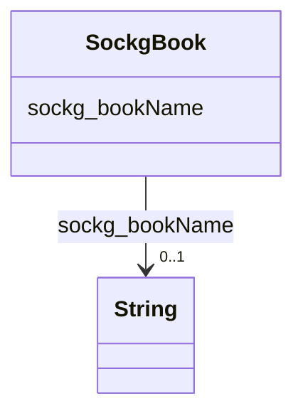

# Class: No class (entity type) name specified (sockg_Book)


_A Book is a written or printed work that provides information, stories, or research, often serving as a valuable resource for learners and professionals in the field of agriculture. Such texts can encompass a wide range of topics, including crop management, sustainable farming practices, and agricultural innovations, fostering knowledge and understanding within the agricultural community._


This class occurs 179 times.


URI: [sockg:Book](https://idir.uta.edu/sockg-ontology/docs/Book)





<!-- no inheritance hierarchy -->


## Slots

| Name | Cardinality and Range | Description | Inheritance | Occurrences |
| ---  | --- | --- | --- | --- |
| [sockg_bookName](../slots/sockg_bookName.md) | 0..1 <br/> [xsd:string](http://www.w3.org/2001/XMLSchema#string) | No slot (predicate) description specified <br/>  | direct | 2 |


## Usages

| used by | used in | type | used |
| ---  | --- | --- | --- |
| [SockgBook](../classes/SockgBook.md) | [sockg_bookName](../slots/sockg_bookName.md) | domain | [SockgBook](../classes/SockgBook.md) |


## LinkML Source

<!-- TODO: investigate https://stackoverflow.com/questions/37606292/how-to-create-tabbed-code-blocks-in-mkdocs-or-sphinx -->

### Direct

<details>

```yaml
name: sockg_Book
conforms_to: No schema conformance document specified
annotations:
  count:
    tag: count
    value: 179
description: A Book is a written or printed work that provides information, stories,
  or research, often serving as a valuable resource for learners and professionals
  in the field of agriculture. Such texts can encompass a wide range of topics, including
  crop management, sustainable farming practices, and agricultural innovations, fostering
  knowledge and understanding within the agricultural community.
title: No class (entity type) name specified
from_schema: soc-kg
rank: 1000
slots:
- sockg_bookName
slot_usage:
  sockg_bookName:
    name: sockg_bookName
    annotations:
      string:
        tag: string
        value: 2
class_uri: sockg:Book

```
</details>

### Induced

<details>

```yaml
name: sockg_Book
conforms_to: No schema conformance document specified
annotations:
  count:
    tag: count
    value: 179
description: A Book is a written or printed work that provides information, stories,
  or research, often serving as a valuable resource for learners and professionals
  in the field of agriculture. Such texts can encompass a wide range of topics, including
  crop management, sustainable farming practices, and agricultural innovations, fostering
  knowledge and understanding within the agricultural community.
title: No class (entity type) name specified
from_schema: soc-kg
rank: 1000
slot_usage:
  sockg_bookName:
    name: sockg_bookName
    annotations:
      string:
        tag: string
        value: 2
attributes:
  sockg_bookName:
    name: sockg_bookName
    annotations:
      string:
        tag: string
        value: 2
    description: No slot (predicate) description specified
    title: No slot (predicate) name specified
    examples:
    - object:
        example_object: Fractal Frontiers
        example_object_type: string
        example_predicate: sockg:bookName
        example_subject: sockg:individuals/46749
        example_subject_type: sockg_Book
    from_schema: soc-kg
    rank: 1000
    domain: sockg_Book
    slot_uri: sockg:bookName
    alias: sockg_bookName
    owner: sockg_Book
    domain_of:
    - sockg_Book
    range: string
class_uri: sockg:Book

```
</details>