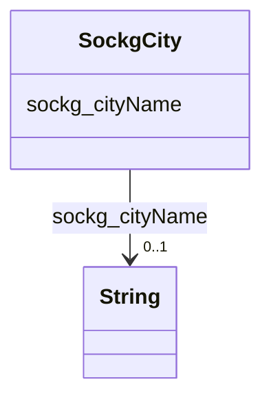

# Class: TODO -- what's a good name for what this class (type) describes? (sockg_City)


_No type description provided_


URI: [sockg:City](http://www.semanticweb.org/sockg/ontologies/2024/0/soil-carbon-ontology/City)





<!-- no inheritance hierarchy -->


## Slots

| Name | Cardinality and Range | Description | Inheritance |
| ---  | --- | --- | --- |
| [sockg_cityName](../slots/sockg_cityName.md) | 0..1 <br/> [xsd:string](http://www.w3.org/2001/XMLSchema#string) | No slot description provided | direct |


## Usages

| used by | used in | type | used |
| ---  | --- | --- | --- |
| [SockgCounty](../classes/SockgCounty.md) | [sockg_hasCity](../slots/sockg_hasCity.md) | range | [SockgCity](../classes/SockgCity.md) |
| [SockgSite](../classes/SockgSite.md) | [sockg_locatedInCity](../slots/sockg_locatedInCity.md) | range | [SockgCity](../classes/SockgCity.md) |


## Examples

| Value |
| --- |
| neo4j://graph.individuals#46716 |

## TODOs

* TODO -- Todos for this class go here
* or you can delete the todos
* if you think the class is perfect.

## Identifier and Mapping Information


### Schema Source


* from schema: soc-kg/main


## Mappings

| Mapping Type | Mapped Value |
| ---  | ---  |
| self | sockg:City |
| native | soc-kg/main/:SockgCity |


## LinkML Source

<!-- TODO: investigate https://stackoverflow.com/questions/37606292/how-to-create-tabbed-code-blocks-in-mkdocs-or-sphinx -->

### Direct

<details>
```yaml
name: sockg_City
description: No type description provided
title: TODO -- what's a good name for what this class (type) describes?
todos:
- TODO -- Todos for this class go here
- or you can delete the todos
- if you think the class is perfect.
notes:
- There are 33 instances of this class.
examples:
- value: neo4j://graph.individuals#46716
from_schema: soc-kg/main
rank: 1000
slots:
- sockg_cityName
class_uri: sockg:City

```
</details>

### Induced

<details>
```yaml
name: sockg_City
description: No type description provided
title: TODO -- what's a good name for what this class (type) describes?
todos:
- TODO -- Todos for this class go here
- or you can delete the todos
- if you think the class is perfect.
notes:
- There are 33 instances of this class.
examples:
- value: neo4j://graph.individuals#46716
from_schema: soc-kg/main
rank: 1000
attributes:
  sockg_cityName:
    name: sockg_cityName
    description: No slot description provided
    todos:
    - TODO -- Todos for this slot go here
    - or you can delete the todos
    - if you think the class is perfect.
    comments:
    - 33 occurrences with subject type sockg:City and object type string.
    examples:
    - value: neo4j://graph.individuals#46703 sockg:cityName University Park
    from_schema: soc-kg/main
    rank: 1000
    slot_uri: sockg:cityName
    alias: sockg_cityName
    owner: sockg_City
    domain_of:
    - sockg_City
    range: string
class_uri: sockg:City

```
</details>