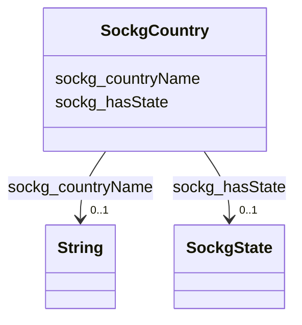

# Class: No class (entity type) name specified (sockg_Country)


_A Country is a distinct territorial body with its own government and borders, often influencing agricultural policies and practices. It serves as a fundamental unit in understanding agricultural production, trade, and the distribution of resources vital for farming._


This class occurs 3 times.


URI: [sockg:Country](https://idir.uta.edu/sockg-ontology/docs/Country)





<!-- no inheritance hierarchy -->


## Slots

| Name | Cardinality and Range | Description | Inheritance | Occurrences |
| ---  | --- | --- | --- | --- |
| [sockg_countryName](../slots/sockg_countryName.md) | 0..1 <br/> [xsd:string](http://www.w3.org/2001/XMLSchema#string) | No slot (predicate) description specified <br/>  | direct | 3 |
| [sockg_hasState](../slots/sockg_hasState.md) | 0..1 <br/> [SockgState](../classes/SockgState.md) | No slot (predicate) description specified <br/>  | direct | 19 |


## Usages

| used by | used in | type | used |
| ---  | --- | --- | --- |
| [SockgCountry](../classes/SockgCountry.md) | [sockg_countryName](../slots/sockg_countryName.md) | domain | [SockgCountry](../classes/SockgCountry.md) |
| [SockgCountry](../classes/SockgCountry.md) | [sockg_hasState](../slots/sockg_hasState.md) | domain | [SockgCountry](../classes/SockgCountry.md) |
| [SockgSite](../classes/SockgSite.md) | [sockg_locatedInCountry](../slots/sockg_locatedInCountry.md) | range | [SockgCountry](../classes/SockgCountry.md) |


## LinkML Source

<!-- TODO: investigate https://stackoverflow.com/questions/37606292/how-to-create-tabbed-code-blocks-in-mkdocs-or-sphinx -->

### Direct

<details>

```yaml
name: sockg_Country
conforms_to: No schema conformance document specified
annotations:
  count:
    tag: count
    value: 3
description: A Country is a distinct territorial body with its own government and
  borders, often influencing agricultural policies and practices. It serves as a fundamental
  unit in understanding agricultural production, trade, and the distribution of resources
  vital for farming.
title: No class (entity type) name specified
from_schema: soc-kg
rank: 1000
slots:
- sockg_countryName
- sockg_hasState
slot_usage:
  sockg_countryName:
    name: sockg_countryName
    annotations:
      string:
        tag: string
        value: 3
  sockg_hasState:
    name: sockg_hasState
    annotations:
      sockg_State:
        tag: sockg_State
        value: 19
class_uri: sockg:Country

```
</details>

### Induced

<details>

```yaml
name: sockg_Country
conforms_to: No schema conformance document specified
annotations:
  count:
    tag: count
    value: 3
description: A Country is a distinct territorial body with its own government and
  borders, often influencing agricultural policies and practices. It serves as a fundamental
  unit in understanding agricultural production, trade, and the distribution of resources
  vital for farming.
title: No class (entity type) name specified
from_schema: soc-kg
rank: 1000
slot_usage:
  sockg_countryName:
    name: sockg_countryName
    annotations:
      string:
        tag: string
        value: 3
  sockg_hasState:
    name: sockg_hasState
    annotations:
      sockg_State:
        tag: sockg_State
        value: 19
attributes:
  sockg_countryName:
    name: sockg_countryName
    annotations:
      string:
        tag: string
        value: 3
    description: No slot (predicate) description specified
    title: No slot (predicate) name specified
    examples:
    - object:
        example_object: USA
        example_object_type: string
        example_predicate: sockg:countryName
        example_subject: sockg:individuals/46901
        example_subject_type: sockg_Country
    from_schema: soc-kg
    rank: 1000
    domain: sockg_Country
    slot_uri: sockg:countryName
    alias: sockg_countryName
    owner: sockg_Country
    domain_of:
    - sockg_Country
    range: string
  sockg_hasState:
    name: sockg_hasState
    annotations:
      sockg_State:
        tag: sockg_State
        value: 19
    description: No slot (predicate) description specified
    title: No slot (predicate) name specified
    examples:
    - object:
        example_object: sockg:individuals/336400
        example_object_type: sockg_State
        example_predicate: sockg:hasState
        example_subject: sockg:individuals/46901
        example_subject_type: sockg_Country
    from_schema: soc-kg
    rank: 1000
    domain: sockg_Country
    slot_uri: sockg:hasState
    alias: sockg_hasState
    owner: sockg_Country
    domain_of:
    - sockg_Country
    range: sockg_State
class_uri: sockg:Country

```
</details>