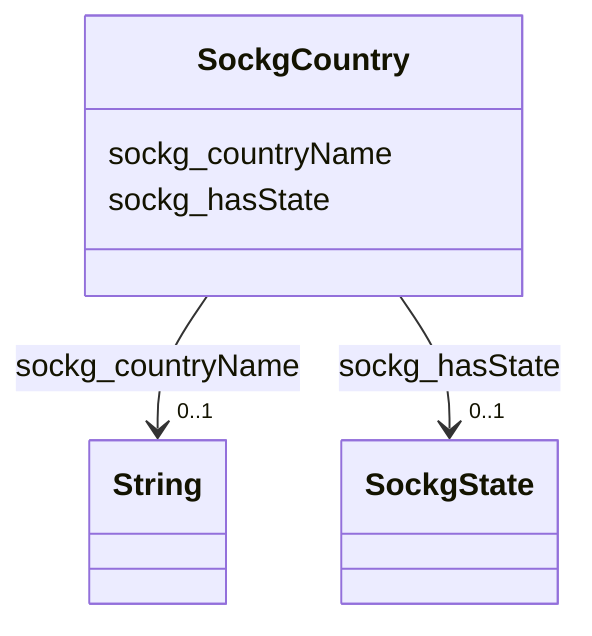

# Class: TODO -- what's a good name for what this class (type) describes? (sockg_Country)


_TODO -- tell the world what this class (type) describes._


URI: [sockg:Country](http://www.semanticweb.org/sockg/ontologies/2024/0/soil-carbon-ontology/Country)





<!-- no inheritance hierarchy -->


## Slots

| Name | Cardinality and Range | Description | Inheritance |
| ---  | --- | --- | --- |
| [sockg_hasState](../slots/sockg_hasState.md) | 0..1 <br/> [SockgState](../classes/SockgState.md) | TODO -- tell the world what this slot (predicate) describes | direct |
| [sockg_countryName](../slots/sockg_countryName.md) | 0..1 <br/> [xsd:string](http://www.w3.org/2001/XMLSchema#string) | TODO -- tell the world what this slot (predicate) describes | direct |


## Usages

| used by | used in | type | used |
| ---  | --- | --- | --- |
| [SockgSite](../classes/SockgSite.md) | [sockg_locatedInCountry](../slots/sockg_locatedInCountry.md) | range | [SockgCountry](../classes/SockgCountry.md) |


## Examples

| Value |
| --- |
| neo4j://graph.individuals#46720 |

## TODOs

* TODO -- Todos for this class go here
* or you can delete the todos
* if you think the class is perfect.

## Identifier and Mapping Information


### Schema Source


* from schema: soc-kg/main


## Mappings

| Mapping Type | Mapped Value |
| ---  | ---  |
| self | sockg:Country |
| native | soc-kg/main/:SockgCountry |


## LinkML Source

<!-- TODO: investigate https://stackoverflow.com/questions/37606292/how-to-create-tabbed-code-blocks-in-mkdocs-or-sphinx -->

### Direct

<details>
```yaml
name: sockg_Country
description: TODO -- tell the world what this class (type) describes.
title: TODO -- what's a good name for what this class (type) describes?
todos:
- TODO -- Todos for this class go here
- or you can delete the todos
- if you think the class is perfect.
notes:
- There are 3 instances of this class.
examples:
- value: neo4j://graph.individuals#46720
from_schema: soc-kg/main
slots:
- sockg_hasState
- sockg_countryName
class_uri: sockg:Country

```
</details>

### Induced

<details>
```yaml
name: sockg_Country
description: TODO -- tell the world what this class (type) describes.
title: TODO -- what's a good name for what this class (type) describes?
todos:
- TODO -- Todos for this class go here
- or you can delete the todos
- if you think the class is perfect.
notes:
- There are 3 instances of this class.
examples:
- value: neo4j://graph.individuals#46720
from_schema: soc-kg/main
attributes:
  sockg_hasState:
    name: sockg_hasState
    description: TODO -- tell the world what this slot (predicate) describes.
    todos:
    - TODO -- Todos for this slot go here
    - or you can delete the todos
    - if you think the class is perfect.
    comments:
    - 20 occurrences with subject type sockg:Country and object type sockg:State.
    examples:
    - value: neo4j://graph.individuals#46720 sockg:hasState neo4j://graph.individuals#331926
    from_schema: soc-kg/main
    rank: 1000
    slot_uri: sockg:hasState
    alias: sockg_hasState
    owner: sockg_Country
    domain_of:
    - sockg_Country
    range: sockg_State
  sockg_countryName:
    name: sockg_countryName
    description: TODO -- tell the world what this slot (predicate) describes.
    todos:
    - TODO -- Todos for this slot go here
    - or you can delete the todos
    - if you think the class is perfect.
    comments:
    - 3 occurrences with subject type sockg:Country and object type string.
    examples:
    - value: neo4j://graph.individuals#46721 sockg:countryName United States
    from_schema: soc-kg/main
    rank: 1000
    slot_uri: sockg:countryName
    alias: sockg_countryName
    owner: sockg_Country
    domain_of:
    - sockg_Country
    range: string
class_uri: sockg:Country

```
</details>