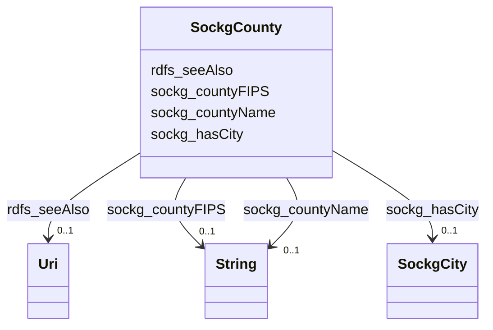

# Class: No class (entity type) name specified (sockg_County)


_A County represents a specific geographical area within a state, often encompassing various agricultural zones where farming and livestock are key economic activities. Understanding the divisions and characteristics of counties is essential for managing agricultural resources and planning rural development._


This class occurs 33 times.


URI: [sockg:County](https://idir.uta.edu/sockg-ontology/docs/County)





<!-- no inheritance hierarchy -->


## Slots

| Name | Cardinality and Range | Description | Inheritance | Occurrences |
| ---  | --- | --- | --- | --- |
| [sockg_countyName](../slots/sockg_countyName.md) | 0..1 <br/> [xsd:string](http://www.w3.org/2001/XMLSchema#string) | No slot (predicate) description specified <br/>  | direct | 33 |
| [rdfs_seeAlso](../slots/rdfs_seeAlso.md) | 0..1 <br/> [xsd:anyURI](http://www.w3.org/2001/XMLSchema#anyURI) | No slot (predicate) description specified <br/>  | direct | 33 |
| [sockg_hasCity](../slots/sockg_hasCity.md) | 0..1 <br/> [SockgCity](../classes/SockgCity.md) | No slot (predicate) description specified <br/>  | direct | 33 |
| [sockg_countyFIPS](../slots/sockg_countyFIPS.md) | 0..1 <br/> [xsd:string](http://www.w3.org/2001/XMLSchema#string) | No slot (predicate) description specified <br/>  | direct | 31 |


## Usages

| used by | used in | type | used |
| ---  | --- | --- | --- |
| [SockgCounty](../classes/SockgCounty.md) | [sockg_countyName](../slots/sockg_countyName.md) | domain | [SockgCounty](../classes/SockgCounty.md) |
| [SockgCounty](../classes/SockgCounty.md) | [sockg_hasCity](../slots/sockg_hasCity.md) | domain | [SockgCounty](../classes/SockgCounty.md) |
| [SockgSite](../classes/SockgSite.md) | [sockg_locatedInCounty](../slots/sockg_locatedInCounty.md) | range | [SockgCounty](../classes/SockgCounty.md) |
| [SockgState](../classes/SockgState.md) | [sockg_hasCounty](../slots/sockg_hasCounty.md) | range | [SockgCounty](../classes/SockgCounty.md) |


## See Also

* [https://lod.nal.usda.gov/nalt/2217129](https://lod.nal.usda.gov/nalt/2217129)


## LinkML Source

<!-- TODO: investigate https://stackoverflow.com/questions/37606292/how-to-create-tabbed-code-blocks-in-mkdocs-or-sphinx -->

### Direct

<details>

```yaml
name: sockg_County
conforms_to: No schema conformance document specified
annotations:
  count:
    tag: count
    value: 33
description: A County represents a specific geographical area within a state, often
  encompassing various agricultural zones where farming and livestock are key economic
  activities. Understanding the divisions and characteristics of counties is essential
  for managing agricultural resources and planning rural development.
title: No class (entity type) name specified
from_schema: soc-kg
see_also:
- https://lod.nal.usda.gov/nalt/2217129
rank: 1000
slots:
- sockg_countyName
- rdfs_seeAlso
- sockg_hasCity
- sockg_countyFIPS
slot_usage:
  rdfs_seeAlso:
    name: rdfs_seeAlso
    annotations:
      uri:
        tag: uri
        value: 33
  sockg_countyFIPS:
    name: sockg_countyFIPS
    annotations:
      string:
        tag: string
        value: 31
  sockg_countyName:
    name: sockg_countyName
    annotations:
      string:
        tag: string
        value: 33
  sockg_hasCity:
    name: sockg_hasCity
    annotations:
      sockg_City:
        tag: sockg_City
        value: 33
class_uri: sockg:County

```
</details>

### Induced

<details>

```yaml
name: sockg_County
conforms_to: No schema conformance document specified
annotations:
  count:
    tag: count
    value: 33
description: A County represents a specific geographical area within a state, often
  encompassing various agricultural zones where farming and livestock are key economic
  activities. Understanding the divisions and characteristics of counties is essential
  for managing agricultural resources and planning rural development.
title: No class (entity type) name specified
from_schema: soc-kg
see_also:
- https://lod.nal.usda.gov/nalt/2217129
rank: 1000
slot_usage:
  rdfs_seeAlso:
    name: rdfs_seeAlso
    annotations:
      uri:
        tag: uri
        value: 33
  sockg_countyFIPS:
    name: sockg_countyFIPS
    annotations:
      string:
        tag: string
        value: 31
  sockg_countyName:
    name: sockg_countyName
    annotations:
      string:
        tag: string
        value: 33
  sockg_hasCity:
    name: sockg_hasCity
    annotations:
      sockg_City:
        tag: sockg_City
        value: 33
attributes:
  sockg_countyName:
    name: sockg_countyName
    annotations:
      string:
        tag: string
        value: 33
    description: No slot (predicate) description specified
    title: No slot (predicate) name specified
    examples:
    - object:
        example_object: Macon
        example_object_type: string
        example_predicate: sockg:countyName
        example_subject: sockg:individuals/46904
        example_subject_type: sockg_County
    from_schema: soc-kg
    see_also:
    - https://lod.nal.usda.gov/nalt/2217129
    rank: 1000
    domain: sockg_County
    slot_uri: sockg:countyName
    alias: sockg_countyName
    owner: sockg_County
    domain_of:
    - sockg_County
    range: string
  rdfs_seeAlso:
    name: rdfs_seeAlso
    annotations:
      uri:
        tag: uri
        value: 33
    description: No slot (predicate) description specified
    examples:
    - object:
        example_object: https://lod.nal.usda.gov/nalt/4605
        example_object_type: uri
        example_predicate: rdfs:seeAlso
        example_subject: sockg:individuals/0
        example_subject_type: sockg_Amendment
    - object:
        example_object: https://lod.nal.usda.gov/nalt/5859
        example_object_type: uri
        example_predicate: rdfs:seeAlso
        example_subject: sockg:individuals/100000
        example_subject_type: sockg_GasSample
    - object:
        example_object: https://lod.nal.usda.gov/nalt/281219
        example_object_type: uri
        example_predicate: rdfs:seeAlso
        example_subject: sockg:individuals/163960
        example_subject_type: sockg_Grazing
    - object:
        example_object: https://lod.nal.usda.gov/nalt/4377260
        example_object_type: uri
        example_predicate: rdfs:seeAlso
        example_subject: sockg:individuals/170955
        example_subject_type: sockg_GrazingManagementEvent
    - object:
        example_object: https://lod.nal.usda.gov/nalt/131626
        example_object_type: uri
        example_predicate: rdfs:seeAlso
        example_subject: sockg:individuals/172906
        example_subject_type: sockg_Harvest
    - object:
        example_object: https://lod.nal.usda.gov/nalt/281219
        example_object_type: uri
        example_predicate: rdfs:seeAlso
        example_subject: sockg:individuals/191262
        example_subject_type: sockg_HarvestFraction
    - object:
        example_object: https://lod.nal.usda.gov/nalt/13189
        example_object_type: uri
        example_predicate: rdfs:seeAlso
        example_subject: sockg:individuals/203523
        example_subject_type: sockg_Organization
    - object:
        example_object: https://lod.nal.usda.gov/nalt/3927
        example_object_type: uri
        example_predicate: rdfs:seeAlso
        example_subject: sockg:individuals/203632
        example_subject_type: sockg_Pesticide
    - object:
        example_object: https://lod.nal.usda.gov/nalt/849
        example_object_type: uri
        example_predicate: rdfs:seeAlso
        example_subject: sockg:individuals/227674
        example_subject_type: sockg_ResidueManagementEvent
    - object:
        example_object: https://lod.nal.usda.gov/nalt/30158
        example_object_type: uri
        example_predicate: rdfs:seeAlso
        example_subject: sockg:individuals/230982
        example_subject_type: sockg_Rotation
    - object:
        example_object: https://lod.nal.usda.gov/nalt/302328
        example_object_type: uri
        example_predicate: rdfs:seeAlso
        example_subject: sockg:individuals/231056
        example_subject_type: sockg_Site
    - object:
        example_object: https://lod.nal.usda.gov/nalt/2726
        example_object_type: uri
        example_predicate: rdfs:seeAlso
        example_subject: sockg:individuals/235229
        example_subject_type: sockg_SoilBiologicalSample
    - object:
        example_object: https://lod.nal.usda.gov/nalt/7974
        example_object_type: uri
        example_predicate: rdfs:seeAlso
        example_subject: sockg:individuals/253451
        example_subject_type: sockg_SoilChemicalSample
    - object:
        example_object: https://lod.nal.usda.gov/nalt/302328
        example_object_type: uri
        example_predicate: rdfs:seeAlso
        example_subject: sockg:individuals/307284
        example_subject_type: sockg_SoilCover
    - object:
        example_object: https://lod.nal.usda.gov/nalt/5143
        example_object_type: uri
        example_predicate: rdfs:seeAlso
        example_subject: sockg:individuals/308318
        example_subject_type: sockg_SoilPhysicalSample
    - object:
        example_object: https://lod.nal.usda.gov/nalt/5430914
        example_object_type: uri
        example_predicate: rdfs:seeAlso
        example_subject: sockg:individuals/336400
        example_subject_type: sockg_State
    - object:
        example_object: https://lod.nal.usda.gov/nalt/7140
        example_object_type: uri
        example_predicate: rdfs:seeAlso
        example_subject: sockg:individuals/336419
        example_subject_type: sockg_Tillage
    - object:
        example_object: https://lod.nal.usda.gov/nalt/28616
        example_object_type: uri
        example_predicate: rdfs:seeAlso
        example_subject: sockg:individuals/363556
        example_subject_type: sockg_Treatment
    - object:
        example_object: https://lod.nal.usda.gov/nalt/2717
        example_object_type: uri
        example_predicate: rdfs:seeAlso
        example_subject: sockg:individuals/37796
        example_subject_type: sockg_BioMassCarbohydrate
    - object:
        example_object: https://lod.nal.usda.gov/nalt/7140
        example_object_type: uri
        example_predicate: rdfs:seeAlso
        example_subject: sockg:individuals/39163
        example_subject_type: sockg_BioMassEnergy
    - object:
        example_object: https://lod.nal.usda.gov/nalt/281219
        example_object_type: uri
        example_predicate: rdfs:seeAlso
        example_subject: sockg:individuals/39962
        example_subject_type: sockg_BioMassMineral
    - object:
        example_object: https://lod.nal.usda.gov/nalt/2714
        example_object_type: uri
        example_predicate: rdfs:seeAlso
        example_subject: sockg:individuals/439235
        example_subject_type: sockg_WeatherObservation
    - object:
        example_object: https://lod.nal.usda.gov/nalt/7485997
        example_object_type: uri
        example_predicate: rdfs:seeAlso
        example_subject: sockg:individuals/46864
        example_subject_type: sockg_City
    - object:
        example_object: https://lod.nal.usda.gov/nalt/2217129
        example_object_type: uri
        example_predicate: rdfs:seeAlso
        example_subject: sockg:individuals/46904
        example_subject_type: sockg_County
    - object:
        example_object: https://lod.nal.usda.gov/nalt/302328
        example_object_type: uri
        example_predicate: rdfs:seeAlso
        example_subject: sockg:individuals/46937
        example_subject_type: sockg_CropGrowthStage
    - object:
        example_object: https://lod.nal.usda.gov/nalt/976
        example_object_type: uri
        example_predicate: rdfs:seeAlso
        example_subject: sockg:individuals/51906
        example_subject_type: sockg_Experiment
    - object:
        example_object: https://lod.nal.usda.gov/nalt/9183
        example_object_type: uri
        example_predicate: rdfs:seeAlso
        example_subject: sockg:individuals/51937
        example_subject_type: sockg_ExperimentalUnit
    - object:
        example_object: https://lod.nal.usda.gov/nalt/7259
        example_object_type: uri
        example_predicate: rdfs:seeAlso
        example_subject: sockg:individuals/55800
        example_subject_type: sockg_Field
    - object:
        example_object: https://lod.nal.usda.gov/nalt/7140
        example_object_type: uri
        example_predicate: rdfs:seeAlso
        example_subject: sockg:individuals/200732
        example_subject_type: sockg_NutrientEfficiency
    - object:
        example_object: https://lod.nal.usda.gov/nalt/35067
        example_object_type: uri
        example_predicate: rdfs:seeAlso
        example_subject: sockg:individuals/203534
        example_subject_type: sockg_Person
    - object:
        example_object: https://lod.nal.usda.gov/nalt/5630
        example_object_type: uri
        example_predicate: rdfs:seeAlso
        example_subject: sockg:individuals/203988
        example_subject_type: sockg_PlantingEvent
    - object:
        example_object: https://lod.nal.usda.gov/nalt/61097
        example_object_type: uri
        example_predicate: rdfs:seeAlso
        example_subject: sockg:individuals/227438
        example_subject_type: sockg_Project
    - object:
        example_object: https://lod.nal.usda.gov/nalt/305490
        example_object_type: uri
        example_predicate: rdfs:seeAlso
        example_subject: sockg:individuals/227447
        example_subject_type: sockg_Publication
    - object:
        example_object: https://lod.nal.usda.gov/nalt/48678
        example_object_type: uri
        example_predicate: rdfs:seeAlso
        example_subject: sockg:individuals/227609
        example_subject_type: sockg_ResearchUnit
    - object:
        example_object: https://lod.nal.usda.gov/nalt/33020
        example_object_type: uri
        example_predicate: rdfs:seeAlso
        example_subject: sockg:individuals/231116
        example_subject_type: sockg_Soil
    - object:
        example_object: https://lod.nal.usda.gov/nalt/7140
        example_object_type: uri
        example_predicate: rdfs:seeAlso
        example_subject: sockg:individuals/364326
        example_subject_type: sockg_WaterQualityArea
    - object:
        example_object: https://lod.nal.usda.gov/nalt/281219
        example_object_type: uri
        example_predicate: rdfs:seeAlso
        example_subject: sockg:individuals/364993
        example_subject_type: sockg_WaterQualityConc
    - object:
        example_object: https://lod.nal.usda.gov/nalt/7259
        example_object_type: uri
        example_predicate: rdfs:seeAlso
        example_subject: sockg:individuals/513777
        example_subject_type: sockg_WeatherStation
    - object:
        example_object: https://lod.nal.usda.gov/nalt/281219
        example_object_type: uri
        example_predicate: rdfs:seeAlso
        example_subject: sockg:individuals/55858
        example_subject_type: sockg_GasNutrientLoss
    - object:
        example_object: https://lod.nal.usda.gov/nalt/281219
        example_object_type: uri
        example_predicate: rdfs:seeAlso
        example_subject: sockg:individuals/624572
        example_subject_type: sockg_WindErosionArea
    - object:
        example_object: https://lod.nal.usda.gov/nalt/7140
        example_object_type: uri
        example_predicate: rdfs:seeAlso
        example_subject: sockg:individuals/624587
        example_subject_type: sockg_YieldNutrientUptake
    from_schema: soc-kg
    rank: 1000
    slot_uri: rdfs:seeAlso
    alias: rdfs_seeAlso
    owner: sockg_County
    domain_of:
    - sockg_Amendment
    - sockg_BioMassCarbohydrate
    - sockg_BioMassEnergy
    - sockg_BioMassMineral
    - sockg_City
    - sockg_County
    - sockg_CropGrowthStage
    - sockg_Experiment
    - sockg_ExperimentalUnit
    - sockg_Field
    - sockg_GasNutrientLoss
    - sockg_GasSample
    - sockg_Grazing
    - sockg_GrazingManagementEvent
    - sockg_Harvest
    - sockg_HarvestFraction
    - sockg_NutrientEfficiency
    - sockg_Organization
    - sockg_Person
    - sockg_Pesticide
    - sockg_PlantingEvent
    - sockg_Project
    - sockg_Publication
    - sockg_ResearchUnit
    - sockg_ResidueManagementEvent
    - sockg_Rotation
    - sockg_Site
    - sockg_Soil
    - sockg_SoilBiologicalSample
    - sockg_SoilChemicalSample
    - sockg_SoilCover
    - sockg_SoilPhysicalSample
    - sockg_State
    - sockg_Tillage
    - sockg_Treatment
    - sockg_WaterQualityArea
    - sockg_WaterQualityConc
    - sockg_WeatherObservation
    - sockg_WeatherStation
    - sockg_WindErosionArea
    - sockg_YieldNutrientUptake
    range: uri
  sockg_hasCity:
    name: sockg_hasCity
    annotations:
      sockg_City:
        tag: sockg_City
        value: 33
    description: No slot (predicate) description specified
    title: No slot (predicate) name specified
    examples:
    - object:
        example_object: sockg:individuals/46864
        example_object_type: sockg_City
        example_predicate: sockg:hasCity
        example_subject: sockg:individuals/46904
        example_subject_type: sockg_County
    from_schema: soc-kg
    rank: 1000
    domain: sockg_County
    slot_uri: sockg:hasCity
    alias: sockg_hasCity
    owner: sockg_County
    domain_of:
    - sockg_County
    range: sockg_City
  sockg_countyFIPS:
    name: sockg_countyFIPS
    annotations:
      string:
        tag: string
        value: 31
    description: No slot (predicate) description specified
    examples:
    - object:
        example_object: administrativeRegion.USA.1087
        example_object_type: string
        example_predicate: sockg:countyFIPS
        example_subject: sockg:individuals/46904
        example_subject_type: sockg_County
    from_schema: soc-kg
    rank: 1000
    slot_uri: sockg:countyFIPS
    alias: sockg_countyFIPS
    owner: sockg_County
    domain_of:
    - sockg_County
    range: string
class_uri: sockg:County

```
</details>