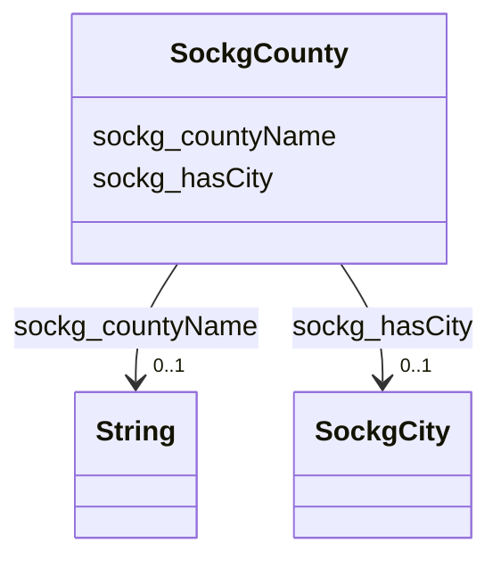

# Class: TODO -- what's a good name for what this class (type) describes? (sockg_County)


_TODO -- tell the world what this class (type) describes._


URI: [sockg:County](http://www.semanticweb.org/sockg/ontologies/2024/0/soil-carbon-ontology/County)





<!-- no inheritance hierarchy -->


## Slots

| Name | Cardinality and Range | Description | Inheritance |
| ---  | --- | --- | --- |
| [sockg_hasCity](../slots/sockg_hasCity.md) | 0..1 <br/> [SockgCity](../classes/SockgCity.md) | TODO -- tell the world what this slot (predicate) describes | direct |
| [sockg_countyName](../slots/sockg_countyName.md) | 0..1 <br/> [xsd:string](http://www.w3.org/2001/XMLSchema#string) | TODO -- tell the world what this slot (predicate) describes | direct |


## Usages

| used by | used in | type | used |
| ---  | --- | --- | --- |
| [SockgSite](../classes/SockgSite.md) | [sockg_locatedInCounty](../slots/sockg_locatedInCounty.md) | range | [SockgCounty](../classes/SockgCounty.md) |
| [SockgState](../classes/SockgState.md) | [sockg_hasCounty](../slots/sockg_hasCounty.md) | range | [SockgCounty](../classes/SockgCounty.md) |


## Examples

| Value |
| --- |
| neo4j://graph.individuals#46730 |

## TODOs

* TODO -- Todos for this class go here
* or you can delete the todos
* if you think the class is perfect.

## Identifier and Mapping Information


### Schema Source


* from schema: soc-kg/main


## Mappings

| Mapping Type | Mapped Value |
| ---  | ---  |
| self | sockg:County |
| native | soc-kg/main/:SockgCounty |


## LinkML Source

<!-- TODO: investigate https://stackoverflow.com/questions/37606292/how-to-create-tabbed-code-blocks-in-mkdocs-or-sphinx -->

### Direct

<details>
```yaml
name: sockg_County
description: TODO -- tell the world what this class (type) describes.
title: TODO -- what's a good name for what this class (type) describes?
todos:
- TODO -- Todos for this class go here
- or you can delete the todos
- if you think the class is perfect.
notes:
- There are 33 instances of this class.
examples:
- value: neo4j://graph.individuals#46730
from_schema: soc-kg/main
slots:
- sockg_hasCity
- sockg_countyName
class_uri: sockg:County

```
</details>

### Induced

<details>
```yaml
name: sockg_County
description: TODO -- tell the world what this class (type) describes.
title: TODO -- what's a good name for what this class (type) describes?
todos:
- TODO -- Todos for this class go here
- or you can delete the todos
- if you think the class is perfect.
notes:
- There are 33 instances of this class.
examples:
- value: neo4j://graph.individuals#46730
from_schema: soc-kg/main
attributes:
  sockg_hasCity:
    name: sockg_hasCity
    description: TODO -- tell the world what this slot (predicate) describes.
    todos:
    - TODO -- Todos for this slot go here
    - or you can delete the todos
    - if you think the class is perfect.
    comments:
    - 33 occurrences with subject type sockg:County and object type sockg:City.
    examples:
    - value: neo4j://graph.individuals#46724 sockg:hasCity neo4j://graph.individuals#46688
    from_schema: soc-kg/main
    rank: 1000
    slot_uri: sockg:hasCity
    alias: sockg_hasCity
    owner: sockg_County
    domain_of:
    - sockg_County
    range: sockg_City
  sockg_countyName:
    name: sockg_countyName
    description: TODO -- tell the world what this slot (predicate) describes.
    todos:
    - TODO -- Todos for this slot go here
    - or you can delete the todos
    - if you think the class is perfect.
    comments:
    - 33 occurrences with subject type sockg:County and object type string.
    examples:
    - value: neo4j://graph.individuals#46740 sockg:countyName Brookings
    from_schema: soc-kg/main
    rank: 1000
    slot_uri: sockg:countyName
    alias: sockg_countyName
    owner: sockg_County
    domain_of:
    - sockg_County
    range: string
class_uri: sockg:County

```
</details>