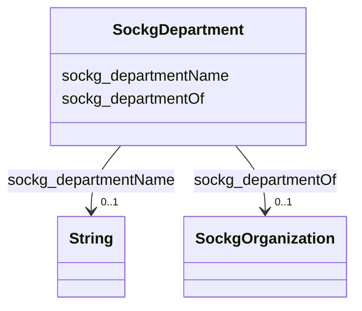

# Class: TODO -- what's a good name for what this class (type) describes? (sockg_Department)


_TODO -- tell the world what this class (type) describes._


URI: [sockg:Department](http://www.semanticweb.org/sockg/ontologies/2024/0/soil-carbon-ontology/Department)





<!-- no inheritance hierarchy -->


## Slots

| Name | Cardinality and Range | Description | Inheritance |
| ---  | --- | --- | --- |
| [sockg_departmentOf](../slots/sockg_departmentOf.md) | 0..1 <br/> [SockgOrganization](../classes/SockgOrganization.md) | TODO -- tell the world what this slot (predicate) describes | direct |
| [sockg_departmentName](../slots/sockg_departmentName.md) | 0..1 <br/> [xsd:string](http://www.w3.org/2001/XMLSchema#string) | TODO -- tell the world what this slot (predicate) describes | direct |


## Usages

| used by | used in | type | used |
| ---  | --- | --- | --- |
| [SockgPerson](../classes/SockgPerson.md) | [sockg_worksAtDepartment](../slots/sockg_worksAtDepartment.md) | range | [SockgDepartment](../classes/SockgDepartment.md) |


## Examples

| Value |
| --- |
| neo4j://graph.individuals#51681 |

## TODOs

* TODO -- Todos for this class go here
* or you can delete the todos
* if you think the class is perfect.

## Identifier and Mapping Information


### Schema Source


* from schema: soc-kg/main


## Mappings

| Mapping Type | Mapped Value |
| ---  | ---  |
| self | sockg:Department |
| native | soc-kg/main/:SockgDepartment |


## LinkML Source

<!-- TODO: investigate https://stackoverflow.com/questions/37606292/how-to-create-tabbed-code-blocks-in-mkdocs-or-sphinx -->

### Direct

<details>
```yaml
name: sockg_Department
description: TODO -- tell the world what this class (type) describes.
title: TODO -- what's a good name for what this class (type) describes?
todos:
- TODO -- Todos for this class go here
- or you can delete the todos
- if you think the class is perfect.
notes:
- There are 33 instances of this class.
examples:
- value: neo4j://graph.individuals#51681
from_schema: soc-kg/main
slots:
- sockg_departmentOf
- sockg_departmentName
class_uri: sockg:Department

```
</details>

### Induced

<details>
```yaml
name: sockg_Department
description: TODO -- tell the world what this class (type) describes.
title: TODO -- what's a good name for what this class (type) describes?
todos:
- TODO -- Todos for this class go here
- or you can delete the todos
- if you think the class is perfect.
notes:
- There are 33 instances of this class.
examples:
- value: neo4j://graph.individuals#51681
from_schema: soc-kg/main
attributes:
  sockg_departmentOf:
    name: sockg_departmentOf
    description: TODO -- tell the world what this slot (predicate) describes.
    todos:
    - TODO -- Todos for this slot go here
    - or you can delete the todos
    - if you think the class is perfect.
    comments:
    - 11 occurrences with subject type sockg:Department and object type sockg:Organization.
    examples:
    - value: neo4j://graph.individuals#51678 sockg:departmentOf neo4j://graph.individuals#203272
    from_schema: soc-kg/main
    rank: 1000
    slot_uri: sockg:departmentOf
    alias: sockg_departmentOf
    owner: sockg_Department
    domain_of:
    - sockg_Department
    range: sockg_Organization
  sockg_departmentName:
    name: sockg_departmentName
    description: TODO -- tell the world what this slot (predicate) describes.
    todos:
    - TODO -- Todos for this slot go here
    - or you can delete the todos
    - if you think the class is perfect.
    comments:
    - 33 occurrences with subject type sockg:Department and object type string.
    examples:
    - value: neo4j://graph.individuals#51669 sockg:departmentName Northern Great Plains
        Research Laboratory
    from_schema: soc-kg/main
    rank: 1000
    slot_uri: sockg:departmentName
    alias: sockg_departmentName
    owner: sockg_Department
    domain_of:
    - sockg_Department
    range: string
class_uri: sockg:Department

```
</details>