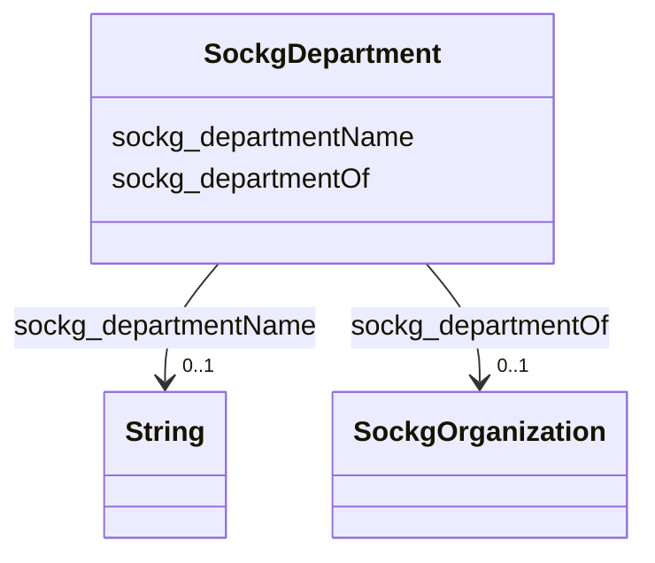

# Class: No class (entity type) name specified (sockg_Department)


_A Department represents a specialized division within an agricultural institution, focused on specific areas of study or practice, such as Plant Sciences or Agricultural Engineering. Each department plays a crucial role in advancing agricultural research, education, and outreach in its designated field._


This class occurs 49 times.


URI: [sockg:Department](https://idir.uta.edu/sockg-ontology/docs/Department)





<!-- no inheritance hierarchy -->


## Slots

| Name | Cardinality and Range | Description | Inheritance | Occurrences |
| ---  | --- | --- | --- | --- |
| [sockg_departmentName](../slots/sockg_departmentName.md) | 0..1 <br/> [xsd:string](http://www.w3.org/2001/XMLSchema#string) | No slot (predicate) description specified <br/>  | direct | 33 |
| [sockg_departmentOf](../slots/sockg_departmentOf.md) | 0..1 <br/> [SockgOrganization](../classes/SockgOrganization.md) | No slot (predicate) description specified <br/>  | direct | 11 |


## Usages

| used by | used in | type | used |
| ---  | --- | --- | --- |
| [SockgDepartment](../classes/SockgDepartment.md) | [sockg_departmentName](../slots/sockg_departmentName.md) | domain | [SockgDepartment](../classes/SockgDepartment.md) |
| [SockgDepartment](../classes/SockgDepartment.md) | [sockg_departmentOf](../slots/sockg_departmentOf.md) | domain | [SockgDepartment](../classes/SockgDepartment.md) |
| [SockgPerson](../classes/SockgPerson.md) | [sockg_worksAtDepartment](../slots/sockg_worksAtDepartment.md) | range | [SockgDepartment](../classes/SockgDepartment.md) |


## LinkML Source

<!-- TODO: investigate https://stackoverflow.com/questions/37606292/how-to-create-tabbed-code-blocks-in-mkdocs-or-sphinx -->

### Direct

<details>

```yaml
name: sockg_Department
conforms_to: No schema conformance document specified
annotations:
  count:
    tag: count
    value: 49
description: A Department represents a specialized division within an agricultural
  institution, focused on specific areas of study or practice, such as Plant Sciences
  or Agricultural Engineering. Each department plays a crucial role in advancing agricultural
  research, education, and outreach in its designated field.
title: No class (entity type) name specified
from_schema: soc-kg
rank: 1000
slots:
- sockg_departmentName
- sockg_departmentOf
slot_usage:
  sockg_departmentName:
    name: sockg_departmentName
    annotations:
      string:
        tag: string
        value: 33
  sockg_departmentOf:
    name: sockg_departmentOf
    annotations:
      sockg_Organization:
        tag: sockg_Organization
        value: 11
class_uri: sockg:Department

```
</details>

### Induced

<details>

```yaml
name: sockg_Department
conforms_to: No schema conformance document specified
annotations:
  count:
    tag: count
    value: 49
description: A Department represents a specialized division within an agricultural
  institution, focused on specific areas of study or practice, such as Plant Sciences
  or Agricultural Engineering. Each department plays a crucial role in advancing agricultural
  research, education, and outreach in its designated field.
title: No class (entity type) name specified
from_schema: soc-kg
rank: 1000
slot_usage:
  sockg_departmentName:
    name: sockg_departmentName
    annotations:
      string:
        tag: string
        value: 33
  sockg_departmentOf:
    name: sockg_departmentOf
    annotations:
      sockg_Organization:
        tag: sockg_Organization
        value: 11
attributes:
  sockg_departmentName:
    name: sockg_departmentName
    annotations:
      string:
        tag: string
        value: 33
    description: No slot (predicate) description specified
    title: No slot (predicate) name specified
    examples:
    - object:
        example_object: USDA ARS
        example_object_type: string
        example_predicate: sockg:departmentName
        example_subject: sockg:individuals/51833
        example_subject_type: sockg_Department
    from_schema: soc-kg
    rank: 1000
    domain: sockg_Department
    slot_uri: sockg:departmentName
    alias: sockg_departmentName
    owner: sockg_Department
    domain_of:
    - sockg_Department
    range: string
  sockg_departmentOf:
    name: sockg_departmentOf
    annotations:
      sockg_Organization:
        tag: sockg_Organization
        value: 11
    description: No slot (predicate) description specified
    title: No slot (predicate) name specified
    examples:
    - object:
        example_object: sockg:individuals/203523
        example_object_type: sockg_Organization
        example_predicate: sockg:departmentOf
        example_subject: sockg:individuals/51836
        example_subject_type: sockg_Department
    from_schema: soc-kg
    rank: 1000
    domain: sockg_Department
    slot_uri: sockg:departmentOf
    alias: sockg_departmentOf
    owner: sockg_Department
    domain_of:
    - sockg_Department
    range: sockg_Organization
class_uri: sockg:Department

```
</details>