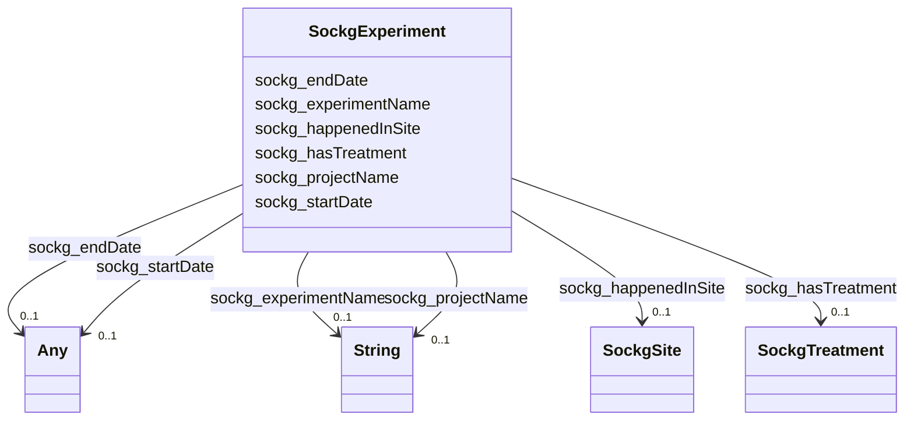

# Class: TODO -- what's a good name for what this class (type) describes? (sockg_Experiment)


_No type description provided_


URI: [sockg:Experiment](http://www.semanticweb.org/sockg/ontologies/2024/0/soil-carbon-ontology/Experiment)





<!-- no inheritance hierarchy -->


## Slots

| Name | Cardinality and Range | Description | Inheritance |
| ---  | --- | --- | --- |
| [sockg_hasTreatment](../slots/sockg_hasTreatment.md) | 0..1 <br/> [SockgTreatment](../classes/SockgTreatment.md) | No slot description provided | direct |
| [sockg_happenedInSite](../slots/sockg_happenedInSite.md) | 0..1 <br/> [SockgSite](../classes/SockgSite.md) | No slot description provided | direct |
| [sockg_startDate](../slots/sockg_startDate.md) | 0..1 <br/> [xsd:string](http://www.w3.org/2001/XMLSchema#string)&nbsp;or&nbsp;<br />[xsd:double](http://www.w3.org/2001/XMLSchema#double) | No slot description provided | direct |
| [sockg_experimentName](../slots/sockg_experimentName.md) | 0..1 <br/> [xsd:string](http://www.w3.org/2001/XMLSchema#string) | No slot description provided | direct |
| [sockg_endDate](../slots/sockg_endDate.md) | 0..1 <br/> [xsd:double](http://www.w3.org/2001/XMLSchema#double)&nbsp;or&nbsp;<br />[xsd:string](http://www.w3.org/2001/XMLSchema#string) | No slot description provided | direct |
| [sockg_projectName](../slots/sockg_projectName.md) | 0..1 <br/> [xsd:string](http://www.w3.org/2001/XMLSchema#string) | No slot description provided | direct |


## Usages

| used by | used in | type | used |
| ---  | --- | --- | --- |
| [SockgOrganization](../classes/SockgOrganization.md) | [sockg_fundsExperiment](../slots/sockg_fundsExperiment.md) | range | [SockgExperiment](../classes/SockgExperiment.md) |


## Examples

| Value |
| --- |
| neo4j://graph.individuals#51720 |

## TODOs

* TODO -- Todos for this class go here
* or you can delete the todos
* if you think the class is perfect.

## Identifier and Mapping Information


### Schema Source


* from schema: soc-kg/main


## Mappings

| Mapping Type | Mapped Value |
| ---  | ---  |
| self | sockg:Experiment |
| native | soc-kg/main/:SockgExperiment |


## LinkML Source

<!-- TODO: investigate https://stackoverflow.com/questions/37606292/how-to-create-tabbed-code-blocks-in-mkdocs-or-sphinx -->

### Direct

<details>
```yaml
name: sockg_Experiment
description: No type description provided
title: TODO -- what's a good name for what this class (type) describes?
todos:
- TODO -- Todos for this class go here
- or you can delete the todos
- if you think the class is perfect.
notes:
- There are 55 instances of this class.
examples:
- value: neo4j://graph.individuals#51720
from_schema: soc-kg/main
rank: 1000
slots:
- sockg_hasTreatment
- sockg_happenedInSite
- sockg_startDate
- sockg_experimentName
- sockg_endDate
- sockg_projectName
class_uri: sockg:Experiment

```
</details>

### Induced

<details>
```yaml
name: sockg_Experiment
description: No type description provided
title: TODO -- what's a good name for what this class (type) describes?
todos:
- TODO -- Todos for this class go here
- or you can delete the todos
- if you think the class is perfect.
notes:
- There are 55 instances of this class.
examples:
- value: neo4j://graph.individuals#51720
from_schema: soc-kg/main
rank: 1000
attributes:
  sockg_hasTreatment:
    name: sockg_hasTreatment
    description: No slot description provided
    todos:
    - TODO -- Todos for this slot go here
    - or you can delete the todos
    - if you think the class is perfect.
    comments:
    - 741 occurrences with subject type sockg:Experiment and object type sockg:Treatment.
    examples:
    - value: neo4j://graph.individuals#51716 sockg:hasTreatment neo4j://graph.individuals#359530
    from_schema: soc-kg/main
    rank: 1000
    slot_uri: sockg:hasTreatment
    alias: sockg_hasTreatment
    owner: sockg_Experiment
    domain_of:
    - sockg_Experiment
    range: sockg_Treatment
  sockg_happenedInSite:
    name: sockg_happenedInSite
    description: No slot description provided
    todos:
    - TODO -- Todos for this slot go here
    - or you can delete the todos
    - if you think the class is perfect.
    comments:
    - 61 occurrences with subject type sockg:Experiment and object type sockg:Site.
    examples:
    - value: neo4j://graph.individuals#51698 sockg:happenedInSite neo4j://graph.individuals#230697
    from_schema: soc-kg/main
    rank: 1000
    slot_uri: sockg:happenedInSite
    alias: sockg_happenedInSite
    owner: sockg_Experiment
    domain_of:
    - sockg_Experiment
    range: sockg_Site
  sockg_startDate:
    name: sockg_startDate
    description: No slot description provided
    todos:
    - TODO -- Todos for this slot go here
    - or you can delete the todos
    - if you think the class is perfect.
    comments:
    - 37796 occurrences with subject type sockg:Amendment and object type string.
    - 3178 occurrences with subject type sockg:ExperimentalUnit and object type string.
    - 1951 occurrences with subject type sockg:GrazingManagementEvent and object type
      string.
    - 631 occurrences with subject type sockg:ExperimentalUnit and object type xsd:double.
    - 55 occurrences with subject type sockg:Experiment and object type string.
    examples:
    - value: neo4j://graph.individuals#6073 sockg:startDate 2010-04-23
    - value: neo4j://graph.individuals#52263 sockg:startDate 2004-04-01
    - value: neo4j://graph.individuals#172393 sockg:startDate 1996-08-15
    - value: neo4j://graph.individuals#54995 sockg:startDate nan
    - value: neo4j://graph.individuals#51687 sockg:startDate 2009-01-01
    from_schema: soc-kg/main
    rank: 1000
    slot_uri: sockg:startDate
    alias: sockg_startDate
    owner: sockg_Experiment
    domain_of:
    - sockg_Amendment
    - sockg_Experiment
    - sockg_ExperimentalUnit
    - sockg_GrazingManagementEvent
    range: Any
    any_of:
    - range: string
    - range: double
  sockg_experimentName:
    name: sockg_experimentName
    description: No slot description provided
    todos:
    - TODO -- Todos for this slot go here
    - or you can delete the todos
    - if you think the class is perfect.
    comments:
    - 55 occurrences with subject type sockg:Experiment and object type string.
    examples:
    - value: neo4j://graph.individuals#51733 sockg:experimentName Barnyard experiment
        of gas emissions, and nutrient concentrations in leachate and runoff from
        dairy cattle lots with different surface materials
    from_schema: soc-kg/main
    rank: 1000
    slot_uri: sockg:experimentName
    alias: sockg_experimentName
    owner: sockg_Experiment
    domain_of:
    - sockg_Experiment
    range: string
  sockg_endDate:
    name: sockg_endDate
    description: No slot description provided
    todos:
    - TODO -- Todos for this slot go here
    - or you can delete the todos
    - if you think the class is perfect.
    comments:
    - 37796 occurrences with subject type sockg:Amendment and object type xsd:double.
    - 2026 occurrences with subject type sockg:ExperimentalUnit and object type xsd:double.
    - 1783 occurrences with subject type sockg:ExperimentalUnit and object type string.
    - 1951 occurrences with subject type sockg:GrazingManagementEvent and object type
      string.
    - 55 occurrences with subject type sockg:Experiment and object type string.
    examples:
    - value: neo4j://graph.individuals#11898 sockg:endDate nan
    - value: neo4j://graph.individuals#52943 sockg:endDate nan
    - value: neo4j://graph.individuals#52582 sockg:endDate 2009-11-11
    - value: neo4j://graph.individuals#172114 sockg:endDate 2005-08-08
    - value: neo4j://graph.individuals#51722 sockg:endDate 2011-05-18
    from_schema: soc-kg/main
    rank: 1000
    slot_uri: sockg:endDate
    alias: sockg_endDate
    owner: sockg_Experiment
    domain_of:
    - sockg_Amendment
    - sockg_Experiment
    - sockg_ExperimentalUnit
    - sockg_GrazingManagementEvent
    range: Any
    any_of:
    - range: double
    - range: string
  sockg_projectName:
    name: sockg_projectName
    description: No slot description provided
    todos:
    - TODO -- Todos for this slot go here
    - or you can delete the todos
    - if you think the class is perfect.
    comments:
    - 55 occurrences with subject type sockg:Experiment and object type string.
    - 9 occurrences with subject type sockg:Project and object type string.
    examples:
    - value: neo4j://graph.individuals#51735 sockg:projectName NUOnet
    - value: neo4j://graph.individuals#227188 sockg:projectName NUOnet Alumbre, Ecuador,
        Phase 1
    from_schema: soc-kg/main
    rank: 1000
    slot_uri: sockg:projectName
    alias: sockg_projectName
    owner: sockg_Experiment
    domain_of:
    - sockg_Experiment
    - sockg_Project
    range: string
class_uri: sockg:Experiment

```
</details>