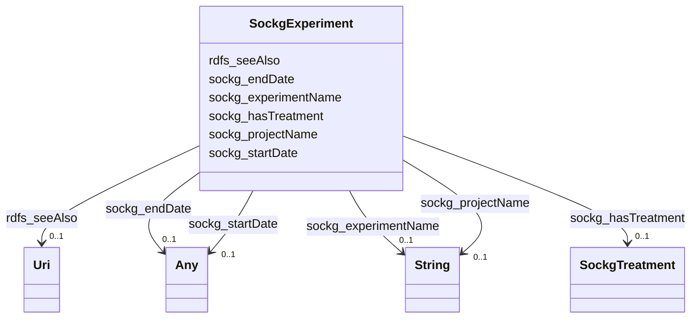

# Class: No class (entity type) name specified (sockg_Experiment)


_An Experiment is a structured investigation carried out to observe and analyze the effects of various agricultural practices and conditions, aimed at improving crop yields or sustainability. It often encompasses a defined timeline and may be part of a larger agricultural project, contributing valuable insights into agronomic science._


This class occurs 55 times.


URI: [sockg:Experiment](https://idir.uta.edu/sockg-ontology/docs/Experiment)





<!-- no inheritance hierarchy -->


## Slots

| Name | Cardinality and Range | Description | Inheritance | Occurrences |
| ---  | --- | --- | --- | --- |
| [sockg_projectName](../slots/sockg_projectName.md) | 0..1 <br/> [xsd:string](http://www.w3.org/2001/XMLSchema#string) | No slot (predicate) description specified <br/>  | direct | 55 |
| [sockg_hasTreatment](../slots/sockg_hasTreatment.md) | 0..1 <br/> [SockgTreatment](../classes/SockgTreatment.md) | No slot (predicate) description specified <br/>  | direct | 741 |
| [sockg_startDate](../slots/sockg_startDate.md) | 0..1 <br/> [xsd:string](http://www.w3.org/2001/XMLSchema#string)&nbsp;or&nbsp;<br />[xsd:date](http://www.w3.org/2001/XMLSchema#date) | No slot (predicate) description specified <br/>  | direct | 55 |
| [sockg_experimentName](../slots/sockg_experimentName.md) | 0..1 <br/> [xsd:string](http://www.w3.org/2001/XMLSchema#string) | No slot (predicate) description specified <br/>  | direct | 55 |
| [sockg_endDate](../slots/sockg_endDate.md) | 0..1 <br/> [xsd:string](http://www.w3.org/2001/XMLSchema#string)&nbsp;or&nbsp;<br />[xsd:date](http://www.w3.org/2001/XMLSchema#date) | No slot (predicate) description specified <br/>  | direct | 55 |
| [rdfs_seeAlso](../slots/rdfs_seeAlso.md) | 0..1 <br/> [xsd:anyURI](http://www.w3.org/2001/XMLSchema#anyURI) | No slot (predicate) description specified <br/>  | direct | 55 |


## Usages

| used by | used in | type | used |
| ---  | --- | --- | --- |
| [SockgExperiment](../classes/SockgExperiment.md) | [sockg_hasTreatment](../slots/sockg_hasTreatment.md) | domain | [SockgExperiment](../classes/SockgExperiment.md) |
| [SockgExperiment](../classes/SockgExperiment.md) | [sockg_experimentName](../slots/sockg_experimentName.md) | domain | [SockgExperiment](../classes/SockgExperiment.md) |
| [SockgOrganization](../classes/SockgOrganization.md) | [sockg_fundsExperiment](../slots/sockg_fundsExperiment.md) | range | [SockgExperiment](../classes/SockgExperiment.md) |


## LinkML Source

<!-- TODO: investigate https://stackoverflow.com/questions/37606292/how-to-create-tabbed-code-blocks-in-mkdocs-or-sphinx -->

### Direct

<details>

```yaml
name: sockg_Experiment
conforms_to: No schema conformance document specified
annotations:
  count:
    tag: count
    value: 55
description: An Experiment is a structured investigation carried out to observe and
  analyze the effects of various agricultural practices and conditions, aimed at improving
  crop yields or sustainability. It often encompasses a defined timeline and may be
  part of a larger agricultural project, contributing valuable insights into agronomic
  science.
title: No class (entity type) name specified
from_schema: soc-kg
rank: 1000
slots:
- sockg_projectName
- sockg_hasTreatment
- sockg_startDate
- sockg_experimentName
- sockg_endDate
- rdfs_seeAlso
slot_usage:
  rdfs_seeAlso:
    name: rdfs_seeAlso
    annotations:
      uri:
        tag: uri
        value: 55
  sockg_endDate:
    name: sockg_endDate
    annotations:
      string:
        tag: string
        value: 55
  sockg_experimentName:
    name: sockg_experimentName
    annotations:
      string:
        tag: string
        value: 55
  sockg_hasTreatment:
    name: sockg_hasTreatment
    annotations:
      sockg_Treatment:
        tag: sockg_Treatment
        value: 741
  sockg_projectName:
    name: sockg_projectName
    annotations:
      string:
        tag: string
        value: 55
  sockg_startDate:
    name: sockg_startDate
    annotations:
      string:
        tag: string
        value: 55
class_uri: sockg:Experiment

```
</details>

### Induced

<details>

```yaml
name: sockg_Experiment
conforms_to: No schema conformance document specified
annotations:
  count:
    tag: count
    value: 55
description: An Experiment is a structured investigation carried out to observe and
  analyze the effects of various agricultural practices and conditions, aimed at improving
  crop yields or sustainability. It often encompasses a defined timeline and may be
  part of a larger agricultural project, contributing valuable insights into agronomic
  science.
title: No class (entity type) name specified
from_schema: soc-kg
rank: 1000
slot_usage:
  rdfs_seeAlso:
    name: rdfs_seeAlso
    annotations:
      uri:
        tag: uri
        value: 55
  sockg_endDate:
    name: sockg_endDate
    annotations:
      string:
        tag: string
        value: 55
  sockg_experimentName:
    name: sockg_experimentName
    annotations:
      string:
        tag: string
        value: 55
  sockg_hasTreatment:
    name: sockg_hasTreatment
    annotations:
      sockg_Treatment:
        tag: sockg_Treatment
        value: 741
  sockg_projectName:
    name: sockg_projectName
    annotations:
      string:
        tag: string
        value: 55
  sockg_startDate:
    name: sockg_startDate
    annotations:
      string:
        tag: string
        value: 55
attributes:
  sockg_projectName:
    name: sockg_projectName
    annotations:
      string:
        tag: string
        value: 55
    description: No slot (predicate) description specified
    title: No slot (predicate) name specified
    examples:
    - object:
        example_object: GRACEnet
        example_object_type: string
        example_predicate: sockg:projectName
        example_subject: sockg:individuals/51906
        example_subject_type: sockg_Experiment
    - object:
        example_object: GRACEnet
        example_object_type: string
        example_predicate: sockg:projectName
        example_subject: sockg:individuals/227438
        example_subject_type: sockg_Project
    from_schema: soc-kg
    see_also:
    - https://lod.nal.usda.gov/nalt/61097
    rank: 1000
    slot_uri: sockg:projectName
    alias: sockg_projectName
    owner: sockg_Experiment
    domain_of:
    - sockg_Experiment
    - sockg_Project
    union_of:
    - '{''domain'': ''sockg_Experiment''}'
    - '{''domain'': ''sockg_Project''}'
    range: string
  sockg_hasTreatment:
    name: sockg_hasTreatment
    annotations:
      sockg_Treatment:
        tag: sockg_Treatment
        value: 741
    description: No slot (predicate) description specified
    title: No slot (predicate) name specified
    examples:
    - object:
        example_object: sockg:individuals/363836
        example_object_type: sockg_Treatment
        example_predicate: sockg:hasTreatment
        example_subject: sockg:individuals/51906
        example_subject_type: sockg_Experiment
    from_schema: soc-kg
    rank: 1000
    domain: sockg_Experiment
    slot_uri: sockg:hasTreatment
    alias: sockg_hasTreatment
    owner: sockg_Experiment
    domain_of:
    - sockg_Experiment
    range: sockg_Treatment
  sockg_startDate:
    name: sockg_startDate
    annotations:
      string:
        tag: string
        value: 55
    description: No slot (predicate) description specified
    title: No slot (predicate) name specified
    examples:
    - object:
        example_object: '2012-06-05'
        example_object_type: string
        example_predicate: sockg:startDate
        example_subject: sockg:individuals/0
        example_subject_type: sockg_Amendment
    - object:
        example_object: '2006-05-08'
        example_object_type: string
        example_predicate: sockg:startDate
        example_subject: sockg:individuals/170955
        example_subject_type: sockg_GrazingManagementEvent
    - object:
        example_object: '1987-04-30'
        example_object_type: string
        example_predicate: sockg:startDate
        example_subject: sockg:individuals/336419
        example_subject_type: sockg_Tillage
    - object:
        example_object: '2007-04-01'
        example_object_type: string
        example_predicate: sockg:startDate
        example_subject: sockg:individuals/51906
        example_subject_type: sockg_Experiment
    - object:
        example_object: '2009-01-01'
        example_object_type: string
        example_predicate: sockg:startDate
        example_subject: sockg:individuals/51937
        example_subject_type: sockg_ExperimentalUnit
    - object:
        example_object: '2004-11-04'
        example_object_type: string
        example_predicate: sockg:startDate
        example_subject: sockg:individuals/203988
        example_subject_type: sockg_PlantingEvent
    from_schema: soc-kg
    see_also:
    - https://lod.nal.usda.gov/nalt/9183
    rank: 1000
    slot_uri: sockg:startDate
    alias: sockg_startDate
    owner: sockg_Experiment
    domain_of:
    - sockg_Amendment
    - sockg_Experiment
    - sockg_ExperimentalUnit
    - sockg_GrazingManagementEvent
    - sockg_PlantingEvent
    - sockg_Tillage
    union_of:
    - '{''domain'': ''sockg_WeatherStation''}'
    - '{''domain'': ''sockg_GrazingManagementEvent''}'
    - '{''domain'': ''sockg_ExperimentalUnit''}'
    - '{''domain'': ''sockg_Amendment''}'
    - '{''domain'': ''sockg_Experiment''}'
    range: Any
    any_of:
    - range: string
    - range: date
  sockg_experimentName:
    name: sockg_experimentName
    annotations:
      string:
        tag: string
        value: 55
    description: No slot (predicate) description specified
    title: No slot (predicate) name specified
    examples:
    - object:
        example_object: GRACEnet
        example_object_type: string
        example_predicate: sockg:experimentName
        example_subject: sockg:individuals/51906
        example_subject_type: sockg_Experiment
    from_schema: soc-kg
    rank: 1000
    domain: sockg_Experiment
    slot_uri: sockg:experimentName
    alias: sockg_experimentName
    owner: sockg_Experiment
    domain_of:
    - sockg_Experiment
    range: string
  sockg_endDate:
    name: sockg_endDate
    annotations:
      string:
        tag: string
        value: 55
    description: No slot (predicate) description specified
    title: No slot (predicate) name specified
    examples:
    - object:
        example_object: '2006-05-12'
        example_object_type: string
        example_predicate: sockg:endDate
        example_subject: sockg:individuals/170955
        example_subject_type: sockg_GrazingManagementEvent
    - object:
        example_object: '2016-11-01'
        example_object_type: string
        example_predicate: sockg:endDate
        example_subject: sockg:individuals/51906
        example_subject_type: sockg_Experiment
    - object:
        example_object: '2011-12-31'
        example_object_type: string
        example_predicate: sockg:endDate
        example_subject: sockg:individuals/51937
        example_subject_type: sockg_ExperimentalUnit
    from_schema: soc-kg
    see_also:
    - https://lod.nal.usda.gov/nalt/9183
    rank: 1000
    slot_uri: sockg:endDate
    alias: sockg_endDate
    owner: sockg_Experiment
    domain_of:
    - sockg_Experiment
    - sockg_ExperimentalUnit
    - sockg_GrazingManagementEvent
    union_of:
    - '{''domain'': ''sockg_Amendment''}'
    - '{''domain'': ''sockg_Experiment''}'
    - '{''domain'': ''sockg_GrazingManagementEvent''}'
    - '{''domain'': ''sockg_ExperimentalUnit''}'
    range: Any
    any_of:
    - range: string
    - range: date
  rdfs_seeAlso:
    name: rdfs_seeAlso
    annotations:
      uri:
        tag: uri
        value: 55
    description: No slot (predicate) description specified
    examples:
    - object:
        example_object: https://lod.nal.usda.gov/nalt/4605
        example_object_type: uri
        example_predicate: rdfs:seeAlso
        example_subject: sockg:individuals/0
        example_subject_type: sockg_Amendment
    - object:
        example_object: https://lod.nal.usda.gov/nalt/5859
        example_object_type: uri
        example_predicate: rdfs:seeAlso
        example_subject: sockg:individuals/100000
        example_subject_type: sockg_GasSample
    - object:
        example_object: https://lod.nal.usda.gov/nalt/281219
        example_object_type: uri
        example_predicate: rdfs:seeAlso
        example_subject: sockg:individuals/163960
        example_subject_type: sockg_Grazing
    - object:
        example_object: https://lod.nal.usda.gov/nalt/4377260
        example_object_type: uri
        example_predicate: rdfs:seeAlso
        example_subject: sockg:individuals/170955
        example_subject_type: sockg_GrazingManagementEvent
    - object:
        example_object: https://lod.nal.usda.gov/nalt/131626
        example_object_type: uri
        example_predicate: rdfs:seeAlso
        example_subject: sockg:individuals/172906
        example_subject_type: sockg_Harvest
    - object:
        example_object: https://lod.nal.usda.gov/nalt/281219
        example_object_type: uri
        example_predicate: rdfs:seeAlso
        example_subject: sockg:individuals/191262
        example_subject_type: sockg_HarvestFraction
    - object:
        example_object: https://lod.nal.usda.gov/nalt/13189
        example_object_type: uri
        example_predicate: rdfs:seeAlso
        example_subject: sockg:individuals/203523
        example_subject_type: sockg_Organization
    - object:
        example_object: https://lod.nal.usda.gov/nalt/3927
        example_object_type: uri
        example_predicate: rdfs:seeAlso
        example_subject: sockg:individuals/203632
        example_subject_type: sockg_Pesticide
    - object:
        example_object: https://lod.nal.usda.gov/nalt/849
        example_object_type: uri
        example_predicate: rdfs:seeAlso
        example_subject: sockg:individuals/227674
        example_subject_type: sockg_ResidueManagementEvent
    - object:
        example_object: https://lod.nal.usda.gov/nalt/30158
        example_object_type: uri
        example_predicate: rdfs:seeAlso
        example_subject: sockg:individuals/230982
        example_subject_type: sockg_Rotation
    - object:
        example_object: https://lod.nal.usda.gov/nalt/302328
        example_object_type: uri
        example_predicate: rdfs:seeAlso
        example_subject: sockg:individuals/231056
        example_subject_type: sockg_Site
    - object:
        example_object: https://lod.nal.usda.gov/nalt/2726
        example_object_type: uri
        example_predicate: rdfs:seeAlso
        example_subject: sockg:individuals/235229
        example_subject_type: sockg_SoilBiologicalSample
    - object:
        example_object: https://lod.nal.usda.gov/nalt/7974
        example_object_type: uri
        example_predicate: rdfs:seeAlso
        example_subject: sockg:individuals/253451
        example_subject_type: sockg_SoilChemicalSample
    - object:
        example_object: https://lod.nal.usda.gov/nalt/302328
        example_object_type: uri
        example_predicate: rdfs:seeAlso
        example_subject: sockg:individuals/307284
        example_subject_type: sockg_SoilCover
    - object:
        example_object: https://lod.nal.usda.gov/nalt/5143
        example_object_type: uri
        example_predicate: rdfs:seeAlso
        example_subject: sockg:individuals/308318
        example_subject_type: sockg_SoilPhysicalSample
    - object:
        example_object: https://lod.nal.usda.gov/nalt/5430914
        example_object_type: uri
        example_predicate: rdfs:seeAlso
        example_subject: sockg:individuals/336400
        example_subject_type: sockg_State
    - object:
        example_object: https://lod.nal.usda.gov/nalt/7140
        example_object_type: uri
        example_predicate: rdfs:seeAlso
        example_subject: sockg:individuals/336419
        example_subject_type: sockg_Tillage
    - object:
        example_object: https://lod.nal.usda.gov/nalt/28616
        example_object_type: uri
        example_predicate: rdfs:seeAlso
        example_subject: sockg:individuals/363556
        example_subject_type: sockg_Treatment
    - object:
        example_object: https://lod.nal.usda.gov/nalt/2717
        example_object_type: uri
        example_predicate: rdfs:seeAlso
        example_subject: sockg:individuals/37796
        example_subject_type: sockg_BioMassCarbohydrate
    - object:
        example_object: https://lod.nal.usda.gov/nalt/7140
        example_object_type: uri
        example_predicate: rdfs:seeAlso
        example_subject: sockg:individuals/39163
        example_subject_type: sockg_BioMassEnergy
    - object:
        example_object: https://lod.nal.usda.gov/nalt/281219
        example_object_type: uri
        example_predicate: rdfs:seeAlso
        example_subject: sockg:individuals/39962
        example_subject_type: sockg_BioMassMineral
    - object:
        example_object: https://lod.nal.usda.gov/nalt/2714
        example_object_type: uri
        example_predicate: rdfs:seeAlso
        example_subject: sockg:individuals/439235
        example_subject_type: sockg_WeatherObservation
    - object:
        example_object: https://lod.nal.usda.gov/nalt/7485997
        example_object_type: uri
        example_predicate: rdfs:seeAlso
        example_subject: sockg:individuals/46864
        example_subject_type: sockg_City
    - object:
        example_object: https://lod.nal.usda.gov/nalt/2217129
        example_object_type: uri
        example_predicate: rdfs:seeAlso
        example_subject: sockg:individuals/46904
        example_subject_type: sockg_County
    - object:
        example_object: https://lod.nal.usda.gov/nalt/302328
        example_object_type: uri
        example_predicate: rdfs:seeAlso
        example_subject: sockg:individuals/46937
        example_subject_type: sockg_CropGrowthStage
    - object:
        example_object: https://lod.nal.usda.gov/nalt/976
        example_object_type: uri
        example_predicate: rdfs:seeAlso
        example_subject: sockg:individuals/51906
        example_subject_type: sockg_Experiment
    - object:
        example_object: https://lod.nal.usda.gov/nalt/9183
        example_object_type: uri
        example_predicate: rdfs:seeAlso
        example_subject: sockg:individuals/51937
        example_subject_type: sockg_ExperimentalUnit
    - object:
        example_object: https://lod.nal.usda.gov/nalt/7259
        example_object_type: uri
        example_predicate: rdfs:seeAlso
        example_subject: sockg:individuals/55800
        example_subject_type: sockg_Field
    - object:
        example_object: https://lod.nal.usda.gov/nalt/7140
        example_object_type: uri
        example_predicate: rdfs:seeAlso
        example_subject: sockg:individuals/200732
        example_subject_type: sockg_NutrientEfficiency
    - object:
        example_object: https://lod.nal.usda.gov/nalt/35067
        example_object_type: uri
        example_predicate: rdfs:seeAlso
        example_subject: sockg:individuals/203534
        example_subject_type: sockg_Person
    - object:
        example_object: https://lod.nal.usda.gov/nalt/5630
        example_object_type: uri
        example_predicate: rdfs:seeAlso
        example_subject: sockg:individuals/203988
        example_subject_type: sockg_PlantingEvent
    - object:
        example_object: https://lod.nal.usda.gov/nalt/61097
        example_object_type: uri
        example_predicate: rdfs:seeAlso
        example_subject: sockg:individuals/227438
        example_subject_type: sockg_Project
    - object:
        example_object: https://lod.nal.usda.gov/nalt/305490
        example_object_type: uri
        example_predicate: rdfs:seeAlso
        example_subject: sockg:individuals/227447
        example_subject_type: sockg_Publication
    - object:
        example_object: https://lod.nal.usda.gov/nalt/48678
        example_object_type: uri
        example_predicate: rdfs:seeAlso
        example_subject: sockg:individuals/227609
        example_subject_type: sockg_ResearchUnit
    - object:
        example_object: https://lod.nal.usda.gov/nalt/33020
        example_object_type: uri
        example_predicate: rdfs:seeAlso
        example_subject: sockg:individuals/231116
        example_subject_type: sockg_Soil
    - object:
        example_object: https://lod.nal.usda.gov/nalt/7140
        example_object_type: uri
        example_predicate: rdfs:seeAlso
        example_subject: sockg:individuals/364326
        example_subject_type: sockg_WaterQualityArea
    - object:
        example_object: https://lod.nal.usda.gov/nalt/281219
        example_object_type: uri
        example_predicate: rdfs:seeAlso
        example_subject: sockg:individuals/364993
        example_subject_type: sockg_WaterQualityConc
    - object:
        example_object: https://lod.nal.usda.gov/nalt/7259
        example_object_type: uri
        example_predicate: rdfs:seeAlso
        example_subject: sockg:individuals/513777
        example_subject_type: sockg_WeatherStation
    - object:
        example_object: https://lod.nal.usda.gov/nalt/281219
        example_object_type: uri
        example_predicate: rdfs:seeAlso
        example_subject: sockg:individuals/55858
        example_subject_type: sockg_GasNutrientLoss
    - object:
        example_object: https://lod.nal.usda.gov/nalt/281219
        example_object_type: uri
        example_predicate: rdfs:seeAlso
        example_subject: sockg:individuals/624572
        example_subject_type: sockg_WindErosionArea
    - object:
        example_object: https://lod.nal.usda.gov/nalt/7140
        example_object_type: uri
        example_predicate: rdfs:seeAlso
        example_subject: sockg:individuals/624587
        example_subject_type: sockg_YieldNutrientUptake
    from_schema: soc-kg
    rank: 1000
    slot_uri: rdfs:seeAlso
    alias: rdfs_seeAlso
    owner: sockg_Experiment
    domain_of:
    - sockg_Amendment
    - sockg_BioMassCarbohydrate
    - sockg_BioMassEnergy
    - sockg_BioMassMineral
    - sockg_City
    - sockg_County
    - sockg_CropGrowthStage
    - sockg_Experiment
    - sockg_ExperimentalUnit
    - sockg_Field
    - sockg_GasNutrientLoss
    - sockg_GasSample
    - sockg_Grazing
    - sockg_GrazingManagementEvent
    - sockg_Harvest
    - sockg_HarvestFraction
    - sockg_NutrientEfficiency
    - sockg_Organization
    - sockg_Person
    - sockg_Pesticide
    - sockg_PlantingEvent
    - sockg_Project
    - sockg_Publication
    - sockg_ResearchUnit
    - sockg_ResidueManagementEvent
    - sockg_Rotation
    - sockg_Site
    - sockg_Soil
    - sockg_SoilBiologicalSample
    - sockg_SoilChemicalSample
    - sockg_SoilCover
    - sockg_SoilPhysicalSample
    - sockg_State
    - sockg_Tillage
    - sockg_Treatment
    - sockg_WaterQualityArea
    - sockg_WaterQualityConc
    - sockg_WeatherObservation
    - sockg_WeatherStation
    - sockg_WindErosionArea
    - sockg_YieldNutrientUptake
    range: uri
class_uri: sockg:Experiment

```
</details>