# Class: TODO -- what's a good name for what this class (type) describes? (sockg_ExperimentalUnit)


_No type description provided_


URI: [sockg:ExperimentalUnit](http://www.semanticweb.org/sockg/ontologies/2024/0/soil-carbon-ontology/ExperimentalUnit)

```mermaid
 classDiagram
    class SockgExperimentalUnit
    click SockgExperimentalUnit href "../SockgExperimentalUnit"
      SockgExperimentalUnit : sockg_changeInManagement
        
          
    
    
    SockgExperimentalUnit --> "0..1" Double : sockg_changeInManagement
    click Double href "../Double"

        
      SockgExperimentalUnit : sockg_endDate
        
          
    
    
    SockgExperimentalUnit --> "0..1" Any : sockg_endDate
    click Any href "../Any"

        
      SockgExperimentalUnit : sockg_expUnit_UID
        
          
    
    
    SockgExperimentalUnit --> "0..1" String : sockg_expUnit_UID
    click String href "../String"

        
      SockgExperimentalUnit : sockg_expUnitId
        
          
    
    
    SockgExperimentalUnit --> "0..1" String : sockg_expUnitId
    click String href "../String"

        
      SockgExperimentalUnit : sockg_hasAmendment
        
          
    
    
    SockgExperimentalUnit --> "0..1" SockgAmendment : sockg_hasAmendment
    click SockgAmendment href "../SockgAmendment"

        
      SockgExperimentalUnit : sockg_hasBioMassCarbohydrateData
        
          
    
    
    SockgExperimentalUnit --> "0..1" SockgBioMassCarbohydrate : sockg_hasBioMassCarbohydrateData
    click SockgBioMassCarbohydrate href "../SockgBioMassCarbohydrate"

        
      SockgExperimentalUnit : sockg_hasBioMassEnergyData
        
          
    
    
    SockgExperimentalUnit --> "0..1" SockgBioMassEnergy : sockg_hasBioMassEnergyData
    click SockgBioMassEnergy href "../SockgBioMassEnergy"

        
      SockgExperimentalUnit : sockg_hasBioMassMineralData
        
          
    
    
    SockgExperimentalUnit --> "0..1" SockgBioMassMineral : sockg_hasBioMassMineralData
    click SockgBioMassMineral href "../SockgBioMassMineral"

        
      SockgExperimentalUnit : sockg_hasBioSample
        
          
    
    
    SockgExperimentalUnit --> "0..1" SockgSoilBiologicalSample : sockg_hasBioSample
    click SockgSoilBiologicalSample href "../SockgSoilBiologicalSample"

        
      SockgExperimentalUnit : sockg_hasChemSample
        
          
    
    
    SockgExperimentalUnit --> "0..1" SockgSoilChemicalSample : sockg_hasChemSample
    click SockgSoilChemicalSample href "../SockgSoilChemicalSample"

        
      SockgExperimentalUnit : sockg_hasGasSample
        
          
    
    
    SockgExperimentalUnit --> "0..1" SockgGasSample : sockg_hasGasSample
    click SockgGasSample href "../SockgGasSample"

        
      SockgExperimentalUnit : sockg_hasGrazingData
        
          
    
    
    SockgExperimentalUnit --> "0..1" SockgGrazing : sockg_hasGrazingData
    click SockgGrazing href "../SockgGrazing"

        
      SockgExperimentalUnit : sockg_hasGrazingManagementEvent
        
          
    
    
    SockgExperimentalUnit --> "0..1" SockgGrazingManagementEvent : sockg_hasGrazingManagementEvent
    click SockgGrazingManagementEvent href "../SockgGrazingManagementEvent"

        
      SockgExperimentalUnit : sockg_hasHarvestFractionData
        
          
    
    
    SockgExperimentalUnit --> "0..1" SockgHarvestFraction : sockg_hasHarvestFractionData
    click SockgHarvestFraction href "../SockgHarvestFraction"

        
      SockgExperimentalUnit : sockg_hasPhySample
        
          
    
    
    SockgExperimentalUnit --> "0..1" SockgSoilPhysicalSample : sockg_hasPhySample
    click SockgSoilPhysicalSample href "../SockgSoilPhysicalSample"

        
      SockgExperimentalUnit : sockg_hasResidueManagementEvent
        
          
    
    
    SockgExperimentalUnit --> "0..1" SockgResidueManagementEvent : sockg_hasResidueManagementEvent
    click SockgResidueManagementEvent href "../SockgResidueManagementEvent"

        
      SockgExperimentalUnit : sockg_hasTillage
        
          
    
    
    SockgExperimentalUnit --> "0..1" SockgTillage : sockg_hasTillage
    click SockgTillage href "../SockgTillage"

        
      SockgExperimentalUnit : sockg_isHarvested
        
          
    
    
    SockgExperimentalUnit --> "0..1" SockgHarvest : sockg_isHarvested
    click SockgHarvest href "../SockgHarvest"

        
      SockgExperimentalUnit : sockg_locatedInField
        
          
    
    
    SockgExperimentalUnit --> "0..1" SockgField : sockg_locatedInField
    click SockgField href "../SockgField"

        
      SockgExperimentalUnit : sockg_startDate
        
          
    
    
    SockgExperimentalUnit --> "0..1" Any : sockg_startDate
    click Any href "../Any"

        
      SockgExperimentalUnit : sockg_tracksGrowth
        
          
    
    
    SockgExperimentalUnit --> "0..1" SockgCropGrowthStage : sockg_tracksGrowth
    click SockgCropGrowthStage href "../SockgCropGrowthStage"

        
      
```





<!-- no inheritance hierarchy -->


## Slots

| Name | Cardinality and Range | Description | Inheritance |
| ---  | --- | --- | --- |
| [sockg_hasBioSample](../slots/sockg_hasBioSample.md) | 0..1 <br/> [SockgSoilBiologicalSample](../classes/SockgSoilBiologicalSample.md) | No slot description provided | direct |
| [sockg_hasChemSample](../slots/sockg_hasChemSample.md) | 0..1 <br/> [SockgSoilChemicalSample](../classes/SockgSoilChemicalSample.md) | No slot description provided | direct |
| [sockg_hasPhySample](../slots/sockg_hasPhySample.md) | 0..1 <br/> [SockgSoilPhysicalSample](../classes/SockgSoilPhysicalSample.md) | No slot description provided | direct |
| [sockg_hasHarvestFractionData](../slots/sockg_hasHarvestFractionData.md) | 0..1 <br/> [SockgHarvestFraction](../classes/SockgHarvestFraction.md) | No slot description provided | direct |
| [sockg_hasBioMassMineralData](../slots/sockg_hasBioMassMineralData.md) | 0..1 <br/> [SockgBioMassMineral](../classes/SockgBioMassMineral.md) | No slot description provided | direct |
| [sockg_hasGasSample](../slots/sockg_hasGasSample.md) | 0..1 <br/> [SockgGasSample](../classes/SockgGasSample.md) | No slot description provided | direct |
| [sockg_hasGrazingData](../slots/sockg_hasGrazingData.md) | 0..1 <br/> [SockgGrazing](../classes/SockgGrazing.md) | No slot description provided | direct |
| [sockg_hasTillage](../slots/sockg_hasTillage.md) | 0..1 <br/> [SockgTillage](../classes/SockgTillage.md) | No slot description provided | direct |
| [sockg_hasAmendment](../slots/sockg_hasAmendment.md) | 0..1 <br/> [SockgAmendment](../classes/SockgAmendment.md) | No slot description provided | direct |
| [sockg_tracksGrowth](../slots/sockg_tracksGrowth.md) | 0..1 <br/> [SockgCropGrowthStage](../classes/SockgCropGrowthStage.md) | No slot description provided | direct |
| [sockg_hasGrazingManagementEvent](../slots/sockg_hasGrazingManagementEvent.md) | 0..1 <br/> [SockgGrazingManagementEvent](../classes/SockgGrazingManagementEvent.md) | No slot description provided | direct |
| [sockg_isHarvested](../slots/sockg_isHarvested.md) | 0..1 <br/> [SockgHarvest](../classes/SockgHarvest.md) | No slot description provided | direct |
| [sockg_locatedInField](../slots/sockg_locatedInField.md) | 0..1 <br/> [SockgField](../classes/SockgField.md) | No slot description provided | direct |
| [sockg_hasBioMassEnergyData](../slots/sockg_hasBioMassEnergyData.md) | 0..1 <br/> [SockgBioMassEnergy](../classes/SockgBioMassEnergy.md) | No slot description provided | direct |
| [sockg_hasBioMassCarbohydrateData](../slots/sockg_hasBioMassCarbohydrateData.md) | 0..1 <br/> [SockgBioMassCarbohydrate](../classes/SockgBioMassCarbohydrate.md) | No slot description provided | direct |
| [sockg_hasResidueManagementEvent](../slots/sockg_hasResidueManagementEvent.md) | 0..1 <br/> [SockgResidueManagementEvent](../classes/SockgResidueManagementEvent.md) | No slot description provided | direct |
| [sockg_changeInManagement](../slots/sockg_changeInManagement.md) | 0..1 <br/> [xsd:double](http://www.w3.org/2001/XMLSchema#double) | No slot description provided | direct |
| [sockg_expUnit_UID](../slots/sockg_expUnit_UID.md) | 0..1 <br/> [xsd:string](http://www.w3.org/2001/XMLSchema#string) | No slot description provided | direct |
| [sockg_expUnitId](../slots/sockg_expUnitId.md) | 0..1 <br/> [xsd:string](http://www.w3.org/2001/XMLSchema#string) | No slot description provided | direct |
| [sockg_endDate](../slots/sockg_endDate.md) | 0..1 <br/> [xsd:double](http://www.w3.org/2001/XMLSchema#double)&nbsp;or&nbsp;<br />[xsd:string](http://www.w3.org/2001/XMLSchema#string) | No slot description provided | direct |
| [sockg_startDate](../slots/sockg_startDate.md) | 0..1 <br/> [xsd:string](http://www.w3.org/2001/XMLSchema#string)&nbsp;or&nbsp;<br />[xsd:double](http://www.w3.org/2001/XMLSchema#double) | No slot description provided | direct |


## Usages

| used by | used in | type | used |
| ---  | --- | --- | --- |
| [SockgGasNutrientLoss](../classes/SockgGasNutrientLoss.md) | [sockg_hasGasNutrientData](../slots/sockg_hasGasNutrientData.md) | range | [SockgExperimentalUnit](../classes/SockgExperimentalUnit.md) |
| [SockgPlantingEvent](../classes/SockgPlantingEvent.md) | [sockg_plantingAt](../slots/sockg_plantingAt.md) | range | [SockgExperimentalUnit](../classes/SockgExperimentalUnit.md) |
| [SockgWaterQualityArea](../classes/SockgWaterQualityArea.md) | [sockg_hasWaterQualityAreaData](../slots/sockg_hasWaterQualityAreaData.md) | range | [SockgExperimentalUnit](../classes/SockgExperimentalUnit.md) |
| [SockgWaterQualityConc](../classes/SockgWaterQualityConc.md) | [sockg_hasWaterQualityConcData](../slots/sockg_hasWaterQualityConcData.md) | range | [SockgExperimentalUnit](../classes/SockgExperimentalUnit.md) |
| [SockgWindErosionArea](../classes/SockgWindErosionArea.md) | [sockg_hasWindErosionData](../slots/sockg_hasWindErosionData.md) | range | [SockgExperimentalUnit](../classes/SockgExperimentalUnit.md) |
| [SockgYieldNutrientUptake](../classes/SockgYieldNutrientUptake.md) | [sockg_hasYieldNutrUptakeData](../slots/sockg_hasYieldNutrUptakeData.md) | range | [SockgExperimentalUnit](../classes/SockgExperimentalUnit.md) |


## Examples

| Value |
| --- |
| neo4j://graph.individuals#53969 |

## TODOs

* TODO -- Todos for this class go here
* or you can delete the todos
* if you think the class is perfect.

## Identifier and Mapping Information


### Schema Source


* from schema: soc-kg/main


## Mappings

| Mapping Type | Mapped Value |
| ---  | ---  |
| self | sockg:ExperimentalUnit |
| native | soc-kg/main/:SockgExperimentalUnit |


## LinkML Source

<!-- TODO: investigate https://stackoverflow.com/questions/37606292/how-to-create-tabbed-code-blocks-in-mkdocs-or-sphinx -->

### Direct

<details>
```yaml
name: sockg_ExperimentalUnit
description: No type description provided
title: TODO -- what's a good name for what this class (type) describes?
todos:
- TODO -- Todos for this class go here
- or you can delete the todos
- if you think the class is perfect.
notes:
- There are 3809 instances of this class.
examples:
- value: neo4j://graph.individuals#53969
from_schema: soc-kg/main
rank: 1000
slots:
- sockg_hasBioSample
- sockg_hasChemSample
- sockg_hasPhySample
- sockg_hasHarvestFractionData
- sockg_hasBioMassMineralData
- sockg_hasGasSample
- sockg_hasGrazingData
- sockg_hasTillage
- sockg_hasAmendment
- sockg_tracksGrowth
- sockg_hasGrazingManagementEvent
- sockg_isHarvested
- sockg_locatedInField
- sockg_hasBioMassEnergyData
- sockg_hasBioMassCarbohydrateData
- sockg_hasResidueManagementEvent
- sockg_changeInManagement
- sockg_expUnit_UID
- sockg_expUnitId
- sockg_endDate
- sockg_startDate
class_uri: sockg:ExperimentalUnit

```
</details>

### Induced

<details>
```yaml
name: sockg_ExperimentalUnit
description: No type description provided
title: TODO -- what's a good name for what this class (type) describes?
todos:
- TODO -- Todos for this class go here
- or you can delete the todos
- if you think the class is perfect.
notes:
- There are 3809 instances of this class.
examples:
- value: neo4j://graph.individuals#53969
from_schema: soc-kg/main
rank: 1000
attributes:
  sockg_hasBioSample:
    name: sockg_hasBioSample
    description: No slot description provided
    todos:
    - TODO -- Todos for this slot go here
    - or you can delete the todos
    - if you think the class is perfect.
    comments:
    - 16926 occurrences with subject type sockg:ExperimentalUnit and object type sockg:SoilBiologicalSample.
    examples:
    - value: neo4j://graph.individuals#53017 sockg:hasBioSample neo4j://graph.individuals#243735
    from_schema: soc-kg/main
    rank: 1000
    slot_uri: sockg:hasBioSample
    alias: sockg_hasBioSample
    owner: sockg_ExperimentalUnit
    domain_of:
    - sockg_ExperimentalUnit
    range: sockg_SoilBiologicalSample
  sockg_hasChemSample:
    name: sockg_hasChemSample
    description: No slot description provided
    todos:
    - TODO -- Todos for this slot go here
    - or you can delete the todos
    - if you think the class is perfect.
    comments:
    - 52537 occurrences with subject type sockg:ExperimentalUnit and object type sockg:SoilChemicalSample.
    examples:
    - value: neo4j://graph.individuals#53001 sockg:hasChemSample neo4j://graph.individuals#278161
    from_schema: soc-kg/main
    rank: 1000
    slot_uri: sockg:hasChemSample
    alias: sockg_hasChemSample
    owner: sockg_ExperimentalUnit
    domain_of:
    - sockg_ExperimentalUnit
    range: sockg_SoilChemicalSample
  sockg_hasPhySample:
    name: sockg_hasPhySample
    description: No slot description provided
    todos:
    - TODO -- Todos for this slot go here
    - or you can delete the todos
    - if you think the class is perfect.
    comments:
    - 26786 occurrences with subject type sockg:ExperimentalUnit and object type sockg:SoilPhysicalSample.
    examples:
    - value: neo4j://graph.individuals#53109 sockg:hasPhySample neo4j://graph.individuals#310589
    from_schema: soc-kg/main
    rank: 1000
    slot_uri: sockg:hasPhySample
    alias: sockg_hasPhySample
    owner: sockg_ExperimentalUnit
    domain_of:
    - sockg_ExperimentalUnit
    range: sockg_SoilPhysicalSample
  sockg_hasHarvestFractionData:
    name: sockg_hasHarvestFractionData
    description: No slot description provided
    todos:
    - TODO -- Todos for this slot go here
    - or you can delete the todos
    - if you think the class is perfect.
    comments:
    - 9110 occurrences with subject type sockg:ExperimentalUnit and object type sockg:HarvestFraction.
    examples:
    - value: neo4j://graph.individuals#54138 sockg:hasHarvestFractionData neo4j://graph.individuals#194584
    from_schema: soc-kg/main
    rank: 1000
    slot_uri: sockg:hasHarvestFractionData
    alias: sockg_hasHarvestFractionData
    owner: sockg_ExperimentalUnit
    domain_of:
    - sockg_ExperimentalUnit
    range: sockg_HarvestFraction
  sockg_hasBioMassMineralData:
    name: sockg_hasBioMassMineralData
    description: No slot description provided
    todos:
    - TODO -- Todos for this slot go here
    - or you can delete the todos
    - if you think the class is perfect.
    comments:
    - 6723 occurrences with subject type sockg:ExperimentalUnit and object type sockg:BioMassMineral.
    examples:
    - value: neo4j://graph.individuals#54248 sockg:hasBioMassMineralData neo4j://graph.individuals#41240
    from_schema: soc-kg/main
    rank: 1000
    slot_uri: sockg:hasBioMassMineralData
    alias: sockg_hasBioMassMineralData
    owner: sockg_ExperimentalUnit
    domain_of:
    - sockg_ExperimentalUnit
    range: sockg_BioMassMineral
  sockg_hasGasSample:
    name: sockg_hasGasSample
    description: No slot description provided
    todos:
    - TODO -- Todos for this slot go here
    - or you can delete the todos
    - if you think the class is perfect.
    comments:
    - 106447 occurrences with subject type sockg:ExperimentalUnit and object type
      sockg:GasSample.
    examples:
    - value: neo4j://graph.individuals#52490 sockg:hasGasSample neo4j://graph.individuals#101790
    from_schema: soc-kg/main
    rank: 1000
    slot_uri: sockg:hasGasSample
    alias: sockg_hasGasSample
    owner: sockg_ExperimentalUnit
    domain_of:
    - sockg_ExperimentalUnit
    range: sockg_GasSample
  sockg_hasGrazingData:
    name: sockg_hasGrazingData
    description: No slot description provided
    todos:
    - TODO -- Todos for this slot go here
    - or you can delete the todos
    - if you think the class is perfect.
    comments:
    - 6995 occurrences with subject type sockg:ExperimentalUnit and object type sockg:Grazing.
    examples:
    - value: neo4j://graph.individuals#52278 sockg:hasGrazingData neo4j://graph.individuals#168912
    from_schema: soc-kg/main
    rank: 1000
    slot_uri: sockg:hasGrazingData
    alias: sockg_hasGrazingData
    owner: sockg_ExperimentalUnit
    domain_of:
    - sockg_ExperimentalUnit
    range: sockg_Grazing
  sockg_hasTillage:
    name: sockg_hasTillage
    description: No slot description provided
    todos:
    - TODO -- Todos for this slot go here
    - or you can delete the todos
    - if you think the class is perfect.
    comments:
    - 27137 occurrences with subject type sockg:ExperimentalUnit and object type sockg:Tillage.
    examples:
    - value: neo4j://graph.individuals#52027 sockg:hasTillage neo4j://graph.individuals#332758
    from_schema: soc-kg/main
    rank: 1000
    slot_uri: sockg:hasTillage
    alias: sockg_hasTillage
    owner: sockg_ExperimentalUnit
    domain_of:
    - sockg_ExperimentalUnit
    range: sockg_Tillage
  sockg_hasAmendment:
    name: sockg_hasAmendment
    description: No slot description provided
    todos:
    - TODO -- Todos for this slot go here
    - or you can delete the todos
    - if you think the class is perfect.
    comments:
    - 37796 occurrences with subject type sockg:ExperimentalUnit and object type sockg:Amendment.
    examples:
    - value: neo4j://graph.individuals#52089 sockg:hasAmendment neo4j://graph.individuals#13128
    from_schema: soc-kg/main
    rank: 1000
    slot_uri: sockg:hasAmendment
    alias: sockg_hasAmendment
    owner: sockg_ExperimentalUnit
    domain_of:
    - sockg_ExperimentalUnit
    range: sockg_Amendment
  sockg_tracksGrowth:
    name: sockg_tracksGrowth
    description: No slot description provided
    todos:
    - TODO -- Todos for this slot go here
    - or you can delete the todos
    - if you think the class is perfect.
    comments:
    - 4896 occurrences with subject type sockg:ExperimentalUnit and object type sockg:CropGrowthStage.
    examples:
    - value: neo4j://graph.individuals#52319 sockg:tracksGrowth neo4j://graph.individuals#46787
    from_schema: soc-kg/main
    rank: 1000
    slot_uri: sockg:tracksGrowth
    alias: sockg_tracksGrowth
    owner: sockg_ExperimentalUnit
    domain_of:
    - sockg_ExperimentalUnit
    range: sockg_CropGrowthStage
  sockg_hasGrazingManagementEvent:
    name: sockg_hasGrazingManagementEvent
    description: No slot description provided
    todos:
    - TODO -- Todos for this slot go here
    - or you can delete the todos
    - if you think the class is perfect.
    comments:
    - 1951 occurrences with subject type sockg:ExperimentalUnit and object type sockg:GrazingManagementEvent.
    examples:
    - value: neo4j://graph.individuals#52278 sockg:hasGrazingManagementEvent neo4j://graph.individuals#171983
    from_schema: soc-kg/main
    rank: 1000
    slot_uri: sockg:hasGrazingManagementEvent
    alias: sockg_hasGrazingManagementEvent
    owner: sockg_ExperimentalUnit
    domain_of:
    - sockg_ExperimentalUnit
    range: sockg_GrazingManagementEvent
  sockg_isHarvested:
    name: sockg_isHarvested
    description: No slot description provided
    todos:
    - TODO -- Todos for this slot go here
    - or you can delete the todos
    - if you think the class is perfect.
    comments:
    - 18356 occurrences with subject type sockg:ExperimentalUnit and object type sockg:Harvest.
    examples:
    - value: neo4j://graph.individuals#55477 sockg:isHarvested neo4j://graph.individuals#188250
    from_schema: soc-kg/main
    rank: 1000
    slot_uri: sockg:isHarvested
    alias: sockg_isHarvested
    owner: sockg_ExperimentalUnit
    domain_of:
    - sockg_ExperimentalUnit
    range: sockg_Harvest
  sockg_locatedInField:
    name: sockg_locatedInField
    description: No slot description provided
    todos:
    - TODO -- Todos for this slot go here
    - or you can delete the todos
    - if you think the class is perfect.
    comments:
    - 3809 occurrences with subject type sockg:ExperimentalUnit and object type sockg:Field.
    examples:
    - value: neo4j://graph.individuals#52970 sockg:locatedInField neo4j://graph.individuals#55561
    from_schema: soc-kg/main
    rank: 1000
    slot_uri: sockg:locatedInField
    alias: sockg_locatedInField
    owner: sockg_ExperimentalUnit
    domain_of:
    - sockg_ExperimentalUnit
    range: sockg_Field
  sockg_hasBioMassEnergyData:
    name: sockg_hasBioMassEnergyData
    description: No slot description provided
    todos:
    - TODO -- Todos for this slot go here
    - or you can delete the todos
    - if you think the class is perfect.
    comments:
    - 799 occurrences with subject type sockg:ExperimentalUnit and object type sockg:BioMassEnergy.
    examples:
    - value: neo4j://graph.individuals#54245 sockg:hasBioMassEnergyData neo4j://graph.individuals#39330
    from_schema: soc-kg/main
    rank: 1000
    slot_uri: sockg:hasBioMassEnergyData
    alias: sockg_hasBioMassEnergyData
    owner: sockg_ExperimentalUnit
    domain_of:
    - sockg_ExperimentalUnit
    range: sockg_BioMassEnergy
  sockg_hasBioMassCarbohydrateData:
    name: sockg_hasBioMassCarbohydrateData
    description: No slot description provided
    todos:
    - TODO -- Todos for this slot go here
    - or you can delete the todos
    - if you think the class is perfect.
    comments:
    - 1367 occurrences with subject type sockg:ExperimentalUnit and object type sockg:BioMassCarbohydrate.
    examples:
    - value: neo4j://graph.individuals#54405 sockg:hasBioMassCarbohydrateData neo4j://graph.individuals#38067
    from_schema: soc-kg/main
    rank: 1000
    slot_uri: sockg:hasBioMassCarbohydrateData
    alias: sockg_hasBioMassCarbohydrateData
    owner: sockg_ExperimentalUnit
    domain_of:
    - sockg_ExperimentalUnit
    range: sockg_BioMassCarbohydrate
  sockg_hasResidueManagementEvent:
    name: sockg_hasResidueManagementEvent
    description: No slot description provided
    todos:
    - TODO -- Todos for this slot go here
    - or you can delete the todos
    - if you think the class is perfect.
    comments:
    - 3308 occurrences with subject type sockg:ExperimentalUnit and object type sockg:ResidueManagementEvent.
    examples:
    - value: neo4j://graph.individuals#53264 sockg:hasResidueManagementEvent neo4j://graph.individuals#228485
    from_schema: soc-kg/main
    rank: 1000
    slot_uri: sockg:hasResidueManagementEvent
    alias: sockg_hasResidueManagementEvent
    owner: sockg_ExperimentalUnit
    domain_of:
    - sockg_ExperimentalUnit
    range: sockg_ResidueManagementEvent
  sockg_changeInManagement:
    name: sockg_changeInManagement
    description: No slot description provided
    todos:
    - TODO -- Todos for this slot go here
    - or you can delete the todos
    - if you think the class is perfect.
    comments:
    - 3809 occurrences with subject type sockg:ExperimentalUnit and object type xsd:double.
    examples:
    - value: neo4j://graph.individuals#52721 sockg:changeInManagement nan
    from_schema: soc-kg/main
    rank: 1000
    slot_uri: sockg:changeInManagement
    alias: sockg_changeInManagement
    owner: sockg_ExperimentalUnit
    domain_of:
    - sockg_ExperimentalUnit
    range: double
  sockg_expUnit_UID:
    name: sockg_expUnit_UID
    description: No slot description provided
    todos:
    - TODO -- Todos for this slot go here
    - or you can delete the todos
    - if you think the class is perfect.
    comments:
    - 3809 occurrences with subject type sockg:ExperimentalUnit and object type string.
    - 2791 occurrences with subject type sockg:NutrientEfficiency and object type
      string.
    - 748 occurrences with subject type sockg:GasNutrientLoss and object type string.
    - 1479 occurrences with subject type sockg:WaterQualityConc and object type string.
    - 429 occurrences with subject type sockg:YieldNutrientUptake and object type
      string.
    - 15 occurrences with subject type sockg:WindErosionArea and object type string.
    examples:
    - value: neo4j://graph.individuals#52433 sockg:expUnit_UID AgCros_TXLULIB1_26
    - value: neo4j://graph.individuals#201925 sockg:expUnit_UID AgCros_NELITCSE_201
    - value: neo4j://graph.individuals#55653 sockg:expUnit_UID AgCros_WIPDBARN_1
    - value: neo4j://graph.individuals#360941 sockg:expUnit_UID AgCros_IAAMKELL_120
    - value: neo4j://graph.individuals#509548 sockg:expUnit_UID AgCros_MNMOCAM_678
    - value: neo4j://graph.individuals#509309 sockg:expUnit_UID AgCros_TXBSWEWC_COMP3
    from_schema: soc-kg/main
    rank: 1000
    slot_uri: sockg:expUnit_UID
    alias: sockg_expUnit_UID
    owner: sockg_ExperimentalUnit
    domain_of:
    - sockg_ExperimentalUnit
    - sockg_GasNutrientLoss
    - sockg_NutrientEfficiency
    - sockg_WaterQualityConc
    - sockg_WindErosionArea
    - sockg_YieldNutrientUptake
    range: string
  sockg_expUnitId:
    name: sockg_expUnitId
    description: No slot description provided
    todos:
    - TODO -- Todos for this slot go here
    - or you can delete the todos
    - if you think the class is perfect.
    comments:
    - 3809 occurrences with subject type sockg:ExperimentalUnit and object type string.
    - 2791 occurrences with subject type sockg:NutrientEfficiency and object type
      string.
    - 748 occurrences with subject type sockg:GasNutrientLoss and object type string.
    - 1479 occurrences with subject type sockg:WaterQualityConc and object type string.
    - 667 occurrences with subject type sockg:WaterQualityArea and object type string.
    - 429 occurrences with subject type sockg:YieldNutrientUptake and object type
      string.
    - 15 occurrences with subject type sockg:WindErosionArea and object type string.
    examples:
    - value: neo4j://graph.individuals#52840 sockg:expUnitId GAJPCSR1_B2P102F1H1X600Y90
    - value: neo4j://graph.individuals#201638 sockg:expUnitId NELITCSE_509
    - value: neo4j://graph.individuals#55654 sockg:expUnitId WIPDBARN_3
    - value: neo4j://graph.individuals#360565 sockg:expUnitId IAAMKELL__120
    - value: neo4j://graph.individuals#359954 sockg:expUnitId WIPDBARN_1
    - value: neo4j://graph.individuals#509440 sockg:expUnitId ALAURye_410
    - value: neo4j://graph.individuals#509305 sockg:expUnitId TXBSWEWC_COMP5
    from_schema: soc-kg/main
    rank: 1000
    slot_uri: sockg:expUnitId
    alias: sockg_expUnitId
    owner: sockg_ExperimentalUnit
    domain_of:
    - sockg_ExperimentalUnit
    - sockg_GasNutrientLoss
    - sockg_NutrientEfficiency
    - sockg_WaterQualityArea
    - sockg_WaterQualityConc
    - sockg_WindErosionArea
    - sockg_YieldNutrientUptake
    range: string
  sockg_endDate:
    name: sockg_endDate
    description: No slot description provided
    todos:
    - TODO -- Todos for this slot go here
    - or you can delete the todos
    - if you think the class is perfect.
    comments:
    - 37796 occurrences with subject type sockg:Amendment and object type xsd:double.
    - 2026 occurrences with subject type sockg:ExperimentalUnit and object type xsd:double.
    - 1783 occurrences with subject type sockg:ExperimentalUnit and object type string.
    - 1951 occurrences with subject type sockg:GrazingManagementEvent and object type
      string.
    - 55 occurrences with subject type sockg:Experiment and object type string.
    examples:
    - value: neo4j://graph.individuals#11898 sockg:endDate nan
    - value: neo4j://graph.individuals#52943 sockg:endDate nan
    - value: neo4j://graph.individuals#52582 sockg:endDate 2009-11-11
    - value: neo4j://graph.individuals#172114 sockg:endDate 2005-08-08
    - value: neo4j://graph.individuals#51722 sockg:endDate 2011-05-18
    from_schema: soc-kg/main
    rank: 1000
    slot_uri: sockg:endDate
    alias: sockg_endDate
    owner: sockg_ExperimentalUnit
    domain_of:
    - sockg_Amendment
    - sockg_Experiment
    - sockg_ExperimentalUnit
    - sockg_GrazingManagementEvent
    range: Any
    any_of:
    - range: double
    - range: string
  sockg_startDate:
    name: sockg_startDate
    description: No slot description provided
    todos:
    - TODO -- Todos for this slot go here
    - or you can delete the todos
    - if you think the class is perfect.
    comments:
    - 37796 occurrences with subject type sockg:Amendment and object type string.
    - 3178 occurrences with subject type sockg:ExperimentalUnit and object type string.
    - 1951 occurrences with subject type sockg:GrazingManagementEvent and object type
      string.
    - 631 occurrences with subject type sockg:ExperimentalUnit and object type xsd:double.
    - 55 occurrences with subject type sockg:Experiment and object type string.
    examples:
    - value: neo4j://graph.individuals#6073 sockg:startDate 2010-04-23
    - value: neo4j://graph.individuals#52263 sockg:startDate 2004-04-01
    - value: neo4j://graph.individuals#172393 sockg:startDate 1996-08-15
    - value: neo4j://graph.individuals#54995 sockg:startDate nan
    - value: neo4j://graph.individuals#51687 sockg:startDate 2009-01-01
    from_schema: soc-kg/main
    rank: 1000
    slot_uri: sockg:startDate
    alias: sockg_startDate
    owner: sockg_ExperimentalUnit
    domain_of:
    - sockg_Amendment
    - sockg_Experiment
    - sockg_ExperimentalUnit
    - sockg_GrazingManagementEvent
    range: Any
    any_of:
    - range: string
    - range: double
class_uri: sockg:ExperimentalUnit

```
</details>