# Class: No class (entity type) name specified (sockg_ExperimentalUnit)


_An ExperimentalUnit represents a specific segment of agricultural research focused on testing hypotheses and observing agricultural practices over defined periods. Each unit is characterized by unique identifiers and can reflect alterations in management approaches across its lifespan._


This class occurs 3863 times.


URI: [sockg:ExperimentalUnit](https://idir.uta.edu/sockg-ontology/docs/ExperimentalUnit)

```mermaid
 classDiagram
    class SockgExperimentalUnit
    click SockgExperimentalUnit href "../SockgExperimentalUnit"
      SockgExperimentalUnit : rdfs_seeAlso
        
          
    
    
    SockgExperimentalUnit --> "0..1" Uri : rdfs_seeAlso
    click Uri href "../Uri"

        
      SockgExperimentalUnit : sockg_endDate
        
          
    
    
    SockgExperimentalUnit --> "0..1" Any : sockg_endDate
    click Any href "../Any"

        
      SockgExperimentalUnit : sockg_expUnit_UID
        
          
    
    
    SockgExperimentalUnit --> "0..1" String : sockg_expUnit_UID
    click String href "../String"

        
      SockgExperimentalUnit : sockg_expUnitId
        
          
    
    
    SockgExperimentalUnit --> "0..1" String : sockg_expUnitId
    click String href "../String"

        
      SockgExperimentalUnit : sockg_hasAmendment
        
          
    
    
    SockgExperimentalUnit --> "0..1" SockgAmendment : sockg_hasAmendment
    click SockgAmendment href "../SockgAmendment"

        
      SockgExperimentalUnit : sockg_hasBioMassCarbohydrateData
        
          
    
    
    SockgExperimentalUnit --> "0..1" SockgBioMassCarbohydrate : sockg_hasBioMassCarbohydrateData
    click SockgBioMassCarbohydrate href "../SockgBioMassCarbohydrate"

        
      SockgExperimentalUnit : sockg_hasBioMassEnergyData
        
          
    
    
    SockgExperimentalUnit --> "0..1" SockgBioMassEnergy : sockg_hasBioMassEnergyData
    click SockgBioMassEnergy href "../SockgBioMassEnergy"

        
      SockgExperimentalUnit : sockg_hasBioMassMineralData
        
          
    
    
    SockgExperimentalUnit --> "0..1" SockgBioMassMineral : sockg_hasBioMassMineralData
    click SockgBioMassMineral href "../SockgBioMassMineral"

        
      SockgExperimentalUnit : sockg_hasBioSample
        
          
    
    
    SockgExperimentalUnit --> "0..1" SockgSoilBiologicalSample : sockg_hasBioSample
    click SockgSoilBiologicalSample href "../SockgSoilBiologicalSample"

        
      SockgExperimentalUnit : sockg_hasChemSample
        
          
    
    
    SockgExperimentalUnit --> "0..1" SockgSoilChemicalSample : sockg_hasChemSample
    click SockgSoilChemicalSample href "../SockgSoilChemicalSample"

        
      SockgExperimentalUnit : sockg_hasGasSample
        
          
    
    
    SockgExperimentalUnit --> "0..1" SockgGasSample : sockg_hasGasSample
    click SockgGasSample href "../SockgGasSample"

        
      SockgExperimentalUnit : sockg_hasGrazingData
        
          
    
    
    SockgExperimentalUnit --> "0..1" SockgGrazing : sockg_hasGrazingData
    click SockgGrazing href "../SockgGrazing"

        
      SockgExperimentalUnit : sockg_hasGrazingManagementEvent
        
          
    
    
    SockgExperimentalUnit --> "0..1" SockgGrazingManagementEvent : sockg_hasGrazingManagementEvent
    click SockgGrazingManagementEvent href "../SockgGrazingManagementEvent"

        
      SockgExperimentalUnit : sockg_hasHarvestFractionData
        
          
    
    
    SockgExperimentalUnit --> "0..1" SockgHarvestFraction : sockg_hasHarvestFractionData
    click SockgHarvestFraction href "../SockgHarvestFraction"

        
      SockgExperimentalUnit : sockg_hasPhysSample
        
          
    
    
    SockgExperimentalUnit --> "0..1" SockgSoilPhysicalSample : sockg_hasPhysSample
    click SockgSoilPhysicalSample href "../SockgSoilPhysicalSample"

        
      SockgExperimentalUnit : sockg_hasResidueManagementEvent
        
          
    
    
    SockgExperimentalUnit --> "0..1" SockgResidueManagementEvent : sockg_hasResidueManagementEvent
    click SockgResidueManagementEvent href "../SockgResidueManagementEvent"

        
      SockgExperimentalUnit : sockg_hasSoilCover
        
          
    
    
    SockgExperimentalUnit --> "0..1" SockgSoilCover : sockg_hasSoilCover
    click SockgSoilCover href "../SockgSoilCover"

        
      SockgExperimentalUnit : sockg_hasTillage
        
          
    
    
    SockgExperimentalUnit --> "0..1" SockgTillage : sockg_hasTillage
    click SockgTillage href "../SockgTillage"

        
      SockgExperimentalUnit : sockg_isHarvested
        
          
    
    
    SockgExperimentalUnit --> "0..1" SockgHarvest : sockg_isHarvested
    click SockgHarvest href "../SockgHarvest"

        
      SockgExperimentalUnit : sockg_locatedInField
        
          
    
    
    SockgExperimentalUnit --> "0..1" SockgField : sockg_locatedInField
    click SockgField href "../SockgField"

        
      SockgExperimentalUnit : sockg_locatedInSite
        
          
    
    
    SockgExperimentalUnit --> "0..1" SockgSite : sockg_locatedInSite
    click SockgSite href "../SockgSite"

        
      SockgExperimentalUnit : sockg_startDate
        
          
    
    
    SockgExperimentalUnit --> "0..1" Any : sockg_startDate
    click Any href "../Any"

        
      SockgExperimentalUnit : sockg_tracksGrowth
        
          
    
    
    SockgExperimentalUnit --> "0..1" SockgCropGrowthStage : sockg_tracksGrowth
    click SockgCropGrowthStage href "../SockgCropGrowthStage"

        
      
```





<!-- no inheritance hierarchy -->


## Slots

| Name | Cardinality and Range | Description | Inheritance | Occurrences |
| ---  | --- | --- | --- | --- |
| [sockg_locatedInField](../slots/sockg_locatedInField.md) | 0..1 <br/> [SockgField](../classes/SockgField.md) | No slot (predicate) description specified <br/>  | direct | 3809 |
| [sockg_isHarvested](../slots/sockg_isHarvested.md) | 0..1 <br/> [SockgHarvest](../classes/SockgHarvest.md) | No slot (predicate) description specified <br/>  | direct | 18356 |
| [sockg_startDate](../slots/sockg_startDate.md) | 0..1 <br/> [xsd:string](http://www.w3.org/2001/XMLSchema#string)&nbsp;or&nbsp;<br />[xsd:date](http://www.w3.org/2001/XMLSchema#date) | No slot (predicate) description specified <br/>  | direct | 3178 |
| [sockg_hasBioSample](../slots/sockg_hasBioSample.md) | 0..1 <br/> [SockgSoilBiologicalSample](../classes/SockgSoilBiologicalSample.md) | No slot (predicate) description specified <br/>  | direct | 18222 |
| [sockg_hasHarvestFractionData](../slots/sockg_hasHarvestFractionData.md) | 0..1 <br/> [SockgHarvestFraction](../classes/SockgHarvestFraction.md) | No slot (predicate) description specified <br/>  | direct | 9110 |
| [sockg_hasGrazingManagementEvent](../slots/sockg_hasGrazingManagementEvent.md) | 0..1 <br/> [SockgGrazingManagementEvent](../classes/SockgGrazingManagementEvent.md) | No slot (predicate) description specified <br/>  | direct | 1951 |
| [sockg_hasBioMassEnergyData](../slots/sockg_hasBioMassEnergyData.md) | 0..1 <br/> [SockgBioMassEnergy](../classes/SockgBioMassEnergy.md) | No slot (predicate) description specified <br/>  | direct | 799 |
| [sockg_hasPhysSample](../slots/sockg_hasPhysSample.md) | 0..1 <br/> [SockgSoilPhysicalSample](../classes/SockgSoilPhysicalSample.md) | No slot (predicate) description specified <br/>  | direct | 28082 |
| [sockg_expUnit_UID](../slots/sockg_expUnit_UID.md) | 0..1 <br/> [xsd:string](http://www.w3.org/2001/XMLSchema#string) | No slot (predicate) description specified <br/>  | direct | 3863 |
| [sockg_hasGasSample](../slots/sockg_hasGasSample.md) | 0..1 <br/> [SockgGasSample](../classes/SockgGasSample.md) | No slot (predicate) description specified <br/>  | direct | 106447 |
| [sockg_hasGrazingData](../slots/sockg_hasGrazingData.md) | 0..1 <br/> [SockgGrazing](../classes/SockgGrazing.md) | No slot (predicate) description specified <br/>  | direct | 6995 |
| [sockg_locatedInSite](../slots/sockg_locatedInSite.md) | 0..1 <br/> [SockgSite](../classes/SockgSite.md) | No slot (predicate) description specified <br/>  | direct | 3803 |
| [sockg_hasAmendment](../slots/sockg_hasAmendment.md) | 0..1 <br/> [SockgAmendment](../classes/SockgAmendment.md) | No slot (predicate) description specified <br/>  | direct | 37796 |
| [sockg_hasBioMassMineralData](../slots/sockg_hasBioMassMineralData.md) | 0..1 <br/> [SockgBioMassMineral](../classes/SockgBioMassMineral.md) | No slot (predicate) description specified <br/>  | direct | 6723 |
| [sockg_hasResidueManagementEvent](../slots/sockg_hasResidueManagementEvent.md) | 0..1 <br/> [SockgResidueManagementEvent](../classes/SockgResidueManagementEvent.md) | No slot (predicate) description specified <br/>  | direct | 3308 |
| [sockg_hasSoilCover](../slots/sockg_hasSoilCover.md) | 0..1 <br/> [SockgSoilCover](../classes/SockgSoilCover.md) | No slot (predicate) description specified <br/>  | direct | 1034 |
| [sockg_hasBioMassCarbohydrateData](../slots/sockg_hasBioMassCarbohydrateData.md) | 0..1 <br/> [SockgBioMassCarbohydrate](../classes/SockgBioMassCarbohydrate.md) | No slot (predicate) description specified <br/>  | direct | 1367 |
| [sockg_hasChemSample](../slots/sockg_hasChemSample.md) | 0..1 <br/> [SockgSoilChemicalSample](../classes/SockgSoilChemicalSample.md) | No slot (predicate) description specified <br/>  | direct | 53833 |
| [sockg_hasTillage](../slots/sockg_hasTillage.md) | 0..1 <br/> [SockgTillage](../classes/SockgTillage.md) | No slot (predicate) description specified <br/>  | direct | 27137 |
| [sockg_endDate](../slots/sockg_endDate.md) | 0..1 <br/> [xsd:string](http://www.w3.org/2001/XMLSchema#string)&nbsp;or&nbsp;<br />[xsd:date](http://www.w3.org/2001/XMLSchema#date) | No slot (predicate) description specified <br/>  | direct | 1945 |
| [sockg_expUnitId](../slots/sockg_expUnitId.md) | 0..1 <br/> [xsd:string](http://www.w3.org/2001/XMLSchema#string) | No slot (predicate) description specified <br/>  | direct | 3863 |
| [sockg_tracksGrowth](../slots/sockg_tracksGrowth.md) | 0..1 <br/> [SockgCropGrowthStage](../classes/SockgCropGrowthStage.md) | No slot (predicate) description specified <br/>  | direct | 4896 |
| [rdfs_seeAlso](../slots/rdfs_seeAlso.md) | 0..1 <br/> [xsd:anyURI](http://www.w3.org/2001/XMLSchema#anyURI) | No slot (predicate) description specified <br/>  | direct | 3863 |


## Usages

| used by | used in | type | used |
| ---  | --- | --- | --- |
| [SockgExperimentalUnit](../classes/SockgExperimentalUnit.md) | [sockg_locatedInField](../slots/sockg_locatedInField.md) | domain | [SockgExperimentalUnit](../classes/SockgExperimentalUnit.md) |
| [SockgExperimentalUnit](../classes/SockgExperimentalUnit.md) | [sockg_isHarvested](../slots/sockg_isHarvested.md) | domain | [SockgExperimentalUnit](../classes/SockgExperimentalUnit.md) |
| [SockgExperimentalUnit](../classes/SockgExperimentalUnit.md) | [sockg_hasBioSample](../slots/sockg_hasBioSample.md) | domain | [SockgExperimentalUnit](../classes/SockgExperimentalUnit.md) |
| [SockgExperimentalUnit](../classes/SockgExperimentalUnit.md) | [sockg_hasHarvestFractionData](../slots/sockg_hasHarvestFractionData.md) | domain | [SockgExperimentalUnit](../classes/SockgExperimentalUnit.md) |
| [SockgExperimentalUnit](../classes/SockgExperimentalUnit.md) | [sockg_hasGrazingManagementEvent](../slots/sockg_hasGrazingManagementEvent.md) | domain | [SockgExperimentalUnit](../classes/SockgExperimentalUnit.md) |
| [SockgExperimentalUnit](../classes/SockgExperimentalUnit.md) | [sockg_hasBioMassEnergyData](../slots/sockg_hasBioMassEnergyData.md) | domain | [SockgExperimentalUnit](../classes/SockgExperimentalUnit.md) |
| [SockgExperimentalUnit](../classes/SockgExperimentalUnit.md) | [sockg_hasPhysSample](../slots/sockg_hasPhysSample.md) | domain | [SockgExperimentalUnit](../classes/SockgExperimentalUnit.md) |
| [SockgExperimentalUnit](../classes/SockgExperimentalUnit.md) | [sockg_hasGasSample](../slots/sockg_hasGasSample.md) | domain | [SockgExperimentalUnit](../classes/SockgExperimentalUnit.md) |
| [SockgExperimentalUnit](../classes/SockgExperimentalUnit.md) | [sockg_hasGrazingData](../slots/sockg_hasGrazingData.md) | domain | [SockgExperimentalUnit](../classes/SockgExperimentalUnit.md) |
| [SockgExperimentalUnit](../classes/SockgExperimentalUnit.md) | [sockg_locatedInSite](../slots/sockg_locatedInSite.md) | domain | [SockgExperimentalUnit](../classes/SockgExperimentalUnit.md) |
| [SockgExperimentalUnit](../classes/SockgExperimentalUnit.md) | [sockg_hasAmendment](../slots/sockg_hasAmendment.md) | domain | [SockgExperimentalUnit](../classes/SockgExperimentalUnit.md) |
| [SockgExperimentalUnit](../classes/SockgExperimentalUnit.md) | [sockg_hasBioMassMineralData](../slots/sockg_hasBioMassMineralData.md) | domain | [SockgExperimentalUnit](../classes/SockgExperimentalUnit.md) |
| [SockgExperimentalUnit](../classes/SockgExperimentalUnit.md) | [sockg_hasResidueManagementEvent](../slots/sockg_hasResidueManagementEvent.md) | domain | [SockgExperimentalUnit](../classes/SockgExperimentalUnit.md) |
| [SockgExperimentalUnit](../classes/SockgExperimentalUnit.md) | [sockg_hasSoilCover](../slots/sockg_hasSoilCover.md) | domain | [SockgExperimentalUnit](../classes/SockgExperimentalUnit.md) |
| [SockgExperimentalUnit](../classes/SockgExperimentalUnit.md) | [sockg_hasBioMassCarbohydrateData](../slots/sockg_hasBioMassCarbohydrateData.md) | domain | [SockgExperimentalUnit](../classes/SockgExperimentalUnit.md) |
| [SockgExperimentalUnit](../classes/SockgExperimentalUnit.md) | [sockg_hasChemSample](../slots/sockg_hasChemSample.md) | domain | [SockgExperimentalUnit](../classes/SockgExperimentalUnit.md) |
| [SockgExperimentalUnit](../classes/SockgExperimentalUnit.md) | [sockg_hasTillage](../slots/sockg_hasTillage.md) | domain | [SockgExperimentalUnit](../classes/SockgExperimentalUnit.md) |
| [SockgExperimentalUnit](../classes/SockgExperimentalUnit.md) | [sockg_tracksGrowth](../slots/sockg_tracksGrowth.md) | domain | [SockgExperimentalUnit](../classes/SockgExperimentalUnit.md) |
| [SockgPlantingEvent](../classes/SockgPlantingEvent.md) | [sockg_plantingAt](../slots/sockg_plantingAt.md) | range | [SockgExperimentalUnit](../classes/SockgExperimentalUnit.md) |


## LinkML Source

<!-- TODO: investigate https://stackoverflow.com/questions/37606292/how-to-create-tabbed-code-blocks-in-mkdocs-or-sphinx -->

### Direct

<details>

```yaml
name: sockg_ExperimentalUnit
conforms_to: No schema conformance document specified
annotations:
  count:
    tag: count
    value: 3863
description: An ExperimentalUnit represents a specific segment of agricultural research
  focused on testing hypotheses and observing agricultural practices over defined
  periods. Each unit is characterized by unique identifiers and can reflect alterations
  in management approaches across its lifespan.
title: No class (entity type) name specified
from_schema: soc-kg
rank: 1000
slots:
- sockg_locatedInField
- sockg_isHarvested
- sockg_startDate
- sockg_hasBioSample
- sockg_hasHarvestFractionData
- sockg_hasGrazingManagementEvent
- sockg_hasBioMassEnergyData
- sockg_hasPhysSample
- sockg_expUnit_UID
- sockg_hasGasSample
- sockg_hasGrazingData
- sockg_locatedInSite
- sockg_hasAmendment
- sockg_hasBioMassMineralData
- sockg_hasResidueManagementEvent
- sockg_hasSoilCover
- sockg_hasBioMassCarbohydrateData
- sockg_hasChemSample
- sockg_hasTillage
- sockg_endDate
- sockg_expUnitId
- sockg_tracksGrowth
- rdfs_seeAlso
slot_usage:
  rdfs_seeAlso:
    name: rdfs_seeAlso
    annotations:
      uri:
        tag: uri
        value: 3863
  sockg_endDate:
    name: sockg_endDate
    annotations:
      string:
        tag: string
        value: 1945
  sockg_expUnitId:
    name: sockg_expUnitId
    annotations:
      string:
        tag: string
        value: 3863
  sockg_expUnit_UID:
    name: sockg_expUnit_UID
    annotations:
      string:
        tag: string
        value: 3863
  sockg_hasAmendment:
    name: sockg_hasAmendment
    annotations:
      sockg_Amendment:
        tag: sockg_Amendment
        value: 37796
  sockg_hasBioMassCarbohydrateData:
    name: sockg_hasBioMassCarbohydrateData
    annotations:
      sockg_BioMassCarbohydrate:
        tag: sockg_BioMassCarbohydrate
        value: 1367
  sockg_hasBioMassEnergyData:
    name: sockg_hasBioMassEnergyData
    annotations:
      sockg_BioMassEnergy:
        tag: sockg_BioMassEnergy
        value: 799
  sockg_hasBioMassMineralData:
    name: sockg_hasBioMassMineralData
    annotations:
      sockg_BioMassMineral:
        tag: sockg_BioMassMineral
        value: 6723
  sockg_hasBioSample:
    name: sockg_hasBioSample
    annotations:
      sockg_SoilBiologicalSample:
        tag: sockg_SoilBiologicalSample
        value: 18222
  sockg_hasChemSample:
    name: sockg_hasChemSample
    annotations:
      sockg_SoilChemicalSample:
        tag: sockg_SoilChemicalSample
        value: 53833
  sockg_hasGasSample:
    name: sockg_hasGasSample
    annotations:
      sockg_GasSample:
        tag: sockg_GasSample
        value: 106447
  sockg_hasGrazingData:
    name: sockg_hasGrazingData
    annotations:
      sockg_Grazing:
        tag: sockg_Grazing
        value: 6995
  sockg_hasGrazingManagementEvent:
    name: sockg_hasGrazingManagementEvent
    annotations:
      sockg_GrazingManagementEvent:
        tag: sockg_GrazingManagementEvent
        value: 1951
  sockg_hasHarvestFractionData:
    name: sockg_hasHarvestFractionData
    annotations:
      sockg_HarvestFraction:
        tag: sockg_HarvestFraction
        value: 9110
  sockg_hasPhysSample:
    name: sockg_hasPhysSample
    annotations:
      sockg_SoilPhysicalSample:
        tag: sockg_SoilPhysicalSample
        value: 28082
  sockg_hasResidueManagementEvent:
    name: sockg_hasResidueManagementEvent
    annotations:
      sockg_ResidueManagementEvent:
        tag: sockg_ResidueManagementEvent
        value: 3308
  sockg_hasSoilCover:
    name: sockg_hasSoilCover
    annotations:
      sockg_SoilCover:
        tag: sockg_SoilCover
        value: 1034
  sockg_hasTillage:
    name: sockg_hasTillage
    annotations:
      sockg_Tillage:
        tag: sockg_Tillage
        value: 27137
  sockg_isHarvested:
    name: sockg_isHarvested
    annotations:
      sockg_Harvest:
        tag: sockg_Harvest
        value: 18356
  sockg_locatedInField:
    name: sockg_locatedInField
    annotations:
      sockg_Field:
        tag: sockg_Field
        value: 3809
  sockg_locatedInSite:
    name: sockg_locatedInSite
    annotations:
      sockg_Site:
        tag: sockg_Site
        value: 3803
  sockg_startDate:
    name: sockg_startDate
    annotations:
      string:
        tag: string
        value: 3178
  sockg_tracksGrowth:
    name: sockg_tracksGrowth
    annotations:
      sockg_CropGrowthStage:
        tag: sockg_CropGrowthStage
        value: 4896
class_uri: sockg:ExperimentalUnit

```
</details>

### Induced

<details>

```yaml
name: sockg_ExperimentalUnit
conforms_to: No schema conformance document specified
annotations:
  count:
    tag: count
    value: 3863
description: An ExperimentalUnit represents a specific segment of agricultural research
  focused on testing hypotheses and observing agricultural practices over defined
  periods. Each unit is characterized by unique identifiers and can reflect alterations
  in management approaches across its lifespan.
title: No class (entity type) name specified
from_schema: soc-kg
rank: 1000
slot_usage:
  rdfs_seeAlso:
    name: rdfs_seeAlso
    annotations:
      uri:
        tag: uri
        value: 3863
  sockg_endDate:
    name: sockg_endDate
    annotations:
      string:
        tag: string
        value: 1945
  sockg_expUnitId:
    name: sockg_expUnitId
    annotations:
      string:
        tag: string
        value: 3863
  sockg_expUnit_UID:
    name: sockg_expUnit_UID
    annotations:
      string:
        tag: string
        value: 3863
  sockg_hasAmendment:
    name: sockg_hasAmendment
    annotations:
      sockg_Amendment:
        tag: sockg_Amendment
        value: 37796
  sockg_hasBioMassCarbohydrateData:
    name: sockg_hasBioMassCarbohydrateData
    annotations:
      sockg_BioMassCarbohydrate:
        tag: sockg_BioMassCarbohydrate
        value: 1367
  sockg_hasBioMassEnergyData:
    name: sockg_hasBioMassEnergyData
    annotations:
      sockg_BioMassEnergy:
        tag: sockg_BioMassEnergy
        value: 799
  sockg_hasBioMassMineralData:
    name: sockg_hasBioMassMineralData
    annotations:
      sockg_BioMassMineral:
        tag: sockg_BioMassMineral
        value: 6723
  sockg_hasBioSample:
    name: sockg_hasBioSample
    annotations:
      sockg_SoilBiologicalSample:
        tag: sockg_SoilBiologicalSample
        value: 18222
  sockg_hasChemSample:
    name: sockg_hasChemSample
    annotations:
      sockg_SoilChemicalSample:
        tag: sockg_SoilChemicalSample
        value: 53833
  sockg_hasGasSample:
    name: sockg_hasGasSample
    annotations:
      sockg_GasSample:
        tag: sockg_GasSample
        value: 106447
  sockg_hasGrazingData:
    name: sockg_hasGrazingData
    annotations:
      sockg_Grazing:
        tag: sockg_Grazing
        value: 6995
  sockg_hasGrazingManagementEvent:
    name: sockg_hasGrazingManagementEvent
    annotations:
      sockg_GrazingManagementEvent:
        tag: sockg_GrazingManagementEvent
        value: 1951
  sockg_hasHarvestFractionData:
    name: sockg_hasHarvestFractionData
    annotations:
      sockg_HarvestFraction:
        tag: sockg_HarvestFraction
        value: 9110
  sockg_hasPhysSample:
    name: sockg_hasPhysSample
    annotations:
      sockg_SoilPhysicalSample:
        tag: sockg_SoilPhysicalSample
        value: 28082
  sockg_hasResidueManagementEvent:
    name: sockg_hasResidueManagementEvent
    annotations:
      sockg_ResidueManagementEvent:
        tag: sockg_ResidueManagementEvent
        value: 3308
  sockg_hasSoilCover:
    name: sockg_hasSoilCover
    annotations:
      sockg_SoilCover:
        tag: sockg_SoilCover
        value: 1034
  sockg_hasTillage:
    name: sockg_hasTillage
    annotations:
      sockg_Tillage:
        tag: sockg_Tillage
        value: 27137
  sockg_isHarvested:
    name: sockg_isHarvested
    annotations:
      sockg_Harvest:
        tag: sockg_Harvest
        value: 18356
  sockg_locatedInField:
    name: sockg_locatedInField
    annotations:
      sockg_Field:
        tag: sockg_Field
        value: 3809
  sockg_locatedInSite:
    name: sockg_locatedInSite
    annotations:
      sockg_Site:
        tag: sockg_Site
        value: 3803
  sockg_startDate:
    name: sockg_startDate
    annotations:
      string:
        tag: string
        value: 3178
  sockg_tracksGrowth:
    name: sockg_tracksGrowth
    annotations:
      sockg_CropGrowthStage:
        tag: sockg_CropGrowthStage
        value: 4896
attributes:
  sockg_locatedInField:
    name: sockg_locatedInField
    annotations:
      sockg_Field:
        tag: sockg_Field
        value: 3809
    description: No slot (predicate) description specified
    title: No slot (predicate) name specified
    examples:
    - object:
        example_object: sockg:individuals/55816
        example_object_type: sockg_Field
        example_predicate: sockg:locatedInField
        example_subject: sockg:individuals/51937
        example_subject_type: sockg_ExperimentalUnit
    from_schema: soc-kg
    rank: 1000
    domain: sockg_ExperimentalUnit
    slot_uri: sockg:locatedInField
    alias: sockg_locatedInField
    owner: sockg_ExperimentalUnit
    domain_of:
    - sockg_ExperimentalUnit
    range: sockg_Field
  sockg_isHarvested:
    name: sockg_isHarvested
    annotations:
      sockg_Harvest:
        tag: sockg_Harvest
        value: 18356
    description: No slot (predicate) description specified
    title: No slot (predicate) name specified
    examples:
    - object:
        example_object: sockg:individuals/174016
        example_object_type: sockg_Harvest
        example_predicate: sockg:isHarvested
        example_subject: sockg:individuals/51937
        example_subject_type: sockg_ExperimentalUnit
    from_schema: soc-kg
    rank: 1000
    domain: sockg_ExperimentalUnit
    slot_uri: sockg:isHarvested
    alias: sockg_isHarvested
    owner: sockg_ExperimentalUnit
    domain_of:
    - sockg_ExperimentalUnit
    range: sockg_Harvest
  sockg_startDate:
    name: sockg_startDate
    annotations:
      string:
        tag: string
        value: 3178
    description: No slot (predicate) description specified
    title: No slot (predicate) name specified
    examples:
    - object:
        example_object: '2012-06-05'
        example_object_type: string
        example_predicate: sockg:startDate
        example_subject: sockg:individuals/0
        example_subject_type: sockg_Amendment
    - object:
        example_object: '2006-05-08'
        example_object_type: string
        example_predicate: sockg:startDate
        example_subject: sockg:individuals/170955
        example_subject_type: sockg_GrazingManagementEvent
    - object:
        example_object: '1987-04-30'
        example_object_type: string
        example_predicate: sockg:startDate
        example_subject: sockg:individuals/336419
        example_subject_type: sockg_Tillage
    - object:
        example_object: '2007-04-01'
        example_object_type: string
        example_predicate: sockg:startDate
        example_subject: sockg:individuals/51906
        example_subject_type: sockg_Experiment
    - object:
        example_object: '2009-01-01'
        example_object_type: string
        example_predicate: sockg:startDate
        example_subject: sockg:individuals/51937
        example_subject_type: sockg_ExperimentalUnit
    - object:
        example_object: '2004-11-04'
        example_object_type: string
        example_predicate: sockg:startDate
        example_subject: sockg:individuals/203988
        example_subject_type: sockg_PlantingEvent
    from_schema: soc-kg
    see_also:
    - https://lod.nal.usda.gov/nalt/9183
    rank: 1000
    slot_uri: sockg:startDate
    alias: sockg_startDate
    owner: sockg_ExperimentalUnit
    domain_of:
    - sockg_Amendment
    - sockg_Experiment
    - sockg_ExperimentalUnit
    - sockg_GrazingManagementEvent
    - sockg_PlantingEvent
    - sockg_Tillage
    union_of:
    - '{''domain'': ''sockg_WeatherStation''}'
    - '{''domain'': ''sockg_GrazingManagementEvent''}'
    - '{''domain'': ''sockg_ExperimentalUnit''}'
    - '{''domain'': ''sockg_Amendment''}'
    - '{''domain'': ''sockg_Experiment''}'
    range: Any
    any_of:
    - range: string
    - range: date
  sockg_hasBioSample:
    name: sockg_hasBioSample
    annotations:
      sockg_SoilBiologicalSample:
        tag: sockg_SoilBiologicalSample
        value: 18222
    description: No slot (predicate) description specified
    title: No slot (predicate) name specified
    examples:
    - object:
        example_object: sockg:individuals/246851
        example_object_type: sockg_SoilBiologicalSample
        example_predicate: sockg:hasBioSample
        example_subject: sockg:individuals/51968
        example_subject_type: sockg_ExperimentalUnit
    from_schema: soc-kg
    rank: 1000
    domain: sockg_ExperimentalUnit
    slot_uri: sockg:hasBioSample
    alias: sockg_hasBioSample
    owner: sockg_ExperimentalUnit
    domain_of:
    - sockg_ExperimentalUnit
    range: sockg_SoilBiologicalSample
  sockg_hasHarvestFractionData:
    name: sockg_hasHarvestFractionData
    annotations:
      sockg_HarvestFraction:
        tag: sockg_HarvestFraction
        value: 9110
    description: No slot (predicate) description specified
    title: No slot (predicate) name specified
    examples:
    - object:
        example_object: sockg:individuals/191288
        example_object_type: sockg_HarvestFraction
        example_predicate: sockg:hasHarvestFractionData
        example_subject: sockg:individuals/51968
        example_subject_type: sockg_ExperimentalUnit
    from_schema: soc-kg
    rank: 1000
    domain: sockg_ExperimentalUnit
    slot_uri: sockg:hasHarvestFractionData
    alias: sockg_hasHarvestFractionData
    owner: sockg_ExperimentalUnit
    domain_of:
    - sockg_ExperimentalUnit
    range: sockg_HarvestFraction
  sockg_hasGrazingManagementEvent:
    name: sockg_hasGrazingManagementEvent
    annotations:
      sockg_GrazingManagementEvent:
        tag: sockg_GrazingManagementEvent
        value: 1951
    description: No slot (predicate) description specified
    title: No slot (predicate) name specified
    examples:
    - object:
        example_object: sockg:individuals/172878
        example_object_type: sockg_GrazingManagementEvent
        example_predicate: sockg:hasGrazingManagementEvent
        example_subject: sockg:individuals/51937
        example_subject_type: sockg_ExperimentalUnit
    from_schema: soc-kg
    rank: 1000
    domain: sockg_ExperimentalUnit
    slot_uri: sockg:hasGrazingManagementEvent
    alias: sockg_hasGrazingManagementEvent
    owner: sockg_ExperimentalUnit
    domain_of:
    - sockg_ExperimentalUnit
    range: sockg_GrazingManagementEvent
  sockg_hasBioMassEnergyData:
    name: sockg_hasBioMassEnergyData
    annotations:
      sockg_BioMassEnergy:
        tag: sockg_BioMassEnergy
        value: 799
    description: No slot (predicate) description specified
    title: No slot (predicate) name specified
    examples:
    - object:
        example_object: sockg:individuals/39169
        example_object_type: sockg_BioMassEnergy
        example_predicate: sockg:hasBioMassEnergyData
        example_subject: sockg:individuals/54440
        example_subject_type: sockg_ExperimentalUnit
    from_schema: soc-kg
    rank: 1000
    domain: sockg_ExperimentalUnit
    slot_uri: sockg:hasBioMassEnergyData
    alias: sockg_hasBioMassEnergyData
    owner: sockg_ExperimentalUnit
    domain_of:
    - sockg_ExperimentalUnit
    range: sockg_BioMassEnergy
  sockg_hasPhysSample:
    name: sockg_hasPhysSample
    annotations:
      sockg_SoilPhysicalSample:
        tag: sockg_SoilPhysicalSample
        value: 28082
    description: No slot (predicate) description specified
    title: No slot (predicate) name specified
    examples:
    - object:
        example_object: sockg:individuals/326976
        example_object_type: sockg_SoilPhysicalSample
        example_predicate: sockg:hasPhysSample
        example_subject: sockg:individuals/51937
        example_subject_type: sockg_ExperimentalUnit
    from_schema: soc-kg
    rank: 1000
    domain: sockg_ExperimentalUnit
    slot_uri: sockg:hasPhysSample
    alias: sockg_hasPhysSample
    owner: sockg_ExperimentalUnit
    domain_of:
    - sockg_ExperimentalUnit
    range: sockg_SoilPhysicalSample
  sockg_expUnit_UID:
    name: sockg_expUnit_UID
    annotations:
      string:
        tag: string
        value: 3863
    description: No slot (predicate) description specified
    title: No slot (predicate) name specified
    examples:
    - object:
        example_object: AgCros_MTSIFERE_GrazW-P_B-F3w2
        example_object_type: string
        example_predicate: sockg:expUnit_UID
        example_subject: sockg:individuals/51937
        example_subject_type: sockg_ExperimentalUnit
    - object:
        example_object: AgCros_MNMOCAL_614
        example_object_type: string
        example_predicate: sockg:expUnit_UID
        example_subject: sockg:individuals/200732
        example_subject_type: sockg_NutrientEfficiency
    - object:
        example_object: AgCros_WIPDBARN_2
        example_object_type: string
        example_predicate: sockg:expUnit_UID
        example_subject: sockg:individuals/364326
        example_subject_type: sockg_WaterQualityArea
    - object:
        example_object: AgCros_IAAMKELL_120
        example_object_type: string
        example_predicate: sockg:expUnit_UID
        example_subject: sockg:individuals/364993
        example_subject_type: sockg_WaterQualityConc
    - object:
        example_object: AgCros_IAAMKELL_116
        example_object_type: string
        example_predicate: sockg:expUnit_UID
        example_subject: sockg:individuals/55858
        example_subject_type: sockg_GasNutrientLoss
    - object:
        example_object: AgCros_TXBSWEWC_COMP2
        example_object_type: string
        example_predicate: sockg:expUnit_UID
        example_subject: sockg:individuals/624572
        example_subject_type: sockg_WindErosionArea
    - object:
        example_object: AgCros_MNSP4R_U-S100B
        example_object_type: string
        example_predicate: sockg:expUnit_UID
        example_subject: sockg:individuals/624587
        example_subject_type: sockg_YieldNutrientUptake
    from_schema: soc-kg
    rank: 1000
    slot_uri: sockg:expUnit_UID
    alias: sockg_expUnit_UID
    owner: sockg_ExperimentalUnit
    domain_of:
    - sockg_ExperimentalUnit
    - sockg_GasNutrientLoss
    - sockg_NutrientEfficiency
    - sockg_WaterQualityArea
    - sockg_WaterQualityConc
    - sockg_WindErosionArea
    - sockg_YieldNutrientUptake
    union_of:
    - '{''domain'': ''sockg_WindErosionArea''}'
    - '{''domain'': ''sockg_NutrientEfficiency''}'
    - '{''domain'': ''sockg_WaterQualityConc''}'
    - '{''domain'': ''sockg_ExperimentalUnit''}'
    - '{''domain'': ''sockg_GasNutrientLoss''}'
    - '{''domain'': ''sockg_YieldNutrientUptake''}'
    range: string
  sockg_hasGasSample:
    name: sockg_hasGasSample
    annotations:
      sockg_GasSample:
        tag: sockg_GasSample
        value: 106447
    description: No slot (predicate) description specified
    title: No slot (predicate) name specified
    examples:
    - object:
        example_object: sockg:individuals/103924
        example_object_type: sockg_GasSample
        example_predicate: sockg:hasGasSample
        example_subject: sockg:individuals/51937
        example_subject_type: sockg_ExperimentalUnit
    from_schema: soc-kg
    rank: 1000
    domain: sockg_ExperimentalUnit
    slot_uri: sockg:hasGasSample
    alias: sockg_hasGasSample
    owner: sockg_ExperimentalUnit
    domain_of:
    - sockg_ExperimentalUnit
    range: sockg_GasSample
  sockg_hasGrazingData:
    name: sockg_hasGrazingData
    annotations:
      sockg_Grazing:
        tag: sockg_Grazing
        value: 6995
    description: No slot (predicate) description specified
    title: No slot (predicate) name specified
    examples:
    - object:
        example_object: sockg:individuals/164936
        example_object_type: sockg_Grazing
        example_predicate: sockg:hasGrazingData
        example_subject: sockg:individuals/52472
        example_subject_type: sockg_ExperimentalUnit
    from_schema: soc-kg
    rank: 1000
    domain: sockg_ExperimentalUnit
    slot_uri: sockg:hasGrazingData
    alias: sockg_hasGrazingData
    owner: sockg_ExperimentalUnit
    domain_of:
    - sockg_ExperimentalUnit
    range: sockg_Grazing
  sockg_locatedInSite:
    name: sockg_locatedInSite
    annotations:
      sockg_Site:
        tag: sockg_Site
        value: 3803
    description: No slot (predicate) description specified
    title: No slot (predicate) name specified
    examples:
    - object:
        example_object: sockg:individuals/231073
        example_object_type: sockg_Site
        example_predicate: sockg:locatedInSite
        example_subject: sockg:individuals/51937
        example_subject_type: sockg_ExperimentalUnit
    from_schema: soc-kg
    rank: 1000
    domain: sockg_ExperimentalUnit
    slot_uri: sockg:locatedInSite
    alias: sockg_locatedInSite
    owner: sockg_ExperimentalUnit
    domain_of:
    - sockg_ExperimentalUnit
    range: sockg_Site
  sockg_hasAmendment:
    name: sockg_hasAmendment
    annotations:
      sockg_Amendment:
        tag: sockg_Amendment
        value: 37796
    description: No slot (predicate) description specified
    title: No slot (predicate) name specified
    examples:
    - object:
        example_object: sockg:individuals/15592
        example_object_type: sockg_Amendment
        example_predicate: sockg:hasAmendment
        example_subject: sockg:individuals/51937
        example_subject_type: sockg_ExperimentalUnit
    from_schema: soc-kg
    rank: 1000
    domain: sockg_ExperimentalUnit
    slot_uri: sockg:hasAmendment
    alias: sockg_hasAmendment
    owner: sockg_ExperimentalUnit
    domain_of:
    - sockg_ExperimentalUnit
    range: sockg_Amendment
  sockg_hasBioMassMineralData:
    name: sockg_hasBioMassMineralData
    annotations:
      sockg_BioMassMineral:
        tag: sockg_BioMassMineral
        value: 6723
    description: No slot (predicate) description specified
    title: No slot (predicate) name specified
    examples:
    - object:
        example_object: sockg:individuals/40481
        example_object_type: sockg_BioMassMineral
        example_predicate: sockg:hasBioMassMineralData
        example_subject: sockg:individuals/51968
        example_subject_type: sockg_ExperimentalUnit
    from_schema: soc-kg
    rank: 1000
    domain: sockg_ExperimentalUnit
    slot_uri: sockg:hasBioMassMineralData
    alias: sockg_hasBioMassMineralData
    owner: sockg_ExperimentalUnit
    domain_of:
    - sockg_ExperimentalUnit
    range: sockg_BioMassMineral
  sockg_hasResidueManagementEvent:
    name: sockg_hasResidueManagementEvent
    annotations:
      sockg_ResidueManagementEvent:
        tag: sockg_ResidueManagementEvent
        value: 3308
    description: No slot (predicate) description specified
    title: No slot (predicate) name specified
    examples:
    - object:
        example_object: sockg:individuals/228634
        example_object_type: sockg_ResidueManagementEvent
        example_predicate: sockg:hasResidueManagementEvent
        example_subject: sockg:individuals/51937
        example_subject_type: sockg_ExperimentalUnit
    from_schema: soc-kg
    rank: 1000
    domain: sockg_ExperimentalUnit
    slot_uri: sockg:hasResidueManagementEvent
    alias: sockg_hasResidueManagementEvent
    owner: sockg_ExperimentalUnit
    domain_of:
    - sockg_ExperimentalUnit
    range: sockg_ResidueManagementEvent
  sockg_hasSoilCover:
    name: sockg_hasSoilCover
    annotations:
      sockg_SoilCover:
        tag: sockg_SoilCover
        value: 1034
    description: No slot (predicate) description specified
    title: No slot (predicate) name specified
    examples:
    - object:
        example_object: sockg:individuals/307774
        example_object_type: sockg_SoilCover
        example_predicate: sockg:hasSoilCover
        example_subject: sockg:individuals/54021
        example_subject_type: sockg_ExperimentalUnit
    from_schema: soc-kg
    rank: 1000
    domain: sockg_ExperimentalUnit
    slot_uri: sockg:hasSoilCover
    alias: sockg_hasSoilCover
    owner: sockg_ExperimentalUnit
    domain_of:
    - sockg_ExperimentalUnit
    range: sockg_SoilCover
  sockg_hasBioMassCarbohydrateData:
    name: sockg_hasBioMassCarbohydrateData
    annotations:
      sockg_BioMassCarbohydrate:
        tag: sockg_BioMassCarbohydrate
        value: 1367
    description: No slot (predicate) description specified
    title: No slot (predicate) name specified
    examples:
    - object:
        example_object: sockg:individuals/37796
        example_object_type: sockg_BioMassCarbohydrate
        example_predicate: sockg:hasBioMassCarbohydrateData
        example_subject: sockg:individuals/54021
        example_subject_type: sockg_ExperimentalUnit
    from_schema: soc-kg
    rank: 1000
    domain: sockg_ExperimentalUnit
    slot_uri: sockg:hasBioMassCarbohydrateData
    alias: sockg_hasBioMassCarbohydrateData
    owner: sockg_ExperimentalUnit
    domain_of:
    - sockg_ExperimentalUnit
    range: sockg_BioMassCarbohydrate
  sockg_hasChemSample:
    name: sockg_hasChemSample
    annotations:
      sockg_SoilChemicalSample:
        tag: sockg_SoilChemicalSample
        value: 53833
    description: No slot (predicate) description specified
    title: No slot (predicate) name specified
    examples:
    - object:
        example_object: sockg:individuals/281187
        example_object_type: sockg_SoilChemicalSample
        example_predicate: sockg:hasChemSample
        example_subject: sockg:individuals/51937
        example_subject_type: sockg_ExperimentalUnit
    from_schema: soc-kg
    rank: 1000
    domain: sockg_ExperimentalUnit
    slot_uri: sockg:hasChemSample
    alias: sockg_hasChemSample
    owner: sockg_ExperimentalUnit
    domain_of:
    - sockg_ExperimentalUnit
    range: sockg_SoilChemicalSample
  sockg_hasTillage:
    name: sockg_hasTillage
    annotations:
      sockg_Tillage:
        tag: sockg_Tillage
        value: 27137
    description: No slot (predicate) description specified
    title: No slot (predicate) name specified
    examples:
    - object:
        example_object: sockg:individuals/347211
        example_object_type: sockg_Tillage
        example_predicate: sockg:hasTillage
        example_subject: sockg:individuals/51968
        example_subject_type: sockg_ExperimentalUnit
    from_schema: soc-kg
    rank: 1000
    domain: sockg_ExperimentalUnit
    slot_uri: sockg:hasTillage
    alias: sockg_hasTillage
    owner: sockg_ExperimentalUnit
    domain_of:
    - sockg_ExperimentalUnit
    range: sockg_Tillage
  sockg_endDate:
    name: sockg_endDate
    annotations:
      string:
        tag: string
        value: 1945
    description: No slot (predicate) description specified
    title: No slot (predicate) name specified
    examples:
    - object:
        example_object: '2006-05-12'
        example_object_type: string
        example_predicate: sockg:endDate
        example_subject: sockg:individuals/170955
        example_subject_type: sockg_GrazingManagementEvent
    - object:
        example_object: '2016-11-01'
        example_object_type: string
        example_predicate: sockg:endDate
        example_subject: sockg:individuals/51906
        example_subject_type: sockg_Experiment
    - object:
        example_object: '2011-12-31'
        example_object_type: string
        example_predicate: sockg:endDate
        example_subject: sockg:individuals/51937
        example_subject_type: sockg_ExperimentalUnit
    from_schema: soc-kg
    see_also:
    - https://lod.nal.usda.gov/nalt/9183
    rank: 1000
    slot_uri: sockg:endDate
    alias: sockg_endDate
    owner: sockg_ExperimentalUnit
    domain_of:
    - sockg_Experiment
    - sockg_ExperimentalUnit
    - sockg_GrazingManagementEvent
    union_of:
    - '{''domain'': ''sockg_Amendment''}'
    - '{''domain'': ''sockg_Experiment''}'
    - '{''domain'': ''sockg_GrazingManagementEvent''}'
    - '{''domain'': ''sockg_ExperimentalUnit''}'
    range: Any
    any_of:
    - range: string
    - range: date
  sockg_expUnitId:
    name: sockg_expUnitId
    annotations:
      string:
        tag: string
        value: 3863
    description: No slot (predicate) description specified
    title: No slot (predicate) name specified
    examples:
    - object:
        example_object: MTSIFERE_GrazW-P/B-F3w2
        example_object_type: string
        example_predicate: sockg:expUnitId
        example_subject: sockg:individuals/51937
        example_subject_type: sockg_ExperimentalUnit
    - object:
        example_object: MNMOCAL_614
        example_object_type: string
        example_predicate: sockg:expUnitId
        example_subject: sockg:individuals/200732
        example_subject_type: sockg_NutrientEfficiency
    - object:
        example_object: MNMOFS_71
        example_object_type: string
        example_predicate: sockg:expUnitId
        example_subject: sockg:individuals/203988
        example_subject_type: sockg_PlantingEvent
    - object:
        example_object: WIPDBARN_2
        example_object_type: string
        example_predicate: sockg:expUnitId
        example_subject: sockg:individuals/364326
        example_subject_type: sockg_WaterQualityArea
    - object:
        example_object: IAAMKELL__120
        example_object_type: string
        example_predicate: sockg:expUnitId
        example_subject: sockg:individuals/364993
        example_subject_type: sockg_WaterQualityConc
    - object:
        example_object: IAAMKELL__116
        example_object_type: string
        example_predicate: sockg:expUnitId
        example_subject: sockg:individuals/55858
        example_subject_type: sockg_GasNutrientLoss
    - object:
        example_object: TXBSWEWC_COMP2
        example_object_type: string
        example_predicate: sockg:expUnitId
        example_subject: sockg:individuals/624572
        example_subject_type: sockg_WindErosionArea
    - object:
        example_object: MNSP4R_U-S100B
        example_object_type: string
        example_predicate: sockg:expUnitId
        example_subject: sockg:individuals/624587
        example_subject_type: sockg_YieldNutrientUptake
    from_schema: soc-kg
    see_also:
    - https://lod.nal.usda.gov/nalt/849
    rank: 1000
    slot_uri: sockg:expUnitId
    alias: sockg_expUnitId
    owner: sockg_ExperimentalUnit
    domain_of:
    - sockg_ExperimentalUnit
    - sockg_GasNutrientLoss
    - sockg_NutrientEfficiency
    - sockg_PlantingEvent
    - sockg_WaterQualityArea
    - sockg_WaterQualityConc
    - sockg_WindErosionArea
    - sockg_YieldNutrientUptake
    union_of:
    - '{''domain'': ''sockg_WaterQualityArea''}'
    - '{''domain'': ''sockg_WindErosionArea''}'
    - '{''domain'': ''sockg_NutrientEfficiency''}'
    - '{''domain'': ''sockg_WaterQualityConc''}'
    - '{''domain'': ''sockg_CropGrowthStage''}'
    - '{''domain'': ''sockg_ExperimentalUnit''}'
    - '{''domain'': ''sockg_Harvest''}'
    - '{''domain'': ''sockg_GasNutrientLoss''}'
    - '{''domain'': ''sockg_Amendment''}'
    - '{''domain'': ''sockg_YieldNutrientUptake''}'
    - '{''domain'': ''sockg_HarvestFraction''}'
    - '{''domain'': ''sockg_ResidueManagementEvent''}'
    - '{''domain'': ''sockg_GasSample''}'
    range: string
  sockg_tracksGrowth:
    name: sockg_tracksGrowth
    annotations:
      sockg_CropGrowthStage:
        tag: sockg_CropGrowthStage
        value: 4896
    description: No slot (predicate) description specified
    title: No slot (predicate) name specified
    examples:
    - object:
        example_object: sockg:individuals/47492
        example_object_type: sockg_CropGrowthStage
        example_predicate: sockg:tracksGrowth
        example_subject: sockg:individuals/52197
        example_subject_type: sockg_ExperimentalUnit
    from_schema: soc-kg
    rank: 1000
    domain: sockg_ExperimentalUnit
    slot_uri: sockg:tracksGrowth
    alias: sockg_tracksGrowth
    owner: sockg_ExperimentalUnit
    domain_of:
    - sockg_ExperimentalUnit
    range: sockg_CropGrowthStage
  rdfs_seeAlso:
    name: rdfs_seeAlso
    annotations:
      uri:
        tag: uri
        value: 3863
    description: No slot (predicate) description specified
    examples:
    - object:
        example_object: https://lod.nal.usda.gov/nalt/4605
        example_object_type: uri
        example_predicate: rdfs:seeAlso
        example_subject: sockg:individuals/0
        example_subject_type: sockg_Amendment
    - object:
        example_object: https://lod.nal.usda.gov/nalt/5859
        example_object_type: uri
        example_predicate: rdfs:seeAlso
        example_subject: sockg:individuals/100000
        example_subject_type: sockg_GasSample
    - object:
        example_object: https://lod.nal.usda.gov/nalt/281219
        example_object_type: uri
        example_predicate: rdfs:seeAlso
        example_subject: sockg:individuals/163960
        example_subject_type: sockg_Grazing
    - object:
        example_object: https://lod.nal.usda.gov/nalt/4377260
        example_object_type: uri
        example_predicate: rdfs:seeAlso
        example_subject: sockg:individuals/170955
        example_subject_type: sockg_GrazingManagementEvent
    - object:
        example_object: https://lod.nal.usda.gov/nalt/131626
        example_object_type: uri
        example_predicate: rdfs:seeAlso
        example_subject: sockg:individuals/172906
        example_subject_type: sockg_Harvest
    - object:
        example_object: https://lod.nal.usda.gov/nalt/281219
        example_object_type: uri
        example_predicate: rdfs:seeAlso
        example_subject: sockg:individuals/191262
        example_subject_type: sockg_HarvestFraction
    - object:
        example_object: https://lod.nal.usda.gov/nalt/13189
        example_object_type: uri
        example_predicate: rdfs:seeAlso
        example_subject: sockg:individuals/203523
        example_subject_type: sockg_Organization
    - object:
        example_object: https://lod.nal.usda.gov/nalt/3927
        example_object_type: uri
        example_predicate: rdfs:seeAlso
        example_subject: sockg:individuals/203632
        example_subject_type: sockg_Pesticide
    - object:
        example_object: https://lod.nal.usda.gov/nalt/849
        example_object_type: uri
        example_predicate: rdfs:seeAlso
        example_subject: sockg:individuals/227674
        example_subject_type: sockg_ResidueManagementEvent
    - object:
        example_object: https://lod.nal.usda.gov/nalt/30158
        example_object_type: uri
        example_predicate: rdfs:seeAlso
        example_subject: sockg:individuals/230982
        example_subject_type: sockg_Rotation
    - object:
        example_object: https://lod.nal.usda.gov/nalt/302328
        example_object_type: uri
        example_predicate: rdfs:seeAlso
        example_subject: sockg:individuals/231056
        example_subject_type: sockg_Site
    - object:
        example_object: https://lod.nal.usda.gov/nalt/2726
        example_object_type: uri
        example_predicate: rdfs:seeAlso
        example_subject: sockg:individuals/235229
        example_subject_type: sockg_SoilBiologicalSample
    - object:
        example_object: https://lod.nal.usda.gov/nalt/7974
        example_object_type: uri
        example_predicate: rdfs:seeAlso
        example_subject: sockg:individuals/253451
        example_subject_type: sockg_SoilChemicalSample
    - object:
        example_object: https://lod.nal.usda.gov/nalt/302328
        example_object_type: uri
        example_predicate: rdfs:seeAlso
        example_subject: sockg:individuals/307284
        example_subject_type: sockg_SoilCover
    - object:
        example_object: https://lod.nal.usda.gov/nalt/5143
        example_object_type: uri
        example_predicate: rdfs:seeAlso
        example_subject: sockg:individuals/308318
        example_subject_type: sockg_SoilPhysicalSample
    - object:
        example_object: https://lod.nal.usda.gov/nalt/5430914
        example_object_type: uri
        example_predicate: rdfs:seeAlso
        example_subject: sockg:individuals/336400
        example_subject_type: sockg_State
    - object:
        example_object: https://lod.nal.usda.gov/nalt/7140
        example_object_type: uri
        example_predicate: rdfs:seeAlso
        example_subject: sockg:individuals/336419
        example_subject_type: sockg_Tillage
    - object:
        example_object: https://lod.nal.usda.gov/nalt/28616
        example_object_type: uri
        example_predicate: rdfs:seeAlso
        example_subject: sockg:individuals/363556
        example_subject_type: sockg_Treatment
    - object:
        example_object: https://lod.nal.usda.gov/nalt/2717
        example_object_type: uri
        example_predicate: rdfs:seeAlso
        example_subject: sockg:individuals/37796
        example_subject_type: sockg_BioMassCarbohydrate
    - object:
        example_object: https://lod.nal.usda.gov/nalt/7140
        example_object_type: uri
        example_predicate: rdfs:seeAlso
        example_subject: sockg:individuals/39163
        example_subject_type: sockg_BioMassEnergy
    - object:
        example_object: https://lod.nal.usda.gov/nalt/281219
        example_object_type: uri
        example_predicate: rdfs:seeAlso
        example_subject: sockg:individuals/39962
        example_subject_type: sockg_BioMassMineral
    - object:
        example_object: https://lod.nal.usda.gov/nalt/2714
        example_object_type: uri
        example_predicate: rdfs:seeAlso
        example_subject: sockg:individuals/439235
        example_subject_type: sockg_WeatherObservation
    - object:
        example_object: https://lod.nal.usda.gov/nalt/7485997
        example_object_type: uri
        example_predicate: rdfs:seeAlso
        example_subject: sockg:individuals/46864
        example_subject_type: sockg_City
    - object:
        example_object: https://lod.nal.usda.gov/nalt/2217129
        example_object_type: uri
        example_predicate: rdfs:seeAlso
        example_subject: sockg:individuals/46904
        example_subject_type: sockg_County
    - object:
        example_object: https://lod.nal.usda.gov/nalt/302328
        example_object_type: uri
        example_predicate: rdfs:seeAlso
        example_subject: sockg:individuals/46937
        example_subject_type: sockg_CropGrowthStage
    - object:
        example_object: https://lod.nal.usda.gov/nalt/976
        example_object_type: uri
        example_predicate: rdfs:seeAlso
        example_subject: sockg:individuals/51906
        example_subject_type: sockg_Experiment
    - object:
        example_object: https://lod.nal.usda.gov/nalt/9183
        example_object_type: uri
        example_predicate: rdfs:seeAlso
        example_subject: sockg:individuals/51937
        example_subject_type: sockg_ExperimentalUnit
    - object:
        example_object: https://lod.nal.usda.gov/nalt/7259
        example_object_type: uri
        example_predicate: rdfs:seeAlso
        example_subject: sockg:individuals/55800
        example_subject_type: sockg_Field
    - object:
        example_object: https://lod.nal.usda.gov/nalt/7140
        example_object_type: uri
        example_predicate: rdfs:seeAlso
        example_subject: sockg:individuals/200732
        example_subject_type: sockg_NutrientEfficiency
    - object:
        example_object: https://lod.nal.usda.gov/nalt/35067
        example_object_type: uri
        example_predicate: rdfs:seeAlso
        example_subject: sockg:individuals/203534
        example_subject_type: sockg_Person
    - object:
        example_object: https://lod.nal.usda.gov/nalt/5630
        example_object_type: uri
        example_predicate: rdfs:seeAlso
        example_subject: sockg:individuals/203988
        example_subject_type: sockg_PlantingEvent
    - object:
        example_object: https://lod.nal.usda.gov/nalt/61097
        example_object_type: uri
        example_predicate: rdfs:seeAlso
        example_subject: sockg:individuals/227438
        example_subject_type: sockg_Project
    - object:
        example_object: https://lod.nal.usda.gov/nalt/305490
        example_object_type: uri
        example_predicate: rdfs:seeAlso
        example_subject: sockg:individuals/227447
        example_subject_type: sockg_Publication
    - object:
        example_object: https://lod.nal.usda.gov/nalt/48678
        example_object_type: uri
        example_predicate: rdfs:seeAlso
        example_subject: sockg:individuals/227609
        example_subject_type: sockg_ResearchUnit
    - object:
        example_object: https://lod.nal.usda.gov/nalt/33020
        example_object_type: uri
        example_predicate: rdfs:seeAlso
        example_subject: sockg:individuals/231116
        example_subject_type: sockg_Soil
    - object:
        example_object: https://lod.nal.usda.gov/nalt/7140
        example_object_type: uri
        example_predicate: rdfs:seeAlso
        example_subject: sockg:individuals/364326
        example_subject_type: sockg_WaterQualityArea
    - object:
        example_object: https://lod.nal.usda.gov/nalt/281219
        example_object_type: uri
        example_predicate: rdfs:seeAlso
        example_subject: sockg:individuals/364993
        example_subject_type: sockg_WaterQualityConc
    - object:
        example_object: https://lod.nal.usda.gov/nalt/7259
        example_object_type: uri
        example_predicate: rdfs:seeAlso
        example_subject: sockg:individuals/513777
        example_subject_type: sockg_WeatherStation
    - object:
        example_object: https://lod.nal.usda.gov/nalt/281219
        example_object_type: uri
        example_predicate: rdfs:seeAlso
        example_subject: sockg:individuals/55858
        example_subject_type: sockg_GasNutrientLoss
    - object:
        example_object: https://lod.nal.usda.gov/nalt/281219
        example_object_type: uri
        example_predicate: rdfs:seeAlso
        example_subject: sockg:individuals/624572
        example_subject_type: sockg_WindErosionArea
    - object:
        example_object: https://lod.nal.usda.gov/nalt/7140
        example_object_type: uri
        example_predicate: rdfs:seeAlso
        example_subject: sockg:individuals/624587
        example_subject_type: sockg_YieldNutrientUptake
    from_schema: soc-kg
    rank: 1000
    slot_uri: rdfs:seeAlso
    alias: rdfs_seeAlso
    owner: sockg_ExperimentalUnit
    domain_of:
    - sockg_Amendment
    - sockg_BioMassCarbohydrate
    - sockg_BioMassEnergy
    - sockg_BioMassMineral
    - sockg_City
    - sockg_County
    - sockg_CropGrowthStage
    - sockg_Experiment
    - sockg_ExperimentalUnit
    - sockg_Field
    - sockg_GasNutrientLoss
    - sockg_GasSample
    - sockg_Grazing
    - sockg_GrazingManagementEvent
    - sockg_Harvest
    - sockg_HarvestFraction
    - sockg_NutrientEfficiency
    - sockg_Organization
    - sockg_Person
    - sockg_Pesticide
    - sockg_PlantingEvent
    - sockg_Project
    - sockg_Publication
    - sockg_ResearchUnit
    - sockg_ResidueManagementEvent
    - sockg_Rotation
    - sockg_Site
    - sockg_Soil
    - sockg_SoilBiologicalSample
    - sockg_SoilChemicalSample
    - sockg_SoilCover
    - sockg_SoilPhysicalSample
    - sockg_State
    - sockg_Tillage
    - sockg_Treatment
    - sockg_WaterQualityArea
    - sockg_WaterQualityConc
    - sockg_WeatherObservation
    - sockg_WeatherStation
    - sockg_WindErosionArea
    - sockg_YieldNutrientUptake
    range: uri
class_uri: sockg:ExperimentalUnit

```
</details>