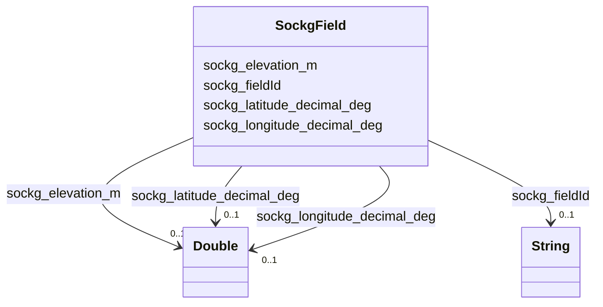

# Class: TODO -- what's a good name for what this class (type) describes? (sockg_Field)


_No type description provided_


URI: [sockg:Field](http://www.semanticweb.org/sockg/ontologies/2024/0/soil-carbon-ontology/Field)





<!-- no inheritance hierarchy -->


## Slots

| Name | Cardinality and Range | Description | Inheritance |
| ---  | --- | --- | --- |
| [sockg_longitude_decimal_deg](../slots/sockg_longitude_decimal_deg.md) | 0..1 <br/> [xsd:double](http://www.w3.org/2001/XMLSchema#double) | No slot description provided | direct |
| [sockg_elevation_m](../slots/sockg_elevation_m.md) | 0..1 <br/> [xsd:double](http://www.w3.org/2001/XMLSchema#double) | No slot description provided | direct |
| [sockg_fieldId](../slots/sockg_fieldId.md) | 0..1 <br/> [xsd:string](http://www.w3.org/2001/XMLSchema#string) | No slot description provided | direct |
| [sockg_latitude_decimal_deg](../slots/sockg_latitude_decimal_deg.md) | 0..1 <br/> [xsd:double](http://www.w3.org/2001/XMLSchema#double) | No slot description provided | direct |


## Usages

| used by | used in | type | used |
| ---  | --- | --- | --- |
| [SockgExperimentalUnit](../classes/SockgExperimentalUnit.md) | [sockg_locatedInField](../slots/sockg_locatedInField.md) | range | [SockgField](../classes/SockgField.md) |
| [SockgSite](../classes/SockgSite.md) | [sockg_hasField](../slots/sockg_hasField.md) | range | [SockgField](../classes/SockgField.md) |
| [SockgWaterQualityArea](../classes/SockgWaterQualityArea.md) | [sockg_waterQualityAreaDataAt](../slots/sockg_waterQualityAreaDataAt.md) | range | [SockgField](../classes/SockgField.md) |
| [SockgWaterQualityConc](../classes/SockgWaterQualityConc.md) | [sockg_waterQualityConcDataAt](../slots/sockg_waterQualityConcDataAt.md) | range | [SockgField](../classes/SockgField.md) |
| [SockgWeatherObservation](../classes/SockgWeatherObservation.md) | [sockg_weatherAtField](../slots/sockg_weatherAtField.md) | range | [SockgField](../classes/SockgField.md) |
| [SockgWeatherStation](../classes/SockgWeatherStation.md) | [sockg_recordsWeatherForField](../slots/sockg_recordsWeatherForField.md) | range | [SockgField](../classes/SockgField.md) |
| [SockgWindErosionArea](../classes/SockgWindErosionArea.md) | [sockg_windErosionDataAt](../slots/sockg_windErosionDataAt.md) | range | [SockgField](../classes/SockgField.md) |
| [SockgYieldNutrientUptake](../classes/SockgYieldNutrientUptake.md) | [sockg_yieldNutrUptakeDataAt](../slots/sockg_yieldNutrUptakeDataAt.md) | range | [SockgField](../classes/SockgField.md) |


## Examples

| Value |
| --- |
| neo4j://graph.individuals#55585 |

## TODOs

* TODO -- Todos for this class go here
* or you can delete the todos
* if you think the class is perfect.

## Identifier and Mapping Information


### Schema Source


* from schema: soc-kg/main


## Mappings

| Mapping Type | Mapped Value |
| ---  | ---  |
| self | sockg:Field |
| native | soc-kg/main/:SockgField |


## LinkML Source

<!-- TODO: investigate https://stackoverflow.com/questions/37606292/how-to-create-tabbed-code-blocks-in-mkdocs-or-sphinx -->

### Direct

<details>
```yaml
name: sockg_Field
description: No type description provided
title: TODO -- what's a good name for what this class (type) describes?
todos:
- TODO -- Todos for this class go here
- or you can delete the todos
- if you think the class is perfect.
notes:
- There are 58 instances of this class.
examples:
- value: neo4j://graph.individuals#55585
from_schema: soc-kg/main
rank: 1000
slots:
- sockg_longitude_decimal_deg
- sockg_elevation_m
- sockg_fieldId
- sockg_latitude_decimal_deg
class_uri: sockg:Field

```
</details>

### Induced

<details>
```yaml
name: sockg_Field
description: No type description provided
title: TODO -- what's a good name for what this class (type) describes?
todos:
- TODO -- Todos for this class go here
- or you can delete the todos
- if you think the class is perfect.
notes:
- There are 58 instances of this class.
examples:
- value: neo4j://graph.individuals#55585
from_schema: soc-kg/main
rank: 1000
attributes:
  sockg_longitude_decimal_deg:
    name: sockg_longitude_decimal_deg
    description: No slot description provided
    todos:
    - TODO -- Todos for this slot go here
    - or you can delete the todos
    - if you think the class is perfect.
    comments:
    - 58 occurrences with subject type sockg:Field and object type xsd:double.
    examples:
    - value: neo4j://graph.individuals#55600 sockg:longitude_decimal_deg nan
    from_schema: soc-kg/main
    rank: 1000
    slot_uri: sockg:longitude_decimal_deg
    alias: sockg_longitude_decimal_deg
    owner: sockg_Field
    domain_of:
    - sockg_Field
    range: double
  sockg_elevation_m:
    name: sockg_elevation_m
    description: No slot description provided
    todos:
    - TODO -- Todos for this slot go here
    - or you can delete the todos
    - if you think the class is perfect.
    comments:
    - 58 occurrences with subject type sockg:Field and object type xsd:double.
    - 12 occurrences with subject type sockg:WeatherStation and object type xsd:double.
    examples:
    - value: neo4j://graph.individuals#55601 sockg:elevation_m nan
    - value: neo4j://graph.individuals#509298 sockg:elevation_m nan
    from_schema: soc-kg/main
    rank: 1000
    slot_uri: sockg:elevation_m
    alias: sockg_elevation_m
    owner: sockg_Field
    domain_of:
    - sockg_Field
    - sockg_WeatherStation
    range: double
  sockg_fieldId:
    name: sockg_fieldId
    description: No slot description provided
    todos:
    - TODO -- Todos for this slot go here
    - or you can delete the todos
    - if you think the class is perfect.
    comments:
    - 2791 occurrences with subject type sockg:NutrientEfficiency and object type
      string.
    - 748 occurrences with subject type sockg:GasNutrientLoss and object type string.
    - 667 occurrences with subject type sockg:WaterQualityArea and object type string.
    - 429 occurrences with subject type sockg:YieldNutrientUptake and object type
      string.
    - 1479 occurrences with subject type sockg:WaterQualityConc and object type string.
    - 15 occurrences with subject type sockg:WindErosionArea and object type string.
    - 58 occurrences with subject type sockg:Field and object type string.
    examples:
    - value: neo4j://graph.individuals#201298 sockg:fieldId NELITCSE
    - value: neo4j://graph.individuals#55677 sockg:fieldId WIPDBARN
    - value: neo4j://graph.individuals#360040 sockg:fieldId WIPDBARN
    - value: neo4j://graph.individuals#509384 sockg:fieldId ALAURye
    - value: neo4j://graph.individuals#361395 sockg:fieldId WIPDBARN
    - value: neo4j://graph.individuals#509301 sockg:fieldId TXBSWEWC
    - value: neo4j://graph.individuals#55606 sockg:fieldId NELITCSE
    from_schema: soc-kg/main
    rank: 1000
    slot_uri: sockg:fieldId
    alias: sockg_fieldId
    owner: sockg_Field
    domain_of:
    - sockg_Field
    - sockg_GasNutrientLoss
    - sockg_NutrientEfficiency
    - sockg_WaterQualityArea
    - sockg_WaterQualityConc
    - sockg_WindErosionArea
    - sockg_YieldNutrientUptake
    range: string
  sockg_latitude_decimal_deg:
    name: sockg_latitude_decimal_deg
    description: No slot description provided
    todos:
    - TODO -- Todos for this slot go here
    - or you can delete the todos
    - if you think the class is perfect.
    comments:
    - 58 occurrences with subject type sockg:Field and object type xsd:double.
    examples:
    - value: neo4j://graph.individuals#55604 sockg:latitude_decimal_deg nan
    from_schema: soc-kg/main
    rank: 1000
    slot_uri: sockg:latitude_decimal_deg
    alias: sockg_latitude_decimal_deg
    owner: sockg_Field
    domain_of:
    - sockg_Field
    range: double
class_uri: sockg:Field

```
</details>