# Class: No class (entity type) name specified (sockg_GasSample)


_GasSample represents a collection of measurements related to greenhouse gas emissions from agricultural soils, including temperature and gas flux data over time. This class is essential for understanding the dynamics of carbon dioxide, methane, and nitrous oxide emissions in relation to soil and air temperatures, contributing to effective climate management practices in agriculture._


This class occurs 107354 times.


URI: [sockg:GasSample](https://idir.uta.edu/sockg-ontology/docs/GasSample)

```mermaid
 classDiagram
    class SockgGasSample
    click SockgGasSample href "../SockgGasSample"
      SockgGasSample : rdfs_seeAlso
        
          
    
    
    SockgGasSample --> "0..1" Uri : rdfs_seeAlso
    click Uri href "../Uri"

        
      SockgGasSample : sockg_airTemperature_degC
        
          
    
    
    SockgGasSample --> "0..1" Any : sockg_airTemperature_degC
    click Any href "../Any"

        
      SockgGasSample : sockg_airTemperatureSd_degC
        
          
    
    
    SockgGasSample --> "0..1" Double : sockg_airTemperatureSd_degC
    click Double href "../Double"

        
      SockgGasSample : sockg_carbonDioxide_gC_per_ha_per_d
        
          
    
    
    SockgGasSample --> "0..1" Any : sockg_carbonDioxide_gC_per_ha_per_d
    click Any href "../Any"

        
      SockgGasSample : sockg_carbonDioxideSd_gC_per_ha_per_d
        
          
    
    
    SockgGasSample --> "0..1" Any : sockg_carbonDioxideSd_gC_per_ha_per_d
    click Any href "../Any"

        
      SockgGasSample : sockg_chamberPlacement
        
          
    
    
    SockgGasSample --> "0..1" String : sockg_chamberPlacement
    click String href "../String"

        
      SockgGasSample : sockg_crop
        
          
    
    
    SockgGasSample --> "0..1" String : sockg_crop
    click String href "../String"

        
      SockgGasSample : sockg_date
        
          
    
    
    SockgGasSample --> "0..1" Any : sockg_date
    click Any href "../Any"

        
      SockgGasSample : sockg_isCarbonDioxideInterpolated
        
          
    
    
    SockgGasSample --> "0..1" Any : sockg_isCarbonDioxideInterpolated
    click Any href "../Any"

        
      SockgGasSample : sockg_isMethaneInterpolated
        
          
    
    
    SockgGasSample --> "0..1" Any : sockg_isMethaneInterpolated
    click Any href "../Any"

        
      SockgGasSample : sockg_isNitrousOxideInterpolated
        
          
    
    
    SockgGasSample --> "0..1" Any : sockg_isNitrousOxideInterpolated
    click Any href "../Any"

        
      SockgGasSample : sockg_measGHGFlux_UID
        
          
    
    
    SockgGasSample --> "0..1" String : sockg_measGHGFlux_UID
    click String href "../String"

        
      SockgGasSample : sockg_methane_gC_per_ha_per_d
        
          
    
    
    SockgGasSample --> "0..1" Any : sockg_methane_gC_per_ha_per_d
    click Any href "../Any"

        
      SockgGasSample : sockg_methaneSd_gC_per_ha_per_d
        
          
    
    
    SockgGasSample --> "0..1" Any : sockg_methaneSd_gC_per_ha_per_d
    click Any href "../Any"

        
      SockgGasSample : sockg_nitrousOxide_gN_per_ha_per_d
        
          
    
    
    SockgGasSample --> "0..1" Any : sockg_nitrousOxide_gN_per_ha_per_d
    click Any href "../Any"

        
      SockgGasSample : sockg_nitrousOxideSd_gN_per_ha_per_d
        
          
    
    
    SockgGasSample --> "0..1" Any : sockg_nitrousOxideSd_gN_per_ha_per_d
    click Any href "../Any"

        
      SockgGasSample : sockg_soilMoisture_percent_volume
        
          
    
    
    SockgGasSample --> "0..1" Double : sockg_soilMoisture_percent_volume
    click Double href "../Double"

        
      SockgGasSample : sockg_soilMoistureDepth_cm
        
          
    
    
    SockgGasSample --> "0..1" Integer : sockg_soilMoistureDepth_cm
    click Integer href "../Integer"

        
      SockgGasSample : sockg_soilMoistureSd_percent_volume
        
          
    
    
    SockgGasSample --> "0..1" Double : sockg_soilMoistureSd_percent_volume
    click Double href "../Double"

        
      SockgGasSample : sockg_soilTemperature_degC
        
          
    
    
    SockgGasSample --> "0..1" Any : sockg_soilTemperature_degC
    click Any href "../Any"

        
      SockgGasSample : sockg_soilTemperatureSd_degC
        
          
    
    
    SockgGasSample --> "0..1" Any : sockg_soilTemperatureSd_degC
    click Any href "../Any"

        
      SockgGasSample : sockg_time
        
          
    
    
    SockgGasSample --> "0..1" Any : sockg_time
    click Any href "../Any"

        
      SockgGasSample : sockg_treatmentId
        
          
    
    
    SockgGasSample --> "0..1" Any : sockg_treatmentId
    click Any href "../Any"

        
      
```





<!-- no inheritance hierarchy -->


## Slots

| Name | Cardinality and Range | Description | Inheritance | Occurrences |
| ---  | --- | --- | --- | --- |
| [sockg_crop](../slots/sockg_crop.md) | 0..1 <br/> [xsd:string](http://www.w3.org/2001/XMLSchema#string) | No slot (predicate) description specified <br/>  | direct | 105046 |
| [sockg_soilTemperatureSd_degC](../slots/sockg_soilTemperatureSd_degC.md) | 0..1 <br/> [xsd:float](http://www.w3.org/2001/XMLSchema#float)&nbsp;or&nbsp;<br />[xsd:double](http://www.w3.org/2001/XMLSchema#double) | No slot (predicate) description specified <br/>  | direct | 6403 |
| [sockg_carbonDioxideSd_gC_per_ha_per_d](../slots/sockg_carbonDioxideSd_gC_per_ha_per_d.md) | 0..1 <br/> [xsd:float](http://www.w3.org/2001/XMLSchema#float)&nbsp;or&nbsp;<br />[xsd:double](http://www.w3.org/2001/XMLSchema#double) | No slot (predicate) description specified <br/>  | direct | 101109 |
| [sockg_chamberPlacement](../slots/sockg_chamberPlacement.md) | 0..1 <br/> [xsd:string](http://www.w3.org/2001/XMLSchema#string) | No slot (predicate) description specified <br/>  | direct | 103543 |
| [sockg_carbonDioxide_gC_per_ha_per_d](../slots/sockg_carbonDioxide_gC_per_ha_per_d.md) | 0..1 <br/> [xsd:float](http://www.w3.org/2001/XMLSchema#float)&nbsp;or&nbsp;<br />[xsd:double](http://www.w3.org/2001/XMLSchema#double) | No slot (predicate) description specified <br/>  | direct | 107150 |
| [sockg_airTemperature_degC](../slots/sockg_airTemperature_degC.md) | 0..1 <br/> [xsd:float](http://www.w3.org/2001/XMLSchema#float)&nbsp;or&nbsp;<br />[xsd:double](http://www.w3.org/2001/XMLSchema#double) | No slot (predicate) description specified <br/>  | direct | 107350 |
| [sockg_isCarbonDioxideInterpolated](../slots/sockg_isCarbonDioxideInterpolated.md) | 0..1 <br/> [xsd:integer](http://www.w3.org/2001/XMLSchema#integer)&nbsp;or&nbsp;<br />[Int32](../types/Int32.md) | No slot (predicate) description specified <br/>  | direct | 107354 |
| [sockg_methaneSd_gC_per_ha_per_d](../slots/sockg_methaneSd_gC_per_ha_per_d.md) | 0..1 <br/> [xsd:float](http://www.w3.org/2001/XMLSchema#float)&nbsp;or&nbsp;<br />[xsd:double](http://www.w3.org/2001/XMLSchema#double) | No slot (predicate) description specified <br/>  | direct | 101109 |
| [sockg_soilMoisture_percent_volume](../slots/sockg_soilMoisture_percent_volume.md) | 0..1 <br/> [xsd:double](http://www.w3.org/2001/XMLSchema#double) | No slot (predicate) description specified <br/>  | direct | 107000 |
| [sockg_time](../slots/sockg_time.md) | 0..1 <br/> [xsd:time](http://www.w3.org/2001/XMLSchema#time)&nbsp;or&nbsp;<br />[xsd:string](http://www.w3.org/2001/XMLSchema#string) | No slot (predicate) description specified <br/>  | direct | 5471 |
| [sockg_isNitrousOxideInterpolated](../slots/sockg_isNitrousOxideInterpolated.md) | 0..1 <br/> [xsd:integer](http://www.w3.org/2001/XMLSchema#integer)&nbsp;or&nbsp;<br />[Int32](../types/Int32.md) | No slot (predicate) description specified <br/>  | direct | 107354 |
| [sockg_airTemperatureSd_degC](../slots/sockg_airTemperatureSd_degC.md) | 0..1 <br/> [xsd:double](http://www.w3.org/2001/XMLSchema#double) | No slot (predicate) description specified <br/>  | direct | 6790 |
| [sockg_soilTemperature_degC](../slots/sockg_soilTemperature_degC.md) | 0..1 <br/> [xsd:float](http://www.w3.org/2001/XMLSchema#float)&nbsp;or&nbsp;<br />[xsd:double](http://www.w3.org/2001/XMLSchema#double) | No slot (predicate) description specified <br/>  | direct | 107352 |
| [sockg_soilMoistureDepth_cm](../slots/sockg_soilMoistureDepth_cm.md) | 0..1 <br/> [xsd:integer](http://www.w3.org/2001/XMLSchema#integer) | No slot (predicate) description specified <br/>  | direct | 107354 |
| [sockg_date](../slots/sockg_date.md) | 0..1 <br/> [xsd:string](http://www.w3.org/2001/XMLSchema#string)&nbsp;or&nbsp;<br />[xsd:date](http://www.w3.org/2001/XMLSchema#date) | No slot (predicate) description specified <br/>  | direct | 107354 |
| [sockg_isMethaneInterpolated](../slots/sockg_isMethaneInterpolated.md) | 0..1 <br/> [xsd:integer](http://www.w3.org/2001/XMLSchema#integer)&nbsp;or&nbsp;<br />[Int32](../types/Int32.md) | No slot (predicate) description specified <br/>  | direct | 107354 |
| [sockg_treatmentId](../slots/sockg_treatmentId.md) | 0..1 <br/> [xsd:float](http://www.w3.org/2001/XMLSchema#float)&nbsp;or&nbsp;<br />[xsd:string](http://www.w3.org/2001/XMLSchema#string)&nbsp;or&nbsp;<br />[xsd:date](http://www.w3.org/2001/XMLSchema#date) | No slot (predicate) description specified <br/>  | direct | 107354 |
| [sockg_measGHGFlux_UID](../slots/sockg_measGHGFlux_UID.md) | 0..1 <br/> [xsd:string](http://www.w3.org/2001/XMLSchema#string) | No slot (predicate) description specified <br/>  | direct | 107354 |
| [sockg_nitrousOxideSd_gN_per_ha_per_d](../slots/sockg_nitrousOxideSd_gN_per_ha_per_d.md) | 0..1 <br/> [xsd:float](http://www.w3.org/2001/XMLSchema#float)&nbsp;or&nbsp;<br />[xsd:double](http://www.w3.org/2001/XMLSchema#double) | No slot (predicate) description specified <br/>  | direct | 101109 |
| [sockg_methane_gC_per_ha_per_d](../slots/sockg_methane_gC_per_ha_per_d.md) | 0..1 <br/> [xsd:float](http://www.w3.org/2001/XMLSchema#float)&nbsp;or&nbsp;<br />[xsd:double](http://www.w3.org/2001/XMLSchema#double) | No slot (predicate) description specified <br/>  | direct | 107090 |
| [sockg_soilMoistureSd_percent_volume](../slots/sockg_soilMoistureSd_percent_volume.md) | 0..1 <br/> [xsd:double](http://www.w3.org/2001/XMLSchema#double) | No slot (predicate) description specified <br/>  | direct | 5038 |
| [rdfs_seeAlso](../slots/rdfs_seeAlso.md) | 0..1 <br/> [xsd:anyURI](http://www.w3.org/2001/XMLSchema#anyURI) | No slot (predicate) description specified <br/>  | direct | 107354 |
| [sockg_nitrousOxide_gN_per_ha_per_d](../slots/sockg_nitrousOxide_gN_per_ha_per_d.md) | 0..1 <br/> [xsd:float](http://www.w3.org/2001/XMLSchema#float)&nbsp;or&nbsp;<br />[xsd:double](http://www.w3.org/2001/XMLSchema#double) | No slot (predicate) description specified <br/>  | direct | 107095 |


## Usages

| used by | used in | type | used |
| ---  | --- | --- | --- |
| [SockgExperimentalUnit](../classes/SockgExperimentalUnit.md) | [sockg_hasGasSample](../slots/sockg_hasGasSample.md) | range | [SockgGasSample](../classes/SockgGasSample.md) |
| [SockgGasSample](../classes/SockgGasSample.md) | [sockg_soilTemperatureSd_degC](../slots/sockg_soilTemperatureSd_degC.md) | domain | [SockgGasSample](../classes/SockgGasSample.md) |
| [SockgGasSample](../classes/SockgGasSample.md) | [sockg_carbonDioxideSd_gC_per_ha_per_d](../slots/sockg_carbonDioxideSd_gC_per_ha_per_d.md) | domain | [SockgGasSample](../classes/SockgGasSample.md) |
| [SockgGasSample](../classes/SockgGasSample.md) | [sockg_chamberPlacement](../slots/sockg_chamberPlacement.md) | domain | [SockgGasSample](../classes/SockgGasSample.md) |
| [SockgGasSample](../classes/SockgGasSample.md) | [sockg_carbonDioxide_gC_per_ha_per_d](../slots/sockg_carbonDioxide_gC_per_ha_per_d.md) | domain | [SockgGasSample](../classes/SockgGasSample.md) |
| [SockgGasSample](../classes/SockgGasSample.md) | [sockg_airTemperature_degC](../slots/sockg_airTemperature_degC.md) | domain | [SockgGasSample](../classes/SockgGasSample.md) |
| [SockgGasSample](../classes/SockgGasSample.md) | [sockg_isCarbonDioxideInterpolated](../slots/sockg_isCarbonDioxideInterpolated.md) | domain | [SockgGasSample](../classes/SockgGasSample.md) |
| [SockgGasSample](../classes/SockgGasSample.md) | [sockg_methaneSd_gC_per_ha_per_d](../slots/sockg_methaneSd_gC_per_ha_per_d.md) | domain | [SockgGasSample](../classes/SockgGasSample.md) |
| [SockgGasSample](../classes/SockgGasSample.md) | [sockg_isNitrousOxideInterpolated](../slots/sockg_isNitrousOxideInterpolated.md) | domain | [SockgGasSample](../classes/SockgGasSample.md) |
| [SockgGasSample](../classes/SockgGasSample.md) | [sockg_soilTemperature_degC](../slots/sockg_soilTemperature_degC.md) | domain | [SockgGasSample](../classes/SockgGasSample.md) |
| [SockgGasSample](../classes/SockgGasSample.md) | [sockg_isMethaneInterpolated](../slots/sockg_isMethaneInterpolated.md) | domain | [SockgGasSample](../classes/SockgGasSample.md) |
| [SockgGasSample](../classes/SockgGasSample.md) | [sockg_measGHGFlux_UID](../slots/sockg_measGHGFlux_UID.md) | domain | [SockgGasSample](../classes/SockgGasSample.md) |
| [SockgGasSample](../classes/SockgGasSample.md) | [sockg_nitrousOxideSd_gN_per_ha_per_d](../slots/sockg_nitrousOxideSd_gN_per_ha_per_d.md) | domain | [SockgGasSample](../classes/SockgGasSample.md) |
| [SockgGasSample](../classes/SockgGasSample.md) | [sockg_methane_gC_per_ha_per_d](../slots/sockg_methane_gC_per_ha_per_d.md) | domain | [SockgGasSample](../classes/SockgGasSample.md) |
| [SockgGasSample](../classes/SockgGasSample.md) | [sockg_nitrousOxide_gN_per_ha_per_d](../slots/sockg_nitrousOxide_gN_per_ha_per_d.md) | domain | [SockgGasSample](../classes/SockgGasSample.md) |


## LinkML Source

<!-- TODO: investigate https://stackoverflow.com/questions/37606292/how-to-create-tabbed-code-blocks-in-mkdocs-or-sphinx -->

### Direct

<details>

```yaml
name: sockg_GasSample
conforms_to: No schema conformance document specified
annotations:
  count:
    tag: count
    value: 107354
description: GasSample represents a collection of measurements related to greenhouse
  gas emissions from agricultural soils, including temperature and gas flux data over
  time. This class is essential for understanding the dynamics of carbon dioxide,
  methane, and nitrous oxide emissions in relation to soil and air temperatures, contributing
  to effective climate management practices in agriculture.
title: No class (entity type) name specified
from_schema: soc-kg
rank: 1000
slots:
- sockg_crop
- sockg_soilTemperatureSd_degC
- sockg_carbonDioxideSd_gC_per_ha_per_d
- sockg_chamberPlacement
- sockg_carbonDioxide_gC_per_ha_per_d
- sockg_airTemperature_degC
- sockg_isCarbonDioxideInterpolated
- sockg_methaneSd_gC_per_ha_per_d
- sockg_soilMoisture_percent_volume
- sockg_time
- sockg_isNitrousOxideInterpolated
- sockg_airTemperatureSd_degC
- sockg_soilTemperature_degC
- sockg_soilMoistureDepth_cm
- sockg_date
- sockg_isMethaneInterpolated
- sockg_treatmentId
- sockg_measGHGFlux_UID
- sockg_nitrousOxideSd_gN_per_ha_per_d
- sockg_methane_gC_per_ha_per_d
- sockg_soilMoistureSd_percent_volume
- rdfs_seeAlso
- sockg_nitrousOxide_gN_per_ha_per_d
slot_usage:
  rdfs_seeAlso:
    name: rdfs_seeAlso
    annotations:
      uri:
        tag: uri
        value: 107354
  sockg_airTemperatureSd_degC:
    name: sockg_airTemperatureSd_degC
    annotations:
      double:
        tag: double
        value: 6790
  sockg_airTemperature_degC:
    name: sockg_airTemperature_degC
    annotations:
      double:
        tag: double
        value: 107350
  sockg_carbonDioxideSd_gC_per_ha_per_d:
    name: sockg_carbonDioxideSd_gC_per_ha_per_d
    annotations:
      double:
        tag: double
        value: 101109
  sockg_carbonDioxide_gC_per_ha_per_d:
    name: sockg_carbonDioxide_gC_per_ha_per_d
    annotations:
      double:
        tag: double
        value: 107150
  sockg_chamberPlacement:
    name: sockg_chamberPlacement
    annotations:
      string:
        tag: string
        value: 103543
  sockg_crop:
    name: sockg_crop
    annotations:
      string:
        tag: string
        value: 105046
  sockg_date:
    name: sockg_date
    annotations:
      string:
        tag: string
        value: 107354
  sockg_isCarbonDioxideInterpolated:
    name: sockg_isCarbonDioxideInterpolated
    annotations:
      integer:
        tag: integer
        value: 107354
  sockg_isMethaneInterpolated:
    name: sockg_isMethaneInterpolated
    annotations:
      integer:
        tag: integer
        value: 107354
  sockg_isNitrousOxideInterpolated:
    name: sockg_isNitrousOxideInterpolated
    annotations:
      integer:
        tag: integer
        value: 107354
  sockg_measGHGFlux_UID:
    name: sockg_measGHGFlux_UID
    annotations:
      string:
        tag: string
        value: 107354
  sockg_methaneSd_gC_per_ha_per_d:
    name: sockg_methaneSd_gC_per_ha_per_d
    annotations:
      double:
        tag: double
        value: 101109
  sockg_methane_gC_per_ha_per_d:
    name: sockg_methane_gC_per_ha_per_d
    annotations:
      double:
        tag: double
        value: 107090
  sockg_nitrousOxideSd_gN_per_ha_per_d:
    name: sockg_nitrousOxideSd_gN_per_ha_per_d
    annotations:
      double:
        tag: double
        value: 101109
  sockg_nitrousOxide_gN_per_ha_per_d:
    name: sockg_nitrousOxide_gN_per_ha_per_d
    annotations:
      double:
        tag: double
        value: 107095
  sockg_soilMoistureDepth_cm:
    name: sockg_soilMoistureDepth_cm
    annotations:
      integer:
        tag: integer
        value: 107354
  sockg_soilMoistureSd_percent_volume:
    name: sockg_soilMoistureSd_percent_volume
    annotations:
      double:
        tag: double
        value: 5038
  sockg_soilMoisture_percent_volume:
    name: sockg_soilMoisture_percent_volume
    annotations:
      double:
        tag: double
        value: 107000
  sockg_soilTemperatureSd_degC:
    name: sockg_soilTemperatureSd_degC
    annotations:
      double:
        tag: double
        value: 6403
  sockg_soilTemperature_degC:
    name: sockg_soilTemperature_degC
    annotations:
      double:
        tag: double
        value: 107352
  sockg_time:
    name: sockg_time
    annotations:
      string:
        tag: string
        value: 5471
  sockg_treatmentId:
    name: sockg_treatmentId
    annotations:
      string:
        tag: string
        value: 107354
class_uri: sockg:GasSample

```
</details>

### Induced

<details>

```yaml
name: sockg_GasSample
conforms_to: No schema conformance document specified
annotations:
  count:
    tag: count
    value: 107354
description: GasSample represents a collection of measurements related to greenhouse
  gas emissions from agricultural soils, including temperature and gas flux data over
  time. This class is essential for understanding the dynamics of carbon dioxide,
  methane, and nitrous oxide emissions in relation to soil and air temperatures, contributing
  to effective climate management practices in agriculture.
title: No class (entity type) name specified
from_schema: soc-kg
rank: 1000
slot_usage:
  rdfs_seeAlso:
    name: rdfs_seeAlso
    annotations:
      uri:
        tag: uri
        value: 107354
  sockg_airTemperatureSd_degC:
    name: sockg_airTemperatureSd_degC
    annotations:
      double:
        tag: double
        value: 6790
  sockg_airTemperature_degC:
    name: sockg_airTemperature_degC
    annotations:
      double:
        tag: double
        value: 107350
  sockg_carbonDioxideSd_gC_per_ha_per_d:
    name: sockg_carbonDioxideSd_gC_per_ha_per_d
    annotations:
      double:
        tag: double
        value: 101109
  sockg_carbonDioxide_gC_per_ha_per_d:
    name: sockg_carbonDioxide_gC_per_ha_per_d
    annotations:
      double:
        tag: double
        value: 107150
  sockg_chamberPlacement:
    name: sockg_chamberPlacement
    annotations:
      string:
        tag: string
        value: 103543
  sockg_crop:
    name: sockg_crop
    annotations:
      string:
        tag: string
        value: 105046
  sockg_date:
    name: sockg_date
    annotations:
      string:
        tag: string
        value: 107354
  sockg_isCarbonDioxideInterpolated:
    name: sockg_isCarbonDioxideInterpolated
    annotations:
      integer:
        tag: integer
        value: 107354
  sockg_isMethaneInterpolated:
    name: sockg_isMethaneInterpolated
    annotations:
      integer:
        tag: integer
        value: 107354
  sockg_isNitrousOxideInterpolated:
    name: sockg_isNitrousOxideInterpolated
    annotations:
      integer:
        tag: integer
        value: 107354
  sockg_measGHGFlux_UID:
    name: sockg_measGHGFlux_UID
    annotations:
      string:
        tag: string
        value: 107354
  sockg_methaneSd_gC_per_ha_per_d:
    name: sockg_methaneSd_gC_per_ha_per_d
    annotations:
      double:
        tag: double
        value: 101109
  sockg_methane_gC_per_ha_per_d:
    name: sockg_methane_gC_per_ha_per_d
    annotations:
      double:
        tag: double
        value: 107090
  sockg_nitrousOxideSd_gN_per_ha_per_d:
    name: sockg_nitrousOxideSd_gN_per_ha_per_d
    annotations:
      double:
        tag: double
        value: 101109
  sockg_nitrousOxide_gN_per_ha_per_d:
    name: sockg_nitrousOxide_gN_per_ha_per_d
    annotations:
      double:
        tag: double
        value: 107095
  sockg_soilMoistureDepth_cm:
    name: sockg_soilMoistureDepth_cm
    annotations:
      integer:
        tag: integer
        value: 107354
  sockg_soilMoistureSd_percent_volume:
    name: sockg_soilMoistureSd_percent_volume
    annotations:
      double:
        tag: double
        value: 5038
  sockg_soilMoisture_percent_volume:
    name: sockg_soilMoisture_percent_volume
    annotations:
      double:
        tag: double
        value: 107000
  sockg_soilTemperatureSd_degC:
    name: sockg_soilTemperatureSd_degC
    annotations:
      double:
        tag: double
        value: 6403
  sockg_soilTemperature_degC:
    name: sockg_soilTemperature_degC
    annotations:
      double:
        tag: double
        value: 107352
  sockg_time:
    name: sockg_time
    annotations:
      string:
        tag: string
        value: 5471
  sockg_treatmentId:
    name: sockg_treatmentId
    annotations:
      string:
        tag: string
        value: 107354
attributes:
  sockg_crop:
    name: sockg_crop
    annotations:
      string:
        tag: string
        value: 105046
    description: No slot (predicate) description specified
    title: No slot (predicate) name specified
    examples:
    - object:
        example_object: Glycine max (Soybean)
        example_object_type: string
        example_predicate: sockg:crop
        example_subject: sockg:individuals/0
        example_subject_type: sockg_Amendment
    - object:
        example_object: Rangeland
        example_object_type: string
        example_predicate: sockg:crop
        example_subject: sockg:individuals/100000
        example_subject_type: sockg_GasSample
    - object:
        example_object: Glycine max (Soybean)
        example_object_type: string
        example_predicate: sockg:crop
        example_subject: sockg:individuals/172906
        example_subject_type: sockg_Harvest
    - object:
        example_object: Zea mays (Corn)
        example_object_type: string
        example_predicate: sockg:crop
        example_subject: sockg:individuals/191262
        example_subject_type: sockg_HarvestFraction
    - object:
        example_object: Zea mays (Corn)
        example_object_type: string
        example_predicate: sockg:crop
        example_subject: sockg:individuals/227674
        example_subject_type: sockg_ResidueManagementEvent
    - object:
        example_object: Zea mays (Corn)
        example_object_type: string
        example_predicate: sockg:crop
        example_subject: sockg:individuals/37796
        example_subject_type: sockg_BioMassCarbohydrate
    - object:
        example_object: Zea mays (Corn)
        example_object_type: string
        example_predicate: sockg:crop
        example_subject: sockg:individuals/39163
        example_subject_type: sockg_BioMassEnergy
    - object:
        example_object: Zea mays (Corn)
        example_object_type: string
        example_predicate: sockg:crop
        example_subject: sockg:individuals/39962
        example_subject_type: sockg_BioMassMineral
    - object:
        example_object: Zea mays (Corn)
        example_object_type: string
        example_predicate: sockg:crop
        example_subject: sockg:individuals/46937
        example_subject_type: sockg_CropGrowthStage
    - object:
        example_object: Calendula officinalis L. (Calendula)
        example_object_type: string
        example_predicate: sockg:crop
        example_subject: sockg:individuals/200732
        example_subject_type: sockg_NutrientEfficiency
    - object:
        example_object: Secale cereale (Rye)
        example_object_type: string
        example_predicate: sockg:crop
        example_subject: sockg:individuals/203988
        example_subject_type: sockg_PlantingEvent
    - object:
        example_object: Glycine max (Soybean)
        example_object_type: string
        example_predicate: sockg:crop
        example_subject: sockg:individuals/364993
        example_subject_type: sockg_WaterQualityConc
    - object:
        example_object: Zea mays (Corn)
        example_object_type: string
        example_predicate: sockg:crop
        example_subject: sockg:individuals/55859
        example_subject_type: sockg_GasNutrientLoss
    - object:
        example_object: Zea mays (Corn)
        example_object_type: string
        example_predicate: sockg:crop
        example_subject: sockg:individuals/624587
        example_subject_type: sockg_YieldNutrientUptake
    from_schema: soc-kg
    see_also:
    - https://lod.nal.usda.gov/nalt/7140
    rank: 1000
    slot_uri: sockg:crop
    alias: sockg_crop
    owner: sockg_GasSample
    domain_of:
    - sockg_Amendment
    - sockg_BioMassCarbohydrate
    - sockg_BioMassEnergy
    - sockg_BioMassMineral
    - sockg_CropGrowthStage
    - sockg_GasNutrientLoss
    - sockg_GasSample
    - sockg_Harvest
    - sockg_HarvestFraction
    - sockg_NutrientEfficiency
    - sockg_PlantingEvent
    - sockg_ResidueManagementEvent
    - sockg_WaterQualityConc
    - sockg_YieldNutrientUptake
    union_of:
    - '{''domain'': ''sockg_WaterQualityArea''}'
    - '{''domain'': ''sockg_WindErosionArea''}'
    - '{''domain'': ''sockg_NutrientEfficiency''}'
    - '{''domain'': ''sockg_WaterQualityConc''}'
    - '{''domain'': ''sockg_GasNutrientLoss''}'
    - '{''domain'': ''sockg_YieldNutrientUptake''}'
    - '{''domain'': ''sockg_BioMassMineral''}'
    - '{''domain'': ''sockg_BioMassCarbohydrate''}'
    - '{''domain'': ''sockg_BioMassEnergy''}'
    - '{''domain'': ''sockg_Tillage''}'
    range: string
  sockg_soilTemperatureSd_degC:
    name: sockg_soilTemperatureSd_degC
    annotations:
      double:
        tag: double
        value: 6403
    description: No slot (predicate) description specified
    title: No slot (predicate) name specified
    examples:
    - object:
        example_object: '0.65'
        example_object_type: double
        example_predicate: sockg:soilTemperatureSd_degC
        example_subject: sockg:individuals/114567
        example_subject_type: sockg_GasSample
    from_schema: soc-kg
    see_also:
    - https://lod.nal.usda.gov/nalt/61641
    rank: 1000
    domain: sockg_GasSample
    slot_uri: sockg:soilTemperatureSd_degC
    alias: sockg_soilTemperatureSd_degC
    owner: sockg_GasSample
    domain_of:
    - sockg_GasSample
    range: Any
    any_of:
    - range: float
    - range: double
  sockg_carbonDioxideSd_gC_per_ha_per_d:
    name: sockg_carbonDioxideSd_gC_per_ha_per_d
    annotations:
      double:
        tag: double
        value: 101109
    description: No slot (predicate) description specified
    title: No slot (predicate) name specified
    examples:
    - object:
        example_object: '0.0'
        example_object_type: double
        example_predicate: sockg:carbonDioxideSd_gC_per_ha_per_d
        example_subject: sockg:individuals/100000
        example_subject_type: sockg_GasSample
    from_schema: soc-kg
    see_also:
    - https://lod.nal.usda.gov/nalt/17007
    rank: 1000
    domain: sockg_GasSample
    slot_uri: sockg:carbonDioxideSd_gC_per_ha_per_d
    alias: sockg_carbonDioxideSd_gC_per_ha_per_d
    owner: sockg_GasSample
    domain_of:
    - sockg_GasSample
    range: Any
    any_of:
    - range: float
    - range: double
  sockg_chamberPlacement:
    name: sockg_chamberPlacement
    annotations:
      string:
        tag: string
        value: 103543
    description: No slot (predicate) description specified
    title: No slot (predicate) name specified
    examples:
    - object:
        example_object: Rangeland
        example_object_type: string
        example_predicate: sockg:chamberPlacement
        example_subject: sockg:individuals/100000
        example_subject_type: sockg_GasSample
    from_schema: soc-kg
    rank: 1000
    domain: sockg_GasSample
    slot_uri: sockg:chamberPlacement
    alias: sockg_chamberPlacement
    owner: sockg_GasSample
    domain_of:
    - sockg_GasSample
    range: string
  sockg_carbonDioxide_gC_per_ha_per_d:
    name: sockg_carbonDioxide_gC_per_ha_per_d
    annotations:
      double:
        tag: double
        value: 107150
    description: No slot (predicate) description specified
    title: No slot (predicate) name specified
    examples:
    - object:
        example_object: '64365.39'
        example_object_type: double
        example_predicate: sockg:carbonDioxide_gC_per_ha_per_d
        example_subject: sockg:individuals/100000
        example_subject_type: sockg_GasSample
    from_schema: soc-kg
    see_also:
    - https://lod.nal.usda.gov/nalt/17007
    rank: 1000
    domain: sockg_GasSample
    slot_uri: sockg:carbonDioxide_gC_per_ha_per_d
    alias: sockg_carbonDioxide_gC_per_ha_per_d
    owner: sockg_GasSample
    domain_of:
    - sockg_GasSample
    range: Any
    any_of:
    - range: float
    - range: double
  sockg_airTemperature_degC:
    name: sockg_airTemperature_degC
    annotations:
      double:
        tag: double
        value: 107350
    description: No slot (predicate) description specified
    title: No slot (predicate) name specified
    examples:
    - object:
        example_object: '0.0'
        example_object_type: double
        example_predicate: sockg:airTemperature_degC
        example_subject: sockg:individuals/100000
        example_subject_type: sockg_GasSample
    from_schema: soc-kg
    see_also:
    - https://lod.nal.usda.gov/nalt/5859
    rank: 1000
    domain: sockg_GasSample
    slot_uri: sockg:airTemperature_degC
    alias: sockg_airTemperature_degC
    owner: sockg_GasSample
    domain_of:
    - sockg_GasSample
    range: Any
    any_of:
    - range: float
    - range: double
  sockg_isCarbonDioxideInterpolated:
    name: sockg_isCarbonDioxideInterpolated
    annotations:
      integer:
        tag: integer
        value: 107354
    description: No slot (predicate) description specified
    title: No slot (predicate) name specified
    examples:
    - object:
        example_object: '1'
        example_object_type: integer
        example_predicate: sockg:isCarbonDioxideInterpolated
        example_subject: sockg:individuals/100000
        example_subject_type: sockg_GasSample
    from_schema: soc-kg
    rank: 1000
    domain: sockg_GasSample
    slot_uri: sockg:isCarbonDioxideInterpolated
    alias: sockg_isCarbonDioxideInterpolated
    owner: sockg_GasSample
    domain_of:
    - sockg_GasSample
    range: Any
    any_of:
    - range: integer
    - range: int32
  sockg_methaneSd_gC_per_ha_per_d:
    name: sockg_methaneSd_gC_per_ha_per_d
    annotations:
      double:
        tag: double
        value: 101109
    description: No slot (predicate) description specified
    title: No slot (predicate) name specified
    examples:
    - object:
        example_object: '0.0'
        example_object_type: double
        example_predicate: sockg:methaneSd_gC_per_ha_per_d
        example_subject: sockg:individuals/100000
        example_subject_type: sockg_GasSample
    from_schema: soc-kg
    see_also:
    - https://lod.nal.usda.gov/nalt/6475
    rank: 1000
    domain: sockg_GasSample
    slot_uri: sockg:methaneSd_gC_per_ha_per_d
    alias: sockg_methaneSd_gC_per_ha_per_d
    owner: sockg_GasSample
    domain_of:
    - sockg_GasSample
    range: Any
    any_of:
    - range: float
    - range: double
  sockg_soilMoisture_percent_volume:
    name: sockg_soilMoisture_percent_volume
    annotations:
      double:
        tag: double
        value: 107000
    description: No slot (predicate) description specified
    examples:
    - object:
        example_object: '22.5'
        example_object_type: double
        example_predicate: sockg:soilMoisture_percent_volume
        example_subject: sockg:individuals/100000
        example_subject_type: sockg_GasSample
    from_schema: soc-kg
    rank: 1000
    slot_uri: sockg:soilMoisture_percent_volume
    alias: sockg_soilMoisture_percent_volume
    owner: sockg_GasSample
    domain_of:
    - sockg_GasSample
    range: double
  sockg_time:
    name: sockg_time
    annotations:
      string:
        tag: string
        value: 5471
    description: No slot (predicate) description specified
    title: No slot (predicate) name specified
    examples:
    - object:
        example_object: '11:48:00'
        example_object_type: string
        example_predicate: sockg:time
        example_subject: sockg:individuals/156223
        example_subject_type: sockg_GasSample
    from_schema: soc-kg
    rank: 1000
    slot_uri: sockg:time
    alias: sockg_time
    owner: sockg_GasSample
    domain_of:
    - sockg_GasSample
    union_of:
    - '{''domain'': ''sockg_WaterQualityArea''}'
    - '{''domain'': ''sockg_WindErosionArea''}'
    - '{''domain'': ''sockg_WaterQualityConc''}'
    - '{''domain'': ''sockg_GasNutrientLoss''}'
    - '{''domain'': ''sockg_GasSample''}'
    range: Any
    any_of:
    - range: time
    - range: string
  sockg_isNitrousOxideInterpolated:
    name: sockg_isNitrousOxideInterpolated
    annotations:
      integer:
        tag: integer
        value: 107354
    description: No slot (predicate) description specified
    title: No slot (predicate) name specified
    examples:
    - object:
        example_object: '1'
        example_object_type: integer
        example_predicate: sockg:isNitrousOxideInterpolated
        example_subject: sockg:individuals/100000
        example_subject_type: sockg_GasSample
    from_schema: soc-kg
    rank: 1000
    domain: sockg_GasSample
    slot_uri: sockg:isNitrousOxideInterpolated
    alias: sockg_isNitrousOxideInterpolated
    owner: sockg_GasSample
    domain_of:
    - sockg_GasSample
    range: Any
    any_of:
    - range: integer
    - range: int32
  sockg_airTemperatureSd_degC:
    name: sockg_airTemperatureSd_degC
    annotations:
      double:
        tag: double
        value: 6790
    description: No slot (predicate) description specified
    examples:
    - object:
        example_object: '0.7778175'
        example_object_type: double
        example_predicate: sockg:airTemperatureSd_degC
        example_subject: sockg:individuals/123531
        example_subject_type: sockg_GasSample
    from_schema: soc-kg
    rank: 1000
    slot_uri: sockg:airTemperatureSd_degC
    alias: sockg_airTemperatureSd_degC
    owner: sockg_GasSample
    domain_of:
    - sockg_GasSample
    range: double
  sockg_soilTemperature_degC:
    name: sockg_soilTemperature_degC
    annotations:
      double:
        tag: double
        value: 107352
    description: No slot (predicate) description specified
    title: No slot (predicate) name specified
    examples:
    - object:
        example_object: '20.8'
        example_object_type: double
        example_predicate: sockg:soilTemperature_degC
        example_subject: sockg:individuals/100000
        example_subject_type: sockg_GasSample
    from_schema: soc-kg
    see_also:
    - https://lod.nal.usda.gov/nalt/61641
    rank: 1000
    domain: sockg_GasSample
    slot_uri: sockg:soilTemperature_degC
    alias: sockg_soilTemperature_degC
    owner: sockg_GasSample
    domain_of:
    - sockg_GasSample
    range: Any
    any_of:
    - range: float
    - range: double
  sockg_soilMoistureDepth_cm:
    name: sockg_soilMoistureDepth_cm
    annotations:
      integer:
        tag: integer
        value: 107354
    description: No slot (predicate) description specified
    examples:
    - object:
        example_object: '6'
        example_object_type: integer
        example_predicate: sockg:soilMoistureDepth_cm
        example_subject: sockg:individuals/100000
        example_subject_type: sockg_GasSample
    from_schema: soc-kg
    rank: 1000
    slot_uri: sockg:soilMoistureDepth_cm
    alias: sockg_soilMoistureDepth_cm
    owner: sockg_GasSample
    domain_of:
    - sockg_GasSample
    range: integer
  sockg_date:
    name: sockg_date
    annotations:
      string:
        tag: string
        value: 107354
    description: No slot (predicate) description specified
    title: No slot (predicate) name specified
    examples:
    - object:
        example_object: '2005-06-28'
        example_object_type: string
        example_predicate: sockg:date
        example_subject: sockg:individuals/100000
        example_subject_type: sockg_GasSample
    - object:
        example_object: '1997-07-10'
        example_object_type: string
        example_predicate: sockg:date
        example_subject: sockg:individuals/163960
        example_subject_type: sockg_Grazing
    - object:
        example_object: '2007-11-14'
        example_object_type: string
        example_predicate: sockg:date
        example_subject: sockg:individuals/172906
        example_subject_type: sockg_Harvest
    - object:
        example_object: '2006-06-19'
        example_object_type: string
        example_predicate: sockg:date
        example_subject: sockg:individuals/191262
        example_subject_type: sockg_HarvestFraction
    - object:
        example_object: '2011-10-05'
        example_object_type: string
        example_predicate: sockg:date
        example_subject: sockg:individuals/227674
        example_subject_type: sockg_ResidueManagementEvent
    - object:
        example_object: '1994-04-11'
        example_object_type: string
        example_predicate: sockg:date
        example_subject: sockg:individuals/235229
        example_subject_type: sockg_SoilBiologicalSample
    - object:
        example_object: '2007-10-29'
        example_object_type: string
        example_predicate: sockg:date
        example_subject: sockg:individuals/253451
        example_subject_type: sockg_SoilChemicalSample
    - object:
        example_object: '2011-11-07'
        example_object_type: string
        example_predicate: sockg:date
        example_subject: sockg:individuals/307284
        example_subject_type: sockg_SoilCover
    - object:
        example_object: '2010-10-27'
        example_object_type: string
        example_predicate: sockg:date
        example_subject: sockg:individuals/308318
        example_subject_type: sockg_SoilPhysicalSample
    - object:
        example_object: '2009-10-01'
        example_object_type: string
        example_predicate: sockg:date
        example_subject: sockg:individuals/37796
        example_subject_type: sockg_BioMassCarbohydrate
    - object:
        example_object: '2008-09-04'
        example_object_type: string
        example_predicate: sockg:date
        example_subject: sockg:individuals/39163
        example_subject_type: sockg_BioMassEnergy
    - object:
        example_object: '2018-10-04'
        example_object_type: string
        example_predicate: sockg:date
        example_subject: sockg:individuals/39962
        example_subject_type: sockg_BioMassMineral
    - object:
        example_object: '2015-10-25'
        example_object_type: string
        example_predicate: sockg:date
        example_subject: sockg:individuals/439235
        example_subject_type: sockg_WeatherObservation
    - object:
        example_object: '2011-08-31'
        example_object_type: string
        example_predicate: sockg:date
        example_subject: sockg:individuals/46937
        example_subject_type: sockg_CropGrowthStage
    - object:
        example_object: '2014-09-15'
        example_object_type: string
        example_predicate: sockg:date
        example_subject: sockg:individuals/200732
        example_subject_type: sockg_NutrientEfficiency
    - object:
        example_object: '2011-04-12'
        example_object_type: string
        example_predicate: sockg:date
        example_subject: sockg:individuals/364326
        example_subject_type: sockg_WaterQualityArea
    - object:
        example_object: '2003-05-13'
        example_object_type: string
        example_predicate: sockg:date
        example_subject: sockg:individuals/364993
        example_subject_type: sockg_WaterQualityConc
    - object:
        example_object: '2003-11-22'
        example_object_type: string
        example_predicate: sockg:date
        example_subject: sockg:individuals/513777
        example_subject_type: sockg_WeatherStation
    - object:
        example_object: '2008-05-01'
        example_object_type: string
        example_predicate: sockg:date
        example_subject: sockg:individuals/55858
        example_subject_type: sockg_GasNutrientLoss
    - object:
        example_object: '2001-03-15'
        example_object_type: string
        example_predicate: sockg:date
        example_subject: sockg:individuals/624572
        example_subject_type: sockg_WindErosionArea
    - object:
        example_object: '2014-11-01'
        example_object_type: string
        example_predicate: sockg:date
        example_subject: sockg:individuals/624587
        example_subject_type: sockg_YieldNutrientUptake
    from_schema: soc-kg
    see_also:
    - https://lod.nal.usda.gov/nalt/302328
    rank: 1000
    slot_uri: sockg:date
    alias: sockg_date
    owner: sockg_GasSample
    domain_of:
    - sockg_BioMassCarbohydrate
    - sockg_BioMassEnergy
    - sockg_BioMassMineral
    - sockg_CropGrowthStage
    - sockg_GasNutrientLoss
    - sockg_GasSample
    - sockg_Grazing
    - sockg_Harvest
    - sockg_HarvestFraction
    - sockg_NutrientEfficiency
    - sockg_ResidueManagementEvent
    - sockg_SoilBiologicalSample
    - sockg_SoilChemicalSample
    - sockg_SoilCover
    - sockg_SoilPhysicalSample
    - sockg_WaterQualityArea
    - sockg_WaterQualityConc
    - sockg_WeatherObservation
    - sockg_WeatherStation
    - sockg_WindErosionArea
    - sockg_YieldNutrientUptake
    union_of:
    - '{''domain'': ''sockg_NutrientEfficiency''}'
    - '{''domain'': ''sockg_CropGrowthStage''}'
    - '{''domain'': ''sockg_BioMassCarbohydrate''}'
    - '{''domain'': ''sockg_Site''}'
    - '{''domain'': ''sockg_ResidueManagementEvent''}'
    - '{''domain'': ''sockg_GasSample''}'
    - '{''domain'': ''sockg_PlantingEvent''}'
    - '{''domain'': ''sockg_SoilCover''}'
    - '{''domain'': ''sockg_WaterQualityConc''}'
    - '{''domain'': ''sockg_WeatherObservation''}'
    - '{''domain'': ''sockg_SoilChemicalSample''}'
    - '{''domain'': ''sockg_WaterQualityArea''}'
    - '{''domain'': ''sockg_WindErosionArea''}'
    - '{''domain'': ''sockg_Publication''}'
    - '{''domain'': ''sockg_GasNutrientLoss''}'
    - '{''domain'': ''sockg_BioMassEnergy''}'
    - '{''domain'': ''sockg_MiscellaneousMeasurement''}'
    - '{''domain'': ''sockg_SoilPhysicalSample''}'
    - '{''domain'': ''sockg_Grazing''}'
    - '{''domain'': ''sockg_Harvest''}'
    - '{''domain'': ''sockg_SoilBiologicalSample''}'
    - '{''domain'': ''sockg_BioMassMineral''}'
    - '{''domain'': ''sockg_YieldNutrientUptake''}'
    - '{''domain'': ''sockg_Tillage''}'
    range: Any
    any_of:
    - range: string
    - range: date
  sockg_isMethaneInterpolated:
    name: sockg_isMethaneInterpolated
    annotations:
      integer:
        tag: integer
        value: 107354
    description: No slot (predicate) description specified
    title: No slot (predicate) name specified
    examples:
    - object:
        example_object: '1'
        example_object_type: integer
        example_predicate: sockg:isMethaneInterpolated
        example_subject: sockg:individuals/100000
        example_subject_type: sockg_GasSample
    from_schema: soc-kg
    rank: 1000
    domain: sockg_GasSample
    slot_uri: sockg:isMethaneInterpolated
    alias: sockg_isMethaneInterpolated
    owner: sockg_GasSample
    domain_of:
    - sockg_GasSample
    range: Any
    any_of:
    - range: integer
    - range: int32
  sockg_treatmentId:
    name: sockg_treatmentId
    annotations:
      string:
        tag: string
        value: 107354
    description: No slot (predicate) description specified
    title: No slot (predicate) name specified
    examples:
    - object:
        example_object: PAHAW_ROT4
        example_object_type: string
        example_predicate: sockg:treatmentId
        example_subject: sockg:individuals/0
        example_subject_type: sockg_Amendment
    - object:
        example_object: NDMAHGPE_TANUR
        example_object_type: string
        example_predicate: sockg:treatmentId
        example_subject: sockg:individuals/100000
        example_subject_type: sockg_GasSample
    - object:
        example_object: GAJPCSR1_F1H1
        example_object_type: string
        example_predicate: sockg:treatmentId
        example_subject: sockg:individuals/163960
        example_subject_type: sockg_Grazing
    - object:
        example_object: PAHAW_PAST2
        example_object_type: string
        example_predicate: sockg:treatmentId
        example_subject: sockg:individuals/170955
        example_subject_type: sockg_GrazingManagementEvent
    - object:
        example_object: PAHAW_ROT1
        example_object_type: string
        example_predicate: sockg:treatmentId
        example_subject: sockg:individuals/172906
        example_subject_type: sockg_Harvest
    - object:
        example_object: MNMOFS_13
        example_object_type: string
        example_predicate: sockg:treatmentId
        example_subject: sockg:individuals/191262
        example_subject_type: sockg_HarvestFraction
    - object:
        example_object: PAHAW_ROT4
        example_object_type: string
        example_predicate: sockg:treatmentId
        example_subject: sockg:individuals/227674
        example_subject_type: sockg_ResidueManagementEvent
    - object:
        example_object: GAJPCSR1_F3H1
        example_object_type: string
        example_predicate: sockg:treatmentId
        example_subject: sockg:individuals/235229
        example_subject_type: sockg_SoilBiologicalSample
    - object:
        example_object: MNMOFS_44
        example_object_type: string
        example_predicate: sockg:treatmentId
        example_subject: sockg:individuals/253451
        example_subject_type: sockg_SoilChemicalSample
    - object:
        example_object: FullX200A
        example_object_type: string
        example_predicate: sockg:treatmentId
        example_subject: sockg:individuals/308318
        example_subject_type: sockg_SoilPhysicalSample
    - object:
        example_object: NDMAH3_C
        example_object_type: string
        example_predicate: sockg:treatmentId
        example_subject: sockg:individuals/363556
        example_subject_type: sockg_Treatment
    - object:
        example_object: MNSPReap_ST100
        example_object_type: string
        example_predicate: sockg:treatmentId
        example_subject: sockg:individuals/37796
        example_subject_type: sockg_BioMassCarbohydrate
    - object:
        example_object: SCFLSGI_100R
        example_object_type: string
        example_predicate: sockg:treatmentId
        example_subject: sockg:individuals/39163
        example_subject_type: sockg_BioMassEnergy
    - object:
        example_object: FullM125N
        example_object_type: string
        example_predicate: sockg:treatmentId
        example_subject: sockg:individuals/39962
        example_subject_type: sockg_BioMassMineral
    - object:
        example_object: INWLREAP_R50
        example_object_type: string
        example_predicate: sockg:treatmentId
        example_subject: sockg:individuals/46937
        example_subject_type: sockg_CropGrowthStage
    - object:
        example_object: MNMOCAL_N67
        example_object_type: string
        example_predicate: sockg:treatmentId
        example_subject: sockg:individuals/200732
        example_subject_type: sockg_NutrientEfficiency
    - object:
        example_object: MNMOFS_38
        example_object_type: string
        example_predicate: sockg:treatmentId
        example_subject: sockg:individuals/203988
        example_subject_type: sockg_PlantingEvent
    - object:
        example_object: WIPDBARN_SOIL
        example_object_type: string
        example_predicate: sockg:treatmentId
        example_subject: sockg:individuals/364326
        example_subject_type: sockg_WaterQualityArea
    - object:
        example_object: IAAMKELL_CC
        example_object_type: string
        example_predicate: sockg:treatmentId
        example_subject: sockg:individuals/364993
        example_subject_type: sockg_WaterQualityConc
    - object:
        example_object: IAAMKELL_NCC
        example_object_type: string
        example_predicate: sockg:treatmentId
        example_subject: sockg:individuals/55858
        example_subject_type: sockg_GasNutrientLoss
    - object:
        example_object: TXBSWEWC_N1985
        example_object_type: string
        example_predicate: sockg:treatmentId
        example_subject: sockg:individuals/624572
        example_subject_type: sockg_WindErosionArea
    - object:
        example_object: MNSP4R_U-S100
        example_object_type: string
        example_predicate: sockg:treatmentId
        example_subject: sockg:individuals/624587
        example_subject_type: sockg_YieldNutrientUptake
    from_schema: soc-kg
    rank: 1000
    slot_uri: sockg:treatmentId
    alias: sockg_treatmentId
    owner: sockg_GasSample
    domain_of:
    - sockg_Amendment
    - sockg_BioMassCarbohydrate
    - sockg_BioMassEnergy
    - sockg_BioMassMineral
    - sockg_CropGrowthStage
    - sockg_GasNutrientLoss
    - sockg_GasSample
    - sockg_Grazing
    - sockg_GrazingManagementEvent
    - sockg_Harvest
    - sockg_HarvestFraction
    - sockg_NutrientEfficiency
    - sockg_PlantingEvent
    - sockg_ResidueManagementEvent
    - sockg_SoilBiologicalSample
    - sockg_SoilChemicalSample
    - sockg_SoilPhysicalSample
    - sockg_Treatment
    - sockg_WaterQualityArea
    - sockg_WaterQualityConc
    - sockg_WindErosionArea
    - sockg_YieldNutrientUptake
    union_of:
    - '{''domain'': ''sockg_SoilPhysicalSample''}'
    - '{''domain'': ''sockg_WaterQualityArea''}'
    - '{''domain'': ''sockg_WindErosionArea''}'
    - '{''domain'': ''sockg_NutrientEfficiency''}'
    - '{''domain'': ''sockg_Treatment''}'
    - '{''domain'': ''sockg_WaterQualityConc''}'
    - '{''domain'': ''sockg_GrazingManagementEvent''}'
    - '{''domain'': ''sockg_SoilChemicalSample''}'
    - '{''domain'': ''sockg_GasNutrientLoss''}'
    - '{''domain'': ''sockg_Amendment''}'
    - '{''domain'': ''sockg_SoilBiologicalSample''}'
    - '{''domain'': ''sockg_YieldNutrientUptake''}'
    - '{''domain'': ''sockg_BioMassCarbohydrate''}'
    - '{''domain'': ''sockg_HarvestFraction''}'
    - '{''domain'': ''sockg_ResidueManagementEvent''}'
    range: Any
    any_of:
    - range: float
    - range: string
    - range: date
  sockg_measGHGFlux_UID:
    name: sockg_measGHGFlux_UID
    annotations:
      string:
        tag: string
        value: 107354
    description: No slot (predicate) description specified
    title: No slot (predicate) name specified
    examples:
    - object:
        example_object: AgCros_NDMAHGPE_TANURExclosure1_2005-06-28_nan_Rangeland
        example_object_type: string
        example_predicate: sockg:measGHGFlux_UID
        example_subject: sockg:individuals/100000
        example_subject_type: sockg_GasSample
    from_schema: soc-kg
    rank: 1000
    domain: sockg_GasSample
    slot_uri: sockg:measGHGFlux_UID
    alias: sockg_measGHGFlux_UID
    owner: sockg_GasSample
    domain_of:
    - sockg_GasSample
    range: string
  sockg_nitrousOxideSd_gN_per_ha_per_d:
    name: sockg_nitrousOxideSd_gN_per_ha_per_d
    annotations:
      double:
        tag: double
        value: 101109
    description: No slot (predicate) description specified
    title: No slot (predicate) name specified
    examples:
    - object:
        example_object: '0.0'
        example_object_type: double
        example_predicate: sockg:nitrousOxideSd_gN_per_ha_per_d
        example_subject: sockg:individuals/100000
        example_subject_type: sockg_GasSample
    from_schema: soc-kg
    see_also:
    - https://lod.nal.usda.gov/nalt/43853
    rank: 1000
    domain: sockg_GasSample
    slot_uri: sockg:nitrousOxideSd_gN_per_ha_per_d
    alias: sockg_nitrousOxideSd_gN_per_ha_per_d
    owner: sockg_GasSample
    domain_of:
    - sockg_GasSample
    range: Any
    any_of:
    - range: float
    - range: double
  sockg_methane_gC_per_ha_per_d:
    name: sockg_methane_gC_per_ha_per_d
    annotations:
      double:
        tag: double
        value: 107090
    description: No slot (predicate) description specified
    title: No slot (predicate) name specified
    examples:
    - object:
        example_object: '-2.77317'
        example_object_type: double
        example_predicate: sockg:methane_gC_per_ha_per_d
        example_subject: sockg:individuals/100000
        example_subject_type: sockg_GasSample
    from_schema: soc-kg
    see_also:
    - https://lod.nal.usda.gov/nalt/6475
    rank: 1000
    domain: sockg_GasSample
    slot_uri: sockg:methane_gC_per_ha_per_d
    alias: sockg_methane_gC_per_ha_per_d
    owner: sockg_GasSample
    domain_of:
    - sockg_GasSample
    range: Any
    any_of:
    - range: float
    - range: double
  sockg_soilMoistureSd_percent_volume:
    name: sockg_soilMoistureSd_percent_volume
    annotations:
      double:
        tag: double
        value: 5038
    description: No slot (predicate) description specified
    examples:
    - object:
        example_object: '4.24'
        example_object_type: double
        example_predicate: sockg:soilMoistureSd_percent_volume
        example_subject: sockg:individuals/114567
        example_subject_type: sockg_GasSample
    from_schema: soc-kg
    rank: 1000
    slot_uri: sockg:soilMoistureSd_percent_volume
    alias: sockg_soilMoistureSd_percent_volume
    owner: sockg_GasSample
    domain_of:
    - sockg_GasSample
    range: double
  rdfs_seeAlso:
    name: rdfs_seeAlso
    annotations:
      uri:
        tag: uri
        value: 107354
    description: No slot (predicate) description specified
    examples:
    - object:
        example_object: https://lod.nal.usda.gov/nalt/4605
        example_object_type: uri
        example_predicate: rdfs:seeAlso
        example_subject: sockg:individuals/0
        example_subject_type: sockg_Amendment
    - object:
        example_object: https://lod.nal.usda.gov/nalt/5859
        example_object_type: uri
        example_predicate: rdfs:seeAlso
        example_subject: sockg:individuals/100000
        example_subject_type: sockg_GasSample
    - object:
        example_object: https://lod.nal.usda.gov/nalt/281219
        example_object_type: uri
        example_predicate: rdfs:seeAlso
        example_subject: sockg:individuals/163960
        example_subject_type: sockg_Grazing
    - object:
        example_object: https://lod.nal.usda.gov/nalt/4377260
        example_object_type: uri
        example_predicate: rdfs:seeAlso
        example_subject: sockg:individuals/170955
        example_subject_type: sockg_GrazingManagementEvent
    - object:
        example_object: https://lod.nal.usda.gov/nalt/131626
        example_object_type: uri
        example_predicate: rdfs:seeAlso
        example_subject: sockg:individuals/172906
        example_subject_type: sockg_Harvest
    - object:
        example_object: https://lod.nal.usda.gov/nalt/281219
        example_object_type: uri
        example_predicate: rdfs:seeAlso
        example_subject: sockg:individuals/191262
        example_subject_type: sockg_HarvestFraction
    - object:
        example_object: https://lod.nal.usda.gov/nalt/13189
        example_object_type: uri
        example_predicate: rdfs:seeAlso
        example_subject: sockg:individuals/203523
        example_subject_type: sockg_Organization
    - object:
        example_object: https://lod.nal.usda.gov/nalt/3927
        example_object_type: uri
        example_predicate: rdfs:seeAlso
        example_subject: sockg:individuals/203632
        example_subject_type: sockg_Pesticide
    - object:
        example_object: https://lod.nal.usda.gov/nalt/849
        example_object_type: uri
        example_predicate: rdfs:seeAlso
        example_subject: sockg:individuals/227674
        example_subject_type: sockg_ResidueManagementEvent
    - object:
        example_object: https://lod.nal.usda.gov/nalt/30158
        example_object_type: uri
        example_predicate: rdfs:seeAlso
        example_subject: sockg:individuals/230982
        example_subject_type: sockg_Rotation
    - object:
        example_object: https://lod.nal.usda.gov/nalt/302328
        example_object_type: uri
        example_predicate: rdfs:seeAlso
        example_subject: sockg:individuals/231056
        example_subject_type: sockg_Site
    - object:
        example_object: https://lod.nal.usda.gov/nalt/2726
        example_object_type: uri
        example_predicate: rdfs:seeAlso
        example_subject: sockg:individuals/235229
        example_subject_type: sockg_SoilBiologicalSample
    - object:
        example_object: https://lod.nal.usda.gov/nalt/7974
        example_object_type: uri
        example_predicate: rdfs:seeAlso
        example_subject: sockg:individuals/253451
        example_subject_type: sockg_SoilChemicalSample
    - object:
        example_object: https://lod.nal.usda.gov/nalt/302328
        example_object_type: uri
        example_predicate: rdfs:seeAlso
        example_subject: sockg:individuals/307284
        example_subject_type: sockg_SoilCover
    - object:
        example_object: https://lod.nal.usda.gov/nalt/5143
        example_object_type: uri
        example_predicate: rdfs:seeAlso
        example_subject: sockg:individuals/308318
        example_subject_type: sockg_SoilPhysicalSample
    - object:
        example_object: https://lod.nal.usda.gov/nalt/5430914
        example_object_type: uri
        example_predicate: rdfs:seeAlso
        example_subject: sockg:individuals/336400
        example_subject_type: sockg_State
    - object:
        example_object: https://lod.nal.usda.gov/nalt/7140
        example_object_type: uri
        example_predicate: rdfs:seeAlso
        example_subject: sockg:individuals/336419
        example_subject_type: sockg_Tillage
    - object:
        example_object: https://lod.nal.usda.gov/nalt/28616
        example_object_type: uri
        example_predicate: rdfs:seeAlso
        example_subject: sockg:individuals/363556
        example_subject_type: sockg_Treatment
    - object:
        example_object: https://lod.nal.usda.gov/nalt/2717
        example_object_type: uri
        example_predicate: rdfs:seeAlso
        example_subject: sockg:individuals/37796
        example_subject_type: sockg_BioMassCarbohydrate
    - object:
        example_object: https://lod.nal.usda.gov/nalt/7140
        example_object_type: uri
        example_predicate: rdfs:seeAlso
        example_subject: sockg:individuals/39163
        example_subject_type: sockg_BioMassEnergy
    - object:
        example_object: https://lod.nal.usda.gov/nalt/281219
        example_object_type: uri
        example_predicate: rdfs:seeAlso
        example_subject: sockg:individuals/39962
        example_subject_type: sockg_BioMassMineral
    - object:
        example_object: https://lod.nal.usda.gov/nalt/2714
        example_object_type: uri
        example_predicate: rdfs:seeAlso
        example_subject: sockg:individuals/439235
        example_subject_type: sockg_WeatherObservation
    - object:
        example_object: https://lod.nal.usda.gov/nalt/7485997
        example_object_type: uri
        example_predicate: rdfs:seeAlso
        example_subject: sockg:individuals/46864
        example_subject_type: sockg_City
    - object:
        example_object: https://lod.nal.usda.gov/nalt/2217129
        example_object_type: uri
        example_predicate: rdfs:seeAlso
        example_subject: sockg:individuals/46904
        example_subject_type: sockg_County
    - object:
        example_object: https://lod.nal.usda.gov/nalt/302328
        example_object_type: uri
        example_predicate: rdfs:seeAlso
        example_subject: sockg:individuals/46937
        example_subject_type: sockg_CropGrowthStage
    - object:
        example_object: https://lod.nal.usda.gov/nalt/976
        example_object_type: uri
        example_predicate: rdfs:seeAlso
        example_subject: sockg:individuals/51906
        example_subject_type: sockg_Experiment
    - object:
        example_object: https://lod.nal.usda.gov/nalt/9183
        example_object_type: uri
        example_predicate: rdfs:seeAlso
        example_subject: sockg:individuals/51937
        example_subject_type: sockg_ExperimentalUnit
    - object:
        example_object: https://lod.nal.usda.gov/nalt/7259
        example_object_type: uri
        example_predicate: rdfs:seeAlso
        example_subject: sockg:individuals/55800
        example_subject_type: sockg_Field
    - object:
        example_object: https://lod.nal.usda.gov/nalt/7140
        example_object_type: uri
        example_predicate: rdfs:seeAlso
        example_subject: sockg:individuals/200732
        example_subject_type: sockg_NutrientEfficiency
    - object:
        example_object: https://lod.nal.usda.gov/nalt/35067
        example_object_type: uri
        example_predicate: rdfs:seeAlso
        example_subject: sockg:individuals/203534
        example_subject_type: sockg_Person
    - object:
        example_object: https://lod.nal.usda.gov/nalt/5630
        example_object_type: uri
        example_predicate: rdfs:seeAlso
        example_subject: sockg:individuals/203988
        example_subject_type: sockg_PlantingEvent
    - object:
        example_object: https://lod.nal.usda.gov/nalt/61097
        example_object_type: uri
        example_predicate: rdfs:seeAlso
        example_subject: sockg:individuals/227438
        example_subject_type: sockg_Project
    - object:
        example_object: https://lod.nal.usda.gov/nalt/305490
        example_object_type: uri
        example_predicate: rdfs:seeAlso
        example_subject: sockg:individuals/227447
        example_subject_type: sockg_Publication
    - object:
        example_object: https://lod.nal.usda.gov/nalt/48678
        example_object_type: uri
        example_predicate: rdfs:seeAlso
        example_subject: sockg:individuals/227609
        example_subject_type: sockg_ResearchUnit
    - object:
        example_object: https://lod.nal.usda.gov/nalt/33020
        example_object_type: uri
        example_predicate: rdfs:seeAlso
        example_subject: sockg:individuals/231116
        example_subject_type: sockg_Soil
    - object:
        example_object: https://lod.nal.usda.gov/nalt/7140
        example_object_type: uri
        example_predicate: rdfs:seeAlso
        example_subject: sockg:individuals/364326
        example_subject_type: sockg_WaterQualityArea
    - object:
        example_object: https://lod.nal.usda.gov/nalt/281219
        example_object_type: uri
        example_predicate: rdfs:seeAlso
        example_subject: sockg:individuals/364993
        example_subject_type: sockg_WaterQualityConc
    - object:
        example_object: https://lod.nal.usda.gov/nalt/7259
        example_object_type: uri
        example_predicate: rdfs:seeAlso
        example_subject: sockg:individuals/513777
        example_subject_type: sockg_WeatherStation
    - object:
        example_object: https://lod.nal.usda.gov/nalt/281219
        example_object_type: uri
        example_predicate: rdfs:seeAlso
        example_subject: sockg:individuals/55858
        example_subject_type: sockg_GasNutrientLoss
    - object:
        example_object: https://lod.nal.usda.gov/nalt/281219
        example_object_type: uri
        example_predicate: rdfs:seeAlso
        example_subject: sockg:individuals/624572
        example_subject_type: sockg_WindErosionArea
    - object:
        example_object: https://lod.nal.usda.gov/nalt/7140
        example_object_type: uri
        example_predicate: rdfs:seeAlso
        example_subject: sockg:individuals/624587
        example_subject_type: sockg_YieldNutrientUptake
    from_schema: soc-kg
    rank: 1000
    slot_uri: rdfs:seeAlso
    alias: rdfs_seeAlso
    owner: sockg_GasSample
    domain_of:
    - sockg_Amendment
    - sockg_BioMassCarbohydrate
    - sockg_BioMassEnergy
    - sockg_BioMassMineral
    - sockg_City
    - sockg_County
    - sockg_CropGrowthStage
    - sockg_Experiment
    - sockg_ExperimentalUnit
    - sockg_Field
    - sockg_GasNutrientLoss
    - sockg_GasSample
    - sockg_Grazing
    - sockg_GrazingManagementEvent
    - sockg_Harvest
    - sockg_HarvestFraction
    - sockg_NutrientEfficiency
    - sockg_Organization
    - sockg_Person
    - sockg_Pesticide
    - sockg_PlantingEvent
    - sockg_Project
    - sockg_Publication
    - sockg_ResearchUnit
    - sockg_ResidueManagementEvent
    - sockg_Rotation
    - sockg_Site
    - sockg_Soil
    - sockg_SoilBiologicalSample
    - sockg_SoilChemicalSample
    - sockg_SoilCover
    - sockg_SoilPhysicalSample
    - sockg_State
    - sockg_Tillage
    - sockg_Treatment
    - sockg_WaterQualityArea
    - sockg_WaterQualityConc
    - sockg_WeatherObservation
    - sockg_WeatherStation
    - sockg_WindErosionArea
    - sockg_YieldNutrientUptake
    range: uri
  sockg_nitrousOxide_gN_per_ha_per_d:
    name: sockg_nitrousOxide_gN_per_ha_per_d
    annotations:
      double:
        tag: double
        value: 107095
    description: No slot (predicate) description specified
    title: No slot (predicate) name specified
    examples:
    - object:
        example_object: '7.497066'
        example_object_type: double
        example_predicate: sockg:nitrousOxide_gN_per_ha_per_d
        example_subject: sockg:individuals/100000
        example_subject_type: sockg_GasSample
    from_schema: soc-kg
    see_also:
    - https://lod.nal.usda.gov/nalt/43853
    rank: 1000
    domain: sockg_GasSample
    slot_uri: sockg:nitrousOxide_gN_per_ha_per_d
    alias: sockg_nitrousOxide_gN_per_ha_per_d
    owner: sockg_GasSample
    domain_of:
    - sockg_GasSample
    range: Any
    any_of:
    - range: float
    - range: double
class_uri: sockg:GasSample

```
</details>