# Class: TODO -- what's a good name for what this class (type) describes? (sockg_GasSample)


_No type description provided_


URI: [sockg:GasSample](http://www.semanticweb.org/sockg/ontologies/2024/0/soil-carbon-ontology/GasSample)

```mermaid
 classDiagram
    class SockgGasSample
    click SockgGasSample href "../SockgGasSample"
      SockgGasSample : sockg_airTemperature_degC
        
          
    
    
    SockgGasSample --> "0..1" Double : sockg_airTemperature_degC
    click Double href "../Double"

        
      SockgGasSample : sockg_airTemperatureStd_degC
        
          
    
    
    SockgGasSample --> "0..1" Double : sockg_airTemperatureStd_degC
    click Double href "../Double"

        
      SockgGasSample : sockg_carbonDioxide_gC_per_ha_per_d
        
          
    
    
    SockgGasSample --> "0..1" Double : sockg_carbonDioxide_gC_per_ha_per_d
    click Double href "../Double"

        
      SockgGasSample : sockg_carbonDioxideStd_gC_per_ha_per_d
        
          
    
    
    SockgGasSample --> "0..1" Double : sockg_carbonDioxideStd_gC_per_ha_per_d
    click Double href "../Double"

        
      SockgGasSample : sockg_chamberPlacement
        
          
    
    
    SockgGasSample --> "0..1" Any : sockg_chamberPlacement
    click Any href "../Any"

        
      SockgGasSample : sockg_crop
        
          
    
    
    SockgGasSample --> "0..1" Any : sockg_crop
    click Any href "../Any"

        
      SockgGasSample : sockg_date
        
          
    
    
    SockgGasSample --> "0..1" Any : sockg_date
    click Any href "../Any"

        
      SockgGasSample : sockg_isCarbonDioxideInterpolated
        
          
    
    
    SockgGasSample --> "0..1" Integer : sockg_isCarbonDioxideInterpolated
    click Integer href "../Integer"

        
      SockgGasSample : sockg_isMethaneInterpolated
        
          
    
    
    SockgGasSample --> "0..1" Integer : sockg_isMethaneInterpolated
    click Integer href "../Integer"

        
      SockgGasSample : sockg_isNitrousOxideInterpolated
        
          
    
    
    SockgGasSample --> "0..1" Integer : sockg_isNitrousOxideInterpolated
    click Integer href "../Integer"

        
      SockgGasSample : sockg_measGHGFlux_UID
        
          
    
    
    SockgGasSample --> "0..1" String : sockg_measGHGFlux_UID
    click String href "../String"

        
      SockgGasSample : sockg_methane_gC_per_ha_per_d
        
          
    
    
    SockgGasSample --> "0..1" Double : sockg_methane_gC_per_ha_per_d
    click Double href "../Double"

        
      SockgGasSample : sockg_methaneStd_gC_per_ha_per_d
        
          
    
    
    SockgGasSample --> "0..1" Double : sockg_methaneStd_gC_per_ha_per_d
    click Double href "../Double"

        
      SockgGasSample : sockg_nitrousOxide_gN_per_ha_per_d
        
          
    
    
    SockgGasSample --> "0..1" Double : sockg_nitrousOxide_gN_per_ha_per_d
    click Double href "../Double"

        
      SockgGasSample : sockg_nitrousOxideStd_gN_per_ha_per_d
        
          
    
    
    SockgGasSample --> "0..1" Double : sockg_nitrousOxideStd_gN_per_ha_per_d
    click Double href "../Double"

        
      SockgGasSample : sockg_soilMoisture_percent_volume
        
          
    
    
    SockgGasSample --> "0..1" Double : sockg_soilMoisture_percent_volume
    click Double href "../Double"

        
      SockgGasSample : sockg_soilMoistureDepth_cm
        
          
    
    
    SockgGasSample --> "0..1" Integer : sockg_soilMoistureDepth_cm
    click Integer href "../Integer"

        
      SockgGasSample : sockg_soilTemperature_degC
        
          
    
    
    SockgGasSample --> "0..1" Double : sockg_soilTemperature_degC
    click Double href "../Double"

        
      SockgGasSample : sockg_soilTemperatureStd_degC
        
          
    
    
    SockgGasSample --> "0..1" Double : sockg_soilTemperatureStd_degC
    click Double href "../Double"

        
      SockgGasSample : sockg_time
        
          
    
    
    SockgGasSample --> "0..1" Any : sockg_time
    click Any href "../Any"

        
      SockgGasSample : sockg_treatmentId
        
          
    
    
    SockgGasSample --> "0..1" String : sockg_treatmentId
    click String href "../String"

        
      
```





<!-- no inheritance hierarchy -->


## Slots

| Name | Cardinality and Range | Description | Inheritance |
| ---  | --- | --- | --- |
| [sockg_methane_gC_per_ha_per_d](../slots/sockg_methane_gC_per_ha_per_d.md) | 0..1 <br/> [xsd:double](http://www.w3.org/2001/XMLSchema#double) | No slot description provided | direct |
| [sockg_airTemperature_degC](../slots/sockg_airTemperature_degC.md) | 0..1 <br/> [xsd:double](http://www.w3.org/2001/XMLSchema#double) | No slot description provided | direct |
| [sockg_time](../slots/sockg_time.md) | 0..1 <br/> [xsd:double](http://www.w3.org/2001/XMLSchema#double)&nbsp;or&nbsp;<br />[xsd:string](http://www.w3.org/2001/XMLSchema#string) | No slot description provided | direct |
| [sockg_methaneStd_gC_per_ha_per_d](../slots/sockg_methaneStd_gC_per_ha_per_d.md) | 0..1 <br/> [xsd:double](http://www.w3.org/2001/XMLSchema#double) | No slot description provided | direct |
| [sockg_carbonDioxide_gC_per_ha_per_d](../slots/sockg_carbonDioxide_gC_per_ha_per_d.md) | 0..1 <br/> [xsd:double](http://www.w3.org/2001/XMLSchema#double) | No slot description provided | direct |
| [sockg_soilMoistureDepth_cm](../slots/sockg_soilMoistureDepth_cm.md) | 0..1 <br/> [xsd:integer](http://www.w3.org/2001/XMLSchema#integer) | No slot description provided | direct |
| [sockg_soilTemperatureStd_degC](../slots/sockg_soilTemperatureStd_degC.md) | 0..1 <br/> [xsd:double](http://www.w3.org/2001/XMLSchema#double) | No slot description provided | direct |
| [sockg_soilTemperature_degC](../slots/sockg_soilTemperature_degC.md) | 0..1 <br/> [xsd:double](http://www.w3.org/2001/XMLSchema#double) | No slot description provided | direct |
| [sockg_treatmentId](../slots/sockg_treatmentId.md) | 0..1 <br/> [xsd:string](http://www.w3.org/2001/XMLSchema#string) | No slot description provided | direct |
| [sockg_isNitrousOxideInterpolated](../slots/sockg_isNitrousOxideInterpolated.md) | 0..1 <br/> [xsd:integer](http://www.w3.org/2001/XMLSchema#integer) | No slot description provided | direct |
| [sockg_soilMoisture_percent_volume](../slots/sockg_soilMoisture_percent_volume.md) | 0..1 <br/> [xsd:double](http://www.w3.org/2001/XMLSchema#double) | No slot description provided | direct |
| [sockg_date](../slots/sockg_date.md) | 0..1 <br/> [xsd:string](http://www.w3.org/2001/XMLSchema#string)&nbsp;or&nbsp;<br />[xsd:double](http://www.w3.org/2001/XMLSchema#double) | No slot description provided | direct |
| [sockg_isCarbonDioxideInterpolated](../slots/sockg_isCarbonDioxideInterpolated.md) | 0..1 <br/> [xsd:integer](http://www.w3.org/2001/XMLSchema#integer) | No slot description provided | direct |
| [sockg_chamberPlacement](../slots/sockg_chamberPlacement.md) | 0..1 <br/> [xsd:string](http://www.w3.org/2001/XMLSchema#string)&nbsp;or&nbsp;<br />[xsd:double](http://www.w3.org/2001/XMLSchema#double) | No slot description provided | direct |
| [sockg_carbonDioxideStd_gC_per_ha_per_d](../slots/sockg_carbonDioxideStd_gC_per_ha_per_d.md) | 0..1 <br/> [xsd:double](http://www.w3.org/2001/XMLSchema#double) | No slot description provided | direct |
| [sockg_nitrousOxideStd_gN_per_ha_per_d](../slots/sockg_nitrousOxideStd_gN_per_ha_per_d.md) | 0..1 <br/> [xsd:double](http://www.w3.org/2001/XMLSchema#double) | No slot description provided | direct |
| [sockg_airTemperatureStd_degC](../slots/sockg_airTemperatureStd_degC.md) | 0..1 <br/> [xsd:double](http://www.w3.org/2001/XMLSchema#double) | No slot description provided | direct |
| [sockg_measGHGFlux_UID](../slots/sockg_measGHGFlux_UID.md) | 0..1 <br/> [xsd:string](http://www.w3.org/2001/XMLSchema#string) | No slot description provided | direct |
| [sockg_nitrousOxide_gN_per_ha_per_d](../slots/sockg_nitrousOxide_gN_per_ha_per_d.md) | 0..1 <br/> [xsd:double](http://www.w3.org/2001/XMLSchema#double) | No slot description provided | direct |
| [sockg_crop](../slots/sockg_crop.md) | 0..1 <br/> [xsd:string](http://www.w3.org/2001/XMLSchema#string)&nbsp;or&nbsp;<br />[xsd:double](http://www.w3.org/2001/XMLSchema#double) | No slot description provided | direct |
| [sockg_isMethaneInterpolated](../slots/sockg_isMethaneInterpolated.md) | 0..1 <br/> [xsd:integer](http://www.w3.org/2001/XMLSchema#integer) | No slot description provided | direct |


## Usages

| used by | used in | type | used |
| ---  | --- | --- | --- |
| [SockgExperimentalUnit](../classes/SockgExperimentalUnit.md) | [sockg_hasGasSample](../slots/sockg_hasGasSample.md) | range | [SockgGasSample](../classes/SockgGasSample.md) |


## Examples

| Value |
| --- |
| neo4j://graph.individuals#131435 |

## TODOs

* TODO -- Todos for this class go here
* or you can delete the todos
* if you think the class is perfect.

## Identifier and Mapping Information


### Schema Source


* from schema: soc-kg/main


## Mappings

| Mapping Type | Mapped Value |
| ---  | ---  |
| self | sockg:GasSample |
| native | soc-kg/main/:SockgGasSample |


## LinkML Source

<!-- TODO: investigate https://stackoverflow.com/questions/37606292/how-to-create-tabbed-code-blocks-in-mkdocs-or-sphinx -->

### Direct

<details>
```yaml
name: sockg_GasSample
description: No type description provided
title: TODO -- what's a good name for what this class (type) describes?
todos:
- TODO -- Todos for this class go here
- or you can delete the todos
- if you think the class is perfect.
notes:
- There are 107354 instances of this class.
examples:
- value: neo4j://graph.individuals#131435
from_schema: soc-kg/main
rank: 1000
slots:
- sockg_methane_gC_per_ha_per_d
- sockg_airTemperature_degC
- sockg_time
- sockg_methaneStd_gC_per_ha_per_d
- sockg_carbonDioxide_gC_per_ha_per_d
- sockg_soilMoistureDepth_cm
- sockg_soilTemperatureStd_degC
- sockg_soilTemperature_degC
- sockg_treatmentId
- sockg_isNitrousOxideInterpolated
- sockg_soilMoisture_percent_volume
- sockg_date
- sockg_isCarbonDioxideInterpolated
- sockg_chamberPlacement
- sockg_carbonDioxideStd_gC_per_ha_per_d
- sockg_nitrousOxideStd_gN_per_ha_per_d
- sockg_airTemperatureStd_degC
- sockg_measGHGFlux_UID
- sockg_nitrousOxide_gN_per_ha_per_d
- sockg_crop
- sockg_isMethaneInterpolated
class_uri: sockg:GasSample

```
</details>

### Induced

<details>
```yaml
name: sockg_GasSample
description: No type description provided
title: TODO -- what's a good name for what this class (type) describes?
todos:
- TODO -- Todos for this class go here
- or you can delete the todos
- if you think the class is perfect.
notes:
- There are 107354 instances of this class.
examples:
- value: neo4j://graph.individuals#131435
from_schema: soc-kg/main
rank: 1000
attributes:
  sockg_methane_gC_per_ha_per_d:
    name: sockg_methane_gC_per_ha_per_d
    description: No slot description provided
    todos:
    - TODO -- Todos for this slot go here
    - or you can delete the todos
    - if you think the class is perfect.
    comments:
    - 107354 occurrences with subject type sockg:GasSample and object type xsd:double.
    examples:
    - value: neo4j://graph.individuals#111760 sockg:methane_gC_per_ha_per_d 0.0
    from_schema: soc-kg/main
    rank: 1000
    slot_uri: sockg:methane_gC_per_ha_per_d
    alias: sockg_methane_gC_per_ha_per_d
    owner: sockg_GasSample
    domain_of:
    - sockg_GasSample
    range: double
  sockg_airTemperature_degC:
    name: sockg_airTemperature_degC
    description: No slot description provided
    todos:
    - TODO -- Todos for this slot go here
    - or you can delete the todos
    - if you think the class is perfect.
    comments:
    - 107354 occurrences with subject type sockg:GasSample and object type xsd:double.
    examples:
    - value: neo4j://graph.individuals#129873 sockg:airTemperature_degC 5.65
    from_schema: soc-kg/main
    rank: 1000
    slot_uri: sockg:airTemperature_degC
    alias: sockg_airTemperature_degC
    owner: sockg_GasSample
    domain_of:
    - sockg_GasSample
    range: double
  sockg_time:
    name: sockg_time
    description: No slot description provided
    todos:
    - TODO -- Todos for this slot go here
    - or you can delete the todos
    - if you think the class is perfect.
    comments:
    - 101883 occurrences with subject type sockg:GasSample and object type xsd:double.
    - 5471 occurrences with subject type sockg:GasSample and object type string.
    - 1479 occurrences with subject type sockg:WaterQualityConc and object type xsd:double.
    - 748 occurrences with subject type sockg:GasNutrientLoss and object type xsd:double.
    - 667 occurrences with subject type sockg:WaterQualityArea and object type xsd:double.
    - 15 occurrences with subject type sockg:WindErosionArea and object type xsd:double.
    examples:
    - value: neo4j://graph.individuals#97100 sockg:time nan
    - value: neo4j://graph.individuals#160382 sockg:time 11:09:00
    - value: neo4j://graph.individuals#361705 sockg:time nan
    - value: neo4j://graph.individuals#55832 sockg:time nan
    - value: neo4j://graph.individuals#360324 sockg:time nan
    - value: neo4j://graph.individuals#509313 sockg:time nan
    from_schema: soc-kg/main
    rank: 1000
    slot_uri: sockg:time
    alias: sockg_time
    owner: sockg_GasSample
    domain_of:
    - sockg_GasNutrientLoss
    - sockg_GasSample
    - sockg_WaterQualityArea
    - sockg_WaterQualityConc
    - sockg_WindErosionArea
    range: Any
    any_of:
    - range: double
    - range: string
  sockg_methaneStd_gC_per_ha_per_d:
    name: sockg_methaneStd_gC_per_ha_per_d
    description: No slot description provided
    todos:
    - TODO -- Todos for this slot go here
    - or you can delete the todos
    - if you think the class is perfect.
    comments:
    - 107354 occurrences with subject type sockg:GasSample and object type xsd:double.
    examples:
    - value: neo4j://graph.individuals#91549 sockg:methaneStd_gC_per_ha_per_d 0.0
    from_schema: soc-kg/main
    rank: 1000
    slot_uri: sockg:methaneStd_gC_per_ha_per_d
    alias: sockg_methaneStd_gC_per_ha_per_d
    owner: sockg_GasSample
    domain_of:
    - sockg_GasSample
    range: double
  sockg_carbonDioxide_gC_per_ha_per_d:
    name: sockg_carbonDioxide_gC_per_ha_per_d
    description: No slot description provided
    todos:
    - TODO -- Todos for this slot go here
    - or you can delete the todos
    - if you think the class is perfect.
    comments:
    - 107354 occurrences with subject type sockg:GasSample and object type xsd:double.
    examples:
    - value: neo4j://graph.individuals#136189 sockg:carbonDioxide_gC_per_ha_per_d
        3544.5796
    from_schema: soc-kg/main
    rank: 1000
    slot_uri: sockg:carbonDioxide_gC_per_ha_per_d
    alias: sockg_carbonDioxide_gC_per_ha_per_d
    owner: sockg_GasSample
    domain_of:
    - sockg_GasSample
    range: double
  sockg_soilMoistureDepth_cm:
    name: sockg_soilMoistureDepth_cm
    description: No slot description provided
    todos:
    - TODO -- Todos for this slot go here
    - or you can delete the todos
    - if you think the class is perfect.
    comments:
    - 107354 occurrences with subject type sockg:GasSample and object type xsd:long.
    examples:
    - value: neo4j://graph.individuals#113827 sockg:soilMoistureDepth_cm 0
    from_schema: soc-kg/main
    rank: 1000
    slot_uri: sockg:soilMoistureDepth_cm
    alias: sockg_soilMoistureDepth_cm
    owner: sockg_GasSample
    domain_of:
    - sockg_GasSample
    range: integer
  sockg_soilTemperatureStd_degC:
    name: sockg_soilTemperatureStd_degC
    description: No slot description provided
    todos:
    - TODO -- Todos for this slot go here
    - or you can delete the todos
    - if you think the class is perfect.
    comments:
    - 107354 occurrences with subject type sockg:GasSample and object type xsd:double.
    examples:
    - value: neo4j://graph.individuals#162417 sockg:soilTemperatureStd_degC nan
    from_schema: soc-kg/main
    rank: 1000
    slot_uri: sockg:soilTemperatureStd_degC
    alias: sockg_soilTemperatureStd_degC
    owner: sockg_GasSample
    domain_of:
    - sockg_GasSample
    range: double
  sockg_soilTemperature_degC:
    name: sockg_soilTemperature_degC
    description: No slot description provided
    todos:
    - TODO -- Todos for this slot go here
    - or you can delete the todos
    - if you think the class is perfect.
    comments:
    - 107354 occurrences with subject type sockg:GasSample and object type xsd:double.
    examples:
    - value: neo4j://graph.individuals#146064 sockg:soilTemperature_degC 22.8
    from_schema: soc-kg/main
    rank: 1000
    slot_uri: sockg:soilTemperature_degC
    alias: sockg_soilTemperature_degC
    owner: sockg_GasSample
    domain_of:
    - sockg_GasSample
    range: double
  sockg_treatmentId:
    name: sockg_treatmentId
    description: No slot description provided
    todos:
    - TODO -- Todos for this slot go here
    - or you can delete the todos
    - if you think the class is perfect.
    comments:
    - 6723 occurrences with subject type sockg:BioMassMineral and object type string.
    - 107354 occurrences with subject type sockg:GasSample and object type string.
    - 53833 occurrences with subject type sockg:SoilChemicalSample and object type
      string.
    - 37796 occurrences with subject type sockg:Amendment and object type string.
    - 9470 occurrences with subject type sockg:HarvestFraction and object type string.
    - 28082 occurrences with subject type sockg:SoilPhysicalSample and object type
      string.
    - 18222 occurrences with subject type sockg:SoilBiologicalSample and object type
      string.
    - 4896 occurrences with subject type sockg:CropGrowthStage and object type string.
    - 6995 occurrences with subject type sockg:Grazing and object type string.
    - 1951 occurrences with subject type sockg:GrazingManagementEvent and object type
      string.
    - 799 occurrences with subject type sockg:BioMassEnergy and object type string.
    - 18356 occurrences with subject type sockg:Harvest and object type string.
    - 1479 occurrences with subject type sockg:WaterQualityConc and object type string.
    - 3308 occurrences with subject type sockg:ResidueManagementEvent and object type
      string.
    - 1367 occurrences with subject type sockg:BioMassCarbohydrate and object type
      string.
    - 667 occurrences with subject type sockg:WaterQualityArea and object type string.
    - 2791 occurrences with subject type sockg:NutrientEfficiency and object type
      string.
    - 429 occurrences with subject type sockg:YieldNutrientUptake and object type
      string.
    - 748 occurrences with subject type sockg:GasNutrientLoss and object type string.
    - 769 occurrences with subject type sockg:Treatment and object type string.
    - 15 occurrences with subject type sockg:WindErosionArea and object type string.
    examples:
    - value: neo4j://graph.individuals#43961 sockg:treatmentId PAUP_8
    - value: neo4j://graph.individuals#147269 sockg:treatmentId KYBGGHG_1
    - value: neo4j://graph.individuals#296284 sockg:treatmentId PAUP_15
    - value: neo4j://graph.individuals#13960 sockg:treatmentId NEMLTCRS_ROT62
    - value: neo4j://graph.individuals#200120 sockg:treatmentId ECUAlumbreP2_MtNocrhZf
    - value: neo4j://graph.individuals#311219 sockg:treatmentId GAJPCSR1_F3H1
    - value: neo4j://graph.individuals#248000 sockg:treatmentId MNMOBRR_N005C
    - value: neo4j://graph.individuals#47857 sockg:treatmentId INWLTPAC_NP
    - value: neo4j://graph.individuals#170669 sockg:treatmentId NDMAGWP_HG
    - value: neo4j://graph.individuals#171511 sockg:treatmentId GAJPCSR2_F5H2
    - value: neo4j://graph.individuals#39242 sockg:treatmentId SCFLSGI_50R
    - value: neo4j://graph.individuals#181825 sockg:treatmentId PAHAW_RCG1
    - value: neo4j://graph.individuals#361841 sockg:treatmentId WIPDBARN_SAND
    - value: neo4j://graph.individuals#227864 sockg:treatmentId PAHAW_ROT8
    - value: neo4j://graph.individuals#38229 sockg:treatmentId MNSPReap_ST000
    - value: neo4j://graph.individuals#360342 sockg:treatmentId WIPDBARN_SAND
    - value: neo4j://graph.individuals#203268 sockg:treatmentId COFOARD4_DM
    - value: neo4j://graph.individuals#509719 sockg:treatmentId MNSP4R_U-S100
    - value: neo4j://graph.individuals#56012 sockg:treatmentId WIPDBARN_SOIL
    - value: neo4j://graph.individuals#359420 sockg:treatmentId MNMOBRR_N010S
    - value: neo4j://graph.individuals#509310 sockg:treatmentId TXBSWEWC_ERODE
    from_schema: soc-kg/main
    rank: 1000
    slot_uri: sockg:treatmentId
    alias: sockg_treatmentId
    owner: sockg_GasSample
    domain_of:
    - sockg_Amendment
    - sockg_BioMassCarbohydrate
    - sockg_BioMassEnergy
    - sockg_BioMassMineral
    - sockg_CropGrowthStage
    - sockg_GasNutrientLoss
    - sockg_GasSample
    - sockg_Grazing
    - sockg_GrazingManagementEvent
    - sockg_Harvest
    - sockg_HarvestFraction
    - sockg_NutrientEfficiency
    - sockg_ResidueManagementEvent
    - sockg_SoilBiologicalSample
    - sockg_SoilChemicalSample
    - sockg_SoilPhysicalSample
    - sockg_Treatment
    - sockg_WaterQualityArea
    - sockg_WaterQualityConc
    - sockg_WindErosionArea
    - sockg_YieldNutrientUptake
    range: string
  sockg_isNitrousOxideInterpolated:
    name: sockg_isNitrousOxideInterpolated
    description: No slot description provided
    todos:
    - TODO -- Todos for this slot go here
    - or you can delete the todos
    - if you think the class is perfect.
    comments:
    - 107354 occurrences with subject type sockg:GasSample and object type xsd:long.
    examples:
    - value: neo4j://graph.individuals#68506 sockg:isNitrousOxideInterpolated 1
    from_schema: soc-kg/main
    rank: 1000
    slot_uri: sockg:isNitrousOxideInterpolated
    alias: sockg_isNitrousOxideInterpolated
    owner: sockg_GasSample
    domain_of:
    - sockg_GasSample
    range: integer
  sockg_soilMoisture_percent_volume:
    name: sockg_soilMoisture_percent_volume
    description: No slot description provided
    todos:
    - TODO -- Todos for this slot go here
    - or you can delete the todos
    - if you think the class is perfect.
    comments:
    - 107354 occurrences with subject type sockg:GasSample and object type xsd:double.
    examples:
    - value: neo4j://graph.individuals#56473 sockg:soilMoisture_percent_volume 0.0
    from_schema: soc-kg/main
    rank: 1000
    slot_uri: sockg:soilMoisture_percent_volume
    alias: sockg_soilMoisture_percent_volume
    owner: sockg_GasSample
    domain_of:
    - sockg_GasSample
    range: double
  sockg_date:
    name: sockg_date
    description: No slot description provided
    todos:
    - TODO -- Todos for this slot go here
    - or you can delete the todos
    - if you think the class is perfect.
    comments:
    - 53833 occurrences with subject type sockg:SoilChemicalSample and object type
      string.
    - 147304 occurrences with subject type sockg:WeatherObservation and object type
      string.
    - 107354 occurrences with subject type sockg:GasSample and object type string.
    - 28082 occurrences with subject type sockg:SoilPhysicalSample and object type
      string.
    - 6995 occurrences with subject type sockg:Grazing and object type string.
    - 4896 occurrences with subject type sockg:CropGrowthStage and object type string.
    - 18222 occurrences with subject type sockg:SoilBiologicalSample and object type
      string.
    - 18304 occurrences with subject type sockg:Harvest and object type string.
    - 6723 occurrences with subject type sockg:BioMassMineral and object type string.
    - 3308 occurrences with subject type sockg:ResidueManagementEvent and object type
      string.
    - 2791 occurrences with subject type sockg:NutrientEfficiency and object type
      string.
    - 1367 occurrences with subject type sockg:BioMassCarbohydrate and object type
      string.
    - 1479 occurrences with subject type sockg:WaterQualityConc and object type string.
    - 748 occurrences with subject type sockg:GasNutrientLoss and object type string.
    - 1034 occurrences with subject type sockg:SoilCover and object type string.
    - 429 occurrences with subject type sockg:YieldNutrientUptake and object type
      string.
    - 52 occurrences with subject type sockg:Harvest and object type xsd:double.
    - 799 occurrences with subject type sockg:BioMassEnergy and object type string.
    - 667 occurrences with subject type sockg:WaterQualityArea and object type string.
    - 15 occurrences with subject type sockg:WindErosionArea and object type string.
    - 1 occurrences with subject type sockg:WeatherObservation and object type xsd:double.
    examples:
    - value: neo4j://graph.individuals#294621 sockg:date 2008-11-19
    - value: neo4j://graph.individuals#488503 sockg:date 2009-05-27
    - value: neo4j://graph.individuals#85292 sockg:date 2011-07-01
    - value: neo4j://graph.individuals#309598 sockg:date 1996-04-17
    - value: neo4j://graph.individuals#165161 sockg:date 1994-07-12
    - value: neo4j://graph.individuals#48449 sockg:date 2008-08-08
    - value: neo4j://graph.individuals#243645 sockg:date 2001-01-24
    - value: neo4j://graph.individuals#175155 sockg:date 1987-09-24
    - value: neo4j://graph.individuals#41902 sockg:date 2008-10-16
    - value: neo4j://graph.individuals#228638 sockg:date 2009-11-11
    - value: neo4j://graph.individuals#203067 sockg:date 2004-09-17
    - value: neo4j://graph.individuals#38588 sockg:date 2011-08-31
    - value: neo4j://graph.individuals#361436 sockg:date 2012-04-23
    - value: neo4j://graph.individuals#56011 sockg:date 2014-08-29
    - value: neo4j://graph.individuals#303276 sockg:date 2013-04-02
    - value: neo4j://graph.individuals#509459 sockg:date 2008-04-21
    - value: neo4j://graph.individuals#178323 sockg:date nan
    - value: neo4j://graph.individuals#39935 sockg:date 2008-09-04
    - value: neo4j://graph.individuals#359964 sockg:date 2010-11-02
    - value: neo4j://graph.individuals#509303 sockg:date 1993-03-15
    - value: neo4j://graph.individuals#377442 sockg:date nan
    from_schema: soc-kg/main
    rank: 1000
    slot_uri: sockg:date
    alias: sockg_date
    owner: sockg_GasSample
    domain_of:
    - sockg_BioMassCarbohydrate
    - sockg_BioMassEnergy
    - sockg_BioMassMineral
    - sockg_CropGrowthStage
    - sockg_GasNutrientLoss
    - sockg_GasSample
    - sockg_Grazing
    - sockg_Harvest
    - sockg_NutrientEfficiency
    - sockg_ResidueManagementEvent
    - sockg_SoilBiologicalSample
    - sockg_SoilChemicalSample
    - sockg_SoilCover
    - sockg_SoilPhysicalSample
    - sockg_WaterQualityArea
    - sockg_WaterQualityConc
    - sockg_WeatherObservation
    - sockg_WindErosionArea
    - sockg_YieldNutrientUptake
    range: Any
    any_of:
    - range: string
    - range: double
  sockg_isCarbonDioxideInterpolated:
    name: sockg_isCarbonDioxideInterpolated
    description: No slot description provided
    todos:
    - TODO -- Todos for this slot go here
    - or you can delete the todos
    - if you think the class is perfect.
    comments:
    - 107354 occurrences with subject type sockg:GasSample and object type xsd:long.
    examples:
    - value: neo4j://graph.individuals#128017 sockg:isCarbonDioxideInterpolated 1
    from_schema: soc-kg/main
    rank: 1000
    slot_uri: sockg:isCarbonDioxideInterpolated
    alias: sockg_isCarbonDioxideInterpolated
    owner: sockg_GasSample
    domain_of:
    - sockg_GasSample
    range: integer
  sockg_chamberPlacement:
    name: sockg_chamberPlacement
    description: No slot description provided
    todos:
    - TODO -- Todos for this slot go here
    - or you can delete the todos
    - if you think the class is perfect.
    comments:
    - 103543 occurrences with subject type sockg:GasSample and object type string.
    - 3811 occurrences with subject type sockg:GasSample and object type xsd:double.
    examples:
    - value: neo4j://graph.individuals#116000 sockg:chamberPlacement Across rows
    - value: neo4j://graph.individuals#104909 sockg:chamberPlacement nan
    from_schema: soc-kg/main
    rank: 1000
    slot_uri: sockg:chamberPlacement
    alias: sockg_chamberPlacement
    owner: sockg_GasSample
    domain_of:
    - sockg_GasSample
    range: Any
    any_of:
    - range: string
    - range: double
  sockg_carbonDioxideStd_gC_per_ha_per_d:
    name: sockg_carbonDioxideStd_gC_per_ha_per_d
    description: No slot description provided
    todos:
    - TODO -- Todos for this slot go here
    - or you can delete the todos
    - if you think the class is perfect.
    comments:
    - 107354 occurrences with subject type sockg:GasSample and object type xsd:double.
    examples:
    - value: neo4j://graph.individuals#130430 sockg:carbonDioxideStd_gC_per_ha_per_d
        26.23478
    from_schema: soc-kg/main
    rank: 1000
    slot_uri: sockg:carbonDioxideStd_gC_per_ha_per_d
    alias: sockg_carbonDioxideStd_gC_per_ha_per_d
    owner: sockg_GasSample
    domain_of:
    - sockg_GasSample
    range: double
  sockg_nitrousOxideStd_gN_per_ha_per_d:
    name: sockg_nitrousOxideStd_gN_per_ha_per_d
    description: No slot description provided
    todos:
    - TODO -- Todos for this slot go here
    - or you can delete the todos
    - if you think the class is perfect.
    comments:
    - 107354 occurrences with subject type sockg:GasSample and object type xsd:double.
    examples:
    - value: neo4j://graph.individuals#137245 sockg:nitrousOxideStd_gN_per_ha_per_d
        0.13110416
    from_schema: soc-kg/main
    rank: 1000
    slot_uri: sockg:nitrousOxideStd_gN_per_ha_per_d
    alias: sockg_nitrousOxideStd_gN_per_ha_per_d
    owner: sockg_GasSample
    domain_of:
    - sockg_GasSample
    range: double
  sockg_airTemperatureStd_degC:
    name: sockg_airTemperatureStd_degC
    description: No slot description provided
    todos:
    - TODO -- Todos for this slot go here
    - or you can delete the todos
    - if you think the class is perfect.
    comments:
    - 107354 occurrences with subject type sockg:GasSample and object type xsd:double.
    examples:
    - value: neo4j://graph.individuals#82423 sockg:airTemperatureStd_degC nan
    from_schema: soc-kg/main
    rank: 1000
    slot_uri: sockg:airTemperatureStd_degC
    alias: sockg_airTemperatureStd_degC
    owner: sockg_GasSample
    domain_of:
    - sockg_GasSample
    range: double
  sockg_measGHGFlux_UID:
    name: sockg_measGHGFlux_UID
    description: No slot description provided
    todos:
    - TODO -- Todos for this slot go here
    - or you can delete the todos
    - if you think the class is perfect.
    comments:
    - 107354 occurrences with subject type sockg:GasSample and object type string.
    examples:
    - value: neo4j://graph.individuals#86892 sockg:measGHGFlux_UID AgCros_MNMOFS_92_2006-04-04_nan_Zea_mays_Corn_
    from_schema: soc-kg/main
    rank: 1000
    slot_uri: sockg:measGHGFlux_UID
    alias: sockg_measGHGFlux_UID
    owner: sockg_GasSample
    domain_of:
    - sockg_GasSample
    range: string
  sockg_nitrousOxide_gN_per_ha_per_d:
    name: sockg_nitrousOxide_gN_per_ha_per_d
    description: No slot description provided
    todos:
    - TODO -- Todos for this slot go here
    - or you can delete the todos
    - if you think the class is perfect.
    comments:
    - 107354 occurrences with subject type sockg:GasSample and object type xsd:double.
    examples:
    - value: neo4j://graph.individuals#124819 sockg:nitrousOxide_gN_per_ha_per_d 3.4833074
    from_schema: soc-kg/main
    rank: 1000
    slot_uri: sockg:nitrousOxide_gN_per_ha_per_d
    alias: sockg_nitrousOxide_gN_per_ha_per_d
    owner: sockg_GasSample
    domain_of:
    - sockg_GasSample
    range: double
  sockg_crop:
    name: sockg_crop
    description: No slot description provided
    todos:
    - TODO -- Todos for this slot go here
    - or you can delete the todos
    - if you think the class is perfect.
    comments:
    - 2791 occurrences with subject type sockg:NutrientEfficiency and object type
      string.
    - 105046 occurrences with subject type sockg:GasSample and object type string.
    - 6723 occurrences with subject type sockg:BioMassMineral and object type string.
    - 429 occurrences with subject type sockg:YieldNutrientUptake and object type
      string.
    - 667 occurrences with subject type sockg:WaterQualityArea and object type xsd:double.
    - 1367 occurrences with subject type sockg:BioMassCarbohydrate and object type
      string.
    - 799 occurrences with subject type sockg:BioMassEnergy and object type string.
    - 2308 occurrences with subject type sockg:GasSample and object type xsd:double.
    - 553 occurrences with subject type sockg:WaterQualityConc and object type string.
    - 698 occurrences with subject type sockg:GasNutrientLoss and object type xsd:double.
    - 926 occurrences with subject type sockg:WaterQualityConc and object type xsd:double.
    - 50 occurrences with subject type sockg:GasNutrientLoss and object type string.
    - 15 occurrences with subject type sockg:WindErosionArea and object type xsd:double.
    examples:
    - value: neo4j://graph.individuals#201065 sockg:crop Zea mays (Corn)
    - value: neo4j://graph.individuals#156219 sockg:crop Zea mays (Corn)
    - value: neo4j://graph.individuals#45025 sockg:crop Zea mays (Corn)
    - value: neo4j://graph.individuals#509340 sockg:crop Secale cereale (Rye)
    - value: neo4j://graph.individuals#360357 sockg:crop nan
    - value: neo4j://graph.individuals#37850 sockg:crop Zea mays (Corn)
    - value: neo4j://graph.individuals#39943 sockg:crop Zea mays (Corn)
    - value: neo4j://graph.individuals#112348 sockg:crop nan
    - value: neo4j://graph.individuals#360717 sockg:crop Glycine max (Soybean)
    - value: neo4j://graph.individuals#56206 sockg:crop nan
    - value: neo4j://graph.individuals#361559 sockg:crop nan
    - value: neo4j://graph.individuals#56324 sockg:crop Secale cereale (Rye)
    - value: neo4j://graph.individuals#509306 sockg:crop nan
    from_schema: soc-kg/main
    rank: 1000
    slot_uri: sockg:crop
    alias: sockg_crop
    owner: sockg_GasSample
    domain_of:
    - sockg_BioMassCarbohydrate
    - sockg_BioMassEnergy
    - sockg_BioMassMineral
    - sockg_GasNutrientLoss
    - sockg_GasSample
    - sockg_NutrientEfficiency
    - sockg_WaterQualityArea
    - sockg_WaterQualityConc
    - sockg_WindErosionArea
    - sockg_YieldNutrientUptake
    range: Any
    any_of:
    - range: string
    - range: double
  sockg_isMethaneInterpolated:
    name: sockg_isMethaneInterpolated
    description: No slot description provided
    todos:
    - TODO -- Todos for this slot go here
    - or you can delete the todos
    - if you think the class is perfect.
    comments:
    - 107354 occurrences with subject type sockg:GasSample and object type xsd:long.
    examples:
    - value: neo4j://graph.individuals#129538 sockg:isMethaneInterpolated 1
    from_schema: soc-kg/main
    rank: 1000
    slot_uri: sockg:isMethaneInterpolated
    alias: sockg_isMethaneInterpolated
    owner: sockg_GasSample
    domain_of:
    - sockg_GasSample
    range: integer
class_uri: sockg:GasSample

```
</details>