# Class: No class (entity type) name specified (sockg_Grazing)


_The Grazing class represents the assessment of various productivity metrics and biomass characteristics of grazing plants in agricultural systems. It encompasses essential parameters that influence soil health and plant growth, contributing to sustainable land management practices._


This class occurs 6995 times.


URI: [sockg:Grazing](https://idir.uta.edu/sockg-ontology/docs/Grazing)

```mermaid
 classDiagram
    class SockgGrazing
    click SockgGrazing href "../SockgGrazing"
      SockgGrazing : rdfs_seeAlso
        
          
    
    
    SockgGrazing --> "0..1" Uri : rdfs_seeAlso
    click Uri href "../Uri"

        
      SockgGrazing : sockg_aboveGroundBiomassCarbon_kgC_per_ha
        
          
    
    
    SockgGrazing --> "0..1" Any : sockg_aboveGroundBiomassCarbon_kgC_per_ha
    click Any href "../Any"

        
      SockgGrazing : sockg_aboveGroundBiomassDry_kg_per_ha
        
          
    
    
    SockgGrazing --> "0..1" Any : sockg_aboveGroundBiomassDry_kg_per_ha
    click Any href "../Any"

        
      SockgGrazing : sockg_aboveGroundBiomassNitrogen_kgN_per_ha
        
          
    
    
    SockgGrazing --> "0..1" Any : sockg_aboveGroundBiomassNitrogen_kgN_per_ha
    click Any href "../Any"

        
      SockgGrazing : sockg_atandingDeadDry_kg_per_ha
        
          
    
    
    SockgGrazing --> "0..1" Double : sockg_atandingDeadDry_kg_per_ha
    click Double href "../Double"

        
      SockgGrazing : sockg_aurfaceLitterDry_kg_per_ha
        
          
    
    
    SockgGrazing --> "0..1" Double : sockg_aurfaceLitterDry_kg_per_ha
    click Double href "../Double"

        
      SockgGrazing : sockg_biomassNitrogenPercentage
        
          
    
    
    SockgGrazing --> "0..1" Any : sockg_biomassNitrogenPercentage
    click Any href "../Any"

        
      SockgGrazing : sockg_broadleafOrGrass
        
          
    
    
    SockgGrazing --> "0..1" String : sockg_broadleafOrGrass
    click String href "../String"

        
      SockgGrazing : sockg_date
        
          
    
    
    SockgGrazing --> "0..1" Any : sockg_date
    click Any href "../Any"

        
      SockgGrazing : sockg_growthStage
        
          
    
    
    SockgGrazing --> "0..1" String : sockg_growthStage
    click String href "../String"

        
      SockgGrazing : sockg_leafAreaIndexDry_kg_per_ha
        
          
    
    
    SockgGrazing --> "0..1" Any : sockg_leafAreaIndexDry_kg_per_ha
    click Any href "../Any"

        
      SockgGrazing : sockg_measGrazingPlants_UID
        
          
    
    
    SockgGrazing --> "0..1" String : sockg_measGrazingPlants_UID
    click String href "../String"

        
      SockgGrazing : sockg_speciesMix
        
          
    
    
    SockgGrazing --> "0..1" String : sockg_speciesMix
    click String href "../String"

        
      SockgGrazing : sockg_treatmentId
        
          
    
    
    SockgGrazing --> "0..1" Any : sockg_treatmentId
    click Any href "../Any"

        
      
```





<!-- no inheritance hierarchy -->


## Slots

| Name | Cardinality and Range | Description | Inheritance | Occurrences |
| ---  | --- | --- | --- | --- |
| [rdfs_seeAlso](../slots/rdfs_seeAlso.md) | 0..1 <br/> [xsd:anyURI](http://www.w3.org/2001/XMLSchema#anyURI) | No slot (predicate) description specified <br/>  | direct | 6995 |
| [sockg_aboveGroundBiomassCarbon_kgC_per_ha](../slots/sockg_aboveGroundBiomassCarbon_kgC_per_ha.md) | 0..1 <br/> [xsd:double](http://www.w3.org/2001/XMLSchema#double)&nbsp;or&nbsp;<br />[xsd:float](http://www.w3.org/2001/XMLSchema#float) | No slot (predicate) description specified <br/>  | direct | 2149 |
| [sockg_speciesMix](../slots/sockg_speciesMix.md) | 0..1 <br/> [xsd:string](http://www.w3.org/2001/XMLSchema#string) | No slot (predicate) description specified <br/>  | direct | 6995 |
| [sockg_biomassNitrogenPercentage](../slots/sockg_biomassNitrogenPercentage.md) | 0..1 <br/> [xsd:double](http://www.w3.org/2001/XMLSchema#double)&nbsp;or&nbsp;<br />[xsd:float](http://www.w3.org/2001/XMLSchema#float) | No slot (predicate) description specified <br/>  | direct | 2149 |
| [sockg_leafAreaIndexDry_kg_per_ha](../slots/sockg_leafAreaIndexDry_kg_per_ha.md) | 0..1 <br/> [xsd:double](http://www.w3.org/2001/XMLSchema#double)&nbsp;or&nbsp;<br />[xsd:float](http://www.w3.org/2001/XMLSchema#float) | No slot (predicate) description specified <br/>  | direct | 312 |
| [sockg_treatmentId](../slots/sockg_treatmentId.md) | 0..1 <br/> [xsd:date](http://www.w3.org/2001/XMLSchema#date)&nbsp;or&nbsp;<br />[xsd:string](http://www.w3.org/2001/XMLSchema#string)&nbsp;or&nbsp;<br />[xsd:float](http://www.w3.org/2001/XMLSchema#float) | No slot (predicate) description specified <br/>  | direct | 6995 |
| [sockg_measGrazingPlants_UID](../slots/sockg_measGrazingPlants_UID.md) | 0..1 <br/> [xsd:string](http://www.w3.org/2001/XMLSchema#string) | No slot (predicate) description specified <br/>  | direct | 6995 |
| [sockg_broadleafOrGrass](../slots/sockg_broadleafOrGrass.md) | 0..1 <br/> [xsd:string](http://www.w3.org/2001/XMLSchema#string) | No slot (predicate) description specified <br/>  | direct | 6995 |
| [sockg_aboveGroundBiomassDry_kg_per_ha](../slots/sockg_aboveGroundBiomassDry_kg_per_ha.md) | 0..1 <br/> [xsd:double](http://www.w3.org/2001/XMLSchema#double)&nbsp;or&nbsp;<br />[xsd:float](http://www.w3.org/2001/XMLSchema#float) | No slot (predicate) description specified <br/>  | direct | 6995 |
| [sockg_aurfaceLitterDry_kg_per_ha](../slots/sockg_aurfaceLitterDry_kg_per_ha.md) | 0..1 <br/> [xsd:double](http://www.w3.org/2001/XMLSchema#double) | No slot (predicate) description specified <br/>  | direct | 1902 |
| [sockg_atandingDeadDry_kg_per_ha](../slots/sockg_atandingDeadDry_kg_per_ha.md) | 0..1 <br/> [xsd:double](http://www.w3.org/2001/XMLSchema#double) | No slot (predicate) description specified <br/>  | direct | 311 |
| [sockg_aboveGroundBiomassNitrogen_kgN_per_ha](../slots/sockg_aboveGroundBiomassNitrogen_kgN_per_ha.md) | 0..1 <br/> [xsd:double](http://www.w3.org/2001/XMLSchema#double)&nbsp;or&nbsp;<br />[xsd:float](http://www.w3.org/2001/XMLSchema#float) | No slot (predicate) description specified <br/>  | direct | 2149 |
| [sockg_date](../slots/sockg_date.md) | 0..1 <br/> [xsd:date](http://www.w3.org/2001/XMLSchema#date)&nbsp;or&nbsp;<br />[xsd:string](http://www.w3.org/2001/XMLSchema#string) | No slot (predicate) description specified <br/>  | direct | 6995 |
| [sockg_growthStage](../slots/sockg_growthStage.md) | 0..1 <br/> [xsd:string](http://www.w3.org/2001/XMLSchema#string) | No slot (predicate) description specified <br/>  | direct | 6683 |


## Usages

| used by | used in | type | used |
| ---  | --- | --- | --- |
| [SockgExperimentalUnit](../classes/SockgExperimentalUnit.md) | [sockg_hasGrazingData](../slots/sockg_hasGrazingData.md) | range | [SockgGrazing](../classes/SockgGrazing.md) |
| [SockgGrazing](../classes/SockgGrazing.md) | [sockg_aboveGroundBiomassCarbon_kgC_per_ha](../slots/sockg_aboveGroundBiomassCarbon_kgC_per_ha.md) | domain | [SockgGrazing](../classes/SockgGrazing.md) |
| [SockgGrazing](../classes/SockgGrazing.md) | [sockg_speciesMix](../slots/sockg_speciesMix.md) | domain | [SockgGrazing](../classes/SockgGrazing.md) |
| [SockgGrazing](../classes/SockgGrazing.md) | [sockg_biomassNitrogenPercentage](../slots/sockg_biomassNitrogenPercentage.md) | domain | [SockgGrazing](../classes/SockgGrazing.md) |
| [SockgGrazing](../classes/SockgGrazing.md) | [sockg_leafAreaIndexDry_kg_per_ha](../slots/sockg_leafAreaIndexDry_kg_per_ha.md) | domain | [SockgGrazing](../classes/SockgGrazing.md) |
| [SockgGrazing](../classes/SockgGrazing.md) | [sockg_measGrazingPlants_UID](../slots/sockg_measGrazingPlants_UID.md) | domain | [SockgGrazing](../classes/SockgGrazing.md) |
| [SockgGrazing](../classes/SockgGrazing.md) | [sockg_broadleafOrGrass](../slots/sockg_broadleafOrGrass.md) | domain | [SockgGrazing](../classes/SockgGrazing.md) |
| [SockgGrazing](../classes/SockgGrazing.md) | [sockg_aboveGroundBiomassDry_kg_per_ha](../slots/sockg_aboveGroundBiomassDry_kg_per_ha.md) | domain | [SockgGrazing](../classes/SockgGrazing.md) |
| [SockgGrazing](../classes/SockgGrazing.md) | [sockg_aboveGroundBiomassNitrogen_kgN_per_ha](../slots/sockg_aboveGroundBiomassNitrogen_kgN_per_ha.md) | domain | [SockgGrazing](../classes/SockgGrazing.md) |


## See Also

* [https://lod.nal.usda.gov/nalt/9183](https://lod.nal.usda.gov/nalt/9183)


## LinkML Source

<!-- TODO: investigate https://stackoverflow.com/questions/37606292/how-to-create-tabbed-code-blocks-in-mkdocs-or-sphinx -->

### Direct

<details>

```yaml
name: sockg_Grazing
conforms_to: No schema conformance document specified
annotations:
  count:
    tag: count
    value: 6995
description: The Grazing class represents the assessment of various productivity metrics
  and biomass characteristics of grazing plants in agricultural systems. It encompasses
  essential parameters that influence soil health and plant growth, contributing to
  sustainable land management practices.
title: No class (entity type) name specified
from_schema: soc-kg
see_also:
- https://lod.nal.usda.gov/nalt/9183
rank: 1000
slots:
- rdfs_seeAlso
- sockg_aboveGroundBiomassCarbon_kgC_per_ha
- sockg_speciesMix
- sockg_biomassNitrogenPercentage
- sockg_leafAreaIndexDry_kg_per_ha
- sockg_treatmentId
- sockg_measGrazingPlants_UID
- sockg_broadleafOrGrass
- sockg_aboveGroundBiomassDry_kg_per_ha
- sockg_aurfaceLitterDry_kg_per_ha
- sockg_atandingDeadDry_kg_per_ha
- sockg_aboveGroundBiomassNitrogen_kgN_per_ha
- sockg_date
- sockg_growthStage
slot_usage:
  rdfs_seeAlso:
    name: rdfs_seeAlso
    annotations:
      uri:
        tag: uri
        value: 6995
  sockg_aboveGroundBiomassCarbon_kgC_per_ha:
    name: sockg_aboveGroundBiomassCarbon_kgC_per_ha
    annotations:
      double:
        tag: double
        value: 2149
  sockg_aboveGroundBiomassDry_kg_per_ha:
    name: sockg_aboveGroundBiomassDry_kg_per_ha
    annotations:
      double:
        tag: double
        value: 6995
  sockg_aboveGroundBiomassNitrogen_kgN_per_ha:
    name: sockg_aboveGroundBiomassNitrogen_kgN_per_ha
    annotations:
      double:
        tag: double
        value: 2149
  sockg_atandingDeadDry_kg_per_ha:
    name: sockg_atandingDeadDry_kg_per_ha
    annotations:
      double:
        tag: double
        value: 311
  sockg_aurfaceLitterDry_kg_per_ha:
    name: sockg_aurfaceLitterDry_kg_per_ha
    annotations:
      double:
        tag: double
        value: 1902
  sockg_biomassNitrogenPercentage:
    name: sockg_biomassNitrogenPercentage
    annotations:
      double:
        tag: double
        value: 2149
  sockg_broadleafOrGrass:
    name: sockg_broadleafOrGrass
    annotations:
      string:
        tag: string
        value: 6995
  sockg_date:
    name: sockg_date
    annotations:
      string:
        tag: string
        value: 6995
  sockg_growthStage:
    name: sockg_growthStage
    annotations:
      string:
        tag: string
        value: 6683
  sockg_leafAreaIndexDry_kg_per_ha:
    name: sockg_leafAreaIndexDry_kg_per_ha
    annotations:
      double:
        tag: double
        value: 312
  sockg_measGrazingPlants_UID:
    name: sockg_measGrazingPlants_UID
    annotations:
      string:
        tag: string
        value: 6995
  sockg_speciesMix:
    name: sockg_speciesMix
    annotations:
      string:
        tag: string
        value: 6995
  sockg_treatmentId:
    name: sockg_treatmentId
    annotations:
      string:
        tag: string
        value: 6995
class_uri: sockg:Grazing

```
</details>

### Induced

<details>

```yaml
name: sockg_Grazing
conforms_to: No schema conformance document specified
annotations:
  count:
    tag: count
    value: 6995
description: The Grazing class represents the assessment of various productivity metrics
  and biomass characteristics of grazing plants in agricultural systems. It encompasses
  essential parameters that influence soil health and plant growth, contributing to
  sustainable land management practices.
title: No class (entity type) name specified
from_schema: soc-kg
see_also:
- https://lod.nal.usda.gov/nalt/9183
rank: 1000
slot_usage:
  rdfs_seeAlso:
    name: rdfs_seeAlso
    annotations:
      uri:
        tag: uri
        value: 6995
  sockg_aboveGroundBiomassCarbon_kgC_per_ha:
    name: sockg_aboveGroundBiomassCarbon_kgC_per_ha
    annotations:
      double:
        tag: double
        value: 2149
  sockg_aboveGroundBiomassDry_kg_per_ha:
    name: sockg_aboveGroundBiomassDry_kg_per_ha
    annotations:
      double:
        tag: double
        value: 6995
  sockg_aboveGroundBiomassNitrogen_kgN_per_ha:
    name: sockg_aboveGroundBiomassNitrogen_kgN_per_ha
    annotations:
      double:
        tag: double
        value: 2149
  sockg_atandingDeadDry_kg_per_ha:
    name: sockg_atandingDeadDry_kg_per_ha
    annotations:
      double:
        tag: double
        value: 311
  sockg_aurfaceLitterDry_kg_per_ha:
    name: sockg_aurfaceLitterDry_kg_per_ha
    annotations:
      double:
        tag: double
        value: 1902
  sockg_biomassNitrogenPercentage:
    name: sockg_biomassNitrogenPercentage
    annotations:
      double:
        tag: double
        value: 2149
  sockg_broadleafOrGrass:
    name: sockg_broadleafOrGrass
    annotations:
      string:
        tag: string
        value: 6995
  sockg_date:
    name: sockg_date
    annotations:
      string:
        tag: string
        value: 6995
  sockg_growthStage:
    name: sockg_growthStage
    annotations:
      string:
        tag: string
        value: 6683
  sockg_leafAreaIndexDry_kg_per_ha:
    name: sockg_leafAreaIndexDry_kg_per_ha
    annotations:
      double:
        tag: double
        value: 312
  sockg_measGrazingPlants_UID:
    name: sockg_measGrazingPlants_UID
    annotations:
      string:
        tag: string
        value: 6995
  sockg_speciesMix:
    name: sockg_speciesMix
    annotations:
      string:
        tag: string
        value: 6995
  sockg_treatmentId:
    name: sockg_treatmentId
    annotations:
      string:
        tag: string
        value: 6995
attributes:
  rdfs_seeAlso:
    name: rdfs_seeAlso
    annotations:
      uri:
        tag: uri
        value: 6995
    description: No slot (predicate) description specified
    examples:
    - object:
        example_object: https://lod.nal.usda.gov/nalt/4605
        example_object_type: uri
        example_predicate: rdfs:seeAlso
        example_subject: sockg:individuals/0
        example_subject_type: sockg_Amendment
    - object:
        example_object: https://lod.nal.usda.gov/nalt/5859
        example_object_type: uri
        example_predicate: rdfs:seeAlso
        example_subject: sockg:individuals/100000
        example_subject_type: sockg_GasSample
    - object:
        example_object: https://lod.nal.usda.gov/nalt/281219
        example_object_type: uri
        example_predicate: rdfs:seeAlso
        example_subject: sockg:individuals/163960
        example_subject_type: sockg_Grazing
    - object:
        example_object: https://lod.nal.usda.gov/nalt/4377260
        example_object_type: uri
        example_predicate: rdfs:seeAlso
        example_subject: sockg:individuals/170955
        example_subject_type: sockg_GrazingManagementEvent
    - object:
        example_object: https://lod.nal.usda.gov/nalt/131626
        example_object_type: uri
        example_predicate: rdfs:seeAlso
        example_subject: sockg:individuals/172906
        example_subject_type: sockg_Harvest
    - object:
        example_object: https://lod.nal.usda.gov/nalt/281219
        example_object_type: uri
        example_predicate: rdfs:seeAlso
        example_subject: sockg:individuals/191262
        example_subject_type: sockg_HarvestFraction
    - object:
        example_object: https://lod.nal.usda.gov/nalt/13189
        example_object_type: uri
        example_predicate: rdfs:seeAlso
        example_subject: sockg:individuals/203523
        example_subject_type: sockg_Organization
    - object:
        example_object: https://lod.nal.usda.gov/nalt/3927
        example_object_type: uri
        example_predicate: rdfs:seeAlso
        example_subject: sockg:individuals/203632
        example_subject_type: sockg_Pesticide
    - object:
        example_object: https://lod.nal.usda.gov/nalt/849
        example_object_type: uri
        example_predicate: rdfs:seeAlso
        example_subject: sockg:individuals/227674
        example_subject_type: sockg_ResidueManagementEvent
    - object:
        example_object: https://lod.nal.usda.gov/nalt/30158
        example_object_type: uri
        example_predicate: rdfs:seeAlso
        example_subject: sockg:individuals/230982
        example_subject_type: sockg_Rotation
    - object:
        example_object: https://lod.nal.usda.gov/nalt/302328
        example_object_type: uri
        example_predicate: rdfs:seeAlso
        example_subject: sockg:individuals/231056
        example_subject_type: sockg_Site
    - object:
        example_object: https://lod.nal.usda.gov/nalt/2726
        example_object_type: uri
        example_predicate: rdfs:seeAlso
        example_subject: sockg:individuals/235229
        example_subject_type: sockg_SoilBiologicalSample
    - object:
        example_object: https://lod.nal.usda.gov/nalt/7974
        example_object_type: uri
        example_predicate: rdfs:seeAlso
        example_subject: sockg:individuals/253451
        example_subject_type: sockg_SoilChemicalSample
    - object:
        example_object: https://lod.nal.usda.gov/nalt/302328
        example_object_type: uri
        example_predicate: rdfs:seeAlso
        example_subject: sockg:individuals/307284
        example_subject_type: sockg_SoilCover
    - object:
        example_object: https://lod.nal.usda.gov/nalt/5143
        example_object_type: uri
        example_predicate: rdfs:seeAlso
        example_subject: sockg:individuals/308318
        example_subject_type: sockg_SoilPhysicalSample
    - object:
        example_object: https://lod.nal.usda.gov/nalt/5430914
        example_object_type: uri
        example_predicate: rdfs:seeAlso
        example_subject: sockg:individuals/336400
        example_subject_type: sockg_State
    - object:
        example_object: https://lod.nal.usda.gov/nalt/7140
        example_object_type: uri
        example_predicate: rdfs:seeAlso
        example_subject: sockg:individuals/336419
        example_subject_type: sockg_Tillage
    - object:
        example_object: https://lod.nal.usda.gov/nalt/28616
        example_object_type: uri
        example_predicate: rdfs:seeAlso
        example_subject: sockg:individuals/363556
        example_subject_type: sockg_Treatment
    - object:
        example_object: https://lod.nal.usda.gov/nalt/2717
        example_object_type: uri
        example_predicate: rdfs:seeAlso
        example_subject: sockg:individuals/37796
        example_subject_type: sockg_BioMassCarbohydrate
    - object:
        example_object: https://lod.nal.usda.gov/nalt/7140
        example_object_type: uri
        example_predicate: rdfs:seeAlso
        example_subject: sockg:individuals/39163
        example_subject_type: sockg_BioMassEnergy
    - object:
        example_object: https://lod.nal.usda.gov/nalt/281219
        example_object_type: uri
        example_predicate: rdfs:seeAlso
        example_subject: sockg:individuals/39962
        example_subject_type: sockg_BioMassMineral
    - object:
        example_object: https://lod.nal.usda.gov/nalt/2714
        example_object_type: uri
        example_predicate: rdfs:seeAlso
        example_subject: sockg:individuals/439235
        example_subject_type: sockg_WeatherObservation
    - object:
        example_object: https://lod.nal.usda.gov/nalt/7485997
        example_object_type: uri
        example_predicate: rdfs:seeAlso
        example_subject: sockg:individuals/46864
        example_subject_type: sockg_City
    - object:
        example_object: https://lod.nal.usda.gov/nalt/2217129
        example_object_type: uri
        example_predicate: rdfs:seeAlso
        example_subject: sockg:individuals/46904
        example_subject_type: sockg_County
    - object:
        example_object: https://lod.nal.usda.gov/nalt/302328
        example_object_type: uri
        example_predicate: rdfs:seeAlso
        example_subject: sockg:individuals/46937
        example_subject_type: sockg_CropGrowthStage
    - object:
        example_object: https://lod.nal.usda.gov/nalt/976
        example_object_type: uri
        example_predicate: rdfs:seeAlso
        example_subject: sockg:individuals/51906
        example_subject_type: sockg_Experiment
    - object:
        example_object: https://lod.nal.usda.gov/nalt/9183
        example_object_type: uri
        example_predicate: rdfs:seeAlso
        example_subject: sockg:individuals/51937
        example_subject_type: sockg_ExperimentalUnit
    - object:
        example_object: https://lod.nal.usda.gov/nalt/7259
        example_object_type: uri
        example_predicate: rdfs:seeAlso
        example_subject: sockg:individuals/55800
        example_subject_type: sockg_Field
    - object:
        example_object: https://lod.nal.usda.gov/nalt/7140
        example_object_type: uri
        example_predicate: rdfs:seeAlso
        example_subject: sockg:individuals/200732
        example_subject_type: sockg_NutrientEfficiency
    - object:
        example_object: https://lod.nal.usda.gov/nalt/35067
        example_object_type: uri
        example_predicate: rdfs:seeAlso
        example_subject: sockg:individuals/203534
        example_subject_type: sockg_Person
    - object:
        example_object: https://lod.nal.usda.gov/nalt/5630
        example_object_type: uri
        example_predicate: rdfs:seeAlso
        example_subject: sockg:individuals/203988
        example_subject_type: sockg_PlantingEvent
    - object:
        example_object: https://lod.nal.usda.gov/nalt/61097
        example_object_type: uri
        example_predicate: rdfs:seeAlso
        example_subject: sockg:individuals/227438
        example_subject_type: sockg_Project
    - object:
        example_object: https://lod.nal.usda.gov/nalt/305490
        example_object_type: uri
        example_predicate: rdfs:seeAlso
        example_subject: sockg:individuals/227447
        example_subject_type: sockg_Publication
    - object:
        example_object: https://lod.nal.usda.gov/nalt/48678
        example_object_type: uri
        example_predicate: rdfs:seeAlso
        example_subject: sockg:individuals/227609
        example_subject_type: sockg_ResearchUnit
    - object:
        example_object: https://lod.nal.usda.gov/nalt/33020
        example_object_type: uri
        example_predicate: rdfs:seeAlso
        example_subject: sockg:individuals/231116
        example_subject_type: sockg_Soil
    - object:
        example_object: https://lod.nal.usda.gov/nalt/7140
        example_object_type: uri
        example_predicate: rdfs:seeAlso
        example_subject: sockg:individuals/364326
        example_subject_type: sockg_WaterQualityArea
    - object:
        example_object: https://lod.nal.usda.gov/nalt/281219
        example_object_type: uri
        example_predicate: rdfs:seeAlso
        example_subject: sockg:individuals/364993
        example_subject_type: sockg_WaterQualityConc
    - object:
        example_object: https://lod.nal.usda.gov/nalt/7259
        example_object_type: uri
        example_predicate: rdfs:seeAlso
        example_subject: sockg:individuals/513777
        example_subject_type: sockg_WeatherStation
    - object:
        example_object: https://lod.nal.usda.gov/nalt/281219
        example_object_type: uri
        example_predicate: rdfs:seeAlso
        example_subject: sockg:individuals/55858
        example_subject_type: sockg_GasNutrientLoss
    - object:
        example_object: https://lod.nal.usda.gov/nalt/281219
        example_object_type: uri
        example_predicate: rdfs:seeAlso
        example_subject: sockg:individuals/624572
        example_subject_type: sockg_WindErosionArea
    - object:
        example_object: https://lod.nal.usda.gov/nalt/7140
        example_object_type: uri
        example_predicate: rdfs:seeAlso
        example_subject: sockg:individuals/624587
        example_subject_type: sockg_YieldNutrientUptake
    from_schema: soc-kg
    rank: 1000
    slot_uri: rdfs:seeAlso
    alias: rdfs_seeAlso
    owner: sockg_Grazing
    domain_of:
    - sockg_Amendment
    - sockg_BioMassCarbohydrate
    - sockg_BioMassEnergy
    - sockg_BioMassMineral
    - sockg_City
    - sockg_County
    - sockg_CropGrowthStage
    - sockg_Experiment
    - sockg_ExperimentalUnit
    - sockg_Field
    - sockg_GasNutrientLoss
    - sockg_GasSample
    - sockg_Grazing
    - sockg_GrazingManagementEvent
    - sockg_Harvest
    - sockg_HarvestFraction
    - sockg_NutrientEfficiency
    - sockg_Organization
    - sockg_Person
    - sockg_Pesticide
    - sockg_PlantingEvent
    - sockg_Project
    - sockg_Publication
    - sockg_ResearchUnit
    - sockg_ResidueManagementEvent
    - sockg_Rotation
    - sockg_Site
    - sockg_Soil
    - sockg_SoilBiologicalSample
    - sockg_SoilChemicalSample
    - sockg_SoilCover
    - sockg_SoilPhysicalSample
    - sockg_State
    - sockg_Tillage
    - sockg_Treatment
    - sockg_WaterQualityArea
    - sockg_WaterQualityConc
    - sockg_WeatherObservation
    - sockg_WeatherStation
    - sockg_WindErosionArea
    - sockg_YieldNutrientUptake
    range: uri
  sockg_aboveGroundBiomassCarbon_kgC_per_ha:
    name: sockg_aboveGroundBiomassCarbon_kgC_per_ha
    annotations:
      double:
        tag: double
        value: 2149
    description: No slot (predicate) description specified
    title: No slot (predicate) name specified
    examples:
    - object:
        example_object: '2391.471'
        example_object_type: double
        example_predicate: sockg:aboveGroundBiomassCarbon_kgC_per_ha
        example_subject: sockg:individuals/164143
        example_subject_type: sockg_Grazing
    from_schema: soc-kg
    rank: 1000
    domain: sockg_Grazing
    slot_uri: sockg:aboveGroundBiomassCarbon_kgC_per_ha
    alias: sockg_aboveGroundBiomassCarbon_kgC_per_ha
    owner: sockg_Grazing
    domain_of:
    - sockg_Grazing
    range: Any
    any_of:
    - range: double
    - range: float
  sockg_speciesMix:
    name: sockg_speciesMix
    annotations:
      string:
        tag: string
        value: 6995
    description: No slot (predicate) description specified
    title: No slot (predicate) name specified
    examples:
    - object:
        example_object: Bermuda
        example_object_type: string
        example_predicate: sockg:speciesMix
        example_subject: sockg:individuals/163960
        example_subject_type: sockg_Grazing
    from_schema: soc-kg
    see_also:
    - https://lod.nal.usda.gov/nalt/41096
    rank: 1000
    domain: sockg_Grazing
    slot_uri: sockg:speciesMix
    alias: sockg_speciesMix
    owner: sockg_Grazing
    domain_of:
    - sockg_Grazing
    range: string
  sockg_biomassNitrogenPercentage:
    name: sockg_biomassNitrogenPercentage
    annotations:
      double:
        tag: double
        value: 2149
    description: No slot (predicate) description specified
    title: No slot (predicate) name specified
    examples:
    - object:
        example_object: '1.41935'
        example_object_type: double
        example_predicate: sockg:biomassNitrogenPercentage
        example_subject: sockg:individuals/164143
        example_subject_type: sockg_Grazing
    from_schema: soc-kg
    see_also:
    - https://lod.nal.usda.gov/nalt/7829
    rank: 1000
    domain: sockg_Grazing
    slot_uri: sockg:biomassNitrogenPercentage
    alias: sockg_biomassNitrogenPercentage
    owner: sockg_Grazing
    domain_of:
    - sockg_Grazing
    range: Any
    any_of:
    - range: double
    - range: float
  sockg_leafAreaIndexDry_kg_per_ha:
    name: sockg_leafAreaIndexDry_kg_per_ha
    annotations:
      double:
        tag: double
        value: 312
    description: No slot (predicate) description specified
    title: No slot (predicate) name specified
    examples:
    - object:
        example_object: '0.406624'
        example_object_type: double
        example_predicate: sockg:leafAreaIndexDry_kg_per_ha
        example_subject: sockg:individuals/166030
        example_subject_type: sockg_Grazing
    from_schema: soc-kg
    see_also:
    - https://lod.nal.usda.gov/nalt/49411
    rank: 1000
    domain: sockg_Grazing
    slot_uri: sockg:leafAreaIndexDry_kg_per_ha
    alias: sockg_leafAreaIndexDry_kg_per_ha
    owner: sockg_Grazing
    domain_of:
    - sockg_Grazing
    range: Any
    any_of:
    - range: double
    - range: float
  sockg_treatmentId:
    name: sockg_treatmentId
    annotations:
      string:
        tag: string
        value: 6995
    description: No slot (predicate) description specified
    title: No slot (predicate) name specified
    examples:
    - object:
        example_object: PAHAW_ROT4
        example_object_type: string
        example_predicate: sockg:treatmentId
        example_subject: sockg:individuals/0
        example_subject_type: sockg_Amendment
    - object:
        example_object: NDMAHGPE_TANUR
        example_object_type: string
        example_predicate: sockg:treatmentId
        example_subject: sockg:individuals/100000
        example_subject_type: sockg_GasSample
    - object:
        example_object: GAJPCSR1_F1H1
        example_object_type: string
        example_predicate: sockg:treatmentId
        example_subject: sockg:individuals/163960
        example_subject_type: sockg_Grazing
    - object:
        example_object: PAHAW_PAST2
        example_object_type: string
        example_predicate: sockg:treatmentId
        example_subject: sockg:individuals/170955
        example_subject_type: sockg_GrazingManagementEvent
    - object:
        example_object: PAHAW_ROT1
        example_object_type: string
        example_predicate: sockg:treatmentId
        example_subject: sockg:individuals/172906
        example_subject_type: sockg_Harvest
    - object:
        example_object: MNMOFS_13
        example_object_type: string
        example_predicate: sockg:treatmentId
        example_subject: sockg:individuals/191262
        example_subject_type: sockg_HarvestFraction
    - object:
        example_object: PAHAW_ROT4
        example_object_type: string
        example_predicate: sockg:treatmentId
        example_subject: sockg:individuals/227674
        example_subject_type: sockg_ResidueManagementEvent
    - object:
        example_object: GAJPCSR1_F3H1
        example_object_type: string
        example_predicate: sockg:treatmentId
        example_subject: sockg:individuals/235229
        example_subject_type: sockg_SoilBiologicalSample
    - object:
        example_object: MNMOFS_44
        example_object_type: string
        example_predicate: sockg:treatmentId
        example_subject: sockg:individuals/253451
        example_subject_type: sockg_SoilChemicalSample
    - object:
        example_object: FullX200A
        example_object_type: string
        example_predicate: sockg:treatmentId
        example_subject: sockg:individuals/308318
        example_subject_type: sockg_SoilPhysicalSample
    - object:
        example_object: NDMAH3_C
        example_object_type: string
        example_predicate: sockg:treatmentId
        example_subject: sockg:individuals/363556
        example_subject_type: sockg_Treatment
    - object:
        example_object: MNSPReap_ST100
        example_object_type: string
        example_predicate: sockg:treatmentId
        example_subject: sockg:individuals/37796
        example_subject_type: sockg_BioMassCarbohydrate
    - object:
        example_object: SCFLSGI_100R
        example_object_type: string
        example_predicate: sockg:treatmentId
        example_subject: sockg:individuals/39163
        example_subject_type: sockg_BioMassEnergy
    - object:
        example_object: FullM125N
        example_object_type: string
        example_predicate: sockg:treatmentId
        example_subject: sockg:individuals/39962
        example_subject_type: sockg_BioMassMineral
    - object:
        example_object: INWLREAP_R50
        example_object_type: string
        example_predicate: sockg:treatmentId
        example_subject: sockg:individuals/46937
        example_subject_type: sockg_CropGrowthStage
    - object:
        example_object: MNMOCAL_N67
        example_object_type: string
        example_predicate: sockg:treatmentId
        example_subject: sockg:individuals/200732
        example_subject_type: sockg_NutrientEfficiency
    - object:
        example_object: MNMOFS_38
        example_object_type: string
        example_predicate: sockg:treatmentId
        example_subject: sockg:individuals/203988
        example_subject_type: sockg_PlantingEvent
    - object:
        example_object: WIPDBARN_SOIL
        example_object_type: string
        example_predicate: sockg:treatmentId
        example_subject: sockg:individuals/364326
        example_subject_type: sockg_WaterQualityArea
    - object:
        example_object: IAAMKELL_CC
        example_object_type: string
        example_predicate: sockg:treatmentId
        example_subject: sockg:individuals/364993
        example_subject_type: sockg_WaterQualityConc
    - object:
        example_object: IAAMKELL_NCC
        example_object_type: string
        example_predicate: sockg:treatmentId
        example_subject: sockg:individuals/55858
        example_subject_type: sockg_GasNutrientLoss
    - object:
        example_object: TXBSWEWC_N1985
        example_object_type: string
        example_predicate: sockg:treatmentId
        example_subject: sockg:individuals/624572
        example_subject_type: sockg_WindErosionArea
    - object:
        example_object: MNSP4R_U-S100
        example_object_type: string
        example_predicate: sockg:treatmentId
        example_subject: sockg:individuals/624587
        example_subject_type: sockg_YieldNutrientUptake
    from_schema: soc-kg
    rank: 1000
    slot_uri: sockg:treatmentId
    alias: sockg_treatmentId
    owner: sockg_Grazing
    domain_of:
    - sockg_Amendment
    - sockg_BioMassCarbohydrate
    - sockg_BioMassEnergy
    - sockg_BioMassMineral
    - sockg_CropGrowthStage
    - sockg_GasNutrientLoss
    - sockg_GasSample
    - sockg_Grazing
    - sockg_GrazingManagementEvent
    - sockg_Harvest
    - sockg_HarvestFraction
    - sockg_NutrientEfficiency
    - sockg_PlantingEvent
    - sockg_ResidueManagementEvent
    - sockg_SoilBiologicalSample
    - sockg_SoilChemicalSample
    - sockg_SoilPhysicalSample
    - sockg_Treatment
    - sockg_WaterQualityArea
    - sockg_WaterQualityConc
    - sockg_WindErosionArea
    - sockg_YieldNutrientUptake
    union_of:
    - '{''domain'': ''sockg_WaterQualityArea''}'
    - '{''domain'': ''sockg_GrazingManagementEvent''}'
    - '{''domain'': ''sockg_NutrientEfficiency''}'
    - '{''domain'': ''sockg_SoilBiologicalSample''}'
    - '{''domain'': ''sockg_SoilChemicalSample''}'
    - '{''domain'': ''sockg_SoilPhysicalSample''}'
    - '{''domain'': ''sockg_HarvestFraction''}'
    - '{''domain'': ''sockg_WaterQualityConc''}'
    - '{''domain'': ''sockg_ResidueManagementEvent''}'
    - '{''domain'': ''sockg_WindErosionArea''}'
    - '{''domain'': ''sockg_GasNutrientLoss''}'
    - '{''domain'': ''sockg_Amendment''}'
    - '{''domain'': ''sockg_YieldNutrientUptake''}'
    - '{''domain'': ''sockg_BioMassCarbohydrate''}'
    - '{''domain'': ''sockg_Treatment''}'
    range: Any
    any_of:
    - range: date
    - range: string
    - range: float
  sockg_measGrazingPlants_UID:
    name: sockg_measGrazingPlants_UID
    annotations:
      string:
        tag: string
        value: 6995
    description: No slot (predicate) description specified
    title: No slot (predicate) name specified
    examples:
    - object:
        example_object: AgCros_GAJPCSR1_B3P110F1H1X450Y60_1997-07-10
        example_object_type: string
        example_predicate: sockg:measGrazingPlants_UID
        example_subject: sockg:individuals/163960
        example_subject_type: sockg_Grazing
    from_schema: soc-kg
    rank: 1000
    domain: sockg_Grazing
    slot_uri: sockg:measGrazingPlants_UID
    alias: sockg_measGrazingPlants_UID
    owner: sockg_Grazing
    domain_of:
    - sockg_Grazing
    range: string
  sockg_broadleafOrGrass:
    name: sockg_broadleafOrGrass
    annotations:
      string:
        tag: string
        value: 6995
    description: No slot (predicate) description specified
    title: No slot (predicate) name specified
    examples:
    - object:
        example_object: Grass
        example_object_type: string
        example_predicate: sockg:broadleafOrGrass
        example_subject: sockg:individuals/163960
        example_subject_type: sockg_Grazing
    from_schema: soc-kg
    rank: 1000
    domain: sockg_Grazing
    slot_uri: sockg:broadleafOrGrass
    alias: sockg_broadleafOrGrass
    owner: sockg_Grazing
    domain_of:
    - sockg_Grazing
    range: string
  sockg_aboveGroundBiomassDry_kg_per_ha:
    name: sockg_aboveGroundBiomassDry_kg_per_ha
    annotations:
      double:
        tag: double
        value: 6995
    description: No slot (predicate) description specified
    title: No slot (predicate) name specified
    examples:
    - object:
        example_object: '3600.0'
        example_object_type: double
        example_predicate: sockg:aboveGroundBiomassDry_kg_per_ha
        example_subject: sockg:individuals/163960
        example_subject_type: sockg_Grazing
    from_schema: soc-kg
    rank: 1000
    domain: sockg_Grazing
    slot_uri: sockg:aboveGroundBiomassDry_kg_per_ha
    alias: sockg_aboveGroundBiomassDry_kg_per_ha
    owner: sockg_Grazing
    domain_of:
    - sockg_Grazing
    range: Any
    any_of:
    - range: double
    - range: float
  sockg_aurfaceLitterDry_kg_per_ha:
    name: sockg_aurfaceLitterDry_kg_per_ha
    annotations:
      double:
        tag: double
        value: 1902
    description: No slot (predicate) description specified
    examples:
    - object:
        example_object: '5440.0'
        example_object_type: double
        example_predicate: sockg:aurfaceLitterDry_kg_per_ha
        example_subject: sockg:individuals/164143
        example_subject_type: sockg_Grazing
    from_schema: soc-kg
    rank: 1000
    slot_uri: sockg:aurfaceLitterDry_kg_per_ha
    alias: sockg_aurfaceLitterDry_kg_per_ha
    owner: sockg_Grazing
    domain_of:
    - sockg_Grazing
    range: double
  sockg_atandingDeadDry_kg_per_ha:
    name: sockg_atandingDeadDry_kg_per_ha
    annotations:
      double:
        tag: double
        value: 311
    description: No slot (predicate) description specified
    examples:
    - object:
        example_object: '481.9692'
        example_object_type: double
        example_predicate: sockg:atandingDeadDry_kg_per_ha
        example_subject: sockg:individuals/166030
        example_subject_type: sockg_Grazing
    from_schema: soc-kg
    rank: 1000
    slot_uri: sockg:atandingDeadDry_kg_per_ha
    alias: sockg_atandingDeadDry_kg_per_ha
    owner: sockg_Grazing
    domain_of:
    - sockg_Grazing
    range: double
  sockg_aboveGroundBiomassNitrogen_kgN_per_ha:
    name: sockg_aboveGroundBiomassNitrogen_kgN_per_ha
    annotations:
      double:
        tag: double
        value: 2149
    description: No slot (predicate) description specified
    title: No slot (predicate) name specified
    examples:
    - object:
        example_object: '76.07716'
        example_object_type: double
        example_predicate: sockg:aboveGroundBiomassNitrogen_kgN_per_ha
        example_subject: sockg:individuals/164143
        example_subject_type: sockg_Grazing
    from_schema: soc-kg
    see_also:
    - https://lod.nal.usda.gov/nalt/7829
    rank: 1000
    domain: sockg_Grazing
    slot_uri: sockg:aboveGroundBiomassNitrogen_kgN_per_ha
    alias: sockg_aboveGroundBiomassNitrogen_kgN_per_ha
    owner: sockg_Grazing
    domain_of:
    - sockg_Grazing
    range: Any
    any_of:
    - range: double
    - range: float
  sockg_date:
    name: sockg_date
    annotations:
      string:
        tag: string
        value: 6995
    description: No slot (predicate) description specified
    title: No slot (predicate) name specified
    examples:
    - object:
        example_object: '2005-06-28'
        example_object_type: string
        example_predicate: sockg:date
        example_subject: sockg:individuals/100000
        example_subject_type: sockg_GasSample
    - object:
        example_object: '1997-07-10'
        example_object_type: string
        example_predicate: sockg:date
        example_subject: sockg:individuals/163960
        example_subject_type: sockg_Grazing
    - object:
        example_object: '2007-11-14'
        example_object_type: string
        example_predicate: sockg:date
        example_subject: sockg:individuals/172906
        example_subject_type: sockg_Harvest
    - object:
        example_object: '2006-06-19'
        example_object_type: string
        example_predicate: sockg:date
        example_subject: sockg:individuals/191262
        example_subject_type: sockg_HarvestFraction
    - object:
        example_object: '2011-10-05'
        example_object_type: string
        example_predicate: sockg:date
        example_subject: sockg:individuals/227674
        example_subject_type: sockg_ResidueManagementEvent
    - object:
        example_object: '1994-04-11'
        example_object_type: string
        example_predicate: sockg:date
        example_subject: sockg:individuals/235229
        example_subject_type: sockg_SoilBiologicalSample
    - object:
        example_object: '2007-10-29'
        example_object_type: string
        example_predicate: sockg:date
        example_subject: sockg:individuals/253451
        example_subject_type: sockg_SoilChemicalSample
    - object:
        example_object: '2011-11-07'
        example_object_type: string
        example_predicate: sockg:date
        example_subject: sockg:individuals/307284
        example_subject_type: sockg_SoilCover
    - object:
        example_object: '2010-10-27'
        example_object_type: string
        example_predicate: sockg:date
        example_subject: sockg:individuals/308318
        example_subject_type: sockg_SoilPhysicalSample
    - object:
        example_object: '2009-10-01'
        example_object_type: string
        example_predicate: sockg:date
        example_subject: sockg:individuals/37796
        example_subject_type: sockg_BioMassCarbohydrate
    - object:
        example_object: '2008-09-04'
        example_object_type: string
        example_predicate: sockg:date
        example_subject: sockg:individuals/39163
        example_subject_type: sockg_BioMassEnergy
    - object:
        example_object: '2018-10-04'
        example_object_type: string
        example_predicate: sockg:date
        example_subject: sockg:individuals/39962
        example_subject_type: sockg_BioMassMineral
    - object:
        example_object: '2015-10-25'
        example_object_type: string
        example_predicate: sockg:date
        example_subject: sockg:individuals/439235
        example_subject_type: sockg_WeatherObservation
    - object:
        example_object: '2011-08-31'
        example_object_type: string
        example_predicate: sockg:date
        example_subject: sockg:individuals/46937
        example_subject_type: sockg_CropGrowthStage
    - object:
        example_object: '2014-09-15'
        example_object_type: string
        example_predicate: sockg:date
        example_subject: sockg:individuals/200732
        example_subject_type: sockg_NutrientEfficiency
    - object:
        example_object: '2011-04-12'
        example_object_type: string
        example_predicate: sockg:date
        example_subject: sockg:individuals/364326
        example_subject_type: sockg_WaterQualityArea
    - object:
        example_object: '2003-05-13'
        example_object_type: string
        example_predicate: sockg:date
        example_subject: sockg:individuals/364993
        example_subject_type: sockg_WaterQualityConc
    - object:
        example_object: '2003-11-22'
        example_object_type: string
        example_predicate: sockg:date
        example_subject: sockg:individuals/513777
        example_subject_type: sockg_WeatherStation
    - object:
        example_object: '2008-05-01'
        example_object_type: string
        example_predicate: sockg:date
        example_subject: sockg:individuals/55858
        example_subject_type: sockg_GasNutrientLoss
    - object:
        example_object: '2001-03-15'
        example_object_type: string
        example_predicate: sockg:date
        example_subject: sockg:individuals/624572
        example_subject_type: sockg_WindErosionArea
    - object:
        example_object: '2014-11-01'
        example_object_type: string
        example_predicate: sockg:date
        example_subject: sockg:individuals/624587
        example_subject_type: sockg_YieldNutrientUptake
    from_schema: soc-kg
    see_also:
    - https://lod.nal.usda.gov/nalt/302328
    rank: 1000
    slot_uri: sockg:date
    alias: sockg_date
    owner: sockg_Grazing
    domain_of:
    - sockg_BioMassCarbohydrate
    - sockg_BioMassEnergy
    - sockg_BioMassMineral
    - sockg_CropGrowthStage
    - sockg_GasNutrientLoss
    - sockg_GasSample
    - sockg_Grazing
    - sockg_Harvest
    - sockg_HarvestFraction
    - sockg_NutrientEfficiency
    - sockg_ResidueManagementEvent
    - sockg_SoilBiologicalSample
    - sockg_SoilChemicalSample
    - sockg_SoilCover
    - sockg_SoilPhysicalSample
    - sockg_WaterQualityArea
    - sockg_WaterQualityConc
    - sockg_WeatherObservation
    - sockg_WeatherStation
    - sockg_WindErosionArea
    - sockg_YieldNutrientUptake
    union_of:
    - '{''domain'': ''sockg_PlantingEvent''}'
    - '{''domain'': ''sockg_WaterQualityConc''}'
    - '{''domain'': ''sockg_BioMassMineral''}'
    - '{''domain'': ''sockg_Tillage''}'
    - '{''domain'': ''sockg_Publication''}'
    - '{''domain'': ''sockg_CropGrowthStage''}'
    - '{''domain'': ''sockg_BioMassCarbohydrate''}'
    - '{''domain'': ''sockg_Site''}'
    - '{''domain'': ''sockg_SoilBiologicalSample''}'
    - '{''domain'': ''sockg_GasSample''}'
    - '{''domain'': ''sockg_SoilCover''}'
    - '{''domain'': ''sockg_SoilChemicalSample''}'
    - '{''domain'': ''sockg_WaterQualityArea''}'
    - '{''domain'': ''sockg_NutrientEfficiency''}'
    - '{''domain'': ''sockg_WindErosionArea''}'
    - '{''domain'': ''sockg_Grazing''}'
    - '{''domain'': ''sockg_YieldNutrientUptake''}'
    - '{''domain'': ''sockg_MiscellaneousMeasurement''}'
    - '{''domain'': ''sockg_SoilPhysicalSample''}'
    - '{''domain'': ''sockg_BioMassEnergy''}'
    - '{''domain'': ''sockg_Harvest''}'
    - '{''domain'': ''sockg_ResidueManagementEvent''}'
    - '{''domain'': ''sockg_GasNutrientLoss''}'
    - '{''domain'': ''sockg_WeatherObservation''}'
    range: Any
    any_of:
    - range: date
    - range: string
  sockg_growthStage:
    name: sockg_growthStage
    annotations:
      string:
        tag: string
        value: 6683
    description: No slot (predicate) description specified
    title: No slot (predicate) name specified
    examples:
    - object:
        example_object: Maturity
        example_object_type: string
        example_predicate: sockg:growthStage
        example_subject: sockg:individuals/163960
        example_subject_type: sockg_Grazing
    - object:
        example_object: Harvest
        example_object_type: string
        example_predicate: sockg:growthStage
        example_subject: sockg:individuals/172911
        example_subject_type: sockg_Harvest
    - object:
        example_object: V7
        example_object_type: string
        example_predicate: sockg:growthStage
        example_subject: sockg:individuals/191262
        example_subject_type: sockg_HarvestFraction
    - object:
        example_object: Maturity
        example_object_type: string
        example_predicate: sockg:growthStage
        example_subject: sockg:individuals/37796
        example_subject_type: sockg_BioMassCarbohydrate
    - object:
        example_object: Harvest
        example_object_type: string
        example_predicate: sockg:growthStage
        example_subject: sockg:individuals/39163
        example_subject_type: sockg_BioMassEnergy
    - object:
        example_object: Maturity
        example_object_type: string
        example_predicate: sockg:growthStage
        example_subject: sockg:individuals/39962
        example_subject_type: sockg_BioMassMineral
    - object:
        example_object: R6
        example_object_type: string
        example_predicate: sockg:growthStage
        example_subject: sockg:individuals/46937
        example_subject_type: sockg_CropGrowthStage
    - object:
        example_object: Maturity
        example_object_type: string
        example_predicate: sockg:growthStage
        example_subject: sockg:individuals/200732
        example_subject_type: sockg_NutrientEfficiency
    - object:
        example_object: Pre-graze
        example_object_type: string
        example_predicate: sockg:growthStage
        example_subject: sockg:individuals/364993
        example_subject_type: sockg_WaterQualityConc
    - object:
        example_object: Pre-graze
        example_object_type: string
        example_predicate: sockg:growthStage
        example_subject: sockg:individuals/55858
        example_subject_type: sockg_GasNutrientLoss
    - object:
        example_object: Pre-graze
        example_object_type: string
        example_predicate: sockg:growthStage
        example_subject: sockg:individuals/624572
        example_subject_type: sockg_WindErosionArea
    - object:
        example_object: Harvest
        example_object_type: string
        example_predicate: sockg:growthStage
        example_subject: sockg:individuals/624587
        example_subject_type: sockg_YieldNutrientUptake
    from_schema: soc-kg
    see_also:
    - https://lod.nal.usda.gov/nalt/7140
    rank: 1000
    slot_uri: sockg:growthStage
    alias: sockg_growthStage
    owner: sockg_Grazing
    domain_of:
    - sockg_BioMassCarbohydrate
    - sockg_BioMassEnergy
    - sockg_BioMassMineral
    - sockg_CropGrowthStage
    - sockg_GasNutrientLoss
    - sockg_Grazing
    - sockg_Harvest
    - sockg_HarvestFraction
    - sockg_NutrientEfficiency
    - sockg_WaterQualityConc
    - sockg_WindErosionArea
    - sockg_YieldNutrientUptake
    union_of:
    - '{''domain'': ''sockg_WaterQualityArea''}'
    - '{''domain'': ''sockg_NutrientEfficiency''}'
    - '{''domain'': ''sockg_BioMassEnergy''}'
    - '{''domain'': ''sockg_HarvestFraction''}'
    - '{''domain'': ''sockg_WaterQualityConc''}'
    - '{''domain'': ''sockg_Harvest''}'
    - '{''domain'': ''sockg_WindErosionArea''}'
    - '{''domain'': ''sockg_BioMassMineral''}'
    - '{''domain'': ''sockg_GasNutrientLoss''}'
    - '{''domain'': ''sockg_Grazing''}'
    - '{''domain'': ''sockg_CropGrowthStage''}'
    - '{''domain'': ''sockg_YieldNutrientUptake''}'
    - '{''domain'': ''sockg_BioMassCarbohydrate''}'
    range: string
class_uri: sockg:Grazing

```
</details>