# Class: TODO -- what's a good name for what this class (type) describes? (sockg_Grazing)


_No type description provided_


URI: [sockg:Grazing](http://www.semanticweb.org/sockg/ontologies/2024/0/soil-carbon-ontology/Grazing)

```mermaid
 classDiagram
    class SockgGrazing
    click SockgGrazing href "../SockgGrazing"
      SockgGrazing : sockg_aboveGroundBiomassCarbon_kgC_per_ha
        
          
    
    
    SockgGrazing --> "0..1" Double : sockg_aboveGroundBiomassCarbon_kgC_per_ha
    click Double href "../Double"

        
      SockgGrazing : sockg_aboveGroundBiomassCarbonStd_kgC_per_ha
        
          
    
    
    SockgGrazing --> "0..1" Double : sockg_aboveGroundBiomassCarbonStd_kgC_per_ha
    click Double href "../Double"

        
      SockgGrazing : sockg_aboveGroundBiomassDry_kg_per_ha
        
          
    
    
    SockgGrazing --> "0..1" Double : sockg_aboveGroundBiomassDry_kg_per_ha
    click Double href "../Double"

        
      SockgGrazing : sockg_aboveGroundBiomassDryStd_kg_per_ha
        
          
    
    
    SockgGrazing --> "0..1" Double : sockg_aboveGroundBiomassDryStd_kg_per_ha
    click Double href "../Double"

        
      SockgGrazing : sockg_aboveGroundBiomassNitrogen_kgN_per_ha
        
          
    
    
    SockgGrazing --> "0..1" Double : sockg_aboveGroundBiomassNitrogen_kgN_per_ha
    click Double href "../Double"

        
      SockgGrazing : sockg_aboveGroundBiomassNitrogenStd_kgN_per_ha
        
          
    
    
    SockgGrazing --> "0..1" Double : sockg_aboveGroundBiomassNitrogenStd_kgN_per_ha
    click Double href "../Double"

        
      SockgGrazing : sockg_abovegroundNetPrimaryProductivityCarbon_kgC_per_ha_per_yr
        
          
    
    
    SockgGrazing --> "0..1" Double : sockg_abovegroundNetPrimaryProductivityCarbon_kgC_per_ha_per_yr
    click Double href "../Double"

        
      SockgGrazing : sockg_abovegroundNetPrimaryProductivityCarbonStd_kgC_per_ha_per_yr
        
          
    
    
    SockgGrazing --> "0..1" Double : sockg_abovegroundNetPrimaryProductivityCarbonStd_kgC_per_ha_per_yr
    click Double href "../Double"

        
      SockgGrazing : sockg_abovegroundNetPrimaryProductivityNitrogen_kgN_per_ha_per_yr
        
          
    
    
    SockgGrazing --> "0..1" Double : sockg_abovegroundNetPrimaryProductivityNitrogen_kgN_per_ha_per_yr
    click Double href "../Double"

        
      SockgGrazing : sockg_abovegroundNetPrimaryProductivityNitrogenStd_kgN_per_ha_per_yr
        
          
    
    
    SockgGrazing --> "0..1" Double : sockg_abovegroundNetPrimaryProductivityNitrogenStd_kgN_per_ha_per_yr
    click Double href "../Double"

        
      SockgGrazing : sockg_belowGroundBiomassCarbon_kgC_per_ha
        
          
    
    
    SockgGrazing --> "0..1" Double : sockg_belowGroundBiomassCarbon_kgC_per_ha
    click Double href "../Double"

        
      SockgGrazing : sockg_belowGroundBiomassCarbonStd_kgC_per_ha
        
          
    
    
    SockgGrazing --> "0..1" Double : sockg_belowGroundBiomassCarbonStd_kgC_per_ha
    click Double href "../Double"

        
      SockgGrazing : sockg_belowGroundBiomassNitrogen_kgN_per_ha
        
          
    
    
    SockgGrazing --> "0..1" Double : sockg_belowGroundBiomassNitrogen_kgN_per_ha
    click Double href "../Double"

        
      SockgGrazing : sockg_belowGroundBiomassNitrogenStd_kgN_per_ha
        
          
    
    
    SockgGrazing --> "0..1" Double : sockg_belowGroundBiomassNitrogenStd_kgN_per_ha
    click Double href "../Double"

        
      SockgGrazing : sockg_belowgroundNetPrimaryProductivityCarbon_kgC_per_ha_per_yr
        
          
    
    
    SockgGrazing --> "0..1" Double : sockg_belowgroundNetPrimaryProductivityCarbon_kgC_per_ha_per_yr
    click Double href "../Double"

        
      SockgGrazing : sockg_belowgroundNetPrimaryProductivityCarbonStd_kgC_per_ha_per_yr
        
          
    
    
    SockgGrazing --> "0..1" Double : sockg_belowgroundNetPrimaryProductivityCarbonStd_kgC_per_ha_per_yr
    click Double href "../Double"

        
      SockgGrazing : sockg_belowgroundNetPrimaryProductivityNitrogen_kgN_per_ha_per_yr
        
          
    
    
    SockgGrazing --> "0..1" Double : sockg_belowgroundNetPrimaryProductivityNitrogen_kgN_per_ha_per_yr
    click Double href "../Double"

        
      SockgGrazing : sockg_belowgroundNetPrimaryProductivityNitrogenStd_kgN_per_ha_per_yr
        
          
    
    
    SockgGrazing --> "0..1" Double : sockg_belowgroundNetPrimaryProductivityNitrogenStd_kgN_per_ha_per_yr
    click Double href "../Double"

        
      SockgGrazing : sockg_biomassNitrogenPercentage
        
          
    
    
    SockgGrazing --> "0..1" Double : sockg_biomassNitrogenPercentage
    click Double href "../Double"

        
      SockgGrazing : sockg_broadleafOrGrass
        
          
    
    
    SockgGrazing --> "0..1" String : sockg_broadleafOrGrass
    click String href "../String"

        
      SockgGrazing : sockg_date
        
          
    
    
    SockgGrazing --> "0..1" Any : sockg_date
    click Any href "../Any"

        
      SockgGrazing : sockg_groundCoverPercentage
        
          
    
    
    SockgGrazing --> "0..1" Double : sockg_groundCoverPercentage
    click Double href "../Double"

        
      SockgGrazing : sockg_groundCoverPercentageStd
        
          
    
    
    SockgGrazing --> "0..1" Double : sockg_groundCoverPercentageStd
    click Double href "../Double"

        
      SockgGrazing : sockg_growthStage
        
          
    
    
    SockgGrazing --> "0..1" Any : sockg_growthStage
    click Any href "../Any"

        
      SockgGrazing : sockg_leafAreaIndexDry_kg_per_ha
        
          
    
    
    SockgGrazing --> "0..1" Double : sockg_leafAreaIndexDry_kg_per_ha
    click Double href "../Double"

        
      SockgGrazing : sockg_leafAreaIndexDryStd_kg_per_ha
        
          
    
    
    SockgGrazing --> "0..1" Double : sockg_leafAreaIndexDryStd_kg_per_ha
    click Double href "../Double"

        
      SockgGrazing : sockg_ligninPercentage
        
          
    
    
    SockgGrazing --> "0..1" Double : sockg_ligninPercentage
    click Double href "../Double"

        
      SockgGrazing : sockg_ligninPercentageStd
        
          
    
    
    SockgGrazing --> "0..1" Double : sockg_ligninPercentageStd
    click Double href "../Double"

        
      SockgGrazing : sockg_measGrazingPlants_UID
        
          
    
    
    SockgGrazing --> "0..1" String : sockg_measGrazingPlants_UID
    click String href "../String"

        
      SockgGrazing : sockg_speciesMix
        
          
    
    
    SockgGrazing --> "0..1" String : sockg_speciesMix
    click String href "../String"

        
      SockgGrazing : sockg_treatmentId
        
          
    
    
    SockgGrazing --> "0..1" String : sockg_treatmentId
    click String href "../String"

        
      
```





<!-- no inheritance hierarchy -->


## Slots

| Name | Cardinality and Range | Description | Inheritance |
| ---  | --- | --- | --- |
| [sockg_belowgroundNetPrimaryProductivityNitrogen_kgN_per_ha_per_yr](../slots/sockg_belowgroundNetPrimaryProductivityNitrogen_kgN_per_ha_per_yr.md) | 0..1 <br/> [xsd:double](http://www.w3.org/2001/XMLSchema#double) | No slot description provided | direct |
| [sockg_abovegroundNetPrimaryProductivityCarbon_kgC_per_ha_per_yr](../slots/sockg_abovegroundNetPrimaryProductivityCarbon_kgC_per_ha_per_yr.md) | 0..1 <br/> [xsd:double](http://www.w3.org/2001/XMLSchema#double) | No slot description provided | direct |
| [sockg_abovegroundNetPrimaryProductivityNitrogenStd_kgN_per_ha_per_yr](../slots/sockg_abovegroundNetPrimaryProductivityNitrogenStd_kgN_per_ha_per_yr.md) | 0..1 <br/> [xsd:double](http://www.w3.org/2001/XMLSchema#double) | No slot description provided | direct |
| [sockg_belowGroundBiomassNitrogenStd_kgN_per_ha](../slots/sockg_belowGroundBiomassNitrogenStd_kgN_per_ha.md) | 0..1 <br/> [xsd:double](http://www.w3.org/2001/XMLSchema#double) | No slot description provided | direct |
| [sockg_aboveGroundBiomassNitrogen_kgN_per_ha](../slots/sockg_aboveGroundBiomassNitrogen_kgN_per_ha.md) | 0..1 <br/> [xsd:double](http://www.w3.org/2001/XMLSchema#double) | No slot description provided | direct |
| [sockg_abovegroundNetPrimaryProductivityCarbonStd_kgC_per_ha_per_yr](../slots/sockg_abovegroundNetPrimaryProductivityCarbonStd_kgC_per_ha_per_yr.md) | 0..1 <br/> [xsd:double](http://www.w3.org/2001/XMLSchema#double) | No slot description provided | direct |
| [sockg_speciesMix](../slots/sockg_speciesMix.md) | 0..1 <br/> [xsd:string](http://www.w3.org/2001/XMLSchema#string) | No slot description provided | direct |
| [sockg_abovegroundNetPrimaryProductivityNitrogen_kgN_per_ha_per_yr](../slots/sockg_abovegroundNetPrimaryProductivityNitrogen_kgN_per_ha_per_yr.md) | 0..1 <br/> [xsd:double](http://www.w3.org/2001/XMLSchema#double) | No slot description provided | direct |
| [sockg_date](../slots/sockg_date.md) | 0..1 <br/> [xsd:string](http://www.w3.org/2001/XMLSchema#string)&nbsp;or&nbsp;<br />[xsd:double](http://www.w3.org/2001/XMLSchema#double) | No slot description provided | direct |
| [sockg_belowGroundBiomassCarbonStd_kgC_per_ha](../slots/sockg_belowGroundBiomassCarbonStd_kgC_per_ha.md) | 0..1 <br/> [xsd:double](http://www.w3.org/2001/XMLSchema#double) | No slot description provided | direct |
| [sockg_belowGroundBiomassCarbon_kgC_per_ha](../slots/sockg_belowGroundBiomassCarbon_kgC_per_ha.md) | 0..1 <br/> [xsd:double](http://www.w3.org/2001/XMLSchema#double) | No slot description provided | direct |
| [sockg_belowgroundNetPrimaryProductivityNitrogenStd_kgN_per_ha_per_yr](../slots/sockg_belowgroundNetPrimaryProductivityNitrogenStd_kgN_per_ha_per_yr.md) | 0..1 <br/> [xsd:double](http://www.w3.org/2001/XMLSchema#double) | No slot description provided | direct |
| [sockg_groundCoverPercentageStd](../slots/sockg_groundCoverPercentageStd.md) | 0..1 <br/> [xsd:double](http://www.w3.org/2001/XMLSchema#double) | No slot description provided | direct |
| [sockg_groundCoverPercentage](../slots/sockg_groundCoverPercentage.md) | 0..1 <br/> [xsd:double](http://www.w3.org/2001/XMLSchema#double) | No slot description provided | direct |
| [sockg_growthStage](../slots/sockg_growthStage.md) | 0..1 <br/> [xsd:string](http://www.w3.org/2001/XMLSchema#string)&nbsp;or&nbsp;<br />[xsd:double](http://www.w3.org/2001/XMLSchema#double) | No slot description provided | direct |
| [sockg_ligninPercentageStd](../slots/sockg_ligninPercentageStd.md) | 0..1 <br/> [xsd:double](http://www.w3.org/2001/XMLSchema#double) | No slot description provided | direct |
| [sockg_broadleafOrGrass](../slots/sockg_broadleafOrGrass.md) | 0..1 <br/> [xsd:string](http://www.w3.org/2001/XMLSchema#string) | No slot description provided | direct |
| [sockg_belowgroundNetPrimaryProductivityCarbon_kgC_per_ha_per_yr](../slots/sockg_belowgroundNetPrimaryProductivityCarbon_kgC_per_ha_per_yr.md) | 0..1 <br/> [xsd:double](http://www.w3.org/2001/XMLSchema#double) | No slot description provided | direct |
| [sockg_ligninPercentage](../slots/sockg_ligninPercentage.md) | 0..1 <br/> [xsd:double](http://www.w3.org/2001/XMLSchema#double) | No slot description provided | direct |
| [sockg_treatmentId](../slots/sockg_treatmentId.md) | 0..1 <br/> [xsd:string](http://www.w3.org/2001/XMLSchema#string) | No slot description provided | direct |
| [sockg_leafAreaIndexDry_kg_per_ha](../slots/sockg_leafAreaIndexDry_kg_per_ha.md) | 0..1 <br/> [xsd:double](http://www.w3.org/2001/XMLSchema#double) | No slot description provided | direct |
| [sockg_aboveGroundBiomassNitrogenStd_kgN_per_ha](../slots/sockg_aboveGroundBiomassNitrogenStd_kgN_per_ha.md) | 0..1 <br/> [xsd:double](http://www.w3.org/2001/XMLSchema#double) | No slot description provided | direct |
| [sockg_aboveGroundBiomassCarbon_kgC_per_ha](../slots/sockg_aboveGroundBiomassCarbon_kgC_per_ha.md) | 0..1 <br/> [xsd:double](http://www.w3.org/2001/XMLSchema#double) | No slot description provided | direct |
| [sockg_leafAreaIndexDryStd_kg_per_ha](../slots/sockg_leafAreaIndexDryStd_kg_per_ha.md) | 0..1 <br/> [xsd:double](http://www.w3.org/2001/XMLSchema#double) | No slot description provided | direct |
| [sockg_aboveGroundBiomassDryStd_kg_per_ha](../slots/sockg_aboveGroundBiomassDryStd_kg_per_ha.md) | 0..1 <br/> [xsd:double](http://www.w3.org/2001/XMLSchema#double) | No slot description provided | direct |
| [sockg_aboveGroundBiomassCarbonStd_kgC_per_ha](../slots/sockg_aboveGroundBiomassCarbonStd_kgC_per_ha.md) | 0..1 <br/> [xsd:double](http://www.w3.org/2001/XMLSchema#double) | No slot description provided | direct |
| [sockg_aboveGroundBiomassDry_kg_per_ha](../slots/sockg_aboveGroundBiomassDry_kg_per_ha.md) | 0..1 <br/> [xsd:double](http://www.w3.org/2001/XMLSchema#double) | No slot description provided | direct |
| [sockg_belowgroundNetPrimaryProductivityCarbonStd_kgC_per_ha_per_yr](../slots/sockg_belowgroundNetPrimaryProductivityCarbonStd_kgC_per_ha_per_yr.md) | 0..1 <br/> [xsd:double](http://www.w3.org/2001/XMLSchema#double) | No slot description provided | direct |
| [sockg_biomassNitrogenPercentage](../slots/sockg_biomassNitrogenPercentage.md) | 0..1 <br/> [xsd:double](http://www.w3.org/2001/XMLSchema#double) | No slot description provided | direct |
| [sockg_measGrazingPlants_UID](../slots/sockg_measGrazingPlants_UID.md) | 0..1 <br/> [xsd:string](http://www.w3.org/2001/XMLSchema#string) | No slot description provided | direct |
| [sockg_belowGroundBiomassNitrogen_kgN_per_ha](../slots/sockg_belowGroundBiomassNitrogen_kgN_per_ha.md) | 0..1 <br/> [xsd:double](http://www.w3.org/2001/XMLSchema#double) | No slot description provided | direct |


## Usages

| used by | used in | type | used |
| ---  | --- | --- | --- |
| [SockgExperimentalUnit](../classes/SockgExperimentalUnit.md) | [sockg_hasGrazingData](../slots/sockg_hasGrazingData.md) | range | [SockgGrazing](../classes/SockgGrazing.md) |


## Examples

| Value |
| --- |
| neo4j://graph.individuals#165259 |

## TODOs

* TODO -- Todos for this class go here
* or you can delete the todos
* if you think the class is perfect.

## Identifier and Mapping Information


### Schema Source


* from schema: soc-kg/main


## Mappings

| Mapping Type | Mapped Value |
| ---  | ---  |
| self | sockg:Grazing |
| native | soc-kg/main/:SockgGrazing |


## LinkML Source

<!-- TODO: investigate https://stackoverflow.com/questions/37606292/how-to-create-tabbed-code-blocks-in-mkdocs-or-sphinx -->

### Direct

<details>
```yaml
name: sockg_Grazing
description: No type description provided
title: TODO -- what's a good name for what this class (type) describes?
todos:
- TODO -- Todos for this class go here
- or you can delete the todos
- if you think the class is perfect.
notes:
- There are 6995 instances of this class.
examples:
- value: neo4j://graph.individuals#165259
from_schema: soc-kg/main
rank: 1000
slots:
- sockg_belowgroundNetPrimaryProductivityNitrogen_kgN_per_ha_per_yr
- sockg_abovegroundNetPrimaryProductivityCarbon_kgC_per_ha_per_yr
- sockg_abovegroundNetPrimaryProductivityNitrogenStd_kgN_per_ha_per_yr
- sockg_belowGroundBiomassNitrogenStd_kgN_per_ha
- sockg_aboveGroundBiomassNitrogen_kgN_per_ha
- sockg_abovegroundNetPrimaryProductivityCarbonStd_kgC_per_ha_per_yr
- sockg_speciesMix
- sockg_abovegroundNetPrimaryProductivityNitrogen_kgN_per_ha_per_yr
- sockg_date
- sockg_belowGroundBiomassCarbonStd_kgC_per_ha
- sockg_belowGroundBiomassCarbon_kgC_per_ha
- sockg_belowgroundNetPrimaryProductivityNitrogenStd_kgN_per_ha_per_yr
- sockg_groundCoverPercentageStd
- sockg_groundCoverPercentage
- sockg_growthStage
- sockg_ligninPercentageStd
- sockg_broadleafOrGrass
- sockg_belowgroundNetPrimaryProductivityCarbon_kgC_per_ha_per_yr
- sockg_ligninPercentage
- sockg_treatmentId
- sockg_leafAreaIndexDry_kg_per_ha
- sockg_aboveGroundBiomassNitrogenStd_kgN_per_ha
- sockg_aboveGroundBiomassCarbon_kgC_per_ha
- sockg_leafAreaIndexDryStd_kg_per_ha
- sockg_aboveGroundBiomassDryStd_kg_per_ha
- sockg_aboveGroundBiomassCarbonStd_kgC_per_ha
- sockg_aboveGroundBiomassDry_kg_per_ha
- sockg_belowgroundNetPrimaryProductivityCarbonStd_kgC_per_ha_per_yr
- sockg_biomassNitrogenPercentage
- sockg_measGrazingPlants_UID
- sockg_belowGroundBiomassNitrogen_kgN_per_ha
class_uri: sockg:Grazing

```
</details>

### Induced

<details>
```yaml
name: sockg_Grazing
description: No type description provided
title: TODO -- what's a good name for what this class (type) describes?
todos:
- TODO -- Todos for this class go here
- or you can delete the todos
- if you think the class is perfect.
notes:
- There are 6995 instances of this class.
examples:
- value: neo4j://graph.individuals#165259
from_schema: soc-kg/main
rank: 1000
attributes:
  sockg_belowgroundNetPrimaryProductivityNitrogen_kgN_per_ha_per_yr:
    name: sockg_belowgroundNetPrimaryProductivityNitrogen_kgN_per_ha_per_yr
    description: No slot description provided
    todos:
    - TODO -- Todos for this slot go here
    - or you can delete the todos
    - if you think the class is perfect.
    comments:
    - 6995 occurrences with subject type sockg:Grazing and object type xsd:double.
    examples:
    - value: neo4j://graph.individuals#169573 sockg:belowgroundNetPrimaryProductivityNitrogen_kgN_per_ha_per_yr
        nan
    from_schema: soc-kg/main
    rank: 1000
    slot_uri: sockg:belowgroundNetPrimaryProductivityNitrogen_kgN_per_ha_per_yr
    alias: sockg_belowgroundNetPrimaryProductivityNitrogen_kgN_per_ha_per_yr
    owner: sockg_Grazing
    domain_of:
    - sockg_Grazing
    range: double
  sockg_abovegroundNetPrimaryProductivityCarbon_kgC_per_ha_per_yr:
    name: sockg_abovegroundNetPrimaryProductivityCarbon_kgC_per_ha_per_yr
    description: No slot description provided
    todos:
    - TODO -- Todos for this slot go here
    - or you can delete the todos
    - if you think the class is perfect.
    comments:
    - 6995 occurrences with subject type sockg:Grazing and object type xsd:double.
    examples:
    - value: neo4j://graph.individuals#169369 sockg:abovegroundNetPrimaryProductivityCarbon_kgC_per_ha_per_yr
        nan
    from_schema: soc-kg/main
    rank: 1000
    slot_uri: sockg:abovegroundNetPrimaryProductivityCarbon_kgC_per_ha_per_yr
    alias: sockg_abovegroundNetPrimaryProductivityCarbon_kgC_per_ha_per_yr
    owner: sockg_Grazing
    domain_of:
    - sockg_Grazing
    range: double
  sockg_abovegroundNetPrimaryProductivityNitrogenStd_kgN_per_ha_per_yr:
    name: sockg_abovegroundNetPrimaryProductivityNitrogenStd_kgN_per_ha_per_yr
    description: No slot description provided
    todos:
    - TODO -- Todos for this slot go here
    - or you can delete the todos
    - if you think the class is perfect.
    comments:
    - 6995 occurrences with subject type sockg:Grazing and object type xsd:double.
    examples:
    - value: neo4j://graph.individuals#166959 sockg:abovegroundNetPrimaryProductivityNitrogenStd_kgN_per_ha_per_yr
        nan
    from_schema: soc-kg/main
    rank: 1000
    slot_uri: sockg:abovegroundNetPrimaryProductivityNitrogenStd_kgN_per_ha_per_yr
    alias: sockg_abovegroundNetPrimaryProductivityNitrogenStd_kgN_per_ha_per_yr
    owner: sockg_Grazing
    domain_of:
    - sockg_Grazing
    range: double
  sockg_belowGroundBiomassNitrogenStd_kgN_per_ha:
    name: sockg_belowGroundBiomassNitrogenStd_kgN_per_ha
    description: No slot description provided
    todos:
    - TODO -- Todos for this slot go here
    - or you can delete the todos
    - if you think the class is perfect.
    comments:
    - 6995 occurrences with subject type sockg:Grazing and object type xsd:double.
    examples:
    - value: neo4j://graph.individuals#167098 sockg:belowGroundBiomassNitrogenStd_kgN_per_ha
        nan
    from_schema: soc-kg/main
    rank: 1000
    slot_uri: sockg:belowGroundBiomassNitrogenStd_kgN_per_ha
    alias: sockg_belowGroundBiomassNitrogenStd_kgN_per_ha
    owner: sockg_Grazing
    domain_of:
    - sockg_Grazing
    range: double
  sockg_aboveGroundBiomassNitrogen_kgN_per_ha:
    name: sockg_aboveGroundBiomassNitrogen_kgN_per_ha
    description: No slot description provided
    todos:
    - TODO -- Todos for this slot go here
    - or you can delete the todos
    - if you think the class is perfect.
    comments:
    - 6995 occurrences with subject type sockg:Grazing and object type xsd:double.
    examples:
    - value: neo4j://graph.individuals#169611 sockg:aboveGroundBiomassNitrogen_kgN_per_ha
        nan
    from_schema: soc-kg/main
    rank: 1000
    slot_uri: sockg:aboveGroundBiomassNitrogen_kgN_per_ha
    alias: sockg_aboveGroundBiomassNitrogen_kgN_per_ha
    owner: sockg_Grazing
    domain_of:
    - sockg_Grazing
    range: double
  sockg_abovegroundNetPrimaryProductivityCarbonStd_kgC_per_ha_per_yr:
    name: sockg_abovegroundNetPrimaryProductivityCarbonStd_kgC_per_ha_per_yr
    description: No slot description provided
    todos:
    - TODO -- Todos for this slot go here
    - or you can delete the todos
    - if you think the class is perfect.
    comments:
    - 6995 occurrences with subject type sockg:Grazing and object type xsd:double.
    examples:
    - value: neo4j://graph.individuals#169335 sockg:abovegroundNetPrimaryProductivityCarbonStd_kgC_per_ha_per_yr
        nan
    from_schema: soc-kg/main
    rank: 1000
    slot_uri: sockg:abovegroundNetPrimaryProductivityCarbonStd_kgC_per_ha_per_yr
    alias: sockg_abovegroundNetPrimaryProductivityCarbonStd_kgC_per_ha_per_yr
    owner: sockg_Grazing
    domain_of:
    - sockg_Grazing
    range: double
  sockg_speciesMix:
    name: sockg_speciesMix
    description: No slot description provided
    todos:
    - TODO -- Todos for this slot go here
    - or you can delete the todos
    - if you think the class is perfect.
    comments:
    - 6995 occurrences with subject type sockg:Grazing and object type string.
    examples:
    - value: neo4j://graph.individuals#168999 sockg:speciesMix Bermuda
    from_schema: soc-kg/main
    rank: 1000
    slot_uri: sockg:speciesMix
    alias: sockg_speciesMix
    owner: sockg_Grazing
    domain_of:
    - sockg_Grazing
    range: string
  sockg_abovegroundNetPrimaryProductivityNitrogen_kgN_per_ha_per_yr:
    name: sockg_abovegroundNetPrimaryProductivityNitrogen_kgN_per_ha_per_yr
    description: No slot description provided
    todos:
    - TODO -- Todos for this slot go here
    - or you can delete the todos
    - if you think the class is perfect.
    comments:
    - 6995 occurrences with subject type sockg:Grazing and object type xsd:double.
    examples:
    - value: neo4j://graph.individuals#166873 sockg:abovegroundNetPrimaryProductivityNitrogen_kgN_per_ha_per_yr
        nan
    from_schema: soc-kg/main
    rank: 1000
    slot_uri: sockg:abovegroundNetPrimaryProductivityNitrogen_kgN_per_ha_per_yr
    alias: sockg_abovegroundNetPrimaryProductivityNitrogen_kgN_per_ha_per_yr
    owner: sockg_Grazing
    domain_of:
    - sockg_Grazing
    range: double
  sockg_date:
    name: sockg_date
    description: No slot description provided
    todos:
    - TODO -- Todos for this slot go here
    - or you can delete the todos
    - if you think the class is perfect.
    comments:
    - 53833 occurrences with subject type sockg:SoilChemicalSample and object type
      string.
    - 147304 occurrences with subject type sockg:WeatherObservation and object type
      string.
    - 107354 occurrences with subject type sockg:GasSample and object type string.
    - 28082 occurrences with subject type sockg:SoilPhysicalSample and object type
      string.
    - 6995 occurrences with subject type sockg:Grazing and object type string.
    - 4896 occurrences with subject type sockg:CropGrowthStage and object type string.
    - 18222 occurrences with subject type sockg:SoilBiologicalSample and object type
      string.
    - 18304 occurrences with subject type sockg:Harvest and object type string.
    - 6723 occurrences with subject type sockg:BioMassMineral and object type string.
    - 3308 occurrences with subject type sockg:ResidueManagementEvent and object type
      string.
    - 2791 occurrences with subject type sockg:NutrientEfficiency and object type
      string.
    - 1367 occurrences with subject type sockg:BioMassCarbohydrate and object type
      string.
    - 1479 occurrences with subject type sockg:WaterQualityConc and object type string.
    - 748 occurrences with subject type sockg:GasNutrientLoss and object type string.
    - 1034 occurrences with subject type sockg:SoilCover and object type string.
    - 429 occurrences with subject type sockg:YieldNutrientUptake and object type
      string.
    - 52 occurrences with subject type sockg:Harvest and object type xsd:double.
    - 799 occurrences with subject type sockg:BioMassEnergy and object type string.
    - 667 occurrences with subject type sockg:WaterQualityArea and object type string.
    - 15 occurrences with subject type sockg:WindErosionArea and object type string.
    - 1 occurrences with subject type sockg:WeatherObservation and object type xsd:double.
    examples:
    - value: neo4j://graph.individuals#294621 sockg:date 2008-11-19
    - value: neo4j://graph.individuals#488503 sockg:date 2009-05-27
    - value: neo4j://graph.individuals#85292 sockg:date 2011-07-01
    - value: neo4j://graph.individuals#309598 sockg:date 1996-04-17
    - value: neo4j://graph.individuals#165161 sockg:date 1994-07-12
    - value: neo4j://graph.individuals#48449 sockg:date 2008-08-08
    - value: neo4j://graph.individuals#243645 sockg:date 2001-01-24
    - value: neo4j://graph.individuals#175155 sockg:date 1987-09-24
    - value: neo4j://graph.individuals#41902 sockg:date 2008-10-16
    - value: neo4j://graph.individuals#228638 sockg:date 2009-11-11
    - value: neo4j://graph.individuals#203067 sockg:date 2004-09-17
    - value: neo4j://graph.individuals#38588 sockg:date 2011-08-31
    - value: neo4j://graph.individuals#361436 sockg:date 2012-04-23
    - value: neo4j://graph.individuals#56011 sockg:date 2014-08-29
    - value: neo4j://graph.individuals#303276 sockg:date 2013-04-02
    - value: neo4j://graph.individuals#509459 sockg:date 2008-04-21
    - value: neo4j://graph.individuals#178323 sockg:date nan
    - value: neo4j://graph.individuals#39935 sockg:date 2008-09-04
    - value: neo4j://graph.individuals#359964 sockg:date 2010-11-02
    - value: neo4j://graph.individuals#509303 sockg:date 1993-03-15
    - value: neo4j://graph.individuals#377442 sockg:date nan
    from_schema: soc-kg/main
    rank: 1000
    slot_uri: sockg:date
    alias: sockg_date
    owner: sockg_Grazing
    domain_of:
    - sockg_BioMassCarbohydrate
    - sockg_BioMassEnergy
    - sockg_BioMassMineral
    - sockg_CropGrowthStage
    - sockg_GasNutrientLoss
    - sockg_GasSample
    - sockg_Grazing
    - sockg_Harvest
    - sockg_NutrientEfficiency
    - sockg_ResidueManagementEvent
    - sockg_SoilBiologicalSample
    - sockg_SoilChemicalSample
    - sockg_SoilCover
    - sockg_SoilPhysicalSample
    - sockg_WaterQualityArea
    - sockg_WaterQualityConc
    - sockg_WeatherObservation
    - sockg_WindErosionArea
    - sockg_YieldNutrientUptake
    range: Any
    any_of:
    - range: string
    - range: double
  sockg_belowGroundBiomassCarbonStd_kgC_per_ha:
    name: sockg_belowGroundBiomassCarbonStd_kgC_per_ha
    description: No slot description provided
    todos:
    - TODO -- Todos for this slot go here
    - or you can delete the todos
    - if you think the class is perfect.
    comments:
    - 6995 occurrences with subject type sockg:Grazing and object type xsd:double.
    examples:
    - value: neo4j://graph.individuals#168050 sockg:belowGroundBiomassCarbonStd_kgC_per_ha
        nan
    from_schema: soc-kg/main
    rank: 1000
    slot_uri: sockg:belowGroundBiomassCarbonStd_kgC_per_ha
    alias: sockg_belowGroundBiomassCarbonStd_kgC_per_ha
    owner: sockg_Grazing
    domain_of:
    - sockg_Grazing
    range: double
  sockg_belowGroundBiomassCarbon_kgC_per_ha:
    name: sockg_belowGroundBiomassCarbon_kgC_per_ha
    description: No slot description provided
    todos:
    - TODO -- Todos for this slot go here
    - or you can delete the todos
    - if you think the class is perfect.
    comments:
    - 6995 occurrences with subject type sockg:Grazing and object type xsd:double.
    examples:
    - value: neo4j://graph.individuals#164555 sockg:belowGroundBiomassCarbon_kgC_per_ha
        nan
    from_schema: soc-kg/main
    rank: 1000
    slot_uri: sockg:belowGroundBiomassCarbon_kgC_per_ha
    alias: sockg_belowGroundBiomassCarbon_kgC_per_ha
    owner: sockg_Grazing
    domain_of:
    - sockg_Grazing
    range: double
  sockg_belowgroundNetPrimaryProductivityNitrogenStd_kgN_per_ha_per_yr:
    name: sockg_belowgroundNetPrimaryProductivityNitrogenStd_kgN_per_ha_per_yr
    description: No slot description provided
    todos:
    - TODO -- Todos for this slot go here
    - or you can delete the todos
    - if you think the class is perfect.
    comments:
    - 6995 occurrences with subject type sockg:Grazing and object type xsd:double.
    examples:
    - value: neo4j://graph.individuals#165037 sockg:belowgroundNetPrimaryProductivityNitrogenStd_kgN_per_ha_per_yr
        nan
    from_schema: soc-kg/main
    rank: 1000
    slot_uri: sockg:belowgroundNetPrimaryProductivityNitrogenStd_kgN_per_ha_per_yr
    alias: sockg_belowgroundNetPrimaryProductivityNitrogenStd_kgN_per_ha_per_yr
    owner: sockg_Grazing
    domain_of:
    - sockg_Grazing
    range: double
  sockg_groundCoverPercentageStd:
    name: sockg_groundCoverPercentageStd
    description: No slot description provided
    todos:
    - TODO -- Todos for this slot go here
    - or you can delete the todos
    - if you think the class is perfect.
    comments:
    - 6995 occurrences with subject type sockg:Grazing and object type xsd:double.
    examples:
    - value: neo4j://graph.individuals#169998 sockg:groundCoverPercentageStd nan
    from_schema: soc-kg/main
    rank: 1000
    slot_uri: sockg:groundCoverPercentageStd
    alias: sockg_groundCoverPercentageStd
    owner: sockg_Grazing
    domain_of:
    - sockg_Grazing
    range: double
  sockg_groundCoverPercentage:
    name: sockg_groundCoverPercentage
    description: No slot description provided
    todos:
    - TODO -- Todos for this slot go here
    - or you can delete the todos
    - if you think the class is perfect.
    comments:
    - 6995 occurrences with subject type sockg:Grazing and object type xsd:double.
    examples:
    - value: neo4j://graph.individuals#170634 sockg:groundCoverPercentage nan
    from_schema: soc-kg/main
    rank: 1000
    slot_uri: sockg:groundCoverPercentage
    alias: sockg_groundCoverPercentage
    owner: sockg_Grazing
    domain_of:
    - sockg_Grazing
    range: double
  sockg_growthStage:
    name: sockg_growthStage
    description: No slot description provided
    todos:
    - TODO -- Todos for this slot go here
    - or you can delete the todos
    - if you think the class is perfect.
    comments:
    - 17240 occurrences with subject type sockg:Harvest and object type string.
    - 6683 occurrences with subject type sockg:Grazing and object type string.
    - 6723 occurrences with subject type sockg:BioMassMineral and object type string.
    - 2791 occurrences with subject type sockg:NutrientEfficiency and object type
      string.
    - 9407 occurrences with subject type sockg:HarvestFraction and object type string.
    - 4896 occurrences with subject type sockg:CropGrowthStage and object type string.
    - 1367 occurrences with subject type sockg:BioMassCarbohydrate and object type
      string.
    - 799 occurrences with subject type sockg:BioMassEnergy and object type string.
    - 1116 occurrences with subject type sockg:Harvest and object type xsd:double.
    - 667 occurrences with subject type sockg:WaterQualityConc and object type xsd:double.
    - 812 occurrences with subject type sockg:WaterQualityConc and object type string.
    - 684 occurrences with subject type sockg:GasNutrientLoss and object type xsd:double.
    - 667 occurrences with subject type sockg:WaterQualityArea and object type xsd:double.
    - 312 occurrences with subject type sockg:Grazing and object type xsd:double.
    - 429 occurrences with subject type sockg:YieldNutrientUptake and object type
      string.
    - 64 occurrences with subject type sockg:GasNutrientLoss and object type string.
    - 15 occurrences with subject type sockg:WindErosionArea and object type string.
    - 63 occurrences with subject type sockg:HarvestFraction and object type xsd:double.
    examples:
    - value: neo4j://graph.individuals#179594 sockg:growthStage Maturity
    - value: neo4j://graph.individuals#169328 sockg:growthStage Maturity
    - value: neo4j://graph.individuals#42420 sockg:growthStage Maturity
    - value: neo4j://graph.individuals#201140 sockg:growthStage Maturity
    - value: neo4j://graph.individuals#192092 sockg:growthStage Maturity
    - value: neo4j://graph.individuals#48294 sockg:growthStage V8
    - value: neo4j://graph.individuals#38319 sockg:growthStage Harvest
    - value: neo4j://graph.individuals#39266 sockg:growthStage Harvest
    - value: neo4j://graph.individuals#181402 sockg:growthStage nan
    - value: neo4j://graph.individuals#361570 sockg:growthStage nan
    - value: neo4j://graph.individuals#360617 sockg:growthStage Pre-graze
    - value: neo4j://graph.individuals#55868 sockg:growthStage nan
    - value: neo4j://graph.individuals#360003 sockg:growthStage nan
    - value: neo4j://graph.individuals#170558 sockg:growthStage nan
    - value: neo4j://graph.individuals#509424 sockg:growthStage Harvest
    - value: neo4j://graph.individuals#56329 sockg:growthStage Pre-graze
    - value: neo4j://graph.individuals#509305 sockg:growthStage Pre-graze
    - value: neo4j://graph.individuals#194095 sockg:growthStage nan
    from_schema: soc-kg/main
    rank: 1000
    slot_uri: sockg:growthStage
    alias: sockg_growthStage
    owner: sockg_Grazing
    domain_of:
    - sockg_BioMassCarbohydrate
    - sockg_BioMassEnergy
    - sockg_BioMassMineral
    - sockg_CropGrowthStage
    - sockg_GasNutrientLoss
    - sockg_Grazing
    - sockg_Harvest
    - sockg_HarvestFraction
    - sockg_NutrientEfficiency
    - sockg_WaterQualityArea
    - sockg_WaterQualityConc
    - sockg_WindErosionArea
    - sockg_YieldNutrientUptake
    range: Any
    any_of:
    - range: string
    - range: double
  sockg_ligninPercentageStd:
    name: sockg_ligninPercentageStd
    description: No slot description provided
    todos:
    - TODO -- Todos for this slot go here
    - or you can delete the todos
    - if you think the class is perfect.
    comments:
    - 6995 occurrences with subject type sockg:Grazing and object type xsd:double.
    examples:
    - value: neo4j://graph.individuals#164854 sockg:ligninPercentageStd nan
    from_schema: soc-kg/main
    rank: 1000
    slot_uri: sockg:ligninPercentageStd
    alias: sockg_ligninPercentageStd
    owner: sockg_Grazing
    domain_of:
    - sockg_Grazing
    range: double
  sockg_broadleafOrGrass:
    name: sockg_broadleafOrGrass
    description: No slot description provided
    todos:
    - TODO -- Todos for this slot go here
    - or you can delete the todos
    - if you think the class is perfect.
    comments:
    - 6995 occurrences with subject type sockg:Grazing and object type string.
    examples:
    - value: neo4j://graph.individuals#164049 sockg:broadleafOrGrass Grass
    from_schema: soc-kg/main
    rank: 1000
    slot_uri: sockg:broadleafOrGrass
    alias: sockg_broadleafOrGrass
    owner: sockg_Grazing
    domain_of:
    - sockg_Grazing
    range: string
  sockg_belowgroundNetPrimaryProductivityCarbon_kgC_per_ha_per_yr:
    name: sockg_belowgroundNetPrimaryProductivityCarbon_kgC_per_ha_per_yr
    description: No slot description provided
    todos:
    - TODO -- Todos for this slot go here
    - or you can delete the todos
    - if you think the class is perfect.
    comments:
    - 6995 occurrences with subject type sockg:Grazing and object type xsd:double.
    examples:
    - value: neo4j://graph.individuals#165036 sockg:belowgroundNetPrimaryProductivityCarbon_kgC_per_ha_per_yr
        nan
    from_schema: soc-kg/main
    rank: 1000
    slot_uri: sockg:belowgroundNetPrimaryProductivityCarbon_kgC_per_ha_per_yr
    alias: sockg_belowgroundNetPrimaryProductivityCarbon_kgC_per_ha_per_yr
    owner: sockg_Grazing
    domain_of:
    - sockg_Grazing
    range: double
  sockg_ligninPercentage:
    name: sockg_ligninPercentage
    description: No slot description provided
    todos:
    - TODO -- Todos for this slot go here
    - or you can delete the todos
    - if you think the class is perfect.
    comments:
    - 6995 occurrences with subject type sockg:Grazing and object type xsd:double.
    examples:
    - value: neo4j://graph.individuals#166938 sockg:ligninPercentage nan
    from_schema: soc-kg/main
    rank: 1000
    slot_uri: sockg:ligninPercentage
    alias: sockg_ligninPercentage
    owner: sockg_Grazing
    domain_of:
    - sockg_Grazing
    range: double
  sockg_treatmentId:
    name: sockg_treatmentId
    description: No slot description provided
    todos:
    - TODO -- Todos for this slot go here
    - or you can delete the todos
    - if you think the class is perfect.
    comments:
    - 6723 occurrences with subject type sockg:BioMassMineral and object type string.
    - 107354 occurrences with subject type sockg:GasSample and object type string.
    - 53833 occurrences with subject type sockg:SoilChemicalSample and object type
      string.
    - 37796 occurrences with subject type sockg:Amendment and object type string.
    - 9470 occurrences with subject type sockg:HarvestFraction and object type string.
    - 28082 occurrences with subject type sockg:SoilPhysicalSample and object type
      string.
    - 18222 occurrences with subject type sockg:SoilBiologicalSample and object type
      string.
    - 4896 occurrences with subject type sockg:CropGrowthStage and object type string.
    - 6995 occurrences with subject type sockg:Grazing and object type string.
    - 1951 occurrences with subject type sockg:GrazingManagementEvent and object type
      string.
    - 799 occurrences with subject type sockg:BioMassEnergy and object type string.
    - 18356 occurrences with subject type sockg:Harvest and object type string.
    - 1479 occurrences with subject type sockg:WaterQualityConc and object type string.
    - 3308 occurrences with subject type sockg:ResidueManagementEvent and object type
      string.
    - 1367 occurrences with subject type sockg:BioMassCarbohydrate and object type
      string.
    - 667 occurrences with subject type sockg:WaterQualityArea and object type string.
    - 2791 occurrences with subject type sockg:NutrientEfficiency and object type
      string.
    - 429 occurrences with subject type sockg:YieldNutrientUptake and object type
      string.
    - 748 occurrences with subject type sockg:GasNutrientLoss and object type string.
    - 769 occurrences with subject type sockg:Treatment and object type string.
    - 15 occurrences with subject type sockg:WindErosionArea and object type string.
    examples:
    - value: neo4j://graph.individuals#43961 sockg:treatmentId PAUP_8
    - value: neo4j://graph.individuals#147269 sockg:treatmentId KYBGGHG_1
    - value: neo4j://graph.individuals#296284 sockg:treatmentId PAUP_15
    - value: neo4j://graph.individuals#13960 sockg:treatmentId NEMLTCRS_ROT62
    - value: neo4j://graph.individuals#200120 sockg:treatmentId ECUAlumbreP2_MtNocrhZf
    - value: neo4j://graph.individuals#311219 sockg:treatmentId GAJPCSR1_F3H1
    - value: neo4j://graph.individuals#248000 sockg:treatmentId MNMOBRR_N005C
    - value: neo4j://graph.individuals#47857 sockg:treatmentId INWLTPAC_NP
    - value: neo4j://graph.individuals#170669 sockg:treatmentId NDMAGWP_HG
    - value: neo4j://graph.individuals#171511 sockg:treatmentId GAJPCSR2_F5H2
    - value: neo4j://graph.individuals#39242 sockg:treatmentId SCFLSGI_50R
    - value: neo4j://graph.individuals#181825 sockg:treatmentId PAHAW_RCG1
    - value: neo4j://graph.individuals#361841 sockg:treatmentId WIPDBARN_SAND
    - value: neo4j://graph.individuals#227864 sockg:treatmentId PAHAW_ROT8
    - value: neo4j://graph.individuals#38229 sockg:treatmentId MNSPReap_ST000
    - value: neo4j://graph.individuals#360342 sockg:treatmentId WIPDBARN_SAND
    - value: neo4j://graph.individuals#203268 sockg:treatmentId COFOARD4_DM
    - value: neo4j://graph.individuals#509719 sockg:treatmentId MNSP4R_U-S100
    - value: neo4j://graph.individuals#56012 sockg:treatmentId WIPDBARN_SOIL
    - value: neo4j://graph.individuals#359420 sockg:treatmentId MNMOBRR_N010S
    - value: neo4j://graph.individuals#509310 sockg:treatmentId TXBSWEWC_ERODE
    from_schema: soc-kg/main
    rank: 1000
    slot_uri: sockg:treatmentId
    alias: sockg_treatmentId
    owner: sockg_Grazing
    domain_of:
    - sockg_Amendment
    - sockg_BioMassCarbohydrate
    - sockg_BioMassEnergy
    - sockg_BioMassMineral
    - sockg_CropGrowthStage
    - sockg_GasNutrientLoss
    - sockg_GasSample
    - sockg_Grazing
    - sockg_GrazingManagementEvent
    - sockg_Harvest
    - sockg_HarvestFraction
    - sockg_NutrientEfficiency
    - sockg_ResidueManagementEvent
    - sockg_SoilBiologicalSample
    - sockg_SoilChemicalSample
    - sockg_SoilPhysicalSample
    - sockg_Treatment
    - sockg_WaterQualityArea
    - sockg_WaterQualityConc
    - sockg_WindErosionArea
    - sockg_YieldNutrientUptake
    range: string
  sockg_leafAreaIndexDry_kg_per_ha:
    name: sockg_leafAreaIndexDry_kg_per_ha
    description: No slot description provided
    todos:
    - TODO -- Todos for this slot go here
    - or you can delete the todos
    - if you think the class is perfect.
    comments:
    - 6995 occurrences with subject type sockg:Grazing and object type xsd:double.
    examples:
    - value: neo4j://graph.individuals#169181 sockg:leafAreaIndexDry_kg_per_ha nan
    from_schema: soc-kg/main
    rank: 1000
    slot_uri: sockg:leafAreaIndexDry_kg_per_ha
    alias: sockg_leafAreaIndexDry_kg_per_ha
    owner: sockg_Grazing
    domain_of:
    - sockg_Grazing
    range: double
  sockg_aboveGroundBiomassNitrogenStd_kgN_per_ha:
    name: sockg_aboveGroundBiomassNitrogenStd_kgN_per_ha
    description: No slot description provided
    todos:
    - TODO -- Todos for this slot go here
    - or you can delete the todos
    - if you think the class is perfect.
    comments:
    - 6995 occurrences with subject type sockg:Grazing and object type xsd:double.
    examples:
    - value: neo4j://graph.individuals#169117 sockg:aboveGroundBiomassNitrogenStd_kgN_per_ha
        nan
    from_schema: soc-kg/main
    rank: 1000
    slot_uri: sockg:aboveGroundBiomassNitrogenStd_kgN_per_ha
    alias: sockg_aboveGroundBiomassNitrogenStd_kgN_per_ha
    owner: sockg_Grazing
    domain_of:
    - sockg_Grazing
    range: double
  sockg_aboveGroundBiomassCarbon_kgC_per_ha:
    name: sockg_aboveGroundBiomassCarbon_kgC_per_ha
    description: No slot description provided
    todos:
    - TODO -- Todos for this slot go here
    - or you can delete the todos
    - if you think the class is perfect.
    comments:
    - 6995 occurrences with subject type sockg:Grazing and object type xsd:double.
    examples:
    - value: neo4j://graph.individuals#163882 sockg:aboveGroundBiomassCarbon_kgC_per_ha
        nan
    from_schema: soc-kg/main
    rank: 1000
    slot_uri: sockg:aboveGroundBiomassCarbon_kgC_per_ha
    alias: sockg_aboveGroundBiomassCarbon_kgC_per_ha
    owner: sockg_Grazing
    domain_of:
    - sockg_Grazing
    range: double
  sockg_leafAreaIndexDryStd_kg_per_ha:
    name: sockg_leafAreaIndexDryStd_kg_per_ha
    description: No slot description provided
    todos:
    - TODO -- Todos for this slot go here
    - or you can delete the todos
    - if you think the class is perfect.
    comments:
    - 6995 occurrences with subject type sockg:Grazing and object type xsd:double.
    examples:
    - value: neo4j://graph.individuals#169221 sockg:leafAreaIndexDryStd_kg_per_ha
        nan
    from_schema: soc-kg/main
    rank: 1000
    slot_uri: sockg:leafAreaIndexDryStd_kg_per_ha
    alias: sockg_leafAreaIndexDryStd_kg_per_ha
    owner: sockg_Grazing
    domain_of:
    - sockg_Grazing
    range: double
  sockg_aboveGroundBiomassDryStd_kg_per_ha:
    name: sockg_aboveGroundBiomassDryStd_kg_per_ha
    description: No slot description provided
    todos:
    - TODO -- Todos for this slot go here
    - or you can delete the todos
    - if you think the class is perfect.
    comments:
    - 6995 occurrences with subject type sockg:Grazing and object type xsd:double.
    examples:
    - value: neo4j://graph.individuals#168325 sockg:aboveGroundBiomassDryStd_kg_per_ha
        nan
    from_schema: soc-kg/main
    rank: 1000
    slot_uri: sockg:aboveGroundBiomassDryStd_kg_per_ha
    alias: sockg_aboveGroundBiomassDryStd_kg_per_ha
    owner: sockg_Grazing
    domain_of:
    - sockg_Grazing
    range: double
  sockg_aboveGroundBiomassCarbonStd_kgC_per_ha:
    name: sockg_aboveGroundBiomassCarbonStd_kgC_per_ha
    description: No slot description provided
    todos:
    - TODO -- Todos for this slot go here
    - or you can delete the todos
    - if you think the class is perfect.
    comments:
    - 6995 occurrences with subject type sockg:Grazing and object type xsd:double.
    examples:
    - value: neo4j://graph.individuals#167241 sockg:aboveGroundBiomassCarbonStd_kgC_per_ha
        nan
    from_schema: soc-kg/main
    rank: 1000
    slot_uri: sockg:aboveGroundBiomassCarbonStd_kgC_per_ha
    alias: sockg_aboveGroundBiomassCarbonStd_kgC_per_ha
    owner: sockg_Grazing
    domain_of:
    - sockg_Grazing
    range: double
  sockg_aboveGroundBiomassDry_kg_per_ha:
    name: sockg_aboveGroundBiomassDry_kg_per_ha
    description: No slot description provided
    todos:
    - TODO -- Todos for this slot go here
    - or you can delete the todos
    - if you think the class is perfect.
    comments:
    - 6995 occurrences with subject type sockg:Grazing and object type xsd:double.
    examples:
    - value: neo4j://graph.individuals#165912 sockg:aboveGroundBiomassDry_kg_per_ha
        2320.0
    from_schema: soc-kg/main
    rank: 1000
    slot_uri: sockg:aboveGroundBiomassDry_kg_per_ha
    alias: sockg_aboveGroundBiomassDry_kg_per_ha
    owner: sockg_Grazing
    domain_of:
    - sockg_Grazing
    range: double
  sockg_belowgroundNetPrimaryProductivityCarbonStd_kgC_per_ha_per_yr:
    name: sockg_belowgroundNetPrimaryProductivityCarbonStd_kgC_per_ha_per_yr
    description: No slot description provided
    todos:
    - TODO -- Todos for this slot go here
    - or you can delete the todos
    - if you think the class is perfect.
    comments:
    - 6995 occurrences with subject type sockg:Grazing and object type xsd:double.
    examples:
    - value: neo4j://graph.individuals#170471 sockg:belowgroundNetPrimaryProductivityCarbonStd_kgC_per_ha_per_yr
        nan
    from_schema: soc-kg/main
    rank: 1000
    slot_uri: sockg:belowgroundNetPrimaryProductivityCarbonStd_kgC_per_ha_per_yr
    alias: sockg_belowgroundNetPrimaryProductivityCarbonStd_kgC_per_ha_per_yr
    owner: sockg_Grazing
    domain_of:
    - sockg_Grazing
    range: double
  sockg_biomassNitrogenPercentage:
    name: sockg_biomassNitrogenPercentage
    description: No slot description provided
    todos:
    - TODO -- Todos for this slot go here
    - or you can delete the todos
    - if you think the class is perfect.
    comments:
    - 6995 occurrences with subject type sockg:Grazing and object type xsd:double.
    examples:
    - value: neo4j://graph.individuals#169519 sockg:biomassNitrogenPercentage nan
    from_schema: soc-kg/main
    rank: 1000
    slot_uri: sockg:biomassNitrogenPercentage
    alias: sockg_biomassNitrogenPercentage
    owner: sockg_Grazing
    domain_of:
    - sockg_Grazing
    range: double
  sockg_measGrazingPlants_UID:
    name: sockg_measGrazingPlants_UID
    description: No slot description provided
    todos:
    - TODO -- Todos for this slot go here
    - or you can delete the todos
    - if you think the class is perfect.
    comments:
    - 6995 occurrences with subject type sockg:Grazing and object type string.
    examples:
    - value: neo4j://graph.individuals#166111 sockg:measGrazingPlants_UID AgCros_GAJPCSR1_B3P107F2H1X540Y240_1995-05-17
    from_schema: soc-kg/main
    rank: 1000
    slot_uri: sockg:measGrazingPlants_UID
    alias: sockg_measGrazingPlants_UID
    owner: sockg_Grazing
    domain_of:
    - sockg_Grazing
    range: string
  sockg_belowGroundBiomassNitrogen_kgN_per_ha:
    name: sockg_belowGroundBiomassNitrogen_kgN_per_ha
    description: No slot description provided
    todos:
    - TODO -- Todos for this slot go here
    - or you can delete the todos
    - if you think the class is perfect.
    comments:
    - 6995 occurrences with subject type sockg:Grazing and object type xsd:double.
    examples:
    - value: neo4j://graph.individuals#166364 sockg:belowGroundBiomassNitrogen_kgN_per_ha
        nan
    from_schema: soc-kg/main
    rank: 1000
    slot_uri: sockg:belowGroundBiomassNitrogen_kgN_per_ha
    alias: sockg_belowGroundBiomassNitrogen_kgN_per_ha
    owner: sockg_Grazing
    domain_of:
    - sockg_Grazing
    range: double
class_uri: sockg:Grazing

```
</details>