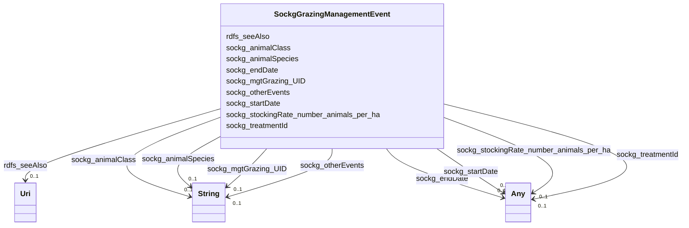

# Class: No class (entity type) name specified (sockg_GrazingManagementEvent)


_A GrazingManagementEvent represents a specific instance of land management practices aimed at optimizing the grazing of livestock on pasture. It encompasses various factors such as the timing and intensity of grazing, the types of animals involved, and the cycles of land use, ensuring sustainable agricultural practices._


This class occurs 1951 times.


URI: [sockg:GrazingManagementEvent](https://idir.uta.edu/sockg-ontology/docs/GrazingManagementEvent)





<!-- no inheritance hierarchy -->


## Slots

| Name | Cardinality and Range | Description | Inheritance | Occurrences |
| ---  | --- | --- | --- | --- |
| [rdfs_seeAlso](../slots/rdfs_seeAlso.md) | 0..1 <br/> [xsd:anyURI](http://www.w3.org/2001/XMLSchema#anyURI) | No slot (predicate) description specified <br/>  | direct | 1951 |
| [sockg_animalClass](../slots/sockg_animalClass.md) | 0..1 <br/> [xsd:string](http://www.w3.org/2001/XMLSchema#string) | No slot (predicate) description specified <br/>  | direct | 1833 |
| [sockg_stockingRate_number_animals_per_ha](../slots/sockg_stockingRate_number_animals_per_ha.md) | 0..1 <br/> [xsd:double](http://www.w3.org/2001/XMLSchema#double)&nbsp;or&nbsp;<br />[xsd:float](http://www.w3.org/2001/XMLSchema#float) | No slot (predicate) description specified <br/>  | direct | 1951 |
| [sockg_mgtGrazing_UID](../slots/sockg_mgtGrazing_UID.md) | 0..1 <br/> [xsd:string](http://www.w3.org/2001/XMLSchema#string) | No slot (predicate) description specified <br/>  | direct | 1951 |
| [sockg_treatmentId](../slots/sockg_treatmentId.md) | 0..1 <br/> [xsd:date](http://www.w3.org/2001/XMLSchema#date)&nbsp;or&nbsp;<br />[xsd:string](http://www.w3.org/2001/XMLSchema#string)&nbsp;or&nbsp;<br />[xsd:float](http://www.w3.org/2001/XMLSchema#float) | No slot (predicate) description specified <br/>  | direct | 1951 |
| [sockg_endDate](../slots/sockg_endDate.md) | 0..1 <br/> [xsd:date](http://www.w3.org/2001/XMLSchema#date)&nbsp;or&nbsp;<br />[xsd:string](http://www.w3.org/2001/XMLSchema#string) | No slot (predicate) description specified <br/>  | direct | 1951 |
| [sockg_animalSpecies](../slots/sockg_animalSpecies.md) | 0..1 <br/> [xsd:string](http://www.w3.org/2001/XMLSchema#string) | No slot (predicate) description specified <br/>  | direct | 1951 |
| [sockg_otherEvents](../slots/sockg_otherEvents.md) | 0..1 <br/> [xsd:string](http://www.w3.org/2001/XMLSchema#string) | No slot (predicate) description specified <br/>  | direct | 4 |
| [sockg_startDate](../slots/sockg_startDate.md) | 0..1 <br/> [xsd:date](http://www.w3.org/2001/XMLSchema#date)&nbsp;or&nbsp;<br />[xsd:string](http://www.w3.org/2001/XMLSchema#string) | No slot (predicate) description specified <br/>  | direct | 1951 |


## Usages

| used by | used in | type | used |
| ---  | --- | --- | --- |
| [SockgExperimentalUnit](../classes/SockgExperimentalUnit.md) | [sockg_hasGrazingManagementEvent](../slots/sockg_hasGrazingManagementEvent.md) | range | [SockgGrazingManagementEvent](../classes/SockgGrazingManagementEvent.md) |
| [SockgGrazingManagementEvent](../classes/SockgGrazingManagementEvent.md) | [sockg_animalClass](../slots/sockg_animalClass.md) | domain | [SockgGrazingManagementEvent](../classes/SockgGrazingManagementEvent.md) |
| [SockgGrazingManagementEvent](../classes/SockgGrazingManagementEvent.md) | [sockg_stockingRate_number_animals_per_ha](../slots/sockg_stockingRate_number_animals_per_ha.md) | domain | [SockgGrazingManagementEvent](../classes/SockgGrazingManagementEvent.md) |
| [SockgGrazingManagementEvent](../classes/SockgGrazingManagementEvent.md) | [sockg_mgtGrazing_UID](../slots/sockg_mgtGrazing_UID.md) | domain | [SockgGrazingManagementEvent](../classes/SockgGrazingManagementEvent.md) |
| [SockgGrazingManagementEvent](../classes/SockgGrazingManagementEvent.md) | [sockg_animalSpecies](../slots/sockg_animalSpecies.md) | domain | [SockgGrazingManagementEvent](../classes/SockgGrazingManagementEvent.md) |
| [SockgGrazingManagementEvent](../classes/SockgGrazingManagementEvent.md) | [sockg_otherEvents](../slots/sockg_otherEvents.md) | domain | [SockgGrazingManagementEvent](../classes/SockgGrazingManagementEvent.md) |


## See Also

* [https://lod.nal.usda.gov/nalt/28608](https://lod.nal.usda.gov/nalt/28608)


## LinkML Source

<!-- TODO: investigate https://stackoverflow.com/questions/37606292/how-to-create-tabbed-code-blocks-in-mkdocs-or-sphinx -->

### Direct

<details>

```yaml
name: sockg_GrazingManagementEvent
conforms_to: No schema conformance document specified
annotations:
  count:
    tag: count
    value: 1951
description: A GrazingManagementEvent represents a specific instance of land management
  practices aimed at optimizing the grazing of livestock on pasture. It encompasses
  various factors such as the timing and intensity of grazing, the types of animals
  involved, and the cycles of land use, ensuring sustainable agricultural practices.
title: No class (entity type) name specified
from_schema: soc-kg
see_also:
- https://lod.nal.usda.gov/nalt/28608
rank: 1000
slots:
- rdfs_seeAlso
- sockg_animalClass
- sockg_stockingRate_number_animals_per_ha
- sockg_mgtGrazing_UID
- sockg_treatmentId
- sockg_endDate
- sockg_animalSpecies
- sockg_otherEvents
- sockg_startDate
slot_usage:
  rdfs_seeAlso:
    name: rdfs_seeAlso
    annotations:
      uri:
        tag: uri
        value: 1951
  sockg_animalClass:
    name: sockg_animalClass
    annotations:
      string:
        tag: string
        value: 1833
  sockg_animalSpecies:
    name: sockg_animalSpecies
    annotations:
      string:
        tag: string
        value: 1951
  sockg_endDate:
    name: sockg_endDate
    annotations:
      string:
        tag: string
        value: 1951
  sockg_mgtGrazing_UID:
    name: sockg_mgtGrazing_UID
    annotations:
      string:
        tag: string
        value: 1951
  sockg_otherEvents:
    name: sockg_otherEvents
    annotations:
      string:
        tag: string
        value: 4
  sockg_startDate:
    name: sockg_startDate
    annotations:
      string:
        tag: string
        value: 1951
  sockg_stockingRate_number_animals_per_ha:
    name: sockg_stockingRate_number_animals_per_ha
    annotations:
      double:
        tag: double
        value: 1951
  sockg_treatmentId:
    name: sockg_treatmentId
    annotations:
      string:
        tag: string
        value: 1951
class_uri: sockg:GrazingManagementEvent

```
</details>

### Induced

<details>

```yaml
name: sockg_GrazingManagementEvent
conforms_to: No schema conformance document specified
annotations:
  count:
    tag: count
    value: 1951
description: A GrazingManagementEvent represents a specific instance of land management
  practices aimed at optimizing the grazing of livestock on pasture. It encompasses
  various factors such as the timing and intensity of grazing, the types of animals
  involved, and the cycles of land use, ensuring sustainable agricultural practices.
title: No class (entity type) name specified
from_schema: soc-kg
see_also:
- https://lod.nal.usda.gov/nalt/28608
rank: 1000
slot_usage:
  rdfs_seeAlso:
    name: rdfs_seeAlso
    annotations:
      uri:
        tag: uri
        value: 1951
  sockg_animalClass:
    name: sockg_animalClass
    annotations:
      string:
        tag: string
        value: 1833
  sockg_animalSpecies:
    name: sockg_animalSpecies
    annotations:
      string:
        tag: string
        value: 1951
  sockg_endDate:
    name: sockg_endDate
    annotations:
      string:
        tag: string
        value: 1951
  sockg_mgtGrazing_UID:
    name: sockg_mgtGrazing_UID
    annotations:
      string:
        tag: string
        value: 1951
  sockg_otherEvents:
    name: sockg_otherEvents
    annotations:
      string:
        tag: string
        value: 4
  sockg_startDate:
    name: sockg_startDate
    annotations:
      string:
        tag: string
        value: 1951
  sockg_stockingRate_number_animals_per_ha:
    name: sockg_stockingRate_number_animals_per_ha
    annotations:
      double:
        tag: double
        value: 1951
  sockg_treatmentId:
    name: sockg_treatmentId
    annotations:
      string:
        tag: string
        value: 1951
attributes:
  rdfs_seeAlso:
    name: rdfs_seeAlso
    annotations:
      uri:
        tag: uri
        value: 1951
    description: No slot (predicate) description specified
    examples:
    - object:
        example_object: https://lod.nal.usda.gov/nalt/4605
        example_object_type: uri
        example_predicate: rdfs:seeAlso
        example_subject: sockg:individuals/0
        example_subject_type: sockg_Amendment
    - object:
        example_object: https://lod.nal.usda.gov/nalt/5859
        example_object_type: uri
        example_predicate: rdfs:seeAlso
        example_subject: sockg:individuals/100000
        example_subject_type: sockg_GasSample
    - object:
        example_object: https://lod.nal.usda.gov/nalt/281219
        example_object_type: uri
        example_predicate: rdfs:seeAlso
        example_subject: sockg:individuals/163960
        example_subject_type: sockg_Grazing
    - object:
        example_object: https://lod.nal.usda.gov/nalt/4377260
        example_object_type: uri
        example_predicate: rdfs:seeAlso
        example_subject: sockg:individuals/170955
        example_subject_type: sockg_GrazingManagementEvent
    - object:
        example_object: https://lod.nal.usda.gov/nalt/131626
        example_object_type: uri
        example_predicate: rdfs:seeAlso
        example_subject: sockg:individuals/172906
        example_subject_type: sockg_Harvest
    - object:
        example_object: https://lod.nal.usda.gov/nalt/281219
        example_object_type: uri
        example_predicate: rdfs:seeAlso
        example_subject: sockg:individuals/191262
        example_subject_type: sockg_HarvestFraction
    - object:
        example_object: https://lod.nal.usda.gov/nalt/13189
        example_object_type: uri
        example_predicate: rdfs:seeAlso
        example_subject: sockg:individuals/203523
        example_subject_type: sockg_Organization
    - object:
        example_object: https://lod.nal.usda.gov/nalt/3927
        example_object_type: uri
        example_predicate: rdfs:seeAlso
        example_subject: sockg:individuals/203632
        example_subject_type: sockg_Pesticide
    - object:
        example_object: https://lod.nal.usda.gov/nalt/849
        example_object_type: uri
        example_predicate: rdfs:seeAlso
        example_subject: sockg:individuals/227674
        example_subject_type: sockg_ResidueManagementEvent
    - object:
        example_object: https://lod.nal.usda.gov/nalt/30158
        example_object_type: uri
        example_predicate: rdfs:seeAlso
        example_subject: sockg:individuals/230982
        example_subject_type: sockg_Rotation
    - object:
        example_object: https://lod.nal.usda.gov/nalt/302328
        example_object_type: uri
        example_predicate: rdfs:seeAlso
        example_subject: sockg:individuals/231056
        example_subject_type: sockg_Site
    - object:
        example_object: https://lod.nal.usda.gov/nalt/2726
        example_object_type: uri
        example_predicate: rdfs:seeAlso
        example_subject: sockg:individuals/235229
        example_subject_type: sockg_SoilBiologicalSample
    - object:
        example_object: https://lod.nal.usda.gov/nalt/7974
        example_object_type: uri
        example_predicate: rdfs:seeAlso
        example_subject: sockg:individuals/253451
        example_subject_type: sockg_SoilChemicalSample
    - object:
        example_object: https://lod.nal.usda.gov/nalt/302328
        example_object_type: uri
        example_predicate: rdfs:seeAlso
        example_subject: sockg:individuals/307284
        example_subject_type: sockg_SoilCover
    - object:
        example_object: https://lod.nal.usda.gov/nalt/5143
        example_object_type: uri
        example_predicate: rdfs:seeAlso
        example_subject: sockg:individuals/308318
        example_subject_type: sockg_SoilPhysicalSample
    - object:
        example_object: https://lod.nal.usda.gov/nalt/5430914
        example_object_type: uri
        example_predicate: rdfs:seeAlso
        example_subject: sockg:individuals/336400
        example_subject_type: sockg_State
    - object:
        example_object: https://lod.nal.usda.gov/nalt/7140
        example_object_type: uri
        example_predicate: rdfs:seeAlso
        example_subject: sockg:individuals/336419
        example_subject_type: sockg_Tillage
    - object:
        example_object: https://lod.nal.usda.gov/nalt/28616
        example_object_type: uri
        example_predicate: rdfs:seeAlso
        example_subject: sockg:individuals/363556
        example_subject_type: sockg_Treatment
    - object:
        example_object: https://lod.nal.usda.gov/nalt/2717
        example_object_type: uri
        example_predicate: rdfs:seeAlso
        example_subject: sockg:individuals/37796
        example_subject_type: sockg_BioMassCarbohydrate
    - object:
        example_object: https://lod.nal.usda.gov/nalt/7140
        example_object_type: uri
        example_predicate: rdfs:seeAlso
        example_subject: sockg:individuals/39163
        example_subject_type: sockg_BioMassEnergy
    - object:
        example_object: https://lod.nal.usda.gov/nalt/281219
        example_object_type: uri
        example_predicate: rdfs:seeAlso
        example_subject: sockg:individuals/39962
        example_subject_type: sockg_BioMassMineral
    - object:
        example_object: https://lod.nal.usda.gov/nalt/2714
        example_object_type: uri
        example_predicate: rdfs:seeAlso
        example_subject: sockg:individuals/439235
        example_subject_type: sockg_WeatherObservation
    - object:
        example_object: https://lod.nal.usda.gov/nalt/7485997
        example_object_type: uri
        example_predicate: rdfs:seeAlso
        example_subject: sockg:individuals/46864
        example_subject_type: sockg_City
    - object:
        example_object: https://lod.nal.usda.gov/nalt/2217129
        example_object_type: uri
        example_predicate: rdfs:seeAlso
        example_subject: sockg:individuals/46904
        example_subject_type: sockg_County
    - object:
        example_object: https://lod.nal.usda.gov/nalt/302328
        example_object_type: uri
        example_predicate: rdfs:seeAlso
        example_subject: sockg:individuals/46937
        example_subject_type: sockg_CropGrowthStage
    - object:
        example_object: https://lod.nal.usda.gov/nalt/976
        example_object_type: uri
        example_predicate: rdfs:seeAlso
        example_subject: sockg:individuals/51906
        example_subject_type: sockg_Experiment
    - object:
        example_object: https://lod.nal.usda.gov/nalt/9183
        example_object_type: uri
        example_predicate: rdfs:seeAlso
        example_subject: sockg:individuals/51937
        example_subject_type: sockg_ExperimentalUnit
    - object:
        example_object: https://lod.nal.usda.gov/nalt/7259
        example_object_type: uri
        example_predicate: rdfs:seeAlso
        example_subject: sockg:individuals/55800
        example_subject_type: sockg_Field
    - object:
        example_object: https://lod.nal.usda.gov/nalt/7140
        example_object_type: uri
        example_predicate: rdfs:seeAlso
        example_subject: sockg:individuals/200732
        example_subject_type: sockg_NutrientEfficiency
    - object:
        example_object: https://lod.nal.usda.gov/nalt/35067
        example_object_type: uri
        example_predicate: rdfs:seeAlso
        example_subject: sockg:individuals/203534
        example_subject_type: sockg_Person
    - object:
        example_object: https://lod.nal.usda.gov/nalt/5630
        example_object_type: uri
        example_predicate: rdfs:seeAlso
        example_subject: sockg:individuals/203988
        example_subject_type: sockg_PlantingEvent
    - object:
        example_object: https://lod.nal.usda.gov/nalt/61097
        example_object_type: uri
        example_predicate: rdfs:seeAlso
        example_subject: sockg:individuals/227438
        example_subject_type: sockg_Project
    - object:
        example_object: https://lod.nal.usda.gov/nalt/305490
        example_object_type: uri
        example_predicate: rdfs:seeAlso
        example_subject: sockg:individuals/227447
        example_subject_type: sockg_Publication
    - object:
        example_object: https://lod.nal.usda.gov/nalt/48678
        example_object_type: uri
        example_predicate: rdfs:seeAlso
        example_subject: sockg:individuals/227609
        example_subject_type: sockg_ResearchUnit
    - object:
        example_object: https://lod.nal.usda.gov/nalt/33020
        example_object_type: uri
        example_predicate: rdfs:seeAlso
        example_subject: sockg:individuals/231116
        example_subject_type: sockg_Soil
    - object:
        example_object: https://lod.nal.usda.gov/nalt/7140
        example_object_type: uri
        example_predicate: rdfs:seeAlso
        example_subject: sockg:individuals/364326
        example_subject_type: sockg_WaterQualityArea
    - object:
        example_object: https://lod.nal.usda.gov/nalt/281219
        example_object_type: uri
        example_predicate: rdfs:seeAlso
        example_subject: sockg:individuals/364993
        example_subject_type: sockg_WaterQualityConc
    - object:
        example_object: https://lod.nal.usda.gov/nalt/7259
        example_object_type: uri
        example_predicate: rdfs:seeAlso
        example_subject: sockg:individuals/513777
        example_subject_type: sockg_WeatherStation
    - object:
        example_object: https://lod.nal.usda.gov/nalt/281219
        example_object_type: uri
        example_predicate: rdfs:seeAlso
        example_subject: sockg:individuals/55858
        example_subject_type: sockg_GasNutrientLoss
    - object:
        example_object: https://lod.nal.usda.gov/nalt/281219
        example_object_type: uri
        example_predicate: rdfs:seeAlso
        example_subject: sockg:individuals/624572
        example_subject_type: sockg_WindErosionArea
    - object:
        example_object: https://lod.nal.usda.gov/nalt/7140
        example_object_type: uri
        example_predicate: rdfs:seeAlso
        example_subject: sockg:individuals/624587
        example_subject_type: sockg_YieldNutrientUptake
    from_schema: soc-kg
    rank: 1000
    slot_uri: rdfs:seeAlso
    alias: rdfs_seeAlso
    owner: sockg_GrazingManagementEvent
    domain_of:
    - sockg_Amendment
    - sockg_BioMassCarbohydrate
    - sockg_BioMassEnergy
    - sockg_BioMassMineral
    - sockg_City
    - sockg_County
    - sockg_CropGrowthStage
    - sockg_Experiment
    - sockg_ExperimentalUnit
    - sockg_Field
    - sockg_GasNutrientLoss
    - sockg_GasSample
    - sockg_Grazing
    - sockg_GrazingManagementEvent
    - sockg_Harvest
    - sockg_HarvestFraction
    - sockg_NutrientEfficiency
    - sockg_Organization
    - sockg_Person
    - sockg_Pesticide
    - sockg_PlantingEvent
    - sockg_Project
    - sockg_Publication
    - sockg_ResearchUnit
    - sockg_ResidueManagementEvent
    - sockg_Rotation
    - sockg_Site
    - sockg_Soil
    - sockg_SoilBiologicalSample
    - sockg_SoilChemicalSample
    - sockg_SoilCover
    - sockg_SoilPhysicalSample
    - sockg_State
    - sockg_Tillage
    - sockg_Treatment
    - sockg_WaterQualityArea
    - sockg_WaterQualityConc
    - sockg_WeatherObservation
    - sockg_WeatherStation
    - sockg_WindErosionArea
    - sockg_YieldNutrientUptake
    range: uri
  sockg_animalClass:
    name: sockg_animalClass
    annotations:
      string:
        tag: string
        value: 1833
    description: No slot (predicate) description specified
    title: No slot (predicate) name specified
    examples:
    - object:
        example_object: Neutered male
        example_object_type: string
        example_predicate: sockg:animalClass
        example_subject: sockg:individuals/170961
        example_subject_type: sockg_GrazingManagementEvent
    from_schema: soc-kg
    see_also:
    - https://lod.nal.usda.gov/nalt/4377260
    rank: 1000
    domain: sockg_GrazingManagementEvent
    slot_uri: sockg:animalClass
    alias: sockg_animalClass
    owner: sockg_GrazingManagementEvent
    domain_of:
    - sockg_GrazingManagementEvent
    range: string
  sockg_stockingRate_number_animals_per_ha:
    name: sockg_stockingRate_number_animals_per_ha
    annotations:
      double:
        tag: double
        value: 1951
    description: No slot (predicate) description specified
    title: No slot (predicate) name specified
    examples:
    - object:
        example_object: '0.0'
        example_object_type: double
        example_predicate: sockg:stockingRate_number_animals_per_ha
        example_subject: sockg:individuals/170955
        example_subject_type: sockg_GrazingManagementEvent
    from_schema: soc-kg
    see_also:
    - https://lod.nal.usda.gov/nalt/9267
    rank: 1000
    domain: sockg_GrazingManagementEvent
    slot_uri: sockg:stockingRate_number_animals_per_ha
    alias: sockg_stockingRate_number_animals_per_ha
    owner: sockg_GrazingManagementEvent
    domain_of:
    - sockg_GrazingManagementEvent
    range: Any
    any_of:
    - range: double
    - range: float
  sockg_mgtGrazing_UID:
    name: sockg_mgtGrazing_UID
    annotations:
      string:
        tag: string
        value: 1951
    description: No slot (predicate) description specified
    title: No slot (predicate) name specified
    examples:
    - object:
        example_object: AgCros_PAHAW_P3_2006-05-08_2006-05-12
        example_object_type: string
        example_predicate: sockg:mgtGrazing_UID
        example_subject: sockg:individuals/170955
        example_subject_type: sockg_GrazingManagementEvent
    from_schema: soc-kg
    rank: 1000
    domain: sockg_GrazingManagementEvent
    slot_uri: sockg:mgtGrazing_UID
    alias: sockg_mgtGrazing_UID
    owner: sockg_GrazingManagementEvent
    domain_of:
    - sockg_GrazingManagementEvent
    range: string
  sockg_treatmentId:
    name: sockg_treatmentId
    annotations:
      string:
        tag: string
        value: 1951
    description: No slot (predicate) description specified
    title: No slot (predicate) name specified
    examples:
    - object:
        example_object: PAHAW_ROT4
        example_object_type: string
        example_predicate: sockg:treatmentId
        example_subject: sockg:individuals/0
        example_subject_type: sockg_Amendment
    - object:
        example_object: NDMAHGPE_TANUR
        example_object_type: string
        example_predicate: sockg:treatmentId
        example_subject: sockg:individuals/100000
        example_subject_type: sockg_GasSample
    - object:
        example_object: GAJPCSR1_F1H1
        example_object_type: string
        example_predicate: sockg:treatmentId
        example_subject: sockg:individuals/163960
        example_subject_type: sockg_Grazing
    - object:
        example_object: PAHAW_PAST2
        example_object_type: string
        example_predicate: sockg:treatmentId
        example_subject: sockg:individuals/170955
        example_subject_type: sockg_GrazingManagementEvent
    - object:
        example_object: PAHAW_ROT1
        example_object_type: string
        example_predicate: sockg:treatmentId
        example_subject: sockg:individuals/172906
        example_subject_type: sockg_Harvest
    - object:
        example_object: MNMOFS_13
        example_object_type: string
        example_predicate: sockg:treatmentId
        example_subject: sockg:individuals/191262
        example_subject_type: sockg_HarvestFraction
    - object:
        example_object: PAHAW_ROT4
        example_object_type: string
        example_predicate: sockg:treatmentId
        example_subject: sockg:individuals/227674
        example_subject_type: sockg_ResidueManagementEvent
    - object:
        example_object: GAJPCSR1_F3H1
        example_object_type: string
        example_predicate: sockg:treatmentId
        example_subject: sockg:individuals/235229
        example_subject_type: sockg_SoilBiologicalSample
    - object:
        example_object: MNMOFS_44
        example_object_type: string
        example_predicate: sockg:treatmentId
        example_subject: sockg:individuals/253451
        example_subject_type: sockg_SoilChemicalSample
    - object:
        example_object: FullX200A
        example_object_type: string
        example_predicate: sockg:treatmentId
        example_subject: sockg:individuals/308318
        example_subject_type: sockg_SoilPhysicalSample
    - object:
        example_object: NDMAH3_C
        example_object_type: string
        example_predicate: sockg:treatmentId
        example_subject: sockg:individuals/363556
        example_subject_type: sockg_Treatment
    - object:
        example_object: MNSPReap_ST100
        example_object_type: string
        example_predicate: sockg:treatmentId
        example_subject: sockg:individuals/37796
        example_subject_type: sockg_BioMassCarbohydrate
    - object:
        example_object: SCFLSGI_100R
        example_object_type: string
        example_predicate: sockg:treatmentId
        example_subject: sockg:individuals/39163
        example_subject_type: sockg_BioMassEnergy
    - object:
        example_object: FullM125N
        example_object_type: string
        example_predicate: sockg:treatmentId
        example_subject: sockg:individuals/39962
        example_subject_type: sockg_BioMassMineral
    - object:
        example_object: INWLREAP_R50
        example_object_type: string
        example_predicate: sockg:treatmentId
        example_subject: sockg:individuals/46937
        example_subject_type: sockg_CropGrowthStage
    - object:
        example_object: MNMOCAL_N67
        example_object_type: string
        example_predicate: sockg:treatmentId
        example_subject: sockg:individuals/200732
        example_subject_type: sockg_NutrientEfficiency
    - object:
        example_object: MNMOFS_38
        example_object_type: string
        example_predicate: sockg:treatmentId
        example_subject: sockg:individuals/203988
        example_subject_type: sockg_PlantingEvent
    - object:
        example_object: WIPDBARN_SOIL
        example_object_type: string
        example_predicate: sockg:treatmentId
        example_subject: sockg:individuals/364326
        example_subject_type: sockg_WaterQualityArea
    - object:
        example_object: IAAMKELL_CC
        example_object_type: string
        example_predicate: sockg:treatmentId
        example_subject: sockg:individuals/364993
        example_subject_type: sockg_WaterQualityConc
    - object:
        example_object: IAAMKELL_NCC
        example_object_type: string
        example_predicate: sockg:treatmentId
        example_subject: sockg:individuals/55858
        example_subject_type: sockg_GasNutrientLoss
    - object:
        example_object: TXBSWEWC_N1985
        example_object_type: string
        example_predicate: sockg:treatmentId
        example_subject: sockg:individuals/624572
        example_subject_type: sockg_WindErosionArea
    - object:
        example_object: MNSP4R_U-S100
        example_object_type: string
        example_predicate: sockg:treatmentId
        example_subject: sockg:individuals/624587
        example_subject_type: sockg_YieldNutrientUptake
    from_schema: soc-kg
    rank: 1000
    slot_uri: sockg:treatmentId
    alias: sockg_treatmentId
    owner: sockg_GrazingManagementEvent
    domain_of:
    - sockg_Amendment
    - sockg_BioMassCarbohydrate
    - sockg_BioMassEnergy
    - sockg_BioMassMineral
    - sockg_CropGrowthStage
    - sockg_GasNutrientLoss
    - sockg_GasSample
    - sockg_Grazing
    - sockg_GrazingManagementEvent
    - sockg_Harvest
    - sockg_HarvestFraction
    - sockg_NutrientEfficiency
    - sockg_PlantingEvent
    - sockg_ResidueManagementEvent
    - sockg_SoilBiologicalSample
    - sockg_SoilChemicalSample
    - sockg_SoilPhysicalSample
    - sockg_Treatment
    - sockg_WaterQualityArea
    - sockg_WaterQualityConc
    - sockg_WindErosionArea
    - sockg_YieldNutrientUptake
    union_of:
    - '{''domain'': ''sockg_WaterQualityArea''}'
    - '{''domain'': ''sockg_GrazingManagementEvent''}'
    - '{''domain'': ''sockg_NutrientEfficiency''}'
    - '{''domain'': ''sockg_SoilBiologicalSample''}'
    - '{''domain'': ''sockg_SoilChemicalSample''}'
    - '{''domain'': ''sockg_SoilPhysicalSample''}'
    - '{''domain'': ''sockg_HarvestFraction''}'
    - '{''domain'': ''sockg_WaterQualityConc''}'
    - '{''domain'': ''sockg_ResidueManagementEvent''}'
    - '{''domain'': ''sockg_WindErosionArea''}'
    - '{''domain'': ''sockg_GasNutrientLoss''}'
    - '{''domain'': ''sockg_Amendment''}'
    - '{''domain'': ''sockg_YieldNutrientUptake''}'
    - '{''domain'': ''sockg_BioMassCarbohydrate''}'
    - '{''domain'': ''sockg_Treatment''}'
    range: Any
    any_of:
    - range: date
    - range: string
    - range: float
  sockg_endDate:
    name: sockg_endDate
    annotations:
      string:
        tag: string
        value: 1951
    description: No slot (predicate) description specified
    title: No slot (predicate) name specified
    examples:
    - object:
        example_object: '2006-05-12'
        example_object_type: string
        example_predicate: sockg:endDate
        example_subject: sockg:individuals/170955
        example_subject_type: sockg_GrazingManagementEvent
    - object:
        example_object: '2016-11-01'
        example_object_type: string
        example_predicate: sockg:endDate
        example_subject: sockg:individuals/51906
        example_subject_type: sockg_Experiment
    - object:
        example_object: '2011-12-31'
        example_object_type: string
        example_predicate: sockg:endDate
        example_subject: sockg:individuals/51937
        example_subject_type: sockg_ExperimentalUnit
    from_schema: soc-kg
    see_also:
    - https://lod.nal.usda.gov/nalt/9183
    rank: 1000
    slot_uri: sockg:endDate
    alias: sockg_endDate
    owner: sockg_GrazingManagementEvent
    domain_of:
    - sockg_Experiment
    - sockg_ExperimentalUnit
    - sockg_GrazingManagementEvent
    union_of:
    - '{''domain'': ''sockg_Amendment''}'
    - '{''domain'': ''sockg_ExperimentalUnit''}'
    - '{''domain'': ''sockg_GrazingManagementEvent''}'
    - '{''domain'': ''sockg_Experiment''}'
    range: Any
    any_of:
    - range: date
    - range: string
  sockg_animalSpecies:
    name: sockg_animalSpecies
    annotations:
      string:
        tag: string
        value: 1951
    description: No slot (predicate) description specified
    title: No slot (predicate) name specified
    examples:
    - object:
        example_object: Beef Cattle
        example_object_type: string
        example_predicate: sockg:animalSpecies
        example_subject: sockg:individuals/170955
        example_subject_type: sockg_GrazingManagementEvent
    from_schema: soc-kg
    see_also:
    - https://lod.nal.usda.gov/nalt/65
    rank: 1000
    domain: sockg_GrazingManagementEvent
    slot_uri: sockg:animalSpecies
    alias: sockg_animalSpecies
    owner: sockg_GrazingManagementEvent
    domain_of:
    - sockg_GrazingManagementEvent
    range: string
  sockg_otherEvents:
    name: sockg_otherEvents
    annotations:
      string:
        tag: string
        value: 4
    description: No slot (predicate) description specified
    title: No slot (predicate) name specified
    examples:
    - object:
        example_object: Across rows
        example_object_type: string
        example_predicate: sockg:otherEvents
        example_subject: sockg:individuals/172406
        example_subject_type: sockg_GrazingManagementEvent
    from_schema: soc-kg
    see_also:
    - https://lod.nal.usda.gov/nalt/9183
    rank: 1000
    domain: sockg_GrazingManagementEvent
    slot_uri: sockg:otherEvents
    alias: sockg_otherEvents
    owner: sockg_GrazingManagementEvent
    domain_of:
    - sockg_GrazingManagementEvent
    range: string
  sockg_startDate:
    name: sockg_startDate
    annotations:
      string:
        tag: string
        value: 1951
    description: No slot (predicate) description specified
    title: No slot (predicate) name specified
    examples:
    - object:
        example_object: '2012-06-05'
        example_object_type: string
        example_predicate: sockg:startDate
        example_subject: sockg:individuals/0
        example_subject_type: sockg_Amendment
    - object:
        example_object: '2006-05-08'
        example_object_type: string
        example_predicate: sockg:startDate
        example_subject: sockg:individuals/170955
        example_subject_type: sockg_GrazingManagementEvent
    - object:
        example_object: '1987-04-30'
        example_object_type: string
        example_predicate: sockg:startDate
        example_subject: sockg:individuals/336419
        example_subject_type: sockg_Tillage
    - object:
        example_object: '2007-04-01'
        example_object_type: string
        example_predicate: sockg:startDate
        example_subject: sockg:individuals/51906
        example_subject_type: sockg_Experiment
    - object:
        example_object: '2009-01-01'
        example_object_type: string
        example_predicate: sockg:startDate
        example_subject: sockg:individuals/51937
        example_subject_type: sockg_ExperimentalUnit
    - object:
        example_object: '2004-11-04'
        example_object_type: string
        example_predicate: sockg:startDate
        example_subject: sockg:individuals/203988
        example_subject_type: sockg_PlantingEvent
    from_schema: soc-kg
    see_also:
    - https://lod.nal.usda.gov/nalt/9183
    rank: 1000
    slot_uri: sockg:startDate
    alias: sockg_startDate
    owner: sockg_GrazingManagementEvent
    domain_of:
    - sockg_Amendment
    - sockg_Experiment
    - sockg_ExperimentalUnit
    - sockg_GrazingManagementEvent
    - sockg_PlantingEvent
    - sockg_Tillage
    union_of:
    - '{''domain'': ''sockg_ExperimentalUnit''}'
    - '{''domain'': ''sockg_GrazingManagementEvent''}'
    - '{''domain'': ''sockg_WeatherStation''}'
    - '{''domain'': ''sockg_Experiment''}'
    - '{''domain'': ''sockg_Amendment''}'
    range: Any
    any_of:
    - range: date
    - range: string
class_uri: sockg:GrazingManagementEvent

```
</details>