# Class: No class (entity type) name specified (sockg_Harvest)


_Harvest represents the process of collecting mature crops from the fields, with emphasis on various metrics such as grain quality, moisture levels, and biomass yield. This class encompasses critical parameters affecting crop performance and residue management, essential for sustainable agricultural practices._


This class occurs 18356 times.


URI: [sockg:Harvest](https://idir.uta.edu/sockg-ontology/docs/Harvest)

```mermaid
 classDiagram
    class SockgHarvest
    click SockgHarvest href "../SockgHarvest"
      SockgHarvest : rdfs_seeAlso
        
          
    
    
    SockgHarvest --> "0..1" Uri : rdfs_seeAlso
    click Uri href "../Uri"

        
      SockgHarvest : sockg_aboveGroundBiomass_kg_per_ha
        
          
    
    
    SockgHarvest --> "0..1" Any : sockg_aboveGroundBiomass_kg_per_ha
    click Any href "../Any"

        
      SockgHarvest : sockg_aboveGroundBiomassSd_kg_per_ha
        
          
    
    
    SockgHarvest --> "0..1" Any : sockg_aboveGroundBiomassSd_kg_per_ha
    click Any href "../Any"

        
      SockgHarvest : sockg_crop
        
          
    
    
    SockgHarvest --> "0..1" String : sockg_crop
    click String href "../String"

        
      SockgHarvest : sockg_date
        
          
    
    
    SockgHarvest --> "0..1" Any : sockg_date
    click Any href "../Any"

        
      SockgHarvest : sockg_driedHarvestedResidue_kg_per_ha
        
          
    
    
    SockgHarvest --> "0..1" Any : sockg_driedHarvestedResidue_kg_per_ha
    click Any href "../Any"

        
      SockgHarvest : sockg_grainCarbon_kgC_per_ha
        
          
    
    
    SockgHarvest --> "0..1" Any : sockg_grainCarbon_kgC_per_ha
    click Any href "../Any"

        
      SockgHarvest : sockg_grainCarbonSd_kgC_per_ha
        
          
    
    
    SockgHarvest --> "0..1" Double : sockg_grainCarbonSd_kgC_per_ha
    click Double href "../Double"

        
      SockgHarvest : sockg_grainMoisturePercent
        
          
    
    
    SockgHarvest --> "0..1" Any : sockg_grainMoisturePercent
    click Any href "../Any"

        
      SockgHarvest : sockg_grainMoisturePercentStd
        
          
    
    
    SockgHarvest --> "0..1" Double : sockg_grainMoisturePercentStd
    click Double href "../Double"

        
      SockgHarvest : sockg_grainNitrogen_kgN_per_ha
        
          
    
    
    SockgHarvest --> "0..1" Any : sockg_grainNitrogen_kgN_per_ha
    click Any href "../Any"

        
      SockgHarvest : sockg_grainNitrogenSd_kgN_per_ha
        
          
    
    
    SockgHarvest --> "0..1" Any : sockg_grainNitrogenSd_kgN_per_ha
    click Any href "../Any"

        
      SockgHarvest : sockg_grainYield_kg_per_ha
        
          
    
    
    SockgHarvest --> "0..1" Any : sockg_grainYield_kg_per_ha
    click Any href "../Any"

        
      SockgHarvest : sockg_grainYieldSd_kg_per_ha
        
          
    
    
    SockgHarvest --> "0..1" Any : sockg_grainYieldSd_kg_per_ha
    click Any href "../Any"

        
      SockgHarvest : sockg_growthStage
        
          
    
    
    SockgHarvest --> "0..1" String : sockg_growthStage
    click String href "../String"

        
      SockgHarvest : sockg_harvestedFrac
        
          
    
    
    SockgHarvest --> "0..1" String : sockg_harvestedFrac
    click String href "../String"

        
      SockgHarvest : sockg_harvestedResidueCarbon_kgC_per_ha
        
          
    
    
    SockgHarvest --> "0..1" Double : sockg_harvestedResidueCarbon_kgC_per_ha
    click Double href "../Double"

        
      SockgHarvest : sockg_harvestedResidueCarbonSd_kgC_per_ha
        
          
    
    
    SockgHarvest --> "0..1" Double : sockg_harvestedResidueCarbonSd_kgC_per_ha
    click Double href "../Double"

        
      SockgHarvest : sockg_harvestedResidueMoisturePercent
        
          
    
    
    SockgHarvest --> "0..1" Double : sockg_harvestedResidueMoisturePercent
    click Double href "../Double"

        
      SockgHarvest : sockg_harvestedResidueNitrogen_kgN_per_ha
        
          
    
    
    SockgHarvest --> "0..1" Double : sockg_harvestedResidueNitrogen_kgN_per_ha
    click Double href "../Double"

        
      SockgHarvest : sockg_harvestedResidueNitrogenSd_kgN_per_ha
        
          
    
    
    SockgHarvest --> "0..1" Double : sockg_harvestedResidueNitrogenSd_kgN_per_ha
    click Double href "../Double"

        
      SockgHarvest : sockg_measResidueMgnt_UID
        
          
    
    
    SockgHarvest --> "0..1" String : sockg_measResidueMgnt_UID
    click String href "../String"

        
      SockgHarvest : sockg_nonHarvestedResidueCarbonContent_kgC_per_ha
        
          
    
    
    SockgHarvest --> "0..1" Any : sockg_nonHarvestedResidueCarbonContent_kgC_per_ha
    click Any href "../Any"

        
      SockgHarvest : sockg_nonHarvestedResidueMass_kg_per_ha
        
          
    
    
    SockgHarvest --> "0..1" Any : sockg_nonHarvestedResidueMass_kg_per_ha
    click Any href "../Any"

        
      SockgHarvest : sockg_nonHarvestedResidueMoisturePercent
        
          
    
    
    SockgHarvest --> "0..1" Any : sockg_nonHarvestedResidueMoisturePercent
    click Any href "../Any"

        
      SockgHarvest : sockg_nonHarvestedResidueNitrogenContent_kgN_per_ha
        
          
    
    
    SockgHarvest --> "0..1" Any : sockg_nonHarvestedResidueNitrogenContent_kgN_per_ha
    click Any href "../Any"

        
      SockgHarvest : sockg_treatmentId
        
          
    
    
    SockgHarvest --> "0..1" Any : sockg_treatmentId
    click Any href "../Any"

        
      SockgHarvest : sockg_unitGrainWeight_mg
        
          
    
    
    SockgHarvest --> "0..1" Any : sockg_unitGrainWeight_mg
    click Any href "../Any"

        
      
```





<!-- no inheritance hierarchy -->


## Slots

| Name | Cardinality and Range | Description | Inheritance | Occurrences |
| ---  | --- | --- | --- | --- |
| [sockg_measResidueMgnt_UID](../slots/sockg_measResidueMgnt_UID.md) | 0..1 <br/> [xsd:string](http://www.w3.org/2001/XMLSchema#string) | No slot (predicate) description specified <br/>  | direct | 18356 |
| [sockg_crop](../slots/sockg_crop.md) | 0..1 <br/> [xsd:string](http://www.w3.org/2001/XMLSchema#string) | No slot (predicate) description specified <br/>  | direct | 18356 |
| [sockg_nonHarvestedResidueNitrogenContent_kgN_per_ha](../slots/sockg_nonHarvestedResidueNitrogenContent_kgN_per_ha.md) | 0..1 <br/> [xsd:float](http://www.w3.org/2001/XMLSchema#float)&nbsp;or&nbsp;<br />[xsd:double](http://www.w3.org/2001/XMLSchema#double) | No slot (predicate) description specified <br/>  | direct | 10384 |
| [sockg_grainCarbonSd_kgC_per_ha](../slots/sockg_grainCarbonSd_kgC_per_ha.md) | 0..1 <br/> [xsd:double](http://www.w3.org/2001/XMLSchema#double) | No slot (predicate) description specified <br/>  | direct | 72 |
| [sockg_grainNitrogenSd_kgN_per_ha](../slots/sockg_grainNitrogenSd_kgN_per_ha.md) | 0..1 <br/> [xsd:float](http://www.w3.org/2001/XMLSchema#float)&nbsp;or&nbsp;<br />[xsd:double](http://www.w3.org/2001/XMLSchema#double) | No slot (predicate) description specified <br/>  | direct | 70 |
| [sockg_nonHarvestedResidueMoisturePercent](../slots/sockg_nonHarvestedResidueMoisturePercent.md) | 0..1 <br/> [xsd:float](http://www.w3.org/2001/XMLSchema#float)&nbsp;or&nbsp;<br />[xsd:double](http://www.w3.org/2001/XMLSchema#double) | No slot (predicate) description specified <br/>  | direct | 1372 |
| [sockg_nonHarvestedResidueMass_kg_per_ha](../slots/sockg_nonHarvestedResidueMass_kg_per_ha.md) | 0..1 <br/> [xsd:float](http://www.w3.org/2001/XMLSchema#float)&nbsp;or&nbsp;<br />[xsd:double](http://www.w3.org/2001/XMLSchema#double) | No slot (predicate) description specified <br/>  | direct | 10748 |
| [sockg_unitGrainWeight_mg](../slots/sockg_unitGrainWeight_mg.md) | 0..1 <br/> [xsd:float](http://www.w3.org/2001/XMLSchema#float)&nbsp;or&nbsp;<br />[xsd:double](http://www.w3.org/2001/XMLSchema#double) | No slot (predicate) description specified <br/>  | direct | 120 |
| [sockg_driedHarvestedResidue_kg_per_ha](../slots/sockg_driedHarvestedResidue_kg_per_ha.md) | 0..1 <br/> [xsd:float](http://www.w3.org/2001/XMLSchema#float)&nbsp;or&nbsp;<br />[xsd:double](http://www.w3.org/2001/XMLSchema#double) | No slot (predicate) description specified <br/>  | direct | 1851 |
| [sockg_grainNitrogen_kgN_per_ha](../slots/sockg_grainNitrogen_kgN_per_ha.md) | 0..1 <br/> [xsd:float](http://www.w3.org/2001/XMLSchema#float)&nbsp;or&nbsp;<br />[xsd:double](http://www.w3.org/2001/XMLSchema#double) | No slot (predicate) description specified <br/>  | direct | 11255 |
| [sockg_grainMoisturePercentStd](../slots/sockg_grainMoisturePercentStd.md) | 0..1 <br/> [xsd:double](http://www.w3.org/2001/XMLSchema#double) | No slot (predicate) description specified <br/>  | direct | 30 |
| [sockg_harvestedResidueNitrogen_kgN_per_ha](../slots/sockg_harvestedResidueNitrogen_kgN_per_ha.md) | 0..1 <br/> [xsd:double](http://www.w3.org/2001/XMLSchema#double) | No slot (predicate) description specified <br/>  | direct | 602 |
| [sockg_aboveGroundBiomassSd_kg_per_ha](../slots/sockg_aboveGroundBiomassSd_kg_per_ha.md) | 0..1 <br/> [xsd:float](http://www.w3.org/2001/XMLSchema#float)&nbsp;or&nbsp;<br />[xsd:double](http://www.w3.org/2001/XMLSchema#double) | No slot (predicate) description specified <br/>  | direct | 32 |
| [sockg_harvestedResidueNitrogenSd_kgN_per_ha](../slots/sockg_harvestedResidueNitrogenSd_kgN_per_ha.md) | 0..1 <br/> [xsd:double](http://www.w3.org/2001/XMLSchema#double) | No slot (predicate) description specified <br/>  | direct | 40 |
| [sockg_growthStage](../slots/sockg_growthStage.md) | 0..1 <br/> [xsd:string](http://www.w3.org/2001/XMLSchema#string) | No slot (predicate) description specified <br/>  | direct | 17240 |
| [sockg_harvestedResidueMoisturePercent](../slots/sockg_harvestedResidueMoisturePercent.md) | 0..1 <br/> [xsd:double](http://www.w3.org/2001/XMLSchema#double) | No slot (predicate) description specified <br/>  | direct | 1086 |
| [sockg_grainYield_kg_per_ha](../slots/sockg_grainYield_kg_per_ha.md) | 0..1 <br/> [xsd:float](http://www.w3.org/2001/XMLSchema#float)&nbsp;or&nbsp;<br />[xsd:double](http://www.w3.org/2001/XMLSchema#double) | No slot (predicate) description specified <br/>  | direct | 15410 |
| [sockg_harvestedFrac](../slots/sockg_harvestedFrac.md) | 0..1 <br/> [xsd:string](http://www.w3.org/2001/XMLSchema#string) | No slot (predicate) description specified <br/>  | direct | 18047 |
| [sockg_date](../slots/sockg_date.md) | 0..1 <br/> [xsd:string](http://www.w3.org/2001/XMLSchema#string)&nbsp;or&nbsp;<br />[xsd:date](http://www.w3.org/2001/XMLSchema#date) | No slot (predicate) description specified <br/>  | direct | 18304 |
| [sockg_harvestedResidueCarbon_kgC_per_ha](../slots/sockg_harvestedResidueCarbon_kgC_per_ha.md) | 0..1 <br/> [xsd:double](http://www.w3.org/2001/XMLSchema#double) | No slot (predicate) description specified <br/>  | direct | 962 |
| [sockg_grainYieldSd_kg_per_ha](../slots/sockg_grainYieldSd_kg_per_ha.md) | 0..1 <br/> [xsd:float](http://www.w3.org/2001/XMLSchema#float)&nbsp;or&nbsp;<br />[xsd:double](http://www.w3.org/2001/XMLSchema#double) | No slot (predicate) description specified <br/>  | direct | 50 |
| [sockg_treatmentId](../slots/sockg_treatmentId.md) | 0..1 <br/> [xsd:float](http://www.w3.org/2001/XMLSchema#float)&nbsp;or&nbsp;<br />[xsd:string](http://www.w3.org/2001/XMLSchema#string)&nbsp;or&nbsp;<br />[xsd:date](http://www.w3.org/2001/XMLSchema#date) | No slot (predicate) description specified <br/>  | direct | 18356 |
| [sockg_nonHarvestedResidueCarbonContent_kgC_per_ha](../slots/sockg_nonHarvestedResidueCarbonContent_kgC_per_ha.md) | 0..1 <br/> [xsd:float](http://www.w3.org/2001/XMLSchema#float)&nbsp;or&nbsp;<br />[xsd:double](http://www.w3.org/2001/XMLSchema#double) | No slot (predicate) description specified <br/>  | direct | 9217 |
| [sockg_grainCarbon_kgC_per_ha](../slots/sockg_grainCarbon_kgC_per_ha.md) | 0..1 <br/> [xsd:float](http://www.w3.org/2001/XMLSchema#float)&nbsp;or&nbsp;<br />[xsd:double](http://www.w3.org/2001/XMLSchema#double) | No slot (predicate) description specified <br/>  | direct | 13693 |
| [sockg_aboveGroundBiomass_kg_per_ha](../slots/sockg_aboveGroundBiomass_kg_per_ha.md) | 0..1 <br/> [xsd:float](http://www.w3.org/2001/XMLSchema#float)&nbsp;or&nbsp;<br />[xsd:double](http://www.w3.org/2001/XMLSchema#double) | No slot (predicate) description specified <br/>  | direct | 11829 |
| [rdfs_seeAlso](../slots/rdfs_seeAlso.md) | 0..1 <br/> [xsd:anyURI](http://www.w3.org/2001/XMLSchema#anyURI) | No slot (predicate) description specified <br/>  | direct | 18356 |
| [sockg_grainMoisturePercent](../slots/sockg_grainMoisturePercent.md) | 0..1 <br/> [xsd:float](http://www.w3.org/2001/XMLSchema#float)&nbsp;or&nbsp;<br />[xsd:double](http://www.w3.org/2001/XMLSchema#double) | No slot (predicate) description specified <br/>  | direct | 8426 |
| [sockg_harvestedResidueCarbonSd_kgC_per_ha](../slots/sockg_harvestedResidueCarbonSd_kgC_per_ha.md) | 0..1 <br/> [xsd:double](http://www.w3.org/2001/XMLSchema#double) | No slot (predicate) description specified <br/>  | direct | 40 |


## Usages

| used by | used in | type | used |
| ---  | --- | --- | --- |
| [SockgExperimentalUnit](../classes/SockgExperimentalUnit.md) | [sockg_isHarvested](../slots/sockg_isHarvested.md) | range | [SockgHarvest](../classes/SockgHarvest.md) |
| [SockgHarvest](../classes/SockgHarvest.md) | [sockg_measResidueMgnt_UID](../slots/sockg_measResidueMgnt_UID.md) | domain | [SockgHarvest](../classes/SockgHarvest.md) |
| [SockgHarvest](../classes/SockgHarvest.md) | [sockg_nonHarvestedResidueNitrogenContent_kgN_per_ha](../slots/sockg_nonHarvestedResidueNitrogenContent_kgN_per_ha.md) | domain | [SockgHarvest](../classes/SockgHarvest.md) |
| [SockgHarvest](../classes/SockgHarvest.md) | [sockg_grainNitrogenSd_kgN_per_ha](../slots/sockg_grainNitrogenSd_kgN_per_ha.md) | domain | [SockgHarvest](../classes/SockgHarvest.md) |
| [SockgHarvest](../classes/SockgHarvest.md) | [sockg_nonHarvestedResidueMoisturePercent](../slots/sockg_nonHarvestedResidueMoisturePercent.md) | domain | [SockgHarvest](../classes/SockgHarvest.md) |
| [SockgHarvest](../classes/SockgHarvest.md) | [sockg_nonHarvestedResidueMass_kg_per_ha](../slots/sockg_nonHarvestedResidueMass_kg_per_ha.md) | domain | [SockgHarvest](../classes/SockgHarvest.md) |
| [SockgHarvest](../classes/SockgHarvest.md) | [sockg_unitGrainWeight_mg](../slots/sockg_unitGrainWeight_mg.md) | domain | [SockgHarvest](../classes/SockgHarvest.md) |
| [SockgHarvest](../classes/SockgHarvest.md) | [sockg_driedHarvestedResidue_kg_per_ha](../slots/sockg_driedHarvestedResidue_kg_per_ha.md) | domain | [SockgHarvest](../classes/SockgHarvest.md) |
| [SockgHarvest](../classes/SockgHarvest.md) | [sockg_grainNitrogen_kgN_per_ha](../slots/sockg_grainNitrogen_kgN_per_ha.md) | domain | [SockgHarvest](../classes/SockgHarvest.md) |
| [SockgHarvest](../classes/SockgHarvest.md) | [sockg_aboveGroundBiomassSd_kg_per_ha](../slots/sockg_aboveGroundBiomassSd_kg_per_ha.md) | domain | [SockgHarvest](../classes/SockgHarvest.md) |
| [SockgHarvest](../classes/SockgHarvest.md) | [sockg_grainYield_kg_per_ha](../slots/sockg_grainYield_kg_per_ha.md) | domain | [SockgHarvest](../classes/SockgHarvest.md) |
| [SockgHarvest](../classes/SockgHarvest.md) | [sockg_harvestedFrac](../slots/sockg_harvestedFrac.md) | domain | [SockgHarvest](../classes/SockgHarvest.md) |
| [SockgHarvest](../classes/SockgHarvest.md) | [sockg_grainYieldSd_kg_per_ha](../slots/sockg_grainYieldSd_kg_per_ha.md) | domain | [SockgHarvest](../classes/SockgHarvest.md) |
| [SockgHarvest](../classes/SockgHarvest.md) | [sockg_nonHarvestedResidueCarbonContent_kgC_per_ha](../slots/sockg_nonHarvestedResidueCarbonContent_kgC_per_ha.md) | domain | [SockgHarvest](../classes/SockgHarvest.md) |
| [SockgHarvest](../classes/SockgHarvest.md) | [sockg_grainCarbon_kgC_per_ha](../slots/sockg_grainCarbon_kgC_per_ha.md) | domain | [SockgHarvest](../classes/SockgHarvest.md) |
| [SockgHarvest](../classes/SockgHarvest.md) | [sockg_aboveGroundBiomass_kg_per_ha](../slots/sockg_aboveGroundBiomass_kg_per_ha.md) | domain | [SockgHarvest](../classes/SockgHarvest.md) |
| [SockgHarvest](../classes/SockgHarvest.md) | [sockg_grainMoisturePercent](../slots/sockg_grainMoisturePercent.md) | domain | [SockgHarvest](../classes/SockgHarvest.md) |


## See Also

* [https://lod.nal.usda.gov/nalt/30144](https://lod.nal.usda.gov/nalt/30144)


## LinkML Source

<!-- TODO: investigate https://stackoverflow.com/questions/37606292/how-to-create-tabbed-code-blocks-in-mkdocs-or-sphinx -->

### Direct

<details>

```yaml
name: sockg_Harvest
conforms_to: No schema conformance document specified
annotations:
  count:
    tag: count
    value: 18356
description: Harvest represents the process of collecting mature crops from the fields,
  with emphasis on various metrics such as grain quality, moisture levels, and biomass
  yield. This class encompasses critical parameters affecting crop performance and
  residue management, essential for sustainable agricultural practices.
title: No class (entity type) name specified
from_schema: soc-kg
see_also:
- https://lod.nal.usda.gov/nalt/30144
rank: 1000
slots:
- sockg_measResidueMgnt_UID
- sockg_crop
- sockg_nonHarvestedResidueNitrogenContent_kgN_per_ha
- sockg_grainCarbonSd_kgC_per_ha
- sockg_grainNitrogenSd_kgN_per_ha
- sockg_nonHarvestedResidueMoisturePercent
- sockg_nonHarvestedResidueMass_kg_per_ha
- sockg_unitGrainWeight_mg
- sockg_driedHarvestedResidue_kg_per_ha
- sockg_grainNitrogen_kgN_per_ha
- sockg_grainMoisturePercentStd
- sockg_harvestedResidueNitrogen_kgN_per_ha
- sockg_aboveGroundBiomassSd_kg_per_ha
- sockg_harvestedResidueNitrogenSd_kgN_per_ha
- sockg_growthStage
- sockg_harvestedResidueMoisturePercent
- sockg_grainYield_kg_per_ha
- sockg_harvestedFrac
- sockg_date
- sockg_harvestedResidueCarbon_kgC_per_ha
- sockg_grainYieldSd_kg_per_ha
- sockg_treatmentId
- sockg_nonHarvestedResidueCarbonContent_kgC_per_ha
- sockg_grainCarbon_kgC_per_ha
- sockg_aboveGroundBiomass_kg_per_ha
- rdfs_seeAlso
- sockg_grainMoisturePercent
- sockg_harvestedResidueCarbonSd_kgC_per_ha
slot_usage:
  rdfs_seeAlso:
    name: rdfs_seeAlso
    annotations:
      uri:
        tag: uri
        value: 18356
  sockg_aboveGroundBiomassSd_kg_per_ha:
    name: sockg_aboveGroundBiomassSd_kg_per_ha
    annotations:
      double:
        tag: double
        value: 32
  sockg_aboveGroundBiomass_kg_per_ha:
    name: sockg_aboveGroundBiomass_kg_per_ha
    annotations:
      double:
        tag: double
        value: 11829
  sockg_crop:
    name: sockg_crop
    annotations:
      string:
        tag: string
        value: 18356
  sockg_date:
    name: sockg_date
    annotations:
      string:
        tag: string
        value: 18304
  sockg_driedHarvestedResidue_kg_per_ha:
    name: sockg_driedHarvestedResidue_kg_per_ha
    annotations:
      double:
        tag: double
        value: 1851
  sockg_grainCarbonSd_kgC_per_ha:
    name: sockg_grainCarbonSd_kgC_per_ha
    annotations:
      double:
        tag: double
        value: 72
  sockg_grainCarbon_kgC_per_ha:
    name: sockg_grainCarbon_kgC_per_ha
    annotations:
      double:
        tag: double
        value: 13693
  sockg_grainMoisturePercent:
    name: sockg_grainMoisturePercent
    annotations:
      double:
        tag: double
        value: 8426
  sockg_grainMoisturePercentStd:
    name: sockg_grainMoisturePercentStd
    annotations:
      double:
        tag: double
        value: 30
  sockg_grainNitrogenSd_kgN_per_ha:
    name: sockg_grainNitrogenSd_kgN_per_ha
    annotations:
      double:
        tag: double
        value: 70
  sockg_grainNitrogen_kgN_per_ha:
    name: sockg_grainNitrogen_kgN_per_ha
    annotations:
      double:
        tag: double
        value: 11255
  sockg_grainYieldSd_kg_per_ha:
    name: sockg_grainYieldSd_kg_per_ha
    annotations:
      double:
        tag: double
        value: 50
  sockg_grainYield_kg_per_ha:
    name: sockg_grainYield_kg_per_ha
    annotations:
      double:
        tag: double
        value: 15410
  sockg_growthStage:
    name: sockg_growthStage
    annotations:
      string:
        tag: string
        value: 17240
  sockg_harvestedFrac:
    name: sockg_harvestedFrac
    annotations:
      string:
        tag: string
        value: 18047
  sockg_harvestedResidueCarbonSd_kgC_per_ha:
    name: sockg_harvestedResidueCarbonSd_kgC_per_ha
    annotations:
      double:
        tag: double
        value: 40
  sockg_harvestedResidueCarbon_kgC_per_ha:
    name: sockg_harvestedResidueCarbon_kgC_per_ha
    annotations:
      double:
        tag: double
        value: 962
  sockg_harvestedResidueMoisturePercent:
    name: sockg_harvestedResidueMoisturePercent
    annotations:
      double:
        tag: double
        value: 1086
  sockg_harvestedResidueNitrogenSd_kgN_per_ha:
    name: sockg_harvestedResidueNitrogenSd_kgN_per_ha
    annotations:
      double:
        tag: double
        value: 40
  sockg_harvestedResidueNitrogen_kgN_per_ha:
    name: sockg_harvestedResidueNitrogen_kgN_per_ha
    annotations:
      double:
        tag: double
        value: 602
  sockg_measResidueMgnt_UID:
    name: sockg_measResidueMgnt_UID
    annotations:
      string:
        tag: string
        value: 18356
  sockg_nonHarvestedResidueCarbonContent_kgC_per_ha:
    name: sockg_nonHarvestedResidueCarbonContent_kgC_per_ha
    annotations:
      double:
        tag: double
        value: 9217
  sockg_nonHarvestedResidueMass_kg_per_ha:
    name: sockg_nonHarvestedResidueMass_kg_per_ha
    annotations:
      double:
        tag: double
        value: 10748
  sockg_nonHarvestedResidueMoisturePercent:
    name: sockg_nonHarvestedResidueMoisturePercent
    annotations:
      double:
        tag: double
        value: 1372
  sockg_nonHarvestedResidueNitrogenContent_kgN_per_ha:
    name: sockg_nonHarvestedResidueNitrogenContent_kgN_per_ha
    annotations:
      double:
        tag: double
        value: 10384
  sockg_treatmentId:
    name: sockg_treatmentId
    annotations:
      string:
        tag: string
        value: 18356
  sockg_unitGrainWeight_mg:
    name: sockg_unitGrainWeight_mg
    annotations:
      double:
        tag: double
        value: 120
class_uri: sockg:Harvest

```
</details>

### Induced

<details>

```yaml
name: sockg_Harvest
conforms_to: No schema conformance document specified
annotations:
  count:
    tag: count
    value: 18356
description: Harvest represents the process of collecting mature crops from the fields,
  with emphasis on various metrics such as grain quality, moisture levels, and biomass
  yield. This class encompasses critical parameters affecting crop performance and
  residue management, essential for sustainable agricultural practices.
title: No class (entity type) name specified
from_schema: soc-kg
see_also:
- https://lod.nal.usda.gov/nalt/30144
rank: 1000
slot_usage:
  rdfs_seeAlso:
    name: rdfs_seeAlso
    annotations:
      uri:
        tag: uri
        value: 18356
  sockg_aboveGroundBiomassSd_kg_per_ha:
    name: sockg_aboveGroundBiomassSd_kg_per_ha
    annotations:
      double:
        tag: double
        value: 32
  sockg_aboveGroundBiomass_kg_per_ha:
    name: sockg_aboveGroundBiomass_kg_per_ha
    annotations:
      double:
        tag: double
        value: 11829
  sockg_crop:
    name: sockg_crop
    annotations:
      string:
        tag: string
        value: 18356
  sockg_date:
    name: sockg_date
    annotations:
      string:
        tag: string
        value: 18304
  sockg_driedHarvestedResidue_kg_per_ha:
    name: sockg_driedHarvestedResidue_kg_per_ha
    annotations:
      double:
        tag: double
        value: 1851
  sockg_grainCarbonSd_kgC_per_ha:
    name: sockg_grainCarbonSd_kgC_per_ha
    annotations:
      double:
        tag: double
        value: 72
  sockg_grainCarbon_kgC_per_ha:
    name: sockg_grainCarbon_kgC_per_ha
    annotations:
      double:
        tag: double
        value: 13693
  sockg_grainMoisturePercent:
    name: sockg_grainMoisturePercent
    annotations:
      double:
        tag: double
        value: 8426
  sockg_grainMoisturePercentStd:
    name: sockg_grainMoisturePercentStd
    annotations:
      double:
        tag: double
        value: 30
  sockg_grainNitrogenSd_kgN_per_ha:
    name: sockg_grainNitrogenSd_kgN_per_ha
    annotations:
      double:
        tag: double
        value: 70
  sockg_grainNitrogen_kgN_per_ha:
    name: sockg_grainNitrogen_kgN_per_ha
    annotations:
      double:
        tag: double
        value: 11255
  sockg_grainYieldSd_kg_per_ha:
    name: sockg_grainYieldSd_kg_per_ha
    annotations:
      double:
        tag: double
        value: 50
  sockg_grainYield_kg_per_ha:
    name: sockg_grainYield_kg_per_ha
    annotations:
      double:
        tag: double
        value: 15410
  sockg_growthStage:
    name: sockg_growthStage
    annotations:
      string:
        tag: string
        value: 17240
  sockg_harvestedFrac:
    name: sockg_harvestedFrac
    annotations:
      string:
        tag: string
        value: 18047
  sockg_harvestedResidueCarbonSd_kgC_per_ha:
    name: sockg_harvestedResidueCarbonSd_kgC_per_ha
    annotations:
      double:
        tag: double
        value: 40
  sockg_harvestedResidueCarbon_kgC_per_ha:
    name: sockg_harvestedResidueCarbon_kgC_per_ha
    annotations:
      double:
        tag: double
        value: 962
  sockg_harvestedResidueMoisturePercent:
    name: sockg_harvestedResidueMoisturePercent
    annotations:
      double:
        tag: double
        value: 1086
  sockg_harvestedResidueNitrogenSd_kgN_per_ha:
    name: sockg_harvestedResidueNitrogenSd_kgN_per_ha
    annotations:
      double:
        tag: double
        value: 40
  sockg_harvestedResidueNitrogen_kgN_per_ha:
    name: sockg_harvestedResidueNitrogen_kgN_per_ha
    annotations:
      double:
        tag: double
        value: 602
  sockg_measResidueMgnt_UID:
    name: sockg_measResidueMgnt_UID
    annotations:
      string:
        tag: string
        value: 18356
  sockg_nonHarvestedResidueCarbonContent_kgC_per_ha:
    name: sockg_nonHarvestedResidueCarbonContent_kgC_per_ha
    annotations:
      double:
        tag: double
        value: 9217
  sockg_nonHarvestedResidueMass_kg_per_ha:
    name: sockg_nonHarvestedResidueMass_kg_per_ha
    annotations:
      double:
        tag: double
        value: 10748
  sockg_nonHarvestedResidueMoisturePercent:
    name: sockg_nonHarvestedResidueMoisturePercent
    annotations:
      double:
        tag: double
        value: 1372
  sockg_nonHarvestedResidueNitrogenContent_kgN_per_ha:
    name: sockg_nonHarvestedResidueNitrogenContent_kgN_per_ha
    annotations:
      double:
        tag: double
        value: 10384
  sockg_treatmentId:
    name: sockg_treatmentId
    annotations:
      string:
        tag: string
        value: 18356
  sockg_unitGrainWeight_mg:
    name: sockg_unitGrainWeight_mg
    annotations:
      double:
        tag: double
        value: 120
attributes:
  sockg_measResidueMgnt_UID:
    name: sockg_measResidueMgnt_UID
    annotations:
      string:
        tag: string
        value: 18356
    description: No slot (predicate) description specified
    title: No slot (predicate) name specified
    examples:
    - object:
        example_object: AgCros_PAHAW_211_2007-11-14_Glycine_max_Soybean_
        example_object_type: string
        example_predicate: sockg:measResidueMgnt_UID
        example_subject: sockg:individuals/172906
        example_subject_type: sockg_Harvest
    from_schema: soc-kg
    rank: 1000
    domain: sockg_Harvest
    slot_uri: sockg:measResidueMgnt_UID
    alias: sockg_measResidueMgnt_UID
    owner: sockg_Harvest
    domain_of:
    - sockg_Harvest
    range: string
  sockg_crop:
    name: sockg_crop
    annotations:
      string:
        tag: string
        value: 18356
    description: No slot (predicate) description specified
    title: No slot (predicate) name specified
    examples:
    - object:
        example_object: Glycine max (Soybean)
        example_object_type: string
        example_predicate: sockg:crop
        example_subject: sockg:individuals/0
        example_subject_type: sockg_Amendment
    - object:
        example_object: Rangeland
        example_object_type: string
        example_predicate: sockg:crop
        example_subject: sockg:individuals/100000
        example_subject_type: sockg_GasSample
    - object:
        example_object: Glycine max (Soybean)
        example_object_type: string
        example_predicate: sockg:crop
        example_subject: sockg:individuals/172906
        example_subject_type: sockg_Harvest
    - object:
        example_object: Zea mays (Corn)
        example_object_type: string
        example_predicate: sockg:crop
        example_subject: sockg:individuals/191262
        example_subject_type: sockg_HarvestFraction
    - object:
        example_object: Zea mays (Corn)
        example_object_type: string
        example_predicate: sockg:crop
        example_subject: sockg:individuals/227674
        example_subject_type: sockg_ResidueManagementEvent
    - object:
        example_object: Zea mays (Corn)
        example_object_type: string
        example_predicate: sockg:crop
        example_subject: sockg:individuals/37796
        example_subject_type: sockg_BioMassCarbohydrate
    - object:
        example_object: Zea mays (Corn)
        example_object_type: string
        example_predicate: sockg:crop
        example_subject: sockg:individuals/39163
        example_subject_type: sockg_BioMassEnergy
    - object:
        example_object: Zea mays (Corn)
        example_object_type: string
        example_predicate: sockg:crop
        example_subject: sockg:individuals/39962
        example_subject_type: sockg_BioMassMineral
    - object:
        example_object: Zea mays (Corn)
        example_object_type: string
        example_predicate: sockg:crop
        example_subject: sockg:individuals/46937
        example_subject_type: sockg_CropGrowthStage
    - object:
        example_object: Calendula officinalis L. (Calendula)
        example_object_type: string
        example_predicate: sockg:crop
        example_subject: sockg:individuals/200732
        example_subject_type: sockg_NutrientEfficiency
    - object:
        example_object: Secale cereale (Rye)
        example_object_type: string
        example_predicate: sockg:crop
        example_subject: sockg:individuals/203988
        example_subject_type: sockg_PlantingEvent
    - object:
        example_object: Glycine max (Soybean)
        example_object_type: string
        example_predicate: sockg:crop
        example_subject: sockg:individuals/364993
        example_subject_type: sockg_WaterQualityConc
    - object:
        example_object: Zea mays (Corn)
        example_object_type: string
        example_predicate: sockg:crop
        example_subject: sockg:individuals/55859
        example_subject_type: sockg_GasNutrientLoss
    - object:
        example_object: Zea mays (Corn)
        example_object_type: string
        example_predicate: sockg:crop
        example_subject: sockg:individuals/624587
        example_subject_type: sockg_YieldNutrientUptake
    from_schema: soc-kg
    see_also:
    - https://lod.nal.usda.gov/nalt/7140
    rank: 1000
    slot_uri: sockg:crop
    alias: sockg_crop
    owner: sockg_Harvest
    domain_of:
    - sockg_Amendment
    - sockg_BioMassCarbohydrate
    - sockg_BioMassEnergy
    - sockg_BioMassMineral
    - sockg_CropGrowthStage
    - sockg_GasNutrientLoss
    - sockg_GasSample
    - sockg_Harvest
    - sockg_HarvestFraction
    - sockg_NutrientEfficiency
    - sockg_PlantingEvent
    - sockg_ResidueManagementEvent
    - sockg_WaterQualityConc
    - sockg_YieldNutrientUptake
    union_of:
    - '{''domain'': ''sockg_WaterQualityArea''}'
    - '{''domain'': ''sockg_WindErosionArea''}'
    - '{''domain'': ''sockg_NutrientEfficiency''}'
    - '{''domain'': ''sockg_WaterQualityConc''}'
    - '{''domain'': ''sockg_GasNutrientLoss''}'
    - '{''domain'': ''sockg_YieldNutrientUptake''}'
    - '{''domain'': ''sockg_BioMassMineral''}'
    - '{''domain'': ''sockg_BioMassCarbohydrate''}'
    - '{''domain'': ''sockg_BioMassEnergy''}'
    - '{''domain'': ''sockg_Tillage''}'
    range: string
  sockg_nonHarvestedResidueNitrogenContent_kgN_per_ha:
    name: sockg_nonHarvestedResidueNitrogenContent_kgN_per_ha
    annotations:
      double:
        tag: double
        value: 10384
    description: No slot (predicate) description specified
    title: No slot (predicate) name specified
    examples:
    - object:
        example_object: '11.29384'
        example_object_type: double
        example_predicate: sockg:nonHarvestedResidueNitrogenContent_kgN_per_ha
        example_subject: sockg:individuals/173031
        example_subject_type: sockg_Harvest
    from_schema: soc-kg
    see_also:
    - https://lod.nal.usda.gov/nalt/7829
    rank: 1000
    domain: sockg_Harvest
    slot_uri: sockg:nonHarvestedResidueNitrogenContent_kgN_per_ha
    alias: sockg_nonHarvestedResidueNitrogenContent_kgN_per_ha
    owner: sockg_Harvest
    domain_of:
    - sockg_Harvest
    range: Any
    any_of:
    - range: float
    - range: double
  sockg_grainCarbonSd_kgC_per_ha:
    name: sockg_grainCarbonSd_kgC_per_ha
    annotations:
      double:
        tag: double
        value: 72
    description: No slot (predicate) description specified
    examples:
    - object:
        example_object: '248.0'
        example_object_type: double
        example_predicate: sockg:grainCarbonSd_kgC_per_ha
        example_subject: sockg:individuals/174293
        example_subject_type: sockg_Harvest
    from_schema: soc-kg
    rank: 1000
    slot_uri: sockg:grainCarbonSd_kgC_per_ha
    alias: sockg_grainCarbonSd_kgC_per_ha
    owner: sockg_Harvest
    domain_of:
    - sockg_Harvest
    range: double
  sockg_grainNitrogenSd_kgN_per_ha:
    name: sockg_grainNitrogenSd_kgN_per_ha
    annotations:
      double:
        tag: double
        value: 70
    description: No slot (predicate) description specified
    title: No slot (predicate) name specified
    examples:
    - object:
        example_object: '7.88'
        example_object_type: double
        example_predicate: sockg:grainNitrogenSd_kgN_per_ha
        example_subject: sockg:individuals/182268
        example_subject_type: sockg_Harvest
    from_schema: soc-kg
    see_also:
    - https://lod.nal.usda.gov/nalt/325751
    rank: 1000
    domain: sockg_Harvest
    slot_uri: sockg:grainNitrogenSd_kgN_per_ha
    alias: sockg_grainNitrogenSd_kgN_per_ha
    owner: sockg_Harvest
    domain_of:
    - sockg_Harvest
    range: Any
    any_of:
    - range: float
    - range: double
  sockg_nonHarvestedResidueMoisturePercent:
    name: sockg_nonHarvestedResidueMoisturePercent
    annotations:
      double:
        tag: double
        value: 1372
    description: No slot (predicate) description specified
    title: No slot (predicate) name specified
    examples:
    - object:
        example_object: '3.055556'
        example_object_type: double
        example_predicate: sockg:nonHarvestedResidueMoisturePercent
        example_subject: sockg:individuals/173031
        example_subject_type: sockg_Harvest
    from_schema: soc-kg
    see_also:
    - https://lod.nal.usda.gov/nalt/18883
    rank: 1000
    domain: sockg_Harvest
    slot_uri: sockg:nonHarvestedResidueMoisturePercent
    alias: sockg_nonHarvestedResidueMoisturePercent
    owner: sockg_Harvest
    domain_of:
    - sockg_Harvest
    range: Any
    any_of:
    - range: float
    - range: double
  sockg_nonHarvestedResidueMass_kg_per_ha:
    name: sockg_nonHarvestedResidueMass_kg_per_ha
    annotations:
      double:
        tag: double
        value: 10748
    description: No slot (predicate) description specified
    title: No slot (predicate) name specified
    examples:
    - object:
        example_object: '1104.5'
        example_object_type: double
        example_predicate: sockg:nonHarvestedResidueMass_kg_per_ha
        example_subject: sockg:individuals/173031
        example_subject_type: sockg_Harvest
    from_schema: soc-kg
    see_also:
    - https://lod.nal.usda.gov/nalt/51604
    rank: 1000
    domain: sockg_Harvest
    slot_uri: sockg:nonHarvestedResidueMass_kg_per_ha
    alias: sockg_nonHarvestedResidueMass_kg_per_ha
    owner: sockg_Harvest
    domain_of:
    - sockg_Harvest
    range: Any
    any_of:
    - range: float
    - range: double
  sockg_unitGrainWeight_mg:
    name: sockg_unitGrainWeight_mg
    annotations:
      double:
        tag: double
        value: 120
    description: No slot (predicate) description specified
    title: No slot (predicate) name specified
    examples:
    - object:
        example_object: '894.7'
        example_object_type: double
        example_predicate: sockg:unitGrainWeight_mg
        example_subject: sockg:individuals/173872
        example_subject_type: sockg_Harvest
    from_schema: soc-kg
    rank: 1000
    domain: sockg_Harvest
    slot_uri: sockg:unitGrainWeight_mg
    alias: sockg_unitGrainWeight_mg
    owner: sockg_Harvest
    domain_of:
    - sockg_Harvest
    range: Any
    any_of:
    - range: float
    - range: double
  sockg_driedHarvestedResidue_kg_per_ha:
    name: sockg_driedHarvestedResidue_kg_per_ha
    annotations:
      double:
        tag: double
        value: 1851
    description: No slot (predicate) description specified
    title: No slot (predicate) name specified
    examples:
    - object:
        example_object: '22531.85'
        example_object_type: double
        example_predicate: sockg:driedHarvestedResidue_kg_per_ha
        example_subject: sockg:individuals/173007
        example_subject_type: sockg_Harvest
    from_schema: soc-kg
    rank: 1000
    domain: sockg_Harvest
    slot_uri: sockg:driedHarvestedResidue_kg_per_ha
    alias: sockg_driedHarvestedResidue_kg_per_ha
    owner: sockg_Harvest
    domain_of:
    - sockg_Harvest
    range: Any
    any_of:
    - range: float
    - range: double
  sockg_grainNitrogen_kgN_per_ha:
    name: sockg_grainNitrogen_kgN_per_ha
    annotations:
      double:
        tag: double
        value: 11255
    description: No slot (predicate) description specified
    title: No slot (predicate) name specified
    examples:
    - object:
        example_object: '85.73225'
        example_object_type: double
        example_predicate: sockg:grainNitrogen_kgN_per_ha
        example_subject: sockg:individuals/173031
        example_subject_type: sockg_Harvest
    from_schema: soc-kg
    see_also:
    - https://lod.nal.usda.gov/nalt/325751
    rank: 1000
    domain: sockg_Harvest
    slot_uri: sockg:grainNitrogen_kgN_per_ha
    alias: sockg_grainNitrogen_kgN_per_ha
    owner: sockg_Harvest
    domain_of:
    - sockg_Harvest
    range: Any
    any_of:
    - range: float
    - range: double
  sockg_grainMoisturePercentStd:
    name: sockg_grainMoisturePercentStd
    annotations:
      double:
        tag: double
        value: 30
    description: No slot (predicate) description specified
    examples:
    - object:
        example_object: '0.1'
        example_object_type: double
        example_predicate: sockg:grainMoisturePercentStd
        example_subject: sockg:individuals/182268
        example_subject_type: sockg_Harvest
    from_schema: soc-kg
    rank: 1000
    slot_uri: sockg:grainMoisturePercentStd
    alias: sockg_grainMoisturePercentStd
    owner: sockg_Harvest
    domain_of:
    - sockg_Harvest
    range: double
  sockg_harvestedResidueNitrogen_kgN_per_ha:
    name: sockg_harvestedResidueNitrogen_kgN_per_ha
    annotations:
      double:
        tag: double
        value: 602
    description: No slot (predicate) description specified
    examples:
    - object:
        example_object: '255.0066'
        example_object_type: double
        example_predicate: sockg:harvestedResidueNitrogen_kgN_per_ha
        example_subject: sockg:individuals/173007
        example_subject_type: sockg_Harvest
    from_schema: soc-kg
    rank: 1000
    slot_uri: sockg:harvestedResidueNitrogen_kgN_per_ha
    alias: sockg_harvestedResidueNitrogen_kgN_per_ha
    owner: sockg_Harvest
    domain_of:
    - sockg_Harvest
    range: double
  sockg_aboveGroundBiomassSd_kg_per_ha:
    name: sockg_aboveGroundBiomassSd_kg_per_ha
    annotations:
      double:
        tag: double
        value: 32
    description: No slot (predicate) description specified
    title: No slot (predicate) name specified
    examples:
    - object:
        example_object: '334.0'
        example_object_type: double
        example_predicate: sockg:aboveGroundBiomassSd_kg_per_ha
        example_subject: sockg:individuals/174293
        example_subject_type: sockg_Harvest
    from_schema: soc-kg
    see_also:
    - https://lod.nal.usda.gov/nalt/131626
    rank: 1000
    domain: sockg_Harvest
    slot_uri: sockg:aboveGroundBiomassSd_kg_per_ha
    alias: sockg_aboveGroundBiomassSd_kg_per_ha
    owner: sockg_Harvest
    domain_of:
    - sockg_Harvest
    range: Any
    any_of:
    - range: float
    - range: double
  sockg_harvestedResidueNitrogenSd_kgN_per_ha:
    name: sockg_harvestedResidueNitrogenSd_kgN_per_ha
    annotations:
      double:
        tag: double
        value: 40
    description: No slot (predicate) description specified
    examples:
    - object:
        example_object: '0.0'
        example_object_type: double
        example_predicate: sockg:harvestedResidueNitrogenSd_kgN_per_ha
        example_subject: sockg:individuals/187099
        example_subject_type: sockg_Harvest
    from_schema: soc-kg
    rank: 1000
    slot_uri: sockg:harvestedResidueNitrogenSd_kgN_per_ha
    alias: sockg_harvestedResidueNitrogenSd_kgN_per_ha
    owner: sockg_Harvest
    domain_of:
    - sockg_Harvest
    range: double
  sockg_growthStage:
    name: sockg_growthStage
    annotations:
      string:
        tag: string
        value: 17240
    description: No slot (predicate) description specified
    title: No slot (predicate) name specified
    examples:
    - object:
        example_object: Maturity
        example_object_type: string
        example_predicate: sockg:growthStage
        example_subject: sockg:individuals/163960
        example_subject_type: sockg_Grazing
    - object:
        example_object: Harvest
        example_object_type: string
        example_predicate: sockg:growthStage
        example_subject: sockg:individuals/172911
        example_subject_type: sockg_Harvest
    - object:
        example_object: V7
        example_object_type: string
        example_predicate: sockg:growthStage
        example_subject: sockg:individuals/191262
        example_subject_type: sockg_HarvestFraction
    - object:
        example_object: Maturity
        example_object_type: string
        example_predicate: sockg:growthStage
        example_subject: sockg:individuals/37796
        example_subject_type: sockg_BioMassCarbohydrate
    - object:
        example_object: Harvest
        example_object_type: string
        example_predicate: sockg:growthStage
        example_subject: sockg:individuals/39163
        example_subject_type: sockg_BioMassEnergy
    - object:
        example_object: Maturity
        example_object_type: string
        example_predicate: sockg:growthStage
        example_subject: sockg:individuals/39962
        example_subject_type: sockg_BioMassMineral
    - object:
        example_object: R6
        example_object_type: string
        example_predicate: sockg:growthStage
        example_subject: sockg:individuals/46937
        example_subject_type: sockg_CropGrowthStage
    - object:
        example_object: Maturity
        example_object_type: string
        example_predicate: sockg:growthStage
        example_subject: sockg:individuals/200732
        example_subject_type: sockg_NutrientEfficiency
    - object:
        example_object: Pre-graze
        example_object_type: string
        example_predicate: sockg:growthStage
        example_subject: sockg:individuals/364993
        example_subject_type: sockg_WaterQualityConc
    - object:
        example_object: Pre-graze
        example_object_type: string
        example_predicate: sockg:growthStage
        example_subject: sockg:individuals/55858
        example_subject_type: sockg_GasNutrientLoss
    - object:
        example_object: Pre-graze
        example_object_type: string
        example_predicate: sockg:growthStage
        example_subject: sockg:individuals/624572
        example_subject_type: sockg_WindErosionArea
    - object:
        example_object: Harvest
        example_object_type: string
        example_predicate: sockg:growthStage
        example_subject: sockg:individuals/624587
        example_subject_type: sockg_YieldNutrientUptake
    from_schema: soc-kg
    see_also:
    - https://lod.nal.usda.gov/nalt/7140
    rank: 1000
    slot_uri: sockg:growthStage
    alias: sockg_growthStage
    owner: sockg_Harvest
    domain_of:
    - sockg_BioMassCarbohydrate
    - sockg_BioMassEnergy
    - sockg_BioMassMineral
    - sockg_CropGrowthStage
    - sockg_GasNutrientLoss
    - sockg_Grazing
    - sockg_Harvest
    - sockg_HarvestFraction
    - sockg_NutrientEfficiency
    - sockg_WaterQualityConc
    - sockg_WindErosionArea
    - sockg_YieldNutrientUptake
    union_of:
    - '{''domain'': ''sockg_WaterQualityArea''}'
    - '{''domain'': ''sockg_WindErosionArea''}'
    - '{''domain'': ''sockg_NutrientEfficiency''}'
    - '{''domain'': ''sockg_WaterQualityConc''}'
    - '{''domain'': ''sockg_CropGrowthStage''}'
    - '{''domain'': ''sockg_Grazing''}'
    - '{''domain'': ''sockg_GasNutrientLoss''}'
    - '{''domain'': ''sockg_Harvest''}'
    - '{''domain'': ''sockg_BioMassMineral''}'
    - '{''domain'': ''sockg_YieldNutrientUptake''}'
    - '{''domain'': ''sockg_BioMassCarbohydrate''}'
    - '{''domain'': ''sockg_BioMassEnergy''}'
    - '{''domain'': ''sockg_HarvestFraction''}'
    range: string
  sockg_harvestedResidueMoisturePercent:
    name: sockg_harvestedResidueMoisturePercent
    annotations:
      double:
        tag: double
        value: 1086
    description: No slot (predicate) description specified
    examples:
    - object:
        example_object: '67.86667'
        example_object_type: double
        example_predicate: sockg:harvestedResidueMoisturePercent
        example_subject: sockg:individuals/173007
        example_subject_type: sockg_Harvest
    from_schema: soc-kg
    rank: 1000
    slot_uri: sockg:harvestedResidueMoisturePercent
    alias: sockg_harvestedResidueMoisturePercent
    owner: sockg_Harvest
    domain_of:
    - sockg_Harvest
    range: double
  sockg_grainYield_kg_per_ha:
    name: sockg_grainYield_kg_per_ha
    annotations:
      double:
        tag: double
        value: 15410
    description: No slot (predicate) description specified
    title: No slot (predicate) name specified
    examples:
    - object:
        example_object: '3518.653'
        example_object_type: double
        example_predicate: sockg:grainYield_kg_per_ha
        example_subject: sockg:individuals/172906
        example_subject_type: sockg_Harvest
    from_schema: soc-kg
    see_also:
    - https://lod.nal.usda.gov/nalt/30173
    rank: 1000
    domain: sockg_Harvest
    slot_uri: sockg:grainYield_kg_per_ha
    alias: sockg_grainYield_kg_per_ha
    owner: sockg_Harvest
    domain_of:
    - sockg_Harvest
    range: Any
    any_of:
    - range: float
    - range: double
  sockg_harvestedFrac:
    name: sockg_harvestedFrac
    annotations:
      string:
        tag: string
        value: 18047
    description: No slot (predicate) description specified
    title: No slot (predicate) name specified
    examples:
    - object:
        example_object: Grain
        example_object_type: string
        example_predicate: sockg:harvestedFrac
        example_subject: sockg:individuals/172906
        example_subject_type: sockg_Harvest
    from_schema: soc-kg
    see_also:
    - https://lod.nal.usda.gov/nalt/30174
    rank: 1000
    domain: sockg_Harvest
    slot_uri: sockg:harvestedFrac
    alias: sockg_harvestedFrac
    owner: sockg_Harvest
    domain_of:
    - sockg_Harvest
    range: string
  sockg_date:
    name: sockg_date
    annotations:
      string:
        tag: string
        value: 18304
    description: No slot (predicate) description specified
    title: No slot (predicate) name specified
    examples:
    - object:
        example_object: '2005-06-28'
        example_object_type: string
        example_predicate: sockg:date
        example_subject: sockg:individuals/100000
        example_subject_type: sockg_GasSample
    - object:
        example_object: '1997-07-10'
        example_object_type: string
        example_predicate: sockg:date
        example_subject: sockg:individuals/163960
        example_subject_type: sockg_Grazing
    - object:
        example_object: '2007-11-14'
        example_object_type: string
        example_predicate: sockg:date
        example_subject: sockg:individuals/172906
        example_subject_type: sockg_Harvest
    - object:
        example_object: '2006-06-19'
        example_object_type: string
        example_predicate: sockg:date
        example_subject: sockg:individuals/191262
        example_subject_type: sockg_HarvestFraction
    - object:
        example_object: '2011-10-05'
        example_object_type: string
        example_predicate: sockg:date
        example_subject: sockg:individuals/227674
        example_subject_type: sockg_ResidueManagementEvent
    - object:
        example_object: '1994-04-11'
        example_object_type: string
        example_predicate: sockg:date
        example_subject: sockg:individuals/235229
        example_subject_type: sockg_SoilBiologicalSample
    - object:
        example_object: '2007-10-29'
        example_object_type: string
        example_predicate: sockg:date
        example_subject: sockg:individuals/253451
        example_subject_type: sockg_SoilChemicalSample
    - object:
        example_object: '2011-11-07'
        example_object_type: string
        example_predicate: sockg:date
        example_subject: sockg:individuals/307284
        example_subject_type: sockg_SoilCover
    - object:
        example_object: '2010-10-27'
        example_object_type: string
        example_predicate: sockg:date
        example_subject: sockg:individuals/308318
        example_subject_type: sockg_SoilPhysicalSample
    - object:
        example_object: '2009-10-01'
        example_object_type: string
        example_predicate: sockg:date
        example_subject: sockg:individuals/37796
        example_subject_type: sockg_BioMassCarbohydrate
    - object:
        example_object: '2008-09-04'
        example_object_type: string
        example_predicate: sockg:date
        example_subject: sockg:individuals/39163
        example_subject_type: sockg_BioMassEnergy
    - object:
        example_object: '2018-10-04'
        example_object_type: string
        example_predicate: sockg:date
        example_subject: sockg:individuals/39962
        example_subject_type: sockg_BioMassMineral
    - object:
        example_object: '2015-10-25'
        example_object_type: string
        example_predicate: sockg:date
        example_subject: sockg:individuals/439235
        example_subject_type: sockg_WeatherObservation
    - object:
        example_object: '2011-08-31'
        example_object_type: string
        example_predicate: sockg:date
        example_subject: sockg:individuals/46937
        example_subject_type: sockg_CropGrowthStage
    - object:
        example_object: '2014-09-15'
        example_object_type: string
        example_predicate: sockg:date
        example_subject: sockg:individuals/200732
        example_subject_type: sockg_NutrientEfficiency
    - object:
        example_object: '2011-04-12'
        example_object_type: string
        example_predicate: sockg:date
        example_subject: sockg:individuals/364326
        example_subject_type: sockg_WaterQualityArea
    - object:
        example_object: '2003-05-13'
        example_object_type: string
        example_predicate: sockg:date
        example_subject: sockg:individuals/364993
        example_subject_type: sockg_WaterQualityConc
    - object:
        example_object: '2003-11-22'
        example_object_type: string
        example_predicate: sockg:date
        example_subject: sockg:individuals/513777
        example_subject_type: sockg_WeatherStation
    - object:
        example_object: '2008-05-01'
        example_object_type: string
        example_predicate: sockg:date
        example_subject: sockg:individuals/55858
        example_subject_type: sockg_GasNutrientLoss
    - object:
        example_object: '2001-03-15'
        example_object_type: string
        example_predicate: sockg:date
        example_subject: sockg:individuals/624572
        example_subject_type: sockg_WindErosionArea
    - object:
        example_object: '2014-11-01'
        example_object_type: string
        example_predicate: sockg:date
        example_subject: sockg:individuals/624587
        example_subject_type: sockg_YieldNutrientUptake
    from_schema: soc-kg
    see_also:
    - https://lod.nal.usda.gov/nalt/302328
    rank: 1000
    slot_uri: sockg:date
    alias: sockg_date
    owner: sockg_Harvest
    domain_of:
    - sockg_BioMassCarbohydrate
    - sockg_BioMassEnergy
    - sockg_BioMassMineral
    - sockg_CropGrowthStage
    - sockg_GasNutrientLoss
    - sockg_GasSample
    - sockg_Grazing
    - sockg_Harvest
    - sockg_HarvestFraction
    - sockg_NutrientEfficiency
    - sockg_ResidueManagementEvent
    - sockg_SoilBiologicalSample
    - sockg_SoilChemicalSample
    - sockg_SoilCover
    - sockg_SoilPhysicalSample
    - sockg_WaterQualityArea
    - sockg_WaterQualityConc
    - sockg_WeatherObservation
    - sockg_WeatherStation
    - sockg_WindErosionArea
    - sockg_YieldNutrientUptake
    union_of:
    - '{''domain'': ''sockg_NutrientEfficiency''}'
    - '{''domain'': ''sockg_CropGrowthStage''}'
    - '{''domain'': ''sockg_BioMassCarbohydrate''}'
    - '{''domain'': ''sockg_Site''}'
    - '{''domain'': ''sockg_ResidueManagementEvent''}'
    - '{''domain'': ''sockg_GasSample''}'
    - '{''domain'': ''sockg_PlantingEvent''}'
    - '{''domain'': ''sockg_SoilCover''}'
    - '{''domain'': ''sockg_WaterQualityConc''}'
    - '{''domain'': ''sockg_WeatherObservation''}'
    - '{''domain'': ''sockg_SoilChemicalSample''}'
    - '{''domain'': ''sockg_WaterQualityArea''}'
    - '{''domain'': ''sockg_WindErosionArea''}'
    - '{''domain'': ''sockg_Publication''}'
    - '{''domain'': ''sockg_GasNutrientLoss''}'
    - '{''domain'': ''sockg_BioMassEnergy''}'
    - '{''domain'': ''sockg_MiscellaneousMeasurement''}'
    - '{''domain'': ''sockg_SoilPhysicalSample''}'
    - '{''domain'': ''sockg_Grazing''}'
    - '{''domain'': ''sockg_Harvest''}'
    - '{''domain'': ''sockg_SoilBiologicalSample''}'
    - '{''domain'': ''sockg_BioMassMineral''}'
    - '{''domain'': ''sockg_YieldNutrientUptake''}'
    - '{''domain'': ''sockg_Tillage''}'
    range: Any
    any_of:
    - range: string
    - range: date
  sockg_harvestedResidueCarbon_kgC_per_ha:
    name: sockg_harvestedResidueCarbon_kgC_per_ha
    annotations:
      double:
        tag: double
        value: 962
    description: No slot (predicate) description specified
    examples:
    - object:
        example_object: '9402.808'
        example_object_type: double
        example_predicate: sockg:harvestedResidueCarbon_kgC_per_ha
        example_subject: sockg:individuals/173007
        example_subject_type: sockg_Harvest
    from_schema: soc-kg
    rank: 1000
    slot_uri: sockg:harvestedResidueCarbon_kgC_per_ha
    alias: sockg_harvestedResidueCarbon_kgC_per_ha
    owner: sockg_Harvest
    domain_of:
    - sockg_Harvest
    range: double
  sockg_grainYieldSd_kg_per_ha:
    name: sockg_grainYieldSd_kg_per_ha
    annotations:
      double:
        tag: double
        value: 50
    description: No slot (predicate) description specified
    title: No slot (predicate) name specified
    examples:
    - object:
        example_object: '618.1846'
        example_object_type: double
        example_predicate: sockg:grainYieldSd_kg_per_ha
        example_subject: sockg:individuals/173854
        example_subject_type: sockg_Harvest
    from_schema: soc-kg
    see_also:
    - https://lod.nal.usda.gov/nalt/30173
    rank: 1000
    domain: sockg_Harvest
    slot_uri: sockg:grainYieldSd_kg_per_ha
    alias: sockg_grainYieldSd_kg_per_ha
    owner: sockg_Harvest
    domain_of:
    - sockg_Harvest
    range: Any
    any_of:
    - range: float
    - range: double
  sockg_treatmentId:
    name: sockg_treatmentId
    annotations:
      string:
        tag: string
        value: 18356
    description: No slot (predicate) description specified
    title: No slot (predicate) name specified
    examples:
    - object:
        example_object: PAHAW_ROT4
        example_object_type: string
        example_predicate: sockg:treatmentId
        example_subject: sockg:individuals/0
        example_subject_type: sockg_Amendment
    - object:
        example_object: NDMAHGPE_TANUR
        example_object_type: string
        example_predicate: sockg:treatmentId
        example_subject: sockg:individuals/100000
        example_subject_type: sockg_GasSample
    - object:
        example_object: GAJPCSR1_F1H1
        example_object_type: string
        example_predicate: sockg:treatmentId
        example_subject: sockg:individuals/163960
        example_subject_type: sockg_Grazing
    - object:
        example_object: PAHAW_PAST2
        example_object_type: string
        example_predicate: sockg:treatmentId
        example_subject: sockg:individuals/170955
        example_subject_type: sockg_GrazingManagementEvent
    - object:
        example_object: PAHAW_ROT1
        example_object_type: string
        example_predicate: sockg:treatmentId
        example_subject: sockg:individuals/172906
        example_subject_type: sockg_Harvest
    - object:
        example_object: MNMOFS_13
        example_object_type: string
        example_predicate: sockg:treatmentId
        example_subject: sockg:individuals/191262
        example_subject_type: sockg_HarvestFraction
    - object:
        example_object: PAHAW_ROT4
        example_object_type: string
        example_predicate: sockg:treatmentId
        example_subject: sockg:individuals/227674
        example_subject_type: sockg_ResidueManagementEvent
    - object:
        example_object: GAJPCSR1_F3H1
        example_object_type: string
        example_predicate: sockg:treatmentId
        example_subject: sockg:individuals/235229
        example_subject_type: sockg_SoilBiologicalSample
    - object:
        example_object: MNMOFS_44
        example_object_type: string
        example_predicate: sockg:treatmentId
        example_subject: sockg:individuals/253451
        example_subject_type: sockg_SoilChemicalSample
    - object:
        example_object: FullX200A
        example_object_type: string
        example_predicate: sockg:treatmentId
        example_subject: sockg:individuals/308318
        example_subject_type: sockg_SoilPhysicalSample
    - object:
        example_object: NDMAH3_C
        example_object_type: string
        example_predicate: sockg:treatmentId
        example_subject: sockg:individuals/363556
        example_subject_type: sockg_Treatment
    - object:
        example_object: MNSPReap_ST100
        example_object_type: string
        example_predicate: sockg:treatmentId
        example_subject: sockg:individuals/37796
        example_subject_type: sockg_BioMassCarbohydrate
    - object:
        example_object: SCFLSGI_100R
        example_object_type: string
        example_predicate: sockg:treatmentId
        example_subject: sockg:individuals/39163
        example_subject_type: sockg_BioMassEnergy
    - object:
        example_object: FullM125N
        example_object_type: string
        example_predicate: sockg:treatmentId
        example_subject: sockg:individuals/39962
        example_subject_type: sockg_BioMassMineral
    - object:
        example_object: INWLREAP_R50
        example_object_type: string
        example_predicate: sockg:treatmentId
        example_subject: sockg:individuals/46937
        example_subject_type: sockg_CropGrowthStage
    - object:
        example_object: MNMOCAL_N67
        example_object_type: string
        example_predicate: sockg:treatmentId
        example_subject: sockg:individuals/200732
        example_subject_type: sockg_NutrientEfficiency
    - object:
        example_object: MNMOFS_38
        example_object_type: string
        example_predicate: sockg:treatmentId
        example_subject: sockg:individuals/203988
        example_subject_type: sockg_PlantingEvent
    - object:
        example_object: WIPDBARN_SOIL
        example_object_type: string
        example_predicate: sockg:treatmentId
        example_subject: sockg:individuals/364326
        example_subject_type: sockg_WaterQualityArea
    - object:
        example_object: IAAMKELL_CC
        example_object_type: string
        example_predicate: sockg:treatmentId
        example_subject: sockg:individuals/364993
        example_subject_type: sockg_WaterQualityConc
    - object:
        example_object: IAAMKELL_NCC
        example_object_type: string
        example_predicate: sockg:treatmentId
        example_subject: sockg:individuals/55858
        example_subject_type: sockg_GasNutrientLoss
    - object:
        example_object: TXBSWEWC_N1985
        example_object_type: string
        example_predicate: sockg:treatmentId
        example_subject: sockg:individuals/624572
        example_subject_type: sockg_WindErosionArea
    - object:
        example_object: MNSP4R_U-S100
        example_object_type: string
        example_predicate: sockg:treatmentId
        example_subject: sockg:individuals/624587
        example_subject_type: sockg_YieldNutrientUptake
    from_schema: soc-kg
    rank: 1000
    slot_uri: sockg:treatmentId
    alias: sockg_treatmentId
    owner: sockg_Harvest
    domain_of:
    - sockg_Amendment
    - sockg_BioMassCarbohydrate
    - sockg_BioMassEnergy
    - sockg_BioMassMineral
    - sockg_CropGrowthStage
    - sockg_GasNutrientLoss
    - sockg_GasSample
    - sockg_Grazing
    - sockg_GrazingManagementEvent
    - sockg_Harvest
    - sockg_HarvestFraction
    - sockg_NutrientEfficiency
    - sockg_PlantingEvent
    - sockg_ResidueManagementEvent
    - sockg_SoilBiologicalSample
    - sockg_SoilChemicalSample
    - sockg_SoilPhysicalSample
    - sockg_Treatment
    - sockg_WaterQualityArea
    - sockg_WaterQualityConc
    - sockg_WindErosionArea
    - sockg_YieldNutrientUptake
    union_of:
    - '{''domain'': ''sockg_SoilPhysicalSample''}'
    - '{''domain'': ''sockg_WaterQualityArea''}'
    - '{''domain'': ''sockg_WindErosionArea''}'
    - '{''domain'': ''sockg_NutrientEfficiency''}'
    - '{''domain'': ''sockg_Treatment''}'
    - '{''domain'': ''sockg_WaterQualityConc''}'
    - '{''domain'': ''sockg_GrazingManagementEvent''}'
    - '{''domain'': ''sockg_SoilChemicalSample''}'
    - '{''domain'': ''sockg_GasNutrientLoss''}'
    - '{''domain'': ''sockg_Amendment''}'
    - '{''domain'': ''sockg_SoilBiologicalSample''}'
    - '{''domain'': ''sockg_YieldNutrientUptake''}'
    - '{''domain'': ''sockg_BioMassCarbohydrate''}'
    - '{''domain'': ''sockg_HarvestFraction''}'
    - '{''domain'': ''sockg_ResidueManagementEvent''}'
    range: Any
    any_of:
    - range: float
    - range: string
    - range: date
  sockg_nonHarvestedResidueCarbonContent_kgC_per_ha:
    name: sockg_nonHarvestedResidueCarbonContent_kgC_per_ha
    annotations:
      double:
        tag: double
        value: 9217
    description: No slot (predicate) description specified
    title: No slot (predicate) name specified
    examples:
    - object:
        example_object: '455.9531'
        example_object_type: double
        example_predicate: sockg:nonHarvestedResidueCarbonContent_kgC_per_ha
        example_subject: sockg:individuals/173031
        example_subject_type: sockg_Harvest
    from_schema: soc-kg
    rank: 1000
    domain: sockg_Harvest
    slot_uri: sockg:nonHarvestedResidueCarbonContent_kgC_per_ha
    alias: sockg_nonHarvestedResidueCarbonContent_kgC_per_ha
    owner: sockg_Harvest
    domain_of:
    - sockg_Harvest
    range: Any
    any_of:
    - range: float
    - range: double
  sockg_grainCarbon_kgC_per_ha:
    name: sockg_grainCarbon_kgC_per_ha
    annotations:
      double:
        tag: double
        value: 13693
    description: No slot (predicate) description specified
    title: No slot (predicate) name specified
    examples:
    - object:
        example_object: '3887.817'
        example_object_type: double
        example_predicate: sockg:grainCarbon_kgC_per_ha
        example_subject: sockg:individuals/172911
        example_subject_type: sockg_Harvest
    from_schema: soc-kg
    see_also:
    - https://lod.nal.usda.gov/nalt/325752
    rank: 1000
    domain: sockg_Harvest
    slot_uri: sockg:grainCarbon_kgC_per_ha
    alias: sockg_grainCarbon_kgC_per_ha
    owner: sockg_Harvest
    domain_of:
    - sockg_Harvest
    range: Any
    any_of:
    - range: float
    - range: double
  sockg_aboveGroundBiomass_kg_per_ha:
    name: sockg_aboveGroundBiomass_kg_per_ha
    annotations:
      double:
        tag: double
        value: 11829
    description: No slot (predicate) description specified
    title: No slot (predicate) name specified
    examples:
    - object:
        example_object: '11451.77'
        example_object_type: double
        example_predicate: sockg:aboveGroundBiomass_kg_per_ha
        example_subject: sockg:individuals/172992
        example_subject_type: sockg_Harvest
    from_schema: soc-kg
    see_also:
    - https://lod.nal.usda.gov/nalt/131626
    rank: 1000
    domain: sockg_Harvest
    slot_uri: sockg:aboveGroundBiomass_kg_per_ha
    alias: sockg_aboveGroundBiomass_kg_per_ha
    owner: sockg_Harvest
    domain_of:
    - sockg_Harvest
    range: Any
    any_of:
    - range: float
    - range: double
  rdfs_seeAlso:
    name: rdfs_seeAlso
    annotations:
      uri:
        tag: uri
        value: 18356
    description: No slot (predicate) description specified
    examples:
    - object:
        example_object: https://lod.nal.usda.gov/nalt/4605
        example_object_type: uri
        example_predicate: rdfs:seeAlso
        example_subject: sockg:individuals/0
        example_subject_type: sockg_Amendment
    - object:
        example_object: https://lod.nal.usda.gov/nalt/5859
        example_object_type: uri
        example_predicate: rdfs:seeAlso
        example_subject: sockg:individuals/100000
        example_subject_type: sockg_GasSample
    - object:
        example_object: https://lod.nal.usda.gov/nalt/281219
        example_object_type: uri
        example_predicate: rdfs:seeAlso
        example_subject: sockg:individuals/163960
        example_subject_type: sockg_Grazing
    - object:
        example_object: https://lod.nal.usda.gov/nalt/4377260
        example_object_type: uri
        example_predicate: rdfs:seeAlso
        example_subject: sockg:individuals/170955
        example_subject_type: sockg_GrazingManagementEvent
    - object:
        example_object: https://lod.nal.usda.gov/nalt/131626
        example_object_type: uri
        example_predicate: rdfs:seeAlso
        example_subject: sockg:individuals/172906
        example_subject_type: sockg_Harvest
    - object:
        example_object: https://lod.nal.usda.gov/nalt/281219
        example_object_type: uri
        example_predicate: rdfs:seeAlso
        example_subject: sockg:individuals/191262
        example_subject_type: sockg_HarvestFraction
    - object:
        example_object: https://lod.nal.usda.gov/nalt/13189
        example_object_type: uri
        example_predicate: rdfs:seeAlso
        example_subject: sockg:individuals/203523
        example_subject_type: sockg_Organization
    - object:
        example_object: https://lod.nal.usda.gov/nalt/3927
        example_object_type: uri
        example_predicate: rdfs:seeAlso
        example_subject: sockg:individuals/203632
        example_subject_type: sockg_Pesticide
    - object:
        example_object: https://lod.nal.usda.gov/nalt/849
        example_object_type: uri
        example_predicate: rdfs:seeAlso
        example_subject: sockg:individuals/227674
        example_subject_type: sockg_ResidueManagementEvent
    - object:
        example_object: https://lod.nal.usda.gov/nalt/30158
        example_object_type: uri
        example_predicate: rdfs:seeAlso
        example_subject: sockg:individuals/230982
        example_subject_type: sockg_Rotation
    - object:
        example_object: https://lod.nal.usda.gov/nalt/302328
        example_object_type: uri
        example_predicate: rdfs:seeAlso
        example_subject: sockg:individuals/231056
        example_subject_type: sockg_Site
    - object:
        example_object: https://lod.nal.usda.gov/nalt/2726
        example_object_type: uri
        example_predicate: rdfs:seeAlso
        example_subject: sockg:individuals/235229
        example_subject_type: sockg_SoilBiologicalSample
    - object:
        example_object: https://lod.nal.usda.gov/nalt/7974
        example_object_type: uri
        example_predicate: rdfs:seeAlso
        example_subject: sockg:individuals/253451
        example_subject_type: sockg_SoilChemicalSample
    - object:
        example_object: https://lod.nal.usda.gov/nalt/302328
        example_object_type: uri
        example_predicate: rdfs:seeAlso
        example_subject: sockg:individuals/307284
        example_subject_type: sockg_SoilCover
    - object:
        example_object: https://lod.nal.usda.gov/nalt/5143
        example_object_type: uri
        example_predicate: rdfs:seeAlso
        example_subject: sockg:individuals/308318
        example_subject_type: sockg_SoilPhysicalSample
    - object:
        example_object: https://lod.nal.usda.gov/nalt/5430914
        example_object_type: uri
        example_predicate: rdfs:seeAlso
        example_subject: sockg:individuals/336400
        example_subject_type: sockg_State
    - object:
        example_object: https://lod.nal.usda.gov/nalt/7140
        example_object_type: uri
        example_predicate: rdfs:seeAlso
        example_subject: sockg:individuals/336419
        example_subject_type: sockg_Tillage
    - object:
        example_object: https://lod.nal.usda.gov/nalt/28616
        example_object_type: uri
        example_predicate: rdfs:seeAlso
        example_subject: sockg:individuals/363556
        example_subject_type: sockg_Treatment
    - object:
        example_object: https://lod.nal.usda.gov/nalt/2717
        example_object_type: uri
        example_predicate: rdfs:seeAlso
        example_subject: sockg:individuals/37796
        example_subject_type: sockg_BioMassCarbohydrate
    - object:
        example_object: https://lod.nal.usda.gov/nalt/7140
        example_object_type: uri
        example_predicate: rdfs:seeAlso
        example_subject: sockg:individuals/39163
        example_subject_type: sockg_BioMassEnergy
    - object:
        example_object: https://lod.nal.usda.gov/nalt/281219
        example_object_type: uri
        example_predicate: rdfs:seeAlso
        example_subject: sockg:individuals/39962
        example_subject_type: sockg_BioMassMineral
    - object:
        example_object: https://lod.nal.usda.gov/nalt/2714
        example_object_type: uri
        example_predicate: rdfs:seeAlso
        example_subject: sockg:individuals/439235
        example_subject_type: sockg_WeatherObservation
    - object:
        example_object: https://lod.nal.usda.gov/nalt/7485997
        example_object_type: uri
        example_predicate: rdfs:seeAlso
        example_subject: sockg:individuals/46864
        example_subject_type: sockg_City
    - object:
        example_object: https://lod.nal.usda.gov/nalt/2217129
        example_object_type: uri
        example_predicate: rdfs:seeAlso
        example_subject: sockg:individuals/46904
        example_subject_type: sockg_County
    - object:
        example_object: https://lod.nal.usda.gov/nalt/302328
        example_object_type: uri
        example_predicate: rdfs:seeAlso
        example_subject: sockg:individuals/46937
        example_subject_type: sockg_CropGrowthStage
    - object:
        example_object: https://lod.nal.usda.gov/nalt/976
        example_object_type: uri
        example_predicate: rdfs:seeAlso
        example_subject: sockg:individuals/51906
        example_subject_type: sockg_Experiment
    - object:
        example_object: https://lod.nal.usda.gov/nalt/9183
        example_object_type: uri
        example_predicate: rdfs:seeAlso
        example_subject: sockg:individuals/51937
        example_subject_type: sockg_ExperimentalUnit
    - object:
        example_object: https://lod.nal.usda.gov/nalt/7259
        example_object_type: uri
        example_predicate: rdfs:seeAlso
        example_subject: sockg:individuals/55800
        example_subject_type: sockg_Field
    - object:
        example_object: https://lod.nal.usda.gov/nalt/7140
        example_object_type: uri
        example_predicate: rdfs:seeAlso
        example_subject: sockg:individuals/200732
        example_subject_type: sockg_NutrientEfficiency
    - object:
        example_object: https://lod.nal.usda.gov/nalt/35067
        example_object_type: uri
        example_predicate: rdfs:seeAlso
        example_subject: sockg:individuals/203534
        example_subject_type: sockg_Person
    - object:
        example_object: https://lod.nal.usda.gov/nalt/5630
        example_object_type: uri
        example_predicate: rdfs:seeAlso
        example_subject: sockg:individuals/203988
        example_subject_type: sockg_PlantingEvent
    - object:
        example_object: https://lod.nal.usda.gov/nalt/61097
        example_object_type: uri
        example_predicate: rdfs:seeAlso
        example_subject: sockg:individuals/227438
        example_subject_type: sockg_Project
    - object:
        example_object: https://lod.nal.usda.gov/nalt/305490
        example_object_type: uri
        example_predicate: rdfs:seeAlso
        example_subject: sockg:individuals/227447
        example_subject_type: sockg_Publication
    - object:
        example_object: https://lod.nal.usda.gov/nalt/48678
        example_object_type: uri
        example_predicate: rdfs:seeAlso
        example_subject: sockg:individuals/227609
        example_subject_type: sockg_ResearchUnit
    - object:
        example_object: https://lod.nal.usda.gov/nalt/33020
        example_object_type: uri
        example_predicate: rdfs:seeAlso
        example_subject: sockg:individuals/231116
        example_subject_type: sockg_Soil
    - object:
        example_object: https://lod.nal.usda.gov/nalt/7140
        example_object_type: uri
        example_predicate: rdfs:seeAlso
        example_subject: sockg:individuals/364326
        example_subject_type: sockg_WaterQualityArea
    - object:
        example_object: https://lod.nal.usda.gov/nalt/281219
        example_object_type: uri
        example_predicate: rdfs:seeAlso
        example_subject: sockg:individuals/364993
        example_subject_type: sockg_WaterQualityConc
    - object:
        example_object: https://lod.nal.usda.gov/nalt/7259
        example_object_type: uri
        example_predicate: rdfs:seeAlso
        example_subject: sockg:individuals/513777
        example_subject_type: sockg_WeatherStation
    - object:
        example_object: https://lod.nal.usda.gov/nalt/281219
        example_object_type: uri
        example_predicate: rdfs:seeAlso
        example_subject: sockg:individuals/55858
        example_subject_type: sockg_GasNutrientLoss
    - object:
        example_object: https://lod.nal.usda.gov/nalt/281219
        example_object_type: uri
        example_predicate: rdfs:seeAlso
        example_subject: sockg:individuals/624572
        example_subject_type: sockg_WindErosionArea
    - object:
        example_object: https://lod.nal.usda.gov/nalt/7140
        example_object_type: uri
        example_predicate: rdfs:seeAlso
        example_subject: sockg:individuals/624587
        example_subject_type: sockg_YieldNutrientUptake
    from_schema: soc-kg
    rank: 1000
    slot_uri: rdfs:seeAlso
    alias: rdfs_seeAlso
    owner: sockg_Harvest
    domain_of:
    - sockg_Amendment
    - sockg_BioMassCarbohydrate
    - sockg_BioMassEnergy
    - sockg_BioMassMineral
    - sockg_City
    - sockg_County
    - sockg_CropGrowthStage
    - sockg_Experiment
    - sockg_ExperimentalUnit
    - sockg_Field
    - sockg_GasNutrientLoss
    - sockg_GasSample
    - sockg_Grazing
    - sockg_GrazingManagementEvent
    - sockg_Harvest
    - sockg_HarvestFraction
    - sockg_NutrientEfficiency
    - sockg_Organization
    - sockg_Person
    - sockg_Pesticide
    - sockg_PlantingEvent
    - sockg_Project
    - sockg_Publication
    - sockg_ResearchUnit
    - sockg_ResidueManagementEvent
    - sockg_Rotation
    - sockg_Site
    - sockg_Soil
    - sockg_SoilBiologicalSample
    - sockg_SoilChemicalSample
    - sockg_SoilCover
    - sockg_SoilPhysicalSample
    - sockg_State
    - sockg_Tillage
    - sockg_Treatment
    - sockg_WaterQualityArea
    - sockg_WaterQualityConc
    - sockg_WeatherObservation
    - sockg_WeatherStation
    - sockg_WindErosionArea
    - sockg_YieldNutrientUptake
    range: uri
  sockg_grainMoisturePercent:
    name: sockg_grainMoisturePercent
    annotations:
      double:
        tag: double
        value: 8426
    description: No slot (predicate) description specified
    title: No slot (predicate) name specified
    examples:
    - object:
        example_object: '21.3'
        example_object_type: double
        example_predicate: sockg:grainMoisturePercent
        example_subject: sockg:individuals/172906
        example_subject_type: sockg_Harvest
    from_schema: soc-kg
    rank: 1000
    domain: sockg_Harvest
    slot_uri: sockg:grainMoisturePercent
    alias: sockg_grainMoisturePercent
    owner: sockg_Harvest
    domain_of:
    - sockg_Harvest
    range: Any
    any_of:
    - range: float
    - range: double
  sockg_harvestedResidueCarbonSd_kgC_per_ha:
    name: sockg_harvestedResidueCarbonSd_kgC_per_ha
    annotations:
      double:
        tag: double
        value: 40
    description: No slot (predicate) description specified
    examples:
    - object:
        example_object: '0.26'
        example_object_type: double
        example_predicate: sockg:harvestedResidueCarbonSd_kgC_per_ha
        example_subject: sockg:individuals/187099
        example_subject_type: sockg_Harvest
    from_schema: soc-kg
    rank: 1000
    slot_uri: sockg:harvestedResidueCarbonSd_kgC_per_ha
    alias: sockg_harvestedResidueCarbonSd_kgC_per_ha
    owner: sockg_Harvest
    domain_of:
    - sockg_Harvest
    range: double
class_uri: sockg:Harvest

```
</details>