# Class: TODO -- what's a good name for what this class (type) describes? (sockg_Harvest)


_TODO -- tell the world what this class (type) describes._


URI: [sockg:Harvest](http://www.semanticweb.org/sockg/ontologies/2024/0/soil-carbon-ontology/Harvest)

```mermaid
 classDiagram
    class SockgHarvest
    click SockgHarvest href "../SockgHarvest"
      SockgHarvest : sockg_aboveGroundBiomass_kg_per_ha
        
          
    
    
    SockgHarvest --> "0..1" Double : sockg_aboveGroundBiomass_kg_per_ha
    click Double href "../Double"

        
      SockgHarvest : sockg_aboveGroundBiomassStd_kg_per_ha
        
          
    
    
    SockgHarvest --> "0..1" Double : sockg_aboveGroundBiomassStd_kg_per_ha
    click Double href "../Double"

        
      SockgHarvest : sockg_cornEarHeight_cm
        
          
    
    
    SockgHarvest --> "0..1" Double : sockg_cornEarHeight_cm
    click Double href "../Double"

        
      SockgHarvest : sockg_cornEarHeightStd_cm
        
          
    
    
    SockgHarvest --> "0..1" Double : sockg_cornEarHeightStd_cm
    click Double href "../Double"

        
      SockgHarvest : sockg_date
        
          
    
    
    SockgHarvest --> "0..1" Any : sockg_date
    click Any href "../Any"

        
      SockgHarvest : sockg_driedHarvestedResidue_kg_per_ha
        
          
    
    
    SockgHarvest --> "0..1" Double : sockg_driedHarvestedResidue_kg_per_ha
    click Double href "../Double"

        
      SockgHarvest : sockg_driedHarvestedResidueStd_kg_per_ha
        
          
    
    
    SockgHarvest --> "0..1" Double : sockg_driedHarvestedResidueStd_kg_per_ha
    click Double href "../Double"

        
      SockgHarvest : sockg_grainCarbon_kgC_per_ha
        
          
    
    
    SockgHarvest --> "0..1" Double : sockg_grainCarbon_kgC_per_ha
    click Double href "../Double"

        
      SockgHarvest : sockg_grainCarbonStd_kgC_per_ha
        
          
    
    
    SockgHarvest --> "0..1" Double : sockg_grainCarbonStd_kgC_per_ha
    click Double href "../Double"

        
      SockgHarvest : sockg_grainMoisturePercent
        
          
    
    
    SockgHarvest --> "0..1" Double : sockg_grainMoisturePercent
    click Double href "../Double"

        
      SockgHarvest : sockg_grainMoisturePercentStd
        
          
    
    
    SockgHarvest --> "0..1" Double : sockg_grainMoisturePercentStd
    click Double href "../Double"

        
      SockgHarvest : sockg_grainNitrogen_kgN_per_ha
        
          
    
    
    SockgHarvest --> "0..1" Double : sockg_grainNitrogen_kgN_per_ha
    click Double href "../Double"

        
      SockgHarvest : sockg_grainNitrogenStd_kgN_per_ha
        
          
    
    
    SockgHarvest --> "0..1" Double : sockg_grainNitrogenStd_kgN_per_ha
    click Double href "../Double"

        
      SockgHarvest : sockg_grainYield_kg_per_ha
        
          
    
    
    SockgHarvest --> "0..1" Double : sockg_grainYield_kg_per_ha
    click Double href "../Double"

        
      SockgHarvest : sockg_grainYieldStd_kg_per_ha
        
          
    
    
    SockgHarvest --> "0..1" Double : sockg_grainYieldStd_kg_per_ha
    click Double href "../Double"

        
      SockgHarvest : sockg_growthStage
        
          
    
    
    SockgHarvest --> "0..1" Any : sockg_growthStage
    click Any href "../Any"

        
      SockgHarvest : sockg_harvestedFrac
        
          
    
    
    SockgHarvest --> "0..1" Any : sockg_harvestedFrac
    click Any href "../Any"

        
      SockgHarvest : sockg_measResidueMgnt_UID
        
          
    
    
    SockgHarvest --> "0..1" String : sockg_measResidueMgnt_UID
    click String href "../String"

        
      SockgHarvest : sockg_nonHarvestedResidueCarbonContent_kgC_per_ha
        
          
    
    
    SockgHarvest --> "0..1" Double : sockg_nonHarvestedResidueCarbonContent_kgC_per_ha
    click Double href "../Double"

        
      SockgHarvest : sockg_nonHarvestedResidueCarbonContentStd_kgC_per_ha
        
          
    
    
    SockgHarvest --> "0..1" Double : sockg_nonHarvestedResidueCarbonContentStd_kgC_per_ha
    click Double href "../Double"

        
      SockgHarvest : sockg_nonHarvestedResidueMass_kg_per_ha
        
          
    
    
    SockgHarvest --> "0..1" Double : sockg_nonHarvestedResidueMass_kg_per_ha
    click Double href "../Double"

        
      SockgHarvest : sockg_nonHarvestedResidueMassStd_kg_per_ha
        
          
    
    
    SockgHarvest --> "0..1" Double : sockg_nonHarvestedResidueMassStd_kg_per_ha
    click Double href "../Double"

        
      SockgHarvest : sockg_nonHarvestedResidueMoisturePercent
        
          
    
    
    SockgHarvest --> "0..1" Double : sockg_nonHarvestedResidueMoisturePercent
    click Double href "../Double"

        
      SockgHarvest : sockg_nonHarvestedResidueMoisturePercentStd
        
          
    
    
    SockgHarvest --> "0..1" Double : sockg_nonHarvestedResidueMoisturePercentStd
    click Double href "../Double"

        
      SockgHarvest : sockg_nonHarvestedResidueNitrogenContent_kgN_per_ha
        
          
    
    
    SockgHarvest --> "0..1" Double : sockg_nonHarvestedResidueNitrogenContent_kgN_per_ha
    click Double href "../Double"

        
      SockgHarvest : sockg_nonHarvestedResidueNitrogenContentStd_kgN_per_ha
        
          
    
    
    SockgHarvest --> "0..1" Double : sockg_nonHarvestedResidueNitrogenContentStd_kgN_per_ha
    click Double href "../Double"

        
      SockgHarvest : sockg_rootCarbonContent_kgC_per_ha
        
          
    
    
    SockgHarvest --> "0..1" Double : sockg_rootCarbonContent_kgC_per_ha
    click Double href "../Double"

        
      SockgHarvest : sockg_rootCarbonContentStd_kgC_per_ha
        
          
    
    
    SockgHarvest --> "0..1" Double : sockg_rootCarbonContentStd_kgC_per_ha
    click Double href "../Double"

        
      SockgHarvest : sockg_rootDryMatter_kg_per_ha
        
          
    
    
    SockgHarvest --> "0..1" Double : sockg_rootDryMatter_kg_per_ha
    click Double href "../Double"

        
      SockgHarvest : sockg_rootDryMatterStd_kg_per_ha
        
          
    
    
    SockgHarvest --> "0..1" Double : sockg_rootDryMatterStd_kg_per_ha
    click Double href "../Double"

        
      SockgHarvest : sockg_rootMoisturePercent
        
          
    
    
    SockgHarvest --> "0..1" Double : sockg_rootMoisturePercent
    click Double href "../Double"

        
      SockgHarvest : sockg_rootMoisturePercentStd
        
          
    
    
    SockgHarvest --> "0..1" Double : sockg_rootMoisturePercentStd
    click Double href "../Double"

        
      SockgHarvest : sockg_rootNitrogenContent_kgN_per_ha
        
          
    
    
    SockgHarvest --> "0..1" Double : sockg_rootNitrogenContent_kgN_per_ha
    click Double href "../Double"

        
      SockgHarvest : sockg_rootNitrogenContentStd_kgN_per_ha
        
          
    
    
    SockgHarvest --> "0..1" Double : sockg_rootNitrogenContentStd_kgN_per_ha
    click Double href "../Double"

        
      SockgHarvest : sockg_treatmentId
        
          
    
    
    SockgHarvest --> "0..1" String : sockg_treatmentId
    click String href "../String"

        
      SockgHarvest : sockg_unitGrainWeight_mg
        
          
    
    
    SockgHarvest --> "0..1" Double : sockg_unitGrainWeight_mg
    click Double href "../Double"

        
      SockgHarvest : sockg_unitGrainWeightStd_mg
        
          
    
    
    SockgHarvest --> "0..1" Double : sockg_unitGrainWeightStd_mg
    click Double href "../Double"

        
      
```





<!-- no inheritance hierarchy -->


## Slots

| Name | Cardinality and Range | Description | Inheritance |
| ---  | --- | --- | --- |
| [sockg_aboveGroundBiomassStd_kg_per_ha](../slots/sockg_aboveGroundBiomassStd_kg_per_ha.md) | 0..1 <br/> [xsd:double](http://www.w3.org/2001/XMLSchema#double) | TODO -- tell the world what this slot (predicate) describes | direct |
| [sockg_unitGrainWeightStd_mg](../slots/sockg_unitGrainWeightStd_mg.md) | 0..1 <br/> [xsd:double](http://www.w3.org/2001/XMLSchema#double) | TODO -- tell the world what this slot (predicate) describes | direct |
| [sockg_grainMoisturePercentStd](../slots/sockg_grainMoisturePercentStd.md) | 0..1 <br/> [xsd:double](http://www.w3.org/2001/XMLSchema#double) | TODO -- tell the world what this slot (predicate) describes | direct |
| [sockg_grainCarbon_kgC_per_ha](../slots/sockg_grainCarbon_kgC_per_ha.md) | 0..1 <br/> [xsd:double](http://www.w3.org/2001/XMLSchema#double) | TODO -- tell the world what this slot (predicate) describes | direct |
| [sockg_rootNitrogenContentStd_kgN_per_ha](../slots/sockg_rootNitrogenContentStd_kgN_per_ha.md) | 0..1 <br/> [xsd:double](http://www.w3.org/2001/XMLSchema#double) | TODO -- tell the world what this slot (predicate) describes | direct |
| [sockg_unitGrainWeight_mg](../slots/sockg_unitGrainWeight_mg.md) | 0..1 <br/> [xsd:double](http://www.w3.org/2001/XMLSchema#double) | TODO -- tell the world what this slot (predicate) describes | direct |
| [sockg_aboveGroundBiomass_kg_per_ha](../slots/sockg_aboveGroundBiomass_kg_per_ha.md) | 0..1 <br/> [xsd:double](http://www.w3.org/2001/XMLSchema#double) | TODO -- tell the world what this slot (predicate) describes | direct |
| [sockg_grainNitrogen_kgN_per_ha](../slots/sockg_grainNitrogen_kgN_per_ha.md) | 0..1 <br/> [xsd:double](http://www.w3.org/2001/XMLSchema#double) | TODO -- tell the world what this slot (predicate) describes | direct |
| [sockg_rootMoisturePercentStd](../slots/sockg_rootMoisturePercentStd.md) | 0..1 <br/> [xsd:double](http://www.w3.org/2001/XMLSchema#double) | TODO -- tell the world what this slot (predicate) describes | direct |
| [sockg_grainYield_kg_per_ha](../slots/sockg_grainYield_kg_per_ha.md) | 0..1 <br/> [xsd:double](http://www.w3.org/2001/XMLSchema#double) | TODO -- tell the world what this slot (predicate) describes | direct |
| [sockg_nonHarvestedResidueMoisturePercent](../slots/sockg_nonHarvestedResidueMoisturePercent.md) | 0..1 <br/> [xsd:double](http://www.w3.org/2001/XMLSchema#double) | TODO -- tell the world what this slot (predicate) describes | direct |
| [sockg_cornEarHeight_cm](../slots/sockg_cornEarHeight_cm.md) | 0..1 <br/> [xsd:double](http://www.w3.org/2001/XMLSchema#double) | TODO -- tell the world what this slot (predicate) describes | direct |
| [sockg_driedHarvestedResidue_kg_per_ha](../slots/sockg_driedHarvestedResidue_kg_per_ha.md) | 0..1 <br/> [xsd:double](http://www.w3.org/2001/XMLSchema#double) | TODO -- tell the world what this slot (predicate) describes | direct |
| [sockg_nonHarvestedResidueMoisturePercentStd](../slots/sockg_nonHarvestedResidueMoisturePercentStd.md) | 0..1 <br/> [xsd:double](http://www.w3.org/2001/XMLSchema#double) | TODO -- tell the world what this slot (predicate) describes | direct |
| [sockg_rootDryMatterStd_kg_per_ha](../slots/sockg_rootDryMatterStd_kg_per_ha.md) | 0..1 <br/> [xsd:double](http://www.w3.org/2001/XMLSchema#double) | TODO -- tell the world what this slot (predicate) describes | direct |
| [sockg_harvestedFrac](../slots/sockg_harvestedFrac.md) | 0..1 <br/> [Any](../classes/Any.md)&nbsp;or&nbsp;<br />[xsd:string](http://www.w3.org/2001/XMLSchema#string)&nbsp;or&nbsp;<br />[xsd:double](http://www.w3.org/2001/XMLSchema#double) | TODO -- tell the world what this slot (predicate) describes | direct |
| [sockg_growthStage](../slots/sockg_growthStage.md) | 0..1 <br/> [Any](../classes/Any.md)&nbsp;or&nbsp;<br />[xsd:string](http://www.w3.org/2001/XMLSchema#string)&nbsp;or&nbsp;<br />[xsd:double](http://www.w3.org/2001/XMLSchema#double) | TODO -- tell the world what this slot (predicate) describes | direct |
| [sockg_cornEarHeightStd_cm](../slots/sockg_cornEarHeightStd_cm.md) | 0..1 <br/> [xsd:double](http://www.w3.org/2001/XMLSchema#double) | TODO -- tell the world what this slot (predicate) describes | direct |
| [sockg_rootMoisturePercent](../slots/sockg_rootMoisturePercent.md) | 0..1 <br/> [xsd:double](http://www.w3.org/2001/XMLSchema#double) | TODO -- tell the world what this slot (predicate) describes | direct |
| [sockg_nonHarvestedResidueNitrogenContent_kgN_per_ha](../slots/sockg_nonHarvestedResidueNitrogenContent_kgN_per_ha.md) | 0..1 <br/> [xsd:double](http://www.w3.org/2001/XMLSchema#double) | TODO -- tell the world what this slot (predicate) describes | direct |
| [sockg_nonHarvestedResidueCarbonContentStd_kgC_per_ha](../slots/sockg_nonHarvestedResidueCarbonContentStd_kgC_per_ha.md) | 0..1 <br/> [xsd:double](http://www.w3.org/2001/XMLSchema#double) | TODO -- tell the world what this slot (predicate) describes | direct |
| [sockg_nonHarvestedResidueCarbonContent_kgC_per_ha](../slots/sockg_nonHarvestedResidueCarbonContent_kgC_per_ha.md) | 0..1 <br/> [xsd:double](http://www.w3.org/2001/XMLSchema#double) | TODO -- tell the world what this slot (predicate) describes | direct |
| [sockg_grainNitrogenStd_kgN_per_ha](../slots/sockg_grainNitrogenStd_kgN_per_ha.md) | 0..1 <br/> [xsd:double](http://www.w3.org/2001/XMLSchema#double) | TODO -- tell the world what this slot (predicate) describes | direct |
| [sockg_rootNitrogenContent_kgN_per_ha](../slots/sockg_rootNitrogenContent_kgN_per_ha.md) | 0..1 <br/> [xsd:double](http://www.w3.org/2001/XMLSchema#double) | TODO -- tell the world what this slot (predicate) describes | direct |
| [sockg_driedHarvestedResidueStd_kg_per_ha](../slots/sockg_driedHarvestedResidueStd_kg_per_ha.md) | 0..1 <br/> [xsd:double](http://www.w3.org/2001/XMLSchema#double) | TODO -- tell the world what this slot (predicate) describes | direct |
| [sockg_rootCarbonContentStd_kgC_per_ha](../slots/sockg_rootCarbonContentStd_kgC_per_ha.md) | 0..1 <br/> [xsd:double](http://www.w3.org/2001/XMLSchema#double) | TODO -- tell the world what this slot (predicate) describes | direct |
| [sockg_rootCarbonContent_kgC_per_ha](../slots/sockg_rootCarbonContent_kgC_per_ha.md) | 0..1 <br/> [xsd:double](http://www.w3.org/2001/XMLSchema#double) | TODO -- tell the world what this slot (predicate) describes | direct |
| [sockg_nonHarvestedResidueMassStd_kg_per_ha](../slots/sockg_nonHarvestedResidueMassStd_kg_per_ha.md) | 0..1 <br/> [xsd:double](http://www.w3.org/2001/XMLSchema#double) | TODO -- tell the world what this slot (predicate) describes | direct |
| [sockg_measResidueMgnt_UID](../slots/sockg_measResidueMgnt_UID.md) | 0..1 <br/> [xsd:string](http://www.w3.org/2001/XMLSchema#string) | TODO -- tell the world what this slot (predicate) describes | direct |
| [sockg_grainYieldStd_kg_per_ha](../slots/sockg_grainYieldStd_kg_per_ha.md) | 0..1 <br/> [xsd:double](http://www.w3.org/2001/XMLSchema#double) | TODO -- tell the world what this slot (predicate) describes | direct |
| [sockg_rootDryMatter_kg_per_ha](../slots/sockg_rootDryMatter_kg_per_ha.md) | 0..1 <br/> [xsd:double](http://www.w3.org/2001/XMLSchema#double) | TODO -- tell the world what this slot (predicate) describes | direct |
| [sockg_grainMoisturePercent](../slots/sockg_grainMoisturePercent.md) | 0..1 <br/> [xsd:double](http://www.w3.org/2001/XMLSchema#double) | TODO -- tell the world what this slot (predicate) describes | direct |
| [sockg_treatmentId](../slots/sockg_treatmentId.md) | 0..1 <br/> [xsd:string](http://www.w3.org/2001/XMLSchema#string) | TODO -- tell the world what this slot (predicate) describes | direct |
| [sockg_date](../slots/sockg_date.md) | 0..1 <br/> [Any](../classes/Any.md)&nbsp;or&nbsp;<br />[xsd:string](http://www.w3.org/2001/XMLSchema#string)&nbsp;or&nbsp;<br />[xsd:double](http://www.w3.org/2001/XMLSchema#double) | TODO -- tell the world what this slot (predicate) describes | direct |
| [sockg_grainCarbonStd_kgC_per_ha](../slots/sockg_grainCarbonStd_kgC_per_ha.md) | 0..1 <br/> [xsd:double](http://www.w3.org/2001/XMLSchema#double) | TODO -- tell the world what this slot (predicate) describes | direct |
| [sockg_nonHarvestedResidueMass_kg_per_ha](../slots/sockg_nonHarvestedResidueMass_kg_per_ha.md) | 0..1 <br/> [xsd:double](http://www.w3.org/2001/XMLSchema#double) | TODO -- tell the world what this slot (predicate) describes | direct |
| [sockg_nonHarvestedResidueNitrogenContentStd_kgN_per_ha](../slots/sockg_nonHarvestedResidueNitrogenContentStd_kgN_per_ha.md) | 0..1 <br/> [xsd:double](http://www.w3.org/2001/XMLSchema#double) | TODO -- tell the world what this slot (predicate) describes | direct |


## Usages

| used by | used in | type | used |
| ---  | --- | --- | --- |
| [SockgExperimentalUnit](../classes/SockgExperimentalUnit.md) | [sockg_isHarvested](../slots/sockg_isHarvested.md) | range | [SockgHarvest](../classes/SockgHarvest.md) |


## Examples

| Value |
| --- |
| neo4j://graph.individuals#185205 |

## TODOs

* TODO -- Todos for this class go here
* or you can delete the todos
* if you think the class is perfect.

## Identifier and Mapping Information


### Schema Source


* from schema: soc-kg/main


## Mappings

| Mapping Type | Mapped Value |
| ---  | ---  |
| self | sockg:Harvest |
| native | soc-kg/main/:SockgHarvest |


## LinkML Source

<!-- TODO: investigate https://stackoverflow.com/questions/37606292/how-to-create-tabbed-code-blocks-in-mkdocs-or-sphinx -->

### Direct

<details>
```yaml
name: sockg_Harvest
description: TODO -- tell the world what this class (type) describes.
title: TODO -- what's a good name for what this class (type) describes?
todos:
- TODO -- Todos for this class go here
- or you can delete the todos
- if you think the class is perfect.
notes:
- There are 18356 instances of this class.
examples:
- value: neo4j://graph.individuals#185205
from_schema: soc-kg/main
slots:
- sockg_aboveGroundBiomassStd_kg_per_ha
- sockg_unitGrainWeightStd_mg
- sockg_grainMoisturePercentStd
- sockg_grainCarbon_kgC_per_ha
- sockg_rootNitrogenContentStd_kgN_per_ha
- sockg_unitGrainWeight_mg
- sockg_aboveGroundBiomass_kg_per_ha
- sockg_grainNitrogen_kgN_per_ha
- sockg_rootMoisturePercentStd
- sockg_grainYield_kg_per_ha
- sockg_nonHarvestedResidueMoisturePercent
- sockg_cornEarHeight_cm
- sockg_driedHarvestedResidue_kg_per_ha
- sockg_nonHarvestedResidueMoisturePercentStd
- sockg_rootDryMatterStd_kg_per_ha
- sockg_harvestedFrac
- sockg_growthStage
- sockg_cornEarHeightStd_cm
- sockg_rootMoisturePercent
- sockg_nonHarvestedResidueNitrogenContent_kgN_per_ha
- sockg_nonHarvestedResidueCarbonContentStd_kgC_per_ha
- sockg_nonHarvestedResidueCarbonContent_kgC_per_ha
- sockg_grainNitrogenStd_kgN_per_ha
- sockg_rootNitrogenContent_kgN_per_ha
- sockg_driedHarvestedResidueStd_kg_per_ha
- sockg_rootCarbonContentStd_kgC_per_ha
- sockg_rootCarbonContent_kgC_per_ha
- sockg_nonHarvestedResidueMassStd_kg_per_ha
- sockg_measResidueMgnt_UID
- sockg_grainYieldStd_kg_per_ha
- sockg_rootDryMatter_kg_per_ha
- sockg_grainMoisturePercent
- sockg_treatmentId
- sockg_date
- sockg_grainCarbonStd_kgC_per_ha
- sockg_nonHarvestedResidueMass_kg_per_ha
- sockg_nonHarvestedResidueNitrogenContentStd_kgN_per_ha
class_uri: sockg:Harvest

```
</details>

### Induced

<details>
```yaml
name: sockg_Harvest
description: TODO -- tell the world what this class (type) describes.
title: TODO -- what's a good name for what this class (type) describes?
todos:
- TODO -- Todos for this class go here
- or you can delete the todos
- if you think the class is perfect.
notes:
- There are 18356 instances of this class.
examples:
- value: neo4j://graph.individuals#185205
from_schema: soc-kg/main
attributes:
  sockg_aboveGroundBiomassStd_kg_per_ha:
    name: sockg_aboveGroundBiomassStd_kg_per_ha
    description: TODO -- tell the world what this slot (predicate) describes.
    todos:
    - TODO -- Todos for this slot go here
    - or you can delete the todos
    - if you think the class is perfect.
    comments:
    - 18356 occurrences with subject type sockg:Harvest and object type xsd:double.
    examples:
    - value: neo4j://graph.individuals#175773 sockg:aboveGroundBiomassStd_kg_per_ha
        nan
    from_schema: soc-kg/main
    rank: 1000
    slot_uri: sockg:aboveGroundBiomassStd_kg_per_ha
    alias: sockg_aboveGroundBiomassStd_kg_per_ha
    owner: sockg_Harvest
    domain_of:
    - sockg_Harvest
    range: double
  sockg_unitGrainWeightStd_mg:
    name: sockg_unitGrainWeightStd_mg
    description: TODO -- tell the world what this slot (predicate) describes.
    todos:
    - TODO -- Todos for this slot go here
    - or you can delete the todos
    - if you think the class is perfect.
    comments:
    - 18356 occurrences with subject type sockg:Harvest and object type xsd:double.
    examples:
    - value: neo4j://graph.individuals#184250 sockg:unitGrainWeightStd_mg nan
    from_schema: soc-kg/main
    rank: 1000
    slot_uri: sockg:unitGrainWeightStd_mg
    alias: sockg_unitGrainWeightStd_mg
    owner: sockg_Harvest
    domain_of:
    - sockg_Harvest
    range: double
  sockg_grainMoisturePercentStd:
    name: sockg_grainMoisturePercentStd
    description: TODO -- tell the world what this slot (predicate) describes.
    todos:
    - TODO -- Todos for this slot go here
    - or you can delete the todos
    - if you think the class is perfect.
    comments:
    - 18356 occurrences with subject type sockg:Harvest and object type xsd:double.
    examples:
    - value: neo4j://graph.individuals#175979 sockg:grainMoisturePercentStd nan
    from_schema: soc-kg/main
    rank: 1000
    slot_uri: sockg:grainMoisturePercentStd
    alias: sockg_grainMoisturePercentStd
    owner: sockg_Harvest
    domain_of:
    - sockg_Harvest
    range: double
  sockg_grainCarbon_kgC_per_ha:
    name: sockg_grainCarbon_kgC_per_ha
    description: TODO -- tell the world what this slot (predicate) describes.
    todos:
    - TODO -- Todos for this slot go here
    - or you can delete the todos
    - if you think the class is perfect.
    comments:
    - 18356 occurrences with subject type sockg:Harvest and object type xsd:double.
    examples:
    - value: neo4j://graph.individuals#182700 sockg:grainCarbon_kgC_per_ha 0.0
    from_schema: soc-kg/main
    rank: 1000
    slot_uri: sockg:grainCarbon_kgC_per_ha
    alias: sockg_grainCarbon_kgC_per_ha
    owner: sockg_Harvest
    domain_of:
    - sockg_Harvest
    range: double
  sockg_rootNitrogenContentStd_kgN_per_ha:
    name: sockg_rootNitrogenContentStd_kgN_per_ha
    description: TODO -- tell the world what this slot (predicate) describes.
    todos:
    - TODO -- Todos for this slot go here
    - or you can delete the todos
    - if you think the class is perfect.
    comments:
    - 18356 occurrences with subject type sockg:Harvest and object type xsd:double.
    examples:
    - value: neo4j://graph.individuals#184345 sockg:rootNitrogenContentStd_kgN_per_ha
        nan
    from_schema: soc-kg/main
    rank: 1000
    slot_uri: sockg:rootNitrogenContentStd_kgN_per_ha
    alias: sockg_rootNitrogenContentStd_kgN_per_ha
    owner: sockg_Harvest
    domain_of:
    - sockg_Harvest
    range: double
  sockg_unitGrainWeight_mg:
    name: sockg_unitGrainWeight_mg
    description: TODO -- tell the world what this slot (predicate) describes.
    todos:
    - TODO -- Todos for this slot go here
    - or you can delete the todos
    - if you think the class is perfect.
    comments:
    - 18356 occurrences with subject type sockg:Harvest and object type xsd:double.
    examples:
    - value: neo4j://graph.individuals#183192 sockg:unitGrainWeight_mg nan
    from_schema: soc-kg/main
    rank: 1000
    slot_uri: sockg:unitGrainWeight_mg
    alias: sockg_unitGrainWeight_mg
    owner: sockg_Harvest
    domain_of:
    - sockg_Harvest
    range: double
  sockg_aboveGroundBiomass_kg_per_ha:
    name: sockg_aboveGroundBiomass_kg_per_ha
    description: TODO -- tell the world what this slot (predicate) describes.
    todos:
    - TODO -- Todos for this slot go here
    - or you can delete the todos
    - if you think the class is perfect.
    comments:
    - 18356 occurrences with subject type sockg:Harvest and object type xsd:double.
    examples:
    - value: neo4j://graph.individuals#173013 sockg:aboveGroundBiomass_kg_per_ha nan
    from_schema: soc-kg/main
    rank: 1000
    slot_uri: sockg:aboveGroundBiomass_kg_per_ha
    alias: sockg_aboveGroundBiomass_kg_per_ha
    owner: sockg_Harvest
    domain_of:
    - sockg_Harvest
    range: double
  sockg_grainNitrogen_kgN_per_ha:
    name: sockg_grainNitrogen_kgN_per_ha
    description: TODO -- tell the world what this slot (predicate) describes.
    todos:
    - TODO -- Todos for this slot go here
    - or you can delete the todos
    - if you think the class is perfect.
    comments:
    - 18356 occurrences with subject type sockg:Harvest and object type xsd:double.
    examples:
    - value: neo4j://graph.individuals#174872 sockg:grainNitrogen_kgN_per_ha 186.38
    from_schema: soc-kg/main
    rank: 1000
    slot_uri: sockg:grainNitrogen_kgN_per_ha
    alias: sockg_grainNitrogen_kgN_per_ha
    owner: sockg_Harvest
    domain_of:
    - sockg_Harvest
    range: double
  sockg_rootMoisturePercentStd:
    name: sockg_rootMoisturePercentStd
    description: TODO -- tell the world what this slot (predicate) describes.
    todos:
    - TODO -- Todos for this slot go here
    - or you can delete the todos
    - if you think the class is perfect.
    comments:
    - 18356 occurrences with subject type sockg:Harvest and object type xsd:double.
    examples:
    - value: neo4j://graph.individuals#177728 sockg:rootMoisturePercentStd nan
    from_schema: soc-kg/main
    rank: 1000
    slot_uri: sockg:rootMoisturePercentStd
    alias: sockg_rootMoisturePercentStd
    owner: sockg_Harvest
    domain_of:
    - sockg_Harvest
    range: double
  sockg_grainYield_kg_per_ha:
    name: sockg_grainYield_kg_per_ha
    description: TODO -- tell the world what this slot (predicate) describes.
    todos:
    - TODO -- Todos for this slot go here
    - or you can delete the todos
    - if you think the class is perfect.
    comments:
    - 18356 occurrences with subject type sockg:Harvest and object type xsd:double.
    examples:
    - value: neo4j://graph.individuals#182718 sockg:grainYield_kg_per_ha nan
    from_schema: soc-kg/main
    rank: 1000
    slot_uri: sockg:grainYield_kg_per_ha
    alias: sockg_grainYield_kg_per_ha
    owner: sockg_Harvest
    domain_of:
    - sockg_Harvest
    range: double
  sockg_nonHarvestedResidueMoisturePercent:
    name: sockg_nonHarvestedResidueMoisturePercent
    description: TODO -- tell the world what this slot (predicate) describes.
    todos:
    - TODO -- Todos for this slot go here
    - or you can delete the todos
    - if you think the class is perfect.
    comments:
    - 18356 occurrences with subject type sockg:Harvest and object type xsd:double.
    examples:
    - value: neo4j://graph.individuals#190134 sockg:nonHarvestedResidueMoisturePercent
        nan
    from_schema: soc-kg/main
    rank: 1000
    slot_uri: sockg:nonHarvestedResidueMoisturePercent
    alias: sockg_nonHarvestedResidueMoisturePercent
    owner: sockg_Harvest
    domain_of:
    - sockg_Harvest
    range: double
  sockg_cornEarHeight_cm:
    name: sockg_cornEarHeight_cm
    description: TODO -- tell the world what this slot (predicate) describes.
    todos:
    - TODO -- Todos for this slot go here
    - or you can delete the todos
    - if you think the class is perfect.
    comments:
    - 18356 occurrences with subject type sockg:Harvest and object type xsd:double.
    examples:
    - value: neo4j://graph.individuals#184319 sockg:cornEarHeight_cm nan
    from_schema: soc-kg/main
    rank: 1000
    slot_uri: sockg:cornEarHeight_cm
    alias: sockg_cornEarHeight_cm
    owner: sockg_Harvest
    domain_of:
    - sockg_Harvest
    range: double
  sockg_driedHarvestedResidue_kg_per_ha:
    name: sockg_driedHarvestedResidue_kg_per_ha
    description: TODO -- tell the world what this slot (predicate) describes.
    todos:
    - TODO -- Todos for this slot go here
    - or you can delete the todos
    - if you think the class is perfect.
    comments:
    - 18356 occurrences with subject type sockg:Harvest and object type xsd:double.
    examples:
    - value: neo4j://graph.individuals#173797 sockg:driedHarvestedResidue_kg_per_ha
        nan
    from_schema: soc-kg/main
    rank: 1000
    slot_uri: sockg:driedHarvestedResidue_kg_per_ha
    alias: sockg_driedHarvestedResidue_kg_per_ha
    owner: sockg_Harvest
    domain_of:
    - sockg_Harvest
    range: double
  sockg_nonHarvestedResidueMoisturePercentStd:
    name: sockg_nonHarvestedResidueMoisturePercentStd
    description: TODO -- tell the world what this slot (predicate) describes.
    todos:
    - TODO -- Todos for this slot go here
    - or you can delete the todos
    - if you think the class is perfect.
    comments:
    - 18356 occurrences with subject type sockg:Harvest and object type xsd:double.
    examples:
    - value: neo4j://graph.individuals#173172 sockg:nonHarvestedResidueMoisturePercentStd
        nan
    from_schema: soc-kg/main
    rank: 1000
    slot_uri: sockg:nonHarvestedResidueMoisturePercentStd
    alias: sockg_nonHarvestedResidueMoisturePercentStd
    owner: sockg_Harvest
    domain_of:
    - sockg_Harvest
    range: double
  sockg_rootDryMatterStd_kg_per_ha:
    name: sockg_rootDryMatterStd_kg_per_ha
    description: TODO -- tell the world what this slot (predicate) describes.
    todos:
    - TODO -- Todos for this slot go here
    - or you can delete the todos
    - if you think the class is perfect.
    comments:
    - 18356 occurrences with subject type sockg:Harvest and object type xsd:double.
    examples:
    - value: neo4j://graph.individuals#180142 sockg:rootDryMatterStd_kg_per_ha nan
    from_schema: soc-kg/main
    rank: 1000
    slot_uri: sockg:rootDryMatterStd_kg_per_ha
    alias: sockg_rootDryMatterStd_kg_per_ha
    owner: sockg_Harvest
    domain_of:
    - sockg_Harvest
    range: double
  sockg_harvestedFrac:
    name: sockg_harvestedFrac
    description: TODO -- tell the world what this slot (predicate) describes.
    todos:
    - TODO -- Todos for this slot go here
    - or you can delete the todos
    - if you think the class is perfect.
    comments:
    - 18047 occurrences with subject type sockg:Harvest and object type string.
    - 309 occurrences with subject type sockg:Harvest and object type xsd:double.
    examples:
    - value: neo4j://graph.individuals#180946 sockg:harvestedFrac Grain
    - value: neo4j://graph.individuals#187090 sockg:harvestedFrac nan
    from_schema: soc-kg/main
    rank: 1000
    slot_uri: sockg:harvestedFrac
    alias: sockg_harvestedFrac
    owner: sockg_Harvest
    domain_of:
    - sockg_Harvest
    range: Any
    any_of:
    - range: string
    - range: double
  sockg_growthStage:
    name: sockg_growthStage
    description: TODO -- tell the world what this slot (predicate) describes.
    todos:
    - TODO -- Todos for this slot go here
    - or you can delete the todos
    - if you think the class is perfect.
    comments:
    - 17240 occurrences with subject type sockg:Harvest and object type string.
    - 6683 occurrences with subject type sockg:Grazing and object type string.
    - 6723 occurrences with subject type sockg:BioMassMineral and object type string.
    - 2791 occurrences with subject type sockg:NutrientEfficiency and object type
      string.
    - 9407 occurrences with subject type sockg:HarvestFraction and object type string.
    - 4896 occurrences with subject type sockg:CropGrowthStage and object type string.
    - 1367 occurrences with subject type sockg:BioMassCarbohydrate and object type
      string.
    - 799 occurrences with subject type sockg:BioMassEnergy and object type string.
    - 1116 occurrences with subject type sockg:Harvest and object type xsd:double.
    - 667 occurrences with subject type sockg:WaterQualityConc and object type xsd:double.
    - 812 occurrences with subject type sockg:WaterQualityConc and object type string.
    - 684 occurrences with subject type sockg:GasNutrientLoss and object type xsd:double.
    - 667 occurrences with subject type sockg:WaterQualityArea and object type xsd:double.
    - 312 occurrences with subject type sockg:Grazing and object type xsd:double.
    - 429 occurrences with subject type sockg:YieldNutrientUptake and object type
      string.
    - 64 occurrences with subject type sockg:GasNutrientLoss and object type string.
    - 15 occurrences with subject type sockg:WindErosionArea and object type string.
    - 63 occurrences with subject type sockg:HarvestFraction and object type xsd:double.
    examples:
    - value: neo4j://graph.individuals#179594 sockg:growthStage Maturity
    - value: neo4j://graph.individuals#169328 sockg:growthStage Maturity
    - value: neo4j://graph.individuals#42420 sockg:growthStage Maturity
    - value: neo4j://graph.individuals#201140 sockg:growthStage Maturity
    - value: neo4j://graph.individuals#192092 sockg:growthStage Maturity
    - value: neo4j://graph.individuals#48294 sockg:growthStage V8
    - value: neo4j://graph.individuals#38319 sockg:growthStage Harvest
    - value: neo4j://graph.individuals#39266 sockg:growthStage Harvest
    - value: neo4j://graph.individuals#181402 sockg:growthStage nan
    - value: neo4j://graph.individuals#361570 sockg:growthStage nan
    - value: neo4j://graph.individuals#360617 sockg:growthStage Pre-graze
    - value: neo4j://graph.individuals#55868 sockg:growthStage nan
    - value: neo4j://graph.individuals#360003 sockg:growthStage nan
    - value: neo4j://graph.individuals#170558 sockg:growthStage nan
    - value: neo4j://graph.individuals#509424 sockg:growthStage Harvest
    - value: neo4j://graph.individuals#56329 sockg:growthStage Pre-graze
    - value: neo4j://graph.individuals#509305 sockg:growthStage Pre-graze
    - value: neo4j://graph.individuals#194095 sockg:growthStage nan
    from_schema: soc-kg/main
    rank: 1000
    slot_uri: sockg:growthStage
    alias: sockg_growthStage
    owner: sockg_Harvest
    domain_of:
    - sockg_BioMassCarbohydrate
    - sockg_BioMassEnergy
    - sockg_BioMassMineral
    - sockg_CropGrowthStage
    - sockg_GasNutrientLoss
    - sockg_Grazing
    - sockg_Harvest
    - sockg_HarvestFraction
    - sockg_NutrientEfficiency
    - sockg_WaterQualityArea
    - sockg_WaterQualityConc
    - sockg_WindErosionArea
    - sockg_YieldNutrientUptake
    range: Any
    any_of:
    - range: string
    - range: double
  sockg_cornEarHeightStd_cm:
    name: sockg_cornEarHeightStd_cm
    description: TODO -- tell the world what this slot (predicate) describes.
    todos:
    - TODO -- Todos for this slot go here
    - or you can delete the todos
    - if you think the class is perfect.
    comments:
    - 18356 occurrences with subject type sockg:Harvest and object type xsd:double.
    examples:
    - value: neo4j://graph.individuals#181767 sockg:cornEarHeightStd_cm nan
    from_schema: soc-kg/main
    rank: 1000
    slot_uri: sockg:cornEarHeightStd_cm
    alias: sockg_cornEarHeightStd_cm
    owner: sockg_Harvest
    domain_of:
    - sockg_Harvest
    range: double
  sockg_rootMoisturePercent:
    name: sockg_rootMoisturePercent
    description: TODO -- tell the world what this slot (predicate) describes.
    todos:
    - TODO -- Todos for this slot go here
    - or you can delete the todos
    - if you think the class is perfect.
    comments:
    - 18356 occurrences with subject type sockg:Harvest and object type xsd:double.
    examples:
    - value: neo4j://graph.individuals#182810 sockg:rootMoisturePercent nan
    from_schema: soc-kg/main
    rank: 1000
    slot_uri: sockg:rootMoisturePercent
    alias: sockg_rootMoisturePercent
    owner: sockg_Harvest
    domain_of:
    - sockg_Harvest
    range: double
  sockg_nonHarvestedResidueNitrogenContent_kgN_per_ha:
    name: sockg_nonHarvestedResidueNitrogenContent_kgN_per_ha
    description: TODO -- tell the world what this slot (predicate) describes.
    todos:
    - TODO -- Todos for this slot go here
    - or you can delete the todos
    - if you think the class is perfect.
    comments:
    - 18356 occurrences with subject type sockg:Harvest and object type xsd:double.
    examples:
    - value: neo4j://graph.individuals#181786 sockg:nonHarvestedResidueNitrogenContent_kgN_per_ha
        nan
    from_schema: soc-kg/main
    rank: 1000
    slot_uri: sockg:nonHarvestedResidueNitrogenContent_kgN_per_ha
    alias: sockg_nonHarvestedResidueNitrogenContent_kgN_per_ha
    owner: sockg_Harvest
    domain_of:
    - sockg_Harvest
    range: double
  sockg_nonHarvestedResidueCarbonContentStd_kgC_per_ha:
    name: sockg_nonHarvestedResidueCarbonContentStd_kgC_per_ha
    description: TODO -- tell the world what this slot (predicate) describes.
    todos:
    - TODO -- Todos for this slot go here
    - or you can delete the todos
    - if you think the class is perfect.
    comments:
    - 18356 occurrences with subject type sockg:Harvest and object type xsd:double.
    examples:
    - value: neo4j://graph.individuals#181529 sockg:nonHarvestedResidueCarbonContentStd_kgC_per_ha
        nan
    from_schema: soc-kg/main
    rank: 1000
    slot_uri: sockg:nonHarvestedResidueCarbonContentStd_kgC_per_ha
    alias: sockg_nonHarvestedResidueCarbonContentStd_kgC_per_ha
    owner: sockg_Harvest
    domain_of:
    - sockg_Harvest
    range: double
  sockg_nonHarvestedResidueCarbonContent_kgC_per_ha:
    name: sockg_nonHarvestedResidueCarbonContent_kgC_per_ha
    description: TODO -- tell the world what this slot (predicate) describes.
    todos:
    - TODO -- Todos for this slot go here
    - or you can delete the todos
    - if you think the class is perfect.
    comments:
    - 18356 occurrences with subject type sockg:Harvest and object type xsd:double.
    examples:
    - value: neo4j://graph.individuals#190142 sockg:nonHarvestedResidueCarbonContent_kgC_per_ha
        766.405
    from_schema: soc-kg/main
    rank: 1000
    slot_uri: sockg:nonHarvestedResidueCarbonContent_kgC_per_ha
    alias: sockg_nonHarvestedResidueCarbonContent_kgC_per_ha
    owner: sockg_Harvest
    domain_of:
    - sockg_Harvest
    range: double
  sockg_grainNitrogenStd_kgN_per_ha:
    name: sockg_grainNitrogenStd_kgN_per_ha
    description: TODO -- tell the world what this slot (predicate) describes.
    todos:
    - TODO -- Todos for this slot go here
    - or you can delete the todos
    - if you think the class is perfect.
    comments:
    - 18356 occurrences with subject type sockg:Harvest and object type xsd:double.
    examples:
    - value: neo4j://graph.individuals#175113 sockg:grainNitrogenStd_kgN_per_ha nan
    from_schema: soc-kg/main
    rank: 1000
    slot_uri: sockg:grainNitrogenStd_kgN_per_ha
    alias: sockg_grainNitrogenStd_kgN_per_ha
    owner: sockg_Harvest
    domain_of:
    - sockg_Harvest
    range: double
  sockg_rootNitrogenContent_kgN_per_ha:
    name: sockg_rootNitrogenContent_kgN_per_ha
    description: TODO -- tell the world what this slot (predicate) describes.
    todos:
    - TODO -- Todos for this slot go here
    - or you can delete the todos
    - if you think the class is perfect.
    comments:
    - 18356 occurrences with subject type sockg:Harvest and object type xsd:double.
    examples:
    - value: neo4j://graph.individuals#188878 sockg:rootNitrogenContent_kgN_per_ha
        nan
    from_schema: soc-kg/main
    rank: 1000
    slot_uri: sockg:rootNitrogenContent_kgN_per_ha
    alias: sockg_rootNitrogenContent_kgN_per_ha
    owner: sockg_Harvest
    domain_of:
    - sockg_Harvest
    range: double
  sockg_driedHarvestedResidueStd_kg_per_ha:
    name: sockg_driedHarvestedResidueStd_kg_per_ha
    description: TODO -- tell the world what this slot (predicate) describes.
    todos:
    - TODO -- Todos for this slot go here
    - or you can delete the todos
    - if you think the class is perfect.
    comments:
    - 18356 occurrences with subject type sockg:Harvest and object type xsd:double.
    examples:
    - value: neo4j://graph.individuals#176073 sockg:driedHarvestedResidueStd_kg_per_ha
        nan
    from_schema: soc-kg/main
    rank: 1000
    slot_uri: sockg:driedHarvestedResidueStd_kg_per_ha
    alias: sockg_driedHarvestedResidueStd_kg_per_ha
    owner: sockg_Harvest
    domain_of:
    - sockg_Harvest
    range: double
  sockg_rootCarbonContentStd_kgC_per_ha:
    name: sockg_rootCarbonContentStd_kgC_per_ha
    description: TODO -- tell the world what this slot (predicate) describes.
    todos:
    - TODO -- Todos for this slot go here
    - or you can delete the todos
    - if you think the class is perfect.
    comments:
    - 18356 occurrences with subject type sockg:Harvest and object type xsd:double.
    examples:
    - value: neo4j://graph.individuals#190662 sockg:rootCarbonContentStd_kgC_per_ha
        nan
    from_schema: soc-kg/main
    rank: 1000
    slot_uri: sockg:rootCarbonContentStd_kgC_per_ha
    alias: sockg_rootCarbonContentStd_kgC_per_ha
    owner: sockg_Harvest
    domain_of:
    - sockg_Harvest
    range: double
  sockg_rootCarbonContent_kgC_per_ha:
    name: sockg_rootCarbonContent_kgC_per_ha
    description: TODO -- tell the world what this slot (predicate) describes.
    todos:
    - TODO -- Todos for this slot go here
    - or you can delete the todos
    - if you think the class is perfect.
    comments:
    - 18356 occurrences with subject type sockg:Harvest and object type xsd:double.
    examples:
    - value: neo4j://graph.individuals#187210 sockg:rootCarbonContent_kgC_per_ha nan
    from_schema: soc-kg/main
    rank: 1000
    slot_uri: sockg:rootCarbonContent_kgC_per_ha
    alias: sockg_rootCarbonContent_kgC_per_ha
    owner: sockg_Harvest
    domain_of:
    - sockg_Harvest
    range: double
  sockg_nonHarvestedResidueMassStd_kg_per_ha:
    name: sockg_nonHarvestedResidueMassStd_kg_per_ha
    description: TODO -- tell the world what this slot (predicate) describes.
    todos:
    - TODO -- Todos for this slot go here
    - or you can delete the todos
    - if you think the class is perfect.
    comments:
    - 18356 occurrences with subject type sockg:Harvest and object type xsd:double.
    examples:
    - value: neo4j://graph.individuals#177359 sockg:nonHarvestedResidueMassStd_kg_per_ha
        nan
    from_schema: soc-kg/main
    rank: 1000
    slot_uri: sockg:nonHarvestedResidueMassStd_kg_per_ha
    alias: sockg_nonHarvestedResidueMassStd_kg_per_ha
    owner: sockg_Harvest
    domain_of:
    - sockg_Harvest
    range: double
  sockg_measResidueMgnt_UID:
    name: sockg_measResidueMgnt_UID
    description: TODO -- tell the world what this slot (predicate) describes.
    todos:
    - TODO -- Todos for this slot go here
    - or you can delete the todos
    - if you think the class is perfect.
    comments:
    - 18356 occurrences with subject type sockg:Harvest and object type string.
    examples:
    - value: neo4j://graph.individuals#181618 sockg:measResidueMgnt_UID AgCros_PAHAW_204B_2010-06-17_Medicago_sativa_Alfalfa_
    from_schema: soc-kg/main
    rank: 1000
    slot_uri: sockg:measResidueMgnt_UID
    alias: sockg_measResidueMgnt_UID
    owner: sockg_Harvest
    domain_of:
    - sockg_Harvest
    range: string
  sockg_grainYieldStd_kg_per_ha:
    name: sockg_grainYieldStd_kg_per_ha
    description: TODO -- tell the world what this slot (predicate) describes.
    todos:
    - TODO -- Todos for this slot go here
    - or you can delete the todos
    - if you think the class is perfect.
    comments:
    - 18356 occurrences with subject type sockg:Harvest and object type xsd:double.
    examples:
    - value: neo4j://graph.individuals#188812 sockg:grainYieldStd_kg_per_ha nan
    from_schema: soc-kg/main
    rank: 1000
    slot_uri: sockg:grainYieldStd_kg_per_ha
    alias: sockg_grainYieldStd_kg_per_ha
    owner: sockg_Harvest
    domain_of:
    - sockg_Harvest
    range: double
  sockg_rootDryMatter_kg_per_ha:
    name: sockg_rootDryMatter_kg_per_ha
    description: TODO -- tell the world what this slot (predicate) describes.
    todos:
    - TODO -- Todos for this slot go here
    - or you can delete the todos
    - if you think the class is perfect.
    comments:
    - 18356 occurrences with subject type sockg:Harvest and object type xsd:double.
    examples:
    - value: neo4j://graph.individuals#189283 sockg:rootDryMatter_kg_per_ha nan
    from_schema: soc-kg/main
    rank: 1000
    slot_uri: sockg:rootDryMatter_kg_per_ha
    alias: sockg_rootDryMatter_kg_per_ha
    owner: sockg_Harvest
    domain_of:
    - sockg_Harvest
    range: double
  sockg_grainMoisturePercent:
    name: sockg_grainMoisturePercent
    description: TODO -- tell the world what this slot (predicate) describes.
    todos:
    - TODO -- Todos for this slot go here
    - or you can delete the todos
    - if you think the class is perfect.
    comments:
    - 18356 occurrences with subject type sockg:Harvest and object type xsd:double.
    examples:
    - value: neo4j://graph.individuals#178253 sockg:grainMoisturePercent nan
    from_schema: soc-kg/main
    rank: 1000
    slot_uri: sockg:grainMoisturePercent
    alias: sockg_grainMoisturePercent
    owner: sockg_Harvest
    domain_of:
    - sockg_Harvest
    range: double
  sockg_treatmentId:
    name: sockg_treatmentId
    description: TODO -- tell the world what this slot (predicate) describes.
    todos:
    - TODO -- Todos for this slot go here
    - or you can delete the todos
    - if you think the class is perfect.
    comments:
    - 6723 occurrences with subject type sockg:BioMassMineral and object type string.
    - 107354 occurrences with subject type sockg:GasSample and object type string.
    - 53833 occurrences with subject type sockg:SoilChemicalSample and object type
      string.
    - 37796 occurrences with subject type sockg:Amendment and object type string.
    - 9470 occurrences with subject type sockg:HarvestFraction and object type string.
    - 28082 occurrences with subject type sockg:SoilPhysicalSample and object type
      string.
    - 18222 occurrences with subject type sockg:SoilBiologicalSample and object type
      string.
    - 4896 occurrences with subject type sockg:CropGrowthStage and object type string.
    - 6995 occurrences with subject type sockg:Grazing and object type string.
    - 1951 occurrences with subject type sockg:GrazingManagementEvent and object type
      string.
    - 799 occurrences with subject type sockg:BioMassEnergy and object type string.
    - 18356 occurrences with subject type sockg:Harvest and object type string.
    - 1479 occurrences with subject type sockg:WaterQualityConc and object type string.
    - 3308 occurrences with subject type sockg:ResidueManagementEvent and object type
      string.
    - 1367 occurrences with subject type sockg:BioMassCarbohydrate and object type
      string.
    - 667 occurrences with subject type sockg:WaterQualityArea and object type string.
    - 2791 occurrences with subject type sockg:NutrientEfficiency and object type
      string.
    - 429 occurrences with subject type sockg:YieldNutrientUptake and object type
      string.
    - 748 occurrences with subject type sockg:GasNutrientLoss and object type string.
    - 769 occurrences with subject type sockg:Treatment and object type string.
    - 15 occurrences with subject type sockg:WindErosionArea and object type string.
    examples:
    - value: neo4j://graph.individuals#43961 sockg:treatmentId PAUP_8
    - value: neo4j://graph.individuals#147269 sockg:treatmentId KYBGGHG_1
    - value: neo4j://graph.individuals#296284 sockg:treatmentId PAUP_15
    - value: neo4j://graph.individuals#13960 sockg:treatmentId NEMLTCRS_ROT62
    - value: neo4j://graph.individuals#200120 sockg:treatmentId ECUAlumbreP2_MtNocrhZf
    - value: neo4j://graph.individuals#311219 sockg:treatmentId GAJPCSR1_F3H1
    - value: neo4j://graph.individuals#248000 sockg:treatmentId MNMOBRR_N005C
    - value: neo4j://graph.individuals#47857 sockg:treatmentId INWLTPAC_NP
    - value: neo4j://graph.individuals#170669 sockg:treatmentId NDMAGWP_HG
    - value: neo4j://graph.individuals#171511 sockg:treatmentId GAJPCSR2_F5H2
    - value: neo4j://graph.individuals#39242 sockg:treatmentId SCFLSGI_50R
    - value: neo4j://graph.individuals#181825 sockg:treatmentId PAHAW_RCG1
    - value: neo4j://graph.individuals#361841 sockg:treatmentId WIPDBARN_SAND
    - value: neo4j://graph.individuals#227864 sockg:treatmentId PAHAW_ROT8
    - value: neo4j://graph.individuals#38229 sockg:treatmentId MNSPReap_ST000
    - value: neo4j://graph.individuals#360342 sockg:treatmentId WIPDBARN_SAND
    - value: neo4j://graph.individuals#203268 sockg:treatmentId COFOARD4_DM
    - value: neo4j://graph.individuals#509719 sockg:treatmentId MNSP4R_U-S100
    - value: neo4j://graph.individuals#56012 sockg:treatmentId WIPDBARN_SOIL
    - value: neo4j://graph.individuals#359420 sockg:treatmentId MNMOBRR_N010S
    - value: neo4j://graph.individuals#509310 sockg:treatmentId TXBSWEWC_ERODE
    from_schema: soc-kg/main
    rank: 1000
    slot_uri: sockg:treatmentId
    alias: sockg_treatmentId
    owner: sockg_Harvest
    domain_of:
    - sockg_Amendment
    - sockg_BioMassCarbohydrate
    - sockg_BioMassEnergy
    - sockg_BioMassMineral
    - sockg_CropGrowthStage
    - sockg_GasNutrientLoss
    - sockg_GasSample
    - sockg_Grazing
    - sockg_GrazingManagementEvent
    - sockg_Harvest
    - sockg_HarvestFraction
    - sockg_NutrientEfficiency
    - sockg_ResidueManagementEvent
    - sockg_SoilBiologicalSample
    - sockg_SoilChemicalSample
    - sockg_SoilPhysicalSample
    - sockg_Treatment
    - sockg_WaterQualityArea
    - sockg_WaterQualityConc
    - sockg_WindErosionArea
    - sockg_YieldNutrientUptake
    range: string
  sockg_date:
    name: sockg_date
    description: TODO -- tell the world what this slot (predicate) describes.
    todos:
    - TODO -- Todos for this slot go here
    - or you can delete the todos
    - if you think the class is perfect.
    comments:
    - 53833 occurrences with subject type sockg:SoilChemicalSample and object type
      string.
    - 147304 occurrences with subject type sockg:WeatherObservation and object type
      string.
    - 107354 occurrences with subject type sockg:GasSample and object type string.
    - 28082 occurrences with subject type sockg:SoilPhysicalSample and object type
      string.
    - 6995 occurrences with subject type sockg:Grazing and object type string.
    - 4896 occurrences with subject type sockg:CropGrowthStage and object type string.
    - 18222 occurrences with subject type sockg:SoilBiologicalSample and object type
      string.
    - 18304 occurrences with subject type sockg:Harvest and object type string.
    - 6723 occurrences with subject type sockg:BioMassMineral and object type string.
    - 3308 occurrences with subject type sockg:ResidueManagementEvent and object type
      string.
    - 2791 occurrences with subject type sockg:NutrientEfficiency and object type
      string.
    - 1367 occurrences with subject type sockg:BioMassCarbohydrate and object type
      string.
    - 1479 occurrences with subject type sockg:WaterQualityConc and object type string.
    - 748 occurrences with subject type sockg:GasNutrientLoss and object type string.
    - 1034 occurrences with subject type sockg:SoilCover and object type string.
    - 429 occurrences with subject type sockg:YieldNutrientUptake and object type
      string.
    - 52 occurrences with subject type sockg:Harvest and object type xsd:double.
    - 799 occurrences with subject type sockg:BioMassEnergy and object type string.
    - 667 occurrences with subject type sockg:WaterQualityArea and object type string.
    - 15 occurrences with subject type sockg:WindErosionArea and object type string.
    - 1 occurrences with subject type sockg:WeatherObservation and object type xsd:double.
    examples:
    - value: neo4j://graph.individuals#294621 sockg:date 2008-11-19
    - value: neo4j://graph.individuals#488503 sockg:date 2009-05-27
    - value: neo4j://graph.individuals#85292 sockg:date 2011-07-01
    - value: neo4j://graph.individuals#309598 sockg:date 1996-04-17
    - value: neo4j://graph.individuals#165161 sockg:date 1994-07-12
    - value: neo4j://graph.individuals#48449 sockg:date 2008-08-08
    - value: neo4j://graph.individuals#243645 sockg:date 2001-01-24
    - value: neo4j://graph.individuals#175155 sockg:date 1987-09-24
    - value: neo4j://graph.individuals#41902 sockg:date 2008-10-16
    - value: neo4j://graph.individuals#228638 sockg:date 2009-11-11
    - value: neo4j://graph.individuals#203067 sockg:date 2004-09-17
    - value: neo4j://graph.individuals#38588 sockg:date 2011-08-31
    - value: neo4j://graph.individuals#361436 sockg:date 2012-04-23
    - value: neo4j://graph.individuals#56011 sockg:date 2014-08-29
    - value: neo4j://graph.individuals#303276 sockg:date 2013-04-02
    - value: neo4j://graph.individuals#509459 sockg:date 2008-04-21
    - value: neo4j://graph.individuals#178323 sockg:date nan
    - value: neo4j://graph.individuals#39935 sockg:date 2008-09-04
    - value: neo4j://graph.individuals#359964 sockg:date 2010-11-02
    - value: neo4j://graph.individuals#509303 sockg:date 1993-03-15
    - value: neo4j://graph.individuals#377442 sockg:date nan
    from_schema: soc-kg/main
    rank: 1000
    slot_uri: sockg:date
    alias: sockg_date
    owner: sockg_Harvest
    domain_of:
    - sockg_BioMassCarbohydrate
    - sockg_BioMassEnergy
    - sockg_BioMassMineral
    - sockg_CropGrowthStage
    - sockg_GasNutrientLoss
    - sockg_GasSample
    - sockg_Grazing
    - sockg_Harvest
    - sockg_NutrientEfficiency
    - sockg_ResidueManagementEvent
    - sockg_SoilBiologicalSample
    - sockg_SoilChemicalSample
    - sockg_SoilCover
    - sockg_SoilPhysicalSample
    - sockg_WaterQualityArea
    - sockg_WaterQualityConc
    - sockg_WeatherObservation
    - sockg_WindErosionArea
    - sockg_YieldNutrientUptake
    range: Any
    any_of:
    - range: string
    - range: double
  sockg_grainCarbonStd_kgC_per_ha:
    name: sockg_grainCarbonStd_kgC_per_ha
    description: TODO -- tell the world what this slot (predicate) describes.
    todos:
    - TODO -- Todos for this slot go here
    - or you can delete the todos
    - if you think the class is perfect.
    comments:
    - 18356 occurrences with subject type sockg:Harvest and object type xsd:double.
    examples:
    - value: neo4j://graph.individuals#186941 sockg:grainCarbonStd_kgC_per_ha nan
    from_schema: soc-kg/main
    rank: 1000
    slot_uri: sockg:grainCarbonStd_kgC_per_ha
    alias: sockg_grainCarbonStd_kgC_per_ha
    owner: sockg_Harvest
    domain_of:
    - sockg_Harvest
    range: double
  sockg_nonHarvestedResidueMass_kg_per_ha:
    name: sockg_nonHarvestedResidueMass_kg_per_ha
    description: TODO -- tell the world what this slot (predicate) describes.
    todos:
    - TODO -- Todos for this slot go here
    - or you can delete the todos
    - if you think the class is perfect.
    comments:
    - 18356 occurrences with subject type sockg:Harvest and object type xsd:double.
    examples:
    - value: neo4j://graph.individuals#179763 sockg:nonHarvestedResidueMass_kg_per_ha
        8355.24
    from_schema: soc-kg/main
    rank: 1000
    slot_uri: sockg:nonHarvestedResidueMass_kg_per_ha
    alias: sockg_nonHarvestedResidueMass_kg_per_ha
    owner: sockg_Harvest
    domain_of:
    - sockg_Harvest
    range: double
  sockg_nonHarvestedResidueNitrogenContentStd_kgN_per_ha:
    name: sockg_nonHarvestedResidueNitrogenContentStd_kgN_per_ha
    description: TODO -- tell the world what this slot (predicate) describes.
    todos:
    - TODO -- Todos for this slot go here
    - or you can delete the todos
    - if you think the class is perfect.
    comments:
    - 18356 occurrences with subject type sockg:Harvest and object type xsd:double.
    examples:
    - value: neo4j://graph.individuals#188255 sockg:nonHarvestedResidueNitrogenContentStd_kgN_per_ha
        nan
    from_schema: soc-kg/main
    rank: 1000
    slot_uri: sockg:nonHarvestedResidueNitrogenContentStd_kgN_per_ha
    alias: sockg_nonHarvestedResidueNitrogenContentStd_kgN_per_ha
    owner: sockg_Harvest
    domain_of:
    - sockg_Harvest
    range: double
class_uri: sockg:Harvest

```
</details>