# Class: TODO -- what's a good name for what this class (type) describes? (sockg_HarvestFraction)


_No type description provided_


URI: [sockg:HarvestFraction](http://www.semanticweb.org/sockg/ontologies/2024/0/soil-carbon-ontology/HarvestFraction)

```mermaid
 classDiagram
    class SockgHarvestFraction
    click SockgHarvestFraction href "../SockgHarvestFraction"
      SockgHarvestFraction : sockg_carbon_kgC_per_ha
        
          
    
    
    SockgHarvestFraction --> "0..1" Double : sockg_carbon_kgC_per_ha
    click Double href "../Double"

        
      SockgHarvestFraction : sockg_carbonStd_kgC_per_ha
        
          
    
    
    SockgHarvestFraction --> "0..1" Double : sockg_carbonStd_kgC_per_ha
    click Double href "../Double"

        
      SockgHarvestFraction : sockg_dryBiomass_kg_per_ha
        
          
    
    
    SockgHarvestFraction --> "0..1" Double : sockg_dryBiomass_kg_per_ha
    click Double href "../Double"

        
      SockgHarvestFraction : sockg_dryBiomassStd_kg_per_ha
        
          
    
    
    SockgHarvestFraction --> "0..1" Double : sockg_dryBiomassStd_kg_per_ha
    click Double href "../Double"

        
      SockgHarvestFraction : sockg_grainWeight_mg_per_kernel
        
          
    
    
    SockgHarvestFraction --> "0..1" Double : sockg_grainWeight_mg_per_kernel
    click Double href "../Double"

        
      SockgHarvestFraction : sockg_grainWeightStd_mg_per_lernel
        
          
    
    
    SockgHarvestFraction --> "0..1" Double : sockg_grainWeightStd_mg_per_lernel
    click Double href "../Double"

        
      SockgHarvestFraction : sockg_growthStage
        
          
    
    
    SockgHarvestFraction --> "0..1" Any : sockg_growthStage
    click Any href "../Any"

        
      SockgHarvestFraction : sockg_measHarvestFraction_UID
        
          
    
    
    SockgHarvestFraction --> "0..1" String : sockg_measHarvestFraction_UID
    click String href "../String"

        
      SockgHarvestFraction : sockg_moisturePercent
        
          
    
    
    SockgHarvestFraction --> "0..1" Double : sockg_moisturePercent
    click Double href "../Double"

        
      SockgHarvestFraction : sockg_moisturePercentStd
        
          
    
    
    SockgHarvestFraction --> "0..1" Double : sockg_moisturePercentStd
    click Double href "../Double"

        
      SockgHarvestFraction : sockg_nitrogen_kgN_per_ha
        
          
    
    
    SockgHarvestFraction --> "0..1" Double : sockg_nitrogen_kgN_per_ha
    click Double href "../Double"

        
      SockgHarvestFraction : sockg_nitrogenStd_kgN_per_ha
        
          
    
    
    SockgHarvestFraction --> "0..1" Double : sockg_nitrogenStd_kgN_per_ha
    click Double href "../Double"

        
      SockgHarvestFraction : sockg_plantFraction
        
          
    
    
    SockgHarvestFraction --> "0..1" Any : sockg_plantFraction
    click Any href "../Any"

        
      SockgHarvestFraction : sockg_treatmentId
        
          
    
    
    SockgHarvestFraction --> "0..1" String : sockg_treatmentId
    click String href "../String"

        
      
```





<!-- no inheritance hierarchy -->


## Slots

| Name | Cardinality and Range | Description | Inheritance |
| ---  | --- | --- | --- |
| [sockg_dryBiomass_kg_per_ha](../slots/sockg_dryBiomass_kg_per_ha.md) | 0..1 <br/> [xsd:double](http://www.w3.org/2001/XMLSchema#double) | No slot description provided | direct |
| [sockg_dryBiomassStd_kg_per_ha](../slots/sockg_dryBiomassStd_kg_per_ha.md) | 0..1 <br/> [xsd:double](http://www.w3.org/2001/XMLSchema#double) | No slot description provided | direct |
| [sockg_nitrogen_kgN_per_ha](../slots/sockg_nitrogen_kgN_per_ha.md) | 0..1 <br/> [xsd:double](http://www.w3.org/2001/XMLSchema#double) | No slot description provided | direct |
| [sockg_measHarvestFraction_UID](../slots/sockg_measHarvestFraction_UID.md) | 0..1 <br/> [xsd:string](http://www.w3.org/2001/XMLSchema#string) | No slot description provided | direct |
| [sockg_carbonStd_kgC_per_ha](../slots/sockg_carbonStd_kgC_per_ha.md) | 0..1 <br/> [xsd:double](http://www.w3.org/2001/XMLSchema#double) | No slot description provided | direct |
| [sockg_carbon_kgC_per_ha](../slots/sockg_carbon_kgC_per_ha.md) | 0..1 <br/> [xsd:double](http://www.w3.org/2001/XMLSchema#double) | No slot description provided | direct |
| [sockg_treatmentId](../slots/sockg_treatmentId.md) | 0..1 <br/> [xsd:string](http://www.w3.org/2001/XMLSchema#string) | No slot description provided | direct |
| [sockg_moisturePercent](../slots/sockg_moisturePercent.md) | 0..1 <br/> [xsd:double](http://www.w3.org/2001/XMLSchema#double) | No slot description provided | direct |
| [sockg_plantFraction](../slots/sockg_plantFraction.md) | 0..1 <br/> [xsd:string](http://www.w3.org/2001/XMLSchema#string)&nbsp;or&nbsp;<br />[xsd:double](http://www.w3.org/2001/XMLSchema#double) | No slot description provided | direct |
| [sockg_grainWeight_mg_per_kernel](../slots/sockg_grainWeight_mg_per_kernel.md) | 0..1 <br/> [xsd:double](http://www.w3.org/2001/XMLSchema#double) | No slot description provided | direct |
| [sockg_moisturePercentStd](../slots/sockg_moisturePercentStd.md) | 0..1 <br/> [xsd:double](http://www.w3.org/2001/XMLSchema#double) | No slot description provided | direct |
| [sockg_nitrogenStd_kgN_per_ha](../slots/sockg_nitrogenStd_kgN_per_ha.md) | 0..1 <br/> [xsd:double](http://www.w3.org/2001/XMLSchema#double) | No slot description provided | direct |
| [sockg_grainWeightStd_mg_per_lernel](../slots/sockg_grainWeightStd_mg_per_lernel.md) | 0..1 <br/> [xsd:double](http://www.w3.org/2001/XMLSchema#double) | No slot description provided | direct |
| [sockg_growthStage](../slots/sockg_growthStage.md) | 0..1 <br/> [xsd:string](http://www.w3.org/2001/XMLSchema#string)&nbsp;or&nbsp;<br />[xsd:double](http://www.w3.org/2001/XMLSchema#double) | No slot description provided | direct |


## Usages

| used by | used in | type | used |
| ---  | --- | --- | --- |
| [SockgExperimentalUnit](../classes/SockgExperimentalUnit.md) | [sockg_hasHarvestFractionData](../slots/sockg_hasHarvestFractionData.md) | range | [SockgHarvestFraction](../classes/SockgHarvestFraction.md) |


## Examples

| Value |
| --- |
| neo4j://graph.individuals#194319 |

## TODOs

* TODO -- Todos for this class go here
* or you can delete the todos
* if you think the class is perfect.

## Identifier and Mapping Information


### Schema Source


* from schema: soc-kg/main


## Mappings

| Mapping Type | Mapped Value |
| ---  | ---  |
| self | sockg:HarvestFraction |
| native | soc-kg/main/:SockgHarvestFraction |


## LinkML Source

<!-- TODO: investigate https://stackoverflow.com/questions/37606292/how-to-create-tabbed-code-blocks-in-mkdocs-or-sphinx -->

### Direct

<details>
```yaml
name: sockg_HarvestFraction
description: No type description provided
title: TODO -- what's a good name for what this class (type) describes?
todos:
- TODO -- Todos for this class go here
- or you can delete the todos
- if you think the class is perfect.
notes:
- There are 9470 instances of this class.
examples:
- value: neo4j://graph.individuals#194319
from_schema: soc-kg/main
rank: 1000
slots:
- sockg_dryBiomass_kg_per_ha
- sockg_dryBiomassStd_kg_per_ha
- sockg_nitrogen_kgN_per_ha
- sockg_measHarvestFraction_UID
- sockg_carbonStd_kgC_per_ha
- sockg_carbon_kgC_per_ha
- sockg_treatmentId
- sockg_moisturePercent
- sockg_plantFraction
- sockg_grainWeight_mg_per_kernel
- sockg_moisturePercentStd
- sockg_nitrogenStd_kgN_per_ha
- sockg_grainWeightStd_mg_per_lernel
- sockg_growthStage
class_uri: sockg:HarvestFraction

```
</details>

### Induced

<details>
```yaml
name: sockg_HarvestFraction
description: No type description provided
title: TODO -- what's a good name for what this class (type) describes?
todos:
- TODO -- Todos for this class go here
- or you can delete the todos
- if you think the class is perfect.
notes:
- There are 9470 instances of this class.
examples:
- value: neo4j://graph.individuals#194319
from_schema: soc-kg/main
rank: 1000
attributes:
  sockg_dryBiomass_kg_per_ha:
    name: sockg_dryBiomass_kg_per_ha
    description: No slot description provided
    todos:
    - TODO -- Todos for this slot go here
    - or you can delete the todos
    - if you think the class is perfect.
    comments:
    - 9470 occurrences with subject type sockg:HarvestFraction and object type xsd:double.
    examples:
    - value: neo4j://graph.individuals#191879 sockg:dryBiomass_kg_per_ha 2636.2
    from_schema: soc-kg/main
    rank: 1000
    slot_uri: sockg:dryBiomass_kg_per_ha
    alias: sockg_dryBiomass_kg_per_ha
    owner: sockg_HarvestFraction
    domain_of:
    - sockg_HarvestFraction
    range: double
  sockg_dryBiomassStd_kg_per_ha:
    name: sockg_dryBiomassStd_kg_per_ha
    description: No slot description provided
    todos:
    - TODO -- Todos for this slot go here
    - or you can delete the todos
    - if you think the class is perfect.
    comments:
    - 9470 occurrences with subject type sockg:HarvestFraction and object type xsd:double.
    examples:
    - value: neo4j://graph.individuals#198348 sockg:dryBiomassStd_kg_per_ha nan
    from_schema: soc-kg/main
    rank: 1000
    slot_uri: sockg:dryBiomassStd_kg_per_ha
    alias: sockg_dryBiomassStd_kg_per_ha
    owner: sockg_HarvestFraction
    domain_of:
    - sockg_HarvestFraction
    range: double
  sockg_nitrogen_kgN_per_ha:
    name: sockg_nitrogen_kgN_per_ha
    description: No slot description provided
    todos:
    - TODO -- Todos for this slot go here
    - or you can delete the todos
    - if you think the class is perfect.
    comments:
    - 9470 occurrences with subject type sockg:HarvestFraction and object type xsd:double.
    examples:
    - value: neo4j://graph.individuals#197330 sockg:nitrogen_kgN_per_ha 57.07941
    from_schema: soc-kg/main
    rank: 1000
    slot_uri: sockg:nitrogen_kgN_per_ha
    alias: sockg_nitrogen_kgN_per_ha
    owner: sockg_HarvestFraction
    domain_of:
    - sockg_HarvestFraction
    range: double
  sockg_measHarvestFraction_UID:
    name: sockg_measHarvestFraction_UID
    description: No slot description provided
    todos:
    - TODO -- Todos for this slot go here
    - or you can delete the todos
    - if you think the class is perfect.
    comments:
    - 9470 occurrences with subject type sockg:HarvestFraction and object type string.
    examples:
    - value: neo4j://graph.individuals#196351 sockg:measHarvestFraction_UID AgCros_IAAM7071_403_2008-10-09_Zea_mays_Corn_Grain
    from_schema: soc-kg/main
    rank: 1000
    slot_uri: sockg:measHarvestFraction_UID
    alias: sockg_measHarvestFraction_UID
    owner: sockg_HarvestFraction
    domain_of:
    - sockg_HarvestFraction
    range: string
  sockg_carbonStd_kgC_per_ha:
    name: sockg_carbonStd_kgC_per_ha
    description: No slot description provided
    todos:
    - TODO -- Todos for this slot go here
    - or you can delete the todos
    - if you think the class is perfect.
    comments:
    - 9470 occurrences with subject type sockg:HarvestFraction and object type xsd:double.
    examples:
    - value: neo4j://graph.individuals#195443 sockg:carbonStd_kgC_per_ha nan
    from_schema: soc-kg/main
    rank: 1000
    slot_uri: sockg:carbonStd_kgC_per_ha
    alias: sockg_carbonStd_kgC_per_ha
    owner: sockg_HarvestFraction
    domain_of:
    - sockg_HarvestFraction
    range: double
  sockg_carbon_kgC_per_ha:
    name: sockg_carbon_kgC_per_ha
    description: No slot description provided
    todos:
    - TODO -- Todos for this slot go here
    - or you can delete the todos
    - if you think the class is perfect.
    comments:
    - 9470 occurrences with subject type sockg:HarvestFraction and object type xsd:double.
    examples:
    - value: neo4j://graph.individuals#195678 sockg:carbon_kgC_per_ha 1896.029
    from_schema: soc-kg/main
    rank: 1000
    slot_uri: sockg:carbon_kgC_per_ha
    alias: sockg_carbon_kgC_per_ha
    owner: sockg_HarvestFraction
    domain_of:
    - sockg_HarvestFraction
    range: double
  sockg_treatmentId:
    name: sockg_treatmentId
    description: No slot description provided
    todos:
    - TODO -- Todos for this slot go here
    - or you can delete the todos
    - if you think the class is perfect.
    comments:
    - 6723 occurrences with subject type sockg:BioMassMineral and object type string.
    - 107354 occurrences with subject type sockg:GasSample and object type string.
    - 53833 occurrences with subject type sockg:SoilChemicalSample and object type
      string.
    - 37796 occurrences with subject type sockg:Amendment and object type string.
    - 9470 occurrences with subject type sockg:HarvestFraction and object type string.
    - 28082 occurrences with subject type sockg:SoilPhysicalSample and object type
      string.
    - 18222 occurrences with subject type sockg:SoilBiologicalSample and object type
      string.
    - 4896 occurrences with subject type sockg:CropGrowthStage and object type string.
    - 6995 occurrences with subject type sockg:Grazing and object type string.
    - 1951 occurrences with subject type sockg:GrazingManagementEvent and object type
      string.
    - 799 occurrences with subject type sockg:BioMassEnergy and object type string.
    - 18356 occurrences with subject type sockg:Harvest and object type string.
    - 1479 occurrences with subject type sockg:WaterQualityConc and object type string.
    - 3308 occurrences with subject type sockg:ResidueManagementEvent and object type
      string.
    - 1367 occurrences with subject type sockg:BioMassCarbohydrate and object type
      string.
    - 667 occurrences with subject type sockg:WaterQualityArea and object type string.
    - 2791 occurrences with subject type sockg:NutrientEfficiency and object type
      string.
    - 429 occurrences with subject type sockg:YieldNutrientUptake and object type
      string.
    - 748 occurrences with subject type sockg:GasNutrientLoss and object type string.
    - 769 occurrences with subject type sockg:Treatment and object type string.
    - 15 occurrences with subject type sockg:WindErosionArea and object type string.
    examples:
    - value: neo4j://graph.individuals#43961 sockg:treatmentId PAUP_8
    - value: neo4j://graph.individuals#147269 sockg:treatmentId KYBGGHG_1
    - value: neo4j://graph.individuals#296284 sockg:treatmentId PAUP_15
    - value: neo4j://graph.individuals#13960 sockg:treatmentId NEMLTCRS_ROT62
    - value: neo4j://graph.individuals#200120 sockg:treatmentId ECUAlumbreP2_MtNocrhZf
    - value: neo4j://graph.individuals#311219 sockg:treatmentId GAJPCSR1_F3H1
    - value: neo4j://graph.individuals#248000 sockg:treatmentId MNMOBRR_N005C
    - value: neo4j://graph.individuals#47857 sockg:treatmentId INWLTPAC_NP
    - value: neo4j://graph.individuals#170669 sockg:treatmentId NDMAGWP_HG
    - value: neo4j://graph.individuals#171511 sockg:treatmentId GAJPCSR2_F5H2
    - value: neo4j://graph.individuals#39242 sockg:treatmentId SCFLSGI_50R
    - value: neo4j://graph.individuals#181825 sockg:treatmentId PAHAW_RCG1
    - value: neo4j://graph.individuals#361841 sockg:treatmentId WIPDBARN_SAND
    - value: neo4j://graph.individuals#227864 sockg:treatmentId PAHAW_ROT8
    - value: neo4j://graph.individuals#38229 sockg:treatmentId MNSPReap_ST000
    - value: neo4j://graph.individuals#360342 sockg:treatmentId WIPDBARN_SAND
    - value: neo4j://graph.individuals#203268 sockg:treatmentId COFOARD4_DM
    - value: neo4j://graph.individuals#509719 sockg:treatmentId MNSP4R_U-S100
    - value: neo4j://graph.individuals#56012 sockg:treatmentId WIPDBARN_SOIL
    - value: neo4j://graph.individuals#359420 sockg:treatmentId MNMOBRR_N010S
    - value: neo4j://graph.individuals#509310 sockg:treatmentId TXBSWEWC_ERODE
    from_schema: soc-kg/main
    rank: 1000
    slot_uri: sockg:treatmentId
    alias: sockg_treatmentId
    owner: sockg_HarvestFraction
    domain_of:
    - sockg_Amendment
    - sockg_BioMassCarbohydrate
    - sockg_BioMassEnergy
    - sockg_BioMassMineral
    - sockg_CropGrowthStage
    - sockg_GasNutrientLoss
    - sockg_GasSample
    - sockg_Grazing
    - sockg_GrazingManagementEvent
    - sockg_Harvest
    - sockg_HarvestFraction
    - sockg_NutrientEfficiency
    - sockg_ResidueManagementEvent
    - sockg_SoilBiologicalSample
    - sockg_SoilChemicalSample
    - sockg_SoilPhysicalSample
    - sockg_Treatment
    - sockg_WaterQualityArea
    - sockg_WaterQualityConc
    - sockg_WindErosionArea
    - sockg_YieldNutrientUptake
    range: string
  sockg_moisturePercent:
    name: sockg_moisturePercent
    description: No slot description provided
    todos:
    - TODO -- Todos for this slot go here
    - or you can delete the todos
    - if you think the class is perfect.
    comments:
    - 9470 occurrences with subject type sockg:HarvestFraction and object type xsd:double.
    examples:
    - value: neo4j://graph.individuals#195614 sockg:moisturePercent nan
    from_schema: soc-kg/main
    rank: 1000
    slot_uri: sockg:moisturePercent
    alias: sockg_moisturePercent
    owner: sockg_HarvestFraction
    domain_of:
    - sockg_HarvestFraction
    range: double
  sockg_plantFraction:
    name: sockg_plantFraction
    description: No slot description provided
    todos:
    - TODO -- Todos for this slot go here
    - or you can delete the todos
    - if you think the class is perfect.
    comments:
    - 9470 occurrences with subject type sockg:HarvestFraction and object type string.
    - 6723 occurrences with subject type sockg:BioMassMineral and object type string.
    - 2683 occurrences with subject type sockg:NutrientEfficiency and object type
      string.
    - 429 occurrences with subject type sockg:YieldNutrientUptake and object type
      string.
    - 1367 occurrences with subject type sockg:BioMassCarbohydrate and object type
      string.
    - 799 occurrences with subject type sockg:BioMassEnergy and object type string.
    - 108 occurrences with subject type sockg:NutrientEfficiency and object type xsd:double.
    examples:
    - value: neo4j://graph.individuals#192293 sockg:plantFraction Grain
    - value: neo4j://graph.individuals#44722 sockg:plantFraction Grain
    - value: neo4j://graph.individuals#201773 sockg:plantFraction Grain
    - value: neo4j://graph.individuals#509641 sockg:plantFraction Roots
    - value: neo4j://graph.individuals#37806 sockg:plantFraction Above earshank
    - value: neo4j://graph.individuals#39360 sockg:plantFraction Cobs
    - value: neo4j://graph.individuals#200713 sockg:plantFraction nan
    from_schema: soc-kg/main
    rank: 1000
    slot_uri: sockg:plantFraction
    alias: sockg_plantFraction
    owner: sockg_HarvestFraction
    domain_of:
    - sockg_BioMassCarbohydrate
    - sockg_BioMassEnergy
    - sockg_BioMassMineral
    - sockg_HarvestFraction
    - sockg_NutrientEfficiency
    - sockg_YieldNutrientUptake
    range: Any
    any_of:
    - range: string
    - range: double
  sockg_grainWeight_mg_per_kernel:
    name: sockg_grainWeight_mg_per_kernel
    description: No slot description provided
    todos:
    - TODO -- Todos for this slot go here
    - or you can delete the todos
    - if you think the class is perfect.
    comments:
    - 9470 occurrences with subject type sockg:HarvestFraction and object type xsd:double.
    examples:
    - value: neo4j://graph.individuals#196218 sockg:grainWeight_mg_per_kernel nan
    from_schema: soc-kg/main
    rank: 1000
    slot_uri: sockg:grainWeight_mg_per_kernel
    alias: sockg_grainWeight_mg_per_kernel
    owner: sockg_HarvestFraction
    domain_of:
    - sockg_HarvestFraction
    range: double
  sockg_moisturePercentStd:
    name: sockg_moisturePercentStd
    description: No slot description provided
    todos:
    - TODO -- Todos for this slot go here
    - or you can delete the todos
    - if you think the class is perfect.
    comments:
    - 9470 occurrences with subject type sockg:HarvestFraction and object type xsd:double.
    examples:
    - value: neo4j://graph.individuals#193651 sockg:moisturePercentStd nan
    from_schema: soc-kg/main
    rank: 1000
    slot_uri: sockg:moisturePercentStd
    alias: sockg_moisturePercentStd
    owner: sockg_HarvestFraction
    domain_of:
    - sockg_HarvestFraction
    range: double
  sockg_nitrogenStd_kgN_per_ha:
    name: sockg_nitrogenStd_kgN_per_ha
    description: No slot description provided
    todos:
    - TODO -- Todos for this slot go here
    - or you can delete the todos
    - if you think the class is perfect.
    comments:
    - 9470 occurrences with subject type sockg:HarvestFraction and object type xsd:double.
    examples:
    - value: neo4j://graph.individuals#191072 sockg:nitrogenStd_kgN_per_ha nan
    from_schema: soc-kg/main
    rank: 1000
    slot_uri: sockg:nitrogenStd_kgN_per_ha
    alias: sockg_nitrogenStd_kgN_per_ha
    owner: sockg_HarvestFraction
    domain_of:
    - sockg_HarvestFraction
    range: double
  sockg_grainWeightStd_mg_per_lernel:
    name: sockg_grainWeightStd_mg_per_lernel
    description: No slot description provided
    todos:
    - TODO -- Todos for this slot go here
    - or you can delete the todos
    - if you think the class is perfect.
    comments:
    - 9470 occurrences with subject type sockg:HarvestFraction and object type xsd:double.
    examples:
    - value: neo4j://graph.individuals#200133 sockg:grainWeightStd_mg_per_lernel nan
    from_schema: soc-kg/main
    rank: 1000
    slot_uri: sockg:grainWeightStd_mg_per_lernel
    alias: sockg_grainWeightStd_mg_per_lernel
    owner: sockg_HarvestFraction
    domain_of:
    - sockg_HarvestFraction
    range: double
  sockg_growthStage:
    name: sockg_growthStage
    description: No slot description provided
    todos:
    - TODO -- Todos for this slot go here
    - or you can delete the todos
    - if you think the class is perfect.
    comments:
    - 17240 occurrences with subject type sockg:Harvest and object type string.
    - 6683 occurrences with subject type sockg:Grazing and object type string.
    - 6723 occurrences with subject type sockg:BioMassMineral and object type string.
    - 2791 occurrences with subject type sockg:NutrientEfficiency and object type
      string.
    - 9407 occurrences with subject type sockg:HarvestFraction and object type string.
    - 4896 occurrences with subject type sockg:CropGrowthStage and object type string.
    - 1367 occurrences with subject type sockg:BioMassCarbohydrate and object type
      string.
    - 799 occurrences with subject type sockg:BioMassEnergy and object type string.
    - 1116 occurrences with subject type sockg:Harvest and object type xsd:double.
    - 667 occurrences with subject type sockg:WaterQualityConc and object type xsd:double.
    - 812 occurrences with subject type sockg:WaterQualityConc and object type string.
    - 684 occurrences with subject type sockg:GasNutrientLoss and object type xsd:double.
    - 667 occurrences with subject type sockg:WaterQualityArea and object type xsd:double.
    - 312 occurrences with subject type sockg:Grazing and object type xsd:double.
    - 429 occurrences with subject type sockg:YieldNutrientUptake and object type
      string.
    - 64 occurrences with subject type sockg:GasNutrientLoss and object type string.
    - 15 occurrences with subject type sockg:WindErosionArea and object type string.
    - 63 occurrences with subject type sockg:HarvestFraction and object type xsd:double.
    examples:
    - value: neo4j://graph.individuals#179594 sockg:growthStage Maturity
    - value: neo4j://graph.individuals#169328 sockg:growthStage Maturity
    - value: neo4j://graph.individuals#42420 sockg:growthStage Maturity
    - value: neo4j://graph.individuals#201140 sockg:growthStage Maturity
    - value: neo4j://graph.individuals#192092 sockg:growthStage Maturity
    - value: neo4j://graph.individuals#48294 sockg:growthStage V8
    - value: neo4j://graph.individuals#38319 sockg:growthStage Harvest
    - value: neo4j://graph.individuals#39266 sockg:growthStage Harvest
    - value: neo4j://graph.individuals#181402 sockg:growthStage nan
    - value: neo4j://graph.individuals#361570 sockg:growthStage nan
    - value: neo4j://graph.individuals#360617 sockg:growthStage Pre-graze
    - value: neo4j://graph.individuals#55868 sockg:growthStage nan
    - value: neo4j://graph.individuals#360003 sockg:growthStage nan
    - value: neo4j://graph.individuals#170558 sockg:growthStage nan
    - value: neo4j://graph.individuals#509424 sockg:growthStage Harvest
    - value: neo4j://graph.individuals#56329 sockg:growthStage Pre-graze
    - value: neo4j://graph.individuals#509305 sockg:growthStage Pre-graze
    - value: neo4j://graph.individuals#194095 sockg:growthStage nan
    from_schema: soc-kg/main
    rank: 1000
    slot_uri: sockg:growthStage
    alias: sockg_growthStage
    owner: sockg_HarvestFraction
    domain_of:
    - sockg_BioMassCarbohydrate
    - sockg_BioMassEnergy
    - sockg_BioMassMineral
    - sockg_CropGrowthStage
    - sockg_GasNutrientLoss
    - sockg_Grazing
    - sockg_Harvest
    - sockg_HarvestFraction
    - sockg_NutrientEfficiency
    - sockg_WaterQualityArea
    - sockg_WaterQualityConc
    - sockg_WindErosionArea
    - sockg_YieldNutrientUptake
    range: Any
    any_of:
    - range: string
    - range: double
class_uri: sockg:HarvestFraction

```
</details>