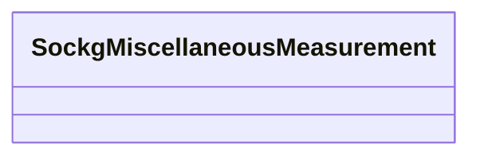

# Class: No class (entity type) name specified (sockg_MiscellaneousMeasurement)


_No class (type) description specified_


URI: [sockg:MiscellaneousMeasurement](https://idir.uta.edu/sockg-ontology/docs/MiscellaneousMeasurement)





<!-- no inheritance hierarchy -->


## Slots

| Name | Cardinality and Range | Description | Inheritance | Occurrences |
| ---  | --- | --- | --- | --- |


## Usages

| used by | used in | type | used |
| ---  | --- | --- | --- |
| [SockgPublication](../classes/SockgPublication.md) | [sockg_description](../slots/sockg_description.md) | domain | [SockgMiscellaneousMeasurement](../classes/SockgMiscellaneousMeasurement.md) |


## See Also

* [https://lod.nal.usda.gov/nalt/2179](https://lod.nal.usda.gov/nalt/2179)


## LinkML Source

<!-- TODO: investigate https://stackoverflow.com/questions/37606292/how-to-create-tabbed-code-blocks-in-mkdocs-or-sphinx -->

### Direct

<details>

```yaml
name: sockg_MiscellaneousMeasurement
conforms_to: No schema conformance document specified
description: No class (type) description specified
title: No class (entity type) name specified
from_schema: soc-kg
see_also:
- https://lod.nal.usda.gov/nalt/2179
rank: 1000
class_uri: sockg:MiscellaneousMeasurement

```
</details>

### Induced

<details>

```yaml
name: sockg_MiscellaneousMeasurement
conforms_to: No schema conformance document specified
description: No class (type) description specified
title: No class (entity type) name specified
from_schema: soc-kg
see_also:
- https://lod.nal.usda.gov/nalt/2179
rank: 1000
class_uri: sockg:MiscellaneousMeasurement

```
</details>